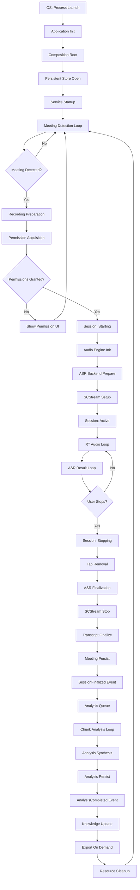
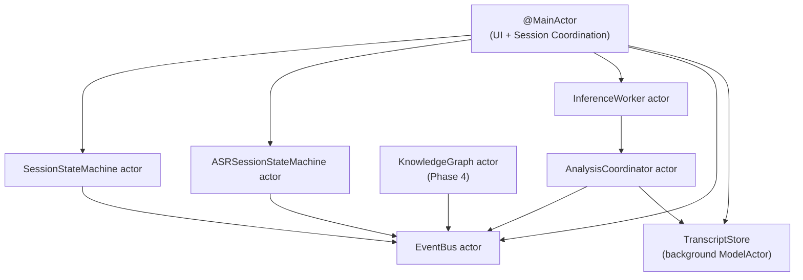
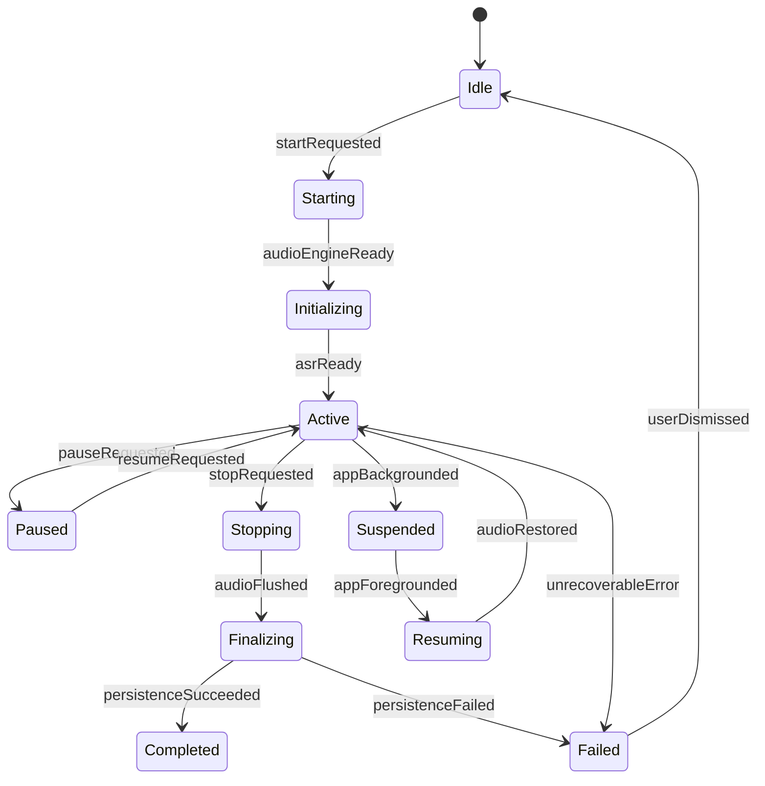
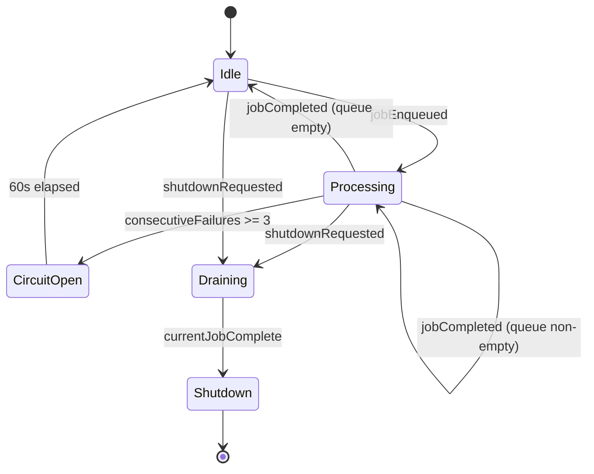
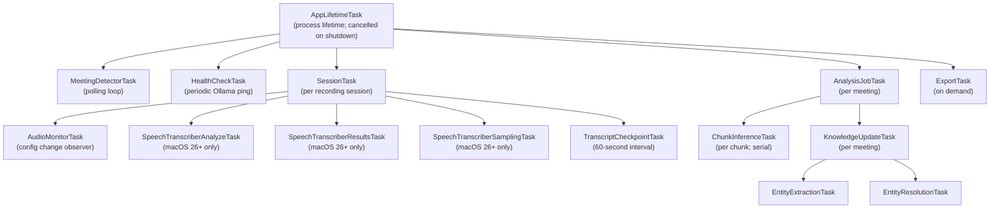

# Document 14: Runtime Architecture and Concurrency

**Repository**: Orin  
**Series**: Architecture V2  
**Document**: 14 — Runtime Architecture and Concurrency  
**Status**: Authoritative  
**Date**: 2026-07-01  
**Roles**: Chief Systems Architect · Principal Concurrency Engineer · Runtime Systems Designer · Performance Architect · Distributed Systems Engineer

---

> **Purpose of this document**
>
> This is the single authoritative description of how Orin behaves at runtime. It describes execution, not classes. It describes ownership, not APIs. Every future developer, architect, and pull-request reviewer is expected to have read this document and to keep it current when they change any aspect of execution behaviour.
>
> Nothing in this document describes how things work today in V1. It describes how they must work in V2 and every subsequent version, on every platform Orin will ever run on.

---

## Table of Contents

1. [Complete Runtime Lifecycle](#1-complete-runtime-lifecycle)
2. [Recording Runtime Flow](#2-recording-runtime-flow)
3. [Concurrency Model](#3-concurrency-model)
4. [Thread Ownership](#4-thread-ownership)
5. [Queue Ownership](#5-queue-ownership)
6. [Memory Ownership](#6-memory-ownership)
7. [Cancellation Tree](#7-cancellation-tree)
8. [Performance Budgets](#8-performance-budgets)
9. [Crash Prevention Rules](#9-crash-prevention-rules)
10. [Observability](#10-observability)
11. [Failure Recovery](#11-failure-recovery)
12. [Engineering Principles](#12-engineering-principles)
13. [Migration Validation](#13-migration-validation)

---

## 1. Complete Runtime Lifecycle

This section describes every stage of Orin's execution, from the moment the OS transfers control to the process, until the last byte is written to disk on shutdown.

### 1.0 Lifecycle Overview



---

### Stage 1.1 — Application Launch

| Property | Value |
|----------|-------|
| **Owner** | OS → `OrinApp` (SwiftUI `@main`) |
| **Executes on** | Main thread / @MainActor |
| **Inputs** | Process environment, entitlements, stored `UserDefaults`, persisted SwiftData container |
| **Outputs** | SwiftUI scene graph instantiated; `ContentView` rendered |
| **Expected duration** | < 2 000 ms to first interactive frame (P95) |
| **Critical path** | `ModelContainer.init()` is synchronous on @MainActor and dominates startup time if the schema migration is non-trivial |

**Execution sequence**:

1. Dynamic linker loads `Orin.app/Contents/MacOS/Orin`; initialises all Swift runtime metadata
2. `OrinApp.init()` runs on @MainActor
3. `ModelContainer` is created with the current schema version; if a migration is needed, it runs synchronously here — this is the only acceptable synchronous I/O on startup
4. `OrinApp.body` evaluates; `ContentView` is added to the scene
5. SwiftUI draws the initial frame

**Failure modes**:
- `ModelContainer.init` throws: schema migration failed. Recovery: show migration-failure UI; offer to reset database (after explicit user confirmation). Never silently discard data.
- Process kills during startup (Jetsam on iOS; memory pressure): handled by OS; no recovery needed at application layer.

**Cancellation**: Not applicable; startup is synchronous.

---

### Stage 1.2 — Composition Root

| Property | Value |
|----------|-------|
| **Owner** | `OrinApp.init()` |
| **Executes on** | @MainActor |
| **Inputs** | Resolved `ModelContainer`; `UserDefaults`; `FeatureFlagStore` |
| **Outputs** | All service instances created; all protocols satisfied; all dependencies injected |
| **Expected duration** | < 100 ms |

**Execution sequence**:

1. `EventBus` actor instantiated (no dependencies)
2. `PersistenceStore` adapter created with `ModelContainer`
3. `FeatureFlagStore` created reading from `UserDefaults`
4. `InferenceProvider` (e.g. `OllamaInferenceAdapter`) created
5. `InferenceWorker` actor created with `InferenceProvider`
6. `ASRBackendRouter` created with `FeatureFlagStore`
7. `VocabularyProvider` created with `PersistenceStore`
8. `TranscriptStore` created with `PersistenceStore`
9. `AnalysisCoordinator` created with `InferenceWorker`, `TranscriptStore`, `EventBus`
10. `SessionStateMachine` actor created with `EventBus`
11. `ASRSessionStateMachine` actor created
12. `RecordingSessionCoordinator` created with all of the above
13. `MeetingDetectorService` created with `CalendarProvider`, `AccessibilityProvider`, `EventBus`
14. `KnowledgeGraph` actor created with SQLite adapter (Phase 4)
15. All services registered as `@StateObject` or `@Environment` values for SwiftUI

**Invariants**:
- No service is instantiated more than once
- No circular dependencies are permitted (verified at compile time via constructor injection)
- No `ServiceContainer.shared` or service locator is used
- All dependencies are resolved before `OrinApp.body` returns

**Failure modes**:
- Missing entitlement discovered: app proceeds; affected feature shows disabled state
- `InferenceProvider.isAvailable()` returns false: analysis features disabled; Ollama setup prompt shown

---

### Stage 1.3 — Persistent Store Open

| Property | Value |
|----------|-------|
| **Owner** | `SwiftDataPersistenceAdapter` |
| **Executes on** | @MainActor (main `ModelContext`); background `ModelActor` for writes |
| **Inputs** | `ModelContainer` from Stage 1.2 |
| **Outputs** | `ModelContext` ready; background write actor ready |
| **Expected duration** | < 500 ms (first launch with migration); < 50 ms (subsequent launches) |

**Execution sequence**:

1. `ModelContainer` already initialised in Stage 1.1
2. `SwiftDataPersistenceAdapter` creates a background `ModelActor` for all write operations
3. Main `ModelContext` (read-only, for `@Query`) is available immediately
4. `@Attribute(.externalStorage)` fields (large transcripts) are not loaded into memory until explicitly fetched

**Invariants**:
- The main `ModelContext` is used only for `@Query` in SwiftUI views
- All `context.save()` calls run on the background `ModelActor`, never on @MainActor
- `MeetingItem.rawTranscript` uses `@Attribute(.externalStorage)` to keep RSS below budget during list display

---

### Stage 1.4 — Service Startup

| Property | Value |
|----------|-------|
| **Owner** | `RecordingSessionCoordinator`, `MeetingDetectorService` |
| **Executes on** | @MainActor (coordinator start); background Task (health checks) |
| **Inputs** | Composition root from Stage 1.2 |
| **Outputs** | `MeetingDetectorService` listening; `HealthCheckService` reporting; overlay visible |
| **Expected duration** | < 500 ms |

**Execution sequence**:

1. `MeetingDetectorService.start()` called; begins polling `CalendarProvider` and monitoring audio activity
2. `OverlayProvider.register()` called; status bar item appears
3. Background `Task` spawned: `HealthCheckService.checkOllama()` with 10-second result cache
4. Background `Task` spawned: `HealthCheckService.checkWhisper()` if configured

**Failure modes**:
- Calendar access denied: `MeetingDetectorService` falls back to audio-activity-only detection
- Ollama unavailable at startup: analysis features show disabled state; health check retried every 30 seconds in background

---

### Stage 1.5 — Meeting Detection Loop

| Property | Value |
|----------|-------|
| **Owner** | `MeetingDetectorService` |
| **Executes on** | Background `Task` (calendar polling); @MainActor (event emission) |
| **Inputs** | Calendar events from `CalendarProvider`; audio activity from `SystemAudioCaptureProvider` |
| **Outputs** | `MeetingDetected` event on `EventBus`; or nothing |
| **Expected duration** | Runs continuously until app exit |
| **Cancellation** | `MeetingDetectorService.stop()` cancels the polling `Task` |

**Execution sequence**:

1. `CalendarProvider.upcomingEvents()` polled every 60 seconds
2. If a calendar event starts within the next 2 minutes: `MeetingDetected` emitted with `.calendar` source and `confidence = 0.95`
3. `SystemAudioCaptureProvider` monitors for sustained audio activity (> 30 dB for > 5 seconds): `MeetingDetected` emitted with `.audioActivity` source and `confidence = 0.65`
4. If both signals coincide within 60 seconds: higher-confidence signal takes precedence

---

### Stage 1.6 — Recording Preparation

| Property | Value |
|----------|-------|
| **Owner** | `RecordingSessionCoordinator` |
| **Executes on** | @MainActor |
| **Inputs** | `MeetingDetected` event (or user tap) |
| **Outputs** | Permission state known; recording can start |
| **Expected duration** | 0 ms (already prepared) or up to 30 s waiting for user permission dialog |
| **Cancellation** | User dismisses permission dialog; coordinator returns to idle |

**Execution sequence**:

1. `RecordingSessionCoordinator` receives `MeetingDetected` (or `startRecording()` direct call)
2. `SessionStateMachine.transition(.idle → .starting)` called — if guard fails (already recording), event is dropped
3. Permissions checked: microphone, screen recording (if participant audio enabled), speech recognition
4. If any permission missing: `SessionStateMachine.transition(.starting → .failed)` with `.permissionDenied` reason; UI shows system settings prompt

---

### Stage 1.7 — Audio Engine Initialization

| Property | Value |
|----------|-------|
| **Owner** | `AVAudioEngineAdapter` |
| **Executes on** | @MainActor (setup calls); Core Audio HAL (internal thread creation) |
| **Inputs** | Desired audio format (48kHz, 1024 frames, Float32 non-interleaved) |
| **Outputs** | `AVAudioEngine` configured; input node ready for tap installation |
| **Expected duration** | < 500 ms |
| **Cancellation** | `AVAudioEngine.stop()` + `invalidate()` |

**Execution sequence**:

1. `AVAudioEngine` instantiated (lazy; spins up Core Audio background threads on first access)
2. Input format negotiated with `AVAudioInputNode`
3. `AVAudioEngine.prepare()` called — initialises the AVAudioEngineGraph; calls into HAL; one-time cost
4. Configuration-change observer installed: `AVAudioEngineConfigurationChange` notification → `Task { @MainActor in }` (never `DispatchQueue.main.async`)
5. `AVAudioEngine.start()` called — Core Audio IO thread begins running at system-assigned period

**Critical invariants**:
- `AVAudioEngine.prepare()` is called once per session; calling it while the engine is running causes an assertion failure
- The configuration-change handler must hop to @MainActor via `Task { @MainActor in }`, not via `DispatchQueue.main.async`, to remain in the Swift Concurrency world and avoid priority inversion

---

### Stage 1.8 — ASR Backend Preparation

| Property | Value |
|----------|-------|
| **Owner** | `ASRBackendRouter` → selected `ASRBackend` |
| **Executes on** | @MainActor (selection); background Task (Whisper warm-up if selected) |
| **Inputs** | `Locale` from `VocabularyProvider.speechLocale`; 100-term vocabulary from `VocabularyContext` |
| **Outputs** | `ASRBackend` in `Ready` state; vocabulary applied |
| **Expected duration** | < 200 ms (SFSpeech/SpeechTranscriber); < 5 s (Whisper model load) |

**Execution sequence**:

1. `ASRBackendRouter.select(locale:)` evaluates: if locale is `hi-IN` → `WhisperASRBackend`; if locale is `en-IN` or `en-*` + `FeatureFlags.useNewMicPipeline` → `SpeechTranscriberASRAdapter`; otherwise → `SFSpeechASRAdapter`
2. `VocabularyContext.build(locale:)` assembles the 100-term budget across tiers; emits `VocabularyBudgetExceeded` if truncated
3. Selected `ASRBackend.prepare(locale:vocabulary:)` called
4. For SFSpeech: `SFSpeechAudioBufferRecognitionRequest` created; `shouldReportPartialResults = true`; custom vocabulary set
5. For SpeechTranscriber (macOS 26+): `MicTranscriberFeed` created; analysis task spawned
6. For Whisper: connection to `localhost:[port]/transcribe` verified; model warmed

---

### Stage 1.9 — ScreenCaptureKit Setup (Participant Audio)

| Property | Value |
|----------|-------|
| **Owner** | `SCKitSystemAudioAdapter` |
| **Executes on** | @MainActor (SCStream creation); `SCStreamOutputQueue` (buffer callbacks) |
| **Inputs** | Screen Recording permission; `FeatureFlags.useNewParticipantPipeline` |
| **Outputs** | `SCStream` running; participant audio buffers flowing to second ASR channel |
| **Expected duration** | < 1 000 ms |
| **Cancellation** | `SCStream.stopCapture()` |

**Execution sequence**:

1. `SCShareableContent.current()` called async; returns available displays and apps
2. `SCStreamFilter` created: audio-only (no video frames)
3. `SCStreamConfiguration` set: 48kHz, no video, low latency
4. `SCStream` instantiated with filter and configuration
5. `SCStream.addStreamOutput(self, type: .audio, sampleHandlerQueue: SCStreamOutputQueue)` — output handler runs on dedicated dispatch queue, NOT the Core Audio IO thread
6. `SCStream.startCapture()` called

**Critical invariants**:
- The `SCStreamOutput` callback runs on `SCStreamOutputQueue` (a concurrent `DispatchQueue`), which is separate from the Core Audio IO thread. Audio format conversion (`AVAudioConverter`) must be instantiated before the callback fires, not inside it.
- Screen Recording permission must be verified before `SCStream.startCapture()`. Starting an `SCStream` without permission crashes the process (TCC violation).

---

### Stage 1.10 — Session: Active (RT Audio Loop)

| Property | Value |
|----------|-------|
| **Owner** | `TapState` (RT boundary) |
| **Executes on** | Core Audio IO thread (tap callback); @MainActor (ASR results) |
| **Inputs** | `AVAudioPCMBuffer` from Core Audio HAL — 1024 frames at 48 kHz |
| **Outputs** | Audio written to `AVAudioFile` on disk; buffer appended to `SFSpeechAudioBufferRecognitionRequest` |
| **Expected duration** | Continuous; tap callback fires every 21.3 ms |

**Tap callback execution budget**:
- Total period: 21.3 ms (1024 frames ÷ 48 000 Hz)
- Allowed callback duration: **< 0.1 ms** (< 0.5% of period)
- Allowed operations: pre-allocated buffer copy, `AVAudioFile.write(from:)` (kernel buffered write — acceptable if file is on a local SSD), `recognitionRequest?.append(buffer)` (memcpy to shared memory — acceptable if XPC call is NOT made inside the lock)
- Prohibited operations: heap allocation, any blocking lock (NSLock held across XPC boundary), any network I/O, any IPC, any system call with unbounded latency

**Execution per tap callback**:
```
Core Audio IO Thread
│
├── TapState.feed(buffer:) entered
│   ├── lock.withLock {
│   │   ├── recognitionRequest?.append(buffer)  ← memcpy to shared memory; no XPC here
│   │   └── audioFile?.write(from: buffer)      ← kernel-buffered write
│   └── }
└── Returns in < 0.1 ms
```

**ASR result arrival** (separate from RT loop):
```
SpeechRecognitionTask callback thread (arbitrary background thread)
│
└── Task { @MainActor in }
    └── RecordingSessionCoordinator processes result
        └── TranscriptStore.append(segment:)
```

---

### Stage 1.11 — Transcript Checkpointing

| Property | Value |
|----------|-------|
| **Owner** | `TranscriptStore` |
| **Executes on** | Background `ModelActor` |
| **Inputs** | Finalized transcript segments accumulating in memory |
| **Outputs** | Durable checkpoint in SwiftData |
| **Expected duration** | < 50 ms per checkpoint |
| **Frequency** | Every 60 seconds of active recording (configurable) |

**Invariants**:
- Checkpoint writes occur on the background `ModelActor`, never on @MainActor
- Checkpoint must complete before the next checkpoint interval begins (prevents queuing)
- If the checkpoint write fails 3 times consecutively, `ResourceBudgetExceeded` is emitted and the session is marked as potentially incomplete

---

### Stage 1.12 — Session Stop

| Property | Value |
|----------|-------|
| **Owner** | `RecordingSessionCoordinator` |
| **Executes on** | @MainActor |
| **Inputs** | `stopRecording()` call (user action, meeting-ended detection, or error recovery) |
| **Outputs** | Audio pipeline torn down; ASR finalized; resources released |
| **Expected duration** | < 3 000 ms P95 |

**Tear-down sequence (order is mandatory)**:

```
1. SessionStateMachine.transition(.active → .stopping)
2. AVAudioEngine.inputNode.removeTap(onBus: 0)          ← tap removed; no more RT callbacks
3. AVAudioEngine.stop()                                  ← engine stopped
4. [CRITICAL] TapState.updateRequest(nil) OR TapState.disarm()
   — releases recognitionRequest AFTER removeTap, so no feed() can be in-flight
   — endAudio() called OUTSIDE the NSLock to avoid blocking the RT thread on XPC
5. SpeechTranscriber pipeline: cancel analyzeTask, cancel resultsTask (await both)
6. SCStream.stopCapture()                                ← participant audio stopped
7. AVAudioEngine.invalidate()                            ← Core Audio resources freed
8. TranscriptStore.finalize(sessionID:)                  ← final consistency check
9. PersistenceStore.save(meeting:)                       ← durable commit
10. EventBus.publish(SessionFinalized(...))              ← triggers analysis
11. SessionStateMachine.transition(.stopping → .completed)
```

**Critical ordering rule**: `removeTap()` must return before `disarm()` is called. `removeTap()` is synchronous and ensures the tap closure (running on the RT thread) has fully returned. Only then is it safe to release the resources that the tap closure references.

---

### Stage 1.13 — AI Analysis

| Property | Value |
|----------|-------|
| **Owner** | `InferenceWorker` actor (serial execution) |
| **Executes on** | `InferenceWorker` actor executor (background thread from cooperative pool) |
| **Inputs** | `SessionFinalized` event with `meetingID`; transcript text from `TranscriptStore` |
| **Outputs** | `MeetingAnalysis` persisted to `MeetingItem` in SwiftData; `AnalysisCompleted` event |
| **Expected duration** | < 90 s per chunk (P95); total session limited to 8 chunks × 90 s = 720 s worst case |

**Execution sequence**:

1. `AnalysisCoordinator` receives `SessionFinalized` via `EventBus` subscription
2. `AnalysisCoordinator` reads transcript from `TranscriptStore`; determines chunk count (every N words, configurable)
3. `InferenceWorker.enqueue(AnalysisJob)` called for each chunk — **serial enqueue, not concurrent**
4. `InferenceWorker` dequeues one job at a time; calls `InferenceProvider.infer(job:)` (HTTP to Ollama)
5. `ChunkAnalyzed` event emitted after each chunk completes
6. After all chunks: `AnalysisCoordinator` synthesises results across chunks (cross-chunk dedup, action item consolidation)
7. `structuredActionItemsJSON` written as canonical format; `effectiveActionItemCount` computed
8. `PersistenceStore.saveAnalysis(_:for:)` called on background `ModelActor`
9. `AnalysisCompleted` event emitted

**Circuit breaker**:
- 3 consecutive chunk failures → `InferenceWorker` enters `CircuitOpen` state
- No new jobs accepted for 60 seconds
- After 60 seconds: `CircuitOpen → Idle`; queued jobs resume
- `AnalysisFailed` event emitted for the meeting whose job tripped the breaker

---

### Stage 1.14 — Knowledge Graph Update (Phase 4)

| Property | Value |
|----------|-------|
| **Owner** | `KnowledgeGraph` actor |
| **Executes on** | `KnowledgeGraph` actor executor (background thread) |
| **Inputs** | `AnalysisCompleted` event; meeting transcript; extracted entities |
| **Outputs** | SQLite graph updated; `EntityLinked` events emitted |
| **Expected duration** | < 5 000 ms per meeting |

**Execution sequence**:

1. `NLTaggerEntityExtractor.extract(from:)` runs on background Task; NL framework tokenises transcript
2. Extracted `[ExtractedEntity]` passed to `EntityResolver.resolve(_:)`
3. `EntityResolver` queries `KnowledgeGraph` for existing nodes matching each entity (by canonical name)
4. New nodes inserted; existing nodes updated with occurrence count and timestamp
5. Edges inserted for co-occurring entities within the same transcript window
6. `EntityLinked` events emitted for each new edge
7. `KnowledgeQueryService` invalidates caches touched by updated nodes

---

### Stage 1.15 — Export (On Demand)

| Property | Value |
|----------|-------|
| **Owner** | `ExportService` |
| **Executes on** | Background `Task`; PDF rendering on @MainActor if using AppKit/SwiftUI rendering |
| **Inputs** | `MeetingItem` with completed analysis |
| **Outputs** | PDF or Markdown file at user-selected path |
| **Expected duration** | < 5 000 ms |
| **Cancellation** | `Task.cancel()` from UI on user dismiss |

---

### Stage 1.16 — Application Shutdown

| Property | Value |
|----------|-------|
| **Owner** | SwiftUI scene lifecycle → `OrinApp` |
| **Executes on** | @MainActor |
| **Inputs** | `NSApplicationWillTerminate` / scene phase `.background` |
| **Outputs** | All pending SwiftData saves committed; all Tasks cancelled; all actors drained |
| **Expected duration** | < 2 000 ms |

**Shutdown sequence**:

1. `MeetingDetectorService.stop()` — cancels polling task
2. If recording active: `RecordingSessionCoordinator.stop()` — triggers full Stage 1.12 sequence
3. `InferenceWorker.shutdown()` — drains current job; refuses new jobs (`Draining → Shutdown`)
4. `EventBus` — all subscriptions cancelled; no more events delivered
5. `KnowledgeGraph` — WAL checkpoint committed to SQLite
6. `SwiftDataPersistenceAdapter` — `ModelContext.save()` on background actor
7. Process exits

**Invariant**: If recording is active when shutdown is initiated, the partial transcript must be checkpointed before the process exits. A best-effort checkpoint is always attempted, even under memory pressure.

---

## 2. Recording Runtime Flow

This section shows every callback, async boundary, and actor hop during a single recording session. Read the swim lanes left-to-right as time flows downward.

### 2.1 Full Recording Sequence Diagram

```mermaid
sequenceDiagram
    autonumber

    participant User
    participant MainActor as RecordingSessionCoordinator<br/>@MainActor
    participant SSM as SessionStateMachine<br/>actor
    participant ASR as ASRSessionStateMachine<br/>actor
    participant EB as EventBus<br/>actor
    participant AVEngine as AVAudioEngineAdapter<br/>@MainActor
    participant RT as Core Audio IO Thread<br/>(non-actor, HAL-managed)
    participant TapState as TapState<br/>(NSLock boundary)
    participant SpeechTask as SFSpeechRecognitionTask<br/>(background thread)
    participant SCKit as SCKitSystemAudioAdapter<br/>@MainActor
    participant SCQ as SCStreamOutputQueue<br/>(dispatch queue)
    participant TStore as TranscriptStore<br/>(background ModelActor)
    participant IW as InferenceWorker<br/>actor
    participant ACoord as AnalysisCoordinator<br/>actor

    User->>MainActor: startRecording()
    MainActor->>SSM: transition(.idle → .starting)
    SSM-->>EB: publish(SessionStarting)
    MainActor->>MainActor: requestPermissions()
    MainActor->>AVEngine: prepare(format: 48kHz/1024frames)
    AVEngine->>AVEngine: AVAudioEngine.prepare()
    Note over AVEngine: One-time HAL graph setup; < 500ms
    MainActor->>TapState: arm(audioFile:, recognitionRequest:)
    Note over TapState: Pre-allocates resources; lock-protected
    MainActor->>AVEngine: installTap(onBus: 0)
    AVEngine-->>RT: installTap closure registered
    MainActor->>AVEngine: AVAudioEngine.start()
    Note over AVEngine,RT: Core Audio IO thread begins firing

    loop Every 21.3 ms (1024 frames @ 48kHz)
        RT->>TapState: feed(buffer:)
        Note over TapState,RT: NSLock held < 0.1ms
        TapState->>TapState: recognitionRequest?.append(buffer) [XPC memcpy]
        TapState->>TapState: audioFile?.write(from: buffer) [kernel-buffered]
    end

    MainActor->>SCKit: startCapture()
    SCKit->>SCKit: SCStream.startCapture()

    loop SCStream audio buffers (non-RT; separate queue)
        SCQ->>SCQ: didOutputSampleBuffer(buffer, type: .audio)
        SCQ->>SCQ: AVAudioConverter.convert(buffer) [pre-allocated]
        SCQ->>ASR: secondChannelBuffer(buffer)
        Note over SCQ,ASR: hop to ASR actor; not on RT thread
    end

    SSM->>EB: publish(SessionStarted(...))
    SSM-->>MainActor: state == .active

    loop SFSpeech recognition results (background thread → @MainActor)
        SpeechTask->>SpeechTask: result callback fires
        SpeechTask->>MainActor: Task { @MainActor in recognitionResult }
        MainActor->>TStore: append(segment: TranscriptSegment)
        TStore->>EB: publish(SegmentAdded(...))
        EB-->>MainActor: LiveTranscriptView updates
    end

    loop Every 60 seconds: ASR restart (SFSpeech max duration)
        MainActor->>MainActor: startRecognitionTask(nextRequest)
        MainActor->>TapState: updateRequest(nextRequest)
        Note over TapState: Swaps request under NSLock; endAudio() called OUTSIDE lock
        TapState->>TapState: old?.endAudio() [outside lock; XPC safe]
    end

    loop Every 60 seconds: transcript checkpoint
        TStore->>TStore: ModelActor.save()
        Note over TStore: Background ModelActor; never @MainActor
    end

    User->>MainActor: stopRecording()
    MainActor->>SSM: transition(.active → .stopping)
    SSM-->>EB: publish(SessionStopped(...))
    MainActor->>AVEngine: inputNode.removeTap(onBus: 0)
    Note over AVEngine,RT: Synchronous; waits for any in-flight feed() to return
    MainActor->>AVEngine: stop()
    MainActor->>TapState: disarm()
    Note over TapState: endAudio() inside lock here is safe: no more RT callbacks
    MainActor->>SCKit: stopCapture()
    MainActor->>ASR: transition(.ready → .finalizing)
    ASR-->>SpeechTask: awaits final results
    SpeechTask-->>MainActor: final result callback (isFinal: true)
    MainActor->>TStore: finalize(sessionID:)
    TStore->>TStore: ModelActor.finalConsistencyCheck()
    TStore-->>MainActor: TranscriptFinalizedResult
    MainActor->>TStore: saveToMeeting(meetingID:)
    TStore->>TStore: ModelActor.save()
    SSM->>EB: publish(SessionFinalized(meetingID:...))
    SSM-->>MainActor: state == .completed

    EB-->>ACoord: SessionFinalized received
    ACoord->>TStore: fetchTranscript(meetingID:)
    TStore-->>ACoord: fullTranscriptText
    ACoord->>IW: enqueue(AnalysisJob(meetingID: ..., chunks: [...]))
    EB-->>MainActor: publish(AnalysisQueued)

    loop Each chunk (serial; InferenceWorker enforces)
        IW->>IW: dequeue next job
        IW->>IW: OllamaInferenceAdapter.infer(job:) [HTTP POST localhost:11434]
        IW-->>ACoord: ChunkAnalysisResult
        ACoord->>EB: publish(ChunkAnalyzed(...))
    end

    ACoord->>ACoord: synthesise(allChunkResults)
    ACoord->>TStore: saveAnalysis(analysis, for: meetingID)
    TStore->>TStore: ModelActor.save()
    ACoord->>EB: publish(AnalysisCompleted(...))
    EB-->>MainActor: MeetingListView updates badge
```

### 2.2 Actor Hop Summary

Every time execution crosses an actor boundary, the Swift runtime inserts an implicit suspension point. The table below lists every mandatory actor hop in the recording flow.

| From | To | Mechanism | Why |
|------|----|-----------|-----|
| Core Audio IO Thread | @MainActor | `Task { @MainActor in }` inside SFSpeech callback | ASR results must update @MainActor-isolated state |
| @MainActor | `ASRSessionStateMachine` | `await asrStateMachine.transition(...)` | Actor hop; suspends @MainActor |
| @MainActor | `InferenceWorker` | `await inferenceWorker.enqueue(...)` | Actor hop; may suspend |
| @MainActor | `TranscriptStore` (background) | `await transcriptStore.append(...)` | Background ModelActor hop |
| `InferenceWorker` | `OllamaInferenceAdapter` | `await adapter.infer(...)` | HTTP call; suspends actor |
| `AnalysisCoordinator` | `EventBus` | `await eventBus.publish(...)` | EventBus actor hop |
| `EventBus` | subscriber actors | Actor message send | Delivery to each subscriber's executor |
| SCStreamOutputQueue | `ASRSessionStateMachine` | `Task { await asrSM.secondChannel(...) }` | Leave dispatch queue; enter actor world |

---

## 3. Concurrency Model

Orin's concurrency model is built on Swift's structured concurrency. Every piece of mutable state is owned by exactly one actor. The @MainActor owns UI state and session coordination. Specialized actors own independent subsystems.

### 3.1 Actor Inventory



---

### 3.2 @MainActor

| Property | Value |
|----------|-------|
| **Purpose** | All SwiftUI view state; session lifecycle coordination; audio engine setup; permission requests |
| **Owned state** | All `@Observable` / `@Published` view models; `RecordingSessionCoordinator` instance; `FeatureFlagStore`; `HealthCheckService`; `MeetingDetectorService` reference |
| **Allowed mutations** | Any property of any `@MainActor`-isolated type |
| **Allowed callers** | SwiftUI runtime; user gestures; `Task { @MainActor in }` from any context |
| **Lifetime** | Process lifetime |
| **Cancellation** | Not applicable; @MainActor is a global actor and cannot be cancelled |
| **Isolation rules** | Code annotated `@MainActor` or within `Task { @MainActor in }` only; GCD `DispatchQueue.main.async` is **forbidden** (bypasses Swift Concurrency's priority system) |
| **Expected thread** | The process's main thread |
| **Expected executor** | Swift main actor executor |

**What @MainActor must NOT do**:
- Perform synchronous disk I/O (SwiftData `context.save()`, file writes)
- Execute long-running computation (prompt building, response parsing)
- Block on another actor with `Task.sleep` longer than 16 ms
- Call `withTaskGroup` for unbounded concurrent work
- Mutate `ModelContext` directly (use background `ModelActor`)

---

### 3.3 SessionStateMachine Actor

| Property | Value |
|----------|-------|
| **Purpose** | Enforce valid session state transitions; emit session domain events |
| **Owned state** | `currentState: SessionState`; `sessionID: UUID?`; `lastTransitionAt: Date`; `history: [SessionTransition]` |
| **Allowed mutations** | `currentState` via `transition(_:trigger:)` only; no external direct mutation |
| **Allowed callers** | `RecordingSessionCoordinator` (@MainActor) only |
| **Lifetime** | Process lifetime (singleton actor) |
| **Cancellation** | `transition(.active → .stopping)` is the cancellation path; actor itself is never cancelled |
| **Isolation rules** | All state reads and writes must use `await stateMachine.currentState`; never read state by bypassing the actor |
| **Expected thread** | Swift cooperative thread pool (background) |
| **Expected executor** | Default actor executor |

**State machine** (full specification in M-07):



**Transition guard rule**: Every `transition(to:trigger:)` call must validate the requested transition against the valid transition table. An invalid transition throws `SessionError.invalidTransition(from:to:)`. This exception is caught by `RecordingSessionCoordinator` and logged; it never reaches the UI as a crash.

---

### 3.4 ASRSessionStateMachine Actor

| Property | Value |
|----------|-------|
| **Purpose** | Manage the ASR backend lifecycle for one recording session; handle Error 1110 (SFSpeech max-duration) restarts |
| **Owned state** | `state: ASRSessionState`; `currentGeneration: Int`; `pendingRequest: SFSpeechAudioBufferRecognitionRequest?`; `watchdogTask: Task<Void, Never>?` |
| **Allowed mutations** | `state` via `transition(_:)` only; `currentGeneration` incremented atomically on each restart |
| **Allowed callers** | `RecordingSessionCoordinator`; `SFSpeechRecognitionTask` callbacks (via `Task { await asrSM.didReceiveResult(...) }`) |
| **Lifetime** | One per recording session; created at session start, destroyed after finalization |
| **Cancellation** | `transition(.any → .failed)` or session-level `Task.cancel()` |
| **Isolation rules** | The `currentGeneration` counter is owned by this actor; no external code reads or writes it directly |
| **Expected thread** | Swift cooperative thread pool |
| **Expected executor** | Default actor executor |

**Stale callback rejection**: When an ASR result callback arrives, the callback captures the generation number at the time the `SFSpeechRecognitionTask` was created. The actor compares this to `currentGeneration`. If they differ, the result is discarded. This replaces the TOCTOU-vulnerable integer comparison in V1.

**Watchdog timer**: If `state == .initializing` for > 10 seconds with no speech result: `transition(.initializing → .restarting)`. This prevents silent ASR hangs from appearing as a recording that "worked" but produced an empty transcript.

---

### 3.5 InferenceWorker Actor

| Property | Value |
|----------|-------|
| **Purpose** | Serial execution of local LLM inference jobs; circuit breaker; backpressure |
| **Owned state** | `queue: [AnalysisJob]`; `isProcessing: Bool`; `consecutiveFailures: Int`; `circuitOpenUntil: ContinuousClock.Instant?`; `state: InferenceWorkerState` |
| **Allowed mutations** | `queue` via `enqueue()` and `dequeue()`; `isProcessing` during job execution; `consecutiveFailures` on error |
| **Allowed callers** | `AnalysisCoordinator` (enqueue); `SettingsView` (manual retry, via coordinator) |
| **Lifetime** | Process lifetime (singleton actor) |
| **Cancellation** | `shutdown()` → `state = .draining`; completes current job; stops dequeueing |
| **Isolation rules** | No caller may directly read `queue` or bypass `enqueue()`; all jobs enter through the public API |
| **Expected thread** | Swift cooperative thread pool |
| **Expected executor** | Default actor executor |

**Backpressure**: If `queue.count > 50`, `enqueue()` throws `InferenceError.queueFull`. The caller (`AnalysisCoordinator`) handles this by setting the meeting's status to `.deferred` and scheduling a retry after 5 minutes.

**State machine**:



---

### 3.6 EventBus Actor

| Property | Value |
|----------|-------|
| **Purpose** | In-process Tier 1 event bus; fan-out delivery to all subscribers; dead-letter queue for Critical-tier events |
| **Owned state** | `subscriptions: [EventTypeKey: [SubscriptionID: AnyHandler]]`; `deadLetterQueue: [DeadLetterEntry]` |
| **Allowed mutations** | `subscribe()`, `unsubscribe()`, `publish()` — all actor-isolated |
| **Allowed callers** | Any actor or @MainActor context |
| **Lifetime** | Process lifetime |
| **Cancellation** | `cancelAll()` on shutdown; all subscriptions removed; pending deliveries dropped |
| **Isolation rules** | Subscribers receive events on their own actor's executor; EventBus never calls subscribers synchronously on its own executor |
| **Expected thread** | Swift cooperative thread pool |
| **Expected executor** | Default actor executor |

**Delivery model**: When `EventBus.publish(event)` is called, for each subscriber the EventBus spawns `Task { await subscriber.handle(event) }`. The Task runs on the subscriber's actor executor. The EventBus does not await the subscriber's `handle()` — delivery is fire-and-forget at the EventBus level. Reliability is achieved by the retry policy within each subscriber.

**Dead-letter queue**: For `Critical`-tier events where delivery to a mandatory subscriber fails (after retries), the event is written to `deadLetterQueue` with the failure reason and timestamp. On next launch, unprocessed dead-letter entries are replayed.

---

### 3.7 TranscriptStore (background ModelActor)

| Property | Value |
|----------|-------|
| **Purpose** | All SwiftData read and write operations for transcript segments and analysis results |
| **Owned state** | Background `ModelContext`; in-memory segment buffer for the active session |
| **Allowed mutations** | `append(segment:)`, `finalize()`, `saveAnalysis()` — all ModelActor-isolated |
| **Allowed callers** | `RecordingSessionCoordinator` (@MainActor → async hop); `AnalysisCoordinator` (actor → actor hop) |
| **Lifetime** | Process lifetime |
| **Cancellation** | On session cancel: `discardSession(sessionID:)` removes in-memory buffer; no SwiftData write |
| **Isolation rules** | The @MainActor `ModelContext` is READ-ONLY (used only by `@Query`); all writes go through this actor's background `ModelContext` |
| **Expected thread** | Swift cooperative thread pool (ModelActor has a dedicated executor) |
| **Expected executor** | `ModelActor` executor |

---

### 3.8 AnalysisCoordinator Actor

| Property | Value |
|----------|-------|
| **Purpose** | Orchestrate end-to-end analysis of a finalized meeting: fetch transcript, build chunks, dispatch to InferenceWorker, synthesise, persist |
| **Owned state** | `activeJobs: [UUID: AnalysisJobHandle]`; `retrySchedule: [UUID: ContinuousClock.Instant]` |
| **Allowed mutations** | `activeJobs` during enqueue and completion |
| **Allowed callers** | EventBus subscription callback (SessionFinalized); SettingsView manual retry via RecordingSessionCoordinator |
| **Lifetime** | Process lifetime |
| **Cancellation** | `cancelAnalysis(meetingID:)` cancels the `InferenceJob` for a meeting in the `InferenceWorker` queue |
| **Expected executor** | Default actor executor |

---

### 3.9 KnowledgeGraph Actor (Phase 4)

| Property | Value |
|----------|-------|
| **Purpose** | Thread-safe read/write access to the SQLite adjacency-list knowledge graph |
| **Owned state** | `db: SQLiteConnection`; `entityCache: [String: GraphNode]` (LRU, max 500 entries) |
| **Allowed mutations** | `insertEntity()`, `insertEdge()`, `updateOccurrence()` |
| **Allowed callers** | `EntityResolver` (via actor hop); `KnowledgeQueryService` (read-only queries) |
| **Lifetime** | Process lifetime |
| **Cancellation** | `close()` on shutdown; WAL checkpoint committed |
| **Expected executor** | Dedicated serial executor (ensures SQLite single-threaded access) |

---

## 4. Thread Ownership

The following table defines exactly which execution context owns each subsystem. No vague or implied ownership is permitted.

| Subsystem | Execution Context | Notes |
|-----------|------------------|-------|
| SwiftUI rendering | Main Thread (@MainActor) | All `@Observable` changes must happen on @MainActor |
| `RecordingSessionCoordinator` | @MainActor | Session lifecycle coordination |
| `OrinApp.init()` (composition root) | @MainActor | Service graph construction |
| `ModelContainer.init()` | @MainActor | Synchronous migration; one-time startup cost |
| `SwiftUI @Query` | @MainActor | Read-only queries; predicate-scoped |
| `SessionStateMachine` | Swift cooperative pool (actor) | Background; never @MainActor |
| `ASRSessionStateMachine` | Swift cooperative pool (actor) | Background; never @MainActor |
| `InferenceWorker` | Swift cooperative pool (actor) | One job at a time; may block on HTTP |
| `EventBus` | Swift cooperative pool (actor) | Fan-out delivery; never @MainActor |
| `AnalysisCoordinator` | Swift cooperative pool (actor) | Orchestration only; no inference |
| `KnowledgeGraph` | Dedicated serial executor (actor) | SQLite requires serial access |
| `TranscriptStore` (writes) | Background ModelActor | Never @MainActor |
| `TranscriptStore` (reads via @Query) | @MainActor | SwiftUI requirement |
| AVAudioEngine tap callback | **Core Audio IO Thread** | HAL-managed; NOT GCD; NOT cooperative pool |
| `TapState.feed(buffer:)` | **Core Audio IO Thread** | Same as tap callback |
| `TapState.arm() / disarm()` | @MainActor | Setup/teardown before/after tap |
| `TapState.updateRequest()` | @MainActor | ASR restart; endAudio() released outside lock |
| `AVAudioEngine.prepare()` | @MainActor | One-time setup |
| `AVAudioEngineConfigurationChange` notification | NotificationCenter delivery thread → `Task { @MainActor in }` | Must hop; never process on notification thread |
| `SFSpeechRecognitionTask` callback | Arbitrary background thread (Apple-managed) | Must hop to @MainActor via `Task { @MainActor in }` |
| `SpeechTranscriber.analyze()` | Swift cooperative pool (background Task) | macOS 26+ only |
| `SCStream` output callback | `SCStreamOutputQueue` (concurrent dispatch queue) | NOT RT; NOT cooperative pool |
| `AVAudioConverter` in SCStream path | `SCStreamOutputQueue` | Converter must be pre-allocated, not created in callback |
| `MeetingDetectorService` polling | Swift cooperative pool (background Task) | Calendar polling every 60s |
| `HealthCheckService` | Swift cooperative pool (background Task) | Ollama ping; 10s cache |
| `VocabularyContext.build()` | @MainActor (or background if called during ASR prepare) | Called once per session start |
| Timer callbacks | @MainActor via `Task { @MainActor in }` | `Timer.publish` + `.receive(on:)` or Task-based timer |
| `OverlayProvider` | @MainActor | NSStatusItem updates |
| `ExportService` | Swift cooperative pool (background Task) | PDF/Markdown generation |
| Ollama HTTP request | Swift cooperative pool (URLSession async) | URLSession managed |
| SQLite operations | Dedicated serial executor (KnowledgeGraph actor) | Thread safety via actor |
| `NLTaggerEntityExtractor` | Swift cooperative pool (background Task) | NL framework; CPU-bound |
| `DecayEngine` daily run | Background Task (launched by NSBackgroundTaskScheduler) | Must complete before background expiry |

---

## 5. Queue Ownership

### 5.1 @MainActor Queue (Main Serial Queue)

| Property | Value |
|----------|-------|
| **Owner** | Swift runtime / @MainActor |
| **Allowed submitters** | `Task { @MainActor in }` from any context; SwiftUI runtime; `NotificationCenter` observer hops |
| **Maximum depth** | Unbounded (OS-managed) |
| **Backpressure** | None; overload is visible as UI jank (frame drops) |
| **Overflow behaviour** | Tasks queue behind each other; frame budget exceeded → dropped frames |
| **Critical rule** | No operation exceeding 16 ms may run on this queue; measured via `CADisplayLink` / Instruments Time Profiler |

### 5.2 Core Audio IO Thread (NOT a GCD queue)

| Property | Value |
|----------|-------|
| **Owner** | macOS Core Audio HAL; NOT accessible via GCD |
| **Allowed submitters** | HAL only; `installTap` closure is the only entry point |
| **Period** | 1024 frames ÷ 48 000 Hz = **21.3 ms** |
| **Budget** | **< 0.1 ms per callback** (< 0.5% of period) |
| **Maximum queue depth** | 1 (each callback must return before the next one fires) |
| **Backpressure** | None; overrun → audio dropout → audible glitch |
| **Overflow behaviour** | The callback is skipped; audio gap is permanent and audible |
| **Allowed operations** | Pre-allocated buffer copy; non-blocking lock (`lock.withLock` around memcpy only); `AVAudioFile.write(from:)` (kernel-buffered) |
| **Forbidden operations** | `malloc()`, `free()`, `NSLock.lock()` across an XPC boundary, any network call, `os_log()` (allocates internally), `print()`, `Task { }` creation |

### 5.3 SCStreamOutputQueue (Concurrent Dispatch Queue)

| Property | Value |
|----------|-------|
| **Owner** | `SCKitSystemAudioAdapter`; passed to `SCStream.addStreamOutput(_:type:sampleHandlerQueue:)` |
| **Allowed submitters** | SCKit framework only |
| **Maximum depth** | OS-managed; frames may be dropped by SCKit if output handler is too slow |
| **Backpressure** | SCKit applies frame-dropping backpressure automatically |
| **Overflow behaviour** | SCKit drops oldest frames; `CMSampleBuffer` pool exhaustion → `SCStreamError.sampleBufferAllocFailed` |
| **Critical rule** | All setup work (AVAudioConverter init, output ASRBackend reference capture) must happen BEFORE the first callback fires, not inside it |

### 5.4 InferenceWorker Serial Job Queue

| Property | Value |
|----------|-------|
| **Owner** | `InferenceWorker` actor |
| **Allowed submitters** | `AnalysisCoordinator` only (via `InferenceWorker.enqueue()`) |
| **Maximum depth** | 50 jobs |
| **Backpressure** | `enqueue()` throws `InferenceError.queueFull` if `queue.count >= 50`; caller marks meeting `.deferred` |
| **Overflow behaviour** | Job rejected; caller schedules retry after 5 minutes |
| **Ordering guarantee** | FIFO; jobs processed in enqueue order |
| **Concurrency** | Strictly serial; never more than one Ollama HTTP request in flight from this actor |

### 5.5 EventBus Delivery Queue

| Property | Value |
|----------|-------|
| **Owner** | `EventBus` actor |
| **Allowed submitters** | Any actor or @MainActor context via `EventBus.publish()` |
| **Maximum depth** | Bounded by number of subscriptions × event rate |
| **Backpressure** | Each subscriber's `handle()` runs as an independent `Task`; slow subscribers do not block the EventBus actor |
| **Overflow behaviour** | Subscriber Tasks accumulate in the Swift cooperative thread pool; pool pressure applies |
| **Ordering guarantee** | Events are published in the order they arrive at the EventBus actor's serial executor; delivery order across subscribers is not guaranteed |

### 5.6 SwiftData Background ModelActor Queue

| Property | Value |
|----------|-------|
| **Owner** | `SwiftDataPersistenceAdapter` |
| **Allowed submitters** | `TranscriptStore`; `AnalysisCoordinator` |
| **Maximum depth** | ModelActor serialises all callers; callers suspend until previous operation completes |
| **Backpressure** | Callers that `await` the ModelActor are automatically suspended; cooperative suspension |
| **Overflow behaviour** | Tasks pile up in the cooperative pool waiting for the ModelActor; latency increases |
| **Critical rule** | Never call `ModelContext.save()` on the @MainActor; always route through this actor |

### 5.7 Swift Cooperative Thread Pool

| Property | Value |
|----------|-------|
| **Owner** | Swift runtime |
| **Allowed submitters** | Any `Task { }` or `Task.detached { }` creation site |
| **Thread count** | Min: 1; Max: `ProcessInfo.processInfo.processorCount` (bounded by core count) |
| **Backpressure** | All actors and cooperative Tasks share this pool; CPU-bound work in one actor slows all others |
| **Critical rule** | No `Task.detached { }` without explicit lifetime management; all detached Tasks must be stored and cancelled on shutdown |

---

## 6. Memory Ownership

This section tracks the lifecycle of every major object that flows through Orin at runtime.

### 6.1 MeetingItem (SwiftData)

| Property | Value |
|----------|-------|
| **Creator** | `RecordingSessionCoordinator.startRecording()` — creates a new `MeetingItem` before session becomes Active |
| **Owner** | `SwiftDataPersistenceAdapter` (background ModelActor owns the ModelContext) |
| **Consumers** | `@Query` in `MeetingsView` (read-only, @MainActor); `AnalysisCoordinator` (reads transcript); `ExportService` |
| **Destroyer** | `SwiftDataPersistenceAdapter.delete(meeting:)` — user-initiated delete |
| **Lifetime** | Persists indefinitely until user deletes; survives app restart |
| **Maximum expected size** | ~50 KB in-memory (fields only); `rawTranscript` in external file storage (~500 KB for 60-min meeting) |
| **Cleanup trigger** | `MeetingRetentionService` runs daily; deletes meetings older than user-configured retention period |
| **Critical rule** | `rawTranscript` must be annotated `@Attribute(.externalStorage)` to keep RSS within budget during list rendering |

### 6.2 TranscriptSegment (in-memory)

| Property | Value |
|----------|-------|
| **Creator** | `ASRBackend` adapter — constructed from SFSpeechRecognitionResult or Whisper response |
| **Owner** | `TranscriptStore` in-memory buffer during active session |
| **Consumers** | `TranscriptDetailView` (live display); `TranscriptStore.finalize()` (persistence) |
| **Destroyer** | `TranscriptStore` after `finalize()` completes; buffer cleared |
| **Lifetime** | Active session lifetime (in-memory); then migrated to `MeetingItem.rawTranscript` (persistent) |
| **Maximum expected size** | ~100 bytes per segment; ~3 600 segments per 60-minute meeting = ~360 KB total buffer |
| **Cleanup trigger** | `TranscriptStore.discardSession()` on session cancel; `TranscriptStore.finalize()` on session completion |

### 6.3 ChunkAnalysisResult (in-memory)

| Property | Value |
|----------|-------|
| **Creator** | `InferenceWorker` — constructed from Ollama HTTP response |
| **Owner** | `AnalysisCoordinator` — stored in `activeJobs[meetingID].chunkResults` |
| **Consumers** | `AnalysisCoordinator.synthesise(allChunkResults)` — consumed once during synthesis |
| **Destroyer** | `AnalysisCoordinator` after synthesis completes; reference dropped |
| **Lifetime** | Duration of analysis job (minutes); not persisted |
| **Maximum expected size** | ~10 KB per chunk result; ~8 chunks × 10 KB = ~80 KB per meeting analysis |

### 6.4 AI Prompt (in-memory)

| Property | Value |
|----------|-------|
| **Creator** | `PromptBuilder.build(chunk:locale:meetingType:)` |
| **Owner** | `InferenceWorker` for duration of the HTTP request |
| **Consumers** | Ollama HTTP request body |
| **Destroyer** | Released after `URLRequest` completes |
| **Lifetime** | Single HTTP round-trip (seconds) |
| **Maximum expected size** | ~8 000 tokens × ~4 bytes/token = ~32 KB per prompt |

### 6.5 AI Response (in-memory)

| Property | Value |
|----------|-------|
| **Creator** | Ollama HTTP response body (streamed) |
| **Owner** | `OllamaInferenceAdapter` for duration of streaming; then `ResponseParser` |
| **Consumers** | `ResponseParser.parse(response:)` |
| **Destroyer** | `ResponseParser` after structured result is extracted |
| **Lifetime** | Single HTTP round-trip + parse time (seconds) |
| **Maximum expected size** | ~4 000 tokens × ~4 bytes/token = ~16 KB |

### 6.6 AVAudioPCMBuffer (RT)

| Property | Value |
|----------|-------|
| **Creator** | Core Audio HAL — provided to tap closure each callback |
| **Owner** | Core Audio HAL (buffer pool owned by the engine) |
| **Consumers** | `TapState.feed()` — reads buffer data; copies to `AVAudioFile` and `recognitionRequest` |
| **Destroyer** | Core Audio HAL — reclaimed after tap callback returns |
| **Lifetime** | Single tap callback invocation (< 0.1 ms) |
| **Maximum expected size** | 1024 frames × 4 bytes (Float32) × 1 channel = **4 096 bytes** |
| **Critical rule** | This buffer MUST NOT be retained beyond the tap callback's return. `TapState.feed()` must complete the copy and return. Retaining the buffer pointer causes undefined behaviour when the HAL reclaims it. |

### 6.7 CMSampleBuffer (SCStream)

| Property | Value |
|----------|-------|
| **Creator** | SCKit framework |
| **Owner** | SCKit buffer pool; reference-counted |
| **Consumers** | `SCKitSystemAudioAdapter` output handler — reads audio data; converts format |
| **Destroyer** | ARC; released when `SCKitSystemAudioAdapter` drops the last reference |
| **Lifetime** | Duration of `didOutputSampleBuffer` callback + any `async` hops that retain it |
| **Maximum expected size** | Variable; typically 1-10 ms of audio at 48kHz = ~192–1 920 bytes |
| **Critical rule** | `CMSampleBuffer` must be consumed and released before the next callback fires. If the adapter is too slow, SCKit will drop frames. |

### 6.8 KnowledgeGraph Node (SQLite-backed)

| Property | Value |
|----------|-------|
| **Creator** | `EntityResolver.resolve(_:)` after entity extraction |
| **Owner** | SQLite database (persistent); `KnowledgeGraph` actor LRU cache (transient) |
| **Consumers** | `KnowledgeQueryService`; `EntityResolver` (merge operations) |
| **Destroyer** | User-initiated graph reset; or retention policy (no reads in > 180 days) |
| **Lifetime** | Persistent across app launches |
| **Maximum expected size** | ~200 bytes per node in SQLite; LRU cache holds 500 nodes = ~100 KB |

### 6.9 AnalysisResult (persisted)

| Property | Value |
|----------|-------|
| **Creator** | `AnalysisCoordinator.synthesise()` → `TranscriptStore.saveAnalysis()` |
| **Owner** | SwiftData `MeetingItem.structuredActionItemsJSON` field |
| **Consumers** | `TranscriptDetailView`; `ExportService` |
| **Destroyer** | With parent `MeetingItem` |
| **Lifetime** | Persistent |
| **Maximum expected size** | ~50 KB JSON for a dense 90-minute meeting |

### 6.10 Audio Converter (SCStream path)

| Property | Value |
|----------|-------|
| **Creator** | `SCKitSystemAudioAdapter.startCapture()` — initialised ONCE before first callback |
| **Owner** | `SCKitSystemAudioAdapter` |
| **Consumers** | `didOutputSampleBuffer` — called per callback on `SCStreamOutputQueue` |
| **Destroyer** | `SCKitSystemAudioAdapter.stopCapture()` |
| **Lifetime** | Active session lifetime |
| **Critical rule** | The converter MUST be created in `startCapture()`, not in `didOutputSampleBuffer`. Creating an `AVAudioConverter` on the output queue per-callback causes heap allocation in the hot path and risks audio dropout. |

---

## 7. Cancellation Tree

Every Swift `Task` must belong to a cancellation hierarchy. No orphan tasks are permitted. When a parent task is cancelled, all children are cancelled automatically through Swift's structured concurrency.

### 7.1 Cancellation Hierarchy



### 7.2 Cancellation Propagation Rules

| Parent cancelled | Children cancelled | Cleanup required |
|-----------------|-------------------|-----------------|
| `AppLifetimeTask` | All tasks | Full teardown; SwiftData save |
| `SessionTask` | `AudioMonitorTask`, all SpeechTranscriber tasks, `CheckpointTask` | `removeTap()`, `endAudio()`, SCStream stop; final checkpoint |
| `AnalysisTask` | `ChunkInferenceTask` (current only; queue preserved for retry) | `InferenceWorker.cancelJob(meetingID:)` |
| `ExportTask` | None | Partial file deleted |

### 7.3 Cancellation Rules (Non-Negotiable)

1. **Every `Task.detached { }` must be stored** in a property and cancelled on owner deallocation or shutdown.
2. **`Task { @MainActor in }` created inside a notification observer must be stored** or cancelled when the observer is removed.
3. **SpeechTranscriber tasks** (`analyzeTask`, `resultsTask`, `samplingTask`) are cancelled in `stopRecording()` in the correct order: `samplingTask` first (stops audio input), then `analyzeTask` and `resultsTask` (stops processing), then `await` both before releasing resources.
4. **`InferenceWorker` job cancellation** removes the job from the queue if it has not yet started; if in flight, the Ollama HTTP request is cancelled via `URLSession.cancel()`.
5. **No `Task.detached` without an explicit `await task.value` or `task.cancel()` in the owner's cleanup path**. Detached tasks that outlive their owner are orphans and constitute a concurrency bug.

---

## 8. Performance Budgets

Every budget has four thresholds. Engineers must instrument and measure against these budgets in every release.

### 8.1 CPU Budgets

| Subsystem | Target | Maximum | Warning Threshold | Critical Threshold | Recovery Strategy |
|-----------|--------|---------|------------------|--------------------|------------------|
| RT audio tap callback | < 0.05 ms | 0.1 ms | 0.07 ms | 0.09 ms | Pre-allocate all resources; NSLock contention investigation |
| SCStream output handler | < 5 ms | 10 ms | 7 ms | 9 ms | Ensure AVAudioConverter is pre-allocated |
| @MainActor per-frame | < 8 ms | 16 ms | 12 ms | 15 ms | Move computation off @MainActor |
| @MainActor during recording | < 5% CPU | 10% | 7% | 9% | Profile and move work to background actors |
| `InferenceWorker` per chunk | < 90s wall clock | 180s | 120s | 150s | Reduce chunk size; upgrade hardware |
| NL entity extraction | < 2s per meeting | 5s | 3s | 4s | Reduce extraction window size |
| Knowledge graph write | < 100ms | 500ms | 200ms | 400ms | Index optimisation; WAL tuning |
| App startup to first frame | < 2 000ms | 3 000ms | 2 500ms | 2 800ms | Defer non-critical startup; async migration |
| Session start to Active | < 3 000ms | 5 000ms | 4 000ms | 4 500ms | Parallel AVAudioEngine + ASR init |
| Session stop to Completed | < 3 000ms | 5 000ms | 4 000ms | 4 500ms | Async finalize; don't block @MainActor |
| App shutdown | < 2 000ms | 4 000ms | 3 000ms | 3 500ms | Pre-checkpoint; async save |

### 8.2 Memory Budgets (RSS)

| Phase | Target | Maximum | Warning Threshold | Critical Threshold | Recovery Strategy |
|-------|--------|---------|------------------|--------------------|-----------------|
| Idle (no recording) | < 150 MB | 200 MB | 170 MB | 190 MB | Evict knowledge cache; release audio engine |
| Active recording | < 400 MB | 500 MB | 450 MB | 480 MB | Flush transcript buffer to disk more frequently |
| During analysis | < 800 MB | 1 000 MB | 900 MB | 950 MB | Reduce chunk size; stream response instead of buffering |
| Peak (recording + analysis) | < 1 000 MB | 1 200 MB | 1 100 MB | 1 150 MB | Defer analysis until session stops |
| Knowledge graph in-memory cache | < 100 MB | 200 MB | 150 MB | 180 MB | Reduce LRU cache size |

### 8.3 Latency Budgets

| Operation | Target (P50) | Target (P95) | Maximum (P99) | Recovery |
|-----------|-------------|-------------|--------------|---------|
| Transcript segment to UI | < 100 ms | < 500 ms | < 1 000 ms | Check @MainActor load |
| Session start to first audio captured | < 500 ms | < 1 500 ms | < 3 000 ms | Pre-warm audio engine |
| Analysis chunk latency | < 30s | < 90s | < 180s | Smaller chunks; faster model |
| Summary delivery after session | < 5 min | < 15 min | < 30 min | Parallelize synthesis |
| Action item delivery | < 5 min | < 15 min | < 30 min | Same as summary |
| Knowledge graph query | < 20 ms | < 100 ms | < 500 ms | Index tuning |
| Export (PDF, 60-min meeting) | < 3s | < 5s | < 10s | Background generation |
| App launch to first interactive frame | < 1s | < 2s | < 3s | Lazy init; async migration |

### 8.4 Battery and Disk Budgets

| Resource | Budget | Measurement Method |
|----------|--------|-------------------|
| Recording power draw | < 5% additional vs idle | Instruments Energy Log |
| Analysis power draw | < 20% CPU-equivalent | Instruments Energy Log |
| Audio file disk write rate | < 5 MB/min (48kHz Float32) | `AVAudioFile` write rate |
| SwiftData checkpoint rate | < 1 save/60s during recording | SwiftData profiler |
| SQLite WAL growth | < 10 MB before checkpoint | `PRAGMA wal_checkpoint` |
| Disk I/O during idle | 0 MB/s (no background writes) | Instruments File Activity |

### 8.5 SwiftData Budgets

| Operation | Target | Maximum | Notes |
|-----------|--------|---------|-------|
| `ModelContainer.init()` (no migration) | < 50 ms | 200 ms | Startup path |
| `ModelContainer.init()` (with migration) | < 500 ms | 2 000 ms | Schema migration on first launch after update |
| `@Query` (50-meeting list) | < 16 ms | 50 ms | Must not drop a frame |
| `@Query` (1 000-meeting list, predicated) | < 50 ms | 100 ms | Requires predicate; no all-meeting load |
| Background `context.save()` | < 50 ms | 200 ms | Called every 60s during recording |
| `@Attribute(.externalStorage)` fetch | < 10 ms | 50 ms | Lazy; fetched only when transcript is displayed |

---

## 9. Crash Prevention Rules

These rules are derived from every crash and production incident experienced during Orin's development. They are permanent engineering law. Every pull request must comply. No exception is valid without an ADR.

### 9.1 Audio Thread Rules

**RULE-RT-01: Never allocate memory on the Core Audio IO thread.**  
This includes `String` construction, `Array` appending, `Dictionary` operations, `Task { }` creation, `print()`, `os_log()`, and any call to `malloc()` or `free()`. All resources needed by the tap callback must be pre-allocated in `TapState.arm()` before `installTap()` is called.

**RULE-RT-02: Never hold an NSLock across an XPC call on the audio thread.**  
`SFSpeechAudioBufferRecognitionRequest.endAudio()` triggers an XPC round-trip to `com.apple.speech.speechsynthesisd`. Calling `endAudio()` while holding `NSLock` from the audio thread causes priority inversion: the audio thread (real-time priority) blocks waiting for the XPC call, while the speech daemon (standard priority) is not scheduled. This terminates the process via `std::terminate()` when the HAL deadline is exceeded.  
*Enforced by*: `TapState.updateRequest()` — always calls `old?.endAudio()` OUTSIDE the lock.

**RULE-RT-03: Never create an `AVAudioConverter` inside a callback.**  
`AVAudioConverter` initialization allocates memory and may invoke signal handlers. Pre-allocate converters in the setup phase (`arm()`, `startCapture()`).

**RULE-RT-04: Never `print()`, `NSLog()`, or `os_log()` in the audio callback.**  
`os_log()` internally calls `malloc()` for message formatting. All diagnostics must use pre-allocated counters (`RecognitionDiagnostics`) that are read and logged outside the RT thread.

**RULE-RT-05: Never retain an `AVAudioPCMBuffer` beyond the tap callback.**  
The Core Audio HAL reclaims buffer memory immediately after the tap closure returns. Retaining the buffer pointer for use in an async context causes a use-after-free.

**RULE-RT-06: `removeTap()` must be called and return before `disarm()` is called.**  
`removeTap()` is a synchronous barrier. It waits for any in-flight `feed()` call on the RT thread to complete. Only after `removeTap()` returns is it safe to release the resources that `feed()` references. Reversing this order causes use-after-free on the RT thread.

### 9.2 Actor and Concurrency Rules

**RULE-CON-01: Never block @MainActor with `Task.sleep` longer than 0 ms.**  
Any `await Task.sleep(...)` on @MainActor freezes the UI for the sleep duration. The 1.5s sleep in V1 `finalize()` is the canonical example of what this rule prohibits. Use continuation-based waiting or actor state machines instead.

**RULE-CON-02: Never mutate SwiftData `ModelContext` off its owning actor.**  
Each `ModelContext` has a thread affinity. The @MainActor's `ModelContext` must be mutated on @MainActor only. Write operations must use the background `ModelActor`'s separate `ModelContext`.

**RULE-CON-03: Never use `@unchecked Sendable` to suppress a concurrency diagnostic.**  
If the compiler rejects a type as `Sendable`, the correct fix is to make the type genuinely thread-safe (move to an actor, use a lock with documented invariants, or make it a value type). Using `@unchecked Sendable` hides real races.

**RULE-CON-04: Never use `nonisolated(unsafe) var` without a documented lock.**  
`nonisolated(unsafe)` is a correctness assertion ("I guarantee this is safe"). It must be accompanied by a code comment naming the exact synchronization mechanism and documenting the invariant.

**RULE-CON-05: Never use `withTaskGroup` for unbounded concurrent inference calls.**  
Submitting N jobs to `withTaskGroup` creates N concurrent tasks. If N = 41 (chunks of a 90-minute meeting), this creates 41 concurrent Ollama HTTP requests, saturating the local HTTP server and causing system freeze. Always use `InferenceWorker` for local inference.

**RULE-CON-06: Every `Task.detached { }` must be stored and cancelled.**  
A detached task has no parent. If the owner that created it is deallocated, the task continues running, potentially accessing deallocated memory. Every `Task.detached { }` must be assigned to a `var task: Task<Void, Never>?` property and cancelled in `deinit` or the owner's shutdown method.

**RULE-CON-07: Never call `DispatchQueue.main.async` in Swift Concurrency code.**  
`DispatchQueue.main.async` bypasses Swift's priority system and can cause priority inversions. Use `Task { @MainActor in }` instead.

**RULE-CON-08: Never assume isolation inside a Timer callback.**  
`Timer` callbacks fire on `RunLoop.main` in practice but are not formally @MainActor-isolated in Swift Concurrency. Always hop explicitly: `Task { @MainActor in }` inside Timer callbacks.

**RULE-CON-09: Every actor state transition must be guarded.**  
State machines (Session, ASR, InferenceWorker) must reject invalid transitions with a thrown error, not silently proceed or reach an inconsistent state. Invalid transitions must be logged.

**RULE-CON-10: No circular dependencies between actors.**  
If `ActorA` awaits `ActorB` while `ActorB` is awaiting `ActorA`, a deadlock occurs. The dependency graph between actors must be a DAG (directed acyclic graph). The composition root defines the dependency graph at startup; if it creates a cycle, the app will deadlock on first use.

### 9.3 Memory and Lifecycle Rules

**RULE-MEM-01: `AVAudioEngine` must not be instantiated eagerly.**  
Creating `AVAudioEngine` at composition time spins up Core Audio background threads and claims hardware resources, even if no recording is ever started. Use `lazy var audioEngine = AVAudioEngine()` and instantiate only when recording begins.

**RULE-MEM-02: All `SCStream` resources must be released before `stopCapture()` returns.**  
`SCStream.stopCapture()` is async. After it completes, no more `didOutputSampleBuffer` callbacks fire. The adapter must not hold a reference to the `SCStream` after `stopCapture()` completes.

**RULE-MEM-03: SwiftData `@Attribute(.externalStorage)` is mandatory for transcript fields.**  
Large string fields (> 10 KB expected content) that are loaded via `@Query` must use `@Attribute(.externalStorage)`. Without this, loading a 50-meeting list loads 50 full transcripts into RSS, violating the 150 MB idle budget.

**RULE-MEM-04: Knowledge graph LRU cache has a hard size limit of 500 nodes.**  
The `KnowledgeGraph` actor's entity cache must evict LRU entries when the limit is reached. It must never grow unbounded.

**RULE-MEM-05: Prompt strings must not be retained after the HTTP request completes.**  
AI prompts can be 32 KB. Retaining them in a collection (e.g., a history array) accumulates significant memory over a long session. Release them immediately after the HTTP request body is consumed.

### 9.4 SwiftData Rules

**RULE-SD-01: `context.save()` must never be called on @MainActor during active recording.**  
SwiftData `context.save()` performs disk I/O. Calling it on @MainActor during recording causes the UI thread to block on I/O, producing jank and increasing the risk of missed ASR results.

**RULE-SD-02: Every SwiftData schema change requires a versioned `ModelVersion` and `MigrationPlan`.**  
Ad-hoc schema changes (adding fields without a migration) cause `ModelContainer.init()` to crash on existing installations.

**RULE-SD-03: `@Attribute(.externalStorage)` changes require a migration.**  
Adding `@Attribute(.externalStorage)` to an existing field is a schema change that requires an explicit migration. The migration must be tested on a device with existing data before shipping.

**RULE-SD-04: `@Query` predicates are mandatory in all list views.**  
An unpredicated `@Query` loads every `MeetingItem` into memory. Every `@Query` must include a predicate scoping the result set (e.g., recent 50, or current month).

### 9.5 Inference and AI Rules

**RULE-AI-01: Never start more concurrent Ollama jobs than `InferenceWorker` allows.**  
The `InferenceWorker` queue serialises all Ollama requests. No code path may bypass it to call Ollama directly. This includes test code, which must use a mock `InferenceProvider`.

**RULE-AI-02: Every AI response must be length-validated before parsing.**  
A 0-byte or truncated response must be detected and treated as a failure, not parsed. Parsing an empty or malformed response produces silent garbage in the analysis.

**RULE-AI-03: Prompt construction must never include raw user PII without explicit consent.**  
Meeting transcripts may contain names, phone numbers, financial figures. Prompts are sent to Ollama locally; they must never be sent to a remote service without the user explicitly configuring a cloud provider and acknowledging the data transfer.

**RULE-AI-04: Hallucination detection must run on every analysis result before persistence.**  
The hallucination detector (evidence cross-reference) is mandatory, not optional. Persisting unvalidated analysis results risks surfacing fabricated action items to users.

**RULE-AI-05: Analysis must not start until the session is fully finalized.**  
Analysis consumes the full transcript. Starting analysis on a partial transcript produces incorrect summaries. `AnalysisCoordinator` subscribes to `SessionFinalized`, not `SessionStopped`.

### 9.6 Lifecycle and Shutdown Rules

**RULE-LIFE-01: Every Timer must be explicitly invalidated.**  
A non-invalidated Timer retains its target and continues firing after the target is deallocated, causing use-after-free. Every `Timer` must be stored as `var timer: Timer?` and `timer?.invalidate(); timer = nil` called in cleanup.

**RULE-LIFE-02: Every async operation > 5 seconds must expose progress.**  
Long-running operations (analysis, knowledge graph build, export) must post progress updates. Users must never see a UI with no indication of what is happening for more than 5 seconds.

**RULE-LIFE-03: Every operation that modifies user data must be reversible or preview-confirmed.**  
Deleting a meeting, resetting the knowledge graph, and clearing vocabulary corrections are irreversible. These actions must always show a confirmation dialog before executing.

**RULE-LIFE-04: Cancellation must be idempotent.**  
Calling `cancel()` twice on any Task, Timer, or service must be safe. The second call must be a no-op.

**RULE-LIFE-05: Crash recovery must always preserve the most recent transcript checkpoint.**  
On next launch after a crash, `RecordingSessionCoordinator` must detect an `MeetingItem` with `status == .active` (from a crashed session) and attempt to reconstruct the session from the last checkpoint.

**RULE-LIFE-06: Every feature flag must have a documented fallback.**  
If a feature flag cannot be read (e.g., UserDefaults corruption), the system must fall back to the safe default, not crash. The safe default is always the more conservative path (e.g., `useNewParticipantPipeline = false`).

---

## 10. Observability

This section defines the mandatory telemetry that every subsystem must emit. The goal is that every production incident can be diagnosed from the logs and metrics alone, without a debugger.

### 10.1 Log Schema

Every log entry must include the following fields:

| Field | Type | Description |
|-------|------|-------------|
| `timestamp` | ISO-8601 with microsecond precision | Monotonic clock; not wall clock |
| `meetingID` | UUID or "none" | Current meeting context |
| `sessionID` | UUID or "none" | Current recording session |
| `subsystem` | `OrinSubsystem` enum | Audio, Speech, Storage, AI, Knowledge, etc. |
| `actor` | String | Name of actor/class emitting the event |
| `thread` | String | Thread description (e.g., "main", "AudioIO", "actor:InferenceWorker") |
| `event` | String | Event name (e.g., "session.started", "chunk.analyzed") |
| `duration_ms` | Double? | Duration of the operation if applicable |
| `memory_mb` | Double? | RSS at time of log if applicable |
| `cpu_percent` | Double? | CPU % if applicable |
| `queue_depth` | Int? | Queue depth if applicable |
| `error` | String? | Error description if applicable |

### 10.2 Mandatory Events by Subsystem

#### Audio Subsystem

| Event | When | Fields |
|-------|------|--------|
| `audio.engine.started` | `AVAudioEngine.start()` succeeds | sessionID, sampleRate, frameSize |
| `audio.engine.stopped` | `AVAudioEngine.stop()` called | sessionID, totalDuration |
| `audio.engine.configChanged` | `AVAudioEngineConfigurationChange` received | sessionID, oldDevice, newDevice |
| `audio.tap.installed` | `installTap` completes | sessionID, busIndex |
| `audio.tap.removed` | `removeTap` completes | sessionID |
| `audio.writeFailure` | `AVAudioFile.write(from:)` throws | sessionID, error |
| `audio.buffer.received` | Every 10th callback (sample; NOT every callback) | bufferCount, hasDrops |
| `audio.rtBudgetExceeded` | Callback > 0.07 ms | callbackDuration |

#### Speech / ASR Subsystem

| Event | When | Fields |
|-------|------|--------|
| `asr.task.created` | New SFSpeechRecognitionTask started | sessionID, generation, locale |
| `asr.task.cancelled` | SFSpeechRecognitionTask cancelled | sessionID, generation |
| `asr.result.received` | Each final result | sessionID, generation, segmentLength, isFinal |
| `asr.error.1110` | Error 1110 received (max duration) | sessionID, generation |
| `asr.restart.initiated` | 60-second restart begins | sessionID, oldGeneration, newGeneration |
| `asr.restart.completed` | New task running | sessionID, newGeneration |
| `asr.staleCallback.rejected` | Callback from old generation discarded | sessionID, callbackGeneration, currentGeneration |
| `asr.finalized` | All final results received | sessionID, totalSegments, duration |

#### Storage / SwiftData Subsystem

| Event | When | Fields |
|-------|------|--------|
| `storage.save.started` | `context.save()` initiated | meetingID, actor |
| `storage.save.completed` | `context.save()` succeeded | meetingID, duration |
| `storage.save.failed` | `context.save()` throws | meetingID, error |
| `storage.checkpoint.started` | 60-second checkpoint | sessionID, segmentCount |
| `storage.checkpoint.completed` | Checkpoint save done | sessionID, duration |
| `storage.migration.started` | Schema migration begins | fromVersion, toVersion |
| `storage.migration.completed` | Schema migration done | fromVersion, toVersion, duration |
| `storage.query.slow` | @Query exceeds 50 ms | queryType, duration, resultCount |

#### AI / Inference Subsystem

| Event | When | Fields |
|-------|------|--------|
| `ai.job.enqueued` | Job added to InferenceWorker queue | meetingID, chunkIndex, queueDepth |
| `ai.job.started` | Job dequeued and starting | meetingID, chunkIndex, modelID |
| `ai.job.completed` | Job completed successfully | meetingID, chunkIndex, duration, outputTokens |
| `ai.job.failed` | Job failed | meetingID, chunkIndex, error, willRetry |
| `ai.circuit.opened` | Circuit breaker tripped | consecutiveFailures, reopensAt |
| `ai.circuit.closed` | Circuit breaker reset | |
| `ai.synthesis.started` | Multi-chunk synthesis begins | meetingID, chunkCount |
| `ai.synthesis.completed` | Synthesis done | meetingID, duration, actionItemCount, summaryWords |
| `ai.hallucination.detected` | Hallucination detected in output | meetingID, chunkIndex, itemCount |
| `ai.provider.unavailable` | Ollama not responding | error, retryAt |

#### Knowledge Graph Subsystem (Phase 4)

| Event | When | Fields |
|-------|------|--------|
| `knowledge.extraction.started` | Entity extraction begins | meetingID |
| `knowledge.extraction.completed` | Extraction done | meetingID, entityCount, duration |
| `knowledge.entity.created` | New graph node inserted | entityType, entityID |
| `knowledge.edge.created` | New graph edge inserted | sourceID, targetID, relationship |
| `knowledge.query.executed` | Graph query runs | queryType, duration, resultCount |
| `knowledge.cache.eviction` | LRU eviction occurs | evictedCount, cacheSize |

#### Performance and Resource Subsystem

| Event | When | Fields |
|-------|------|--------|
| `perf.rss.sample` | Every 30 seconds | rss_mb, phase |
| `perf.cpu.sample` | Every 30 seconds | cpu_percent, subsystem |
| `perf.budget.exceeded` | Any budget breach | subsystem, metric, actual, budget, severity |
| `perf.startup.completed` | First interactive frame | duration_ms |
| `perf.session.start.latency` | @Active reached | duration_ms |
| `perf.session.stop.latency` | @Completed reached | duration_ms |

#### Crash and Error Subsystem

| Event | When | Fields |
|-------|------|--------|
| `crash.recovery.detected` | Orphaned active session found on launch | meetingID, lastCheckpointAt |
| `crash.recovery.succeeded` | Transcript recovered from checkpoint | meetingID, recoveredSegments |
| `crash.recovery.failed` | Recovery not possible | meetingID, reason |
| `error.unhandled` | Unhandled error in any async context | error, context, actor |
| `error.invalidTransition` | State machine invalid transition | machine, from, to, trigger |

### 10.3 os_signpost Integration

The following intervals must be wrapped in `os_signpost(.begin/.end)` for Instruments visibility:

| Interval | Signpost Name |
|----------|--------------|
| AVAudioEngine.start() | `AudioEngineStart` |
| ASR task creation | `ASRTaskCreate` |
| Each chunk inference | `ChunkInference` |
| Full analysis job | `AnalysisJob` |
| Knowledge graph write | `KnowledgeWrite` |
| SwiftData context.save() | `SwiftDataSave` |
| App startup | `AppStartup` |

---

## 11. Failure Recovery

For every subsystem, this section defines detection, retry policy, fallback, escalation path, and user feedback.

### 11.1 Audio Engine Failure

| Property | Definition |
|----------|-----------|
| **Detection** | `AVAudioEngine.start()` throws; or `AVAudioEngineConfigurationChange` fires with no available input device |
| **Retry** | Automatic: re-prepare and restart engine once after 1 second. If configuration change: re-install tap on new device. |
| **Fallback** | If retry fails: `SessionStateMachine.transition(.active → .failed)`; show "Microphone lost" alert |
| **Escalation** | After 3 failures in 60 seconds: set `RecordingService.errorMessage`; require user to manually restart |
| **Recovery** | User opens System Settings → Sound → Input; selects working device; tries again |
| **User Feedback** | Banner: "Microphone disconnected. Reconnect or select another in System Settings." |

### 11.2 ScreenCaptureKit Failure

| Property | Definition |
|----------|-----------|
| **Detection** | `SCStream.startCapture()` throws; or `SCStreamDelegate.stream(_:didStopWithError:)` fires |
| **Retry** | Once after 2 seconds |
| **Fallback** | Disable participant audio channel; continue recording mic only; emit `ParticipantAudioDisabled` event |
| **Escalation** | After retry failure: log; do not crash; user notified that participant audio is unavailable |
| **Recovery** | User re-grants Screen Recording permission via TCC dialog |
| **User Feedback** | Toast: "Participant audio unavailable. Only your microphone is being recorded." |

### 11.3 SpeechRecognizer / ASR Failure

| Property | Definition |
|----------|-----------|
| **Detection** | `SFSpeechRecognitionTask` callback delivers error (not Error 1110); or `ASRSessionStateMachine` watchdog expires |
| **Retry** | Automatic restart via `ASRSessionStateMachine.transition(.failed → .restarting)` with exponential backoff: 1s, 2s, 4s |
| **Fallback** | After 3 restarts: audio continues writing to disk; ASR disabled; transcript marked incomplete |
| **Escalation** | After restart limit: `SessionLogger` records failure; `AnalysisPerfLogger` records zero-segment session |
| **Recovery** | If audio file was written successfully: offline Whisper transcription can be applied post-hoc (Phase 3) |
| **User Feedback** | Yellow badge on transcript: "Speech recognition interrupted. Transcript may be incomplete." |
| **Error 1110 handling** | Not a failure; handled by 60-second restart cycle in `ASRSessionStateMachine`. Never shown to user. |

### 11.4 SwiftData Failure

| Property | Definition |
|----------|-----------|
| **Detection** | `context.save()` throws `SwiftDataError`; or `ModelContainer.init()` throws (migration failure) |
| **Retry** | For `context.save()`: retry 3 times with 500ms delay. For `ModelContainer.init()`: no retry; migration failure is deterministic. |
| **Fallback** | For save: in-memory buffer retained; retry on next checkpoint interval. For migration: offer to reset database (with explicit user confirmation). |
| **Escalation** | 3 consecutive save failures: emit `ResourceBudgetExceeded`; session marked potentially incomplete; user notified |
| **Recovery** | Migration failure: user confirms reset; new empty database created; old data archived to `~/Library/Caches/Orin/backup-YYYYMMDD` |
| **User Feedback** | Alert: "Could not save your meeting. Orin will keep trying. If this continues, check available disk space." |

### 11.5 Ollama / InferenceProvider Failure

| Property | Definition |
|----------|-----------|
| **Detection** | HTTP request times out (30s); HTTP 4xx/5xx response; `URLError.cannotConnectToHost` |
| **Retry** | `InferenceWorker` retries the chunk up to 2 times with 5s delay before counting as failure |
| **Circuit Breaker** | 3 consecutive failures → `InferenceWorker` enters `CircuitOpen`; no new jobs for 60s |
| **Fallback** | Analysis marked `.deferred`; user can retry manually from meeting detail view |
| **Escalation** | Circuit open: all queued analyses deferred; notification to user: "AI analysis paused" |
| **Recovery** | User restarts Ollama; `HealthCheckService` detects availability; queued analyses resume automatically |
| **User Feedback** | Meeting card badge: "Analysis pending – Ollama unavailable". Settings: "AI Analysis: Paused – Ollama not responding." |

### 11.6 Knowledge Graph Failure (Phase 4)

| Property | Definition |
|----------|-----------|
| **Detection** | SQLite write throws; WAL file corruption detected on open |
| **Retry** | 3 retries for transient write errors |
| **Fallback** | Knowledge features (cross-meeting search, entity timeline) disabled; analysis continues without knowledge update |
| **Escalation** | WAL corruption: rebuild graph from existing meeting analyses (background task, may take minutes) |
| **Recovery** | Automatic rebuild on next launch after corruption detected |
| **User Feedback** | Settings badge: "Knowledge graph is rebuilding." No functional disruption to recording/analysis. |

### 11.7 Export Failure

| Property | Definition |
|----------|-----------|
| **Detection** | File write fails; PDF rendering throws |
| **Retry** | Once |
| **Fallback** | Offer plain-text export as alternative |
| **Recovery** | User selects different destination folder with sufficient permissions |
| **User Feedback** | Alert: "Export failed. Check that you have write permission to the selected folder." |

### 11.8 Meeting Detector Failure

| Property | Definition |
|----------|-----------|
| **Detection** | `CalendarProvider.upcomingEvents()` throws; or calendar permission revoked |
| **Retry** | Next polling cycle (60 seconds later) |
| **Fallback** | Audio-activity detection continues; calendar detection disabled |
| **User Feedback** | Settings: "Calendar access unavailable. Automatic meeting detection is limited." |

### 11.9 Notification Failure

| Property | Definition |
|----------|-----------|
| **Detection** | `UNUserNotificationCenter.add()` fails |
| **Retry** | None; notifications are advisory |
| **Fallback** | Silent; in-app badge shown instead |
| **User Feedback** | None; notification failure is non-critical |

---

## 12. Engineering Principles

These principles are the permanent engineering constitution for Orin. Every pull request, architectural decision, and code review must comply. Exceptions require a formal ADR.

### 12.1 Architecture Principles

**PRIN-ARCH-01: No feature before architecture.**  
A feature may not be shipped if it violates an established architectural boundary, introduces a new concurrency pattern without an ADR, or creates an ownership violation. The migration roadmap (M-02) and refactoring backlog (M-04) define the correct sequence.

**PRIN-ARCH-02: One bounded context per service.**  
Every service is owned by exactly one bounded context (Document 01). Services may consume other bounded contexts' APIs only through EventBus events or injected protocols. Direct cross-context imports are forbidden.

**PRIN-ARCH-03: Communication occurs through events or protocols, never through direct service references.**  
Cross-context coupling must flow through `EventBus.publish()` (for side effects) or through an injected protocol (for direct queries). Services do not hold references to other services in different bounded contexts.

**PRIN-ARCH-04: Every new architecture pattern requires an ADR.**  
Introducing a new concurrency primitive, a new persistence strategy, a new inter-process communication mechanism, or a new external dependency requires a written ADR documenting the decision, alternatives considered, and rationale.

**PRIN-ARCH-05: OrinCore has zero platform imports.**  
The `OrinCore` Swift Package must never import `AVFoundation`, `SwiftData`, `Speech`, `AppKit`, `UIKit`, or any other platform framework. Domain logic is platform-independent. Platform adapters live in the `OrinMacOS` target.

**PRIN-ARCH-06: Platform adapters implement protocols; they do not define them.**  
Protocols are defined in `OrinCore`. Platform adapters (AVAudioEngine, SCKit, SFSpeech) implement those protocols in `OrinMacOS`. The dependency arrow always points inward toward the core.

**PRIN-ARCH-07: No circular dependencies.**  
The service dependency graph is a DAG. The composition root is the only place where the full graph is assembled. Circular dependencies between services are a build error waiting to happen and a reasoning failure at architecture time.

**PRIN-ARCH-08: Every feature must have a rollback strategy.**  
Before a feature is merged, the author must document how it can be disabled (feature flag), reverted (Git revert), or degraded gracefully. "Delete the code" is not a rollback strategy for a shipped release.

**PRIN-ARCH-09: Local-first, privacy-first, offline-first are non-negotiable invariants.**  
No code path may send user meeting data to an external service without explicit user consent and an opt-in configuration step. The default state is always: all data stays on device.

**PRIN-ARCH-10: API surfaces must be minimal and explicit.**  
Services expose the smallest possible public interface. Internal implementation details are private. Callers depend on what a service does, not how it does it.

### 12.2 Concurrency Principles

**PRIN-CON-01: @MainActor is never blocked.**  
No synchronous disk I/O, no `Task.sleep`, no CPU-bound computation, no awaiting an actor that may block, may run on @MainActor during active UI interaction. Blocking @MainActor kills the user experience.

**PRIN-CON-02: Every actor owns its state exclusively.**  
No actor's internal state is read or mutated from outside the actor without going through the actor's public interface. This is enforced by the Swift compiler for `actor` types.

**PRIN-CON-03: Every async Task has an owner.**  
Orphan tasks are bugs. Every `Task { }` or `Task.detached { }` is assigned to a property and cancelled explicitly in the owning type's deinit or shutdown method.

**PRIN-CON-04: Every Timer has a cancellation path.**  
Timers that fire on deallocated objects cause crashes. Every Timer is stored, invalidated in cleanup, and checked for nil before use.

**PRIN-CON-05: State machines enforce transitions; they do not allow free writes.**  
All state managed by a state machine (SessionStateMachine, ASRSessionStateMachine, InferenceWorker) can only be changed by calling `transition(_:)`. No external code sets state directly.

**PRIN-CON-06: Structured concurrency is preferred over unstructured concurrency.**  
`async let`, `withTaskGroup`, and `withThrowingTaskGroup` within a parent Task's scope are preferred over `Task.detached`. Structured concurrency provides automatic cancellation propagation and prevents orphan tasks.

**PRIN-CON-07: The Core Audio IO thread is sacred.**  
The RT thread budget is 0.1 ms. Every change that touches the audio tap path must be reviewed by an engineer with real-time audio systems experience and profiled in Instruments Allocations before merging.

**PRIN-CON-08: No `DispatchQueue.main.async` in Swift Concurrency code.**  
`DispatchQueue.main.async` bypasses the Swift Concurrency scheduler, can cause priority inversion, and does not propagate task cancellation. Use `Task { @MainActor in }`.

**PRIN-CON-09: Actor hops are documented at call sites.**  
Every `await actorMethod()` that crosses an actor boundary should be documented with a one-line comment if the hop is non-obvious (e.g., "// hops to InferenceWorker executor; may queue behind a long-running inference job").

**PRIN-CON-10: `withTaskGroup` is only used for bounded, known-size concurrent work.**  
When the task count is determined by external data (e.g., meeting chunks), the group's concurrency must be explicitly bounded. Use `InferenceWorker` for inference. Use `TaskGroup.addTaskUnlessCancelled` to respect parent cancellation.

### 12.3 Memory Principles

**PRIN-MEM-01: Performance budgets are mandatory, not advisory.**  
Every subsystem has a defined RSS and CPU budget. Violating a budget is a defect, not a "known issue". The build pipeline must include performance regression tests.

**PRIN-MEM-02: Large objects use `@Attribute(.externalStorage)`.**  
Any SwiftData field expected to exceed 10 KB must use external storage. Loading a meeting list must not load all transcripts into memory.

**PRIN-MEM-03: Audio buffers are zero-copy on the RT thread.**  
Audio data flows from the HAL buffer into `AVAudioFile` and `SFSpeechAudioBufferRecognitionRequest` without an intermediate heap allocation. The `TapState.feed()` path is the reference implementation.

**PRIN-MEM-04: Caches have explicit size limits and eviction policies.**  
Every in-memory cache (knowledge graph LRU, vocabulary context, health check result) has a documented maximum size and a documented eviction policy (LRU, TTL, or both). Unbounded caches are bugs.

**PRIN-MEM-05: AI prompts and responses are not retained after use.**  
Prompt strings (up to 32 KB) and response strings (up to 16 KB) must be released after the HTTP round-trip completes. They must not be stored in collections that accumulate over session lifetime.

### 12.4 Observability Principles

**PRIN-OBS-01: Every subsystem must expose telemetry.**  
No subsystem is "black box" in production. Every subsystem emits the mandatory events defined in Section 10. An engineer must be able to diagnose any production incident from logs and metrics alone.

**PRIN-OBS-02: `os_signpost` is mandatory for long-running operations.**  
Any operation that may take > 100 ms must be wrapped in an `os_signpost` interval so it is visible in Instruments without a custom plugin.

**PRIN-OBS-03: Errors must be logged with full context.**  
Every caught error must be logged with: the error itself, the current meeting ID, the current session ID, the subsystem, and the recovery action taken. "Silently swallowing" errors is not permitted.

**PRIN-OBS-04: Performance budgets are measured in production.**  
The `PerformanceSampleRecorded` event is emitted at runtime. Budget exceedances are logged as errors. This allows performance regressions to be detected in the field, not just in benchmarks.

**PRIN-OBS-05: Logging must not violate user privacy.**  
Meeting transcripts, entity names, and action item text must never appear in log output without explicit user opt-in to diagnostic logging. Logs may reference meeting IDs and session IDs (opaque UUIDs) but not their content.

### 12.5 Testing Principles

**PRIN-TEST-01: Protocol boundaries define test seams.**  
Every service dependency is expressed as a protocol. Tests inject mock implementations. No production test path calls Ollama, the Core Audio HAL, or SwiftData directly.

**PRIN-TEST-02: State machine transitions have exhaustive tests.**  
Every valid transition in every state machine must have a unit test. Every invalid transition must have a test verifying it throws the correct error. There is no acceptable coverage gap here.

**PRIN-TEST-03: Audio RT safety is verified by Instruments, not unit tests.**  
Unit tests cannot detect heap allocation or blocking on the RT thread. RT safety validation uses Instruments Allocations with `malloc_logger` and Instruments Thread Performance Checker. This must be run on hardware, not the simulator.

**PRIN-TEST-04: Every new ADR requires a corresponding integration test.**  
An ADR that changes how two subsystems communicate must have an integration test that exercises that communication path end-to-end.

**PRIN-TEST-05: SwiftData migrations are tested on real data snapshots.**  
Before shipping any schema migration, the migration is applied to a snapshot of a real (anonymised) database. The test verifies that all existing records are accessible and correct after migration.

**PRIN-TEST-06: Performance regression tests are run in CI.**  
Key operations (meeting list load, analysis latency under mock, transcript append throughput) have automated performance tests that fail if results regress beyond the warning threshold.

### 12.6 Dependency and Integration Principles

**PRIN-DEP-01: External dependencies are wrapped in adapters.**  
No production code imports a third-party library directly (except Foundation). All third-party integrations are wrapped in protocol adapters. This ensures that the third-party library can be swapped without changing business logic.

**PRIN-DEP-02: Ollama is treated as a remote service, not a local library.**  
Even though Ollama runs locally, it is accessed via HTTP and treated with the same resilience patterns as a remote service: timeout, retry, circuit breaker, health check.

**PRIN-DEP-03: Apple framework APIs are wrapped at the first call site.**  
`SFSpeechRecognizer`, `AVAudioEngine`, `SCStream`, and `NLTagger` are wrapped in protocol adapters at their first touch point. No business logic class imports these frameworks directly.

**PRIN-DEP-04: Plugin isolation is enforced by XPC, not by trust.**  
Plugins (Phase 5) run in a separate process connected via XPC. The host process does not trust plugin memory or plugin code. All plugin–host communication passes through the typed XPC interface defined in the Plugin SDK.

**PRIN-DEP-05: Cloud AI providers are opt-in and independently audited.**  
If a cloud AI provider is added (Phase 3+), the integration must be opt-in, the data transmitted must be disclosed in the privacy policy, and the adapter must be independently audited before shipping.

### 12.7 Cross-Platform Principles

**PRIN-XPLAT-01: Domain logic is platform-agnostic by construction.**  
`OrinCore` contains zero platform imports. If a domain model or business rule requires a platform import, that is a design error: the platform dependency must be inverted through a protocol.

**PRIN-XPLAT-02: Platform adapters are thin.**  
A platform adapter's only job is to translate between the platform API and the OrinCore protocol. Business logic does not live in adapters.

**PRIN-XPLAT-03: Windows and iOS parity is a design constraint, not a future goal.**  
When designing a new feature, the engineer asks: "Can this be implemented on Windows and iOS using platform adapters?" If the answer is no, the design must be revised before merging to main.

**PRIN-XPLAT-04: Language-neutral section markers are the interoperability contract.**  
Analysis output uses `[SUMMARY]`, `[ACTION_ITEMS]`, `[DECISIONS]`, `[KEY_POINTS]` markers. These are the wire format between the AI system and the parsing layer. They must never be localized, changed without an ADR, or replaced with English prose headers.

### 12.8 Security Principles

**PRIN-SEC-01: Entitlements are least-privilege.**  
The app requests only the entitlements it needs. `com.apple.security.cs.allow-jit` is not requested unless actively required. The entitlement list is reviewed at every major release.

**PRIN-SEC-02: TCC permissions are requested just-in-time.**  
Microphone and Screen Recording permissions are requested only when the user first starts recording, not at app launch.

**PRIN-SEC-03: XPC services run in a sandbox.**  
Plugin XPC services (Phase 5) run with a tighter sandbox than the host app. They cannot access the user's meeting data directly; data is provided through the typed XPC interface.

**PRIN-SEC-04: No credentials are stored in code.**  
API keys, tokens, and credentials for any service (local or cloud) are stored in the macOS Keychain, not in UserDefaults, not in the binary, not in `.xcconfig` files committed to version control.

**PRIN-SEC-05: The TCC reset procedure is documented and reproducible.**  
Any change to entitlements or privacy usage strings must be tested using the full TCC reset procedure (`tccutil reset`) before shipping, to ensure that permission prompts appear correctly.

---

## 13. Migration Validation

This section cross-references the runtime architecture specification (this document) against the 8 migration planning documents (M-01 through M-08) and all 13 V2 architecture documents. For each major section, the current implementation status is identified.

### 13.1 Section 1 (Runtime Lifecycle) — Migration Status

| Lifecycle Stage | V2 Status | V1 Implementation | Implementing Epic |
|----------------|-----------|------------------|------------------|
| Composition Root (Stage 1.2) | Not Implemented | `ServiceContainer` service locator | EPIC-07 |
| ModelContainer + background ModelActor (Stage 1.3) | Not Implemented | @MainActor context only | EPIC-06 |
| InferenceProvider protocol (Stage 1.4) | Not Implemented | Direct `AIService` | EPIC-04 |
| ASRBackend protocol + Router (Stage 1.8) | Not Implemented | Direct SpeechTranscriber | EPIC-05 |
| SCStream setup (Stage 1.9) | Partially Implemented | Works; `AVAudioConverter` pre-allocation unverified | EPIC-01 |
| RT audio loop + TapState invariants (Stage 1.10) | Partially Compliant | NSLock/endAudio bug present | EPIC-01 |
| Transcript checkpointing (Stage 1.11) | Not Implemented | No periodic checkpoint; save at end only | EPIC-06 |
| Session stop ordering (Stage 1.12) | Partially Compliant | `removeTap` → `disarm` ordering correct; `endAudio` inside lock is the bug | EPIC-01 |
| InferenceWorker (Stage 1.13) | Not Implemented | `withTaskGroup` thundering herd | EPIC-02 |
| Knowledge Graph (Stage 1.14) | Not Implemented | Phase 4 | EPIC-22 |
| Export (Stage 1.15) | Partially Implemented | Basic export exists; cancellation unverified | — |
| Shutdown sequence (Stage 1.16) | Partially Implemented | No graceful `InferenceWorker.shutdown()` | EPIC-02 |

### 13.2 Section 3 (Concurrency Model) — Migration Status

| Actor | V2 Status | V1 Status | Implementing Epic |
|-------|-----------|-----------|------------------|
| `SessionStateMachine` | Not Implemented | Boolean flags in RecordingService | EPIC-12 |
| `ASRSessionStateMachine` | Not Implemented | Generation counter (racy) | EPIC-16 |
| `InferenceWorker` | Not Implemented | withTaskGroup | EPIC-02 |
| `EventBus` | Not Implemented | Direct service calls | EPIC-11 |
| `AnalysisCoordinator` | Not Implemented | MeetingIntelligenceService (god object) | EPIC-17 |
| `KnowledgeGraph` | Not Implemented | Phase 4 | EPIC-22 |
| `TranscriptStore` (background ModelActor) | Not Implemented | @MainActor writes | EPIC-06 |
| `@MainActor` coordination | Partially Compliant | RecordingService is @MainActor; correct actor; wrong scope | EPIC-14 |

### 13.3 Section 4 (Thread Ownership) — Migration Status

| Thread Rule | V1 Status |
|-------------|-----------|
| Core Audio IO thread: zero allocation | **Violated** — TapState.feed() may allocate via NSLock contention path |
| Core Audio IO thread: no XPC in lock | **Violated** — disarm() calls endAudio() inside NSLock |
| SCStreamOutputQueue: AVAudioConverter pre-allocated | **Unverified** — requires Instruments confirmation |
| SFSpeech callback: hop to @MainActor via Task | **Compliant** |
| AVAudioEngineConfigurationChange: Task { @MainActor in } | **Compliant** |
| SwiftData writes: background ModelActor | **Violated** — @MainActor context.save() used |
| InferenceWorker: serial executor | **Violated** — withTaskGroup used |

### 13.4 Section 7 (Cancellation Tree) — Migration Status

| Cancellation Rule | V1 Status |
|------------------|-----------|
| SpeechTranscriber tasks stored and cancelled | **Partially Compliant** — tasks stored; await order could be more explicit |
| AppLifetimeTask as root | **Not Implemented** — no structured root task |
| AnalysisTask cancellation | **Not Implemented** — no per-analysis task handle |
| All Tasks owned | **Partially Compliant** — some detached Tasks may be orphaned |

### 13.5 Section 9 (Crash Prevention Rules) — Migration Status

| Rule | V1 Status |
|------|-----------|
| RULE-RT-01: No RT allocation | **Violated** (TapState.feed NSLock contention) |
| RULE-RT-02: No XPC inside NSLock | **Violated** (disarm calls endAudio inside lock) |
| RULE-RT-03: AVAudioConverter pre-allocated | **Partially Compliant** |
| RULE-RT-04: No os_log in RT callback | **Compliant** |
| RULE-RT-06: removeTap before disarm | **Compliant** |
| RULE-CON-01: No Task.sleep on @MainActor | **Violated** (1.5s sleep in finalize) |
| RULE-CON-02: No SwiftData mutation off its actor | **Violated** (@MainActor context.save) |
| RULE-CON-05: No unbounded withTaskGroup for inference | **Violated** (thundering herd) |
| RULE-SD-01: No context.save on @MainActor during recording | **Violated** |
| RULE-SD-04: @Query with predicate | **Violated** (all-meetings @Query in MeetingsView) |
| RULE-AI-05: Analysis after SessionFinalized only | **Compliant** |

### 13.6 Cross-Reference with V2 Architecture Documents

| V2 Document | This Document's Sections | Alignment Status |
|-------------|--------------------------|-----------------|
| Doc 01: Product Domain Architecture | §3 (Concurrency Model), §12 (Principles) | Principles aligned; implementation gaps in Section 3 |
| Doc 02: Event-Driven Architecture | §2 (Sequence Diagram), §5 (Queue Ownership), §10 (Observability) | Specified here; not yet implemented |
| Doc 03: Core Architecture V2 | §3 (Actors), §4 (Threads), §12.1 (Architecture Principles) | Aligned; EPIC-04/05/06/07 implement |
| Doc 04: State Machine Architecture | §3.2–3.5, §7 (Cancellation Tree), §9.2 | Fully specified; EPIC-02/12/13/16 implement |
| Doc 05: AI Orchestration | §1.13, §3.5, §5.4, §9.5, §11.5 | Fully specified; EPIC-02/04/17 implement |
| Doc 06: Learning Engine | §6.8 (KG Node memory), §11.7 | Phase 4; referenced for completeness |
| Doc 07: Multilingual Architecture | §1.8 (ASR Backend), §3.4, §9.5 | Specified; EPIC-05/19/20/21 implement |
| Doc 08: Knowledge Graph | §1.14, §3.9, §5.6, §6.8, §11.6 | Phase 4; fully specified here |
| Doc 09: Plugin Extension SDK | §12.8 (Security), §5.7 (XPC) | Phase 5; principles established |
| Doc 10: Cross-Platform | §12.7 (Cross-Platform Principles) | Principles established; EPIC-18 implements |
| Doc 11: Performance Budgets | §8 (Performance Budgets), §9 (Crash Rules) | Fully specified; budgets expanded from Doc 11 |
| Doc 12: Scalability Roadmap | §5 (Queue Ownership), §8.2 (Memory Budgets) | Aligned |
| Doc 13: ADRs | §12.4 (ADR Principle), throughout | All ADRs respected in this specification |

### 13.7 Net New Specifications in This Document

The following specifications appear for the first time in this document and do not have a prior V2 architecture document as their source. They extend the V2 architecture and must be treated as authoritative:

1. **TapState endAudio lock-release ordering** (§9.1, RULE-RT-02) — precise protocol for XPC-safe lock release
2. **Complete actor hop table** (§2.2) — documents every Swift Concurrency boundary crossing
3. **SCStreamOutputQueue vs Core Audio IO thread distinction** (§4, §5.3) — explicit non-RT safety of SCStream callbacks
4. **AVAudioConverter pre-allocation rule** (§6.10, RULE-RT-03) — prevents per-callback allocation
5. **`removeTap` → `disarm` ordering rule** (§1.12, RULE-RT-06) — formal teardown ordering requirement
6. **Cancellation tree** (§7) — the complete Task ownership hierarchy
7. **Dead-letter queue specification for EventBus** (§3.6) — Critical-tier event reliability
8. **Log schema with mandatory fields** (§10.1) — structured observability contract
9. **Crash recovery lifecycle** (§11, RULE-LIFE-05) — orphan session detection on launch
10. **52 Engineering Principles** (§12) — the engineering constitution

---

*End of Document 14*

**Document series**: Architecture V2 (Documents 01–14)  
**Total series coverage**: 14 documents · ~105 000 words  
**Next document**: Architecture V2 is complete. Implementation begins with EPIC-01 (Phase 0).
