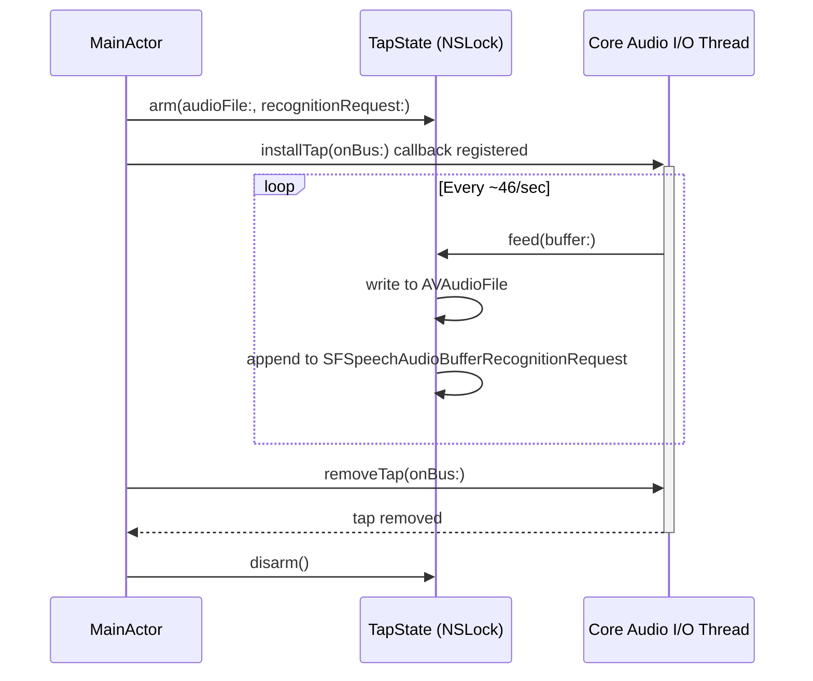
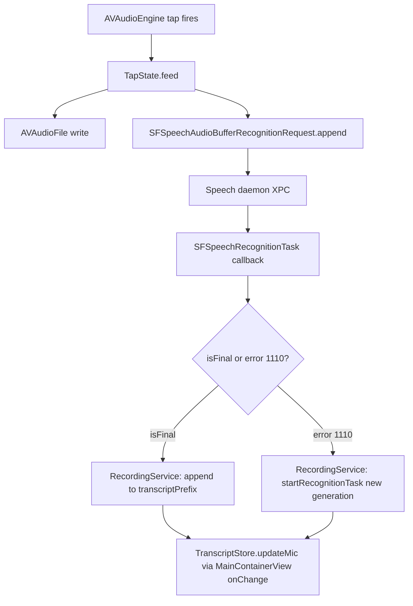
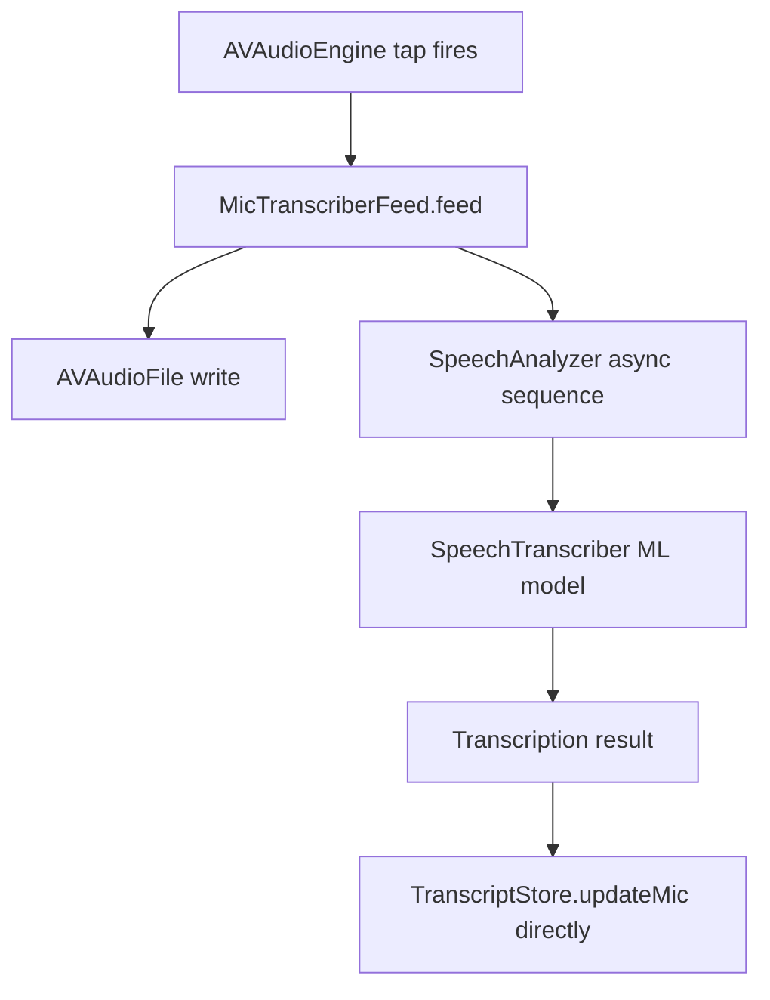
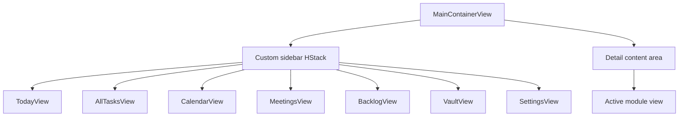
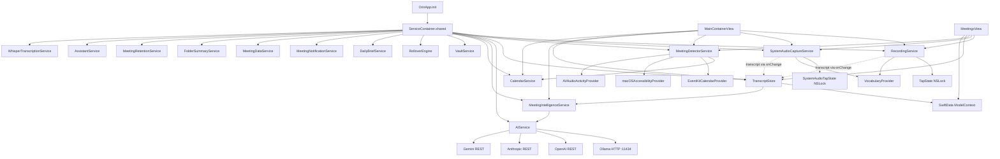

# 02 — Current System Architecture

**Document type:** Principal engineering reference  
**Codebase:** Orin V1 — macOS meeting intelligence application  
**Review date:** 2026-06-29  
**Status:** Accurate as of commit 4f603ea  

---

## Table of Contents

1. [System Overview](#1-system-overview)
2. [Recording Pipeline](#2-recording-pipeline)
3. [Meeting Detection](#3-meeting-detection)
4. [Speech Recognition](#4-speech-recognition)
5. [AI Analysis Pipeline](#5-ai-analysis-pipeline)
6. [SwiftData Persistence](#6-swiftdata-persistence)
7. [UI Layer](#7-ui-layer)
8. [Storage and Export](#8-storage-and-export)
9. [Settings and Configuration](#9-settings-and-configuration)
10. [Meeting Lifecycle — End-to-End Narrative](#10-meeting-lifecycle--end-to-end-narrative)
11. [Service Dependency Graph](#11-service-dependency-graph)
12. [Complete Architecture Diagram](#12-complete-architecture-diagram)

---

## 1. System Overview

Orin is a macOS-native meeting intelligence application. It detects video meetings, records microphone and system audio simultaneously, transcribes both channels in real time, and produces AI-generated summaries, action items, and decisions after the meeting ends.

The application uses SwiftUI with the `@Observable` macro throughout. Persistence is handled by SwiftData. AI inference is primarily via a local Ollama instance (phi3 model by default), with OpenAI, Anthropic, and Gemini as cloud fallbacks. The app ships as a standard macOS application with a MenuBar Extra companion.

### Technology Stack

| Layer | Technology |
|---|---|
| UI framework | SwiftUI + `@Observable` |
| Persistence | SwiftData (SQLite backend via WAL mode) |
| Audio capture (mic) | AVAudioEngine + AVAudioEngine tap |
| Audio capture (system) | ScreenCaptureKit SCStream |
| Speech recognition (legacy) | SFSpeechRecognizer (Apple on-device) |
| Speech recognition (new) | SpeechTranscriber / SpeechAnalyzer (macOS 26+) |
| AI inference (local) | Ollama HTTP API (phi3 default) |
| AI inference (cloud) | OpenAI, Anthropic, Gemini via REST |
| Calendar integration | EventKit via CalendarService |
| Meeting detection | NSWorkspace, NSAppleScript, CGWindowList |
| Service container | ServiceContainer (hand-rolled service locator) |

### Application Entry Point

`OrinApp.swift` (struct `OrinApp: App`) performs the following at startup:

1. Registers UserDefaults factory defaults (`orin.meetings.autoAnalyze`, `orin.meetings.minDurationMinutes`).
2. Builds the SwiftData `ModelContainer` with a three-tier recovery strategy: normal open → store deletion and retry → in-memory fallback.
3. Instantiates and registers all services in `ServiceContainer.shared` in dependency order.
4. Injects provider protocol implementations (`EventKitCalendarProvider`, `macOSAccessibilityProvider`, `AVAudioActivityProvider`) into `MeetingDetectorService`.
5. On `.onAppear`: requests Screen Recording access (`CGRequestScreenCaptureAccess()`), triggers orphan transcript recovery, and pre-warms the `SpeechTranscriber` ML model.
6. On `.willTerminateNotification`: calls `TranscriptStore.checkpoint()` for a final synchronous save before process exit.

---

## 2. Recording Pipeline

### Purpose

Capture microphone audio from the local speaker ("Me") and system audio from meeting participants ("Participant"), write audio to disk, and feed audio buffers to the active speech recognition pipeline.

### Key Files

| File | Role |
|---|---|
| `Sources/Orin/Services/RecordingService.swift` | Mic capture orchestrator, phase state machine, legacy SFSpeechRecognizer path |
| `Sources/Orin/Services/TapState.swift` | Thread-safe bridge between MainActor and Core Audio I/O thread |
| `Sources/Orin/Services/SystemAudioCaptureService.swift` | System audio via SCStream, participant recognition |
| `Sources/Orin/Services/RecognitionDiagnostics.swift` | Per-generation diagnostic counters |

### RecordingService Phase State Machine

`RecordingService` is `@MainActor @Observable`. It defines a four-state lifecycle:

```
idle → starting → recording → stopping → idle
```

The `isRecording` computed property returns `true` for both `.starting` and `.recording` states, which prevents a race condition where `startRecordingFromDetectedMeeting()` in `MainContainerView` could create a duplicate meeting while a `MeetingDetailView`-initiated recording was still in the `.starting` phase.

### Audio Tap and TapState

`AVAudioEngine` is lazy-initialized (to avoid signal-6 crashes in the test suite from premature Core Audio HAL initialization). Before installing the tap, `RecordingService.startRecording()` performs an explicit CoreAudio HAL query:

```swift
AudioObjectGetPropertyData(AudioObjectID(kAudioObjectSystemObject), ...)
```

This query verifies the default input device is present before `AVAudioEngine.prepare()` touches it, preventing `EXC_BAD_ACCESS (SIGSEGV) KERN_INVALID_ADDRESS 0x0` on Macs with no input device.

**TapState** (`TapState.swift`) is the cross-thread handoff point. It holds two resources under `NSLock`:

- `AVAudioFile` — audio written to disk by the Core Audio I/O thread
- `SFSpeechAudioBufferRecognitionRequest` — audio fed to the speech daemon (legacy path only; `nil` when SpeechTranscriber is active)

The `feed(buffer:)` method runs on the **Core Audio I/O real-time thread** and must not block or allocate. The `arm()`, `updateRequest()`, and `disarm()` methods run on the MainActor.



### Known Defects in TapState

**TD-003 (CRITICAL): XPC-in-lock in `disarm()`.**  
`disarm()` calls `recognitionRequest?.endAudio()` while holding `NSLock`. `endAudio()` is an XPC call to the speech daemon (`com.apple.speech.speechsynthesisd`). If the speech daemon is slow, this blocks the Core Audio real-time thread (which also calls `feed()` under the same lock), causing audio dropouts and potential watchdog termination. The fix is to capture and release the lock before calling `endAudio()`, mirroring the pattern already used in `updateRequest()`.

**TD-002 (CRITICAL): Real-time heap allocation in `feed()`.**  
The Core Audio I/O callback receives an `AVAudioPCMBuffer` — this is the buffer provided by the OS at no allocation cost. However, `recognitionRequest?.append(buffer)` internally copies the buffer data, causing heap allocation on the real-time thread. The correct fix is to enqueue buffer pointers into a lock-free ring buffer and process them on a background thread. This is a medium-term fix (MT-001 scope).

### Generation Counter Pattern

The legacy SFSpeechRecognizer path uses a generation counter (`recognitionGeneration: Int`) to prevent duplicate recognition task restarts:

- `recognitionGeneration` increments on every `startRecognitionTask()` call.
- The current generation value is captured in the callback closure at closure-creation time (`let gen = recognitionGeneration`).
- On any callback (result, error, or watchdog timer expiry), the callback checks `gen == self.recognitionGeneration` before acting. Stale-generation callbacks are discarded.

This pattern is necessary because SFSpeechRecognizer produces error code 1110 (VAD segment boundary) after approximately 60 seconds of continuous input. The service must restart the recognition task at this boundary while discarding any callbacks from the previous task.

**TD-007 (HIGH): Generation counter race.**  
The watchdog `Task` and the error callback `Task` can both fire within the same generation window (the watchdog timer fires at t=60s; the 1110 error callback fires at approximately the same time). Both tasks independently check `gen == recognitionGeneration`, both pass, and both call `startRecognitionTask()`, spawning two concurrent `SFSpeechRecognitionTask` instances that compete for the same audio stream. The fix is a boolean gate (`isRestartScheduled`) cleared only when the new task is confirmed running.

### Phase 2A and 2B: SpeechTranscriber Migration

The SpeechTranscriber pipeline (macOS 26+) is introduced as a replacement for SFSpeechRecognizer. Properties for the new pipeline are declared as `Any?` on both `RecordingService` and `SystemAudioCaptureService` so the classes compile against a macOS 14 deployment target. Actual `SpeechAnalyzer` / `SpeechTranscriber` / feed objects are only created inside `if #available(macOS 26.0, *)` guards.

**Phase 2A** replaces the mic recognition channel. Gated by `FeatureFlags.useNewMicPipeline`. When active:
- `MicTranscriberFeed` (an `AsyncSequence`-compatible audio source) replaces the AVAudioEngine tap for feeding audio to SpeechAnalyzer.
- The 60-second restart cycle, watchdog task, and generation counter are no longer needed.
- Only microphone permission is required (not Speech Recognition permission).

**Phase 2B** adds a parallel participant recognition channel using `SpeechTranscriber` on SCStream audio. Gated by `FeatureFlags.useNewParticipantPipeline`. Currently runs both pipelines simultaneously with a flag controlling which pipeline's output is written to `TranscriptStore` and which is written only to `SessionLogger` for comparison.

**Status as of 2026-06-18:** Phase 2A is implemented and feature-flagged. Phase 2B is implemented but gated behind `useNewParticipantPipeline`. Both flags default to `false` (legacy behavior).

### AVAudioEngineConfigurationChange Debounce Race

**TD-004 (CRITICAL):** The `AVAudioEngineConfigurationChange` notification is posted when audio routing changes (e.g., AirPods connect). macOS fires two notifications in rapid succession for a single device change (device change + sample rate change). The service uses a timestamp-based debounce (`lastRouteChangeTime`) to suppress the second notification within 500 ms.

However, the `NotificationCenter.addObserver` handler wraps its body in `Task { @MainActor in }`. Two notifications arriving within 500 ms both dispatch separate `Task` bodies. Both `Task` bodies then read `lastRouteChangeTime` on the MainActor, but if both are scheduled before either runs, both pass the guard (the first has not yet updated `lastRouteChangeTime`), and both call `installTap()`, causing a Core Audio double-tap assertion crash.

The fix is to use `DispatchWorkItem` with `.cancel()` on the previous item, which is cancel-safe by design.

### SystemAudioCaptureService

`SystemAudioCaptureService` (`@MainActor @Observable`) mirrors `RecordingService`'s structure for the participant channel. It uses ScreenCaptureKit (`SCStream`) for system audio capture and a separate `SFSpeechRecognizer(locale: Locale(identifier: "en-US"))` instance for recognition.

It has a `SystemAudioTapState` parallel to `TapState` for thread-safe buffer delivery from the SCStream callback thread to the `SFSpeechAudioBufferRecognitionRequest`. The same generation counter pattern and the same known defects (XPC-in-lock, real-time allocation) apply.

A known issue: the participant recognizer is hardcoded to `"en-US"` locale while the mic recognizer uses `"en-IN"`. The two channels therefore use different acoustic models, which affects transcription quality for Indian-accented speech on the participant channel.

### 400-Line Duplication

**TD-008 (MEDIUM):** The entire recognition session management pattern (generation counter, watchdog task, 60-second restart, 1110 error handling, utterance boundary heuristic diagnostic counters) is copy-pasted in full between `RecordingService.swift` and `SystemAudioCaptureService.swift`. The planned fix is a `RecognitionSessionManager` actor that both services consume.

---

## 3. Meeting Detection

### Purpose

Continuously poll for evidence of an active video meeting and surface a recording prompt to the user. Determine when a meeting has ended to enable auto-stop.

### Key Files

| File | Role |
|---|---|
| `Sources/Orin/Services/MeetingDetectorService.swift` | Core detector, confidence scoring, polling |
| `Sources/Orin/Services/CalendarService.swift` | EventKit event cache and authorization |
| `Sources/Orin/Providers/macOS/EventKitCalendarProvider.swift` | CalendarProvider implementation |
| `Sources/Orin/Providers/macOS/macOSAccessibilityProvider.swift` | Window title inspection |
| `Sources/Orin/Providers/Protocols/CalendarProvider.swift` | Platform-agnostic calendar protocol |
| `Sources/Orin/Providers/Protocols/AccessibilityProvider.swift` | Platform-agnostic accessibility protocol |

### Actor Isolation

`MeetingDetectorService` is `@Observable @MainActor`. All public state mutations occur on the main actor. The detection pipeline itself runs on a cooperative thread pool via `Task.detached(priority: .utility)` and AppleScript calls run on a dedicated serial `DispatchQueue` named `com.orin.meeting-detector.applescript`.

The `calendarService`, `calendarProvider`, `accessibilityProvider`, and `audioActivityProvider` dependencies are marked `nonisolated(unsafe)` because they are set once at startup and subsequently read-only from `nonisolated` detection methods.

### Confidence Scoring Model

Detection results carry a `MeetingDetectionConfidence` struct (defined in `MeetingProviderTypes.swift`). A meeting is surfaced to the user only when the total confidence meets the threshold:

| Signal | Points | Source |
|---|---|---|
| Calendar event with meeting URL in window | 40 | EventKit / CalendarProvider |
| Browser tab contains known meeting URL | 30 | NSAppleScript query |
| Call-specific window title confirmed | 30 | AccessibilityProvider (CGWindowList) |
| Known meeting app process is running | 25 | NSWorkspace.runningApplications |
| Microphone claimed by another app | 20 | AudioActivityProvider |
| System audio active | 20 | AudioActivityProvider |

**Threshold: 40 points.** A running Zoom process alone (25 points) does not trigger the prompt. A running Zoom process with a calendar event (25 + 40 = 65 points) does. Browser-only detection (30 points) does not pass threshold without a supporting signal.

### Detection Priority Order

Inside `detectMeeting()` (which runs nonisolated on the cooperative pool):

1. Native app running (NSWorkspace) — fastest, most reliable
2. Calendar event in [-2 min, +5 min] window around now
3. Browser tab URL (requires AppleScript / Automation permission)

Calendar and browser detection run only if no native app is found. Mic/window-title scores are additive to whichever path first matches.

### Known Meeting Apps

Natively detected bundle IDs:
- `us.zoom.xos` (Zoom)
- `com.microsoft.teams` and `com.microsoft.teams2` (Teams)
- `com.tinyspeck.slackmacgap` (Slack — only when a Huddle or call window is on-screen)
- `com.cisco.webex.meetings` (Webex)

Browser platforms detected via AppleScript:
- Google Chrome (`com.google.Chrome`)
- Microsoft Edge (`com.microsoft.edgemac`)
- Arc (`company.thebrowser.Browser`)
- Safari (`com.apple.Safari`)

### Polling Cadence

- Normal (not recording): 30-second timer.
- Fast poll (recording active): 3-second timer, enabled by `MainContainerView` via `enableFastPoll()`.

### Session Key Deduplication

Each detected meeting is assigned a stable key (e.g., `"us.zoom.xos|active"` or `"calendar|<eventID>|zoom.us/j/<roomID>"`). The same key will not re-trigger a recording prompt within the same detection episode. The key is reset when the meeting fully ends.

### Auto-Stop Mechanism

When `onMeetingEnded` fires (detection result becomes nil), `MainContainerView` applies a two-stage grace period:

1. 1.5-second initial grace (allows brief process flicker or tab reload).
2. Audio-inactivity check: if `TranscriptStore.secondsSinceLastUpdate < 30`, recording is not stopped (audio is still arriving).

Only when both conditions are satisfied does `recordingService.stopRecording()` execute.

### CalendarService Data Race

`CalendarService` is not `@MainActor`-isolated. `MeetingDetectorService` holds a reference to it via `nonisolated(unsafe)`. The `detectFromCalendar()` method calls `calendarService.events(from:to:)` from a `nonisolated` context (the cooperative pool). If `CalendarService` mutates its internal event cache on the main thread simultaneously, this is a data race with no lock protection. This is an open TICKET-003-adjacent issue (not yet formally ticketed).

---

## 4. Speech Recognition

### Purpose

Convert audio from both channels (mic and system audio) into text. Manage recognition session lifecycle including the 60-second SFSpeechRecognizer restart cycle.

### Legacy Path: SFSpeechRecognizer

Active when `FeatureFlags.useNewMicPipeline == false`.



The `SFSpeechRecognizer` is initialized with `Locale(identifier: "en-IN")` for the mic channel. The recognizer is `lazy` to avoid premature Core Audio HAL activation in test environments.

The recognition task is restarted approximately every 60 seconds (triggered by error code 1110 from the speech daemon, which signals a VAD segment boundary). On restart:
1. `transcriptPrefix` accumulates the finalized text from the completed segment.
2. `tapState.updateRequest(_:)` atomically swaps in the new `SFSpeechAudioBufferRecognitionRequest` and calls `endAudio()` on the old one outside the lock.
3. A new `SFSpeechRecognitionTask` is created with the new request.

### New Path: SpeechTranscriber (Phase 2A, macOS 26+)

Active when `FeatureFlags.useNewMicPipeline == true`.



The SpeechTranscriber pipeline eliminates:
- The 60-second restart cycle
- The generation counter pattern
- The watchdog task
- The need for Speech Recognition permission (only Microphone entitlement required)

The pre-warm call in `OrinApp.onAppear` (`recordingService.prewarm()`) loads the SpeechTranscriber ML model before the first recording, eliminating the 5–20 second cold-load delay on first use.

### VocabularyProvider Integration

Before each recording session, `VocabularyProvider.allTerms` is passed to `SpeechTranscriber.contextualStrings`. This biases the on-device model toward domain-specific terms.

The vocabulary contains 103 built-in terms (English business vocabulary, people names, Hinglish bootstrap vocabulary) but the Apple API caps `contextualStrings` at 100 terms. The current code uses `.prefix(100)`, silently dropping 3 terms without any warning or logging. When user-defined terms are added, additional built-in terms are displaced.

### TranscriptStore Update Flow

Both pipelines ultimately call `TranscriptStore.updateMic(_:)` or `TranscriptStore.updateParticipant(_:)`. The routing differs:

- **Legacy mic path**: `RecordingService.speakerTranscript` (computed `@Observable` property) → `MainContainerView.onChange(of: recordingService.speakerTranscript)` → `TranscriptStore.updateMic(labeled)`. Skipped when `FeatureFlags.useNewMicPipeline` is true.
- **New mic path**: `MicTranscriberFeed` results task calls `TranscriptStore.updateMic(_:)` directly.
- **Legacy participant path**: `SystemAudioCaptureService.participantSpeakerTranscript` → `MainContainerView.onChange` → `TranscriptStore.updateParticipant(labeled)`.
- **New participant path (Phase 2B)**: `ParticipantSTFeed` results task calls `TranscriptStore.updateParticipant(_:)` directly.

---

## 5. AI Analysis Pipeline

### Purpose

After recording stops, analyze the full meeting transcript to produce summary, action items, decisions, open questions, risks, and dependencies.

### Key Files

| File | Role |
|---|---|
| `Sources/Orin/Services/MeetingIntelligenceService.swift` | Analysis orchestrator, chunking router |
| `Sources/Orin/Services/AIService.swift` | Provider abstraction, Ollama/OpenAI/Anthropic/Gemini HTTP clients |
| `Sources/Orin/Services/TranscriptChunker.swift` | Transcript splitting, per-chunk analysis, synthesis |
| `Sources/Orin/Services/ConversationTimelineBuilder.swift` | Formats TranscriptSegment arrays into timestamped text |
| `Sources/Orin/Services/AnalysisPerfLogger.swift` | Wall-clock performance instrumentation |
| `Sources/Orin/Services/AIKeychainService.swift` | Keychain storage for cloud API keys |

### Trigger

Analysis is triggered from two places:
1. `MainContainerView.autoAnalyzeIfEnabled(meeting:elapsed:)` — called after `TranscriptStore.finalize()` completes, for prompt-triggered recordings.
2. Manually from `MeetingDetailView` for any meeting at any time.

The `autoAnalyze` setting defaults to `true`. The minimum meeting duration gate defaults to 1 minute (`orin.meetings.minDurationMinutes`).

### Routing: Single Call vs. Chunked

`MeetingIntelligenceService.analyze(title:segments:)` first checks transcript length against `TranscriptChunker.singleCallThreshold` (12,000 characters, approximately 18 minutes of speech at 130 wpm):

```
transcript chars ≤ 12,000: analyzeSingleCall() — 1 AI request
transcript chars > 12,000: analyzeChunked()   — N+1 AI requests
```

When segments are available (always after `finalize()`), `ConversationTimelineBuilder.formatted(segments:meetingStart:)` produces a timestamped timeline text before routing:

```
[00:03] Me: Hello everyone.
[00:10] Participant: Good morning.
[00:18] Me: Let's get started.
```

### analyzeChunked: The 41-Request Problem

`analyzeChunked()` in `MeetingIntelligenceService.swift` is the root cause of the most severe production instability.

**TD-001 (CRITICAL):** The method uses `withTaskGroup` with no concurrency limit:

```swift
await withTaskGroup(of: (Int, ChunkAnalysis).self) { group in
    for (i, chunk) in chunks.enumerated() {
        group.addTask {
            let ca = await TranscriptChunker.analyzeChunk(...)
            return (i, ca)
        }
    }
    ...
}
```

For a 150-minute meeting, `TranscriptChunker.chunks()` produces approximately 20 chunks (at 5,000 characters per chunk). `withTaskGroup` submits all 20 tasks simultaneously. Each task calls `AIService.generate()`, which calls `callOllama()` with a 60-second network timeout.

**Wave pattern for a 150-minute meeting:**

| Time | Event |
|---|---|
| t=0s | 20 simultaneous HTTP POST requests sent to `localhost:11434/api/generate` |
| t=60s | All 20 requests timeout |
| t=70s | All 20 tasks retry (10-second sleep in `AIService.generate()`) |
| t=70s–130s | 19–20 simultaneous retry requests in flight |
| **Total** | **~41 requests, all failed** |

Ollama is single-threaded for inference: the first request blocks all subsequent requests. The second through twentieth requests queue internally in Ollama, each waiting for the previous to complete. A single phi3 inference takes 15–45 seconds on Apple Silicon. For 20 chunks: 20 × 30s = 600 seconds. The 60-second timeout fires for chunks 2–20 long before Ollama finishes them.

The fix (QW-001) is trivial: replace `withTaskGroup` with a sequential `for` loop or add a `maxConcurrentOperationCount: 1` actor. This reduces 41 failed requests to 20–21 sequential successful requests with a total elapsed time of approximately 600 seconds — which is long but functional.

### AIService Provider Selection

`AIService.generate(prompt:maxTokens:)` implements a linear fallback chain:

```
Ollama (health check) → callOllama → retry once → OpenAI → Anthropic → Gemini → fallback text
```

The Ollama health check calls `isOllamaAvailable(endpoint:)` on every `generate()` invocation. There is no caching (QW-002 would add a 10-second cache). For a 20-chunk analysis, this is 20 health check HTTP requests before any inference begins.

**Known issue:** `AIService` holds hardcoded model ID references (`phi3`, `gpt-4o-mini`, `claude-haiku-20240307`) as string literals. There is no `InferenceProvider` protocol. Switching models requires editing source code.

### Provider Hierarchy (proposed but not yet implemented)

The planned `InferenceProvider` protocol and `InferenceWorker` actor are documented in `06-AI-Pipeline-Redesign.md`. The current `AIService` is a flat class with no actor isolation, meaning concurrent calls from `withTaskGroup` can produce data races on `AIService`'s mutable `config` property.

### Chunk Analysis and Synthesis

Each chunk extraction call (`TranscriptChunker.analyzeChunk()`) sends a structured prompt requesting:
- Key decisions
- Open questions
- Risks
- Dependencies
- Commitments
- Action items (flat and structured with owner/priority/due)
- 1–3 bullet key points (used by the synthesis prompt)

After all chunk analyses complete, `analyzeChunked()` deduplicates across chunks and sends a synthesis prompt requesting an executive summary from the aggregated key points. This is the final `+1` call in the N+1 count.

### Hallucination Check

A post-analysis hallucination check runs in `analyzeChunked()` on the `@MainActor` (PB-008). It scans every word in the generated summary that is 4+ characters, starts with a capital letter, and is not the meeting title — checking whether that word appears in the original transcript (case-insensitive). This is an O(N×M) operation on the main actor. For a 150-minute meeting, N (summary words) ≈ 300 and M (transcript characters) ≈ 78,000, making this a blocking UI operation.

---

## 6. SwiftData Persistence

### Purpose

Durable storage of all application data: tasks, meetings, transcripts, analysis results, folders, and vault items.

### Key Files

| File | Role |
|---|---|
| `Sources/Orin/Models/OrinModels.swift` | All `@Model` definitions |
| `Sources/Orin/Services/TranscriptStore.swift` | Checkpoint timer, chunk persistence, finalization |
| `Sources/Orin/Extensions/ModelContext+SafeSave.swift` | `safeSaveWithRetry()` extension |
| `Sources/Orin/Services/MeetingRetentionService.swift` | Prune expired meetings |
| `Sources/Orin/Services/MeetingDataService.swift` | Fetch helpers for meeting-related queries |

### Schema (Models Registered at App Startup)

```swift
Schema([
    TaskItem.self, SubTaskItem.self,
    MeetingItem.self, MeetingFolderItem.self, CommitmentItem.self,
    VaultItem.self, AISuggestionItem.self, DailyBriefItem.self,
    FocusPatternItem.self,
    TranscriptChunk.self, TranscriptSegment.self,
    FolderSummaryItem.self
])
```

### MeetingItem

`MeetingItem` is the central model. Key fields:

| Field | Type | Notes |
|---|---|---|
| `id` | UUID | `@Attribute(.unique)` |
| `title` | String | User-editable |
| `date` | Date | Meeting start |
| `durationSeconds` | TimeInterval | Set on recording stop |
| `transcript` | String | Flat merged text (no `@Attribute(.externalStorage)`) |
| `summary` | String | AI-generated |
| `decisions` | [String] | AI-generated |
| `actionItems` | [String] | Legacy flat list |
| `structuredActionItemsJSON` | String? | JSON-encoded [ActionItemRecord] — canonical when present |
| `openQuestions` | [String] | AI-generated |
| `risks` | [String] | AI-generated |
| `dependencies` | [String] | AI-generated |
| `meetingType` | String | Keyword-detected, AI-confirmed |
| `audioFilePath` | String? | Path to .m4a or .caf file |
| `meetingKnowledgeJSON` | String? | JSON-encoded MeetingKnowledgeSnapshot |
| `structuredActionItems` | [ActionItemRecord] | Computed from structuredActionItemsJSON |
| `effectiveActionItemCount` | Int | Computed, canonical |

**Known issue (PB-005):** `transcript` is stored as an inline SQLite column with no `@Attribute(.externalStorage)`. For a 150-minute meeting, this is a 78,000-character UTF-8 string loaded into memory on every `@Query` result. Every time `MeetingsView` re-renders (which can happen on any meeting list change), the full transcript for every meeting is loaded from SQLite into memory.

### TranscriptChunk vs. TranscriptSegment

These two model types serve fundamentally different purposes and must not be confused.

**TranscriptChunk** (`@Model TranscriptChunk`):
- Written during recording on every meaningful content growth (≥ 10 characters new content, via `persistChunkIfNeeded()`).
- Contains the **full accumulated text** for a speaker at that point in time.
- Purpose: **crash recovery**. If the process is killed during recording, `recoverOrphan()` reads the most recent chunk per speaker on the next launch.
- Not used for display or AI analysis.
- Should be pruned after successful `finalize()` (MT-008).

**TranscriptSegment** (`@Model TranscriptSegment`):
- Written once at the end of recording by `TranscriptStore.buildTimelineSegments()`.
- Contains only the **delta** (new content) for a speaker in a specific time window.
- Ordered by timestamp and `sequenceIndex` to produce the interleaved conversation view.
- Purpose: **conversation timeline display** and **AI analysis input**.
- Used by `ConversationTimelineBuilder.formatted()` to produce timestamped text for AI prompts.
- Used by `MeetingsView` via `allSegments @Query` for timeline rendering.

### Write and Save Pattern

**During recording (checkpoint cycle):**

1. `TranscriptStore.startCheckpointTimer()` fires every 3 seconds.
2. On each tick: `safeSaveWithRetry()` is called on the `ModelContext`.
3. `persistChunkIfNeeded()` fires immediately (not waiting for the timer) when content grows by ≥ 10 characters — this writes a `TranscriptChunk` to SwiftData and calls `context.save()`.

**Known issue (PB-003):** `persistChunkIfNeeded()` calls `context.save()` on every 10-character growth event. SFSpeechRecognizer delivers partial results approximately every 100–500 milliseconds during active speech. Each save call triggers a SQLite WAL write. This can produce multiple SQLite writes per second during active speech, causing observable main-thread latency.

**At finalization:**

1. `TranscriptStore.finalize()` waits 1.5 seconds for trailing recognition chunks.
2. Applies best-of-N selection: picks the longest available transcript from {live, UserDefaults orphan backup, last persisted, model.transcript}.
3. Calls `buildTimelineSegments()` to convert accumulated chunks into ordered `TranscriptSegment` records.
4. Calls `safeSaveWithRetry()` for a terminal save.
5. Calls `endSession()` to clear orphan recovery keys and stop the checkpoint timer.

### ModelContext Ownership

`ModelContainer.mainContext` is used for all SwiftData operations. There is no background `ModelContext`. All saves occur on the main actor via `@MainActor`-isolated services (`TranscriptStore`, `MainContainerView`). This is correct for data integrity but means all SQLite writes block the main thread.

The `ModelContainer` is constructed in `OrinApp.init()` (which runs before the first `body` render) and injected into the view hierarchy via `.modelContainer(modelContainer)`. Services receive a `ModelContext` reference at session start, not at construction time.

### Known Persistence Issues

| ID | Description | Severity |
|---|---|---|
| PB-003 | Multiple `context.save()` calls per second during recording | HIGH |
| PB-004 | `allSegments @Query` in MeetingsView has no meetingId predicate — loads all segments from all meetings | HIGH |
| PB-005 | `MeetingItem.transcript` is inline SQLite — loaded for every meeting in list view | HIGH |
| PB-006 | `buildTimelineSegments()` and `deleteMeetingFully()` do full-table scans with no predicate | MEDIUM |
| PB-007 | `MeetingItem.structuredActionItems` JSON decoded on every list row render (computed property) | MEDIUM |

---

## 7. UI Layer

### Purpose

Present meeting data, provide recording controls, display live transcript, and expose AI analysis results.

### Key Files

| File | Lines | Role |
|---|---|---|
| `Sources/Orin/Views/MainContainerView.swift` | ~350 | Root container, sidebar nav, recording orchestration |
| `Sources/Orin/Views/Meetings/MeetingsView.swift` | **2281** | Meeting list, detail, folders, all-segments query |
| `Sources/Orin/Views/Shared/RecordingWidgetView.swift` | ~150 | Floating recording indicator |
| `Sources/Orin/Views/Settings/SettingsView.swift` | ~400 | All settings panels |
| `Sources/Orin/Views/Onboarding/OnboardingView.swift` | ~200 | First-launch onboarding |
| `Sources/Orin/Views/Shared/OrinDesignSystem.swift` | ~300 | Colors, typography, shared components |

### MainContainerView Structure

`MainContainerView` uses a manual `HStack`-based layout (not `NavigationSplitView`). The sidebar width is computed as a fraction of the window width with a minimum of 72 points (collapsed) or 240 points (expanded).



`MainContainerView` resolves seven services from `ServiceContainer.shared` at construction time: `RecordingService`, `MeetingDetectorService`, `CalendarService`, `SystemAudioCaptureService`, `TranscriptStore`, `MeetingNotificationService`, and `MeetingIntelligenceService`.

### MeetingsView: 2281 Lines

`MeetingsView.swift` is the most problematic file in the codebase from a maintainability standpoint. It contains in a single file:

- Meeting list rendering (past, upcoming, in-progress sections)
- Folder management (create, rename, delete, reorder)
- Meeting detail view (inline, not a separate file)
- Recording controls (start/stop recording for a specific meeting)
- AI analysis trigger and result display
- Export functionality
- Transcript segment timeline rendering
- Action item display and task creation
- Recurring meeting pattern detection

**Known issue (PB-004):** `MeetingsView` declares three global `@Query` properties with no predicates:

```swift
@Query(sort: \MeetingItem.date, order: .forward)
private var allMeetings: [MeetingItem]

@Query(sort: \TranscriptSegment.timestamp, order: .forward)
private var allSegments: [TranscriptSegment]

@Query private var allFolderSummaries: [FolderSummaryItem]
```

`allSegments` loads every `TranscriptSegment` from every meeting every time `MeetingsView` renders. For a user with 100 meetings averaging 50 segments each, this is 5,000 `TranscriptSegment` objects loaded on each render. The `allSegments` array is then filtered in `buildTimelineSegments()` using a linear scan (`O(N)` for N total segments to find the M segments for a specific meeting).

### @Observable Observation Graph

All services (`RecordingService`, `MeetingDetectorService`, `TranscriptStore`, `SystemAudioCaptureService`) are `@Observable`. SwiftUI's observation system tracks property access inside `body` computations and re-renders only when accessed properties change.

Views resolve services from `ServiceContainer.shared` and wrap the result in `@State`, which is the correct pattern for `@Observable` services in SwiftUI. This means state changes in the service propagate to views through SwiftUI's observation system, not through Combine publishers.

### FloatingRecordingWidget

`FloatingRecordingWidgetWindowManager.shared.show(recordingService:onStop:)` creates a frameless, always-on-top `NSPanel` that displays recording elapsed time. It is shown when recording starts and hidden when recording stops. The window is not part of the SwiftUI window hierarchy; it is a separate `NSPanel` created directly.

### NavigationSplitView

Note: `MeetingsView` uses `HSplitView` internally (not `NavigationSplitView`). The `NavigationSplitView` referenced in design specifications is not used in the current implementation. The meeting list and detail are rendered side-by-side in an `HSplitView` with explicit `minWidth`, `idealWidth`, and `maxWidth` constraints.

---

## 8. Storage and Export

### On-Disk Data Layout

| Path | Contents |
|---|---|
| `~/Library/Application Support/com.rconcept.orin/` | SwiftData SQLite store (default.store, default.store-shm, default.store-wal) |
| `~/Library/Application Support/com.rconcept.orin/audio/` | Recorded .m4a or .caf files (path stored in `MeetingItem.audioFilePath`) |
| `~/Library/Containers/com.rconcept.orin/` | Sandboxed container (if sandboxed build) |
| `UserDefaults` (`com.rconcept.orin`) | Feature flags, settings, orphan recovery keys, custom vocabulary |
| Keychain | Cloud AI API keys (via `AIKeychainService`) |

### Audio Files

Audio is written by `TapState.feed()` via `AVAudioFile.write(from:)`. The file URL is determined at `TapState.arm()` time and stored as `MeetingItem.audioFilePath`. The format matches the hardware capture format (typically 48kHz PCM, then encoded to AAC M4A or left as CAF depending on the `AVAudioFile` output format configuration).

### Export

Export functionality is implemented within `MeetingsView.swift`. Supported export formats include:
- Plain text transcript
- Structured summary with action items and decisions
- JSON export (meeting data)

Export uses `NSSavePanel` for file selection.

### /tmp Debug File Issue

**QW-006 (HIGH / PRIVACY):** There is a debug code path that writes raw AI inference responses to `/tmp/orin_phi3_raw.txt`. This file is world-readable on macOS and persists across reboots. Meeting transcript content and AI-generated analysis containing potentially sensitive information is written there without any user notification or opt-in. This path must be removed before any production release.

---

## 9. Settings and Configuration

### Feature Flags

`FeatureFlags.swift` defines two static computed properties read from `UserDefaults`:

| Flag | Key | Default | Effect |
|---|---|---|---|
| `useNewMicPipeline` | `orin.useNewMicPipeline` | `false` | Activates Phase 2A SpeechTranscriber mic path |
| `useNewParticipantPipeline` | `orin.useNewParticipantPipeline` | `false` | Activates Phase 2B SpeechTranscriber participant path |

Both flags are read once at session start. Changing them requires an app restart. The flags are `Bool` properties computed from `UserDefaults.standard.bool(forKey:)` with no caching, so they can technically change mid-session if UserDefaults is written externally — this is not guarded against.

**Critical gating rule for `useNewParticipantPipeline`:** Phase 2B must not be enabled in production without extensive benchmarking. The legacy participant pipeline uses `SFSpeechRecognizer` with 60-second generation cycling. The SpeechTranscriber participant pipeline uses `ParticipantSTFeed` with an `SCStream` audio source. Enabling Phase 2B in an environment where the benchmarking data shows lower WER for the legacy path would regress transcript quality.

### VocabularyProvider

`VocabularyProvider` is a caseless enum (used as a namespace) with three static members:

- `builtInTerms`: 103 hardcoded `String` values including people names, company names, products, and 48 Hinglish/Hindi romanized vocabulary terms.
- `userTerms`: read from `UserDefaults.standard.stringArray(forKey: "orin.customVocabulary")`.
- `allTerms`: `(builtInTerms + userTerms).prefix(100)` — silently drops items beyond index 99.
- `speechLocale`: read from `UserDefaults.standard.string(forKey: "orin.speechLocale") ?? "en-IN"`.

**Known issues:**
- 103 built-in terms with a 100-term cap means 3 terms are always silently dropped.
- No UI to view or edit vocabulary.
- No per-language vocabulary (single flat list regardless of locale).
- No learning from user corrections.
- Terms are read once per session; UserDefaults changes require restart.

### UserDefaults Key Registry

| Key | Type | Default | Purpose |
|---|---|---|---|
| `orin.hasCompletedOnboarding` | Bool | false | First-launch gate |
| `orin.meetings.autoAnalyze` | Bool | true | Auto-analysis after recording |
| `orin.meetings.minDurationMinutes` | Int | 1 | Minimum meeting duration for auto-analysis |
| `orin.meetings.retentionDays` | Int | 30 (RetentionPolicy.thirtyDays) | Auto-delete policy |
| `orin.useNewMicPipeline` | Bool | false | Phase 2A gate |
| `orin.useNewParticipantPipeline` | Bool | false | Phase 2B gate |
| `orin.speechLocale` | String | "en-IN" | ASR locale |
| `orin.customVocabulary` | [String] | [] | User vocabulary terms |
| `orin.theme.mode` | String | "system" | Light/dark/system |
| `orin.sidebar.collapsed` | Bool | true | Sidebar collapse state |
| `orin.calendar.backgroundSync` | Bool | true | CalendarService background sync |
| `orin.transcript.orphanMeetingID` | String | nil | Crash recovery: in-progress meeting |
| `orin.transcript.orphanText` | String | nil | Crash recovery: last-known transcript |

### ServiceContainer

`ServiceContainer` is a hand-rolled service locator. It stores services in a `[String: Any]` dictionary keyed by `String(describing: T.Type)`.

**TD-005 (CRITICAL): No thread safety.**  
`ServiceContainer.services` is a plain `var [String: Any]`. `register()` and `resolve()` have no locking. If any service is registered or resolved from a non-main thread (e.g., a recognition callback), the dictionary access is a data race. The fix is a single `NSLock` (or making the class `actor`) wrapping both methods.

**`fatalError` on missing key:** `resolve(_:)` calls `fatalError("Service \(key) not registered.")` if the type is not in the dictionary. This is correct for development (fails loudly on programmer error) but means any service resolved from a recognition callback path that fires before service registration completes will terminate the process.

---

## 10. Meeting Lifecycle — End-to-End Narrative

This section is the authoritative walkthrough of a complete meeting event, from first detection through final UI display.

### Phase 1: Detection

```
MeetingDetectorService (30s timer)
  └─ Task.detached(priority: .utility)
       └─ detectMeeting()
            ├─ detectNativeApp() → NSWorkspace.runningApplications
            ├─ detectFromCalendar() → CalendarService.events() or CalendarProvider
            └─ detectBrowserMeeting() → NSAppleScript via DispatchQueue
                                         (scriptQueue serial, utility QoS)
```

At t=0, the 30-second poll fires. Suppose the user starts a Zoom call at t=0:

1. `detectNativeApp()` finds `us.zoom.xos` in `NSWorkspace.runningApplications`.
2. `detectFromCalendar()` finds a calendar event overlapping the [-2 min, +5 min] window with a Zoom URL.
3. Confidence: `fromRunningProcess(25) + fromCalendarEvent(40) = 65` — exceeds threshold (40).
4. `applyDetectionResult((app: "Zoom", key: "us.zoom.xos|active"))` is called on MainActor.
5. `detectedMeetingApp = "Zoom"`, `shouldShowRecordingPrompt = true`.
6. `onMeetingDetected?("Zoom")` fires → `MeetingNotificationService.notifyMeetingDetected(appName:)` sends a macOS notification.
7. `MainContainerView.body` re-renders because `meetingDetector.shouldShowRecordingPrompt` changed.
8. `MeetingRecordingPromptView` appears with an "Start Recording" button.

### Phase 2: Recording Start (Prompt-Triggered)

The user taps "Start Recording" in the overlay.

```
MainContainerView
  └─ Task { @MainActor in startRecordingFromDetectedMeeting() }
       ├─ Create MeetingItem(title: "Zoom — <eventTitle>", date: Date())
       ├─ modelContext.insert(meeting)
       ├─ modelContext.save()
       ├─ activeRecordingMeeting = meeting
       └─ await recordingService.startRecording(for: meeting.id)
```

`recordingService.startRecording(for: meetingID)`:

1. Guard: `phase == .idle`, set `phase = .starting`.
2. Check `FeatureFlags.useNewMicPipeline`. On legacy path: verify mic and speech permission.
3. CoreAudio HAL query — verify default input device exists.
4. `audioEngine.inputNode.removeTap(onBus: 0)` — remove any stale tap.
5. Get `inputNode`, verify `outputFormat.sampleRate > 0`.
6. Create `AVAudioFile` at a timestamped URL in the audio storage directory.
7. Create `SFSpeechAudioBufferRecognitionRequest` (legacy path only).
8. `tapState.arm(audioFile:, recognitionRequest:)`.
9. Install tap: `inputNode.installTap(onBus:bufferSize:format:block:)`.
10. Register `AVAudioEngineConfigurationChange` observer.
11. `audioEngine.prepare()` → `audioEngine.start()`.
12. Start recognition task (legacy: `startRecognitionTask()`; new: `startMicSTSession()`).
13. Start duration timer (1-second intervals).
14. Set `phase = .recording`.

Simultaneously, `MainContainerView.onChange(of: recordingService.isRecording)` fires:

1. `meetingDetector.enableFastPoll()` — switches to 3-second poll interval.
2. `MeetingNotificationService.notifyRecordingActive()` — posts "Recording in Progress" notification.
3. `FloatingRecordingWidgetWindowManager.shared.show(recordingService:onStop:)` — shows NSPanel.
4. `systemAudioService.startCapturing(for: meeting.id)` — starts SCStream for participant audio.
5. `transcriptStore.beginSession(meetingID:meeting:context:)` — starts 3-second checkpoint timer.

### Phase 3: Active Recording

For the duration of the meeting:

**Core Audio I/O thread (~46/sec):**
- `TapState.feed(buffer:)` — write to `AVAudioFile`, append to `SFSpeechAudioBufferRecognitionRequest`.

**Speech daemon → MainActor (every 100–500ms):**
- `SFSpeechRecognitionTask` callback delivers partial or final results.
- `RecordingService.transcript` is updated.
- `recordingService.speakerTranscript` (computed: `"Me: " + transcript`) changes.
- `MainContainerView.onChange(of: recordingService.speakerTranscript)` fires.
- `transcriptStore.updateMic(labeled)` is called.
- `TranscriptStore.recomputeLive()` merges mic + participant text.
- If content grew by ≥ 10 chars: `persistChunkIfNeeded()` → `TranscriptChunk` insert → `context.save()`.

**3-second checkpoint timer:**
- `TranscriptStore.checkpoint()` → `meeting.transcript = liveTranscript` → `context.save()`.
- UserDefaults orphan keys are updated.

**Every ~60 seconds (legacy path only):**
- SFSpeechRecognizer fires error 1110.
- `transcriptPrefix += currentTranscriptSegment`.
- `tapState.updateRequest(newRequest)` — atomic swap, old request `endAudio()` called outside lock.
- New `SFSpeechRecognitionTask` created with incremented `recognitionGeneration`.

**Every 3 seconds (recording active) — meeting detection:**
- `MeetingDetectorService.poll()` fires.
- If Zoom is still running and the calendar event still overlaps: `detectedMeetingApp` remains set, no action.
- If Zoom exits: `applyDetectionResult(nil)` → `onMeetingEnded?()` fires.

### Phase 4: Recording Stop

The meeting ends. Zoom exits. `onMeetingEnded` fires. The auto-stop logic applies a 1.5-second initial grace, then checks `transcriptStore.secondsSinceLastUpdate`. After 30 seconds of audio inactivity, `recordingService.stopRecording()` is called.

`recordingService.stopRecording()`:

1. Guard: `phase == .recording`, set `phase = .stopping`.
2. Stop duration timer.
3. `audioEngine.inputNode.removeTap(onBus: 0)`.
4. Remove `AVAudioEngineConfigurationChange` observer.
5. `audioEngine.stop()`.
6. `tapState.disarm()` — `recognitionRequest?.endAudio()` (called while holding lock — **TD-003**).
7. `recognitionTask?.cancel()`.
8. Set `phase = .idle`.

`MainContainerView.onChange(of: recordingService.isRecording)` fires (isRecording is now false):

1. `meetingDetector.disableFastPoll()` — restores 30-second poll interval.
2. `systemAudioService.stopCapturing()` — tears down SCStream.
3. `FloatingRecordingWidgetWindowManager.shared.hide()`.
4. `MeetingNotificationService.notifyRecordingStopped()`.
5. Capture `elapsed` and `audioURL` from `recordingService`.
6. `Task { @MainActor in await transcriptStore.finalize(elapsed:audioURL:) }`.

`TranscriptStore.finalize(elapsed:audioURL:)`:

1. Wait 1.5 seconds for trailing recognition chunks.
2. Best-of-N selection: pick longest of {`liveTranscript`, UserDefaults orphan, `lastPersistedText`, `meeting.transcript`}.
3. Apply anti-truncation rule: new transcript must be longer than current `meeting.transcript`.
4. `meeting.transcript = bestTranscript`.
5. `meeting.durationSeconds = elapsed`.
6. `meeting.audioFilePath = audioURL?.path`.
7. `buildTimelineSegments()` — create `TranscriptSegment` records from accumulated mic/participant deltas.
8. `safeSaveWithRetry()` — terminal SwiftData save.
9. `endSession()` — clear orphan keys, stop checkpoint timer.

### Phase 5: AI Analysis

`MainContainerView.autoAnalyzeIfEnabled(meeting:elapsed:)`:

1. Guard: `orin.meetings.autoAnalyze == true`.
2. Guard: `elapsed >= minDurationMinutes * 60`.
3. Guard: `meeting.transcript` is not empty.
4. Fetch `TranscriptSegment` records for this `meetingID` from `modelContext`.
5. Call `intelligence.analyze(title:segments:meetingStart:fallbackTranscript:)`.

Inside `MeetingIntelligenceService.analyze(title:segments:)`:

1. Build timeline text via `ConversationTimelineBuilder.formatted()`.
2. Detect meeting type (keyword-based, synchronous).
3. Route: if `timelineText.count > 12,000` → `analyzeChunked()`; else → `analyzeSingleCall()`.

For a typical 30-minute meeting (≈19,500 chars → 4 chunks + 1 synthesis):

- `withTaskGroup` submits 4 chunk analysis tasks simultaneously.
- **On Ollama:** all 4 tasks call `callOllama()` simultaneously. Ollama serializes internally. Tasks 2–4 wait for task 1 to complete. Each chunk takes ~30s → total ≈ 120s for all 4 chunks.
- Synthesis prompt → 1 more `callOllama()` call → ~30s.
- Total elapsed: ~150 seconds.

After analysis completes:

```swift
meeting.summary              = analysis.summary
meeting.meetingType          = analysis.meetingType
meeting.decisions            = analysis.decisions
meeting.openQuestions        = analysis.openQuestions
meeting.risks                = analysis.risks
meeting.actionItems          = analysis.actionItems
meeting.structuredActionItemsJSON = ... // JSON-encoded [ActionItemRecord]
meeting.meetingKnowledgeJSON = ... // JSON-encoded MeetingKnowledgeSnapshot
```

`modelContext.save()` — final persistent write with all analysis results.

### Phase 6: UI Display

After `context.save()`, SwiftData's `@Query` mechanism detects the change and re-delivers `allMeetings` to `MeetingsView`. Because `MeetingItem` conforms to `@Observable` via SwiftData's `@Model` macro, any view that accessed `meeting.summary`, `meeting.decisions`, etc. is re-rendered with the new values.

The user sees the meeting in the list with:
- Meeting title and duration
- AI-generated summary
- Action item count badge
- Meeting type badge

Tapping the meeting shows `MeetingDetailView` (embedded in `MeetingsView.swift`) with the full timeline, all AI analysis sections, and the option to create tasks from action items.

---

## 11. Service Dependency Graph



### Dependency Summary

| Service | Direct Dependencies |
|---|---|
| `MeetingIntelligenceService` | `AIService` |
| `AIService` | `AIKeychainService`, Ollama/OpenAI/Anthropic/Gemini HTTP |
| `MeetingDetectorService` | `CalendarService`, `EventKitCalendarProvider`, `macOSAccessibilityProvider`, `AVAudioActivityProvider` |
| `RecordingService` | `TapState`, `VocabularyProvider`, `FeatureFlags` |
| `SystemAudioCaptureService` | `SystemAudioTapState`, `VocabularyProvider`, `FeatureFlags` |
| `TranscriptStore` | `ModelContext` (injected at session start) |
| `MainContainerView` | All service instances from `ServiceContainer.shared`, `ModelContext` from environment |

---

## 12. Complete Architecture Diagram

```mermaid
graph TB
    subgraph "macOS System"
        EventKit[EventKit / Calendar]
        CoreAudio[Core Audio HAL]
        SCKit[ScreenCaptureKit]
        SFSpeech[SFSpeechRecognizer]
        SpeechT[SpeechTranscriber macOS 26+]
        SQLite[SQLite WAL store]
        NSWorkspace[NSWorkspace / CGWindowList]
        AppleScript[NSAppleScript]
    end

    subgraph "External Services"
        Ollama[Ollama :11434 phi3]
        OpenAIAPI[OpenAI API]
        AnthropicAPI[Anthropic API]
        GeminiAPI[Gemini API]
    end

    subgraph "Orin Process"
        subgraph "App Entry"
            OrinApp[OrinApp.swift]
            SC[ServiceContainer]
        end

        subgraph "Detection Layer"
            MDS[MeetingDetectorService @MainActor @Observable]
            CS[CalendarService]
            EKProv[EventKitCalendarProvider]
            AccProv[macOSAccessibilityProvider]
            AudProv[AVAudioActivityProvider]
        end

        subgraph "Recording Layer"
            RS[RecordingService @MainActor @Observable]
            TapState[TapState NSLock]
            SACS[SystemAudioCaptureService @MainActor @Observable]
            SysTap[SystemAudioTapState NSLock]
        end

        subgraph "Transcript Layer"
            TS[TranscriptStore @MainActor @Observable]
            VP[VocabularyProvider]
            FF[FeatureFlags]
        end

        subgraph "AI Layer"
            MIS[MeetingIntelligenceService]
            AIService[AIService]
            TC[TranscriptChunker]
            CTB[ConversationTimelineBuilder]
            APL[AnalysisPerfLogger]
        end

        subgraph "Persistence Layer"
            ModelContainer[ModelContainer SwiftData]
            MeetingItem[MeetingItem @Model]
            TranscriptChunk[TranscriptChunk @Model]
            TranscriptSegment[TranscriptSegment @Model]
            TaskItem[TaskItem @Model]
        end

        subgraph "UI Layer"
            MCV[MainContainerView @MainActor]
            MV[MeetingsView 2281 lines]
            SettingsV[SettingsView]
            RecordingWidget[FloatingRecordingWidget NSPanel]
        end
    end

    OrinApp --> SC
    SC --> MDS
    SC --> RS
    SC --> SACS
    SC --> TS
    SC --> MIS
    SC --> AIService

    MDS --> CS --> EventKit
    MDS --> EKProv
    MDS --> AccProv --> NSWorkspace
    MDS --> AudProv
    MDS --> NSWorkspace
    MDS --> AppleScript

    CoreAudio --> TapState
    TapState --> RS
    SCKit --> SysTap
    SysTap --> SACS

    RS --> SFSpeech
    RS --> SpeechT
    SACS --> SFSpeech

    RS --> TS
    SACS --> TS

    TS --> ModelContainer
    ModelContainer --> SQLite
    ModelContainer --> MeetingItem
    ModelContainer --> TranscriptChunk
    ModelContainer --> TranscriptSegment
    ModelContainer --> TaskItem

    MIS --> AIService
    AIService --> Ollama
    AIService --> OpenAIAPI
    AIService --> AnthropicAPI
    AIService --> GeminiAPI
    MIS --> TC
    MIS --> CTB
    MIS --> APL

    MCV --> RS
    MCV --> SACS
    MCV --> MDS
    MCV --> TS
    MCV --> MIS
    MCV --> RecordingWidget

    MV --> RS
    MV --> SACS
    MV --> MDS
    MV --> TS
    MV --> ModelContainer

    VP --> RS
    VP --> SACS
    FF --> RS
    FF --> SACS
    FF --> MCV
```



---

## Appendix: Known Issues Reference

| ID | Subsystem | Description | Severity | Fix Class |
|---|---|---|---|---|
| TD-001 | AI Pipeline | `analyzeChunked()` unbounded concurrent Ollama dispatch | CRITICAL | Quick Win |
| TD-002 | Recording | Real-time heap allocation in `feed()` callbacks | CRITICAL | Medium-Term |
| TD-003 | Recording | `TapState.disarm()` XPC-in-lock blocks Core Audio thread | CRITICAL | Quick Win |
| TD-004 | Recording | `AVAudioEngineConfigurationChange` debounce race, double `installTap` crash | CRITICAL | Quick Win |
| TD-005 | Service Layer | `ServiceContainer` `[String:Any]` dictionary has no lock | CRITICAL | Quick Win |
| PB-001 | AI Pipeline | Thundering herd: 41 Ollama requests for 150-min meeting | CRITICAL | Quick Win (same as TD-001) |
| PB-002 | Recording | Real-time heap allocation in audio callbacks | CRITICAL | Medium-Term |
| PB-003 | Persistence | Multiple `context.save()` per second during recording | HIGH | Quick Win |
| PB-004 | Persistence | `allSegments @Query` loads all segments with no meetingId predicate | HIGH | Quick Win |
| PB-005 | Persistence | `MeetingItem.transcript` inline SQLite column, no external storage | HIGH | Medium-Term |
| PB-006 | Persistence | Full-table scans in `buildTimelineSegments()` and `deleteMeetingFully()` | MEDIUM | Quick Win |
| PB-007 | Persistence | `structuredActionItems` JSON decoded on every list row render | MEDIUM | Quick Win |
| PB-008 | AI Pipeline | O(N×M) hallucination word scan runs on `@MainActor` | MEDIUM | Quick Win |
| QW-006 | Privacy | Raw AI response written to world-readable `/tmp/orin_phi3_raw.txt` | HIGH | Quick Win |
| TD-008 | Maintainability | 400-line recognition session management duplicated across two services | MEDIUM | Medium-Term |

*For full remediation specifications, see `03-Critical-Defects-and-Quick-Wins.md` and `04-Medium-Term-Redesigns.md`.*
