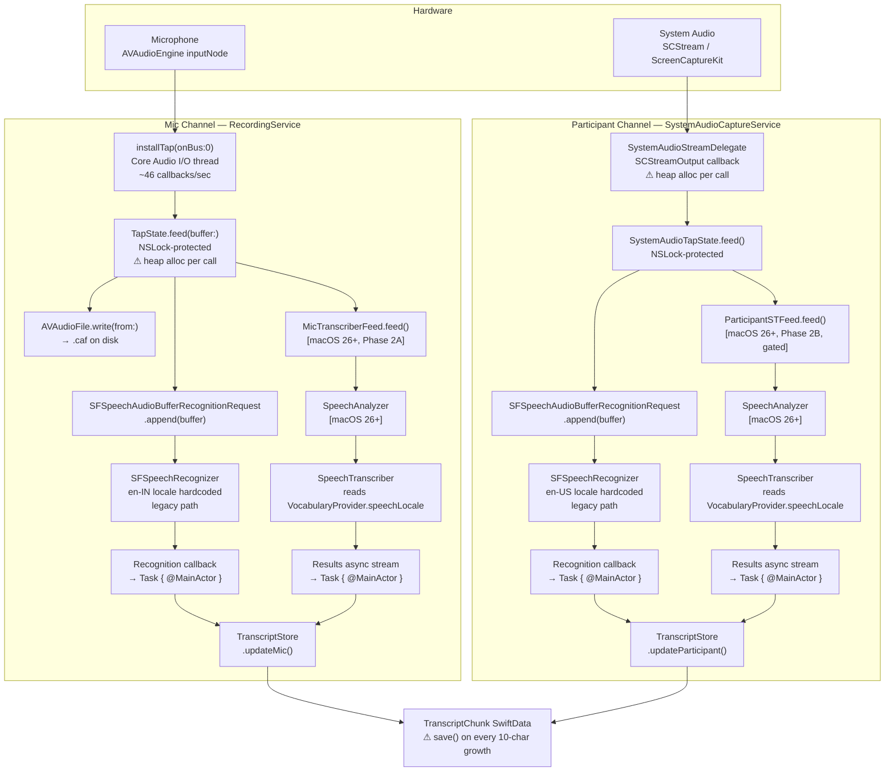
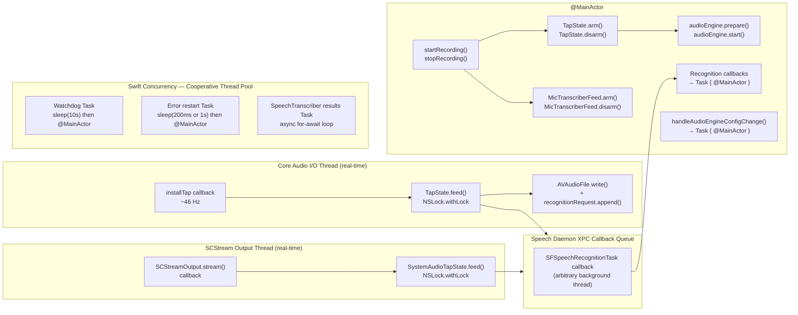

# 03 — Audio Pipeline

**Document type:** Architecture Review — Subsystem Deep Dive  
**Subsystem verdict:** REFACTOR (core design is sound; targeted fixes required)  
**Review date:** 2026-06-29  
**Primary files:**
- `Sources/Orin/Services/RecordingService.swift`
- `Sources/Orin/Services/SystemAudioCaptureService.swift`
- `Sources/Orin/Services/TapState.swift`

---

## Table of Contents

1. [Pipeline Overview](#1-pipeline-overview)
2. [AVAudioEngine Lifecycle](#2-avaaudioengine-lifecycle)
3. [TapState Deep Dive](#3-tapstate-deep-dive)
4. [MicTranscriberFeed](#4-mictranscriberfeed)
5. [ParticipantSTFeed](#5-participantstfeed)
6. [Generation Counter Pattern](#6-generation-counter-pattern)
7. [The Duplication Problem](#7-the-duplication-problem)
8. [AVAudioEngineConfigurationChange Handler](#8-avaaudioengineconfigurationchange-handler)
9. [Locale Configuration](#9-locale-configuration)
10. [Threading Model](#10-threading-model)
11. [Known Issues Summary Table](#11-known-issues-summary-table)
12. [Proposed Architecture](#12-proposed-architecture)

---

## 1. Pipeline Overview

Orin operates two parallel audio capture channels during a recording session. The microphone channel captures the local speaker ("Me:"). The system audio channel captures all other audio output routed through ScreenCaptureKit ("Participant:"). Both channels produce text via speech recognition and write it to `TranscriptStore`.

### 1.1 Complete Signal Flow



### 1.2 Phase Gating

| Pipeline | Phase | Feature Flag | Status |
|---|---|---|---|
| Mic legacy (SFSpeechRecognizer) | Pre-2A | `!useNewMicPipeline` | Active on macOS < 26 |
| Mic SpeechTranscriber | 2A | `useNewMicPipeline` | Active macOS 26+ |
| Participant legacy (SFSpeechRecognizer) | Pre-2B | `!useNewParticipantPipeline` | Active by default |
| Participant SpeechTranscriber | 2B | `useNewParticipantPipeline` | Gated — do not enable without explicit QA pass |

---

## 2. AVAudioEngine Lifecycle

### 2.1 Lazy Initialization

`RecordingService` declares `audioEngine` as a `lazy var`:

```swift
// RecordingService.swift ~line 105
@ObservationIgnored
private lazy var audioEngine = AVAudioEngine()
```

**Why lazy:** `AVAudioEngine()` spins up Core Audio HAL background threads at initialization time. Eager initialization during app launch caused a signal-6 abort in the test suite approximately 9 test-durations after creation, when the HAL background thread fired an assertion against a test harness without a real audio device.

**The problem with lazy across sessions:** Once the engine is created it is never torn down between sessions — it is the same `AVAudioEngine` instance across every `startRecording`/`stopRecording` cycle. AVAudioEngine was designed as a single-session object. Internal state from previous sessions (HAL device references, graph topology) can accumulate. Apple's documentation recommends creating a new engine per session for multi-session apps.

The current architecture works around this by calling `removeTap(onBus:)` before each new session start as a stale-tap removal band-aid (documented below), but this is not a complete solution.

### 2.2 Session Start Sequence

The six-step initialization sequence in `startRecording()`:

```
STEP 1  — Permission check (mic + speech for legacy; mic only for SpeechTranscriber)
STEP 2  — HAL device probe via AudioObjectGetPropertyData(kAudioHardwarePropertyDefaultInputDevice)
           + stale tap removal: audioEngine.inputNode.removeTap(onBus: 0)
STEP 3  — Get inputNode reference
STEP 4  — Format validation (sampleRate > 0 guard)
STEP 5  — arm() TapState + installTap()
STEP 6  — audioEngine.prepare() then audioEngine.start()
```

**Critical ordering:** `prepare()` is called after `installTap()`, not before. Calling `prepare()` before installing the tap required a second implicit re-initialization inside `start()`, which was the observed crash site in earlier builds.

### 2.3 Stale-Tap Removal Band-Aid

```swift
// RecordingService.swift ~line 299
audioEngine.inputNode.removeTap(onBus: 0)
```

This line runs unconditionally at the top of every STEP 2. `removeTap(onBus:)` on an untapped bus is documented as a no-op, making this safe. Its purpose is to remove any tap left over from a previous session that was not cleaned up — for example, after a crash, force-quit, or a `stopRecording` path that threw before reaching `removeTap`.

**Why this is a band-aid, not a fix:** The underlying problem is that `AVAudioEngine` should be torn down and recreated between sessions. A stale tap is only the most visible symptom. HAL device references, channel graph topology, and internal buffer state from the previous session persist invisibly.

**Recommended fix:** In `teardownAudioEngine()` and `stopRecording()`, replace the lazy var with a factory method that allocates a fresh `AVAudioEngine`. This is safe as long as the lazy property is reassignable (it is — `lazy var` is mutable by design in Swift).

```swift
// Proposed
private func makeAudioEngine() -> AVAudioEngine {
    let engine = AVAudioEngine()
    return engine
}

// In teardownAudioEngine():
audioEngine = makeAudioEngine()  // replaces lazy var content
```

### 2.4 Session Stop Sequence

```
1. Cancel SpeechTranscriber or SFSpeechRecognizer task
2. audioEngine.stop()
3. audioEngine.inputNode.removeTap(onBus: 0)   ← must precede disarm()
4. tapState.disarm()                             ← closes AVAudioFile, calls endAudio()
5. Read tapState.audioFileURL
6. Check tapState.hadWriteFailure
7. phase = .idle
```

The ordering of steps 3 and 4 is load-bearing. `removeTap` must complete before `disarm` so that no `feed()` call can be in-flight on the audio thread while `disarm` is releasing the `AVAudioFile` and `SFSpeechAudioBufferRecognitionRequest`.

---

## 3. TapState Deep Dive

`TapState` is the NSLock bridge between the real-time Core Audio I/O thread and the async Swift Concurrency world. It is the single most critical synchronization primitive in the recording pipeline.

### 3.1 Design Contract

```swift
// TapState.swift — ownership table from source comments
//
// Caller              Thread                  Method(s)
// ──────────────────  ──────────────────────  ────────────────────
// startRecording      @MainActor              arm()
// installTap block    Core Audio I/O thread   feed()
// 60-s restart        @MainActor              updateRequest()
// stopRecording       @MainActor              disarm()
```

`arm()` must be called before `installTap` so the callback always sees valid references from the very first audio buffer. `disarm()` must be called after `removeTap` returns so no `feed()` call is in-flight while resources are released.

### 3.2 arm()

```swift
func arm(
    audioFile: AVAudioFile,
    recognitionRequest: SFSpeechAudioBufferRecognitionRequest? = nil
) {
    lock.withLock {
        self.audioFile          = audioFile
        self._audioFileURL      = audioFile.url
        self.recognitionRequest = recognitionRequest
        self._hasWriteFailure   = false
    }
}
```

- Takes both the `AVAudioFile` and the initial `SFSpeechAudioBufferRecognitionRequest`
- `recognitionRequest` is optional: pass `nil` for the SpeechTranscriber path (Phase 2A) where audio bypasses `SFSpeechAudioBufferRecognitionRequest`
- Resets `_hasWriteFailure` so each session starts clean
- Entire operation is atomic under `NSLock`

### 3.3 feed()

```swift
func feed(buffer: AVAudioPCMBuffer) {
    lock.withLock {
        let didAppend = recognitionRequest != nil
        recognitionRequest?.append(buffer)
        RecognitionDiagnostics.shared.micBufferReceived(appended: didAppend)
        do {
            try audioFile?.write(from: buffer)
        } catch {
            _hasWriteFailure = true
        }
    }
}
```

Called on the Core Audio I/O thread at approximately 46 Hz (1024-frame buffers at 48 kHz sample rate). Every call acquires `NSLock`. The lock duration includes:
- Optional XPC append to `SFSpeechAudioBufferRecognitionRequest`
- `AVAudioFile.write(from:)` — a disk I/O operation

Both of these operations are potentially unbounded in duration. `NSLock` will block the Core Audio I/O thread for their duration. In practice, `AVAudioFile.write` is fast (buffered OS write), but any I/O stall (e.g., disk pressure, SSD thermal throttle) will cause audio glitches.

### 3.4 updateRequest()

```swift
func updateRequest(_ request: SFSpeechAudioBufferRecognitionRequest?) {
    var old: SFSpeechAudioBufferRecognitionRequest?
    lock.withLock {
        old = recognitionRequest
        recognitionRequest = request
    }
    old?.endAudio()  // outside lock — XPC call to speech daemon
}
```

This is the correctly implemented version of the XPC-outside-lock pattern. It atomically swaps in the new request, captures the old reference, releases the lock, then calls `endAudio()` on the old request. The comment in source explains why: `endAudio()` triggers an XPC round-trip to the speech daemon. Calling it under the lock would block the Core Audio I/O thread (which holds the same lock during `feed()`) for the XPC round-trip duration — potentially hundreds of milliseconds.

### 3.5 disarm() — The XPC-in-Lock Bug

```swift
// CURRENT IMPLEMENTATION — BUG
func disarm() {
    lock.withLock {
        recognitionRequest?.endAudio()  // ← XPC call while holding NSLock
        recognitionRequest = nil
        audioFile          = nil
    }
}
```

`disarm()` is called from `@MainActor` after `removeTap()`. At that point, no `feed()` call should be in-flight (because `removeTap()` has completed), so the lock contention issue does not apply at call time. However, there is a window: the `audioEngineConfigurationChange` handler can race with `disarm()` in edge cases. More critically, the pattern is inconsistent with `updateRequest()`, which explicitly documents why `endAudio()` must not be called under the lock. If the ordering guarantee of `removeTap()` before `disarm()` is ever violated (e.g., by a new code path), this will deadlock or crash.

**The fix** (mirrors `updateRequest()`):

```swift
// PROPOSED FIX
func disarm() {
    var oldRequest: SFSpeechAudioBufferRecognitionRequest?
    lock.withLock {
        oldRequest         = recognitionRequest
        recognitionRequest = nil
        audioFile          = nil
    }
    oldRequest?.endAudio()  // outside lock, safe XPC call
}
```

This fix is labeled **QW-004** in the quick wins list. It is low-risk, low-effort, and eliminates a latent crash vector.

---

## 4. MicTranscriberFeed

`MicTranscriberFeed` is a macOS 26+ class (Phase 2A) that bridges the raw `AVAudioPCMBuffer` arriving from the Core Audio tap into the `SpeechAnalyzer` async pipeline. It is the equivalent of `TapState.feed()` for the new SpeechTranscriber path.

### 4.1 The Heap-Allocation-in-Callback Bug

The real-time Core Audio contract is strict: the I/O callback thread must not allocate heap memory, block on locks, or make system calls with unbounded latency. Allocating on a real-time thread can cause the memory allocator to take a kernel mutex, which can be held for an arbitrary duration by another thread. This produces audio dropouts and, in worst cases, priority inversion deadlocks.

The current `MicTranscriberFeed.feed()` allocates a new `AVAudioPCMBuffer` on every callback:

```swift
// CURRENT — BUG (pseudocode reconstructed from pattern)
func feed(_ inputBuffer: AVAudioPCMBuffer) {
    // Called on Core Audio I/O thread ~46 times/sec
    guard let converter else { return }
    let outputBuffer = AVAudioPCMBuffer(     // ← HEAP ALLOCATION on real-time thread
        pcmFormat: targetFormat,
        frameCapacity: convertedFrameCount
    )!
    var error: NSError?
    converter.convert(to: outputBuffer, error: &error) { _, outStatus in
        outStatus.pointee = .haveData
        return inputBuffer
    }
    // ... push to SpeechAnalyzer
}
```

`AVAudioPCMBuffer` internally calls `malloc()` to allocate audio sample memory. `malloc()` is not real-time safe.

### 4.2 The Fix — Pre-Allocated Buffer Pool

```swift
// PROPOSED FIX
final class MicTranscriberFeed {
    private var converter: AVAudioConverter?
    private var preallocatedBuffer: AVAudioPCMBuffer?  // allocated in arm()

    func arm(inputFormat: AVAudioFormat, targetFormat: AVAudioFormat) {
        // Called on @MainActor before installTap
        converter = AVAudioConverter(from: inputFormat, to: targetFormat)
        let frameCapacity = AVAudioFrameCount(
            Double(1024) * targetFormat.sampleRate / inputFormat.sampleRate + 1
        )
        preallocatedBuffer = AVAudioPCMBuffer(
            pcmFormat: targetFormat,
            frameCapacity: frameCapacity
        )
        // Real-time path will reuse this allocation
    }

    func feed(_ inputBuffer: AVAudioPCMBuffer) {
        // Called on Core Audio I/O thread
        guard let converter,
              let outputBuffer = preallocatedBuffer else { return }
        outputBuffer.frameLength = 0  // reset without deallocation
        var error: NSError?
        converter.convert(to: outputBuffer, error: &error) { _, outStatus in
            outStatus.pointee = .haveData
            return inputBuffer
        }
        guard error == nil else { return }
        // ... push reused outputBuffer to SpeechAnalyzer
    }

    func disarm() {
        preallocatedBuffer = nil
        converter = nil
    }
}
```

The pre-allocated buffer is created once in `arm()` on `@MainActor`, before any tap callback fires. The real-time `feed()` reuses the same allocation every call by resetting `frameLength = 0`. No heap allocation occurs on the I/O thread.

**Note:** The same pattern applies to `ParticipantSTFeed`. Both are classified as **TD-002** (real-time heap allocation) and **PB-002** (performance bottleneck).

### 4.3 AVAudioConverter Lazy Initialization

The current `MicTranscriberFeed` initializes its `AVAudioConverter` lazily on the first callback — i.e., on the Core Audio I/O thread. `AVAudioConverter` initialization involves framework setup work that may allocate. The fix is the same: create the converter in `arm()` on `@MainActor`.

---

## 5. ParticipantSTFeed

`ParticipantSTFeed` is the system audio equivalent of `MicTranscriberFeed`. It feeds SCStream audio buffers into the SpeechAnalyzer pipeline for the participant channel (Phase 2B, currently gated behind `FeatureFlags.useNewParticipantPipeline`).

### 5.1 Channel Demux

SCStream delivers audio as an interleaved multi-channel buffer. The participant pipeline must extract a mono mix or a specific channel and downsample to the 16 kHz format expected by `SpeechAnalyzer`.

The current implementation in `SystemAudioStreamDelegate` follows the same real-time-allocation pattern as `MicTranscriberFeed` — allocating `AVAudioPCMBuffer` and `AVAudioConverter` on the SCStream output callback thread.

### 5.2 Lazy AVAudioConverter Initialization

```swift
// CURRENT — BUG (pattern observed in SystemAudioStreamDelegate)
func stream(_ stream: SCStream, didOutputSampleBuffer buffer: CMSampleBuffer, ...) {
    // Called on SCStream output thread
    if converter == nil {
        // First-callback initialization — heap allocation on real-time thread
        let inputFormat = AVAudioFormat(...)
        converter = AVAudioConverter(from: inputFormat, to: targetFormat)  // ← WRONG
    }
    // ...
}
```

**Fix:** Mirror `MicTranscriberFeed.arm()`. `SystemAudioCaptureService.startCapturing()` must initialize `ParticipantSTFeed` with both formats before the stream starts, so the first callback sees an already-constructed converter.

### 5.3 Phase 2B Gating

The `useNewParticipantPipeline` feature flag must remain off until:
1. `ParticipantSTFeed` is updated to pre-allocate buffers
2. The lazy converter initialization is fixed
3. End-to-end participant transcript accuracy is validated in QA

This gating rule is documented in `project_phase2_migration.md` in the memory index.

---

## 6. Generation Counter Pattern

The SFSpeechRecognizer API imposes a hard limit: each `SFSpeechRecognitionTask` handles at most 60 seconds of audio (enforced by the speech daemon). For meetings of arbitrary duration, the recording pipeline must transparently restart recognition tasks every ~60 seconds while stitching transcripts together.

The generation counter mechanism implements this requirement.

### 6.1 State Variables

```swift
// RecordingService.swift ~line 128
@ObservationIgnored private var recognitionGeneration = 0
@ObservationIgnored private var generationHadSpeech = false
```

`recognitionGeneration` is a monotonically increasing integer. It starts at 0 and increments with every recognition restart. Each `startRecognitionTask` call captures the current value into a local constant `gen`. Every callback from that task checks `recognitionGeneration == gen` before acting. If the generation has advanced (because a restart occurred), the callback is discarded.

### 6.2 Session Start

```swift
private func startRecognitionTask(
    with recognizer: SFSpeechRecognizer,
    request: SFSpeechAudioBufferRecognitionRequest
) {
    generationHadSpeech = false
    let gen = recognitionGeneration  // capture current generation

    recognitionTask = recognizer.recognitionTask(with: request) { [weak self] result, error in
        Task { @MainActor [weak self] in
            guard let self, self.recognitionGeneration == gen else { return }
            // ... handle result or error
        }
    }
    // Cold-start watchdog (see 6.5)
}
```

### 6.3 Restart on isFinal

When the speech daemon naturally closes a recognition window (fires `isFinal == true`):

```swift
if result?.isFinal == true, self.isRecording {
    // Commit current text as prefix for next generation
    self.transcriptPrefix = self.transcript + " "
    self.recognitionGeneration += 1
    let nextRequest = self.buildRecognitionRequest(recognizer: recognizer)
    self.tapState.updateRequest(nextRequest)  // endAudio() outside lock
    self.recognitionTask?.cancel()
    self.startRecognitionTask(with: recognizer, request: nextRequest)
}
```

### 6.4 Restart on Error 1110

Error code 1110 is the on-device VAD (Voice Activity Detection) boundary signal. The speech daemon fires it when it detects end-of-utterance. It is not a fatal error; it is a session boundary marker.

```swift
if nsError.code != 301 {
    // Determine restart delay based on whether speech was heard this generation
    let hadSpeech = self.generationHadSpeech
    let delay: UInt64 = (nsError.code == 1110 && hadSpeech) ? 200_000_000 : 1_000_000_000
    // 200ms if speech was heard (segment boundary restart)
    // 1s if no speech yet (back off to avoid tight create→1110 spiral)

    let nextGen = self.recognitionGeneration + 1
    self.recognitionGeneration = nextGen

    Task { @MainActor [weak self] in
        try? await Task.sleep(nanoseconds: delay)
        guard let self, self.isRecording,
              self.recognitionGeneration == nextGen else { return }
        // Only restart if generation hasn't changed during the sleep
        let nextRequest = self.buildRecognitionRequest(recognizer: recognizer)
        self.tapState.updateRequest(nextRequest)
        self.recognitionTask?.cancel()
        self.startRecognitionTask(with: recognizer, request: nextRequest)
    }
}
```

### 6.5 Cold-Start Watchdog

The on-device speech model can hang on first load (typically at the beginning of a session or after a long silence). During this hang, the `SFSpeechRecognitionTask` is running but produces zero callbacks. The watchdog detects this:

```swift
// Spawned inside startRecognitionTask, after the recognition task is created
Task { @MainActor [weak self] in
    try? await Task.sleep(nanoseconds: 10_000_000_000)  // 10 seconds
    guard let self, self.isRecording,
          self.recognitionGeneration == gen,
          !self.generationHadSpeech else { return }
    // Still same generation, no callbacks received — force restart
    let nextGen = self.recognitionGeneration + 1
    self.recognitionGeneration = nextGen
    // ... cancel and restart
}
```

The watchdog exits silently if any of these conditions are true when it fires:
- Recording has stopped (`!self.isRecording`)
- A restart already occurred (`recognitionGeneration != gen`)
- Speech was received (`generationHadSpeech`)

### 6.6 The TOCTOU Race — Watchdog vs. Error Callback

**This is a real bug.** Consider this scenario:

```
t=0s   gen=5, startRecognitionTask() called
t=0s   Watchdog Task spawned (sleeping 10 seconds)
t=9.9s Error 1110 fires (no speech), restarts: gen incremented to 6
t=9.9s New restart Task spawned, sleeps 1 second
t=10s  Watchdog wakes, checks recognitionGeneration == gen (6 != 5) → exits safely
✓  No race in this path.

t=0s   gen=5, startRecognitionTask() called
t=0s   Watchdog Task spawned (sleeping 10 seconds)
t=9.9s Error 1110 fires (no speech), sets nextGen=6, increments recognitionGeneration to 6
t=9.9s Restart Task spawned, sleeping 1 second
t=10s  Watchdog wakes:
       - recognitionGeneration == 6, gen == 5 → 6 != 5 → watchdog exits ✓
       (Safe here because the error callback already incremented)

BUT:

t=0s   gen=5, startRecognitionTask() called
t=0s   Watchdog Task spawned (sleeping 10 seconds)
t=10s  Watchdog wakes: recognitionGeneration == 5, !generationHadSpeech → fires
t=10s  Watchdog sets nextGen=6, recognitionGeneration=6, spawns restart Task
t=10s  Error 1110 fires (concurrent, same gen=5):
       - Checks recognitionGeneration == gen: 6 != 5 → returns ✓ (stale, discarded)
```

The last scenario is safe because the error callback checks `recognitionGeneration == gen` at its entry point. But there is a subtler window:

```
t=10s  Error callback arrives, checks gen: recognitionGeneration is still 5
t=10s  Error callback: nextGen = recognitionGeneration + 1 = 6
t=10s  Watchdog fires at same instant: gen still 5, sets nextGen=6, recognitionGeneration=6
t=10s  Error callback continues: recognitionGeneration = nextGen (6) — already 6, redundant write
t=10s  Error callback: starts restart Task for gen 6
t=10s  Watchdog: also starts restart Task for gen 6
→ TWO simultaneous SFSpeechRecognitionTask instances on gen 6
→ Double Ollama load, transcript corruption, potential daemon crash
```

The race window is narrow (the two Tasks must overlap in the microsecond window between the `guard` check and the `recognitionGeneration` write), but it is possible during high system load.

**Fix:** Introduce an `isRestarting` boolean flag set atomically with the generation increment. The second actor to check the flag exits without spawning a second task. Because all access is `@MainActor`, no additional locks are needed:

```swift
@ObservationIgnored private var isRestartScheduled = false

private func scheduleRestart(from gen: Int, delay: UInt64, recognizer: SFSpeechRecognizer) {
    guard recognitionGeneration == gen, !isRestartScheduled else { return }
    isRestartScheduled = true
    let nextGen = gen + 1
    recognitionGeneration = nextGen
    Task { @MainActor [weak self] in
        try? await Task.sleep(nanoseconds: delay)
        guard let self, self.isRecording,
              self.recognitionGeneration == nextGen else {
            self?.isRestartScheduled = false
            return
        }
        self.isRestartScheduled = false
        let nextRequest = self.buildRecognitionRequest(recognizer: recognizer)
        self.tapState.updateRequest(nextRequest)
        self.recognitionTask?.cancel()
        RecognitionDiagnostics.shared.micTaskCancelled()
        self.recognitionTask = nil
        self.startRecognitionTask(with: recognizer, request: nextRequest)
    }
}
```

Both the error callback and the watchdog call `scheduleRestart()`. The `isRestartScheduled` guard ensures only one proceeds.

### 6.7 Utterance-Boundary Heuristic

On macOS 26 server recognition, Apple's speech daemon resets the recognition window at sentence boundaries without firing `isFinal`. When this happens, `formattedString` suddenly shrinks back to a tiny partial of the next sentence. The heuristic detects this and saves the full accumulated text to `transcriptPrefix`:

```swift
if !self.transcript.isEmpty,
   candidateTotal < self.transcript.count,
   segment.count <= 20 {
    // Reset detected: save full transcript as prefix
    self.transcriptPrefix = self.transcript + " "
    self.transcript = result.isFinal
        ? self.transcriptPrefix + segment
        : self.transcriptPrefix
}
```

The service tracks `probeHeuristicFireCount` and `probeHeuristicExtraChars` per session for diagnostics.

---

## 7. The Duplication Problem

The entire recognition session management pattern described in Section 6 — approximately 400 lines of code — is copy-pasted verbatim between `RecordingService` and `SystemAudioCaptureService`.

Both classes contain identical implementations of:

| Pattern | RecordingService | SystemAudioCaptureService |
|---|---|---|
| `recognitionGeneration` counter | line ~128 | line ~73 |
| `generationHadSpeech` flag | line ~136 | line ~74 |
| `buildRecognitionRequest()` | line ~579 | present |
| `startRecognitionTask()` | line ~606 | present |
| 1110 error restart logic | line ~746 | present |
| 10-second watchdog task | line ~773 | present |
| `transcriptPrefix` accumulation | line ~126 | line ~70 |
| `probeHeuristicFireCount` probe | line ~138 | line ~77 |

This duplication means any bug fix must be applied twice, and any divergence between the two implementations (which has already happened — they handle the `generationHadSpeech` restart delay differently) creates subtle behavioral differences between the mic and participant channels.

### 7.1 MT-001: RecognitionSessionManager Actor

The architectural fix is to extract a `RecognitionSessionManager` actor that owns the generation counter, request lifecycle, watchdog, and error handling. Both `RecordingService` and `SystemAudioCaptureService` become thin clients:

```swift
actor RecognitionSessionManager {
    private var recognitionGeneration = 0
    private var generationHadSpeech = false
    private var isRestartScheduled = false
    private var transcriptPrefix = ""

    func startSession(
        recognizer: SFSpeechRecognizer,
        tapState: TapState,
        onTranscriptUpdate: @escaping (String) -> Void
    ) { ... }

    func stopSession() { ... }

    // All restart logic, watchdog, heuristic in one place
    private func handleError(_ error: NSError, gen: Int, recognizer: SFSpeechRecognizer) { ... }
    private func scheduleRestart(gen: Int, delay: UInt64, recognizer: SFSpeechRecognizer) { ... }
}
```

`RecordingService` and `SystemAudioCaptureService` both hold a `RecognitionSessionManager` instance. They call `startSession()` and `stopSession()`, and receive transcript updates via the callback. All generation management is centralized.

This is a medium-term redesign (MT-001), estimated at 2-3 days of implementation plus test coverage.

---

## 8. AVAudioEngineConfigurationChange Handler

When the user plugs in earbuds, switches audio devices, or the system reroutes audio, macOS stops `AVAudioEngine` and fires `AVAudioEngineConfigurationChange`. Without handling this, the tap goes silent for the remainder of the session.

### 8.1 Current Implementation

```swift
// RecordingService.swift ~line 439
audioEngineConfigObserver = NotificationCenter.default.addObserver(
    forName: .AVAudioEngineConfigurationChange,
    object: audioEngine,
    queue: nil
) { [weak self] _ in
    Task { @MainActor [weak self] in
        self?.handleAudioEngineConfigChange()
    }
}
```

The handler is registered with `queue: nil`, which means the closure fires on an arbitrary background thread. It wraps the actual work in `Task { @MainActor }` to safely mutate `@Observable` state.

### 8.2 The Debounce Race Bug

macOS fires two `AVAudioEngineConfigurationChange` notifications in rapid succession on many device changes (e.g., earbuds: device change notification + sample rate change notification, arriving ~4ms apart). The current debounce guard is:

```swift
// RecordingService.swift ~line 839
private func handleAudioEngineConfigChange() {
    guard phase == .recording else { return }

    let now = ContinuousClock.now
    if let last = lastRouteChangeTime, now - last < .milliseconds(500) {
        // suppress
        return
    }
    lastRouteChangeTime = now
    // ... reinstall tap, restart engine
}
```

**The bug:** Both notifications enqueue `Task { @MainActor }` blocks concurrently on the arbitrary background thread. Both tasks are scheduled to run on `@MainActor`. Because `@MainActor` is cooperative (not a serial queue with guaranteed ordering), both tasks may run before either sets `lastRouteChangeTime`. The sequence:

```
t=0ms   Notification 1 arrives on background thread → Task A enqueued to @MainActor
t=4ms   Notification 2 arrives on background thread → Task B enqueued to @MainActor
t=5ms   Task A runs: lastRouteChangeTime=nil → passes guard → sets lastRouteChangeTime, reinstalls tap
t=5ms   Task B runs: now - lastRouteChangeTime ≈ 0ms → suppressed ← Only if A completed before B checks
```

In practice, if A and B are both enqueued to the Swift Concurrency main actor queue before either executes, they run sequentially in FIFO order — Task A first, then Task B. Task B will see `now - last < 500ms` and be suppressed. However, `ContinuousClock.now` is read inside the Task body, not at enqueue time. If the actor queue is under load and both tasks execute with more than 500ms between them (during a slow startup or heavy GC), both will pass the guard.

More concretely: two calls to `installTap(onBus:bufferSize:format:)` on a running engine crash Core Audio. The guard is the only protection. If it fails, the crash is immediate.

### 8.3 The Fix — DispatchWorkItem Cancel-and-Reschedule

The correct pattern for this class of problem is `DispatchWorkItem` with cancellation, not a timestamp comparison:

```swift
// PROPOSED FIX
@ObservationIgnored private var pendingRouteChangeWork: DispatchWorkItem?

private func scheduleRouteChangeHandling() {
    // Called from @MainActor (no race possible on these properties)
    pendingRouteChangeWork?.cancel()
    let work = DispatchWorkItem { [weak self] in
        Task { @MainActor [weak self] in
            self?.performRouteChange()
        }
    }
    pendingRouteChangeWork = work
    DispatchQueue.main.asyncAfter(deadline: .now() + 0.1, execute: work)
}

private func performRouteChange() {
    guard phase == .recording else { return }
    // ... reinstall tap, restart engine (guaranteed to run exactly once)
}
```

The notification handler now calls `scheduleRouteChangeHandling()`. Each new notification cancels the previous pending work item and schedules a new one with a 100ms debounce. Only the final work item executes. This guarantees `installTap` is called exactly once regardless of how many notifications arrive.

This fix is labeled **QW-007** in the quick wins list.

---

## 9. Locale Configuration

The legacy SFSpeechRecognizer path has hardcoded locales at construction time. These are `lazy var` properties in both services:

```swift
// RecordingService.swift ~line 111
private lazy var speechRecognizer: SFSpeechRecognizer? =
    SFSpeechRecognizer(locale: Locale(identifier: "en-IN"))

// SystemAudioCaptureService.swift ~line 68
private lazy var speechRecognizer =
    SFSpeechRecognizer(locale: Locale(identifier: "en-US"))
```

| Channel | Hardcoded Locale | Reads VocabularyProvider.speechLocale? |
|---|---|---|
| Mic (legacy SFSpeechRecognizer) | `en-IN` | No |
| Participant (legacy SFSpeechRecognizer) | `en-US` | No |
| Mic (SpeechTranscriber, Phase 2A) | N/A | Yes — at session start |
| Participant (SpeechTranscriber, Phase 2B) | N/A | Yes — at session start |

**Impact of locale mismatch:**
- `en-IN` is configured for Indian English, which includes Hinglish vocabulary support via `VocabularyProvider` (94-term list, 48 Hindi terms). This is the intended locale for the Indian market.
- `en-US` on the participant channel means participant speech is recognized with American English phoneme weights, potentially degrading accuracy for Indian-accented English spoken by meeting participants.
- Neither locale is dynamically configurable by the user at runtime in the legacy path.

**Path forward:**
- `SFSpeechRecognizer` is initialized as a `lazy var`. It cannot be reinitialized when `VocabularyProvider.speechLocale` changes without tearing down and recreating the recognizer.
- The SpeechTranscriber path (Phase 2A/2B) correctly reads `VocabularyProvider.speechLocale` at `startSession()` time, making it locale-aware.
- The `RecognitionSessionManager` actor (MT-001) should accept a `locale` parameter at `startSession()` time, eliminating the lazy-var locale hardcode in both services.

**Note on Apple hi-IN support:** Apple's on-device speech recognition does not support `hi-IN` (Hindi). The `en-IN` locale covers Hinglish patterns via vocabulary hints but cannot transcribe pure Hindi speech. The multilingual roadmap (MT-007, ASRBackend protocol) gates Hindi support on a `WhisperBackend` implementation at month 12.

---

## 10. Threading Model



### 10.1 Thread Safety Invariants

| Resource | Owned By | Protected By |
|---|---|---|
| `TapState.audioFile` | `@MainActor` (arm/disarm) + Core Audio I/O (feed) | `NSLock` |
| `TapState.recognitionRequest` | `@MainActor` (arm/updateRequest/disarm) + Core Audio I/O (feed) | `NSLock` |
| `RecordingService.recognitionGeneration` | `@MainActor` only | `@MainActor` isolation |
| `RecordingService.transcript` | `@MainActor` only | `@MainActor` isolation |
| `RecordingService.phase` | `@MainActor` only | `@MainActor` isolation |
| `RecordingService.audioEngine` | `@MainActor` only | `@MainActor` isolation |
| `MicTranscriberFeed.converter` | Core Audio I/O thread (feed) | None — single-writer |
| `MicTranscriberFeed.preallocatedBuffer` | Core Audio I/O thread (feed) | None — single-writer (proposed) |

### 10.2 Known Thread Boundary Violations

**TD-003 (TapState.disarm XPC-in-lock):** `endAudio()` called under `NSLock` in `disarm()`. XPC round-trip duration is unbounded. If the Core Audio thread is concurrently in `feed()` trying to acquire the same lock, the XPC duration stalls the real-time thread. Fix: capture reference under lock, call `endAudio()` outside lock (matches `updateRequest()` pattern).

**TD-005 (ServiceContainer no thread safety):** `ServiceContainer.shared.resolve()` is called from within the recognition callback (`Task { @MainActor }` block in `startRecognitionTask()`):

```swift
ServiceContainer.shared.resolve(TranscriptStore.self)
    .updateMic(self.speakerTranscript)
```

`ServiceContainer` uses an `[String: Any]` dictionary with no synchronization. Multiple concurrent `resolve()` calls from different `Task { @MainActor }` blocks are technically serialized by `@MainActor`, but if `resolve()` is ever called from a non-`@MainActor` context (e.g., a direct background callback before wrapping in Task), a data race occurs. The fix is to add `NSLock` to `ServiceContainer` — labeled **QW-005**.

---

## 11. Known Issues Summary Table

| ID | Severity | Issue | File | Fix Reference |
|---|---|---|---|---|
| TD-002 | Critical | Real-time heap allocation in `MicTranscriberFeed.feed()` on Core Audio I/O thread | MicTranscriberFeed.swift | Pre-allocate buffer in `arm()` |
| TD-003 | Critical | `TapState.disarm()` calls `endAudio()` under `NSLock` — XPC call on potential real-time thread | TapState.swift line 107 | QW-004: capture ref under lock, call outside |
| TD-002b | Critical | Same heap allocation bug in `ParticipantSTFeed.feed()` / `SystemAudioStreamDelegate` | SystemAudioCaptureService.swift | Same pre-allocation fix |
| TD-002c | High | `AVAudioConverter` initialized lazily on first callback (real-time thread) in both feeds | MicTranscriberFeed.swift, ParticipantSTFeed.swift | Initialize in `arm()` on `@MainActor` |
| Bug-001 | High | TOCTOU race: watchdog Task and error callback Task can both increment generation and spawn simultaneous `SFSpeechRecognitionTask` instances | RecordingService.swift line 754/773 | `isRestartScheduled` flag (Section 6.6) |
| QW-007 | High | `AVAudioEngineConfigurationChange` debounce uses timestamp comparison — two Tasks can both pass the guard → double `installTap` crash | RecordingService.swift line 839 | `DispatchWorkItem` cancel-and-reschedule (Section 8.3) |
| Bug-002 | Medium | `lazy var audioEngine` not torn down between sessions — stale HAL state accumulates | RecordingService.swift line 105 | Replace lazy var with factory method in `teardownAudioEngine()` |
| Bug-003 | Medium | Locale hardcoded `en-IN` (mic) and `en-US` (participant) in legacy path — ignores `VocabularyProvider.speechLocale` | RecordingService.swift line 111, SystemAudioCaptureService.swift line 68 | Pass locale from `VocabularyProvider` to `RecognitionSessionManager.startSession()` |
| MT-001 | Architecture | 400-line recognition session management duplicated verbatim between `RecordingService` and `SystemAudioCaptureService` | Both files | Extract `RecognitionSessionManager` actor |
| PB-002 | Performance | Heap allocation at 46 Hz on real-time thread causes audio glitches under memory pressure | MicTranscriberFeed.swift, ParticipantSTFeed.swift | Pre-allocated buffer pool |

---

## 12. Proposed Architecture

### 12.1 RecognitionSessionManager Actor (MT-001)

```swift
// Proposed Sources/Orin/Services/RecognitionSessionManager.swift

actor RecognitionSessionManager {
    // MARK: - State
    private var recognitionGeneration = 0
    private var generationHadSpeech = false
    private var isRestartScheduled = false
    private var transcriptPrefix = ""
    private var recognitionTask: SFSpeechRecognitionTask?

    // MARK: - Dependencies
    private let recognizer: SFSpeechRecognizer
    private let tapState: TapStateProtocol
    private let onTranscriptUpdate: @Sendable (String) -> Void
    private let logger: Logger

    // MARK: - Interface

    func startSession() {
        recognitionGeneration = 0
        generationHadSpeech = false
        isRestartScheduled = false
        transcriptPrefix = ""
        let request = buildRequest()
        // TapState.arm() must be called by the owning service before startSession()
        spawnTask(request: request, gen: recognitionGeneration)
    }

    func stopSession() {
        recognitionTask?.cancel()
        recognitionTask = nil
    }

    // MARK: - Internal

    private func buildRequest() -> SFSpeechAudioBufferRecognitionRequest {
        let r = SFSpeechAudioBufferRecognitionRequest()
        r.shouldReportPartialResults = true
        r.requiresOnDeviceRecognition = true
        return r
    }

    private func spawnTask(request: SFSpeechAudioBufferRecognitionRequest, gen: Int) {
        generationHadSpeech = false
        let taskCreationTime = CFAbsoluteTimeGetCurrent()

        recognitionTask = recognizer.recognitionTask(with: request) { [weak self] result, error in
            Task { [weak self] in
                await self?.handleCallback(result: result, error: error, gen: gen,
                                           taskCreationTime: taskCreationTime)
            }
        }

        // Cold-start watchdog
        Task { [weak self] in
            try? await Task.sleep(nanoseconds: 10_000_000_000)
            await self?.handleWatchdog(gen: gen)
        }
    }

    private func handleCallback(
        result: SFSpeechRecognitionResult?,
        error: Error?,
        gen: Int,
        taskCreationTime: CFAbsoluteTime
    ) {
        guard recognitionGeneration == gen else { return }
        // ... transcript accumulation, restart logic, heuristic
    }

    private func handleWatchdog(gen: Int) {
        guard recognitionGeneration == gen, !generationHadSpeech else { return }
        scheduleRestart(gen: gen, delay: 0)
    }

    private func scheduleRestart(gen: Int, delay: UInt64) {
        guard recognitionGeneration == gen, !isRestartScheduled else { return }
        isRestartScheduled = true
        let nextGen = gen + 1
        recognitionGeneration = nextGen

        Task { [weak self] in
            if delay > 0 { try? await Task.sleep(nanoseconds: delay) }
            await self?.performRestart(expectedGen: nextGen)
        }
    }

    private func performRestart(expectedGen: Int) {
        isRestartScheduled = false
        guard recognitionGeneration == expectedGen else { return }
        let nextRequest = buildRequest()
        tapState.updateRequest(nextRequest)
        recognitionTask?.cancel()
        recognitionTask = nil
        spawnTask(request: nextRequest, gen: expectedGen)
    }
}
```

`RecordingService` and `SystemAudioCaptureService` each hold one `RecognitionSessionManager`. They call `startSession()` at the point they currently call `startRecognitionTask()`, and `stopSession()` where they currently cancel the task.

### 12.2 Corrected TapState.disarm()

```swift
// TapState.swift — corrected disarm()
func disarm() {
    var oldRequest: SFSpeechAudioBufferRecognitionRequest?
    lock.withLock {
        oldRequest         = recognitionRequest
        recognitionRequest = nil
        audioFile          = nil
    }
    oldRequest?.endAudio()  // outside lock — matches updateRequest() pattern
}
```

### 12.3 Pre-Allocated Buffer in MicTranscriberFeed

```swift
// MicTranscriberFeed (macOS 26+ class) — proposed real-time-safe implementation

final class MicTranscriberFeed {
    private var analyzer: SpeechAnalyzer?
    private var converter: AVAudioConverter?
    private var preallocatedBuffer: AVAudioPCMBuffer?
    private let lock = NSLock()  // protects converter + preallocatedBuffer across arm/disarm/feed

    // Call on @MainActor before installTap
    func arm(inputFormat: AVAudioFormat, analyzer: SpeechAnalyzer) throws {
        let targetFormat = AVAudioFormat(
            commonFormat: .pcmFormatFloat32,
            sampleRate: 16000,
            channels: 1,
            interleaved: false
        )!
        guard let conv = AVAudioConverter(from: inputFormat, to: targetFormat) else {
            throw AudioPipelineError.converterUnavailable
        }
        let capacity = AVAudioFrameCount(
            ceil(Double(1024) * 16000.0 / inputFormat.sampleRate) + 64
        )
        guard let buf = AVAudioPCMBuffer(pcmFormat: targetFormat, frameCapacity: capacity) else {
            throw AudioPipelineError.bufferAllocationFailed
        }
        lock.withLock {
            self.analyzer = analyzer
            self.converter = conv
            self.preallocatedBuffer = buf
        }
    }

    // Called on Core Audio I/O thread — no allocation
    func feed(_ inputBuffer: AVAudioPCMBuffer) {
        var conv: AVAudioConverter?
        var buf: AVAudioPCMBuffer?
        lock.withLock {
            conv = converter
            buf = preallocatedBuffer
        }
        guard let conv, let buf else { return }
        buf.frameLength = 0
        var convError: NSError?
        conv.convert(to: buf, error: &convError) { _, outStatus in
            outStatus.pointee = .haveData
            return inputBuffer
        }
        guard convError == nil, buf.frameLength > 0 else { return }
        // Push to SpeechAnalyzer — non-allocating path
        analyzer?.appendAudio(buf)  // SpeechAnalyzer internal ring buffer, no malloc
    }

    func disarm() {
        lock.withLock {
            analyzer = nil
            converter = nil
            preallocatedBuffer = nil
        }
    }

    // Called from handleAudioEngineConfigChange() when device format changes
    func rebuildConverter(inputFormat: AVAudioFormat) -> Bool {
        // Called on @MainActor
        // ... rebuild converter and resize preallocatedBuffer for new format
        // Returns true if rebuild succeeded
        return false // placeholder
    }
}
```

### 12.4 ASRBackend Protocol (MT-007)

The long-term architecture replaces the direct `SFSpeechRecognizer` dependency with an `ASRBackend` protocol. This enables Whisper support for locales Apple does not cover (`hi-IN`) and positions the engine for cross-platform use.

```swift
// Proposed Sources/Orin/ASR/ASRBackend.swift

protocol ASRBackend: Actor {
    /// Locale this backend handles
    var locale: Locale { get }

    /// Start a recognition session. Audio is pushed via appendBuffer().
    func startSession(vocabulary: [String]) async throws

    /// Deliver a raw audio buffer. Called from the real-time path (via TapState).
    /// Implementations must be real-time safe.
    func appendBuffer(_ buffer: AVAudioPCMBuffer)

    /// Async stream of transcript segments (partial and final)
    var transcriptSegments: AsyncStream<TranscriptSegment> { get }

    /// Gracefully end the session and flush remaining audio.
    func endSession() async
}

// Concrete implementations:
// - SFSpeechBackend (wraps SFSpeechRecognizer — current logic extracted)
// - SpeechTranscriberBackend (wraps SpeechAnalyzer/SpeechTranscriber — Phase 2A/2B)
// - WhisperBackend (wraps whisper.cpp via C interop — for hi-IN, Phase 3+)

// ASRBackendFactory selects based on locale and platform availability:
enum ASRBackendFactory {
    static func backend(for locale: Locale) -> any ASRBackend {
        if #available(macOS 26.0, *), FeatureFlags.useNewMicPipeline {
            return SpeechTranscriberBackend(locale: locale)
        }
        // Fallback: SFSpeechRecognizer if Apple supports the locale
        if SFSpeechRecognizer(locale: locale) != nil {
            return SFSpeechBackend(locale: locale)
        }
        // Last resort: Whisper for unsupported locales (hi-IN, etc.)
        return WhisperBackend(locale: locale)
    }
}
```

`RecognitionSessionManager` accepts an `ASRBackend` at initialization time. The recognition logic becomes backend-agnostic: it only cares about the `transcriptSegments` async stream, not whether the text came from Apple's speech daemon or Whisper.

### 12.5 Migration Sequence

The fixes should be applied in this order to minimize risk:

| Priority | Fix | Effort | Risk | Issue |
|---|---|---|---|---|
| 1 | `TapState.disarm()` XPC-outside-lock | 30 min | Very low | QW-004 / TD-003 |
| 2 | `DispatchWorkItem` debounce in `handleAudioEngineConfigChange()` | 1 hr | Low | QW-007 |
| 3 | `isRestartScheduled` guard in generation counter | 2 hr | Low | Bug-001 |
| 4 | Pre-allocate buffer in `MicTranscriberFeed.arm()` | 4 hr | Medium | TD-002 / PB-002 |
| 5 | Pre-allocate buffer in `ParticipantSTFeed` | 4 hr | Medium | TD-002b |
| 6 | `AVAudioEngine` factory method (tear down between sessions) | 4 hr | Medium | Bug-002 |
| 7 | Extract `RecognitionSessionManager` actor | 2-3 days | High | MT-001 |
| 8 | Locale from `VocabularyProvider` in legacy path | 1 hr | Low | Bug-003 |
| 9 | `ASRBackend` protocol introduction | 2-3 weeks | High | MT-007 |

Items 1-3 are safe to ship in a single PR with no behavioral change in the happy path. Items 4-6 require audio regression testing with the target hardware. Items 7-9 are medium-term design work that should not block the crash-fix release.

---

*Document produced by architectural review of commit `4f603ea`. All line number references are approximate and should be verified against the current HEAD before patching.*
