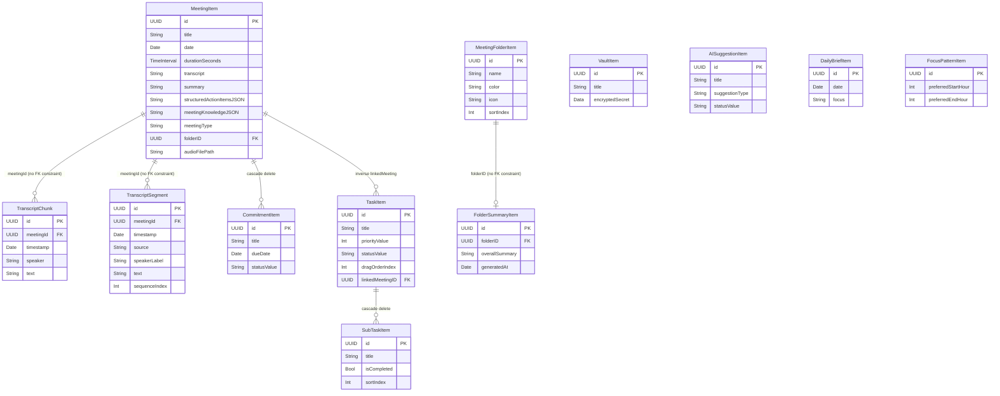

# 07 — SwiftData Architecture

**Document status:** Authoritative  
**Last updated:** 2026-06-29  
**Review scope:** OrinModels.swift, TranscriptStore.swift, ModelContext+SafeSave.swift  
**Verdict for this subsystem:** REFACTOR (batched writes, external storage, meetingId predicates)

---

## Table of Contents

1. [Data Model Overview](#1-data-model-overview)
2. [TranscriptChunk vs TranscriptSegment — Critical Distinction](#2-transcriptchunk-vs-transcriptsegment--critical-distinction)
3. [Write Pattern Analysis](#3-write-pattern-analysis)
4. [Read Pattern Analysis](#4-read-pattern-analysis)
5. [MeetingItem.transcript and @Attribute(.externalStorage)](#5-meetingitemtranscript-and-attributeexternalstorage)
6. [ModelContext Ownership and Actor Isolation](#6-modelcontext-ownership-and-actor-isolation)
7. [Observation Graph Analysis](#7-observation-graph-analysis)
8. [SafeSave Pattern](#8-safesave-pattern)
9. [SwiftData Migration Strategy](#9-swiftdata-migration-strategy)
10. [Proposed SwiftData Architecture](#10-proposed-swiftdata-architecture)
11. [Should SwiftData Remain on the Hot Path?](#11-should-swiftdata-remain-on-the-hot-path)

---

## 1. Data Model Overview

The Orin SwiftData schema contains twelve `@Model` classes. They divide into three functional groups:

| Group | Classes |
|---|---|
| Meeting intelligence | `MeetingItem`, `TranscriptChunk`, `TranscriptSegment`, `MeetingFolderItem`, `FolderSummaryItem`, `CommitmentItem` |
| Task management | `TaskItem`, `SubTaskItem` |
| Ancillary | `VaultItem`, `AISuggestionItem`, `DailyBriefItem`, `FocusPatternItem` |

### 1.1 MeetingItem

The central aggregate for a single recorded meeting. Every other meeting-related model references it by `UUID` rather than by a SwiftData relationship, with the exception of `CommitmentItem` (which holds a cascade relationship) and `TaskItem` (inverse relationship via `linkedMeeting`).

**Stored properties**

| Property | Type | Notes |
|---|---|---|
| `id` | `UUID` | `@Attribute(.unique)`. Primary key. |
| `title` | `String` | Display name. |
| `date` | `Date` | Start time. |
| `durationSeconds` | `TimeInterval` | Set by `finalize()`. Zero before recording completes. |
| `participants` | `[String]` | Speaker names as string array (no normalization). |
| `transcript` | `String` | Full speaker-labeled transcript. Up to ~50,000 chars for a 90-min meeting. **Inline SQLite TEXT column — loaded for every meeting in list queries.** |
| `summary` | `String` | AI-generated summary. |
| `decisions` | `[String]` | AI-extracted decision strings. |
| `actionItems` | `[String]` | Legacy flat action item strings. |
| `suggestedTaskTitles` | `[String]` | Task suggestions pending user acceptance. |
| `acceptedSuggestedTaskTitles` | `[String]` | Accepted suggestions. |
| `tags` | `[String]` | User-assigned tags. |
| `folderID` | `UUID?` | Foreign key into `MeetingFolderItem` (no SwiftData relationship). |
| `externalEventIdentifier` | `String?` | Calendar event ID. |
| `recordingDeletedAt` | `Date?` | Soft-delete timestamp for audio file. |
| `transcriptDeletedAt` | `Date?` | Soft-delete timestamp for transcript content. |
| `deletedAt` | `Date?` | Soft-delete for the whole meeting. |
| `audioFilePath` | `String?` | Absolute path to the recorded `.m4a` / `.caf` file. |
| `meetingType` | `String` | AI-classified type, e.g. "Standup", "Sales Call". Default `""`. |
| `openQuestions` | `[String]` | Unresolved questions from the meeting. |
| `risks` | `[String]` | Identified risks. |
| `dependencies` | `[String]` | External blockers. |
| `structuredActionItemsJSON` | `String?` | JSON-encoded `[ActionItemRecord]`. Nil until analysis runs. |
| `meetingKnowledgeJSON` | `String?` | JSON-encoded `MeetingKnowledgeSnapshot`. Updated after every analysis. |

**Relationships**

| Property | Type | Rule |
|---|---|---|
| `commitments` | `[CommitmentItem]` | `@Relationship(deleteRule: .cascade)` |
| `tasks` | `[TaskItem]` | Inverse of `TaskItem.linkedMeeting`. No explicit delete rule (TaskItem survives meeting deletion). |

**Computed properties (not stored in SQLite)**

`structuredActionItems: [ActionItemRecord]`
: Decodes `structuredActionItemsJSON` on every call. Allocates a `JSONDecoder` and parses JSON each time. Called from list-row rendering. See Section 7 for the performance impact.

`effectiveActionItemCount: Int`
: Returns `structuredActionItems.count` when `structuredActionItemsJSON != nil`, else `actionItems.count`. Calls `structuredActionItems`, inheriting its decoding cost.

`decodedKnowledgeSnapshot: MeetingKnowledgeSnapshot?`
: Decodes `meetingKnowledgeJSON` on every call. Same allocation pattern.

`endDate: Date`
: `date + durationSeconds`, with a 3600s floor when `durationSeconds == 0`.

`isInProgress: Bool`
: `date <= now && endDate > now`.

### 1.2 TranscriptChunk

Crash-recovery checkpoint written during an active recording session. See Section 2 for the full lifecycle discussion.

| Property | Type | Notes |
|---|---|---|
| `id` | `UUID` | `@Attribute(.unique)`. |
| `meetingId` | `UUID` | Foreign key. No SwiftData relationship. No SQLite index. |
| `timestamp` | `Date` | Wall clock at write time. |
| `speaker` | `String` | `"mic"` or `"participant"`. |
| `text` | `String` | Full accumulated transcript for this speaker channel at this point. Not a delta. |

### 1.3 TranscriptSegment

The final, authoritative conversation timeline built by `finalize()`. Each segment is a delta (new content only) for one speaker at one point in time.

| Property | Type | Notes |
|---|---|---|
| `id` | `UUID` | `@Attribute(.unique)`. |
| `meetingId` | `UUID` | Foreign key. No SwiftData relationship. No SQLite index. |
| `timestamp` | `Date` | Wall clock at capture time. |
| `source` | `String` | `"mic"` or `"participant"` (physical origin). |
| `speakerLabel` | `String` | `"Me"`, `"Participant"`. Future: `"Speaker 1"`, `"Speaker 2"`. |
| `text` | `String` | Delta transcript text for this segment. |
| `sequenceIndex` | `Int` | Tie-break ordering for same-timestamp segments. |

### 1.4 MeetingFolderItem

A user-defined folder grouping multiple `MeetingItem` records. Meetings reference folders via `MeetingItem.folderID` (UUID foreign key), not a SwiftData relationship.

| Property | Type | Notes |
|---|---|---|
| `id` | `UUID` | `@Attribute(.unique)`. |
| `name` | `String` | Display name. |
| `folderDescription` | `String` | User notes. |
| `createdAt`, `updatedAt` | `Date` | Timestamps. |
| `isExpanded` | `Bool` | UI state stored in the model (concern: persisting view state in domain layer). |
| `sortIndex` | `Int` | Manual sort ordering. |
| `color` | `String` | Accent color identifier. |
| `icon` | `String` | SF Symbol name. |

### 1.5 FolderSummaryItem

Cached AI-generated cross-meeting intelligence for a folder. One record per folder, regenerated on demand.

| Property | Type | Notes |
|---|---|---|
| `id` | `UUID` | `@Attribute(.unique)`. |
| `folderID` | `UUID` | Foreign key into `MeetingFolderItem`. No index. |
| `overallSummary` | `String` | AI narrative. |
| `recurringDecisions`, `recurringActionItems`, `recurringTopics`, `recurringBlockers`, `recurringRisks` | `[String]` | Aggregated fields. |
| `meetingCount` | `Int` | Number of meetings included in this summary. |
| `generatedAt` | `Date` | Cache timestamp. |

### 1.6 CommitmentItem

Individual commitment extracted from a meeting. Held in a cascade relationship from `MeetingItem`.

| Property | Type | Notes |
|---|---|---|
| `id` | `UUID` | `@Attribute(.unique)`. |
| `title` | `String` | Commitment description. |
| `dueDate` | `Date?` | Optional deadline. |
| `statusValue` | `String` | `"open"` by default. |
| `createdAt` | `Date` | Creation timestamp. |

### 1.7 TaskItem and SubTaskItem

`TaskItem` is a standalone task that may optionally link to a `MeetingItem`. `SubTaskItem` belongs exclusively to a `TaskItem` via cascade relationship.

`TaskItem` notable fields: `priorityValue: Int` (backing `priority: TaskPriority` computed property), `statusValue: String` (backing `status: TaskStatus`), `dragOrderIndex: Int`, `isBacklog: Bool`, `triggerDate: Date?`.

### 1.8 Ancillary Models

| Model | Purpose |
|---|---|
| `VaultItem` | Encrypted secrets. `encryptedSecret: Data` stored inline. |
| `AISuggestionItem` | AI-generated suggestions with accept/decline lifecycle. `hiddenUntil: Date?` for snoozing. |
| `DailyBriefItem` | AI daily briefing snapshot. One per day. |
| `FocusPatternItem` | User focus pattern metrics (preferred hours, interruptions). |

### 1.9 Entity-Relationship Diagram



Note: Dashed relationships (TranscriptChunk, TranscriptSegment, FolderSummaryItem) use UUID foreign keys with no SwiftData `@Relationship` declaration. SwiftData does not enforce referential integrity for these; orphan cleanup is the responsibility of `ModelContext.deleteMeetingFully()`.

---

## 2. TranscriptChunk vs TranscriptSegment — Critical Distinction

This is the most common source of developer confusion in the persistence layer. The two types serve fundamentally different purposes and exist at different points in the meeting lifecycle.

### TranscriptChunk: Crash-Recovery Checkpoint

`TranscriptChunk` is a **write-during-recording, discard-after-finalize** record. Its sole purpose is to enable recovery of transcript content if the app crashes, is force-quit, or the recording session terminates abnormally before `finalize()` runs.

**Key characteristics:**
- Written by `TranscriptStore.persistChunkIfNeeded()` every time a speaker channel grows by 10 or more characters.
- `text` is the **full accumulated** transcript for that speaker channel, not a delta. The most recent chunk per speaker contains everything said so far.
- Multiple chunks per speaker exist during a session — each is a snapshot of growing text.
- Used by `finalize()` as one of five recovery candidates (see `latestTextFromChunks()`).
- Used by `recoverOrphan()` on app relaunch after a crash.
- **Should be deleted after `finalize()` succeeds.** Currently they are never pruned. This is performance debt MT-008.

**Lifecycle:**

```
Recording starts
    → TranscriptChunk(speaker: "mic", text: "Me: Hello")        [chunk #1]
    → TranscriptChunk(speaker: "mic", text: "Me: Hello world")  [chunk #2]
    → TranscriptChunk(speaker: "participant", text: "Participant: Hi") [chunk #3]
    
finalize() called
    → latestTextFromChunks() reads chunk #2 (mic) + chunk #3 (participant)
    → Reconstructed transcript used as recovery candidate
    → buildTimelineSegments() reads ALL chunks to build TranscriptSegments
    
SHOULD HAPPEN (currently missing):
    → All TranscriptChunks for this meetingId deleted
```

### TranscriptSegment: Final Authoritative Record

`TranscriptSegment` is a **write-once-at-finalize, read-many** record. It represents the interleaved conversation timeline for display in the meeting detail view.

**Key characteristics:**
- Written exactly once by `TranscriptStore.buildTimelineSegments()` at the end of `finalize()`.
- `text` is a **delta** — only the new content for that time window, not the accumulated total.
- Ordered by `timestamp` + `sequenceIndex` to reconstruct the conversation flow.
- Read by the conversation timeline view.
- Never modified after creation.
- Deleted only when the meeting itself is deleted (via `deleteMeetingFully()`).

**What the timeline looks like:**

```
TranscriptSegment(timestamp: T+0:03, speakerLabel: "Me",          text: "Hello everyone.")
TranscriptSegment(timestamp: T+0:10, speakerLabel: "Participant", text: "Good morning.")
TranscriptSegment(timestamp: T+0:18, speakerLabel: "Me",          text: "Let's get started.")
```

### Side-by-Side Comparison

| Dimension | TranscriptChunk | TranscriptSegment |
|---|---|---|
| When written | Continuously during recording | Once, at finalize() |
| Content | Full accumulated text per speaker | Delta text only |
| Count per meeting | Many (one per 10-char growth event) | One per conversation turn |
| Pruned after use | No (should be, but is not) | Never (permanent record) |
| Primary use | Crash recovery | Conversation timeline display |
| Read by | finalize(), recoverOrphan() | MeetingDetailView timeline |
| Has meetingId index | No | No |

---

## 3. Write Pattern Analysis

### 3.1 Current Pattern: O(N) Saves During Recording

`TranscriptStore.persistChunkIfNeeded()` calls `context.save()` synchronously every time either speaker channel grows by 10 characters:

```swift
// TranscriptStore.swift — current implementation
private func persistChunkIfNeeded(speaker: String, text: String, previousLength: Int) {
    guard let meeting = activeMeeting,
          let context = activeContext,
          text.count - previousLength >= Self.chunkWriteThreshold else { return }
    let chunk = TranscriptChunk(meetingId: meeting.id, speaker: speaker, text: text)
    context.insert(chunk)
    do {
        try context.save()   // <-- SQLite WAL write on every 10-char growth
    } catch {
        log.warning("TranscriptChunk save failed (non-fatal): \(error)")
    }
}
```

At a typical speech rate of 140 words per minute (average 5 chars/word), a 10-char threshold triggers approximately every 8.5 seconds per active speaker. With both mic and participant active during a meeting:

- Two save calls every ~8.5 seconds = ~14 saves/minute
- For a 90-minute meeting: ~1,260 SQLite WAL writes
- Each write flushes SwiftData's pending changeset to disk, contending with the checkpoint timer's writes

The save frequency is not the only problem. Each `context.save()` also flushes all *other* pending inserts and mutations that happened to be in the context at that moment — making the write timing non-deterministic from the perspective of other concurrent writes.

This is performance bottleneck **PB-003** from the architectural review.

### 3.2 The Checkpoint Timer: Already Does the Save

The 3-second checkpoint timer calls `checkpoint()`, which calls `context.safeSaveWithRetry()`. This already flushes all pending inserts, including any `TranscriptChunk` records that were inserted but not yet saved.

The `context.save()` in `persistChunkIfNeeded()` is therefore redundant with the checkpoint timer for all but the crash-recovery window between checkpoint ticks.

The actual crash-recovery window for chunk data is: at most 3 seconds of content (one checkpoint interval). Removing the per-chunk `save()` does not meaningfully reduce crash-recovery fidelity, because the chunk record is inserted into the context as soon as `context.insert(chunk)` executes — if the checkpoint timer fires within 3 seconds, it will flush the chunk to disk.

### 3.3 Fix: Insert Only, Let Checkpoint Save

```swift
// Fixed implementation — removes per-chunk save()
private func persistChunkIfNeeded(speaker: String, text: String, previousLength: Int) {
    guard let meeting = activeMeeting,
          let context = activeContext,
          text.count - previousLength >= Self.chunkWriteThreshold else { return }
    let chunk = TranscriptChunk(meetingId: meeting.id, speaker: speaker, text: text)
    context.insert(chunk)
    // No context.save() here. The 3-second checkpoint timer's safeSaveWithRetry()
    // will flush this insert along with the MeetingItem.transcript update.
    log.debug("TranscriptChunk queued speaker=\(speaker) chars=\(text.count)")
}
```

**Impact:**
- Reduces SQLite writes from ~14/minute to the checkpoint rate of 20/hour during a 60-minute meeting.
- Eliminates WAL contention between per-chunk saves and checkpoint saves.
- Crash recovery fidelity is unchanged: the worst-case data loss window is 3 seconds, which was already true for `MeetingItem.transcript` saves via the checkpoint timer.

This is quick win **QW-008** from the architectural review.

### 3.4 MeetingItem.transcript Checkpoint Writes

The checkpoint timer writes `MeetingItem.transcript` every 3 seconds when content has grown:

```swift
func checkpoint() {
    // ...
    meeting.transcript = text
    context.safeSaveWithRetry(context: "transcript checkpoint")
    // ...
}
```

This is the correct pattern. The issue is that the per-chunk `context.save()` calls in between create additional WAL writes that compete with checkpoint writes. Removing the per-chunk saves makes checkpoint writes the sole write path during recording, giving the SQLite WAL checkpointing algorithm a predictable, regular write pattern to optimize.

### 3.5 finalize() Saves

`finalize()` performs two saves:
1. An implicit save within `buildTimelineSegments()` after inserting `TranscriptSegment` records.
2. `context.safeSaveWithRetry(context: "meeting recording final")` for the `MeetingItem` update.

These are correct and should not be changed. The finalization path is non-hot and correctness matters more than write frequency here.

---

## 4. Read Pattern Analysis

### 4.1 allSegments @Query — Full Table Scan, No Predicate

Performance bottleneck **PB-004**. Location: `MeetingsView.swift`.

The view declares a `@Query` for all `TranscriptSegment` records with no predicate:

```swift
// MeetingsView.swift — current (problematic)
@Query private var allSegments: [TranscriptSegment]
```

This causes SwiftData to load every `TranscriptSegment` from every meeting into memory on every render of `MeetingsView`. For a user with 100 meetings averaging 200 segments each, this is 20,000 model objects loaded unconditionally.

`TranscriptSegment` records are per-turn delta texts, not full transcripts, so individual record size is moderate — but the sheer count causes both memory pressure and fetch latency.

The fix is to not use a top-level `@Query` at all. `TranscriptSegment` records belong to the `MeetingDetailView` for a specific meeting. The `MeetingsView` list has no need for segment data.

```swift
// Fixed: remove allSegments from MeetingsView entirely.
// In MeetingDetailView, use a predicated fetch:
@Query(
    filter: #Predicate<TranscriptSegment> { $0.meetingId == meetingId },
    sort: [SortDescriptor(\.timestamp), SortDescriptor(\.sequenceIndex)]
)
private var segments: [TranscriptSegment]
```

Note: SwiftData `@Query` does not accept `let` constants as predicate parameters at the property declaration site. The correct pattern is to pass the `meetingId` via a subview initializer with an `init(meetingId:)` that constructs the `@Query` dynamically.

### 4.2 allMeetings @Query — transcript Loaded for Every Row

Performance bottleneck **PB-005**. The meeting list `@Query` fetches `MeetingItem` for every meeting. `MeetingItem.transcript` is an inline `String` column in SQLite — it is loaded as part of the row fetch even when the list view only needs `title`, `date`, and `summary`.

For a user with 50 meetings averaging 25,000 characters of transcript each:
- Data loaded: 50 × 25,000 = 1,250,000 characters = approximately 1.25 MB per list render
- This data is never displayed in the list view

The short-term fix is `@Attribute(.externalStorage)` on `transcript`. See Section 5.

The longer-term fix is a separate lightweight projection type. SwiftData does not yet support value-type projections (unlike Core Data's `NSFetchRequest` with `propertiesToFetch`). Until Apple adds this, external storage is the practical mitigation.

### 4.3 buildTimelineSegments() — Full Table Scan

Located in `TranscriptStore.buildTimelineSegments()`. Called once at the end of `finalize()`.

```swift
// Current — fetches ALL TranscriptChunks from ALL meetings
var chunkDescriptor = FetchDescriptor<TranscriptChunk>(
    sortBy: [SortDescriptor(\.timestamp, order: .forward)]
)
chunkDescriptor.fetchLimit = 10_000

guard let allChunks = try? context.fetch(chunkDescriptor) else { return }
let chunks = allChunks.filter { $0.meetingId == meetingID }  // in-memory filter
```

This is a full table scan followed by in-memory filtering. For a user with 200 meetings and ~50 chunks/meeting, this fetches 10,000 records to filter down to ~50. This is performance bottleneck **PB-006** and quick win **QW-009**.

Fix: add a meetingId predicate to the `FetchDescriptor`.

```swift
// Fixed — predicated fetch, no in-memory filter
var chunkDescriptor = FetchDescriptor<TranscriptChunk>(
    predicate: #Predicate { $0.meetingId == meetingID },
    sortBy: [SortDescriptor(\.timestamp, order: .forward)]
)
chunkDescriptor.fetchLimit = 10_000

guard let chunks = try? context.fetch(chunkDescriptor), !chunks.isEmpty else { return }
```

The same pattern applies to `latestTextFromChunks()`, which already uses a `meetingId` predicate and serves as the correct model.

The same full-table-scan pattern appears in `deleteMeetingFully()` in `ModelContext+SafeSave.swift`:

```swift
// Current — three full table scans
let allChunks = (try? fetch(FetchDescriptor<TranscriptChunk>())) ?? []
allChunks.filter { $0.meetingId == meetingID }.forEach { delete($0) }

let allSegs = (try? fetch(FetchDescriptor<TranscriptSegment>())) ?? []
allSegs.filter { $0.meetingId == meetingID }.forEach { delete($0) }

let allSummaries = (try? fetch(FetchDescriptor<FolderSummaryItem>())) ?? []
allSummaries.filter { $0.folderID == folderID }.forEach { delete($0) }
```

Fix: replace each with a predicated `FetchDescriptor` using `meetingId` / `folderID` predicates.

### 4.4 structuredActionItems — Decoded on Every Access

Performance bottleneck **PB-007**. `MeetingItem.structuredActionItems` is a computed property that allocates a `JSONDecoder` and decodes JSON on every call:

```swift
var structuredActionItems: [ActionItemRecord] {
    guard let json = structuredActionItemsJSON,
          let data = json.data(using: .utf8),
          let items = try? JSONDecoder().decode([ActionItemRecord].self, from: data)
    else { return [] }
    return items
}
```

This property is called:
- In `effectiveActionItemCount` (called during list rendering)
- In `MeetingKnowledgeSnapshot.init(from:)` (called during analysis)
- Potentially in SwiftUI `body` computed properties during list render passes

During a `MeetingsView` render with 50 meetings, this can trigger 50 JSON decode operations. See Section 7 for the caching fix.

---

## 5. MeetingItem.transcript and @Attribute(.externalStorage)

### 5.1 Current State

`transcript: String` is declared without storage attributes:

```swift
@Model
final class MeetingItem {
    // ...
    var transcript: String
    // ...
}
```

SwiftData maps this to an inline `TEXT` column in the SQLite store. When SwiftData executes a `FetchDescriptor<MeetingItem>`, it reads all columns for every fetched row, including `transcript`. There is no equivalent of Core Data's `NSFetchRequest.propertiesToFetch` to exclude large columns.

### 5.2 The Problem

The meeting list view fetches all `MeetingItem` records to display the list. It uses `title`, `date`, `summary`, and `effectiveActionItemCount`. It does not use `transcript`. But the `transcript` column — potentially 50,000 characters per meeting — is loaded into memory for every row regardless.

Calculation for 50 meetings, 25,000 chars average:
- 50 × 25,000 bytes = 1,250,000 bytes ≈ 1.25 MB loaded per list render
- At Swift `String`'s 1-byte UTF-8 encoding for ASCII content, this is the floor
- For a 200-meeting user: 5 MB per list render

### 5.3 Fix: @Attribute(.externalStorage)

```swift
@Model
final class MeetingItem {
    // ...
    @Attribute(.externalStorage) var transcript: String
    // ...
}
```

When `@Attribute(.externalStorage)` is applied to a `String` or `Data` property, SwiftData stores the value as a binary file in the app's Application Support directory (under `com.apple.SwiftData/<container>/`) and stores only a reference token in the SQLite row. The value is loaded from disk only when the property is explicitly accessed.

**Effect:** fetching 50 `MeetingItem` records for the list view no longer reads 1.25 MB of transcript data. The transcript is loaded lazily only when the user opens a meeting detail view.

**Requirements:**
1. This is a schema change and requires a SwiftData migration. See Section 9.
2. The external storage files are managed by SwiftData and are included in iCloud backups alongside the SQLite store. No additional backup logic is needed.
3. `@Attribute(.externalStorage)` is available from iOS 17 / macOS 14. Orin targets macOS 14+, so there is no deployment target concern.

### 5.4 Properties That Should Also Use External Storage

`meetingKnowledgeJSON: String?` is another candidate. A `MeetingKnowledgeSnapshot` encoded as JSON can be several kilobytes per meeting. It is never needed in the list view.

```swift
@Attribute(.externalStorage) var meetingKnowledgeJSON: String?
```

`structuredActionItemsJSON: String?` is typically small (< 2 KB), but if the number of action items grows it could be worth externalizing. Defer to production profiling.

---

## 6. ModelContext Ownership and Actor Isolation

### 6.1 The Single ModelContext Architecture

Orin uses a single `ModelContext` shared from the SwiftUI environment (the main-actor-bound context created by `.modelContainer()`). All SwiftData operations run through this context.

```
App entry point
  └── .modelContainer(schema, configurations: [...])
        └── ModelContext (main actor, auto-created)
              ├── TranscriptStore (@MainActor)
              ├── MeetingsView @Query decorators
              └── ModelContext+SafeSave extensions
```

SwiftData's `ModelContext` is not `Sendable` and must not be accessed from off-actor contexts. It is implicitly `@MainActor`-bound when created via the SwiftUI environment.

### 6.2 TranscriptStore Actor Isolation

`TranscriptStore` is declared `@MainActor @Observable`. All of its methods, including the hot-path `updateMic()` and `updateParticipant()`, run on the main actor.

The `persistChunkIfNeeded()` call — which performs `context.insert()` and `context.save()` — is therefore on the main actor. This is safe for SwiftData but has the implication that a slow SQLite write blocks the main thread, which is why removing the per-chunk `context.save()` (Section 3.3) matters: WAL writes are no longer on the main thread's critical path between checkpoint ticks.

### 6.3 How Recognition Callbacks Reach TranscriptStore

Recognition callbacks (`SFSpeechRecognitionDelegate` methods, `AVAudioEngine` callbacks) arrive on arbitrary background threads. The call chain to `TranscriptStore.updateMic()` must hop to the main actor:

```swift
// Pattern used in RecordingService
recognitionTask = speechRecognizer.recognitionTask(with: request) { [weak self] result, error in
    // This closure runs on an SFSpeechRecognizer internal thread
    guard let result else { return }
    let text = result.bestTranscription.formattedString
    Task { @MainActor [weak self] in
        self?.transcriptStore.updateMic(text)
    }
}
```

The `Task { @MainActor }` hop is correct. The cost of this hop is negligible (a few microseconds for the main-actor enqueue). The risk is queuing latency if the main thread is saturated — which is exactly the scenario that O(N^2) saves create.

### 6.4 Orphan Recovery

`TranscriptStore.recoverOrphan(in:)` takes a `ModelContext` parameter and is marked `@MainActor`. It is called once at app launch from the SwiftUI `onAppear` handler, which is already on the main actor. The ModelContext passed in is the environment context.

The orphan recovery path correctly uses a predicated `FetchDescriptor` for the `MeetingItem` lookup:

```swift
var descriptor = FetchDescriptor<MeetingItem>(
    predicate: #Predicate { $0.id == meetingID }
)
descriptor.fetchLimit = 1
```

This is the correct pattern and should be applied to the chunk and segment fetch paths that currently use full-table scans.

### 6.5 Background Context Consideration

SwiftData supports creating background `ModelContext` instances from a `ModelContainer` for off-main-actor persistence. The current architecture does not use this capability. Adding it would allow `TranscriptChunk` writes to occur off the main thread, but given that the correct fix is to eliminate per-chunk saves entirely (Section 3.3), a background context is not needed for the crash-recovery path.

A background context becomes relevant for the proposed AI pipeline changes (Section 10) where analysis writes (`structuredActionItemsJSON`, `meetingKnowledgeJSON`) could be performed off the main thread.

---

## 7. Observation Graph Analysis

### 7.1 How @Observable Triggers Re-Renders

`MeetingItem` is a SwiftData `@Model`, which implicitly applies `@Observable` (via the macro expansion). When any stored property of a `MeetingItem` is mutated, SwiftData's observation infrastructure notifies all SwiftUI views that read that property, scheduling them for re-render on the next frame.

During transcript recording, `MeetingItem.transcript` is updated every 3 seconds by the checkpoint timer. Each update triggers a re-render of every SwiftUI view that reads `meeting.transcript` — which includes `MeetingDetailView` and any list rows that display a transcript preview.

This is intentional and correct behavior for the detail view. It becomes a problem in the list view if the list row reads `meeting.transcript` directly.

### 7.2 structuredActionItems on the Hot Rendering Path

When `MeetingsView` renders its list of meeting rows, each row calls something equivalent to:

```swift
// Example list row body (illustrative)
var body: some View {
    VStack {
        Text(meeting.title)
        Text("\(meeting.effectiveActionItemCount) action items")
    }
}
```

`effectiveActionItemCount` calls `structuredActionItems`, which calls `JSONDecoder().decode(...)`. In a list of 50 meetings:

- 50 `JSONDecoder` allocations per render pass
- 50 JSON parse operations
- Each `[ActionItemRecord]` array is heap-allocated and immediately discarded

For a short JSON payload (5 action items ≈ 800 bytes), this is approximately 50 × 10 microseconds = 500 microseconds per render pass. At 60 FPS this leaves 16.7 ms per frame. A 500-microsecond overhead on the main thread for a non-scrolling list is acceptable, but it degrades as meeting count grows and during scroll.

The correct fix is `@Transient` cached storage:

```swift
@Model
final class MeetingItem {
    // ... stored properties unchanged ...

    @Transient private var _cachedActionItems: [ActionItemRecord]? = nil
    @Transient private var _cachedActionItemsJSON: String? = nil

    var structuredActionItems: [ActionItemRecord] {
        // Invalidate cache if JSON changed
        if _cachedActionItemsJSON != structuredActionItemsJSON {
            _cachedActionItemsJSON = structuredActionItemsJSON
            _cachedActionItems = nil
        }
        if let cached = _cachedActionItems { return cached }
        guard let json = structuredActionItemsJSON,
              let data = json.data(using: .utf8),
              let items = try? JSONDecoder().decode([ActionItemRecord].self, from: data)
        else { return [] }
        _cachedActionItems = items
        return items
    }
}
```

`@Transient` marks a property as not persisted to the SwiftData store. The `ModelContext` does not track changes to `@Transient` properties for observation purposes, so the cache does not trigger spurious re-renders.

The same pattern applies to `decodedKnowledgeSnapshot`.

### 7.3 Observation During Recording

During an active recording session, the following properties are mutated by `TranscriptStore` every 3 seconds:
- `MeetingItem.transcript`
- `MeetingItem.durationSeconds` (updated at finalize)

Each mutation triggers the SwiftUI observation graph. If `MeetingDetailView` reads `meeting.transcript` for live display, it re-renders every 3 seconds. This is expected and correct. The performance concern is in views that read `transcript` but are not the live display — for example, if the meeting list row reads `transcript` for a preview, it also re-renders every 3 seconds for the active meeting.

Audit all list row views to ensure they do not read `meeting.transcript`. Use `meeting.summary` for previews instead.

---

## 8. SafeSave Pattern

### 8.1 ModelContext+SafeSave.swift

The extension provides two save methods and one deletion method:

**`safeSave(context:)`**

Wraps `try context.save()` in a catch block that routes failures to `ErrorManager.shared.report(.storageSaveFailed(context:))`. Replaces `try? context.save()` patterns that silently discard errors.

```swift
func safeSave(context: String = "data", ...) {
    do {
        try save()
    } catch {
        storageLogger.error("ModelContext.save failed [\(context)]: \(error)")
        ErrorManager.shared.report(.storageSaveFailed(context: context))
    }
}
```

**`safeSaveWithRetry(context:retries:)`**

Attempts `save()` up to `retries` times (default 2) with no delay between attempts. On all-attempts failure, escalates via `ErrorManager`. The no-delay retry is designed for WAL checkpoint contention (a transient SQLITE_BUSY error), where a second immediate attempt often succeeds as the WAL reader finishes.

```swift
func safeSaveWithRetry(context: String = "data", retries: Int = 2, ...) {
    var lastError: Error?
    for attempt in 1...max(1, retries) {
        do {
            try save()
            if attempt > 1 { storageLogger.info("succeeded on attempt \(attempt)") }
            return
        } catch {
            lastError = error
            storageLogger.warning("attempt \(attempt)/\(retries) failed: \(error)")
        }
    }
    // escalate
}
```

**`deleteMeetingFully(_:)`**

Single authoritative deletion path for a `MeetingItem`. Cleans associated records in order:
1. Audio file on disk
2. `TranscriptChunk` records (full-table scan — see Section 4.3 for the fix)
3. `TranscriptSegment` records (full-table scan)
4. `FolderSummaryItem` (full-table scan on `folderID`)
5. The `MeetingItem` itself

Does not call `safeSave()` — the caller is responsible for saving, allowing batched deletions to share a single commit.

### 8.2 When to Use Which

| Scenario | Method |
|---|---|
| Single user-initiated save (task creation, settings change) | `safeSave(context:)` |
| High-frequency automatic saves (checkpoint timer, finalization) | `safeSaveWithRetry(context:retries:)` |
| Raw `try save()` | Never (use one of the above) |
| `try? save()` | Never (silently swallows errors) |

### 8.3 Retry Delay Consideration

The current retry has no delay. For SQLITE_BUSY errors under heavy WAL load, a small exponential backoff (e.g., 2ms, 4ms) would give the WAL writer time to finish. However, since `safeSaveWithRetry` runs on the main actor, any `Task.sleep` would require converting the function to `async`. The no-delay retry is a pragmatic compromise. If SQLite contention becomes measurable in production, the correct fix is to move large writes to a background `ModelContext`.

---

## 9. SwiftData Migration Strategy

### 9.1 Current Model Version

The codebase does not currently declare an explicit `VersionedSchema` or `SchemaMigrationPlan`. SwiftData uses automatic lightweight migration when the schema changes are non-destructive (adding optional properties, adding relationships). This has worked because all changes to date have been additive — new optional columns, new models.

Any change that requires data transformation (not just schema alteration) requires an explicit migration plan.

### 9.2 Changes That Require Explicit Migration

| Change | Migration type | Explicit plan needed? |
|---|---|---|
| Add new `@Model` class | Lightweight | No |
| Add new optional property to existing `@Model` | Lightweight | No |
| Add `@Attribute(.externalStorage)` to `transcript` | Data migration | Yes |
| Add `@Attribute(.externalStorage)` to `meetingKnowledgeJSON` | Data migration | Yes |
| Add `VocabularyItem` model (MT-004) | Lightweight | No |
| Add `@Index` attribute to `meetingId` on `TranscriptChunk` | Lightweight | No |
| Rename a property | Custom migration | Yes |
| Change property type | Custom migration | Yes |

Adding `@Attribute(.externalStorage)` to `transcript` requires moving existing inline data out of SQLite columns and into external files. SwiftData's lightweight migration does not handle this automatically. An explicit `SchemaMigrationPlan` is required.

### 9.3 How to Declare a VersionedSchema

```swift
// OrinSchemaV1.swift — the current schema (declare retroactively)
enum OrinSchemaV1: VersionedSchema {
    static var versionIdentifier = Schema.Version(1, 0, 0)
    static var models: [any PersistentModel.Type] {
        [
            MeetingItem.self,
            TranscriptChunk.self,
            TranscriptSegment.self,
            MeetingFolderItem.self,
            FolderSummaryItem.self,
            CommitmentItem.self,
            TaskItem.self,
            SubTaskItem.self,
            VaultItem.self,
            AISuggestionItem.self,
            DailyBriefItem.self,
            FocusPatternItem.self,
        ]
    }
    // V1 model classes are defined here or referenced from OrinModels.swift.
    // The V1 MeetingItem.transcript is plain String (no externalStorage).
}

// OrinSchemaV2.swift — adds @Attribute(.externalStorage) to transcript
enum OrinSchemaV2: VersionedSchema {
    static var versionIdentifier = Schema.Version(2, 0, 0)
    static var models: [any PersistentModel.Type] {
        // Same list as V1, but with V2-annotated MeetingItem
        [MeetingItemV2.self, /* ... */]
    }

    @Model
    final class MeetingItemV2 {
        // ... all properties identical to V1 MeetingItem, except:
        @Attribute(.externalStorage) var transcript: String
        @Attribute(.externalStorage) var meetingKnowledgeJSON: String?
    }
}
```

### 9.4 The MigrationPlan

```swift
enum OrinMigrationPlan: SchemaMigrationPlan {
    static var schemas: [any VersionedSchema.Type] {
        [OrinSchemaV1.self, OrinSchemaV2.self]
    }

    static var stages: [MigrationStage] {
        [migrateV1toV2]
    }

    static let migrateV1toV2 = MigrationStage.custom(
        fromVersion: OrinSchemaV1.self,
        toVersion: OrinSchemaV2.self,
        willMigrate: nil,
        didMigrate: { context in
            // SwiftData has already moved the schema to V2.
            // The transcript data is still in the SQLite column.
            // We need to touch each MeetingItem so SwiftData writes
            // the transcript string through the new externalStorage path.
            let meetings = try context.fetch(FetchDescriptor<OrinSchemaV2.MeetingItemV2>())
            for meeting in meetings {
                // Reading and re-assigning forces SwiftData to externalize the blob.
                let text = meeting.transcript
                meeting.transcript = text
            }
            try context.save()
        }
    )
}
```

Pass the plan to the container:

```swift
// In the App entry point or OrinApp.swift
let container = try ModelContainer(
    for: Schema(versionedSchema: OrinSchemaV2.self),
    migrationPlan: OrinMigrationPlan.self,
    configurations: [ModelConfiguration(schema: Schema(versionedSchema: OrinSchemaV2.self))]
)
```

### 9.5 Testing the Migration

1. Archive a build with the V1 schema and a populated store.
2. Install the V2 build on the same machine.
3. Verify that: all meetings appear, transcripts are intact, the SQLite file size decreases, and external blob files appear in Application Support.
4. Test orphan recovery with a V2 store.

---

## 10. Proposed SwiftData Architecture

### 10.1 VocabularyItem Model (MT-004)

The current vocabulary system uses a hardcoded array of 103 terms in `VocabularyProvider.swift` with a silent `.prefix(100)` truncation. The redesign introduces a SwiftData-backed `VocabularyItem`:

```swift
// Proposed VocabularyItem.swift
enum VocabularyTier: Int, Codable {
    case builtIn    = 0   // Shipped with the app, language-specific
    case org        = 1   // Organization-level (future: cloud-synced)
    case user       = 2   // User-added via SettingsView
    case session    = 3   // Inferred from meeting attendee names
}

@Model
final class VocabularyItem {
    @Attribute(.unique) var id: UUID
    /// The vocabulary term as it should appear in transcripts.
    var term: String
    /// Language code this term applies to, e.g. "en-US", "en-IN", "".
    /// Empty string means language-agnostic (applies to all locales).
    var languageCode: String
    /// Tier determines priority: session > user > org > builtIn.
    var tierValue: Int
    var createdAt: Date
    /// True when this term was promoted by CorrectionStore (frequency >= 3).
    var isAutoPromoted: Bool

    var tier: VocabularyTier {
        get { VocabularyTier(rawValue: tierValue) ?? .user }
        set { tierValue = newValue.rawValue }
    }

    init(term: String, languageCode: String = "", tier: VocabularyTier = .user) {
        id = UUID()
        self.term = term
        self.languageCode = languageCode
        tierValue = tier.rawValue
        createdAt = Date()
        isAutoPromoted = false
    }
}
```

Priority resolution at recognition time:

```swift
// VocabularyProvider (revised)
func terms(forLanguage languageCode: String) -> [String] {
    // Fetch from SwiftData, ordered by tier descending (session first)
    var descriptor = FetchDescriptor<VocabularyItem>(
        predicate: #Predicate {
            $0.languageCode == languageCode || $0.languageCode == ""
        },
        sortBy: [SortDescriptor(\.tierValue, order: .reverse)]
    )
    descriptor.fetchLimit = 500
    let items = (try? context.fetch(descriptor)) ?? []
    // Deduplicate: higher tier wins on collision
    var seen = Set<String>()
    return items.compactMap { item in
        let lower = item.term.lowercased()
        guard !seen.contains(lower) else { return nil }
        seen.insert(lower)
        return item.term
    }
}
```

### 10.2 CorrectionStore Model

The correction learning system promotes frequently corrected words into the user vocabulary tier:

```swift
// Proposed CorrectionStore model
@Model
final class CorrectionRecord {
    @Attribute(.unique) var id: UUID
    /// The mis-transcribed word.
    var original: String
    /// The word the user corrected it to.
    var correction: String
    /// Number of times this specific original→correction pair has been applied.
    var frequency: Int
    /// Whether this correction has been promoted to a VocabularyItem.
    var isPromoted: Bool
    var lastSeenAt: Date

    init(original: String, correction: String) {
        id = UUID()
        self.original = original
        self.correction = correction
        frequency = 1
        isPromoted = false
        lastSeenAt = Date()
    }
}
```

Promotion logic (run after any user transcript edit):

```swift
// CorrectionLearner (service layer)
func recordCorrection(original: String, correction: String, in context: ModelContext) {
    var descriptor = FetchDescriptor<CorrectionRecord>(
        predicate: #Predicate { $0.original == original && $0.correction == correction }
    )
    descriptor.fetchLimit = 1
    if let existing = try? context.fetch(descriptor).first {
        existing.frequency += 1
        existing.lastSeenAt = Date()
        if existing.frequency >= 3, !existing.isPromoted {
            promote(existing, in: context)
        }
    } else {
        context.insert(CorrectionRecord(original: original, correction: correction))
    }
    context.safeSave(context: "correction record")
}

private func promote(_ record: CorrectionRecord, in context: ModelContext) {
    let item = VocabularyItem(
        term: record.correction,
        languageCode: "",
        tier: .user
    )
    item.isAutoPromoted = true
    context.insert(item)
    record.isPromoted = true
}
```

### 10.3 TranscriptChunk Pruning After finalize() (MT-008)

Add a pruning step at the end of `TranscriptStore.finalize()`, after `buildTimelineSegments()` succeeds:

```swift
// In TranscriptStore.finalize(), after buildTimelineSegments():
private func pruneChunks(for meetingID: UUID, context: ModelContext) {
    let descriptor = FetchDescriptor<TranscriptChunk>(
        predicate: #Predicate { $0.meetingId == meetingID }
    )
    guard let chunks = try? context.fetch(descriptor) else { return }
    chunks.forEach { context.delete($0) }
    // Save is batched with the caller's final safeSaveWithRetry
    log.info("pruned \(chunks.count) chunks for meetingID=\(meetingID)")
}
```

Call it before `endSession()`:

```swift
// At the end of finalize(), before endSession():
buildTimelineSegments(for: meeting, context: context)
pruneChunks(for: meeting.id, context: context)
endSession()
```

This eliminates the unbounded growth of `TranscriptChunk` records that currently accumulate for the lifetime of the app.

### 10.4 meetingId Indexes

SwiftData does not expose a direct `@Attribute(.index)` annotation (as of macOS 14/15). Indexes are declared via `#Index` in the schema definition:

```swift
// In the VersionedSchema declaration (OrinSchemaV2 or later):
extension OrinSchemaV2 {
    static var indexes: [any Schema.IndexDescriptor.Type] {
        [
            #Index<TranscriptChunk>([\.meetingId]),
            #Index<TranscriptSegment>([\.meetingId]),
            #Index<FolderSummaryItem>([\.folderID]),
        ]
    }
}
```

These indexes make the predicated `FetchDescriptor` queries in `buildTimelineSegments()`, `deleteMeetingFully()`, and `latestTextFromChunks()` O(log N) instead of O(N).

### 10.5 AI Pipeline Writes Off the Main Thread

When the `InferenceWorker` actor (proposed MT-002) completes analysis, it needs to write to `MeetingItem.structuredActionItemsJSON` and `MeetingItem.meetingKnowledgeJSON`. Rather than hopping to the main actor for every analysis completion, these writes can use a background `ModelContext`:

```swift
actor InferenceWorker {
    private let container: ModelContainer

    func writeAnalysisResult(_ result: MeetingAnalysisResult, meetingId: UUID) async throws {
        let bgContext = ModelContext(container)
        var descriptor = FetchDescriptor<MeetingItem>(
            predicate: #Predicate { $0.id == meetingId }
        )
        descriptor.fetchLimit = 1
        guard let meeting = try bgContext.fetch(descriptor).first else { return }
        meeting.structuredActionItemsJSON = result.structuredActionItemsJSON
        meeting.meetingKnowledgeJSON = result.meetingKnowledgeJSON
        try bgContext.save()
        // SwiftData merges the background context changes into the main context
        // automatically on the next main-thread observation pass.
    }
}
```

Background context writes are merged into the main context by SwiftData's conflict resolution on the next observation cycle. Views observing `meeting.structuredActionItemsJSON` will receive an update automatically.

---

## 11. Should SwiftData Remain on the Hot Path?

This is the most important architectural question for the data persistence layer. The answer has two parts.

### 11.1 The Case Against SwiftData During Recording

The argument for removing SwiftData from the recording hot path is that recording is a real-time operation with strict latency requirements. Writing to SQLite — even through the WAL mechanism — introduces unpredictable latency spikes of 1–50ms when WAL checkpointing occurs. A 50ms stall on the main thread during recording is perceptible as audio glitching if any audio callback is waiting for main-thread work to complete.

In the current architecture, the impact is limited because:
1. Core Audio callbacks do not touch SwiftData directly. They post to the recognition pipeline, which dispatches via `Task { @MainActor }`.
2. The main actor's queue is decoupled from the Core Audio real-time thread.
3. The 3-second checkpoint timer is the primary write frequency (after applying QW-008).

However, if SwiftData checkpoint writes consistently spike above 5ms, they will create visible stutters in the SwiftUI live transcript display, since that display is also on the main thread.

### 11.2 The Alternative: In-Memory Recording Store

The proposed alternative is to keep SwiftData entirely off the hot path during recording:

```
Recording active:
  RecordingService → TranscriptStore (in-memory only)
    - micBuffer: String
    - participantBuffer: String
    - liveTranscript: String
    - UserDefaults orphan backup (every 3s)
    
finalize() called:
  TranscriptStore → MeetingItem (SwiftData write, once)
    - transcript, durationSeconds, audioFilePath
    - Insert TranscriptSegments
    - safeSaveWithRetry()
```

In this model, `TranscriptChunk` records are eliminated entirely. Crash recovery uses only the `UserDefaults` orphan backup, which is a synchronous string write — faster and simpler than SQLite.

**Advantages:**
- Zero SQLite writes during recording
- No WAL contention during the recording session
- Simpler crash-recovery path (one backup strategy instead of two)
- `TranscriptChunk` model can be removed from the schema

**Disadvantages:**
- Loss of granular chunk-level recovery (currently chunks are written every 10 chars; UserDefaults is every 3 seconds)
- If the app is SIGKILL'd precisely between two UserDefaults writes, up to 3 seconds of transcript is lost — identical to the current checkpoint timer gap
- Requires restructuring `TranscriptStore` to not hold `activeContext` during recording

**Verdict: the in-memory approach is the right long-term direction, but it is not a prerequisite for stability.**

The immediate wins (QW-008: remove per-chunk `context.save()`, QW-009: add meetingId predicates) eliminate the measurable write-path problems without requiring a structural change to how `TranscriptStore` holds its context. The chunk model can then be deprecated gradually:

1. **Now (Phase 1):** Apply QW-008 and QW-009. Chunks are still written and saved by the checkpoint timer. Performance impact drops to negligible.
2. **Phase 2 (MT-008):** Add chunk pruning after `finalize()`. Database growth is controlled.
3. **Phase 3:** Evaluate whether to eliminate `TranscriptChunk` entirely in favor of in-memory recording with UserDefaults-only orphan recovery. Make this decision based on production profiling data, not theory.

### 11.3 Final Recommendation

Keep SwiftData on the recording hot path for now, with the following immediate changes:

1. **Remove `context.save()` from `persistChunkIfNeeded()`** (QW-008). This eliminates the O(N) write problem with a one-line change.
2. **Add meetingId predicates** to `buildTimelineSegments()` and `deleteMeetingFully()` (QW-009). This eliminates full-table scans.
3. **Add `@Attribute(.externalStorage)`** to `MeetingItem.transcript` with a migration plan. This eliminates the 1.25 MB/render list load.
4. **Cache `structuredActionItems`** using `@Transient`. This eliminates per-render JSON decoding.
5. **Add `TranscriptChunk` pruning** in `finalize()` (MT-008). This prevents unbounded database growth.

These five changes address every measured write-path and read-path performance problem in the current SwiftData architecture without requiring a rewrite of the persistence layer or a change to the recording architecture.

The `TranscriptChunk` model should be removed entirely in Phase 3, once in-memory recording is in place and UserDefaults orphan recovery has been validated as sufficient for crash recovery fidelity.

---

## Appendix: Performance Summary

| Problem | Severity | Fix | Effort |
|---|---|---|---|
| PB-003: O(N) saves during recording | High | QW-008: remove per-chunk save() | Hours |
| PB-004: allSegments no predicate | High | Remove from MeetingsView, use per-meeting query | Hours |
| PB-005: transcript loaded in list | High | @Attribute(.externalStorage) + migration | Days |
| PB-006: full-table scans in buildTimelineSegments, deleteMeetingFully | High | QW-009: add meetingId predicates | Hours |
| PB-007: structuredActionItems decoded per render | Medium | @Transient cached property | Hours |
| Unbounded chunk growth | Medium | MT-008: prune after finalize() | Hours |
| No meetingId index on TranscriptChunk/Segment | Medium | Schema index declaration | Hours |
| JSON computed properties in hot path | Medium | @Transient cache for decodedKnowledgeSnapshot | Hours |

---

*Document authored as part of the Orin V1 nine-agent architectural review. Cross-reference: 02-Current-System-Architecture.md for system-level context, 01-Executive-Summary.md for the full defect list and roadmap.*
