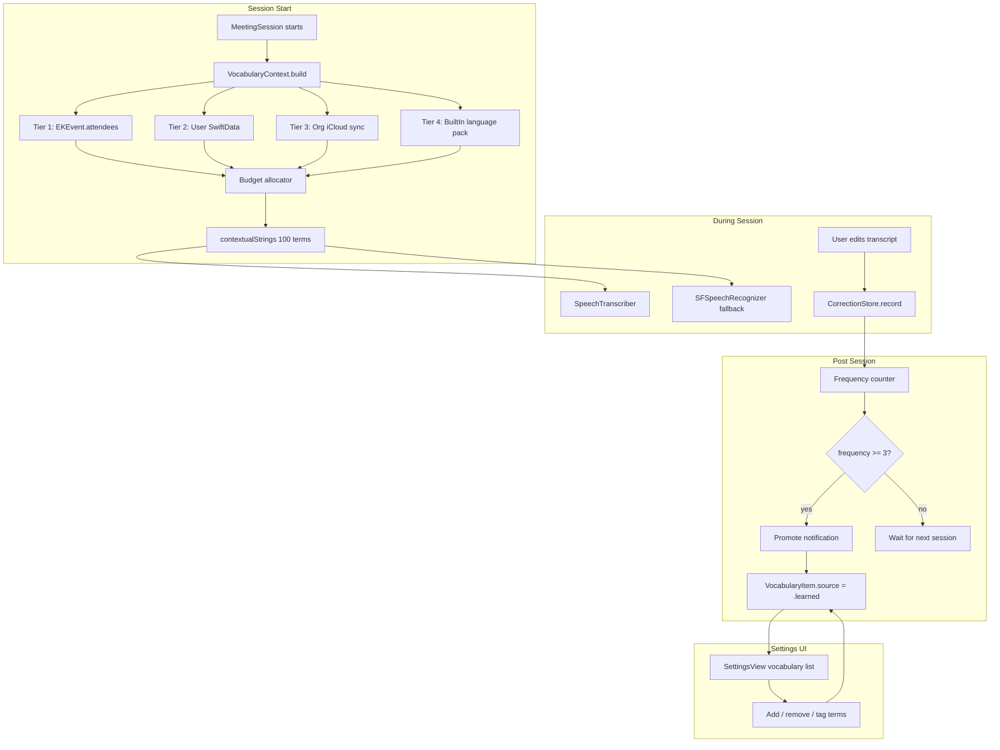
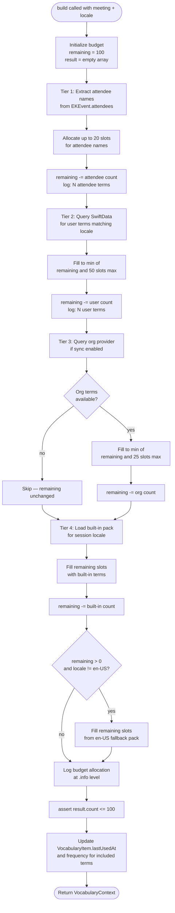
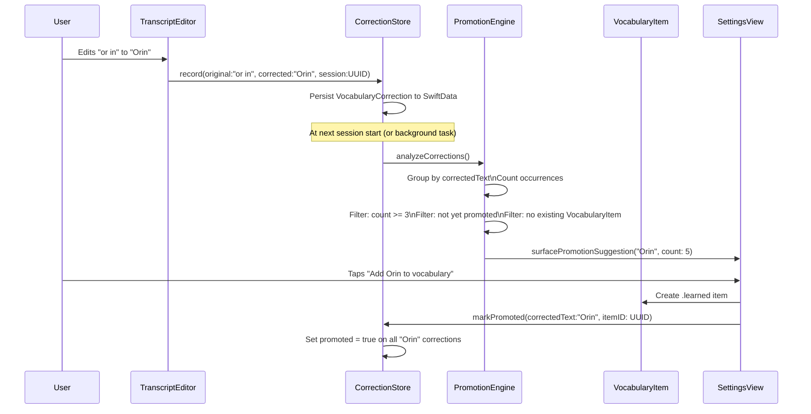

# Vocabulary System Architecture

**Document Status:** Production Engineering Documentation  
**Review Date:** 2026-06-29  
**Subsystem Verdict:** REDESIGN  
**Severity:** High — structural inability to support multi-language, per-meeting, or user-learned vocabulary  
**Source File:** `Sources/Orin/Services/VocabularyProvider.swift`

---

## 1. Current State — Why It Fails

### 1.1 File-Level Audit

`VocabularyProvider` is a Swift `enum` with no cases — a namespace for three `static` properties. The full implementation is 143 lines. Every engineering problem this document addresses is traceable to design choices made in those 143 lines.

```swift
// Current implementation — all problems start here
enum VocabularyProvider {
    static let builtInTerms: [String] = [
        // 103 hardcoded terms, compiled into binary
        "Amarjit", "Amajid", "Amerjit", "Amarjeet",
        "Aditi", "Aarti", ...
    ]

    static var userTerms: [String] {
        UserDefaults.standard.stringArray(forKey: "orin.customVocabulary") ?? []
    }

    static var allTerms: [String] {
        Array((builtInTerms + userTerms).prefix(100))  // BUG: silently drops user terms
    }
}
```

### 1.2 Defect Inventory

**Defect V-001: Silent Truncation of User Terms**

`builtInTerms` contains 103 terms. `allTerms` applies `.prefix(100)`. User terms are appended after built-in terms. Result: if a user adds any custom vocabulary at all, the last 3+ built-in terms are already gone before the budget even reaches user terms. If the built-in list grows (it has grown from ~60 terms to 103 since initial commit), user terms are silently and completely dropped.

The count at time of writing:

```
builtInTerms.count = 103   (verified by line count)
Apple limit          = 100
Built-in overflow    = 3 terms silently dropped before user terms are considered
User terms budget    = 0 (zero user terms can fit if builtInTerms >= 100)
```

This is a silent failure — no log message, no user notification, no debug assertion.

**Defect V-002: Compiled Vocabulary Cannot Adapt**

Every term in `builtInTerms` is a Swift string literal compiled into the binary. Adding, removing, or correcting a term requires a code change, a build, and an App Store release. The Hinglish section comment acknowledges this explicitly: *"This is a seed pack only. A user-adaptive vocabulary system...is planned as a follow-on feature."*

**Defect V-003: No Per-Meeting Context**

Attendee names are the highest-value vocabulary for any meeting — the ASR model is most likely to misrecognize unfamiliar proper nouns (names). Orin has access to `EKEvent.attendees` at session start. This information is never used to populate `contextualStrings`. A meeting with attendees "Parveen" and "Vanshika" gets the same vocabulary as a meeting with attendees "Mario" and "Rafael."

**Defect V-004: Legacy SFSpeechRecognizer Path Receives No Vocabulary**

`VocabularyProvider.allTerms` is documented as setting `SpeechTranscriber.contextualStrings`. The legacy `SFSpeechRecognizer` path in `RecordingService.swift` does not read from `VocabularyProvider`. Users on the fallback path — devices without SpeechTranscriber support, or sessions that fell back due to error — receive zero vocabulary assistance.

**Defect V-005: No Language Namespace**

The built-in list mixes English-Business terms ("postmortem," "decision maker"), brand names ("Zoho," "Apollo"), personal names ("Amarjit," "Abhishek"), and romanized Hindi ("theek hai," "haan"). All terms apply to all sessions regardless of the configured locale. A user recording in `en-US` receives Hinglish terms that are irrelevant and consume budget slots.

**Defect V-006: No User Interface**

The only documented mechanism to add custom vocabulary is a `defaults write` Terminal command. This is a developer workflow, not a user workflow. No user will discover it. The effective custom vocabulary for any production installation is the empty array.

**Defect V-007: No Learning from Corrections**

When a user corrects "or in" to "Orin" in the transcript editor, that signal is not captured. The same misrecognition will occur in every subsequent session. The system has no feedback loop from user behavior to recognition quality.

**Defect V-008: New Language Requires Binary Recompile**

There is no mechanism to add a new language pack without modifying `VocabularyProvider.swift` and shipping a new binary. This couples language support to the release cycle and makes it impossible to download language packs on demand.

### 1.3 Subsystem Verdict Justification

The verdict for this subsystem is REDESIGN rather than REFACTOR. The distinction matters: a refactor preserves structure and fixes implementation. A redesign replaces the structural model. The current model — a static compiled enum, UserDefaults storage, flat array, no language partitioning — cannot be patched to support any of the required capabilities (per-meeting context, user learning, language packs, UI management). The data model must change. The storage layer must change. The construction algorithm must change. This is a redesign, not a fix.

The existing `builtInTerms` content is correct and valuable — the benchmark data (2026-06-12) confirming recognition improvements for "Amarjit," "Zoho," "Apollo," and "Clavrit" is worth preserving. The terms migrate to the new system; the structure does not.

---

## 2. Proposed Architecture Overview

The redesigned vocabulary system has four components:

1. **Four-Tier Namespace** — priority-ordered vocabulary sources (Session > User > Org > BuiltIn)
2. **VocabularyItem SwiftData @Model** — persistent, queryable, language-tagged terms
3. **CorrectionStore** — learns from user transcript edits, surfaces promotion suggestions
4. **VocabularyContext.build()** — deterministic session-start budget construction algorithm



---

## 3. Four-Tier Vocabulary Namespace

### 3.1 Tier Definitions

| Tier | Name | Source | Storage | Scope |
|------|------|---------|---------|-------|
| 1 | Session | `EKEvent.attendees` extracted at session start | In-memory only, not persisted | Per-session |
| 2 | User | SettingsView additions, `CorrectionStore` promotions | SwiftData on-device | Per-device, per-user |
| 3 | Org | Team-shared vocabulary pack | User-controlled iCloud private zone or on-premises server | Shared across team |
| 4 | Built-in | Language packs compiled into binary or downloaded on demand | Bundle or app cache | Per-language |

**Priority rule:** Higher tier always wins budget allocation. Tier 1 terms are allocated first and are never displaced by lower tiers. This is the correct priority order because attendee names are the highest-probability misrecognition targets for any given meeting.

### 3.2 Why Attendee Names are Tier 1

SpeechTranscriber's contextualStrings biases the language model toward those strings during decoding. The most valuable terms to bias toward are terms that:

- Appear frequently in a specific session
- Are not common English words (so they would otherwise be decoded as phonetically similar common words)
- Are known before the session starts

Attendee names satisfy all three criteria better than any other vocabulary source. "Amarjit" is session-specific, is not a common English word, and is known from `EKEvent.attendees` before the first word is spoken. This is why Tier 1 exists as a distinct, protected allocation.

### 3.3 Tier 3 (Org) Design Scope Note

Tier 3 is designed and reserved but not implemented in Phase 1 or Phase 2. The iCloud sync mechanism for org-shared vocabulary introduces App Store entitlements, conflict resolution UI, and administrator workflows that are out of scope for the current release. The budget allocator allocates Tier 3 slots; if the Tier 3 provider returns an empty array (the initial implementation), those slots flow to Tier 4. No code path blocks on Tier 3.

---

## 4. Data Model

### 4.1 VocabularyItem

```swift
import SwiftData
import Foundation

/// A single vocabulary term in the user or org vocabulary store.
///
/// Terms are stored in SwiftData and are language-tagged. A nil `languageCode`
/// means the term applies to all languages (e.g., a proper name like "Clavrit"
/// that is language-independent).
///
/// Frequency is incremented each time the term is included in a session's
/// contextualStrings budget. lastUsedAt is updated at session start, not session end,
/// because the term's value is in assisting recognition, not in post-session review.
@Model
final class VocabularyItem {

    /// Stable identifier. Never reused, even after deletion (for CorrectionStore
    /// promoted references).
    var id: UUID

    /// The exact string passed to SpeechTranscriber.contextualStrings.
    /// Trimmed, no leading/trailing whitespace. May contain spaces (multi-word phrases
    /// are valid: "lead generation", "theek hai").
    var term: String

    /// BCP-47 language tag for which this term applies.
    /// nil = language-independent (applies to every session regardless of locale).
    /// Examples: "en-IN", "en-US", "es-MX"
    var languageCode: String?

    /// How this term entered the vocabulary.
    var source: VocabularySource

    /// Count of sessions in which this term was included in the contextualStrings budget.
    /// Incremented at session start, not on match.
    var frequency: Int

    /// Count of sessions in which this term was included in the budget AND the
    /// CorrectionStore recorded no correction for this term in that session.
    /// Used as a proxy for "term is working" (no correction needed).
    var hitCount: Int

    /// When this term was first added to the store.
    var createdAt: Date

    /// When this term was last included in a session's contextualStrings.
    /// nil if the term has never been included in a session (added but not yet used).
    var lastUsedAt: Date?

    /// Whether this term should be excluded from future sessions.
    /// Soft delete — preserves correction history linkage.
    var isDisabled: Bool

    init(
        term: String,
        languageCode: String? = nil,
        source: VocabularySource
    ) {
        self.id = UUID()
        self.term = term.trimmingCharacters(in: .whitespaces)
        self.languageCode = languageCode
        self.source = source
        self.frequency = 0
        self.hitCount = 0
        self.createdAt = Date()
        self.lastUsedAt = nil
        self.isDisabled = false
    }
}

/// The origin of a VocabularyItem.
enum VocabularySource: String, Codable {
    /// Added by the user through SettingsView.
    case user

    /// Synchronized from an org-shared vocabulary pack.
    case org

    /// Promoted automatically from CorrectionStore after frequency threshold.
    case learned

    /// Built-in language pack (migrated from VocabularyProvider.builtInTerms).
    /// These are created during first-launch migration, not added by the user.
    case builtIn
}
```

### 4.2 VocabularyCorrection

```swift
/// A record of a user-initiated correction to a recognized transcript word.
///
/// When the user edits a word in the transcript editor, the original ASR output
/// and the user's corrected text are stored here. The CorrectionStore analyzes
/// these records to identify terms that are consistently misrecognized and
/// surfaces promotion suggestions.
///
/// Privacy: This model contains fragments of meeting transcript content.
/// It must be treated with the same access controls as MeetingItem and
/// TranscriptChunk. It is never transmitted off-device except via explicit
/// user-initiated backup.
@Model
final class VocabularyCorrection {

    var id: UUID

    /// The string the ASR engine produced.
    var originalText: String

    /// The string the user typed as a replacement.
    var correctedText: String

    /// The session in which the correction was made.
    var sessionID: UUID

    /// When the correction was made (for pruning by MeetingRetentionService).
    var timestamp: Date

    /// Whether this correction has been promoted to a VocabularyItem.
    /// Corrections with promoted = true are retained for audit; unpromoted
    /// corrections older than 90 days are pruned.
    var promoted: Bool

    /// ID of the VocabularyItem created when this correction was promoted.
    /// nil if not yet promoted.
    var promotedItemID: UUID?

    init(
        originalText: String,
        correctedText: String,
        sessionID: UUID
    ) {
        self.id = UUID()
        self.originalText = originalText
        self.correctedText = correctedText
        self.sessionID = sessionID
        self.timestamp = Date()
        self.promoted = false
        self.promotedItemID = nil
    }
}
```

### 4.3 BuiltInVocabularyPack

Built-in packs are not stored in SwiftData — they are value types loaded from bundle JSON or a downloaded cache. They are not persisted per-device because they are identical across all devices.

```swift
/// A named, versioned collection of built-in vocabulary terms for a specific language.
///
/// Packs are loaded from bundle resources or downloaded on demand. The version
/// field allows the app to detect when a newer pack is available without
/// requiring a binary update.
struct BuiltInVocabularyPack: Codable, Sendable {

    /// BCP-47 language tag this pack is designed for.
    /// "en-IN" for Indian English + Hinglish bootstrap,
    /// "en-US" for American English business vocabulary, etc.
    let languageCode: String

    /// Human-readable name shown in SettingsView.
    let displayName: String

    /// Monotonically increasing version. Newer bundles ship higher versions.
    /// Used to decide whether to replace a cached downloaded pack.
    let version: Int

    /// The vocabulary terms. May contain multi-word phrases.
    let terms: [String]

    /// ISO 8601 date when this pack was last revised.
    let revisedAt: String
}

/// Registry of built-in packs available in the current binary.
/// Downloaded packs are cached in Application Support and loaded at launch.
actor BuiltInPackRegistry {

    static let shared = BuiltInPackRegistry()

    private var loadedPacks: [String: BuiltInVocabularyPack] = [:]

    /// Returns the pack for the given language code, or the English fallback
    /// if no pack exists for that language.
    func pack(for languageCode: String) async -> BuiltInVocabularyPack {
        if let cached = loadedPacks[languageCode] {
            return cached
        }
        let loaded = await loadPack(languageCode: languageCode)
        loadedPacks[languageCode] = loaded
        return loaded
    }

    private func loadPack(languageCode: String) async -> BuiltInVocabularyPack {
        // 1. Look for bundled JSON: Resources/VocabularyPacks/{languageCode}.json
        // 2. Look for downloaded pack in Application Support cache
        // 3. Fall back to en-US bundled pack
        // Implementation detail: uses JSONDecoder, no network call at session start.
        fatalError("implementation required")
    }
}
```

---

## 5. VocabularyContext — Session Budget Construction

### 5.1 Algorithm Specification

The `VocabularyContext.build()` function runs once at session start, before `SpeechAnalyzer.prepareToAnalyze(in:)` is called. It is the only entry point that produces the `contextualStrings` array passed to `SpeechTranscriber`.



### 5.2 Swift API

```swift
/// The result of a vocabulary budget construction for a single recording session.
///
/// Construct using VocabularyContext.build(). Do not create directly.
/// The `contextualStrings` property is the exact array to pass to
/// SpeechTranscriber.contextualStrings.
struct VocabularyContext: Sendable {

    /// The terms to pass to SpeechTranscriber.contextualStrings.
    /// Always <= 100 elements (Apple's documented limit).
    let contextualStrings: [String]

    /// How many terms came from each tier, in order: [session, user, org, builtIn].
    let budgetBreakdown: BudgetBreakdown

    /// The locale this context was built for.
    let locale: Locale

    /// When this context was built.
    let builtAt: Date

    struct BudgetBreakdown: Sendable {
        let sessionTerms: Int
        let userTerms: Int
        let orgTerms: Int
        let builtInTerms: Int

        var total: Int { sessionTerms + userTerms + orgTerms + builtInTerms }

        /// Human-readable summary for logging and UI.
        var description: String {
            "Session vocabulary: \(sessionTerms) attendee, \(userTerms) user, " +
            "\(orgTerms) org, \(builtInTerms) built-in (\(total) total)"
        }
    }
}

/// Constructs session vocabulary by applying the four-tier budget algorithm.
actor VocabularyContextBuilder {

    private let modelContext: ModelContext
    private let packRegistry: BuiltInPackRegistry
    private let orgProvider: OrgVocabularyProvider

    // Slot budget constants
    private static let totalBudget    = 100
    private static let tier1MaxSlots  = 20
    private static let tier2MaxSlots  = 50
    private static let tier3MaxSlots  = 25
    // Tier 4 fills whatever remains — no separate constant needed.

    init(
        modelContext: ModelContext,
        packRegistry: BuiltInPackRegistry = .shared,
        orgProvider: OrgVocabularyProvider
    ) {
        self.modelContext = modelContext
        self.packRegistry = packRegistry
        self.orgProvider = orgProvider
    }

    /// Constructs a VocabularyContext for the given session.
    ///
    /// - Parameters:
    ///   - meeting: The meeting whose EKEvent attendees populate Tier 1.
    ///             Nil is valid — Tier 1 will be empty.
    ///   - locale: The ASR locale for this session. Used to select built-in pack
    ///             and filter user terms by language tag.
    ///
    /// - Returns: A VocabularyContext whose `contextualStrings` is <= 100 elements.
    func build(meeting: MeetingItem?, locale: Locale) async -> VocabularyContext {
        var result: [String] = []
        var remaining = Self.totalBudget
        let langCode = locale.identifier

        // ── Tier 1: Session (Attendee Names) ─────────────────────────────────
        let attendeeTerms = extractAttendeeNames(from: meeting)
        let tier1Count = min(attendeeTerms.count, min(remaining, Self.tier1MaxSlots))
        result.append(contentsOf: attendeeTerms.prefix(tier1Count))
        remaining -= tier1Count

        // ── Tier 2: User ─────────────────────────────────────────────────────
        let userTerms = await loadUserTerms(languageCode: langCode)
        let tier2Budget = min(remaining, Self.tier2MaxSlots)
        let tier2Count = min(userTerms.count, tier2Budget)
        result.append(contentsOf: userTerms.prefix(tier2Count))
        remaining -= tier2Count

        // ── Tier 3: Org ───────────────────────────────────────────────────────
        var tier3Count = 0
        if orgProvider.isSyncEnabled {
            let orgTerms = await orgProvider.terms(languageCode: langCode)
            let tier3Budget = min(remaining, Self.tier3MaxSlots)
            tier3Count = min(orgTerms.count, tier3Budget)
            result.append(contentsOf: orgTerms.prefix(tier3Count))
            remaining -= tier3Count
        }

        // ── Tier 4: Built-in language pack ────────────────────────────────────
        let pack = await packRegistry.pack(for: langCode)
        let tier4Count = min(pack.terms.count, remaining)
        result.append(contentsOf: pack.terms.prefix(tier4Count))
        remaining -= tier4Count

        // ── English fallback (only if locale is not already en-US) ────────────
        if remaining > 0 && langCode != "en-US" {
            let fallback = await packRegistry.pack(for: "en-US")
            let fallbackTerms = fallback.terms.filter { !result.contains($0) }
            let fallbackCount = min(fallbackTerms.count, remaining)
            result.append(contentsOf: fallbackTerms.prefix(fallbackCount))
            remaining -= fallbackCount
        }

        // ── Invariant check ───────────────────────────────────────────────────
        assert(result.count <= Self.totalBudget,
               "VocabularyContext.build produced \(result.count) terms, limit is \(Self.totalBudget)")

        let breakdown = VocabularyContext.BudgetBreakdown(
            sessionTerms: tier1Count,
            userTerms: tier2Count,
            orgTerms: tier3Count,
            builtInTerms: result.count - tier1Count - tier2Count - tier3Count
        )

        // Log at .info — appears in Console.app, included in crash reports.
        logger.info("\(breakdown.description, privacy: .public)")

        // Update frequency and lastUsedAt for persisted terms included in this session.
        await updateUsageMetrics(includedTerms: Set(result), languageCode: langCode)

        return VocabularyContext(
            contextualStrings: result,
            budgetBreakdown: breakdown,
            locale: locale,
            builtAt: Date()
        )
    }

    // MARK: - Private helpers

    private func extractAttendeeNames(from meeting: MeetingItem?) -> [String] {
        guard let event = meeting?.linkedCalendarEvent else { return [] }
        // EKParticipant.name returns the display name (First Last).
        // We add both "First Last" and "First" as separate terms to maximize
        // match probability — Apple's model accepts multi-word contextual strings.
        var names: [String] = []
        for participant in event.attendees ?? [] {
            guard let name = participant.name, !name.isEmpty else { continue }
            names.append(name)
            // Also add first name alone for informal address.
            let firstName = name.components(separatedBy: " ").first ?? name
            if firstName != name {
                names.append(firstName)
            }
        }
        return Array(Set(names)) // deduplicate
    }

    private func loadUserTerms(languageCode: String) async -> [String] {
        // FetchDescriptor returns terms that:
        // (a) languageCode matches OR languageCode is nil (language-independent)
        // (b) isDisabled == false
        // (c) source is .user or .learned
        // Sorted by frequency descending so highest-value terms fill budget first.
        let descriptor = FetchDescriptor<VocabularyItem>(
            predicate: #Predicate {
                !$0.isDisabled &&
                ($0.languageCode == nil || $0.languageCode == languageCode) &&
                ($0.source == .user || $0.source == .learned)
            },
            sortBy: [SortDescriptor(\.frequency, order: .reverse)]
        )
        let items = (try? modelContext.fetch(descriptor)) ?? []
        return items.map(\.term)
    }

    private func updateUsageMetrics(includedTerms: Set<String>, languageCode: String) async {
        let descriptor = FetchDescriptor<VocabularyItem>(
            predicate: #Predicate {
                !$0.isDisabled &&
                ($0.languageCode == nil || $0.languageCode == languageCode)
            }
        )
        let items = (try? modelContext.fetch(descriptor)) ?? []
        let now = Date()
        for item in items where includedTerms.contains(item.term) {
            item.frequency += 1
            item.lastUsedAt = now
        }
        try? modelContext.save()
    }
}
```

### 5.3 Wiring into RecordingService and SystemAudioCaptureService

Both recording pipelines must use the same `VocabularyContextBuilder`. The context is built once per session start and cached for the session lifetime.

```swift
// In RecordingService (and mirrored in SystemAudioCaptureService):

private var activeVocabularyContext: VocabularyContext?

func startRecording(for meeting: MeetingItem?) async throws {
    // Build vocabulary context before preparing SpeechAnalyzer.
    let locale = VocabularyProvider.speechLocale  // existing locale selection preserved
    activeVocabularyContext = await vocabularyContextBuilder.build(
        meeting: meeting,
        locale: locale
    )

    // Apply to SpeechTranscriber (new path).
    speechTranscriber?.contextualStrings = activeVocabularyContext?.contextualStrings ?? []

    // Apply to SFSpeechRecognizer (legacy path — currently receives nothing, fixing V-004).
    if let recognitionRequest {
        recognitionRequest.contextualStrings = activeVocabularyContext?.contextualStrings ?? []
    }

    // Continue with existing session setup...
}
```

The key change for V-004 is that `SFSpeechRecognizer`'s `SFSpeechAudioBufferRecognitionRequest.contextualStrings` is now populated. Both code paths share a single `VocabularyContext` built from the same algorithm.

---

## 6. CorrectionStore — Learning from User Edits

### 6.1 Data Flow



### 6.2 CorrectionStore Actor

```swift
/// Records user-initiated transcript corrections and analyzes them for
/// vocabulary promotion candidates.
///
/// All operations are serialized on a single actor. SwiftData operations are
/// dispatched to ModelContext on the actor's executor — no @MainActor required.
actor CorrectionStore {

    private let modelContext: ModelContext
    private let promotionThreshold = 3

    init(modelContext: ModelContext) {
        self.modelContext = modelContext
    }

    /// Records a correction made in the transcript editor.
    ///
    /// Call this whenever the user modifies a word in the transcript.
    /// The original and corrected text should be the minimal changed span —
    /// not the entire transcript.
    ///
    /// - Parameters:
    ///   - original: The text as produced by the ASR engine.
    ///   - corrected: The text as the user changed it.
    ///   - sessionID: The session in which the correction was made.
    func record(original: String, corrected: String, sessionID: UUID) {
        // Guard against trivial differences (whitespace normalization, punctuation).
        let normalizedOriginal = original.trimmingCharacters(in: .whitespacesAndNewlines).lowercased()
        let normalizedCorrected = corrected.trimmingCharacters(in: .whitespacesAndNewlines).lowercased()
        guard normalizedOriginal != normalizedCorrected else { return }
        guard !corrected.trimmingCharacters(in: .whitespacesAndNewlines).isEmpty else { return }

        let correction = VocabularyCorrection(
            originalText: original,
            correctedText: corrected,
            sessionID: sessionID
        )
        modelContext.insert(correction)
        try? modelContext.save()

        logger.debug("CorrectionStore: recorded '\(original)' -> '\(corrected)'",
                     privacy: .private)
    }

    /// Returns promotion candidates — corrected terms that appear >= threshold
    /// times and have not yet been added to the user vocabulary.
    ///
    /// Called at session start and by SettingsView.
    func promotionCandidates() async -> [PromotionCandidate] {
        let descriptor = FetchDescriptor<VocabularyCorrection>(
            predicate: #Predicate { !$0.promoted }
        )
        let corrections = (try? modelContext.fetch(descriptor)) ?? []

        // Group by normalized correctedText.
        var groups: [String: [VocabularyCorrection]] = [:]
        for c in corrections {
            let key = c.correctedText.trimmingCharacters(in: .whitespacesAndNewlines)
            groups[key, default: []].append(c)
        }

        // Filter to threshold, exclude terms already in vocabulary.
        let existingTerms = Set(loadExistingUserTerms())
        return groups
            .filter { $0.value.count >= promotionThreshold }
            .filter { !existingTerms.contains($0.key) }
            .map { PromotionCandidate(term: $0.key, occurrences: $0.value.count) }
            .sorted { $0.occurrences > $1.occurrences }
    }

    /// Promotes a correction candidate to a VocabularyItem.
    ///
    /// Creates a VocabularyItem with source .learned and marks all matching
    /// VocabularyCorrection rows as promoted.
    ///
    /// - Parameters:
    ///   - term: The correctedText to promote.
    ///   - languageCode: Optional language tag for the new item. Nil = all languages.
    ///
    /// - Returns: The ID of the created VocabularyItem.
    @discardableResult
    func promote(term: String, languageCode: String? = nil) -> UUID {
        let item = VocabularyItem(term: term, languageCode: languageCode, source: .learned)
        modelContext.insert(item)

        // Mark all matching corrections as promoted.
        let descriptor = FetchDescriptor<VocabularyCorrection>(
            predicate: #Predicate { $0.correctedText == term && !$0.promoted }
        )
        let corrections = (try? modelContext.fetch(descriptor)) ?? []
        for correction in corrections {
            correction.promoted = true
            correction.promotedItemID = item.id
        }

        try? modelContext.save()
        logger.info("CorrectionStore: promoted '\(term, privacy: .private)' to user vocabulary",
                    privacy: .public)
        return item.id
    }

    /// Prunes unpromoted corrections older than the retention limit.
    /// Called by MeetingRetentionService on the same schedule as transcript pruning.
    func pruneStaleCorrections(retentionDays: Int = 90) {
        let cutoff = Calendar.current.date(byAdding: .day, value: -retentionDays, to: Date()) ?? Date()
        let descriptor = FetchDescriptor<VocabularyCorrection>(
            predicate: #Predicate { !$0.promoted && $0.timestamp < cutoff }
        )
        let stale = (try? modelContext.fetch(descriptor)) ?? []
        for correction in stale {
            modelContext.delete(correction)
        }
        if !stale.isEmpty {
            try? modelContext.save()
            logger.info("CorrectionStore: pruned \(stale.count) stale corrections", privacy: .public)
        }
    }

    private func loadExistingUserTerms() -> [String] {
        let descriptor = FetchDescriptor<VocabularyItem>(
            predicate: #Predicate { !$0.isDisabled }
        )
        return ((try? modelContext.fetch(descriptor)) ?? []).map(\.term)
    }
}

/// A vocabulary term surfaced as a promotion candidate from CorrectionStore analysis.
struct PromotionCandidate: Identifiable, Sendable {
    var id: String { term }
    let term: String
    let occurrences: Int
}
```

### 6.3 Promotion Notification

Auto-promotion at frequency >= 3 does not silently modify vocabulary. Instead it fires a local `UNUserNotification` (if notifications are authorized) and surfaces a banner in SettingsView. The user makes the final decision. This avoids the anti-pattern of a vocabulary correction system that silently adds words the user did not intend to keep.

The notification message format: *"Orin noticed you often correct 'or in' to 'Orin' — tap to add Orin to your vocabulary."*

Auto-promotion without user confirmation is never performed in the current design. The frequency threshold is a signal, not a gate.

---

## 7. Decay Strategy

### 7.1 Stale Term Detection

Terms that have not been included in any session for 90 days are marked stale. Terms that have not been included for 180 days are candidates for auto-removal.

```swift
extension VocabularyItem {

    /// Whether this term has not been used in any session for more than staleThresholdDays.
    var isStale: Bool {
        guard let lastUsed = lastUsedAt else {
            // Never used — stale immediately if older than createdAt + threshold.
            return Date().timeIntervalSince(createdAt) > Self.staleThresholdSeconds
        }
        return Date().timeIntervalSince(lastUsed) > Self.staleThresholdSeconds
    }

    /// Whether this term qualifies for auto-removal (not used for autoRemoveThresholdDays).
    var isAutoRemoveCandidate: Bool {
        guard let lastUsed = lastUsedAt else {
            return Date().timeIntervalSince(createdAt) > Self.autoRemoveThresholdSeconds
        }
        return Date().timeIntervalSince(lastUsed) > Self.autoRemoveThresholdSeconds
    }

    // These are configurable via UserDefaults for developer testing.
    // Defaults: stale = 90 days, autoRemove = 180 days.
    private static var staleThresholdSeconds: TimeInterval {
        let days = UserDefaults.standard.double(forKey: "orin.vocab.staleDays")
        return (days > 0 ? days : 90) * 86400
    }

    private static var autoRemoveThresholdSeconds: TimeInterval {
        let days = UserDefaults.standard.double(forKey: "orin.vocab.autoRemoveDays")
        return (days > 0 ? days : 180) * 86400
    }
}
```

### 7.2 MeetingRetentionService Integration

`MeetingRetentionService` already runs a periodic sweep for expired transcript data. Vocabulary decay runs on the same sweep:

```swift
// Addition to MeetingRetentionService.performRetentionSweep():

// Prune unpromoted CorrectionStore entries older than 90 days.
await correctionStore.pruneStaleCorrections(retentionDays: 90)

// Flag stale VocabularyItems for SettingsView display (greyed out).
// Auto-remove candidates are presented to the user, not deleted silently.
// Built-in (.builtIn source) terms are never auto-removed.
let autoRemoveCandidates = await vocabularyStore.autoRemoveCandidates()
if !autoRemoveCandidates.isEmpty {
    logger.info("Vocabulary: \(autoRemoveCandidates.count) terms are auto-remove candidates",
                privacy: .public)
    // Surface in SettingsView — no action taken without user confirmation.
    await VocabularyDecayNotifier.shared.notify(candidates: autoRemoveCandidates)
}
```

---

## 8. Privacy-Preserving Design

### 8.1 Data Classification

| Data | Classification | Storage | Transmission |
|------|---------------|---------|-------------|
| VocabularyItem.term | Personal | SwiftData on-device, OS-encrypted | iCloud private zone (Tier 3 only, user opt-in) |
| VocabularyCorrection.originalText | Transcript fragment | SwiftData on-device, OS-encrypted | Never |
| VocabularyCorrection.correctedText | Transcript fragment | SwiftData on-device, OS-encrypted | Never |
| BuiltInVocabularyPack.terms | Non-personal | Bundle or downloaded cache | Never (downloaded packs are non-personal; download occurs but no term is uploaded) |
| contextualStrings passed to SpeechTranscriber | Personal | In-memory per session | Never (Apple SpeechTranscriber processes entirely on-device) |

`VocabularyCorrection` contains fragments of meeting audio transcripts. It must be treated with the same privacy classification as `MeetingItem.transcript`. Specifically:

- Not included in any analytics payload
- Not logged at `.default` or higher level (logged only at `.debug` with `privacy: .private`)
- Pruned on the same schedule as transcript data (90-day retention by default)
- Included in the user's data export if Orin implements an export feature

### 8.2 Cloud AI Interaction

When Orin sends meeting content to a cloud AI service (OpenAI, Anthropic) for analysis, the transcript already contains the user's words. Vocabulary terms are embedded in that transcript — they are not separately transmitted. No vocabulary API call is made to any external service. The privacy posture for cloud AI analysis is identical to the existing transcript submission posture.

### 8.3 Org Vocabulary (Tier 3)

Tier 3 sync, when implemented, uses CloudKit private database — the user's own iCloud account. Orin servers never see Tier 3 vocabulary content. For organizations that require on-premises storage, Tier 3 will support a configurable endpoint URL (the data protocol will be defined in the Tier 3 implementation specification).

---

## 9. SettingsView Vocabulary UI

### 9.1 View Structure

The vocabulary UI lives in `Settings > Vocabulary`. It is a new section in the existing `SettingsView`. Based on the subsystem split planned in MT-003 (MeetingsView split), a dedicated `VocabularySettingsView` is the correct decomposition.

```
Settings
└── Vocabulary
    ├── Budget Indicator (session context bar)
    ├── Promotion Suggestions (if any)
    ├── Personal Terms (searchable list)
    │   ├── Term row: "Orin" · all languages · 14 sessions
    │   ├── Term row: "Clavrit" · learned · 8 sessions
    │   └── [+ Add Term] button
    ├── Stale Terms (collapsible section, if any)
    └── Import / Export
```

### 9.2 Budget Indicator

The budget indicator displays the Tier breakdown from the most recent session. It updates at session start.

```
Last session vocabulary:
[■■■■■■■■■■■■] 12 attendee  [■■■■■■■■■■■■■■■■■■] 18 personal  [■■■■■■■■■■■■■■■■■■■■■■■■■■■■■■■■■■■■■■■■■■■■■■■■■■■■■■■■■■■■■■] 62 built-in
```

The bar is a horizontal `HStack` of colored `Rectangle` views proportional to each count. Colors: Tier 1 = blue, Tier 2 = green, Tier 3 = orange, Tier 4 = gray.

### 9.3 Promotion Suggestion Banner

When `CorrectionStore.promotionCandidates()` returns results, a suggestion card appears at the top of the vocabulary settings:

```
┌─────────────────────────────────────────────────────────────┐
│ Orin noticed you often correct:                             │
│   "or in" → "Orin" (5 times across 3 sessions)             │
│   "clever it" → "Clavrit" (4 times across 2 sessions)      │
│                                                             │
│  [Add Both]   [Review]   [Dismiss]                         │
└─────────────────────────────────────────────────────────────┘
```

### 9.4 Import/Export

Export format: plain-text, one term per line. Import: reads the same format, deduplicates against existing terms, adds new terms with `source: .user`. CSV export includes: term, languageCode, source, frequency, createdAt.

---

## 10. Built-in Vocabulary Pack File Format

Bundled packs are JSON files in `Resources/VocabularyPacks/`:

```json
{
  "languageCode": "en-IN",
  "displayName": "Indian English + Hinglish",
  "version": 2,
  "revisedAt": "2026-06-29",
  "terms": [
    "theek hai", "haan", "nahi", "achha", "bilkul", "zaroor",
    "abhi", "kal", "bas", "matlab", "lekin", "toh", "bhi",
    "phir", "kyunki", "isliye", "samjhe", "baat", "kaam",
    "haan haan", "theek hai na", "ekdum", "bilkul theek",
    "ek second", "ek minute", "thoda time", "jaldi", "aaj",
    "pehle", "phir se", "hafte mein",
    "karo", "karna", "bhejo", "banao", "dikhao", "bolo", "dekho",
    "thoda", "kaafi", "bahut", "zyada", "poora", "aadha",
    "sath mein", "suno", "seedha", "confirm karo",
    "Amarjit", "Amajid", "Amerjit", "Amarjeet",
    "Aditi", "Aarti", "Arti", "Yatish", "Abhishek",
    "Joydeep", "Joideep", "Parveen", "Vanshika",
    "Dipanshu", "Jasminder", "Jaswinder",
    "NHAI", "CDOT", "CVM",
    "Zoho", "Zoho CRM", "RedMine", "Redmine",
    "Baseliner", "ResourceHere", "Resourcia",
    "Apollo", "Upwork", "LinkedIn", "WhatsApp",
    "Dice", "Dice.com", "SAP", "Clavrit",
    "outreaching", "outreach", "onboarding",
    "lead generation", "personalized email", "follow-up",
    "decision maker", "postmortem", "post-mortem"
  ]
}
```

```json
{
  "languageCode": "en-US",
  "displayName": "American English Business",
  "version": 1,
  "revisedAt": "2026-06-29",
  "terms": [
    "Mario", "Alvaro", "Rafael",
    "outreaching", "outreach", "onboarding",
    "lead generation", "personalized email", "follow-up",
    "decision maker", "postmortem", "post-mortem",
    "Apollo", "Upwork", "LinkedIn", "WhatsApp",
    "SAP", "Zoho", "Zoho CRM"
  ]
}
```

The existing 103 terms in `VocabularyProvider.builtInTerms` are partitioned into `en-IN` and `en-US` packs during the first-launch migration. Terms that apply to all English variants (brand names, domain vocabulary) appear in both packs; language-specific terms (Hinglish bootstrap) appear only in `en-IN`.

---

## 11. Versioning and Synchronization (Tier 3)

Tier 3 is designed but not implemented in Phase 1 or Phase 2. This section documents the intended design for when it is built.

### 11.1 Conflict Resolution Policy

| Conflict Type | Resolution |
|--------------|------------|
| Two devices add different terms | Union merge — both terms added |
| Same term edited on two devices (different language tags) | Last-write-wins by `updatedAt` |
| Term deleted on Device A, modified on Device B | Deletion wins (conservative) |
| Same term added and deleted simultaneously | Deletion wins |

### 11.2 VocabularyItem Version Field

For Tier 3 sync, `VocabularyItem` gains a `version: Int` field incremented on every modification. CloudKit merge operations compare versions to detect conflicts. The UI presents conflicts only when the same term was modified in conflicting ways (different language tags on different devices). Simple additions never require user interaction.

---

## 12. Multilingual Roadmap Integration

The vocabulary system is the foundation for multi-language ASR support. The roadmap:

| Phase | Timeline | Vocabulary Change |
|-------|----------|-------------------|
| Current | Now | 103 terms in flat array, en-IN default |
| Phase 1 | Weeks 1-3 | Migrate to four-tier system, fix silent truncation, fix SFSpeechRecognizer gap |
| Phase 2 | Weeks 4-14 | CorrectionStore, SettingsView UI, VocabularyContext.build() |
| Phase 3 | Months 3-6 | WhisperBackend for hi-IN; vocabulary fed to Whisper via prompt parameter |
| Phase 3 | Months 4-6 | es-MX and fr-FR packs via Apple SpeechTranscriber |
| Phase 3 | Months 6-9 | zh-Hans, ja-JP, ko-KR packs |
| Phase 4 | Months 9-12 | ar-SA via Whisper (Arabic not supported by Apple SpeechTranscriber) |

The `BuiltInPackRegistry` download-on-demand mechanism means that adding a new language requires shipping a JSON file and updating the registry — not a binary change. The `ASRBackend` protocol (MT-007) feeds `contextualStrings` to SpeechTranscriber or a Whisper prompt parameter depending on the backend, with no change to `VocabularyContextBuilder`.

---

## 13. Migration from Current Implementation

### 13.1 Migration Steps

Migration runs once on first launch after the update ships. It is idempotent — if interrupted and relaunched, it completes without duplication.

```swift
actor VocabularyMigrationService {

    private let modelContext: ModelContext
    private static let migrationKey = "orin.vocab.v1migrationComplete"

    func migrateIfNeeded() async {
        guard !UserDefaults.standard.bool(forKey: Self.migrationKey) else { return }

        logger.info("VocabularyMigration: starting built-in term migration", privacy: .public)

        // Step 1: Read existing user terms from UserDefaults.
        let existingUserTerms = UserDefaults.standard.stringArray(
            forKey: "orin.customVocabulary"
        ) ?? []

        // Step 2: Create VocabularyItem records for each user term.
        // Language tag is nil (language-independent) because UserDefaults terms
        // had no language annotation.
        for term in existingUserTerms {
            let trimmed = term.trimmingCharacters(in: .whitespacesAndNewlines)
            guard !trimmed.isEmpty else { continue }
            let item = VocabularyItem(term: trimmed, languageCode: nil, source: .user)
            modelContext.insert(item)
        }

        // Step 3: The built-in terms are NOT migrated to SwiftData.
        // They are now owned by BuiltInVocabularyPacks (JSON files).
        // VocabularyProvider.builtInTerms is removed after this migration ships.

        try? modelContext.save()

        UserDefaults.standard.set(true, forKey: Self.migrationKey)
        logger.info(
            "VocabularyMigration: migrated \(existingUserTerms.count) user terms",
            privacy: .public
        )
    }
}
```

### 13.2 Deprecation of VocabularyProvider

After migration:

1. `VocabularyProvider.builtInTerms` is replaced by `BuiltInPackRegistry.pack(for:)`.
2. `VocabularyProvider.userTerms` is replaced by `VocabularyContextBuilder.loadUserTerms(languageCode:)`.
3. `VocabularyProvider.allTerms` is replaced by `VocabularyContext.contextualStrings`.
4. `VocabularyProvider.speechLocale` is retained as the locale selection mechanism (unchanged).
5. The `VocabularyProvider` enum is deleted after all call sites are migrated.

The `orin.customVocabulary` UserDefaults key is read during migration and then ignored. It is not written to after migration.

---

## 14. Implementation Priority

### 14.1 Immediate (Phase 1, Quick Wins)

**QW-vocab-001**: Fix the `.prefix(100)` bug by reordering `allTerms` to put user terms first:

```swift
// Current (WRONG): user terms silently dropped when builtIn >= 100
static var allTerms: [String] {
    Array((builtInTerms + userTerms).prefix(100))
}

// Fixed (CORRECT): user terms have priority, built-in fills remaining slots
static var allTerms: [String] {
    let user = userTerms
    let builtIn = builtInTerms.filter { !user.contains($0) }
    return Array((user + builtIn).prefix(100))
}
```

This is a one-line fix that ships immediately and eliminates V-001. It is backwards-compatible — no migration required.

**QW-vocab-002**: Wire `VocabularyProvider.allTerms` to `SFSpeechAudioBufferRecognitionRequest.contextualStrings` in `RecordingService`. This fixes V-004. Also a one-line addition.

### 14.2 Medium Term (Phase 2, 8-10 weeks)

MT-004 in the full roadmap: the complete four-tier system, `VocabularyContextBuilder`, `CorrectionStore`, `SettingsView` UI, `BuiltInPackRegistry`, and first-launch migration.

### 14.3 Long Term (Phase 3)

`BuiltInPackRegistry` download-on-demand, Tier 3 org sync, WhisperBackend vocabulary via prompt injection, es/fr/de/zh/ja/ko/ar packs.

---

## 15. Files Affected by This Redesign

| File | Change |
|------|--------|
| `Sources/Orin/Services/VocabularyProvider.swift` | Deprecate and delete after migration |
| `Sources/Orin/Services/VocabularyContextBuilder.swift` | New file |
| `Sources/Orin/Services/CorrectionStore.swift` | New file |
| `Sources/Orin/Services/VocabularyMigrationService.swift` | New file |
| `Sources/Orin/Services/BuiltInPackRegistry.swift` | New file |
| `Sources/Orin/Models/OrinModels.swift` | Add VocabularyItem, VocabularyCorrection @Model |
| `Sources/Orin/Services/RecordingService.swift` | Wire VocabularyContextBuilder; populate SFSpeechRecognizer contextualStrings |
| `Sources/Orin/Services/SystemAudioCaptureService.swift` | Wire VocabularyContextBuilder |
| `Sources/Orin/Services/MeetingRetentionService.swift` | Add CorrectionStore.pruneStaleCorrections call |
| `Sources/Orin/Views/Settings/VocabularySettingsView.swift` | New file — vocabulary management UI |
| `Sources/Orin/App/ServiceContainer.swift` | Register VocabularyContextBuilder, CorrectionStore |
| `Resources/VocabularyPacks/en-IN.json` | New file — migrated built-in terms |
| `Resources/VocabularyPacks/en-US.json` | New file — English business terms |

---

*Document produced as part of the Orin V1 9-agent architecture review. Cross-references: 04-AI-Pipeline.md (InferenceProvider protocol), 07-SwiftData-Architecture.md (model schema additions), 02-Current-System-Architecture.md (service dependency graph).*
