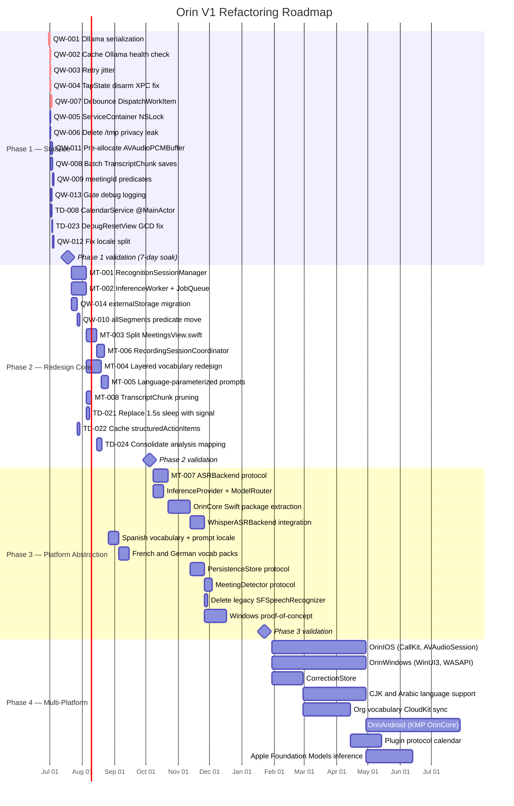

# 11 — Refactoring Roadmap

**Document status**: Engineering specification  
**Review date**: 2026-06-29  
**Verdict**: NEEDS_PATCHING — targeted fixes, not a rewrite  
**Authors**: Architecture Review Team (9-agent analysis)

---

## Preamble: Why This Order Matters

The codebase has three distinct failure categories. They must be addressed in sequence because each layer depends on the one below being stable.

| Layer | Failure category | Resolution |
|---|---|---|
| 1 | Production crashes and freezes | Phase 1: Stabilize |
| 2 | Structural duplication and unmaintainability | Phase 2: Redesign Core |
| 3 | Platform specificity blocks cross-platform | Phase 3: Platform Abstraction |
| 4 | Scale and market expansion | Phase 4: Multi-Platform and Scale |

**Final recommendation**: Do not rewrite. The recording pipeline concurrency model and persistence layer embed hard-won macOS platform knowledge. Fix the specific defects in order: AI serialization first (~20 lines of code, eliminates the primary failure mode), then audio safety, then persistence batching. Stabilize before evolving.

---

## Gantt Chart



---

## Phase 1: Stabilize

**Weeks 1–3**

**Objective**: Eliminate production crashes and system freezes. Zero new features. Zero architectural changes. Every change is a targeted fix to a documented defect.

**Philosophy**: The single largest leverage point is the AI pipeline. Three changes (~20 lines of code total) eliminate the primary failure mode: the 41-request thundering herd that causes post-call system freezes. Ship these three changes and validate before touching anything else.

**Entry gate**: None. Start immediately.  
**Exit gate**: A 150-minute recording completes analysis without system freeze. No crash reports from recording or analysis in 7 consecutive days of testing.

---

### P1-T01 — QW-001: Ollama Inference Serialization

**Priority**: CRITICAL — ship this first, alone, before any other change.

**Root cause**: `analyzeChunked()` in `MeetingIntelligenceService.swift` uses `withTaskGroup` with no concurrency limit. For a 150-minute meeting, `TranscriptChunker` produces ~20 chunks. All 20 tasks start simultaneously, all hit Ollama's 60-second timeout at `t=60s`, all retry at `t=70s`. Wave 1: 20 requests. Wave 2: 19–20 retry requests. Total: ~41 concurrent requests to a single-GPU serialized process.

**File**: `Sources/Orin/Services/MeetingIntelligenceService.swift`

**Change**: Find the `analyzeChunked()` method (approximately line 200–260). The current pattern is:

```swift
// CURRENT — submits all N tasks simultaneously
var chunkResults: [ChunkAnalysis?] = Array(repeating: nil, count: chunks.count)
await withTaskGroup(of: (Int, ChunkAnalysis?).self) { group in
    for (index, chunk) in chunks.enumerated() {
        group.addTask {
            let result = await self.analyzeChunk(chunk, index: index, total: chunks.count)
            return (index, result)
        }
    }
    for await (index, result) in group {
        chunkResults[index] = result
    }
}
```

Replace with sequential dispatch for Ollama, bounded parallel for cloud:

```swift
// REPLACEMENT — sequential for local inference
var chunkResults: [ChunkAnalysis?] = Array(repeating: nil, count: chunks.count)
let isLocal = await aiService.isLocalInference()
if isLocal {
    // Ollama, LM Studio, Apple Foundation Models: serialize entirely.
    // Throughput is identical (they serialize GPU work anyway) but the
    // timeout cascade is eliminated completely.
    for (index, chunk) in chunks.enumerated() {
        let result = await analyzeChunk(chunk, index: index, total: chunks.count)
        chunkResults[index] = result
    }
} else {
    // Cloud providers: allow up to 3 concurrent requests.
    let semaphore = AsyncSemaphore(value: 3)
    await withTaskGroup(of: (Int, ChunkAnalysis?).self) { group in
        for (index, chunk) in chunks.enumerated() {
            group.addTask {
                await semaphore.wait()
                defer { semaphore.signal() }
                let result = await self.analyzeChunk(chunk, index: index, total: chunks.count)
                return (index, result)
            }
        }
        for await (index, result) in group {
            chunkResults[index] = result
        }
    }
}
```

Add `isLocalInference()` to `AIService`:

```swift
func isLocalInference() async -> Bool {
    // Returns true for Ollama, LM Studio, Apple Foundation Models.
    // Read the current provider from UserDefaults or the active configuration.
    let provider = UserDefaults.standard.string(forKey: "aiProvider") ?? "ollama"
    return ["ollama", "lmstudio", "apple"].contains(provider)
}
```

If `AsyncSemaphore` is not already in the project, the simplest implementation without a dependency is an actor:

```swift
actor AsyncSemaphore {
    private var value: Int
    private var waiters: [CheckedContinuation<Void, Never>] = []
    init(value: Int) { self.value = value }
    func wait() async {
        if value > 0 { value -= 1; return }
        await withCheckedContinuation { waiters.append($0) }
    }
    func signal() {
        if let next = waiters.first {
            waiters.removeFirst()
            next.resume()
        } else {
            value += 1
        }
    }
}
```

Place `AsyncSemaphore` in `Sources/Orin/Utilities/AsyncSemaphore.swift`.

**Expected outcome**: A 150-minute meeting produces at most 1 Ollama request in flight at a time. Total inference time is identical (Ollama serializes internally). The synchronized timeout cascade and 41-request wave are eliminated entirely.

**Test/validation**:
1. Record a 30-minute meeting (real audio or silence with injected transcript).
2. Monitor `Activity Monitor > Network` during analysis. Observe that Ollama connections do not exceed 2 simultaneously.
3. Enable `OLLAMA_DEBUG=1` in the Ollama environment and verify requests arrive sequentially in Ollama's log.
4. Run the existing `OrinTests` suite — all 11 analysis tests must pass.

**Rollback**: Revert to `withTaskGroup` with no concurrency limit. The original code is the exact pattern to restore.

---

### P1-T02 — QW-002: Cache Ollama Health Check

**Priority**: CRITICAL — ship with P1-T01.

**Root cause**: Every `analyzeChunk()` call invokes `isOllamaAvailable()`, which fires a real HTTP `GET /api/tags` request with a 3-second timeout. With 20 chunks and the old parallel dispatch, this was 20 simultaneous health-check requests. Even with serialization from P1-T01, running a network round-trip before every chunk wastes 3–5 seconds per chunk in overhead.

**File**: `Sources/Orin/Services/AIService.swift`

**Change**: Find `isOllamaAvailable()` (or the equivalent health-check method). Add a 10-second result cache:

```swift
// Add these two properties to AIService
private var cachedOllamaAvailable: Bool?
private var ollamaAvailableCheckedAt: Date = .distantPast
private let ollamaAvailabilityTTL: TimeInterval = 10

func isOllamaAvailable() async -> Bool {
    let now = Date()
    if let cached = cachedOllamaAvailable,
       now.timeIntervalSince(ollamaAvailableCheckedAt) < ollamaAvailabilityTTL {
        return cached
    }
    // Perform the real check
    let result = await performOllamaHealthCheck()
    cachedOllamaAvailable = result
    ollamaAvailableCheckedAt = now
    return result
}
```

**Expected outcome**: One health-check HTTP request per 10-second window, regardless of how many chunks are being analyzed.

**Test/validation**: Add a unit test that calls `isOllamaAvailable()` three times in rapid succession and verifies (via a call counter on a mock URLSession) that only one HTTP request was made.

**Rollback**: Remove the cache variables and restore the direct-call path.

---

### P1-T03 — QW-003: Retry Jitter

**Priority**: CRITICAL — ship with P1-T01 and P1-T02.

**Root cause**: The retry sleep in `analyzeChunk()` uses `Task.sleep(nanoseconds: 10_000_000_000)` — exactly 10 seconds, no randomization. Even if serialized, if an analysis job is interrupted and restarted, the deterministic sleep causes retry storms when multiple concurrent analysis jobs exist. More importantly, the original parallel code caused all 20 chunks to enter retry simultaneously and sleep identically, creating a perfectly synchronized wave 2.

**File**: `Sources/Orin/Services/MeetingIntelligenceService.swift`

**Change**: Find every `Task.sleep(nanoseconds: 10_000_000_000)` in the retry logic. Replace with:

```swift
// CURRENT
try? await Task.sleep(nanoseconds: 10_000_000_000)

// REPLACEMENT — ±2.5 second jitter breaks synchronized retry waves
let jitterNs = UInt64.random(in: 7_500_000_000...12_500_000_000)
try? await Task.sleep(nanoseconds: jitterNs)
```

**Expected outcome**: Even if multiple retry paths exist, they scatter across a 5-second window rather than synchronizing.

**Test/validation**: Inspection only — verify the change in diff review. No behavioral test required for this change.

**Rollback**: Restore `10_000_000_000` constant.

---

### P1-T04 — QW-004: Fix TapState.disarm() XPC-in-Lock

**Priority**: CRITICAL.

**Root cause**: `TapState.disarm()` (line 106 in `TapState.swift`) calls `recognitionRequest?.endAudio()` while holding `NSLock`. `endAudio()` dispatches synchronously to the speech daemon via XPC. The Core Audio I/O thread — which calls `feed()` and acquires the same `NSLock` on every audio callback (~46/sec) — blocks for the entire XPC round-trip duration. This is a textbook real-time priority inversion.

**File**: `Sources/Orin/Services/TapState.swift`

**Note**: The `updateRequest()` method at line 92 already does this correctly — it captures the old request under lock, then calls `endAudio()` outside the lock. `disarm()` must follow the identical pattern.

**Change**: Replace `disarm()`:

```swift
// CURRENT (line 105–111)
func disarm() {
    lock.withLock {
        recognitionRequest?.endAudio()  // BUG: XPC call inside lock
        recognitionRequest = nil
        audioFile          = nil
    }
}

// REPLACEMENT — mirrors the correct pattern from updateRequest()
func disarm() {
    var requestToEnd: SFSpeechAudioBufferRecognitionRequest?
    lock.withLock {
        requestToEnd       = recognitionRequest
        recognitionRequest = nil
        audioFile          = nil
    }
    requestToEnd?.endAudio()  // outside lock — safe for XPC round-trip
}
```

**Expected outcome**: The Core Audio I/O thread is never blocked waiting on an XPC response. Audio dropout at stop-recording is eliminated.

**Test/validation**: Run `stopRecording` with system audio under load. Verify no audio glitches in the recorded file at the stop boundary. Run thread sanitizer — TSan should not flag a lock contention event in this path.

**Rollback**: Restore the original `disarm()` body. The bug is present but latent under normal conditions.

---

### P1-T05 — QW-007: Fix AVAudioEngineConfigurationChange Debounce

**Priority**: CRITICAL.

**Root cause**: The `AVAudioEngineConfigurationChange` observer in `RecordingService.swift` fires on an arbitrary thread and wraps the handler in `Task { @MainActor in }`. Two consecutive hardware route changes within 500ms both read `lastRouteChangeTime` as `nil` before either `Task` executes, both pass the debounce guard, and both call `removeTap` + `installTap` on a running engine. The double `installTap` crashes Core Audio with `EXC_BAD_ACCESS`.

**File**: `Sources/Orin/Services/RecordingService.swift`

**Change**: Replace the `NotificationCenter` handler and any associated `lastRouteChangeTime` state with a `DispatchWorkItem` cancel-and-reschedule pattern:

```swift
// Add to RecordingService property list
private var routeChangeWorkItem: DispatchWorkItem?

// In init() or where AVAudioEngineConfigurationChange is observed:
NotificationCenter.default.addObserver(
    forName: .AVAudioEngineConfigurationChange,
    object: audioEngine,
    queue: nil  // fires on arbitrary thread
) { [weak self] _ in
    // Cancel any pending route-change handling
    self?.routeChangeWorkItem?.cancel()
    let item = DispatchWorkItem { [weak self] in
        Task { @MainActor [weak self] in
            await self?.handleAudioEngineConfigurationChange()
        }
    }
    self?.routeChangeWorkItem = item
    // 300ms debounce — hardware route change events cluster within ~200ms
    DispatchQueue.main.asyncAfter(deadline: .now() + 0.3, execute: item)
}
```

The `handleAudioEngineConfigurationChange()` method is called at most once per burst of route change events, regardless of how many notifications arrive within 300ms.

Remove the `lastRouteChangeTime` property and its associated guard — the `DispatchWorkItem` cancellation replaces it.

**Expected outcome**: Connecting or disconnecting a USB audio interface during recording triggers exactly one tap reinstall, not two. The double-installTap crash is eliminated.

**Test/validation**: Plug and unplug a USB headset within 200ms while recording is active. Verify the app remains stable and the recording continues. Repeat 10 times.

**Rollback**: Restore the `lastRouteChangeTime` debounce pattern and remove `routeChangeWorkItem`.

---

### P1-T06 — QW-005: Add NSLock to ServiceContainer

**Priority**: HIGH.

**Root cause**: `ServiceContainer.shared.resolve()` is called from `Task.detached` closures in `MeetingDetectorService.poll()` and from recognition callbacks. The underlying `[String: Any]` dictionary in `ServiceContainer` has no thread safety — no lock, no actor isolation. This is a real data race that Thread Sanitizer would flag.

**File**: `Sources/Orin/App/ServiceContainer.swift`

**Change**:

```swift
final class ServiceContainer {
    static let shared = ServiceContainer()

    private let lock = NSLock()               // ADD
    private var services: [String: Any] = [:]

    private init() {}

    func register<T>(_ service: T, for type: T.Type) {
        lock.withLock {                        // ADD
            services[String(describing: type)] = service
        }                                      // ADD
    }

    func resolve<T>(_ type: T.Type) -> T {
        lock.withLock {                        // ADD
            let key = String(describing: type)
            guard let service = services[key] as? T else {
                fatalError("Service \(key) not registered.")
            }
            return service
        }                                      // ADD
    }
}
```

**Expected outcome**: No data race on the service registry. TSan clean.

**Test/validation**: Run with Thread Sanitizer enabled for one full recording session. No race reported on `ServiceContainer`.

**Rollback**: Remove the two `lock.withLock` wrappers and the `lock` property.

---

### P1-T07 — QW-006: Delete /tmp Privacy Leak

**Priority**: HIGH. This is a privacy violation and must ship before any public build.

**Root cause**: `MeetingIntelligenceService` contains a debug statement that writes raw AI output (which includes full meeting transcript content) to `/tmp/orin_phi3_raw.txt` unconditionally in production builds. The `/tmp` directory is world-readable on macOS.

**File**: `Sources/Orin/Services/MeetingIntelligenceService.swift`

**Change**: Search for the string `orin_phi3_raw.txt` in the file. Delete the entire `try?` write statement. Do not replace it with a `#if DEBUG` guard — this data should never be written to a world-readable path.

```swift
// DELETE this line entirely (no replacement):
try? result.text.write(to: URL(fileURLWithPath: "/tmp/orin_phi3_raw.txt"), atomically: true, encoding: .utf8)
```

If structured AI output logging is needed for debugging, use `Logger` (OSLog) with `OSLogPrivacy.sensitive` on the transcript content:

```swift
#if DEBUG
log.debug("AI response received: \(result.text.prefix(200), privacy: .sensitive)")
#endif
```

**Expected outcome**: No meeting content is written to the filesystem outside of the app's sandbox.

**Test/validation**: Run a full analysis session. Verify `/tmp/orin_phi3_raw.txt` does not exist or is not updated.

**Rollback**: Not applicable — this is a privacy fix. Do not revert.

---

### P1-T08 — QW-011: Pre-allocate AVAudioPCMBuffer in arm()

**Priority**: HIGH.

**Root cause**: `MicTranscriberFeed.feed()` and `ParticipantSTFeed.feed()` allocate a new `AVAudioPCMBuffer` on every Core Audio I/O callback (~46 times per second) while holding `NSLock`. Heap allocation on the real-time audio thread violates Core Audio's real-time safety contract and risks priority inversion under memory pressure.

**Files**: `Sources/Orin/Services/RecordingService.swift` (contains `MicTranscriberFeed`) and `Sources/Orin/Services/SystemAudioCaptureService.swift` (contains `ParticipantSTFeed`).

**Change**: In both feed types, allocate the buffer once in `arm()` and reuse it in `feed()`:

```swift
// In MicTranscriberFeed (and mirror in ParticipantSTFeed)

// ADD property:
private var reusableBuffer: AVAudioPCMBuffer?

// In arm():
func arm(format: AVAudioFormat, recognitionRequest: SFSpeechAudioBufferRecognitionRequest? = nil) {
    // Pre-allocate a buffer sized for one callback's worth of frames.
    // 4096 frames is safe for all common macOS I/O buffer sizes (256–4096 frames).
    let buf = AVAudioPCMBuffer(pcmFormat: format, frameCapacity: 4096)
    lock.withLock {
        self.reusableBuffer = buf
        // ... rest of arm setup
    }
}

// In feed() — copy incoming data into reusableBuffer rather than allocating:
func feed(buffer: AVAudioPCMBuffer) {
    lock.withLock {
        // Copy frame count and channel data into reusableBuffer.
        // AVAudioPCMBuffer does not provide a built-in copy-in-place method;
        // use memcpy on the channel data pointers.
        if let reuse = reusableBuffer,
           let srcChannels = buffer.floatChannelData,
           let dstChannels = reuse.floatChannelData {
            let frameCount = Int(buffer.frameLength)
            reuse.frameLength = buffer.frameLength
            for ch in 0..<Int(buffer.format.channelCount) {
                memcpy(dstChannels[ch], srcChannels[ch], frameCount * MemoryLayout<Float>.stride)
            }
            recognitionRequest?.append(reuse)
            try? audioFile?.write(from: reuse)
        }
    }
}
```

**Expected outcome**: Zero heap allocations on the Core Audio I/O thread during active recording. Priority inversion risk eliminated.

**Test/validation**: Profile with Instruments > Allocations while recording. The `feed()` call stack should show no heap allocations. Run `leaks` after a recording session to confirm no leaks in the buffer path.

**Rollback**: Restore the original `AVAudioPCMBuffer(pcmFormat:frameCapacity:)` allocation inside `feed()`.

---

### P1-T09 — QW-008: Batch TranscriptChunk Saves

**Priority**: HIGH.

**Root cause**: `TranscriptStore.persistChunkIfNeeded()` calls `context.save()` synchronously on `@MainActor` for every 10-character transcript growth. At 130wpm (the average English speaking rate), this produces multiple SQLite WAL writes per second during recording, blocking the main actor on disk I/O continuously.

**File**: `Sources/Orin/Services/TranscriptStore.swift`

**Change**: Separate the insert and save operations. `persistChunkIfNeeded()` should only call `context.insert(chunk)`. A 3-second checkpoint timer (which likely already exists in `TranscriptStore`) should be the only place that calls `context.save()`:

```swift
// In persistChunkIfNeeded() — remove context.save() call:
func persistChunkIfNeeded(_ chunk: TranscriptChunk) {
    guard shouldPersist(chunk) else { return }
    context.insert(chunk)
    // Do NOT call context.save() here.
    // The checkpoint timer calls save() every 3 seconds.
}

// In the checkpoint timer handler (3-second interval):
private func runCheckpoint() {
    guard context.hasChanges else { return }
    do {
        try context.save()
    } catch {
        log.error("Checkpoint save failed: \(error)")
    }
}
```

If no checkpoint timer exists, add one in `TranscriptStore.init()`:

```swift
private var checkpointTimer: Timer?

func startCheckpointing() {
    checkpointTimer = Timer.scheduledTimer(withTimeInterval: 3.0, repeats: true) { [weak self] _ in
        Task { @MainActor [weak self] in
            self?.runCheckpoint()
        }
    }
}

func stopCheckpointing() {
    checkpointTimer?.invalidate()
    checkpointTimer = nil
    // Final save on stop
    try? context.save()
}
```

**Expected outcome**: Main actor disk I/O drops from multiple writes per second to one write every 3 seconds. Frame drops during recording are eliminated.

**Test/validation**: Profile with Instruments > Time Profiler during a 5-minute recording. `context.save()` should appear at most once per 3 seconds in the stack trace. Verify all transcript chunks are present in the SwiftData store after stopping recording.

**Rollback**: Restore `context.save()` call inside `persistChunkIfNeeded()`. Remove the checkpoint timer.

---

### P1-T10 — QW-009: Add meetingId Predicates to Fetch Descriptors

**Priority**: HIGH.

**Root cause**: `buildTimelineSegments()` and `deleteMeetingFully()` in `TranscriptStore.swift` use `FetchDescriptor<TranscriptChunk>` with no predicate, loading all chunks from all meetings into memory and filtering in Swift. At 100 meetings × 500 chunks each, this is a 50,000-row full-table scan on every call.

**File**: `Sources/Orin/Services/TranscriptStore.swift`

**Change**: Add `meetingId` predicates to both fetch descriptors:

```swift
// In buildTimelineSegments(for meetingId: UUID):
var descriptor = FetchDescriptor<TranscriptChunk>(
    predicate: #Predicate { $0.meetingId == meetingId },  // ADD
    sortBy: [SortDescriptor(\.startTime)]
)

// In deleteMeetingFully(meetingId: UUID):
var descriptor = FetchDescriptor<TranscriptChunk>(
    predicate: #Predicate { $0.meetingId == meetingId }   // ADD
)
```

Verify that `TranscriptChunk` has a `meetingId: UUID` property in `OrinModels.swift`. If it is named differently (e.g., `meetingIdentifier`, `parentId`), use the actual property name.

**Expected outcome**: Each fetch scans only the chunks for one meeting, not all chunks across all meetings. For 100 meetings, this is a 100x reduction in rows loaded.

**Test/validation**: Use `SWIFTDATA_SQL_DEBUG=1` (or the equivalent SQLite logging hook) to verify the generated SQL contains a `WHERE meeting_id = ?` clause. Measure timeline build time before and after at 50 meetings.

**Rollback**: Remove the `predicate:` argument from both `FetchDescriptor` initializers.

---

### P1-T11 — QW-013: Gate CPU Sampling and ProofRun Prints Behind #if DEBUG

**Priority**: MEDIUM.

**Root cause**: `RecordingService.swift` contains CPU sampling calls and `ProofRun` diagnostic prints that execute unconditionally in release builds. These add measurable overhead to the recording loop and leak diagnostic information to the console.

**File**: `Sources/Orin/Services/RecordingService.swift`, `Sources/Orin/Services/AnalysisPerfLogger.swift`

**Change**: Wrap all CPU sampling calls and `ProofRun` `print()` statements:

```swift
#if DEBUG
cpuSamplingCall()
print("[ProofRun] ...")
#endif
```

For `AnalysisPerfLogger`, convert the GCD-based static singleton to an actor and gate its active sampling behind a debug compile flag:

```swift
actor AnalysisPerfLogger {
    static let shared = AnalysisPerfLogger()
    func record(_ event: PerfEvent) {
        #if DEBUG
        // ... sampling logic
        #endif
    }
}
```

**Expected outcome**: Release builds have no CPU sampling overhead in the recording loop.

**Test/validation**: Build in Release configuration. Verify no `ProofRun` output appears in Console.app during a recording session.

**Rollback**: Remove `#if DEBUG` guards.

---

### P1-T12 — TD-008: Annotate CalendarService @MainActor

**Priority**: HIGH.

**Root cause**: `CalendarService.status` and other properties are written on `@MainActor` (in `syncEvents`, `requestPermission`) and read on cooperative-pool threads in `nonisolated` `MeetingDetectorService` methods. `@Observable` does not make property reads thread-safe — it only inserts observation hooks.

**File**: `Sources/Orin/Services/CalendarService.swift`

**Change**: Add `@MainActor` isolation to `CalendarService`:

```swift
@MainActor
@Observable
final class CalendarService {
    // All existing properties and methods — no other changes required.
    // The @MainActor annotation ensures all reads and writes are actor-isolated.
}
```

Then fix `MeetingDetectorService` to await `CalendarService` reads on the main actor:

```swift
// In MeetingDetectorService.detectFromCalendar():
let calendarStatus = await MainActor.run { calendarService.status }
```

**Expected outcome**: No data race on `CalendarService.status`. TSan clean on the calendar detection path.

**Test/validation**: Run with Thread Sanitizer enabled through a full meeting detection cycle. No race reported.

**Rollback**: Remove `@MainActor` from `CalendarService`. Not recommended — the race is real.

---

### P1-T13 — TD-023: Fix DebugResetView GCD-to-Task Migration

**Priority**: LOW — non-blocking, cosmetic correctness.

**File**: The `DebugResetView` or `DebugResetService` file containing the GCD `DispatchQueue` call.

**Change**: Replace `DispatchQueue.main.async` with `Task { @MainActor in }` to align with the project's Swift Concurrency model and eliminate the mixed threading model:

```swift
// CURRENT
DispatchQueue.main.async {
    self.resetState()
}

// REPLACEMENT
Task { @MainActor in
    self.resetState()
}
```

**Test/validation**: Exercise the debug reset flow in a Debug build. Verify no runtime warnings about main-actor violations.

---

### P1-T14 — QW-012: Fix Locale Split in Legacy SFSpeechRecognizer

**Priority**: MEDIUM.

**Root cause**: The legacy SFSpeechRecognizer participant channel hardcodes `en-US` in `SystemAudioCaptureService.swift` while the mic channel hardcodes `en-IN` in `RecordingService.swift`. Both ignore the `VocabularyProvider.speechLocale` UserDefaults override that the new `SpeechTranscriber` path reads correctly.

**Files**: `Sources/Orin/Services/SystemAudioCaptureService.swift`, `Sources/Orin/Services/RecordingService.swift`

**Change**: Replace both hardcoded locale strings with a read from `VocabularyProvider`:

```swift
// CURRENT in RecordingService.swift (approximate):
let locale = Locale(identifier: "en-IN")

// REPLACEMENT:
let localeIdentifier = VocabularyProvider.shared.speechLocale  // reads UserDefaults
let locale = Locale(identifier: localeIdentifier)
```

Apply the identical change to `SystemAudioCaptureService.swift`.

**Expected outcome**: Both recording pipelines respect the user's locale preference. The locale divergence between the mic and participant channels is eliminated.

**Test/validation**: Set `VocabularyProvider.speechLocale` to `en-AU` in UserDefaults. Start a recording. Verify both channels initialize `SFSpeechRecognizer` with `en-AU`.

---

### Phase 1 Completion Checklist

Before moving to Phase 2, verify all of the following:

- [ ] A 150-minute simulated recording (injected transcript) completes analysis without a system freeze
- [ ] `Activity Monitor` shows peak Ollama connections <= 2 during analysis
- [ ] Thread Sanitizer run produces zero new races after all P1 changes
- [ ] `/tmp/orin_phi3_raw.txt` is not created during any analysis run
- [ ] `OrinTests` suite: all 11 existing tests pass
- [ ] 7 consecutive days of recording and analysis with no crash reports
- [ ] Instruments > Allocations shows zero heap allocations in `MicTranscriberFeed.feed()` call stack

---

## Phase 2: Redesign Core

**Weeks 4–13**

**Objective**: Architectural quality improvements that enable maintainability and multilingual support. One subsystem at a time. The existing test suite is the regression gate after each task.

**Entry gate**: All Phase 1 tasks complete. Phase 1 exit criteria met. 7-day soak with no crashes.

**Exit gate**: `RecognitionSessionManager` extracted and all recognition tests passing. `InferenceWorker` operational. `MeetingsView.swift` under 500 lines. Vocabulary UI functional.

**Philosophy**: Each task in Phase 2 is independently mergeable. Do not batch multiple Phase 2 tasks into one PR. The test suite must be green before the next task begins.

---

### P2-T01 — MT-001: Extract RecognitionSessionManager Actor

**Objective**: Eliminate 400+ lines of copy-pasted recognition session management between `RecordingService.swift` and `SystemAudioCaptureService.swift`.

**Dependencies**: None (can start immediately after Phase 1 exit gate).

**Specific changes**:

Create `Sources/Orin/Services/RecognitionSessionManager.swift`:

```swift
/// Manages a single SFSpeechRecognizer recognition session with:
/// - Generation counter (prevents stale results from restarting sessions)
/// - Error-1110 restart with 200ms / 1s progressive delay
/// - 10-second cold-start watchdog
/// - Utterance-boundary heuristics
/// - Locale read from VocabularyProvider.shared.speechLocale
actor RecognitionSessionManager {

    // MARK: - Types
    struct Config {
        var watchdogInterval: TimeInterval = 10
        var restartDelayShort: TimeInterval = 0.2
        var restartDelayLong: TimeInterval = 1.0
        var maxConsecutiveErrors: Int = 5
    }

    // MARK: - State
    private var recognizer: SFSpeechRecognizer?
    private var currentTask: SFSpeechRecognitionTask?
    private var generation: Int = 0
    private var generationHadSpeech: Bool = false
    private let config: Config
    private weak var tapState: TapState?

    // MARK: - Callbacks (set by owner)
    var onResult: ((SFSpeechRecognitionResult, Int) -> Void)?
    var onError: ((Error, Int) -> Void)?

    init(tapState: TapState, config: Config = .init()) {
        self.tapState = tapState
        self.config = config
    }

    func startSession() async { ... }
    func stopSession() async { ... }
    func restartSession(after delay: TimeInterval) async { ... }
    private func installWatchdog(for gen: Int) async { ... }
}
```

Extract the generation counter, 1110-error restart, watchdog, and utterance-boundary logic from both `RecordingService` and `SystemAudioCaptureService` into this actor. Both callers replace their copied implementations with a `RecognitionSessionManager` instance.

**Test approach**: Write `RecognitionSessionManagerTests.swift` with tests for:
- Generation counter increments on session restart
- Watchdog fires after 10 seconds of silence
- Error 1110 triggers restart with correct delay
- Locale reads from `VocabularyProvider`

**Rollback**: The extracted actor can be deleted and the copied code restored independently to either service. Keep the original code until the actor is validated in production for 7 days.

---

### P2-T02 — MT-002: Build InferenceWorker and AnalysisJobQueue

**Objective**: Replace the Phase 1 sequential `for`-loop with a permanent, observable, backpressured inference architecture.

**Dependencies**: P2-T01 complete (not a hard dependency, but ordering reduces merge conflicts).

**New files**:

`Sources/Orin/AI/InferenceWorker.swift`:

```swift
actor InferenceWorker {

    enum Load {
        case idle
        case working(chunk: Int, total: Int)
        case overloaded
    }

    private(set) var currentLoad: Load = .idle

    // Local providers: strictly sequential (Ollama, LM Studio, Apple)
    // Cloud providers: bounded parallel via semaphore(value: 3)
    func enqueue(_ job: InferenceJob) -> AsyncStream<InferenceResult> { ... }

    // Health check with 10-second TTL cache (supersedes P1-T02 patch)
    func checkProviderAvailability() async -> Bool { ... }

    // Circuit breaker: 3 failures in 90 seconds → mark unavailable for 60 seconds
    private func recordFailure() { ... }
}
```

`Sources/Orin/AI/AnalysisJobQueue.swift`:

```swift
/// Serializes multi-meeting analysis to prevent double Ollama load
/// when multiple meetings finish recording in quick succession.
@Observable
actor AnalysisJobQueue {
    private(set) var pending: [PendingAnalysis] = []
    private var isProcessing: Bool = false

    func enqueue(_ analysis: PendingAnalysis) async { ... }
    private func processNext() async { ... }

    // Priority: .userInitiated jumps ahead of .automatic
    enum Priority { case userInitiated, automatic }
}

struct PendingAnalysis {
    let meetingID: UUID
    let chunks: [TranscriptChunk]
    let priority: AnalysisJobQueue.Priority
}
```

Inject `InferenceWorker` into `AIService` via constructor. Inject `AnalysisJobQueue` into `MeetingIntelligenceService`. Remove the Phase 1 sequential `for`-loop patch from `analyzeChunked()` — `InferenceWorker` handles the serialization permanently.

**Test approach**: Unit test `InferenceWorker` with a mock provider that records call order. Verify single-in-flight for local providers. Verify `AnalysisJobQueue` serializes two simultaneous enqueue calls.

---

### P2-T03 — QW-014: Add @Attribute(.externalStorage) to MeetingItem.transcript

**Objective**: Move transcript blobs out of the SQLite row to eliminate the 5MB-per-list-render overhead.

**Dependencies**: None.

**Files**: `Sources/Orin/Models/OrinModels.swift`

**Change**:

```swift
// CURRENT
var transcript: String = ""

// REPLACEMENT
@Attribute(.externalStorage)
var transcript: String = ""
```

SwiftData with `.externalStorage` stores the blob in a separate file on disk and only loads it on explicit access. List queries that do not touch `transcript` will no longer load it.

**Migration**: This is a schema change. Create a `VersionedSchema` and `MigrationPlan`:

```swift
enum OrinSchemaV2: VersionedSchema {
    static var versionIdentifier = Schema.Version(2, 0, 0)
    static var models: [any PersistentModel.Type] = [MeetingItem.self, TranscriptChunk.self, ...]
}

struct OrinMigrationPlanV1toV2: SchemaMigrationPlan {
    static var schemas: [any VersionedSchema.Type] = [OrinSchemaV1.self, OrinSchemaV2.self]
    static var stages: [MigrationStage] = [
        .lightweight(fromVersion: OrinSchemaV1.self, toVersion: OrinSchemaV2.self)
    ]
}
```

SwiftData handles `.externalStorage` annotation changes as a lightweight migration — no custom migration logic required.

**Test approach**: Create a test with 50 `MeetingItem` instances with 50,000-char transcripts. Measure `@Query` fetch time before and after. Verify that accessing `meeting.transcript` still returns the full text.

---

### P2-T04 — QW-010: Move allSegments @Query to MeetingDetailView

**Objective**: Eliminate the `@Query` with no predicate that loads all `TranscriptSegment` records on every `MeetingsView` render.

**Dependencies**: P2-T03 (schema work reduces merge conflict risk).

**File**: `Sources/Orin/Views/Meetings/MeetingsView.swift`

**Change**: Find `@Query var allSegments: [TranscriptSegment]` at the top of `MeetingsView`. Delete it. Add a predicated `@Query` in `MeetingDetailView` (or whichever view actually consumes segments):

```swift
// In MeetingDetailView, replace any unpredicated segment access with:
@Query private var segments: [TranscriptSegment]

init(meeting: MeetingItem) {
    let id = meeting.id
    _segments = Query(
        filter: #Predicate<TranscriptSegment> { $0.meetingId == id },
        sort: \.startTime
    )
}
```

**Test approach**: Open the meetings list with 100 meetings. Profile with Instruments > SwiftUI. Verify `allSegments` no longer appears in the fetch call stack.

---

### P2-T05 — MT-003: Split MeetingsView.swift

**Objective**: Decompose `MeetingsView.swift` (2,281 lines, 36 private types) into maintainable files.

**Dependencies**: P2-T04 complete (removes a `@Query` that would otherwise need moving twice).

**Target file structure**:

```
Sources/Orin/Views/Meetings/
├── MeetingsView.swift                 (~200 lines — list scaffold, navigation, toolbar)
├── MeetingDetailView.swift            (~400 lines — detail panel, analysis display)
├── FolderDetailView.swift             (~200 lines — folder contents, folder toolbar)
├── MeetingRowView.swift               (~150 lines — list row, context menu)
├── MeetingAnalysisCoordinator.swift   (~250 lines — analysis orchestration, extracted from views)
├── MeetingExportView.swift            (~100 lines — export sheet)
└── Components/
    ├── ActionItemsView.swift
    ├── TranscriptTimelineView.swift
    └── MeetingMetadataView.swift
```

**Extraction order** (reduces merge conflicts):
1. Extract `MeetingRowView` first — it has no dependencies on other private types.
2. Extract `FolderDetailView` second — it only depends on folder models.
3. Extract `MeetingAnalysisCoordinator` third — move all `context.save()`, JSON encoding, and model property writes from the view into this coordinator.
4. Extract `MeetingDetailView` fourth — now depends only on `MeetingAnalysisCoordinator`.
5. Extract `MeetingExportView` last.
6. What remains in `MeetingsView.swift` is the list scaffold.

**Test approach**: All existing tests must pass after each extraction step. The UI must be visually identical — run a side-by-side comparison of screenshot tests if they exist.

---

### P2-T06 — MT-006: Extract RecordingSessionCoordinator

**Objective**: `MainContainerView.swift` currently owns recording orchestration, auto-stop, session management, and auto-analysis (483 lines). Extract this to a service.

**Dependencies**: P2-T05 (reduces risk of view-layer conflicts).

**New file**: `Sources/Orin/Services/RecordingSessionCoordinator.swift`

```swift
@MainActor
@Observable
final class RecordingSessionCoordinator {
    private let recordingService: RecordingService
    private let transcriptStore: TranscriptStore
    private let intelligenceService: MeetingIntelligenceService
    private let analysisJobQueue: AnalysisJobQueue

    // Extracted from MainContainerView:
    func startSession(for meeting: MeetingItem) async { ... }
    func stopSession() async { ... }
    func handleAutoStop() async { ... }
    func scheduleAutoAnalysis(for meeting: MeetingItem) async { ... }
}
```

`MainContainerView` becomes a thin wrapper that delegates to `RecordingSessionCoordinator`.

**Test approach**: Write coordinator unit tests for the auto-stop and auto-analysis scheduling logic.

---

### P2-T07 — MT-004: Layered Vocabulary Redesign

**Objective**: Replace the flat 103-term hardcoded array with a four-tier SwiftData vocabulary system.

**Dependencies**: P2-T03 (SwiftData schema migration infrastructure in place).

**New model**:

```swift
@Model
final class VocabularyItem {
    enum Tier: Int, Codable {
        case builtIn = 0     // lowest priority, language-specific
        case org = 1         // CloudKit sync (Phase 4)
        case user = 2        // UserDefaults → SwiftData migration
        case session = 3     // injected from EventKit attendees, not persisted
    }

    var term: String
    var tier: Tier
    var language: String      // BCP-47 locale identifier, e.g. "en-IN"
    var frequency: Int = 0    // auto-incremented by CorrectionStore (Phase 4)
    var addedAt: Date = .now
}
```

**Migration from current state**:
1. Import the 103 `builtInTerms` from `VocabularyProvider` as `Tier.builtIn` records on first launch.
2. Import any user custom terms from `UserDefaults` as `Tier.user` records.
3. Delete the `UserDefaults` user custom terms key after successful import.

**SettingsView vocabulary section**:
- Table of user terms with add/delete
- Filter by language
- Import from text (paste a newline-separated list)
- Badge showing "X terms active for current locale"

**EventKit attendee injection**: In `RecordingSessionCoordinator.startSession()`, extract attendee first and last names from the associated `EKEvent`. Create `Tier.session` vocabulary items. Inject these into `SpeechTranscriber` via the vocabulary provider. Discard session items when recording stops.

**Test approach**: Verify the 103 built-in terms import correctly. Verify user terms survive a SwiftData store reload. Verify session terms are not present after recording stops.

---

### P2-T08 — MT-005: Language-Parameterized AI Prompts

**Objective**: `MeetingIntelligenceService.buildComprehensivePrompt()` is hardcoded English. Non-English transcripts produce English analysis.

**Dependencies**: P2-T07 (vocabulary redesign establishes language tracking).

**Files**: `Sources/Orin/Services/MeetingIntelligenceService.swift`

**Change**:

After finalization, detect the transcript language using `NLLanguageRecognizer`:

```swift
func detectLanguage(from transcript: String) -> String {
    let recognizer = NLLanguageRecognizer()
    recognizer.processString(String(transcript.prefix(2000)))  // sample first 2000 chars
    return recognizer.dominantLanguage?.rawValue ?? "en"
}
```

Pass `responseLanguage` to the prompt builder:

```swift
func buildComprehensivePrompt(transcript: String, meetingType: String, responseLanguage: String) -> String {
    let languageInstruction = responseLanguage == "en"
        ? ""
        : "Respond entirely in \(Locale.current.localizedString(forLanguageCode: responseLanguage) ?? responseLanguage). "
    return """
    \(languageInstruction)You are analyzing a meeting transcript...
    """
}
```

For languages where keyword fallback detection (`detectMeetingType`, `keywordFallback`) uses English terms, add language-specific keyword dictionaries:

```swift
let meetingTypeKeywords: [String: [String: [String]]] = [
    "en": ["standup": ["standup", "stand-up", "daily"], ...],
    "es": ["standup": ["reunion diaria", "actualización diaria"], ...],
    "fr": ["standup": ["réunion quotidienne", "point quotidien"], ...]
]
```

**Test approach**: Feed a Spanish transcript through `analyze()`. Verify the `summary` field is in Spanish.

---

### P2-T09 — MT-008: TranscriptChunk Pruning After Finalize

**Objective**: After `finalize()` completes successfully, intermediate `TranscriptChunk` records are no longer needed. Prune them to prevent unbounded storage growth.

**Dependencies**: P2-T01 (checkpoint timer established), P2-T03 (schema stable).

**File**: `Sources/Orin/Services/TranscriptStore.swift`

**Change**: After a successful `finalize()` call, delete all `TranscriptChunk` records for the meeting:

```swift
func pruneChunks(for meetingId: UUID) throws {
    let descriptor = FetchDescriptor<TranscriptChunk>(
        predicate: #Predicate { $0.meetingId == meetingId }
    )
    let chunks = try context.fetch(descriptor)
    chunks.forEach { context.delete($0) }
    try context.save()
}
```

Call `pruneChunks` inside `finalize()` after the final `MeetingItem` save succeeds.

**Test approach**: Verify that after `finalize()`, a `FetchDescriptor<TranscriptChunk>` with the meeting's ID returns zero results.

---

### P2-T10 — TD-021: Replace 1.5s Task.sleep in finalize() with Explicit Signal

**Objective**: `finalize()` uses `Task.sleep(nanoseconds: 1_500_000_000)` to wait for the last transcript update to propagate. This is a heuristic that can fail under load.

**Dependencies**: P2-T01 (checkpoint timer in place).

**Change**: Replace the sleep with a continuation that the checkpoint timer resumes after its final flush:

```swift
// In TranscriptStore, add:
private var finalizationContinuation: CheckedContinuation<Void, Never>?

func signalCheckpointComplete() {
    finalizationContinuation?.resume()
    finalizationContinuation = nil
}

// In finalize():
await withCheckedContinuation { continuation in
    finalizationContinuation = continuation
    // The next checkpoint timer tick will call signalCheckpointComplete()
}
```

The checkpoint timer calls `signalCheckpointComplete()` at the end of its save cycle when `finalizationContinuation != nil`.

---

### P2-T11 — TD-022: Cache structuredActionItems with @Transient Backing Var

**Objective**: `MeetingItem.structuredActionItems` is a `String` (JSON) that is decoded on every row render in the meetings list.

**File**: `Sources/Orin/Models/OrinModels.swift`

**Change**:

```swift
@Model
final class MeetingItem {
    var structuredActionItemsJSON: String = "[]"

    // Transient — not persisted, computed once and cached
    @Transient
    private var _cachedActionItems: [ActionItemRecord]?

    var structuredActionItems: [ActionItemRecord] {
        if let cached = _cachedActionItems { return cached }
        let decoded = (try? JSONDecoder().decode([ActionItemRecord].self,
                       from: Data(structuredActionItemsJSON.utf8))) ?? []
        _cachedActionItems = decoded
        return decoded
    }

    // Invalidate cache when JSON is written
    func updateActionItems(_ items: [ActionItemRecord]) throws {
        structuredActionItemsJSON = String(data: try JSONEncoder().encode(items), encoding: .utf8) ?? "[]"
        _cachedActionItems = nil
    }
}
```

**Test approach**: Verify that `structuredActionItems` called 1000 times in a tight loop does not call `JSONDecoder` more than once per `MeetingItem` instance.

---

### P2-T12 — TD-024: Consolidate Analysis-Result Mapping into MeetingAnalysisCoordinator

**Objective**: `MeetingDetailView` currently writes 12 `MeetingItem` properties, encodes JSON, and calls `safeSave()` twice after analysis completes. This belongs in the service layer.

**Dependencies**: P2-T05 (MeetingAnalysisCoordinator file exists).

**Change**: Move all `meeting.summary = ...`, `meeting.actionItems = ...`, and `safeSave()` calls from `MeetingDetailView` into `MeetingAnalysisCoordinator.commitAnalysisResult(_:to:)`:

```swift
func commitAnalysisResult(_ analysis: MeetingAnalysis, to meeting: MeetingItem) throws {
    meeting.summary = analysis.summary
    meeting.actionItems = analysis.actionItems
    // ... all 12 property assignments
    try updateActionItems(analysis.structuredActionItems, on: meeting)
    try context.save()  // single save, not two
}
```

`MeetingDetailView` calls only `coordinator.commitAnalysisResult(result, to: meeting)`.

---

### Phase 2 Completion Checklist

- [ ] `RecognitionSessionManager` actor exists and both `RecordingService` and `SystemAudioCaptureService` use it
- [ ] `RecognitionSessionManagerTests` passes with generation counter, watchdog, and error-restart tests
- [ ] `InferenceWorker` is the single inference entrypoint; Phase 1 `for`-loop patch removed
- [ ] `AnalysisJobQueue` serializes multi-meeting analysis
- [ ] `MeetingItem.transcript` has `@Attribute(.externalStorage)` and migration is in place
- [ ] `MeetingsView.swift` is under 500 lines
- [ ] `MeetingAnalysisCoordinator` exists and all model writes go through it
- [ ] `VocabularyItem` SwiftData model exists with 4 tiers
- [ ] Vocabulary SettingsView section functional (add/delete user terms)
- [ ] EventKit attendee injection into session vocabulary
- [ ] NLLanguageRecognizer runs after finalization and parameterizes prompt language
- [ ] All 11 existing OrinTests pass
- [ ] No regressions in recording or analysis

---

## Phase 3: Platform Abstraction

**Weeks 14–29**

**Objective**: Introduce protocol boundaries that decouple Orin's core logic from macOS-specific APIs. Extract `OrinCore` as a standalone Swift package. Expand multilingual support. Validate on Spanish before committing to the full language roadmap.

**Entry gate**: Phase 2 exit criteria met. `MeetingsView.swift` under 500 lines. `InferenceWorker` operational.

**Exit gate**: `OrinCore` builds with zero Apple-framework-specific imports. `WhisperASRBackend` passes Spanish test audio. Legacy `SFSpeechRecognizer` deleted from the main app target.

---

### P3-T01 — MT-007: ASRBackend Protocol

**Objective**: Abstract the speech recognition engine behind a protocol so that `SpeechTranscriber`, `SFSpeechRecognizer`, and future backends (Whisper, Windows STT) are interchangeable.

**New file**: `Sources/OrinCore/Protocols/ASRBackend.swift`

```swift
public protocol ASRBackend: Actor {
    /// Locale this backend recognizes. nil = language-agnostic (Whisper).
    var supportedLocale: Locale? { get }

    /// Begin a recognition session. Returns an AsyncStream of partial results.
    func startSession(vocabulary: [String]) async throws -> AsyncStream<ASRResult>

    /// Feed an audio buffer into the session.
    func feed(buffer: ASRAudioBuffer) async

    /// End the session and return the final result.
    func endSession() async throws -> ASRResult
}

public struct ASRResult {
    public let text: String
    public let isFinal: Bool
    public let confidence: Float
    public let segments: [ASRSegment]
}
```

Concrete implementations:

- `SpeechTranscriberBackend` — wraps the existing `SpeechTranscriber` (macOS 15+)
- `SFSpeechRecognizerBackend` — wraps legacy `SFSpeechRecognizer` (macOS 13–14)
- `WhisperASRBackend` — wraps `WhisperKit` or `whisper.cpp` (Phase 3, all platforms)

`RecognitionSessionManager` accepts an `any ASRBackend` instead of directly referencing `SFSpeechRecognizer`.

---

### P3-T02 — Formalize InferenceProvider and ModelRouter Protocols

**New file**: `Sources/OrinCore/Protocols/InferenceProvider.swift`

```swift
public protocol InferenceProvider: Actor {
    var name: String { get }
    var supportsParallelRequests: Bool { get }  // false for Ollama, LM Studio

    func infer(job: InferenceJob) async throws -> InferenceResult
    func checkAvailability() async -> Bool
}

public protocol ModelRouter: Actor {
    func route(job: InferenceJob) async -> any InferenceProvider
}
```

Concrete providers:

- `OllamaProvider: InferenceProvider` — `supportsParallelRequests = false`
- `LMStudioProvider: InferenceProvider` — `supportsParallelRequests = false`
- `AppleFoundationModelsProvider: InferenceProvider` — `supportsParallelRequests = false` (macOS 26+)
- `OpenAIProvider: InferenceProvider` — `supportsParallelRequests = true`
- `AnthropicProvider: InferenceProvider` — `supportsParallelRequests = true`

Concrete routers:

- `LocalFirstRouter: ModelRouter` — tries local providers, falls back to cloud
- `CloudOnlyRouter: ModelRouter` — for users without local models

Model IDs are stored in a per-provider `ProviderConfiguration` struct in `UserDefaults`, not hardcoded in source. Users can switch from `phi3` to `mistral` to `llama3.2` without rebuilding the app.

---

### P3-T03 — Extract OrinCore Swift Package

**Objective**: Create a Swift package containing the core meeting intelligence logic with zero Apple-framework-specific imports (no `AVFoundation`, no `SFSpeech`, no `CoreData`, no `EventKit`).

**Package location**: `Packages/OrinCore/`

**Package contents** (no macOS-specific frameworks):

```
Packages/OrinCore/Sources/OrinCore/
├── Protocols/
│   ├── ASRBackend.swift
│   ├── InferenceProvider.swift
│   ├── ModelRouter.swift
│   ├── PersistenceStore.swift
│   └── MeetingDetector.swift
├── Analysis/
│   ├── MeetingIntelligenceService.swift   (moved from main target)
│   ├── TranscriptChunker.swift            (moved)
│   ├── AnalysisJobQueue.swift             (moved)
│   └── InferenceWorker.swift              (moved)
├── Vocabulary/
│   ├── VocabularyContext.swift            (moved, protocol-based)
│   └── VocabularyItem.swift              (value type, not SwiftData @Model)
├── Models/
│   ├── MeetingAnalysis.swift
│   ├── TranscriptSegment.swift
│   └── ActionItemRecord.swift
└── Utilities/
    ├── AsyncSemaphore.swift
    └── NLLanguageDetector.swift          (wraps NaturalLanguage — OK, cross-platform via Swift stdlib)
```

**Validation**: `swift build --target OrinCore` must produce zero warnings about Apple-specific framework imports. CI check: `grep -r "import AVFoundation\|import Speech\|import EventKit\|import SwiftData" Packages/OrinCore/` must return nothing.

The main `Orin` app target becomes a thin macOS shell that provides:
- Platform-specific `ASRBackend` implementations (`SpeechTranscriberBackend`, `SFSpeechRecognizerBackend`)
- Platform-specific `PersistenceStore` implementation (`SwiftDataStore`)
- Platform-specific `MeetingDetector` implementation (`macOSMeetingDetector`)
- SwiftUI views
- `AVAudioEngine` recording pipeline

---

### P3-T04 — WhisperASRBackend Integration

**Objective**: Add multilingual ASR support for locales that Apple Speech does not support (including `hi-IN`).

**Dependencies**: P3-T01 (ASRBackend protocol), P3-T03 (OrinCore package).

**Recommended library**: `WhisperKit` (Swift-native, on-device, Apache 2.0).

**New file**: `Sources/Orin/Backends/WhisperASRBackend.swift` (in main target, not OrinCore)

```swift
import WhisperKit

actor WhisperASRBackend: ASRBackend {
    public let supportedLocale: Locale? = nil  // language-agnostic

    private let whisper: WhisperKit
    private var audioAccumulator: [Float] = []

    init(modelName: String = "openai_whisper-base") async throws {
        self.whisper = try await WhisperKit(model: modelName)
    }

    func startSession(vocabulary: [String]) async throws -> AsyncStream<ASRResult> {
        audioAccumulator = []
        return AsyncStream { ... }
    }

    func feed(buffer: ASRAudioBuffer) async {
        // Accumulate PCM samples
        audioAccumulator.append(contentsOf: buffer.samples)
    }

    func endSession() async throws -> ASRResult {
        let results = try await whisper.transcribe(audioArray: audioAccumulator)
        return ASRResult(from: results)
    }
}
```

**Model selection**: Whisper `base.en` for English (50MB), Whisper `medium` for multilingual (750MB). Download on first use, cache in `~/Library/Application Support/Orin/WhisperModels/`.

**Backend selection in RecordingSessionCoordinator**:

```swift
func selectASRBackend(for locale: Locale) async -> any ASRBackend {
    if locale.language.languageCode?.identifier == "hi" {
        return try! await WhisperASRBackend()  // Apple has no hi-IN support
    }
    if #available(macOS 15, *) {
        return SpeechTranscriberBackend(locale: locale)
    }
    return SFSpeechRecognizerBackend(locale: locale)
}
```

**Test approach**: Download a publicly available Spanish meeting recording (e.g., from the Common Voice dataset). Feed it through `WhisperASRBackend`. Verify the transcript is in Spanish with word error rate < 15%.

---

### P3-T05 — Spanish Vocabulary Pack and Prompt Locale

**Objective**: First non-English market validation.

**Dependencies**: P2-T07 (VocabularyItem SwiftData model), P2-T08 (language-parameterized prompts).

**Changes**:
1. Add `es` built-in vocabulary tier with 50 Spanish meeting terms: `"reunión"`, `"acción"`, `"decisión"`, `"seguimiento"`, `"pendiente"`, etc.
2. Add `es` keyword dictionaries to `detectMeetingType` and `keywordFallback`.
3. Add Spanish prompt template to `buildComprehensivePrompt()`.
4. Add `es` to the locale picker in `SettingsView`.

**Test approach**: Verify Spanish prompt template produces Spanish-language analysis for a Spanish transcript.

---

### P3-T06 — French and German Vocabulary Packs

**Dependencies**: P3-T05 complete and validated in production for 14 days.

Same structure as P3-T05 for `fr` and `de`. Add 50 terms per language. Add keyword dictionaries. Add locale picker entries.

---

### P3-T07 — Delete Legacy SFSpeechRecognizer Pipeline

**Prerequisites**: P3-T01 (`ASRBackend` protocol in production), `SFSpeechRecognizerBackend` validated, P3-T04 (`WhisperASRBackend` for unsupported locales), 30+ days stable production on the new backend.

**Files to delete**:
- Remove `SFSpeechRecognizer` import and all direct usage from `RecordingService.swift`
- Remove `SFSpeechRecognizer` import and all direct usage from `SystemAudioCaptureService.swift`
- Delete `SFSpeechRecognizerBackend.swift` if Apple Speech is no longer needed at all (keep if still needed for macOS 13–14 support)

**Test**: All recognition tests must pass. No `SFSpeechRecognizer` symbol should appear in the main target after deletion.

---

### P3-T08 — PersistenceStore Protocol

**New file**: `Sources/OrinCore/Protocols/PersistenceStore.swift`

```swift
public protocol PersistenceStore: Actor {
    func fetchMeetings() async throws -> [MeetingRecord]
    func saveMeeting(_ meeting: MeetingRecord) async throws
    func deleteMeeting(id: UUID) async throws
    func fetchChunks(for meetingId: UUID) async throws -> [ChunkRecord]
    func saveChunk(_ chunk: ChunkRecord) async throws
    func pruneChunks(for meetingId: UUID) async throws
}
```

`SwiftDataStore: PersistenceStore` — wraps the existing SwiftData context. This is the only implementation for macOS. The protocol exists to enable `GRDBStore: PersistenceStore` for Windows (Phase 4).

---

### P3-T09 — MeetingDetector Protocol

**New file**: `Sources/OrinCore/Protocols/MeetingDetector.swift`

```swift
public protocol MeetingDetector: Actor {
    func detectActiveMeeting() async -> DetectedMeeting?
    func requestPermission() async -> Bool
}

public struct DetectedMeeting {
    public let title: String
    public let startTime: Date
    public let attendees: [String]
    public let calendarEventId: String?
}
```

`macOSMeetingDetector: MeetingDetector` — wraps `MeetingDetectorService` and `CalendarService`. Protocol enables `WindowsMeetingDetector` (Outlook COM automation, Phase 4).

---

### P3-T10 — Windows Proof-of-Concept

**Objective**: Validate that `OrinCore` can run on Windows with no changes.

**Dependencies**: P3-T03 (OrinCore package compiles cleanly), P3-T08 and P3-T09 (persistence and detection protocols exist).

**Scope**: Not a shipping product. A console application on Windows that:
1. Reads a transcript text file
2. Runs `MeetingIntelligenceService.analyze()` against an Ollama instance running on Windows
3. Prints the structured analysis result

**Implementation**:
- Create a Swift Package Manager executable target: `Packages/OrinWindows/Sources/OrinWindowsCLI/`
- `GRDBStore: PersistenceStore` — wraps GRDB.swift for SQLite on Windows
- `WASAPIStub: ASRBackend` — stub that reads pre-transcribed text (WASAPI + Windows STT comes in Phase 4)
- `WindowsMeetingDetector: MeetingDetector` — stub returning a hardcoded test meeting

**Build validation**: `swift build` must succeed on Windows 11 (ARM or x64) with Swift 6.0 toolchain.

---

### Phase 3 Completion Checklist

- [ ] `ASRBackend` protocol exists; `SpeechTranscriberBackend` and `SFSpeechRecognizerBackend` implement it
- [ ] `InferenceProvider` and `ModelRouter` protocols formalized
- [ ] `OrinCore` package builds with zero Apple-framework-specific imports
- [ ] `grep -r "import AVFoundation\|import Speech\|import EventKit" Packages/OrinCore/` returns nothing
- [ ] `WhisperASRBackend` passes Spanish test audio with WER < 15%
- [ ] Spanish vocabulary pack and prompt template in production
- [ ] French and German vocabulary packs shipped
- [ ] Legacy `SFSpeechRecognizer` deleted (after 30-day production soak)
- [ ] `PersistenceStore` protocol exists; `SwiftDataStore` implements it
- [ ] `MeetingDetector` protocol exists; `macOSMeetingDetector` implements it
- [ ] Windows console POC runs `MeetingIntelligenceService.analyze()` successfully

---

## Phase 4: Multi-Platform and Scale

**Months 7–24**

**Objective**: Production deployment on iOS, Windows, and Android. Advanced multilingual support. Org-level features.

**Entry gate**: Phase 3 exit criteria met. `OrinCore` Windows POC validated.

---

### P4-T01 — OrinIOS

**Target**: iPhone and iPad, iOS 17+

**New target**: `Packages/OrinIOS/`

**Platform-specific implementations needed**:

| Component | macOS | iOS |
|---|---|---|
| Audio capture | `AVAudioEngine` + `SCContentSharableApplication` | `AVAudioSession` (mic only) |
| Meeting detection | `CGWindowListCopyWindowInfo` + `EventKit` | `CallKit` active call detection |
| ASR | `SpeechTranscriber` (macOS 15+) | `SFSpeechRecognizer` or `WhisperASRBackend` |
| Persistence | SwiftData | SwiftData (identical) |
| Inference | Ollama (if on-device not available) | Apple Foundation Models or cloud |

**CallKit integration**: Detect `CXCallObserver` active calls. Start recording when a phone call or FaceTime call begins (with user permission). End recording when the call ends.

**On-device inference**: Apple Foundation Models (iOS 18.1+ with Apple Intelligence) as primary. Cloud fallback for unsupported devices.

**UI**: Mobile-specific SwiftUI views. Compact meeting row. Bottom sheet for analysis results. No sidebar navigation.

---

### P4-T02 — OrinWindows

**Target**: Windows 11, x64 and ARM64

**New target**: `Packages/OrinWindows/`

**Platform-specific implementations**:

| Component | macOS | Windows |
|---|---|---|
| Audio capture | `AVAudioEngine` | `WASAPI` (Windows Audio Session API) |
| System audio | `SCKit` | `WASAPI loopback capture` |
| Meeting detection | `CGWindowListCopyWindowInfo` | Win32 `EnumWindows` + process name matching |
| Calendar | `EventKit` | Outlook COM automation or Graph API |
| ASR | `SpeechTranscriber` | Windows Speech API or `WhisperASRBackend` |
| Persistence | SwiftData | GRDB.swift (SQLite) |
| Inference | Ollama | Ollama (Windows build available) |
| UI | SwiftUI (macOS) | WinUI 3 or Compose Multiplatform |

**Build system**: Swift Package Manager for `OrinCore` and logic. WinUI 3 C# wrapper for the UI layer, calling into a Swift DLL via C FFI — or Compose Multiplatform if a pure-Swift UI path becomes viable.

---

### P4-T03 — CorrectionStore

**Objective**: Users correct ASR errors. Those corrections teach the vocabulary system.

**New file**: `Sources/OrinCore/Vocabulary/CorrectionStore.swift`

```swift
actor CorrectionStore {
    // When user edits a word in the transcript:
    func recordCorrection(original: String, corrected: String, language: String) async

    // Auto-promote to user vocabulary when frequency >= 3:
    private func promoteIfEligible(_ term: String, language: String) async

    // All corrections stored in SwiftData, never transmitted off-device
}
```

UI: Transcript editor with inline correction. Tap a word to correct it. Corrected terms appear underlined in future transcripts when recognized correctly.

---

### P4-T04 — CJK and Arabic Language Support

**Languages**: Mandarin (`zh-Hans`), Japanese (`ja`), Korean (`ko`), Arabic (`ar`)

**Technical requirements**:

- **CJK**: Whisper `large-v3` for best accuracy. No whitespace-delimited tokens — hallucination detection must use Unicode character-level matching rather than word boundary splitting.
- **Arabic**: RTL layout (`LayoutDirection.rightToLeft` in SwiftUI). Whisper `large-v3`. Hallucination detection must handle Arabic letter joining forms.
- **Hallucination detection**: The current `O(N×M)` word-scan in `HallucinationDetector` runs on `@MainActor` and must be moved off-main-actor before CJK/Arabic support ships (CJK text is longer in character count relative to semantic content).

---

### P4-T05 — Org Vocabulary: CloudKit Private Zone Sync

**Objective**: Organizations share a vocabulary tier (product names, internal jargon, people names) across all members' Orin installations.

**Implementation**:
- `CloudKit` private database, `CKRecordZone` per organization
- `VocabularyItem.tier == .org` records sync via `NSPersistentCloudKitContainer` or direct `CKSyncEngine`
- Conflict resolution: most recently updated term wins
- Privacy: org vocabulary never sent to inference providers. Terms are only used for ASR hints (passed to `SpeechTranscriber` `addTerms`), not included in AI prompts.

---

### P4-T06 — OrinAndroid

**Target**: Android 12+

**Architecture**:
- `OrinCore` via Kotlin Multiplatform (KMP) — Swift-to-Kotlin translation of the `OrinCore` protocols, or a C FFI bridge
- Audio capture: `AudioRecord` API (mic) + `MediaProjection` API (system audio, requires user confirmation UI)
- Meeting detection: `TelecomManager` for phone calls; package name matching for video apps
- ASR: Android SpeechRecognizer API or `WhisperASRBackend` (on-device via ONNX Runtime)
- Inference: Gemini Nano via Android AI Core (on-device) or cloud
- UI: Jetpack Compose

**Note**: The KMP path is preferred over Swift-C-Kotlin FFI if the Kotlin Multiplatform Swift interop (announced for KMP 2.0) is stable by the time this phase begins.

---

### P4-T07 — Plugin Protocol for Calendar Integrations

**Objective**: Replace hardcoded `EventKit` and future Outlook COM with a plugin protocol.

```swift
public protocol CalendarPlugin: Actor {
    func fetchUpcomingEvents(within: TimeInterval) async throws -> [CalendarEvent]
    func fetchEvent(id: String) async throws -> CalendarEvent?
}
```

Plugins: `EventKitPlugin` (macOS/iOS), `OutlookPlugin` (Windows), `GoogleCalendarPlugin` (all platforms, via OAuth).

---

### P4-T08 — Apple Foundation Models as Primary On-Device Inference

**Target**: macOS 26+ (Tahoe), iOS 18.1+ with Apple Intelligence

**When available**: Replace `OllamaProvider` as the default local inference provider with `AppleFoundationModelsProvider`.

```swift
@available(macOS 26, iOS 18.1, *)
actor AppleFoundationModelsProvider: InferenceProvider {
    public let supportsParallelRequests: Bool = false

    private let session: FoundationModels.LanguageModelSession

    func infer(job: InferenceJob) async throws -> InferenceResult {
        let response = try await session.respond(to: job.prompt)
        return InferenceResult(text: response.content)
    }
}
```

`LocalFirstRouter` checks `AppleFoundationModelsProvider.checkAvailability()` before `OllamaProvider`. This is a configuration-only change — `InferenceWorker` does not need to change.

---

### Phase 4 Completion Checklist

- [ ] OrinIOS ships on App Store with CallKit detection and mobile SwiftUI
- [ ] OrinWindows ships on Microsoft Store with WASAPI capture and WinUI 3
- [ ] CorrectionStore operational; corrections auto-promote to user vocabulary
- [ ] Mandarin, Japanese, Korean transcription via Whisper large-v3
- [ ] Arabic transcription with RTL layout
- [ ] Org vocabulary CloudKit sync operational
- [ ] OrinAndroid beta with on-device Gemini Nano inference
- [ ] `AppleFoundationModelsProvider` as default on macOS 26+

---

## Appendix A: Technical Debt Register

| ID | Severity | Effort | File | Phase |
|---|---|---|---|---|
| TD-001 | CRITICAL | Days | MeetingIntelligenceService.swift | P1-T01 |
| TD-002 | CRITICAL | Days | RecordingService.swift, SystemAudioCaptureService.swift | P1-T08 |
| TD-003 | CRITICAL | Days | TapState.swift | P1-T04 |
| TD-004 | CRITICAL | Days | RecordingService.swift | P1-T05 |
| TD-005 | CRITICAL | Days | ServiceContainer.swift | P1-T06 |
| TD-006 | HIGH | Days | TranscriptStore.swift | P1-T09 |
| TD-007 | HIGH | Weeks | RecordingService.swift, SystemAudioCaptureService.swift | P2-T01 |
| TD-008 | HIGH | Days | CalendarService.swift | P1-T12 |
| TD-009 | HIGH | Weeks | MeetingsView.swift | P2-T05 |
| TD-010 | HIGH | Days | MeetingsView.swift | P2-T04 |
| TD-011 | HIGH | Days | VocabularyProvider.swift | P2-T07 |
| TD-012 | HIGH | Days | SystemAudioCaptureService.swift, RecordingService.swift | P1-T14 |
| TD-013 | HIGH | Days | OrinModels.swift | P2-T03 |
| TD-014 | HIGH | Days | MeetingIntelligenceService.swift | P1-T07 |
| TD-015 | HIGH | Weeks | MeetingIntelligenceService.swift | P2-T08 |

---

## Appendix B: File Ownership Map After Phase 2

| Responsibility | Owner File |
|---|---|
| Recording pipeline lifecycle | `RecordingSessionCoordinator.swift` |
| Recognition session management | `RecognitionSessionManager.swift` |
| Audio tap and real-time bridge | `TapState.swift`, `MicTranscriberFeed.swift` |
| LLM inference serialization | `InferenceWorker.swift` |
| Multi-meeting analysis queue | `AnalysisJobQueue.swift` |
| Analysis logic and prompts | `MeetingIntelligenceService.swift` |
| Analysis result persistence | `MeetingAnalysisCoordinator.swift` |
| Transcript persistence and batching | `TranscriptStore.swift` |
| Vocabulary context assembly | `VocabularyContext.swift` |
| Meeting list UI | `MeetingsView.swift` (<500 lines) |
| Meeting detail UI | `MeetingDetailView.swift` |
| Meeting row UI | `MeetingRowView.swift` |
| Calendar detection | `macOSMeetingDetector.swift` |
| Service registry | `ServiceContainer.swift` |

---

## Appendix C: Quick Win Impact Matrix

| Task | LOC change | Crash/freeze eliminated | Risk |
|---|---|---|---|
| QW-001 Ollama serialization | ~25 | Thundering herd, 41-request wave | LOW |
| QW-002 Cache health check | ~15 | N simultaneous /api/tags | LOW |
| QW-003 Retry jitter | ~3 | Synchronized retry wave 2 | LOW |
| QW-004 TapState disarm | ~8 | Real-time priority inversion at stop | LOW |
| QW-007 Debounce WorkItem | ~20 | Double installTap crash | LOW |
| QW-005 ServiceContainer lock | ~6 | Data race on service registry | LOW |
| QW-006 /tmp delete | ~2 | Privacy violation | LOW |
| QW-011 Pre-allocate buffer | ~30 | Audio dropout under memory pressure | MEDIUM |
| QW-008 Batch saves | ~20 | Main actor I/O blocking during recording | LOW |
| QW-009 meetingId predicates | ~8 | Full-table scan crash at 10k+ chunks | LOW |

Total Phase 1 estimated LOC change: ~137 lines modified or added.
