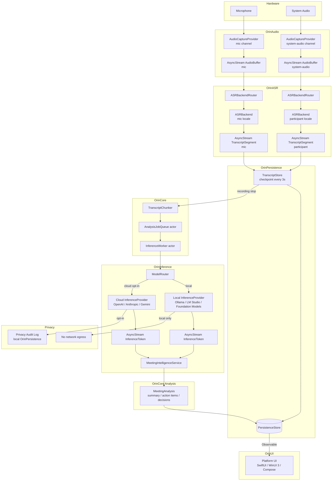

# 12 — Future Platform Architecture

**Document class:** Principal architecture specification  
**Horizon:** 5 years (2026–2031)  
**Status:** Approved for implementation planning  
**Predecessor documents:** 01-Executive-Summary, 02-Current-System-Architecture, 04-AI-Pipeline, 05-Performance-Review

---

## Table of Contents

1. [Vision Statement](#1-vision-statement)
2. [Architecture Principles](#2-architecture-principles)
3. [Core Module Definitions](#3-core-module-definitions)
4. [Data Flow Architecture](#4-data-flow-architecture)
5. [Platform Support Matrix](#5-platform-support-matrix)
6. [Privacy Architecture](#6-privacy-architecture)
7. [Model-Agnostic Inference Design](#7-model-agnostic-inference-design)
8. [Plugin Architecture](#8-plugin-architecture)
9. [Enterprise Deployment](#9-enterprise-deployment)
10. [Windows Implementation Plan](#10-windows-implementation-plan)
11. [iOS Implementation Plan](#11-ios-implementation-plan)
12. [Android Implementation Plan](#12-android-implementation-plan)
13. [Phased Roadmap](#13-phased-roadmap)
14. [Migration from Current Architecture](#14-migration-from-current-architecture)

---

## 1. Vision Statement

Orin is a **local-first meeting intelligence layer** that runs on every platform where knowledge workers meet. It records, transcribes, analyzes, and surfaces the meaning of meetings — action items, decisions, key moments, participant contributions — without transmitting a single word of transcript to any Orin-operated server.

**The central commitment:** The user's data lives on their device and, if they choose, syncs through their own iCloud, OneDrive, or Google Drive account. Orin never sees it.

In five years, Orin runs on macOS, Windows, iOS, and Android. Every platform is powered by the same `OrinCore` business logic module, connected to platform-native adapters for audio capture, speech recognition, and local inference. The AI layer is model-agnostic: it runs Apple Foundation Models on Apple silicon, Windows ML on ARM Windows, Whisper + llama.cpp on any platform, and optionally cloud models when the user explicitly opts in — per meeting, with a clear disclosure screen before any content leaves the device.

The vocabulary and multilingual systems support 10+ languages natively. The system learns from user corrections without requiring manual vocabulary maintenance. Calendar integrations, video platforms, and project management tools connect through an open plugin protocol. Enterprise deployments run entirely on-premises — every component from audio capture to inference to persistence.

**What does not change:** The design philosophy that the current macOS codebase embeds. The recording pipeline's NSLock-bridged real-time audio model, the @MainActor isolation strategy for UI-touching services, the crash-recovery architecture built into TranscriptStore, and the chunked analysis approach with synthesis — these represent genuine platform knowledge. The future architecture extends these decisions to new platforms rather than replacing them.

---

## 2. Architecture Principles

These principles govern every design decision in this specification. When a proposed implementation conflicts with a principle, the principle wins.

**P-1: Local by default, cloud by explicit choice.**  
All transcription, analysis, and storage runs on the user's device without network access unless the user affirmatively enables a cloud provider for a specific meeting. No data is transmitted on the user's behalf without their knowledge.

**P-2: No platform lock-in for business logic.**  
`OrinCore` — the module containing all meeting intelligence — has zero platform-specific imports. Business logic is tested against Swift's standard library and OrinCore protocols only. Platform adapters are thin and interchangeable.

**P-3: Audio path is real-time safe.**  
Every code path that executes on a Core Audio I/O thread, WASAPI callback thread, or Android AudioRecord callback obeys real-time rules: no heap allocation, no lock acquisition that may block, no IPC calls, no filesystem access.

**P-4: The job queue owns inference.**  
No code outside `InferenceWorker` and `AnalysisJobQueue` calls an AI model directly. This is the architectural lesson from the thundering-herd defect: unbounded concurrent dispatch to a single-GPU process is catastrophically wrong and the fix must be structural, not a one-off semaphore.

**P-5: Privacy is auditable.**  
Every external network request made on the user's behalf is recorded in a local Privacy Audit Log. The user can open it at any time and see exactly what was sent, to whom, and when.

**P-6: New platforms reuse, they do not rewrite.**  
When the Android or Windows implementation diverges from the macOS implementation in business logic, the divergence is a bug to fix in `OrinCore`, not a reason to maintain separate implementations.

**P-7: Crash recovery is non-negotiable.**  
Any meeting recording that begins must produce a recoverable transcript even if the app crashes mid-recording. This requires the checkpoint-driven persistence already present in `TranscriptStore` and its extension to every platform's persistence adapter.

---

## 3. Core Module Definitions

The future architecture is organized into eight modules. Each module has a single owner protocol, a single responsibility, and zero dependencies on modules at its same level or below. The dependency graph is a strict DAG.

```
OrinUI-{platform}
       |
       +------ OrinCore
       |           |
       |           +------ OrinInference (protocol only)
       |           +------ OrinASR (protocol only)
       |           +------ OrinPersistence (protocol only)
       |           +------ OrinVocabulary
       |           +------ OrinDetection (protocol only)
       |
       +------ OrinAudio (platform adapter)
       +------ OrinASR (platform implementation)
       +------ OrinInference (platform implementation)
       +------ OrinPersistence (platform implementation)
       +------ OrinDetection (platform implementation)
```

### 3.1 OrinCore

**Role:** All platform-agnostic business logic. This is the intellectual center of the product.

**Language:** Swift (Apple platforms), with a Kotlin Multiplatform mirror for Android.

**Permitted imports:** Foundation (Date, UUID, String, Data), Swift standard library, Swift Concurrency. No AVFoundation, no SCKit, no EventKit, no SpeechAnalysis, no SwiftData, no URLSession beyond the InferenceProvider protocol boundary.

**Contains:**

| Type | Responsibility |
|---|---|
| `TranscriptChunker` | Splits a finalized transcript into analysis chunks at sentence boundaries, respecting token limits per model |
| `MeetingIntelligenceService` | Orchestrates chunked analysis: iterates over `AnalysisJobQueue`, assembles prompts, synthesizes results |
| `VocabularyContext` | Builds the prioritized vocabulary list for a session from four tiers |
| `AnalysisJobQueue` actor | Serializes multi-meeting analysis requests; prevents double Ollama load |
| `InferenceWorker` actor | Single point of contact for all AI inference; serial queue for local, bounded semaphore for cloud |
| `MeetingAnalysis` | Value type containing summary, action items, decisions, key points, sentiment timeline |
| `ActionItemDeduplicator` | Canonical action-item consolidation across chunks |
| `HallucinationDetector` | Off-actor word-set scan; flags summary words absent from transcript |
| `MeetingTypeDetector` | Language-parameterized keyword matching for meeting type classification |
| `ConversationTimelineBuilder` | Constructs speaker-attributed timeline from `TranscriptSegment` records |
| `PromptBuilder` | Assembles LLM prompts with language parameter, section-marker schema, vocabulary injection |

**Does not contain:** Any audio capture, any ASR, any persistence implementation, any UI.

**Testing:** Every type in `OrinCore` is unit-testable in isolation. The `OrinCoreTests` target has no UI dependencies and runs in under 10 seconds.

---

### 3.2 OrinAudio

**Role:** Abstracts platform audio capture behind a single `AudioCaptureProvider` protocol. Exposes PCM audio as an `AsyncStream<AudioBuffer>`.

**Protocol:**

```swift
protocol AudioCaptureProvider {
    var channel: AudioChannel { get }          // .microphone | .systemAudio
    var nativeFormat: AudioFormat { get }
    func start() async throws
    func stop() async
    var audioStream: AsyncStream<AudioBuffer> { get }
}

struct AudioBuffer {
    let pcmData: ContiguousArray<Float>        // pre-allocated, never heap-allocated per frame
    let frameCount: Int
    let sampleRate: Double
    let channelCount: Int
    let presentationTimestamp: TimeInterval
}

struct AudioFormat {
    let sampleRate: Double
    let channelCount: Int
    let bitDepth: Int
}
```

**Platform implementations:**

| Adapter | Platform | Notes |
|---|---|---|
| `SCKitAudioAdapter` | macOS | Wraps `SCStream` for system audio; `AVAudioEngine` tap for mic |
| `WASAPIAudioAdapter` | Windows | Windows Audio Session API; WASAPI loopback for system audio |
| `AVAudioSessionAdapter` | iOS | `AVAudioSession` + `AVAudioEngine` tap; no system audio capture (iOS restriction) |
| `AudioRecordAdapter` | Android | `AudioRecord` with `AudioManager.STREAM_VOICE_CALL`; no loopback without root |

**Real-time safety contract:** `AudioBuffer` uses a pre-allocated `ContiguousArray<Float>` per channel, populated by copying into an existing allocation on each callback. The adapter holds a buffer pool initialized at `start()`. No `malloc` on the audio thread. This is the fix for TD-002.

---

### 3.3 OrinASR

**Role:** Abstracts speech recognition behind an `ASRBackend` protocol. Supports per-channel locale independence.

**Protocol:**

```swift
protocol ASRBackend {
    var supportedLocales: [Locale] { get }
    var backendIdentifier: String { get }

    func transcribe(
        audioStream: AsyncStream<AudioBuffer>,
        locale: Locale,
        vocabulary: [String]
    ) async throws -> AsyncStream<TranscriptSegment>
}

struct TranscriptSegment {
    let id: UUID
    let meetingId: UUID
    let channel: AudioChannel
    let speakerLabel: String?
    let text: String
    let startOffset: TimeInterval
    let endOffset: TimeInterval
    let confidence: Float
    let isFinal: Bool
    let locale: Locale
}
```

**ASRBackendRouter:**

```swift
actor ASRBackendRouter {
    func selectBackend(for locale: Locale, channel: AudioChannel) -> ASRBackend {
        // 1. If SpeechTranscriber supports locale, return SpeechTranscriberASRBackend
        // 2. Else if WhisperASRBackend is configured and locale is in whisper.supportedLocales, return WhisperASRBackend
        // 3. Else return SFSpeechASRBackend with closest English variant
    }
}
```

**Platform backends:**

| Backend | Platform | Locales |
|---|---|---|
| `SpeechTranscriberASRBackend` | macOS 26+ | 50+ via Apple SpeechTranscriber |
| `SFSpeechASRBackend` | macOS (legacy) | English variants (en-IN, en-US, en-GB, en-AU) |
| `WhisperASRBackend` | All platforms | 99 languages via whisper.cpp (on-device) |
| `WindowsSTTASRBackend` | Windows | Windows.Media.SpeechRecognition; ~40 locales |
| `AndroidSTTASRBackend` | Android | Android SpeechRecognizer; device-dependent |
| `CallKitASRBackend` | iOS | AVSpeechRecognizer + CallKit integration |

**Per-channel locale independence:** The router is called once per channel at session start. The mic channel and system-audio channel may use different backends with different locales. Example: mic uses `WhisperASRBackend` with `hi-IN`, participant audio uses `SpeechTranscriberASRBackend` with `en-US`.

---

### 3.4 OrinInference

**Role:** Model-agnostic AI inference. Single point of dispatch for all LLM requests.

**Full protocol specification:** See Section 7.

**Key actors:**

**`InferenceWorker` actor:**
- Holds one active job at a time for local providers (Ollama, LM Studio, Apple Foundation Models, Windows ML)
- Allows up to `concurrencyLimit` simultaneous jobs for cloud providers (default: 3 for OpenAI/Anthropic, 5 for Gemini)
- Caches health-check results for 10 seconds (eliminates N simultaneous `/api/tags` on chunked analysis start)
- Circuit breaker: after 3 consecutive provider failures within 90 seconds, marks that provider unavailable for 60 seconds and routes to fallback
- Exposes `currentLoad: InferenceLoad` observable property for UI feedback

**`AnalysisJobQueue` actor:**
- Serializes multi-meeting analysis jobs
- Priority: `.userInitiated` (manual Analyze button) jumps ahead of `.automatic` (post-recording)
- Observable queue depth for UI state: "Analysis queued (2 meetings)"
- On enqueue when `running == false`: begin processing immediately
- On enqueue when `running == true`: append to `[PendingAnalysis]`; start next on completion

**`ModelRouter` protocol:**
```swift
protocol ModelRouter {
    func route(job: InferenceJob) -> any InferenceProvider
}
```
Concrete routers: `LocalFirstRouter`, `CloudOnlyRouter`, `SpecializedRouter` (large model for analysis, small model for summarization).

**Providers:**

| Provider | Platform | Notes |
|---|---|---|
| `OllamaProvider` | macOS, Windows, Linux | HTTP `/api/generate`; sequential dispatch only |
| `LMStudioProvider` | macOS, Windows | OpenAI-compatible API; preferred on Windows |
| `AppleFoundationModelsProvider` | macOS 26+, iOS 26+ | On-device; no network; macOS 26 required |
| `WindowsMLProvider` | Windows | DirectML; Phi-3 / Mistral |
| `OpenAIProvider` | All (opt-in) | GPT-4o, GPT-4o-mini |
| `AnthropicProvider` | All (opt-in) | Claude Sonnet 4.5, Claude Haiku |
| `GeminiProvider` | All (opt-in) | Gemini 2.0 Flash |
| `GeminiNanoProvider` | Android | On-device via Android AICore |

---

### 3.5 OrinPersistence

**Role:** Platform-agnostic meeting data storage. Single protocol; three implementations.

**Protocol:**

```swift
protocol PersistenceStore {
    func saveMeeting(_ meeting: MeetingRecord) async throws
    func fetchMeetings(predicate: MeetingPredicate) async throws -> [MeetingRecord]
    func updateTranscript(meetingId: UUID, segments: [TranscriptSegment]) async throws
    func saveAnalysis(_ analysis: MeetingAnalysis, for meetingId: UUID) async throws
    func deleteMeeting(meetingId: UUID) async throws
    func fetchVocabulary(userId: UUID) async throws -> [VocabularyItem]
    func saveVocabularyItem(_ item: VocabularyItem) async throws
    func recordPrivacyEvent(_ event: PrivacyAuditEvent) async throws
}
```

**Implementations:**

| Store | Platform | Backing |
|---|---|---|
| `SwiftDataStore` | macOS, iOS | SwiftData; `@Attribute(.externalStorage)` on transcript blobs; meetingId-predicated `FetchDescriptor` throughout |
| `GRDBStore` | Windows, Linux | GRDB (SQLite); WAL mode; full-text search via FTS5 |
| `RoomStore` | Android | Jetpack Room + SQLite; coroutine-aware; encrypted via SQLCipher |

**Crash-recovery contract:** All implementations must flush in-progress transcript data to durable storage within 3 seconds of each audio callback cycle, using a checkpoint mechanism equivalent to the current `TranscriptStore.checkpoint()`. This ensures a recoverable transcript even when the process is killed mid-recording.

---

### 3.6 OrinDetection

**Role:** Determines whether a meeting is in progress and whether Orin should auto-start recording.

**Protocol:**

```swift
protocol MeetingDetector {
    func signals() -> AsyncStream<DetectionSignal>
}

struct DetectionSignal {
    let source: SignalSource           // .calendar | .audio | .videoApp | .phoneCall
    let confidence: Float              // 0.0 – 1.0
    let metadata: DetectionMetadata
}
```

**`MeetingConfidenceScorer` (OrinCore, platform-agnostic):**  
Receives `[DetectionSignal]` and computes an overall meeting probability. The scoring weights are platform-independent. Platform implementations supply the signals; `OrinCore` decides whether the threshold for auto-start has been met.

**Platform implementations:**

| Detector | Platform | Signal sources |
|---|---|---|
| `macOSMeetingDetector` | macOS | SCKit audio presence, `CGWindowListCopyWindowInfo` for video apps, `EventKit` calendar, `AppleScript` browser tab detection |
| `WindowsMeetingDetector` | Windows | `WTSRegisterSessionNotification`, WinRT audio session enumeration, `ICalendar` via Outlook COM |
| `iOSMeetingDetector` | iOS | `CallKit.CXCallObserver`, `EventKit` |
| `AndroidMeetingDetector` | Android | `TelecomManager`, `CalendarContract` |

---

### 3.7 OrinVocabulary

**Role:** Manages the four-tier vocabulary system. Language-aware, self-learning, entirely on-device.

**Types:**

```swift
struct VocabularyContext {
    var session: [String]        // Tier 1: meeting attendee names (EventKit)
    var user: [VocabularyItem]   // Tier 2: user-managed in SettingsView
    var org: [VocabularyItem]    // Tier 3: team-synced (future, CloudKit private zone)
    var builtIn: [LocalizedVocabularyPack]  // Tier 4: compiled vocabulary by language
}

struct LocalizedVocabularyPack {
    let languageCode: String
    let terms: [String]
}

@Model class VocabularyItem {
    var id: UUID
    var term: String
    var languageCode: String?    // nil = language-agnostic
    var source: VocabularySource // .user | .org | .learned
    var frequency: Int
    var createdAt: Date
    var lastUsedAt: Date
}

@Model class VocabularyCorrection {
    var id: UUID
    var originalText: String
    var correctedText: String
    var sessionId: UUID
    var timestamp: Date
    var promoted: Bool
}
```

**`VocabularyContext.build(forMeeting:language:)`:**  
Fills from Tier 1 → Tier 4 until the 100-term budget is exhausted. Terms from higher tiers are never displaced by lower tiers. The build result is logged at `info` level with explicit budget accounting.

**`CorrectionStore`:**  
When a user edits a transcript word, the before/after pair is stored. When `frequency >= 3`, the correction is auto-promoted to Tier 2 with a one-tap notification. Corrections older than 90 days with `promoted: false` are pruned by `MeetingRetentionService`.

**`LanguageRouter`:**  
Post-session, runs `NLLanguageRecognizer.dominantLanguage(for: transcript.prefix(500 words))` and stores the result in `MeetingItem.detectedLanguage`. If the detected language differs from the configured locale, the user is notified and offered re-analysis with the correct locale.

---

## 4. Data Flow Architecture

The following diagram shows the complete data flow from audio capture to UI rendering across all platform layers.



**Key data-flow invariants:**

1. `OrinAudio → OrinASR` is a pure `AsyncStream` handoff. No shared mutable state crosses this boundary.
2. `TranscriptStore` checkpoints every 3 seconds. The recording pipeline never blocks waiting for persistence.
3. `AnalysisJobQueue` is the only component that enqueues jobs to `InferenceWorker`. No other code path reaches local inference directly.
4. The `MeetingAnalysis` result is written to `PersistenceStore` by `OrinCore` (not by the UI). The UI layer is read-only with respect to analysis results.
5. Cloud inference is always routed through `Privacy Audit Log` before the first byte leaves the device.

---

## 5. Platform Support Matrix

| Feature | macOS (current) | macOS (Phase 3) | Windows | iOS | Android |
|---|:---:|:---:|:---:|:---:|:---:|
| **Audio capture — mic** | AVAudioEngine | AVAudioEngine | WASAPI | AVAudioSession | AudioRecord |
| **Audio capture — system** | SCKit (SCStream) | SCKit (SCStream) | WASAPI loopback | Not available | Not available (no root) |
| **Meeting detection — audio** | SCKit presence | SCKit presence | WinRT audio session | CallKit | TelecomManager |
| **Meeting detection — video app** | CGWindowList | CGWindowList | WinRT process enum | Not needed | Not needed |
| **Meeting detection — calendar** | EventKit | EventKit | Outlook COM / iCalendar | EventKit | CalendarContract |
| **ASR — English** | SpeechTranscriber / SFSpeech | SpeechTranscriber | WindowsSTT | AVSpeechRecognizer | Android STT |
| **ASR — 50+ languages** | SpeechTranscriber (macOS 26+) | SpeechTranscriber | WindowsSTT (~40) | AVSpeechRecognizer | Android STT (device-dependent) |
| **ASR — Hindi (hi-IN)** | WhisperASRBackend | WhisperASRBackend | WhisperASRBackend | WhisperASRBackend | WhisperASRBackend (JNI) |
| **Local inference** | Ollama / LM Studio | Ollama / LM Studio / Apple Foundation Models | LM Studio / Windows ML | Apple Foundation Models | Gemini Nano (AICore) |
| **Cloud inference (opt-in)** | OpenAI / Anthropic / Gemini | OpenAI / Anthropic / Gemini | OpenAI / Anthropic / Gemini | OpenAI / Anthropic / Gemini | OpenAI / Anthropic / Gemini |
| **Persistence** | SwiftData | SwiftData | GRDB | SwiftData / Core Data | Room + SQLCipher |
| **Calendar integration** | EventKit | EventKit | Outlook COM | EventKit | CalendarContract |
| **Vocabulary tiers 1–4** | Partial (tiers 1+4) | Full (tiers 1–4) | Full (1–4) | Full (1–4) | Full (1–4) |
| **10+ language AI analysis** | Phase 2 (8–10 wk) | Yes | Yes | Yes | Yes |
| **iCloud sync** | Planned (Phase 4) | Yes | OneDrive | iCloud | Google Drive |
| **Plugin protocol** | Phase 4 | Yes | Yes | Subset | Subset |
| **Privacy Audit Log** | Phase 1 | Yes | Yes | Yes | Yes |
| **Enterprise on-premises** | Phase 4 | Yes | Yes | No | No |

---

## 6. Privacy Architecture

### 6.1 Core Commitment

No Orin server ever receives user content. This is not a policy that can be changed by a terms-of-service update — it is enforced at the architectural level by having no Orin-operated receiving endpoint.

### 6.2 Data Classification

| Data class | At rest | In transit (if any) | Retention |
|---|---|---|---|
| Audio recordings | Not persisted by default; optionally stored in encrypted app container | Never | Session only unless user explicitly saves |
| Transcripts | Platform-encrypted app container (FileVault / BitLocker / iOS Data Protection / Android Keystore) | Only to user-selected cloud AI provider, opt-in per meeting | User-controlled; default 90 days |
| Meeting analysis | Platform-encrypted app container | Never | User-controlled |
| Vocabulary / corrections | Platform-encrypted app container | Never (CloudKit private zone for Tier 3 org vocab, user-controlled) | Until user deletes |
| Calendar metadata | Never persisted beyond session; read at session start only | Never | Session only |
| Privacy Audit Log | Platform-encrypted app container | Never | 365 days rolling; user-deletable |

### 6.3 Cloud AI Opt-In Flow

When the user enables a cloud AI provider for a meeting:

1. **Disclosure screen** (mandatory, non-dismissable without explicit acknowledgment):
   - Identifies which provider will receive the transcript
   - States exactly what will be sent: the text transcript of this meeting
   - Confirms: no audio is ever transmitted
   - Links to the provider's privacy policy
   - Provides a "Do not send" option that routes to local inference

2. **Privacy Audit Log entry** created before the first request:
   ```
   2026-06-25T14:23:01Z | CLOUD_INFERENCE | provider=openai | model=gpt-4o-mini
   | meeting=2026-06-25-10:00 Engineering Standup | bytes=14,203 | user_confirmed=true
   ```

3. **No default cloud provider.** The cloud AI preference dialog requires the user to explicitly select a provider and enter an API key. There is no pre-configured Orin relay.

### 6.4 Org Sync

Teams share Tier 3 vocabulary and analysis templates through a user-controlled CloudKit private zone (Apple platforms) or a user-specified WebDAV/S3 endpoint. Orin, Inc. operates no sync server. The encryption key for the org zone lives in the user's iCloud Keychain and is never transmitted to Orin.

### 6.5 Privacy Audit Log

`PrivacyAuditEvent` is a `PersistenceStore`-backed record:

```swift
struct PrivacyAuditEvent {
    let id: UUID
    let timestamp: Date
    let eventType: AuditEventType     // .cloudInferenceSent | .syncWritten | .pluginAccessed
    let destination: String           // provider name or sync endpoint
    let meetingId: UUID?
    let byteCount: Int
    let userConfirmed: Bool
}
```

Surfaced in `SettingsView → Privacy → Network Activity`. Entries older than 365 days are pruned automatically. The log is queryable by the user and exportable as JSON.

---

## 7. Model-Agnostic Inference Design

### 7.1 Core Protocol

```swift
// OrinInference module

protocol InferenceProvider: Sendable {
    var providerIdentifier: String { get }
    func capabilities() -> InferenceCapabilities
    func isAvailable() async -> Bool
    func infer(job: InferenceJob) async throws -> AsyncStream<InferenceToken>
}

struct InferenceCapabilities {
    let maxContextTokens: Int
    let supportsStreaming: Bool
    let supportedLanguages: [String]   // ISO 639-1 codes; empty means all
    let costModel: CostModel           // .free | .localCompute | .perToken(rate: Decimal)
    let isLocal: Bool
}

struct InferenceJob: Sendable {
    let id: UUID
    let systemPrompt: String
    let userPrompt: String
    let maxOutputTokens: Int
    let temperature: Float             // 0.0 – 1.0
    let language: String?              // ISO 639-1; nil = model default
    let priority: JobPriority          // .userInitiated | .automatic | .background
}

enum InferenceToken: Sendable {
    case text(String)
    case complete(InferenceMetrics)
}

struct InferenceMetrics: Sendable {
    let providerIdentifier: String
    let modelIdentifier: String
    let inputTokens: Int
    let outputTokens: Int
    let wallClockSeconds: TimeInterval
    let wasLocal: Bool
}
```

### 7.2 InferenceWorker Actor

```swift
actor InferenceWorker {
    private let localProvider: any InferenceProvider
    private let cloudProviders: [any InferenceProvider]
    private let router: any ModelRouter
    private let maxCloudConcurrency: Int = 3
    private var cloudSemaphore: AsyncSemaphore    // initialized with maxCloudConcurrency
    private var cachedAvailability: [String: (result: Bool, cachedAt: Date)] = [:]
    private var consecutiveFailures: [String: Int] = [:]
    private var circuitBreakerExpiresAt: [String: Date] = [:]

    func enqueue(job: InferenceJob) -> AsyncStream<InferenceToken> {
        // For local providers: strictly sequential (no concurrent calls)
        // For cloud providers: bounded by cloudSemaphore
        // Returns AsyncStream<InferenceToken> that the caller can iterate
    }

    private func isAvailableCached(provider: any InferenceProvider) async -> Bool {
        let key = provider.providerIdentifier
        if let cached = cachedAvailability[key], Date().timeIntervalSince(cached.cachedAt) < 10 {
            return cached.result
        }
        let result = await provider.isAvailable()
        cachedAvailability[key] = (result: result, cachedAt: Date())
        return result
    }
}
```

**Sequential guarantee for local providers:** For any provider where `capabilities().isLocal == true`, `InferenceWorker` processes at most one job at a time. This eliminates the thundering-herd defect permanently, regardless of how many `AnalysisJobQueue` submissions arrive simultaneously.

**Jitter on retry:** Retry delays use `TimeInterval.random(in: 8...15)` seconds, not a fixed 10 seconds. This breaks synchronized retry waves.

**Circuit breaker:** After 3 consecutive failures from the same provider within 90 seconds, `InferenceWorker` marks that provider as unavailable for 60 seconds and routes subsequent jobs to the fallback chain. The UI surfaces this as "Local AI temporarily unavailable — using cloud fallback" (only if cloud is enabled; otherwise "Analysis paused — waiting for local AI").

### 7.3 Adding a New Provider

Implementing a new inference backend requires exactly one file:

```swift
// Example: JanAIProvider.swift
struct JanAIProvider: InferenceProvider {
    let providerIdentifier = "jan-ai"

    func capabilities() -> InferenceCapabilities {
        InferenceCapabilities(
            maxContextTokens: 4096,
            supportsStreaming: true,
            supportedLanguages: [],    // all languages
            costModel: .localCompute,
            isLocal: true
        )
    }

    func isAvailable() async -> Bool { /* HTTP health check */ }

    func infer(job: InferenceJob) async throws -> AsyncStream<InferenceToken> {
        /* Jan.ai API call, streaming response */
    }
}
```

Register in `OrinApp.init()` via `ModelRouter` configuration. Zero changes to `OrinCore`.

---

## 8. Plugin Architecture

### 8.1 Plugin Protocol

Orin exposes an open plugin protocol for calendar integrations, video platform connectors, and project management exporters.

```swift
protocol OrinPlugin: Sendable {
    var pluginIdentifier: String { get }      // reverse-DNS: com.notion.orin-exporter
    var displayName: String { get }
    var version: String { get }
    var capabilities: PluginCapabilities { get }

    func activate(context: PluginContext) async throws
    func deactivate() async
}

struct PluginCapabilities: OptionSet {
    let rawValue: UInt32
    static let calendarRead    = PluginCapabilities(rawValue: 1 << 0)
    static let actionItemExport = PluginCapabilities(rawValue: 1 << 1)
    static let transcriptExport = PluginCapabilities(rawValue: 1 << 2)
    static let meetingImport   = PluginCapabilities(rawValue: 1 << 3)
}

struct PluginContext {
    let meetingId: UUID
    let analysis: MeetingAnalysis      // read-only view of analysis results
    let actionItems: [ActionItemRecord] // read-only
    let exportSink: any PluginExportSink
    // No direct access to TranscriptStore or PersistenceStore
}
```

### 8.2 Sandboxing Model

Plugins run in a separate process, connected to Orin via XPC. They receive a `PluginContext` that exposes only the data they declared in their `PluginCapabilities`. A plugin declaring only `.actionItemExport` cannot read transcript text — the XPC boundary enforces this at the data level.

macOS App Sandbox applies to the plugin process. Plugin processes do not inherit Orin's entitlements (no microphone, no screen recording, no calendar access unless the user separately grants it to the plugin process).

**Plugin receipt:** All plugins are signed with an Apple Developer ID certificate and notarized. Orin verifies the signing certificate before activation. No unsigned plugins can be activated.

### 8.3 Distribution Model

**First-party plugins** ship as part of Orin (Notion, Jira, Linear, Google Calendar, Outlook). They are reviewed and updated with Orin's release cycle.

**Third-party plugins** are distributed through the Mac App Store as standalone extensions, or through a future Orin Plugin Directory. Third-party plugins pass App Review (for MAS distribution) or Orin's plugin review (for directory distribution), with mandatory disclosure of all declared capabilities.

**Enterprise plugins** are signed by the enterprise's own Developer ID and deployed via MDM. Enterprises may override the plugin allow-list policy to restrict which plugins their users can install.

### 8.4 Built-In Integrations (Phase 4)

| Integration | Capability | Notes |
|---|---|---|
| Notion | Action item export, meeting page creation | OAuth; writes to user-specified workspace |
| Jira | Action item → Jira issue creation | PAT auth; user selects project |
| Linear | Action item → Linear issue | OAuth |
| Slack | Meeting summary posting | OAuth; user selects channel |
| Google Calendar | Calendar read for meeting detection | Read-only; no write |
| Outlook | Calendar read for meeting detection | Outlook COM (Windows); Graph API (cloud) |
| GitHub | Action item → GitHub issue | PAT auth |
| Asana | Action item export | OAuth |

All integration credentials are stored in the platform keychain, never in Orin's database.

---

## 9. Enterprise Deployment

### 9.1 Deployment Model

Enterprise Orin runs entirely on-premises. There is no required Orin cloud component in the enterprise deployment. The deployment topology is:

```
[User Devices] ──── [Corporate LAN] ──── [On-premises Ollama / LM Studio cluster]
                                      └── [On-premises vocabulary sync server (WebDAV/S3-compatible)]
                                      └── [On-premises audit log aggregator (optional)]
                                      └── [Corporate Exchange / Outlook server]
```

### 9.2 Local Inference Cluster

Enterprises with privacy requirements that prohibit any cloud AI can deploy an Ollama or LM Studio cluster within their network perimeter. The `OllamaProvider` and `LMStudioProvider` accept a configurable base URL; pointing them at the on-premises cluster requires only an MDM-distributed configuration profile with the cluster endpoint.

Recommended on-premises model selection:

| Model | Context window | Use case | Hardware (minimum) |
|---|---|---|---|
| Phi-3.5-mini | 128K | Short meetings (<30 min), action item extraction | 8GB RAM |
| Mistral-7B-Instruct | 32K | Standard meetings (30–90 min) | 16GB RAM / 8GB VRAM |
| Llama-3.1-8B | 128K | Long meetings (>90 min), synthesis | 16GB RAM / 8GB VRAM |
| Llama-3.1-70B | 128K | High-accuracy analysis, multilingual | 4× A100 or equivalent |

### 9.3 Vocabulary Sync

Enterprise Tier 3 vocabulary is served from a WebDAV or S3-compatible endpoint configured via MDM. The endpoint is read-only from the device perspective; only IT-designated vocabulary administrators can write. The vocabulary sync channel uses mutual TLS; the device certificate is provisioned via MDM.

### 9.4 Calendar Integration

On-premises Exchange and on-premises SharePoint calendars are supported via:
- **Exchange Web Services (EWS):** legacy Exchange ≤ 2019; credentials via MDM-distributed keychain items
- **Microsoft Graph API (on-premises):** Exchange Server 2019 with Hybrid configuration; OAuth 2.0 via on-premises AD FS

No Microsoft cloud services are required for on-premises calendar integration.

### 9.5 Audit Logging

The Privacy Audit Log (Section 6.5) is the device-level record. Enterprise deployments may additionally aggregate audit events to a central SIEM via syslog or a structured JSON log endpoint. The `OrinEnterpriseAuditExporter` plugin (first-party, enterprise-only) reads `PrivacyAuditEvent` records and forwards them to a configurable endpoint using mutual TLS.

**Audit event format (JSON):**
```json
{
  "event_id": "uuid",
  "timestamp": "ISO 8601",
  "device_id": "MDM-assigned serial",
  "user_email": "from identity provider",
  "event_type": "CLOUD_INFERENCE_SENT | LOCAL_INFERENCE | VOCAB_SYNC | PLUGIN_EXPORT",
  "destination": "provider or endpoint name",
  "meeting_date": "YYYY-MM-DD",
  "byte_count": 14203,
  "user_confirmed": true,
  "orin_version": "1.x.x"
}
```

### 9.6 MDM Configuration Profile Keys

| Key | Type | Description |
|---|---|---|
| `OrinLocalInferenceEndpoint` | String (URL) | Base URL for on-premises Ollama/LM Studio |
| `OrinVocabularySyncEndpoint` | String (URL) | WebDAV/S3 endpoint for Tier 3 vocabulary |
| `OrinAllowCloudInference` | Boolean | If false, cloud provider UI is hidden entirely |
| `OrinAllowedPlugins` | Array[String] | Allow-list of plugin identifiers |
| `OrinAuditLogEndpoint` | String (URL) | Syslog / HTTP endpoint for audit export |
| `OrinForceLocale` | String | Overrides user locale preference org-wide |
| `OrinRetentionDays` | Integer | Override default 90-day transcript retention |

---

## 10. Windows Implementation Plan

### 10.1 Technology Stack Decisions

| Layer | Decision | Rationale |
|---|---|---|
| UI framework | **WinUI 3** (native) with future Compose Multiplatform option | WinUI 3 provides native Windows look-and-feel and full access to Windows APIs; Compose Multiplatform deferred until it reaches feature parity for desktop |
| Persistence | **GRDB** (SQLite via Swift-on-Windows) | GRDB is cross-platform Swift; WAL mode; FTS5 for search; no Core Data/SwiftData dependency |
| Audio capture — mic | **WASAPI (Core Audio)** | Low-latency; standard Windows audio API |
| Audio capture — system | **WASAPI loopback** | Windows-native system audio capture; no additional entitlements required |
| ASR | **Windows.Media.SpeechRecognition** (primary) + **Whisper** (fallback/multilingual) | Windows STT is on-device and covers ~40 locales; Whisper via whisper.cpp covers the remainder |
| Local inference | **LM Studio** (primary) + **Windows ML / DirectML** (secondary) | LM Studio has the best Windows UX; Windows ML provides a framework-level inference path for enterprise environments |
| Calendar integration | **Outlook COM** (traditional) + **Microsoft Graph API** (cloud-optional) | COM integration is on-premises; Graph API is opt-in for Microsoft 365 tenants |
| Meeting detection | **WinRT audio session enumeration** + **WTSRegisterSessionNotification** | Equivalent signal sources to macOS SCKit presence detection |
| Code sharing | **Swift on Windows** (Swift 6.0 Windows toolchain) | OrinCore is pure Swift; all business logic compiles unchanged on Windows |

### 10.2 OrinCore on Windows

Swift 6.0's Windows toolchain supports the full Swift standard library and Swift Concurrency. `OrinCore` — with zero platform-specific imports — compiles on Windows without modification. This is the payoff of extracting `OrinCore` as a separate module in Phase 3.

`OrinAudio`, `OrinASR`, `OrinDetection`, and `OrinPersistence` on Windows are new implementations of existing protocols. The macOS implementations serve as the specification; the Windows implementations must pass the same protocol conformance tests.

### 10.3 Audio Pipeline on Windows

```swift
// OrinWindows module

class WASAPIAudioAdapter: AudioCaptureProvider {
    private var wasapiClient: WASAPIClient
    private var bufferPool: [AudioBuffer]    // pre-allocated at start()
    private var captureThread: Thread        // WASAPI requires a dedicated capture thread

    func start() async throws {
        wasapiClient = try WASAPIClient(mode: channel == .microphone ? .capture : .loopback)
        bufferPool = (0..<4).map { _ in AudioBuffer.allocate(sampleRate: 16000, frameCount: 4096) }
        captureThread = Thread { [weak self] in self?.captureLoop() }
        captureThread.start()
    }

    private func captureLoop() {
        // Real-time safe: no heap allocation; writes into pre-allocated bufferPool slots
        // Posts to continuation on audioStream
    }
}
```

### 10.4 ASR Pipeline on Windows

```swift
// OrinWindows module

class WindowsSTTASRBackend: ASRBackend {
    var supportedLocales: [Locale] { /* ~40 Windows STT locales */ }

    func transcribe(audioStream: AsyncStream<AudioBuffer>, locale: Locale, vocabulary: [String])
        async throws -> AsyncStream<TranscriptSegment> {
        // Windows.Media.SpeechRecognition with continuous recognition
        // vocabulary injected via SpeechRecognitionConstraint
    }
}
```

For locales not supported by Windows STT (including `hi-IN`), `ASRBackendRouter` falls back to `WhisperASRBackend`. Whisper on Windows runs via whisper.cpp compiled as a DLL, called from Swift via C interop.

### 10.5 Local Inference on Windows

LM Studio provides an OpenAI-compatible HTTP API on `localhost:1234`. `LMStudioProvider` is identical on macOS and Windows — it is an HTTP client with no platform-specific code. Users install LM Studio separately; Orin's Settings page links to lmstudio.ai.

For enterprise environments that cannot install LM Studio, `WindowsMLProvider` uses the Windows ML framework (DirectML backend) to run ONNX-format models without an external process. Microsoft provides Phi-3-mini in ONNX format, enabling full on-device inference without any third-party dependency.

### 10.6 Meeting Detection on Windows

```swift
// OrinWindows module

class WindowsMeetingDetector: MeetingDetector {
    func signals() -> AsyncStream<DetectionSignal> {
        AsyncStream { continuation in
            // Signal 1: WASAPI audio session enumeration (Zoom/Teams/Meet audio session active)
            // Signal 2: WTSRegisterSessionNotification (session lock/unlock events)
            // Signal 3: Outlook COM calendar query (upcoming meetings with video link)
            // Signal 4: Process enumeration for known video app executables
        }
    }
}
```

`MeetingConfidenceScorer` (OrinCore, platform-agnostic) receives these signals and computes the meeting probability using the same threshold logic as macOS.

---

## 11. iOS Implementation Plan

### 11.1 Platform Constraints

iOS imposes constraints not present on macOS that shape the entire iOS architecture:

| Constraint | Impact | Mitigation |
|---|---|---|
| No system audio capture API | Participant audio unavailable without screen recording extension | Mic-only recording; meeting intelligence based on user's speech only |
| App is suspended when backgrounded | Recording must use `AVAudioSession` background mode to remain active | Background audio session; explicit "Recording in background" user notification |
| On-device model size limits | Large LLMs (7B+) exceed available DRAM on older iPhones | Apple Foundation Models (on-device, system-managed) as primary; cloud as fallback |
| CallKit required for call detection | Phone and FaceTime calls require CallKit integration | `CallKit.CXCallObserver` as the primary meeting-start signal |
| No Ollama (daemon process prohibited) | Cannot run Ollama on iOS | Apple Foundation Models (iOS 26+) as local inference; cloud for older devices |

### 11.2 Audio Capture on iOS

```swift
// OrinIOS module

class AVAudioSessionAdapter: AudioCaptureProvider {
    let channel: AudioChannel = .microphone   // system audio not available

    func start() async throws {
        let session = AVAudioSession.sharedInstance()
        try session.setCategory(.playAndRecord, mode: .default,
                               options: [.defaultToSpeaker, .allowBluetooth])
        try session.setActive(true)
        // AVAudioEngine tap; pre-allocated buffer pool (same pattern as macOS)
    }
}
```

Background recording is maintained via `UIBackgroundModes: audio` in the app's `Info.plist` and an active `AVAudioSession`. The user sees an iOS system indicator (red pill in status bar) while recording.

### 11.3 Meeting Detection on iOS

```swift
// OrinIOS module

class iOSMeetingDetector: MeetingDetector {
    private let callObserver = CXCallObserver()

    func signals() -> AsyncStream<DetectionSignal> {
        AsyncStream { continuation in
            // Signal 1: CXCallObserver — phone call or FaceTime call started
            callObserver.setDelegate(self, queue: .main)

            // Signal 2: EventKit — upcoming calendar events with video links
            let events = try await EventKitCalendarAdapter().upcomingMeetings(within: 15)
            for event in events {
                continuation.yield(DetectionSignal(source: .calendar, confidence: 0.8, ...))
            }
        }
    }
}
```

### 11.4 ASR on iOS

Primary: `AVSpeechRecognizer` (Apple's on-device recognizer, 60+ languages on iOS 26+). Wraps as `CallKitASRBackend` with the same `ASRBackend` protocol.

Secondary: `WhisperASRBackend` using whisper.cpp compiled for iOS via a Swift Package with pre-built XCFrameworks. Whisper on iPhone 15 Pro (A17 Pro, 8GB RAM) can run `whisper-small` at approximately 2× real-time — suitable for post-recording analysis but not real-time transcription on older hardware.

### 11.5 Inference on iOS

**Primary: Apple Foundation Models (iOS 26+)**  
On-device, no network required, no user setup. `AppleFoundationModelsProvider` (the same protocol implementation used on macOS 26+) runs on iPhone 15 Pro and later with sufficient context window for meetings up to ~60 minutes.

**Fallback: Cloud inference (opt-in)**  
For devices without Foundation Models (iOS < 26, older hardware), cloud providers are offered with the same consent screen and Privacy Audit Log as on macOS.

**Whisper for offline multilingual ASR:**  
`whisper-base` (39M parameters, ~74MB) runs on-device for all 99 supported languages. This enables true offline multilingual meeting intelligence on iOS without any server dependency.

### 11.6 iOS-Specific UI Considerations

- Simplified recording UX: single large button; no system audio toggle (not available)
- Meeting detection via CallKit: optional auto-start prompt appears when a qualifying call begins
- Background recording indicator: OS red pill is the primary affordance; no in-app persistent banner needed
- Action item widget: iOS Home Screen widget showing today's action items from recent meetings

---

## 12. Android Implementation Plan

### 12.1 Technology Stack

| Layer | Decision |
|---|---|
| Core business logic | **Kotlin Multiplatform** mirror of OrinCore Swift package |
| UI | **Jetpack Compose** |
| Persistence | **Room** (Jetpack) + **SQLCipher** encryption |
| Audio capture | **AudioRecord** (VOICE_COMMUNICATION stream) |
| Meeting detection | **TelecomManager** + **CalendarContract** |
| ASR | **Android SpeechRecognizer** (primary) + **Whisper JNI** (fallback/multilingual) |
| Local inference | **Gemini Nano** via Android AICore (Android 14+) |
| Cloud inference | OpenAI / Anthropic / Gemini (opt-in) |

### 12.2 Kotlin Multiplatform for OrinCore

OrinCore on Android is a Kotlin Multiplatform implementation of the same business logic as the Swift version. The two implementations share:
- Data model schema (serialized to JSON for transfer)
- Algorithm specification (documented in this architecture specification)
- Protocol interface definitions (translated from Swift to Kotlin interface)
- Unit test suite (each test has a Swift and Kotlin version, verified to produce identical results)

They do not share source code. Platform-idiomatic Kotlin is preferred over mechanical Swift translation.

### 12.3 Audio Capture on Android

```kotlin
// OrinAndroid module

class AudioRecordAdapter(
    override val channel: AudioChannel
) : AudioCaptureProvider {
    private val audioRecord = AudioRecord(
        MediaRecorder.AudioSource.VOICE_COMMUNICATION,
        SAMPLE_RATE, CHANNEL_CONFIG, AUDIO_FORMAT, BUFFER_SIZE
    )
    private val preAllocatedBuffers = Array(4) { FloatArray(FRAME_COUNT) }

    override fun start() {
        audioRecord.startRecording()
        launchCaptureCoroutine()
    }

    private fun launchCaptureCoroutine() = scope.launch(Dispatchers.IO) {
        var bufferIndex = 0
        while (isActive) {
            val buffer = preAllocatedBuffers[bufferIndex % 4]
            audioRecord.read(buffer, 0, buffer.size, AudioRecord.READ_BLOCKING)
            audioStreamChannel.send(AudioBuffer(buffer, SAMPLE_RATE))
            bufferIndex++
        }
    }
}
```

**System audio capture on Android** requires `CAPTURE_AUDIO_OUTPUT` permission, which is a signature permission (unavailable to third-party apps without root or device manufacturer agreement). The Android implementation records mic only by default. Enterprise deployments on managed devices (work profile with device owner) may be able to obtain this permission via MDM.

### 12.4 Meeting Detection on Android

```kotlin
// OrinAndroid module

class AndroidMeetingDetector : MeetingDetector {
    override fun signals(): Flow<DetectionSignal> = merge(
        telecomSignals(),
        calendarSignals(),
        audioFocusSignals()
    )

    private fun telecomSignals(): Flow<DetectionSignal> =
        callbackFlow {
            val telecomManager = context.getSystemService(Context.TELECOM_SERVICE) as TelecomManager
            // Register call state listener; emit DetectionSignal on STATE_OFFHOOK
        }

    private fun calendarSignals(): Flow<DetectionSignal> =
        flow {
            // Query CalendarContract for upcoming events with video conferencing links
        }
}
```

### 12.5 Inference on Android

**Primary: Gemini Nano (Android 14+, AICore)**  
On-device, system-managed, no download required on supported devices. Android AICore provides a stable API that abstracts the specific Gemini Nano version from the application.

```kotlin
class GeminiNanoProvider : InferenceProvider {
    private val inferenceClient = AICore.getInferenceClient()

    override suspend fun infer(job: InferenceJob): Flow<InferenceToken> = channelFlow {
        inferenceClient.generateContent(job.toGeminiRequest()) { chunk ->
            trySend(InferenceToken.Text(chunk.text))
        }
        send(InferenceToken.Complete(buildMetrics()))
    }
}
```

**Secondary: Whisper JNI + llama.cpp JNI**  
For devices without Gemini Nano, Whisper (`whisper-small`, ~155MB) handles ASR for all 99 languages. Llama.cpp (with Phi-3-mini-4k-instruct quantized to Q4_K_M, ~2.2GB) provides local inference on devices with 6GB+ RAM.

Both run as JNI-bridged native libraries, compiled for arm64-v8a and x86_64. The JNI bridge follows the same `InferenceProvider` protocol contract as all other providers.

---

## 13. Phased Roadmap

### Phase 1 — Stabilize (Weeks 1–3)

Deliver all 14 quick wins from the architectural review. Eliminate every production crash and system freeze. No new features.

**Targets:**
- TD-001 (thundering herd): serialize Ollama dispatch in `analyzeChunked()` — 2 lines
- TD-002 (real-time allocation): pre-allocate `AVAudioPCMBuffer` in `arm()` — 15 lines
- TD-003 (XPC-in-lock): move `endAudio()` outside `NSLock` in `TapState.disarm()` — 5 lines
- TD-004 (debounce race): `DispatchWorkItem` cancel-and-reschedule — 10 lines
- TD-005 (service locator): `NSLock` in `ServiceContainer` — 4 lines
- QW-006: delete `/tmp/orin_phi3_raw.txt` write — 1 line
- QW-008: batch `TranscriptChunk` saves to checkpoint cycle — 5 lines
- QW-009: `meetingId` predicates in `buildTimelineSegments` and `deleteMeetingFully` — 6 lines

**Exit criteria:** Zero crash reports for 2 consecutive weeks of internal testing; Ollama request count during analysis equals chunk count (no retry storms).

### Phase 2 — Evolve (Weeks 4–13)

Medium-term redesigns. Structural improvements without platform expansion.

**Targets:**
- MT-001: `RecognitionSessionManager` actor extracted — eliminates 400-line duplication
- MT-002: `InferenceWorker` actor + `AnalysisJobQueue` actor — permanent AI pipeline fix
- MT-003: `MeetingsView.swift` split into 5+ files — enables future feature work
- MT-004: Layered vocabulary system (`VocabularyItem` SwiftData model, `SettingsView` vocabulary section)
- MT-005: Language-parameterized `PromptBuilder` — enables non-English AI analysis
- MT-006: `RecordingSessionCoordinator` extracted from `MainContainerView`
- MT-007: `ASRBackend` protocol introduction — wraps existing implementations
- MT-008: `TranscriptChunk` pruning after successful `finalize()`

**Exit criteria:** All 24 existing tests pass; no regressions on macOS; `MeetingsView.swift` < 400 lines; Spanish and French meeting analysis verified with test transcripts.

### Phase 3 — Extend (Weeks 14–25)

Platform foundation. `OrinCore` Swift package extraction. Windows proof-of-concept.

**Targets:**
- `OrinCore` extracted as a standalone Swift package with its own test target
- `InferenceProvider`, `ASRBackend`, `PersistenceStore`, `AudioCaptureProvider`, `MeetingDetector` protocols formalized in separate modules
- Whisper integration (`WhisperASRBackend`) for hi-IN and unsupported locales
- Windows proof-of-concept: `OrinCore` + GRDB + WASAPI + LM Studio on Windows ARM
- `@Attribute(.externalStorage)` migration for `MeetingItem.transcript`
- Apple Foundation Models provider (macOS 26+)

**Exit criteria:** `OrinCore` compiles on Windows with Swift 6.0 toolchain; Windows proof-of-concept records, transcribes, and analyzes a 30-minute meeting end-to-end; existing macOS test suite passes without modification.

### Phase 4 — Scale (Months 7–18)

Production multi-platform. Enterprise features. Org-scale vocabulary.

**Targets:**
- macOS: iCloud sync (CloudKit private zone for Tier 3 vocabulary and org templates)
- Windows: production WinUI 3 app
- iOS: production app (mic-only recording, CallKit detection, Apple Foundation Models)
- Android: production Kotlin Multiplatform app (Gemini Nano / Whisper JNI)
- Plugin protocol v1: Notion, Jira, Linear first-party plugins
- Enterprise MDM configuration profile
- 10-language support verified: en, es, fr, de, zh-CN, zh-TW, ja, ko, ar, hi-IN (via Whisper)
- Privacy Audit Log with enterprise SIEM export plugin

---

## 14. Migration from Current Architecture

### 14.1 No Big Bang

The migration from the current codebase to the future architecture is entirely incremental. At no point is there a flag day where the old code is replaced wholesale. Each phase produces a shippable macOS app that is strictly better than the previous phase.

### 14.2 Protocol Introduction Strategy

Introducing a protocol for an existing concrete type follows this sequence:

1. **Define the protocol** alongside the existing type. The existing type immediately conforms, with no behavior change.
2. **Replace direct instantiation** with the protocol type in all injection sites. All callers now hold the protocol type; the concrete type is still the only implementation.
3. **Write tests** against the protocol interface. This verifies that the protocol abstraction is complete.
4. **Add the second implementation** (e.g., `WhisperASRBackend` alongside `SFSpeechASRBackend`). The router selects between them. The existing behavior is preserved as the default.

This sequence means the codebase is never in a state where a protocol is defined but not implemented, and never in a state where a refactor has removed functionality that tests previously verified.

### 14.3 OrinCore Extraction Sequence

1. Create `OrinCore/` directory in the Xcode project as a local Swift package.
2. Move files one at a time, starting with files that have zero Apple-specific imports: `TranscriptChunker`, `MeetingAnalysis` models, `ActionItemDeduplicator`, `HallucinationDetector`.
3. Move `MeetingIntelligenceService` after replacing its `URLSession` calls with `InferenceProvider` protocol calls (MT-002 prerequisite).
4. Move `VocabularyContext` after the vocabulary redesign (MT-004 prerequisite).
5. Move `AnalysisJobQueue` and `InferenceWorker` last, after their protocol boundaries are verified by the existing test suite.

At the end of this sequence, `OrinCore` is a Swift package with no Apple-specific dependencies. The `OrinMacOS` module wraps it with all existing concrete implementations unchanged.

### 14.4 Preserving Hard-Won Knowledge

The following design decisions embedded in the current codebase are explicitly preserved in the future architecture:

| Current design | Preservation in future architecture |
|---|---|
| `NSLock`-bridged real-time audio path (TapState pattern) | `AudioCaptureProvider` protocol contract mandates pre-allocated buffer pools; all adapters follow the same NSLock bridge pattern |
| Generation counter for recognition session restart | Extracted into `RecognitionSessionManager` (MT-001); logic unchanged |
| Checkpoint-driven persistence (3-second flush cycle) | `PersistenceStore` protocol requires checkpoint semantics; all implementations must implement it |
| Best-of-N transcript finalization | `TranscriptStore.finalize()` logic moves to `OrinCore`; preserved exactly |
| @MainActor isolation for UI-touching services | All future UI services remain `@MainActor`; OrinCore actors are not `@MainActor` |
| Phase-based recording state machine | `RecordingSessionCoordinator` (MT-006) preserves the state machine; adds testability |

---

*This document is the authoritative specification for Orin's 5-year platform architecture. All implementation decisions that conflict with the principles in Section 2 require an architecture decision record (ADR) in `docs/architecture-review/13-Architecture-Decisions.md` before implementation begins.*
