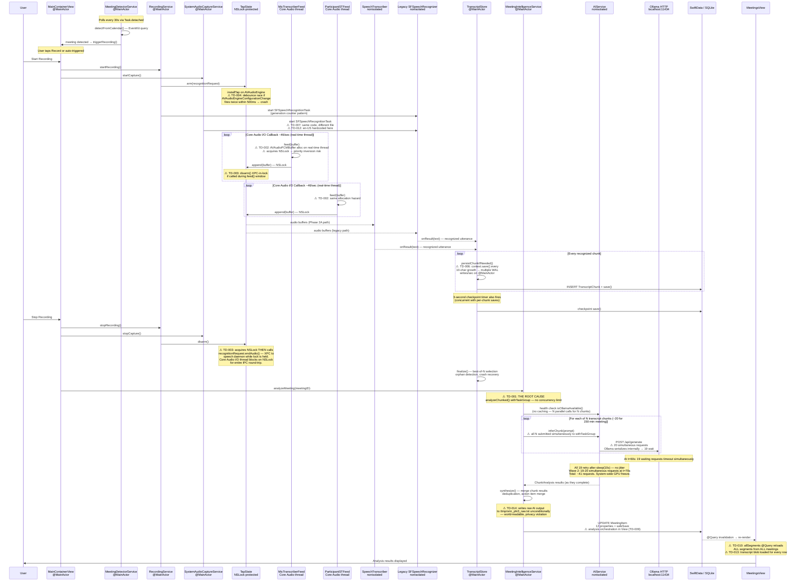

# Current Orin Architecture — Diagrams

> Generated from 9-agent architectural review (2026-06-19).
> Overall verdict: **NEEDS_PATCHING** (not a rewrite).
> Annotated problem areas reference Technical Debt IDs (TD-001 … TD-015).

---

## 1. C4-Style Component Diagram

```mermaid
graph TD
    %% ─────────────────────────────────────────────
    %% EXTERNAL
    %% ─────────────────────────────────────────────
    subgraph EXTERNAL["External / System"]
        SFSpeech["SFSpeechRecognizer\n(Apple, on-device)"]
        STFw["SpeechTranscriber FW\n(PrivateFramework, macOS 15+)"]
        SCKit["ScreenCaptureKit\n(system audio tap)"]
        EventKit["EventKit / CalendarKit"]
        OllamaHTTP["Ollama HTTP :11434\n(local LLM, single-GPU)"]
        CloudLLM["Cloud LLM APIs\n(fallback — OpenAI / Anthropic)"]
        SQLite[("SwiftData / SQLite\n(WAL mode)")]
    end

    %% ─────────────────────────────────────────────
    %% APP ENTRY
    %% ─────────────────────────────────────────────
    subgraph APP["OrinApp (SwiftUI @main)"]
        OrinApp["OrinApp\n@MainActor"]
        ServiceContainer["ServiceContainer\n[String:Any] dict\n⚠ TD-005: no thread safety\n⚠ fatalError on missing key"]
    end

    OrinApp -->|"builds & registers"| ServiceContainer

    %% ─────────────────────────────────────────────
    %% DETECTION LAYER
    %% ─────────────────────────────────────────────
    subgraph DETECTION["Meeting Detection Layer"]
        MeetingDetectorService["MeetingDetectorService\n@MainActor\npolls Task.detached every 30s"]
        CalendarService["CalendarService\n@MainActor\n⚠ TD-008: status read\noff-actor in detector"]
    end

    MeetingDetectorService -->|"reads status\n⚠ data race"| CalendarService
    CalendarService -->|"EventKit query"| EventKit
    MeetingDetectorService -->|"resolve(TranscriptStore)\n⚠ TD-005 race"| ServiceContainer

    %% ─────────────────────────────────────────────
    %% UI LAYER
    %% ─────────────────────────────────────────────
    subgraph UI["UI Layer"]
        MainContainerView["MainContainerView\n@MainActor / SwiftUI\n483 lines — recording\norchestration in View"]
        MeetingsView["MeetingsView\n@MainActor / SwiftUI\n⚠ TD-009: 2281 lines\n2 top-level views\n36 private types"]
        FolderView["FolderDetailView\n(embedded in MeetingsView)"]
    end

    OrinApp -->|"root view"| MainContainerView
    MainContainerView -->|"navigation"| MeetingsView
    MeetingsView --> FolderView

    %% ─────────────────────────────────────────────
    %% AUDIO / RECORDING PIPELINE
    %% ─────────────────────────────────────────────
    subgraph AUDIO["Audio & Recording Pipeline"]
        RecordingService["RecordingService\n@MainActor\nAVAudioEngine (mic)\n⚠ TD-004: debounce race\n⚠ TD-007: 400-line dup"]
        SystemAudioCaptureService["SystemAudioCaptureService\n@MainActor\nSCKit (system audio)\n⚠ TD-007: 400-line dup\n⚠ TD-012: en-US hardcoded"]
        TapState["TapState\nNSLock-protected struct\n⚠ TD-003: disarm() XPC-in-lock"]
        MicTranscriberFeed["MicTranscriberFeed\nCore Audio I/O thread\n⚠ TD-002: heap alloc ~46/s\nwhile holding NSLock"]
        ParticipantSTFeed["ParticipantSTFeed\nCore Audio I/O thread\n⚠ TD-002: heap alloc ~46/s\nwhile holding NSLock"]
    end

    MainContainerView -->|"start/stop"| RecordingService
    MainContainerView -->|"start/stop"| SystemAudioCaptureService
    RecordingService -->|"owns"| TapState
    SystemAudioCaptureService -->|"owns"| TapState
    TapState -->|"bridge real-time → async"| MicTranscriberFeed
    TapState -->|"bridge real-time → async"| ParticipantSTFeed

    %% ─────────────────────────────────────────────
    %% SPEECH RECOGNITION PIPELINE
    %% ─────────────────────────────────────────────
    subgraph SPEECH["Speech Recognition Pipeline"]
        SpeechTranscriber["SpeechTranscriber\nPhase 2A — mic channel\nPhase 2B — gated behind flag"]
        LegacySFSpeech["Legacy SFSpeechRecognizer path\nRecordingService + SystemAudioCaptureService\n⚠ TD-012: locale hardcoded\n⚠ TD-007: duplicated mgmt"]
        RecognitionDiagnostics["RecognitionDiagnostics\nnonisolated(unsafe) static var\nexperimentMode"]
    end

    MicTranscriberFeed -->|"audio buffers"| SpeechTranscriber
    SpeechTranscriber -->|"SpeechTranscriber FW"| STFw
    MicTranscriberFeed -->|"audio buffers\n(legacy path)"| LegacySFSpeech
    ParticipantSTFeed -->|"audio buffers\n(legacy path)"| LegacySFSpeech
    LegacySFSpeech -->|"on-device ASR"| SFSpeech
    LegacySFSpeech --- RecognitionDiagnostics

    %% ─────────────────────────────────────────────
    %% VOCABULARY
    %% ─────────────────────────────────────────────
    subgraph VOCAB["Vocabulary System"]
        VocabularyProvider["VocabularyProvider\n103 built-in terms\n⚠ TD-011: .prefix(100)\nsilently drops 6 terms\nno UI, UserDefaults only\nlegacy path gets zero hints"]
    end

    VocabularyProvider -->|"hints (new path only)"| SpeechTranscriber
    RecordingService -->|"locale override\n(ignored in legacy)"| VocabularyProvider

    %% ─────────────────────────────────────────────
    %% TRANSCRIPT STORE
    %% ─────────────────────────────────────────────
    subgraph PERSISTENCE["Persistence Layer"]
        TranscriptStore["TranscriptStore\n@MainActor\n⚠ TD-006: save() every\n10-char growth\n⚠ PB-006: full-table scans\nin buildTimelineSegments"]
        OrinModels["SwiftData Models\nMeetingItem\n  transcript: String inline\n  ⚠ TD-013: no .externalStorage\nTranscriptChunk\nTranscriptSegment\n  ⚠ TD-010: allSegments @Query\n  no predicate in MeetingsView"]
    end

    SpeechTranscriber -->|"recognized text"| TranscriptStore
    LegacySFSpeech -->|"recognized text"| TranscriptStore
    TranscriptStore -->|"context.save()\n⚠ multiple/sec"| OrinModels
    OrinModels -->|"WAL writes"| SQLite

    %% ─────────────────────────────────────────────
    %% AI / INTELLIGENCE PIPELINE
    %% ─────────────────────────────────────────────
    subgraph AI["AI & Intelligence Pipeline"]
        MeetingIntelligenceService["MeetingIntelligenceService\n@MainActor\n⚠ TD-001: analyzeChunked()\nwithTaskGroup no limit\n~41 simultaneous requests\n⚠ TD-014: writes raw AI\noutput to /tmp (privacy)\n⚠ TD-015: English-only prompts"]
        AIService["AIService\nnonisolated\nhardcoded model IDs\nno InferenceProvider protocol\nno InferenceWorker actor"]
        AnalysisPerfLogger["AnalysisPerfLogger\nstatic GCD-based singleton"]
    end

    MeetingIntelligenceService -->|"chunk inference\n⚠ unbounded parallel"| AIService
    AIService -->|"HTTP /api/generate\n⚠ N simultaneous"| OllamaHTTP
    AIService -->|"fallback"| CloudLLM
    MeetingIntelligenceService --- AnalysisPerfLogger
    MeetingsView -->|"triggers analysis"| MeetingIntelligenceService
    MeetingIntelligenceService -->|"reads chunks"| TranscriptStore
    MeetingIntelligenceService -->|"writes analysis result\n12 properties + safeSave\n⚠ in View"| OrinModels

    %% ─────────────────────────────────────────────
    %% UI → SWIFTDATA READ
    %% ─────────────────────────────────────────────
    MeetingsView -->|"@Query allSegments\n⚠ TD-010: no predicate\nloads ALL meetings"| OrinModels
    MeetingsView -->|"@Query meetings\n⚠ TD-013: transcript blob\nloaded for every row"| OrinModels

    %% ─────────────────────────────────────────────
    %% SERVICE CONTAINER WIRING
    %% ─────────────────────────────────────────────
    ServiceContainer -.->|"resolve()"| MeetingDetectorService
    ServiceContainer -.->|"resolve()"| RecordingService
    ServiceContainer -.->|"resolve()"| SystemAudioCaptureService
    ServiceContainer -.->|"resolve()\n⚠ called from audio callbacks"| TranscriptStore
    ServiceContainer -.->|"resolve()"| MeetingIntelligenceService
    ServiceContainer -.->|"resolve()"| AIService
    ServiceContainer -.->|"resolve()"| VocabularyProvider

    %% ─────────────────────────────────────────────
    %% STYLES
    %% ─────────────────────────────────────────────
    classDef critical fill:#fde8e8,stroke:#c53030,color:#1a1a1a
    classDef high fill:#fef3c7,stroke:#b45309,color:#1a1a1a
    classDef ok fill:#d1fae5,stroke:#065f46,color:#1a1a1a
    classDef external fill:#e0e7ff,stroke:#3730a3,color:#1a1a1a

    class TapState,MicTranscriberFeed,ParticipantSTFeed,ServiceContainer critical
    class MeetingIntelligenceService,AIService critical
    class TranscriptStore,RecordingService,SystemAudioCaptureService high
    class MeetingsView,VocabularyProvider high
    class SpeechTranscriber,MeetingDetectorService,CalendarService high
    class OrinApp,MainContainerView,OrinModels ok
    class SFSpeech,STFw,SCKit,EventKit,OllamaHTTP,CloudLLM,SQLite external
```

---

## 2. Meeting Lifecycle — Sequence Diagram

---

## 3. Thread Model Diagram

```mermaid
graph TD
    subgraph MAIN["Main Actor (@MainActor — Swift concurrency)"]
        direction TB
        OrinApp_t["OrinApp"]
        ServiceContainer_t["ServiceContainer\n⚠ TD-005: dict read from\nnon-main threads"]
        MainContainerView_t["MainContainerView"]
        MeetingsView_t["MeetingsView\n⚠ TD-009: 2281-line view\ndoes analysis orchestration"]
        RecordingService_t["RecordingService\n⚠ TD-004: debounce race\n(observer fires off-main)"]
        SystemAudioCaptureService_t["SystemAudioCaptureService"]
        TranscriptStore_t["TranscriptStore\n⚠ TD-006: SQLite save\nmultiple times/sec"]
        MeetingDetectorService_t["MeetingDetectorService\n⚠ TD-008: reads CalendarService.status\n(written on main, race with\nnonisolated detect methods)"]
        CalendarService_t["CalendarService"]
        MeetingIntelligenceService_t["MeetingIntelligenceService\n⚠ TD-001: spawns unbounded\nwithTaskGroup children"]
    end

    subgraph COOPPOOL["Swift Cooperative Thread Pool (nonisolated async)"]
        direction TB
        DetectTask["MeetingDetectorService.poll()\nTask.detached — nonisolated\n⚠ calls ServiceContainer.resolve()\nwithout lock"]
        IntelligenceTask["MeetingIntelligenceService.analyzeChunked()\nwithTaskGroup — N children\n⚠ TD-001: no concurrency limit"]
        AIService_t["AIService\nnonisolated\nhardcoded model IDs"]
        ChunkTask["ChunkAnalysis Task (×N)\n⚠ simultaneous HTTP /api/generate"]
        SpeechTranscriber_t["SpeechTranscriber\nnonisolated\n(PrivateFramework)"]
        AnalysisPerfLogger_t["AnalysisPerfLogger\nstatic GCD singleton\n⚠ mixed threading model"]
    end

    subgraph RTTHREAD["Core Audio Real-Time Thread (OS-managed, high priority)"]
        direction TB
        MicFeed_t["MicTranscriberFeed.feed()\n⚠ TD-002: AVAudioPCMBuffer alloc\n⚠ acquires NSLock\n⚠ TD-003: blocks if disarm() holds lock"]
        ParticFeed_t["ParticipantSTFeed.feed()\n⚠ TD-002: same allocation hazard\n⚠ acquires NSLock"]
        TapState_t["TapState (NSLock bridge)\n⚠ TD-003: disarm() XPC-in-lock\n—blocks this thread"]
    end

    subgraph ARBTHREAD["Arbitrary / Notification Thread"]
        ConfigChange["AVAudioEngineConfigurationChange observer\n⚠ TD-004: fires here\nwraps Task { @MainActor }\n— race if two fire within 500ms"]
    end

    subgraph SPEECHDAEMON["Speech Daemon (separate process, XPC)"]
        SFSpeechRecognizer_t["SFSpeechRecognizer\nXPC — endAudio() is IPC call\n⚠ TD-003: called while NSLock held"]
        STFw_t["SpeechTranscriber FW\n(PrivateFramework XPC)"]
    end

    subgraph DISK["Disk / SQLite (WAL)"]
        SQLite_t["SwiftData SQLite\n⚠ TD-006: main-actor blocked\non WAL writes\n⚠ TD-010: full-table loads\n⚠ TD-013: inline transcript blobs"]
    end

    subgraph NETWORK["Network / Localhost"]
        Ollama_t["Ollama HTTP :11434\n⚠ TD-001: receives ~41\nrequests simultaneously\nfreezes GPU for all callers"]
    end

    %% Cross-boundary flows — these are the problem edges
    MicFeed_t -->|"NSLock acquire\naudio buffer append"| TapState_t
    ParticFeed_t -->|"NSLock acquire\naudio buffer append"| TapState_t
    TapState_t -->|"XPC endAudio()\n⚠ blocks real-time thread"| SFSpeechRecognizer_t
    TapState_t -->|"async buffer delivery"| SpeechTranscriber_t
    TapState_t -->|"async buffer delivery\n(legacy path)"| SFSpeechRecognizer_t

    ConfigChange -->|"Task { @MainActor }\n⚠ two tasks if two\nnotifications within 500ms"| RecordingService_t

    DetectTask -->|"ServiceContainer.resolve()\n⚠ no lock"| ServiceContainer_t
    IntelligenceTask -->|"group.addTask × N\n⚠ no semaphore"| ChunkTask
    ChunkTask -->|"HTTP /api/generate × N\n⚠ simultaneous"| Ollama_t

    TranscriptStore_t -->|"context.save()\n⚠ multiple/sec"| SQLite_t
    MeetingsView_t -->|"@Query allSegments\n⚠ full table scan"| SQLite_t

    SpeechTranscriber_t -->|"recognized text"| TranscriptStore_t
    SFSpeechRecognizer_t -->|"recognized text"| TranscriptStore_t
    AIService_t -->|"HTTP"| Ollama_t

    %% Styles
    classDef criticalNode fill:#fde8e8,stroke:#c53030,color:#1a1a1a,font-size:11px
    classDef highNode fill:#fef3c7,stroke:#b45309,color:#1a1a1a,font-size:11px
    classDef okNode fill:#d1fae5,stroke:#065f46,color:#1a1a1a,font-size:11px
    classDef extNode fill:#e0e7ff,stroke:#3730a3,color:#1a1a1a,font-size:11px

    class MicFeed_t,ParticFeed_t,TapState_t,IntelligenceTask,ChunkTask criticalNode
    class ServiceContainer_t,RecordingService_t,DetectTask,TranscriptStore_t,MeetingsView_t highNode
    class OrinApp_t,MainContainerView_t,CalendarService_t,MeetingDetectorService_t,AIService_t highNode
    class SpeechTranscriber_t,SystemAudioCaptureService_t okNode
    class SFSpeechRecognizer_t,STFw_t,SQLite_t,Ollama_t extNode
    class ConfigChange criticalNode
```

---

## Annotation Key

| Symbol | Meaning |
|---|---|
| `⚠ TD-NNN` | Numbered technical debt item from the architectural review |
| `⚠ PB-NNN` | Numbered performance bottleneck |
| Red node | CRITICAL severity defect — crashes or data loss possible |
| Yellow node | HIGH severity defect — degraded reliability or performance |
| Green node | Architecturally sound — no immediate action needed |
| Blue node | External dependency (Apple framework, process, or storage) |

### Critical Defects Summary (must fix before next release)

| ID | Component | Problem | Quick Fix |
|---|---|---|---|
| TD-001 | MeetingIntelligenceService.analyzeChunked() | Unbounded withTaskGroup → 41 simultaneous Ollama requests → GPU freeze | Add `semaphore(limit: 1)` or convert to sequential for-loop |
| TD-002 | MicTranscriberFeed / ParticipantSTFeed | AVAudioPCMBuffer heap alloc on Core Audio real-time thread | Pre-allocate buffer in arm(), reuse in feed() |
| TD-003 | TapState.disarm() | Calls recognitionRequest.endAudio() (XPC) while holding NSLock | Release lock before XPC call; use deferred release pattern |
| TD-004 | RecordingService AVAudioEngineConfigurationChange | Debounce race — two Task { @MainActor } both pass guard | Replace Bool lastRouteChangeTime with DispatchWorkItem cancel/reschedule |
| TD-005 | ServiceContainer | [String:Any] read from Task.detached with no lock | Add NSLock; or convert to actor; or switch to constructor injection |
| TD-014 | MeetingIntelligenceService | Writes raw AI output to world-readable /tmp/orin_phi3_raw.txt | Delete the one try? write line unconditionally |
