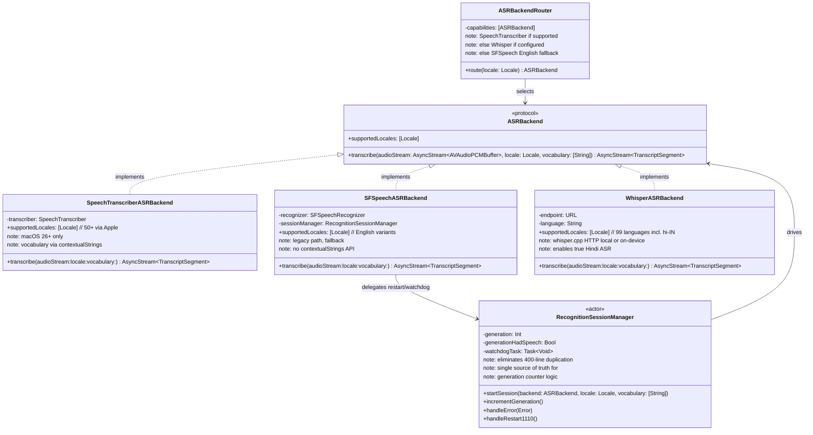
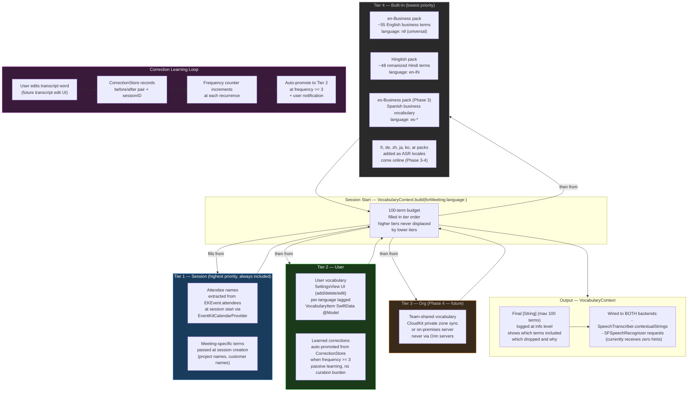
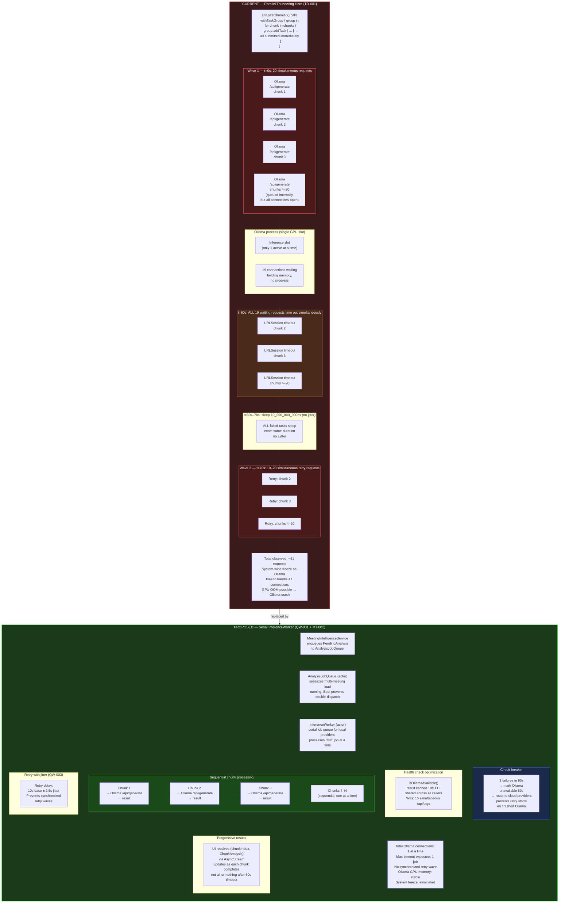

# Proposed Architecture — Orin V1 (Post-Patching)

> Generated: 2026-06-29  
> Based on: 9-agent architectural review synthesis  
> Verdict: NEEDS\_PATCHING (not a rewrite)  
> Phases covered: Phase 1 Quick Wins → Phase 2 Medium-Term Redesigns → Phase 3 Protocol Introduction

---

## Diagram 1 — OrinCore Module Boundary and Component Architecture

What is inside the `OrinCore` module boundary versus what lives in platform-specific adapters. The OrinCore extraction is a Phase 3 (months 4–6) goal; the internal component structure described here is the Phase 2 target state.

```mermaid
graph TB
    subgraph OrinCore["OrinCore (Swift Package — zero macOS-specific imports)"]
        direction TB

        subgraph InferencePipeline["Inference Pipeline"]
            IW["InferenceWorker\n(actor)\nSerial queue for local,\nbounded semaphore N=3 for cloud"]
            AJQ["AnalysisJobQueue\n(actor)\nSerializes multi-meeting jobs,\npriority: userInitiated > automatic"]
            MR["ModelRouter\n(protocol)\nLocalFirstRouter /\nCloudOnlyRouter /\nSpecializedRouter"]
            IP["InferenceProvider\n(protocol)\nfunc infer(job:) async throws\n→ InferenceResult"]
            IJob["InferenceJob\n(struct)\nprompt, systemPrompt,\nmaxTokens, priority,\nproviderHint"]

            IW -->|"selects via"| MR
            MR -->|"routes to"| IP
            AJQ -->|"feeds"| IW
            IW -->|"builds"| IJob
        end

        subgraph AIServices["AI Services"]
            MIS["MeetingIntelligenceService\nanalyzeChunked() submits to AJQ\nreceives AsyncStream<ChunkResult>\nprogressive synthesis"]
            AIS["AIService\n(job builder only — no networking)\nassembles InferenceJob\nfrom prompt parameters"]
            MIS -->|"enqueues jobs via"| AJQ
            MIS -->|"delegates prompt building to"| AIS
        end

        subgraph VocabSystem["Vocabulary System"]
            VC["VocabularyContext\n(struct)\nbuild(forMeeting:language:)\nfills 100-term budget\nby priority tier"]
            VI["VocabularyItem\n(@Model — SwiftData)\nid, term, languageCode,\nsource, frequency, lastUsedAt"]
            CS["CorrectionStore\n(@Model — SwiftData)\noriginal, corrected, frequency\nauto-promotes at freq >= 3"]

            subgraph VocabTiers["Four-Tier Priority (highest → lowest)"]
                T1["Tier 1 — Session\nEKEvent attendee names\nalways included first"]
                T2["Tier 2 — User\nSettingsView-managed,\nper-language tagged"]
                T3["Tier 3 — Org (future)\nTeam-sync via CloudKit\nprivate zone"]
                T4["Tier 4 — Built-In\nLanguage-partitioned packs\nen-Business, Hinglish,\nes-Business, etc."]
                T1 --> T2 --> T3 --> T4
            end

            VC -->|"reads from"| VI
            VC -->|"reads corrections from"| CS
            VC -->|"applies tier ordering"| VocabTiers
        end

        subgraph CoreModels["Core Models"]
            MI["MeetingItem\n(@Model)\n+ detectedLanguage: String?\n+ pendingAnalysis: Bool\n+ structuredActionItems: JSON\n+ effectiveActionItemCount: Int"]
            TC["TranscriptChunk\n(@Model)\ncrash-recovery only\npruned after finalize()"]
            TS["TranscriptSegment\n(@Model)\n@Attribute(.externalStorage)\nfor large text columns"]
        end

        subgraph Persistence["Persistence (protocol-abstracted)"]
            PS["PersistenceStore\n(protocol)\nsave/fetch/update/delete meeting"]
            SDS["SwiftDataStore\n(implementation)\ncurrent production store"]
            PS -->|"implemented by"| SDS
        end

    end

    subgraph OrinMacOS["OrinMacOS (Platform Adapters)"]
        direction TB

        subgraph ASRLayer["ASR Layer"]
            ASRBk["ASRBackend\n(protocol)\nsupportedLocales: [Locale]\ntranscribe(audioStream:locale:vocabulary:)\n→ AsyncStream<TranscriptSegment>"]
            STB["SpeechTranscriberASRBackend\nmacOS 26+ SpeechTranscriber\n50+ locales\n(MT-007)"]
            SFB["SFSpeechASRBackend\nlegacy SFSpeechRecognizer\nEnglish variants\nfallback path"]
            WB["WhisperASRBackend\nwhisper.cpp HTTP\n99 languages incl. hi-IN\ngates on user preference"]
            ASRRouter["ASRBackendRouter\nselects best backend\nper channel per locale\nmic != participant ok"]
            ASRBk -->|"implemented by"| STB
            ASRBk -->|"implemented by"| SFB
            ASRBk -->|"implemented by"| WB
            ASRRouter -->|"selects from"| ASRBk
        end

        subgraph RecognitionLayer["Recognition Layer"]
            RSM["RecognitionSessionManager\n(actor — MT-001)\ngeneration counter\ngenerationHadSpeech flag\nwatchdog Task\nutterance-boundary heuristic\n10s cold-start detection"]
            RS["RecordingService\n(refactored)\nholds one RSM instance\ndelegates all restart/\ngeneration logic"]
            SACS["SystemAudioCaptureService\n(refactored)\nholds one RSM instance\nno more 400-line duplication"]
            RS -->|"delegates to"| RSM
            SACS -->|"delegates to"| RSM
        end

        subgraph AudioLayer["Audio Layer"]
            MTF["MicTranscriberFeed\n(fixed: pre-allocated buffers)\nno heap alloc in I/O callback"]
            PTF["ParticipantSTFeed\n(fixed: pre-allocated buffers)\nno heap alloc in I/O callback"]
            TS2["TapState\n(fixed: disarm() lock ordering)\nendAudio() called outside NSLock\nnot XPC-in-lock)"]
        end

        subgraph InferenceAdapters["Inference Adapters"]
            OLP["OllamaProvider\n(InferenceProvider impl)\nhealth check cached 10s\ncircuit breaker: 3 failures\n→ 60s cooldown"]
            LMSP["LMStudioProvider\n(InferenceProvider impl)"]
            AFM["AppleFoundationModelsProvider\n(InferenceProvider impl)\nmacOS 26+"]
            CLD["CloudProviders\nOpenAIProvider /\nAnthropicProvider /\nGeminiProvider\nbounded semaphore N=3-5"]
        end

        subgraph AppArch["App Architecture"]
            RSC["RecordingSessionCoordinator\n(@Observable — MT-006)\nstartSession / stopSession\nauto-stop grace period\npost-recording trigger\nextracted from MainContainerView"]
            MAC["MeetingAnalysisCoordinator\n(extracted from MeetingDetailView)\norchestrates analysis flow\nprogressive UI updates"]
            SC["ServiceContainer\n(fixed: NSLock added\nno fatalError on missing keys\nno resolve() from audio callbacks)"]
        end

        subgraph ViewLayer["View Layer (MT-003 split)"]
            MV["MeetingsView.swift\n~350 lines\nlist panel + folder panel"]
            MDV["MeetingDetailView.swift\n~450 lines\ndetail panel + recording card"]
            FDV["FolderDetailView.swift\n~200 lines"]
            MRV["MeetingRowViews.swift\n~300 lines\nrow components"]
            MIC["MeetingInsightComponents.swift\n~400 lines\nInsightCard, ActionItemCard"]
        end

    end

    %% Cross-boundary connections
    RS -->|"uses"| ASRRouter
    SACS -->|"uses"| ASRRouter
    MIS -->|"reads transcript from"| TC
    AIS -->|"injects vocab via"| VC
    IP -->|"implemented by (macOS)"| OLP
    IP -->|"implemented by (macOS)"| LMSP
    IP -->|"implemented by (macOS)"| AFM
    IP -->|"implemented by (macOS)"| CLD
    RSC -->|"coordinates"| RS
    RSC -->|"coordinates"| SACS
    RSC -->|"triggers"| AJQ
    MAC -->|"enqueues to"| AJQ
    PS -->|"stores"| MI
    PS -->|"stores"| TC
    PS -->|"stores"| TS

    style OrinCore fill:#1a3a5c,stroke:#4a9eff,color:#ffffff
    style OrinMacOS fill:#1a3c1a,stroke:#4aff4a,color:#ffffff
    style InferencePipeline fill:#2a1a4a,stroke:#aa77ff,color:#ffffff
    style ASRLayer fill:#1a3a2a,stroke:#77ffaa,color:#ffffff
    style VocabTiers fill:#3a2a1a,stroke:#ffaa44,color:#ffffff
```



---

## Diagram 2 — ASRBackend Protocol Hierarchy



---

## Diagram 3 — InferenceWorker + AnalysisJobQueue + InferenceProvider Architecture

```mermaid
classDiagram
    class InferenceWorker {
        <<actor>>
        -localQueue: [InferenceJob]
        -cloudSemaphore: AsyncSemaphore // limit: 3
        -isProcessing: Bool
        -ollamaHealthCache: (result: Bool, expires: Date)
        -consecutiveFailures: Int
        -circuitBreakerCooldown: Date?
        +currentLoad: InferenceLoad // idle | working | overloaded
        +enqueue(job: InferenceJob) AsyncStream~InferenceResult~
        -processNext()
        -routeJob(job: InferenceJob) InferenceProvider
        note: serial for local providers
        note: bounded parallel for cloud
        note: health check cached 10s
        note: circuit breaker after 3 failures
    }

    class AnalysisJobQueue {
        <<actor>>
        -queue: [PendingAnalysis]
        -running: Bool
        +currentDepth: Int // @Observable
        +enqueue(analysis: PendingAnalysis)
        -startNext()
        note: prevents double-Ollama load
        note: when two meetings end together
        note: userInitiated priority jumps queue
    }

    class PendingAnalysis {
        +meetingID: UUID
        +chunks: [TranscriptChunk]
        +priority: AnalysisPriority
    }

    class AnalysisPriority {
        <<enum>>
        userInitiated
        automatic
    }

    class InferenceJob {
        +prompt: String
        +systemPrompt: String
        +maxTokens: Int
        +priority: JobPriority
        +providerHint: ProviderHint?
    }

    class InferenceLoad {
        <<enum>>
        idle
        working(chunkIndex: Int, total: Int)
        overloaded
    }

    class InferenceResult {
        +text: String
        +chunkIndex: Int?
        +tokensUsed: Int
        +provider: String
        +latencyMs: Int
    }

    class ModelRouter {
        <<protocol>>
        +route(job: InferenceJob) InferenceProvider
    }

    class LocalFirstRouter {
        +route(job: InferenceJob) InferenceProvider
        note: tries Ollama/LM Studio
        note: falls back to cloud
    }

    class CloudOnlyRouter {
        +route(job: InferenceJob) InferenceProvider
    }

    class SpecializedRouter {
        +route(job: InferenceJob) InferenceProvider
        note: large model for analysis
        note: small model for summaries
    }

    class InferenceProvider {
        <<protocol>>
        +infer(job: InferenceJob) async throws InferenceResult
        +isAvailable() async Bool
    }

    class OllamaProvider {
        -modelID: String // from UserDefaults, not hardcoded
        -baseURL: URL
        +infer(job: InferenceJob) async throws InferenceResult
        +isAvailable() async Bool // result cached by InferenceWorker
        note: phi3 / mistral / llama3
        note: model ID configurable at runtime
    }

    class LMStudioProvider {
        +infer(job: InferenceJob) async throws InferenceResult
        +isAvailable() async Bool
    }

    class AppleFoundationModelsProvider {
        +infer(job: InferenceJob) async throws InferenceResult
        +isAvailable() async Bool
        note: macOS 26+ only
    }

    class OpenAIProvider {
        +infer(job: InferenceJob) async throws InferenceResult
        +isAvailable() async Bool
    }

    class AnthropicProvider {
        +infer(job: InferenceJob) async throws InferenceResult
        +isAvailable() async Bool
    }

    AnalysisJobQueue --> InferenceWorker : feeds jobs
    InferenceWorker --> ModelRouter : routes via
    ModelRouter <|.. LocalFirstRouter : implements
    ModelRouter <|.. CloudOnlyRouter : implements
    ModelRouter <|.. SpecializedRouter : implements
    InferenceWorker --> InferenceProvider : calls
    InferenceProvider <|.. OllamaProvider : implements
    InferenceProvider <|.. LMStudioProvider : implements
    InferenceProvider <|.. AppleFoundationModelsProvider : implements
    InferenceProvider <|.. OpenAIProvider : implements
    InferenceProvider <|.. AnthropicProvider : implements
    InferenceWorker --> InferenceLoad : exposes
    AnalysisJobQueue --> PendingAnalysis : queues
    PendingAnalysis --> AnalysisPriority : has
    InferenceWorker --> InferenceJob : processes
    InferenceWorker --> InferenceResult : returns
```



---

## Diagram 4 — VocabularyContext Four-Tier System



---

## Diagram 5 — Proposed Meeting Lifecycle (Sequence)

The proposed lifecycle introduces explicit signals at each phase boundary, sequential inference via InferenceWorker, and progressive result delivery to the UI as each chunk completes.

```mermaid
sequenceDiagram
    actor User
    participant MCV as MainContainerView
    participant RSC as RecordingSessionCoordinator
    participant RSM as RecognitionSessionManager
    participant ASR as ASRBackendRouter
    participant TS as TranscriptStore
    participant AJQ as AnalysisJobQueue
    participant IW as InferenceWorker
    participant MIS as MeetingIntelligenceService
    participant UI as MeetingDetailView

    Note over User,UI: PHASE 1 — Session Start (explicit signal)

    User->>MCV: Tap "Start Recording"
    MCV->>RSC: startSession(meeting:)
    RSC->>RSC: build VocabularyContext (4-tier)
    RSC->>ASR: selectBackend(locale:, vocabulary:)
    ASR-->>RSC: SpeechTranscriberASRBackend (or fallback)
    RSC->>RSM: startSession(backend:, locale:, vocabulary:)
    RSM->>RSM: reset generation counter = 0
    RSM->>RSM: arm 10s cold-start watchdog
    RSM->>ASR: transcribe(audioStream:locale:vocabulary:)
    RSC->>TS: beginSession(meetingID:)
    Note over RSC,TS: Explicit session boundary — no implicit start

    Note over User,UI: PHASE 2 — Recording (progressive persistence)

    loop Every 3 seconds (checkpoint cycle)
        ASR-->>RSM: AsyncStream<TranscriptSegment>
        RSM->>TS: saveChunks(batch:) // batched, not per-char
        TS->>TS: single context.save() per checkpoint
        Note over TS: Was: save() per 10-char growth (O(N^2))
    end

    Note over User,UI: PHASE 3 — Stop (explicit signal)

    User->>MCV: Tap "Stop"
    MCV->>RSC: stopSession()
    RSC->>RSM: endSession()
    RSM->>RSM: cancel watchdog
    RSM->>ASR: endAudio() // OUTSIDE any NSLock
    Note over RSM,ASR: Was: endAudio() inside NSLock = XPC deadlock
    RSM-->>RSC: sessionEnded(finalTranscript:)
    RSC->>TS: finalize(meetingID:)
    TS->>TS: buildTimelineSegments() with meetingID predicate
    TS->>TS: prune TranscriptChunks after success
    Note over TS: Was: full-table scan; chunks never deleted
    RSC->>AJQ: enqueue(PendingAnalysis, priority: .automatic)

    Note over User,UI: PHASE 4 — Sequential Inference (no thundering herd)

    AJQ->>AJQ: check running flag
    AJQ->>IW: dequeue and process
    IW->>IW: check circuit breaker
    IW->>IW: check health cache (10s TTL)
    Note over IW: Was: 16 simultaneous /api/tags calls

    loop For each chunk sequentially (not parallel)
        IW->>MIS: infer(job: chunk_N)
        MIS-->>IW: ChunkAnalysis result
        IW-->>AJQ: AsyncStream<(chunkIndex, ChunkAnalysis)>
        AJQ-->>UI: progressive result — UI updates immediately
        Note over IW: Was: 20 parallel /api/generate = timeout cascade
    end

    MIS->>MIS: synthesize(allChunkResults)
    MIS->>TS: persistAnalysis(meeting:)
    AJQ->>AJQ: set running = false; start next if queued
    AJQ-->>UI: analysisComplete(meetingID:)
    UI->>UI: refresh MeetingDetailView with final results

    Note over User,UI: PHASE 5 — User Reviews (no allSegments @Query)
    User->>UI: Open meeting
    UI->>TS: fetchSegments(meetingID: predicate)
    Note over UI,TS: Was: allSegments @Query loads ALL meetings
    TS-->>UI: [TranscriptSegment] for this meeting only
```

---

## Diagram 6 — Current AI Pipeline vs Proposed (Thundering Herd Elimination)



---

## Diagram 7 — Platform Abstraction Layers (Cross-Platform Foundation)

Shows how OrinCore protocols enable future Windows and iOS builds without touching business logic.

```mermaid
graph TB
    subgraph Protocols["Protocol Layer (defined in OrinCore)"]
        AP["AudioCaptureProvider\nAsyncStream<AudioBuffer>\nAudioCaptureConfiguration"]
        ASRP["ASRBackend\nsupportedLocales\ntranscribe(audioStream:locale:vocabulary:)"]
        IPP["InferenceProvider\ninfer(job: InferenceJob)\nisAvailable()"]
        MDP["MeetingDetector\nsupportedSignals\ndetectMeeting() async"]
        PSP["PersistenceStore\nsave/fetch/update/delete meeting"]
    end

    subgraph MacOS["OrinMacOS (current, Phase 3+)"]
        SCA["SCKitAudioCaptureAdapter\nSCStream system audio\nCoreAudio mic"]
        STAB["SpeechTranscriberASRAdapter\nApple SpeechTranscriber macOS 26+\nor SFSpeechRecognizer legacy"]
        OIP["OllamaProvider /\nLMStudioProvider /\nAppleFoundationModelsProvider"]
        MDS["MeetingDetectorService\nSCKit + AppleScript browser\nCalendarKit + Accessibility"]
        SDSP["SwiftDataPersistenceAdapter\ncurrent production store"]
    end

    subgraph Windows["OrinWindows (Phase 3 POC — months 7-9)"]
        WASAPI["WASAPIAudioCaptureAdapter\nWindows Audio Session API"]
        WSTT["WindowsSTTASRAdapter\nSpeech Recognition API or\nWhisperASRAdapter (cross-platform)"]
        OIP2["OllamaProvider (shared)\nLMStudioProvider (shared)\nWindowsMLProvider (WinML)"]
        WMDS["WinRTBrowserDetectionAdapter\nOutlook COM CalendarAdapter\nWindows Session Notification"]
        GRDBS["GRDBPersistenceAdapter\nSQLite via GRDB\n(SwiftData not available)"]
    end

    subgraph iOS["OrinIOS (Phase 4 — month 18+)"]
        AVAP["AVAudioSessionMicAdapter\nno system audio (iOS sandbox)"]
        CALLK["WhisperASRAdapter or\nSFSpeechRecognizer iOS"]
        COREI["CoreMLInferenceAdapter\nor CloudProvider fallback"]
        CKMD["CallKitMeetingDetectionAdapter"]
        CDSP["CoreDataPersistenceAdapter\nor SwiftData iOS 17+"]
    end

    AP -->|"implemented by"| SCA
    AP -->|"implemented by"| WASAPI
    AP -->|"implemented by"| AVAP
    ASRP -->|"implemented by"| STAB
    ASRP -->|"implemented by"| WSTT
    ASRP -->|"implemented by"| CALLK
    IPP -->|"implemented by"| OIP
    IPP -->|"implemented by"| OIP2
    IPP -->|"implemented by"| COREI
    MDP -->|"implemented by"| MDS
    MDP -->|"implemented by"| WMDS
    MDP -->|"implemented by"| CKMD
    PSP -->|"implemented by"| SDSP
    PSP -->|"implemented by"| GRDBS
    PSP -->|"implemented by"| CDSP

    style Protocols fill:#1a1a4a,stroke:#7777ff,color:#ffffff
    style MacOS fill:#1a3a1a,stroke:#44ff44,color:#ffffff
    style Windows fill:#2a2a1a,stroke:#ffff44,color:#cccccc
    style iOS fill:#1a2a3a,stroke:#44aaff,color:#cccccc
```



---

## Summary — What Changes Where

| Component | Current State | Proposed State | Phase |
|---|---|---|---|
| `analyzeChunked()` | `withTaskGroup` unbounded parallel (41 requests) | Serial `InferenceWorker` actor | Phase 1 QW-001 |
| Ollama health check | 16 simultaneous `/api/tags` calls | 10s cached result shared | Phase 1 QW-002 |
| Retry delay | 10s exact, no jitter | 10s ± 2.5s jitter | Phase 1 QW-003 |
| `TapState.disarm()` | `endAudio()` inside `NSLock` (XPC deadlock) | `endAudio()` outside lock | Phase 1 QW-004 |
| `ServiceContainer` | No lock, `fatalError` on missing key | `NSLock` added, safe fallback | Phase 1 QW-005 |
| Audio callbacks | Heap alloc per I/O callback (~46/s) | Pre-allocated buffer pool | Phase 1 QW-002 |
| SwiftData writes | `context.save()` per 10-char growth | Batched 3s checkpoint cycle | Phase 1 QW-008 |
| `RecognitionSessionManager` | 400 lines duplicated in 2 files | Shared actor, single source of truth | Phase 2 MT-001 |
| `InferenceWorker` + `AnalysisJobQueue` | Not present | New actors, serial local inference | Phase 2 MT-002 |
| `MeetingsView.swift` | 2281 lines, 1 file | Split into 5+ files | Phase 2 MT-003 |
| Vocabulary system | 103 hardcoded terms, `.prefix(100)` silent drop | 4-tier `VocabularyContext`, SwiftData | Phase 2 MT-004 |
| `ASRBackend` protocol | Not present | Protocol + 3 implementations | Phase 3 MT-007 |
| `OrinCore` module | All code in one target | Extracted Swift Package | Phase 3 |
| `WhisperASRBackend` | Stub | Full 99-language implementation | Phase 3 |
| Windows POC | N/A | OrinCore + GRDB + WASAPI | Phase 3 month 7-9 |
| iOS / Android | N/A | Phase 4 month 18+ | Phase 4 |

> See `01-current-architecture.md` for the current-state diagrams and root cause mapping.  
> See `../findings/` for per-subsystem verdict writeups.
