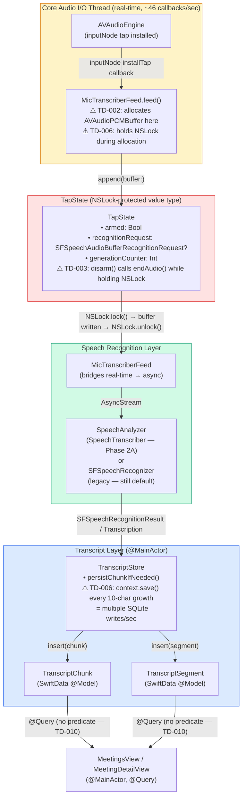
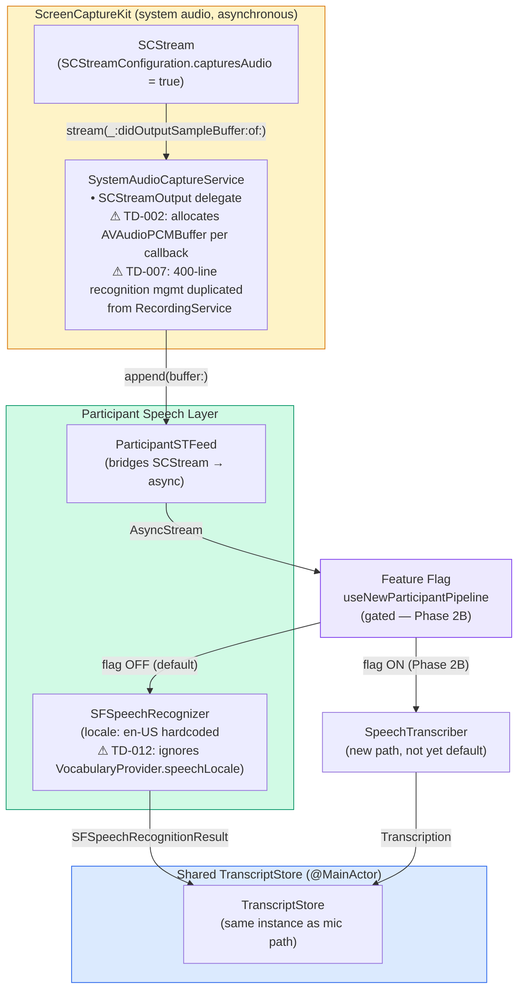
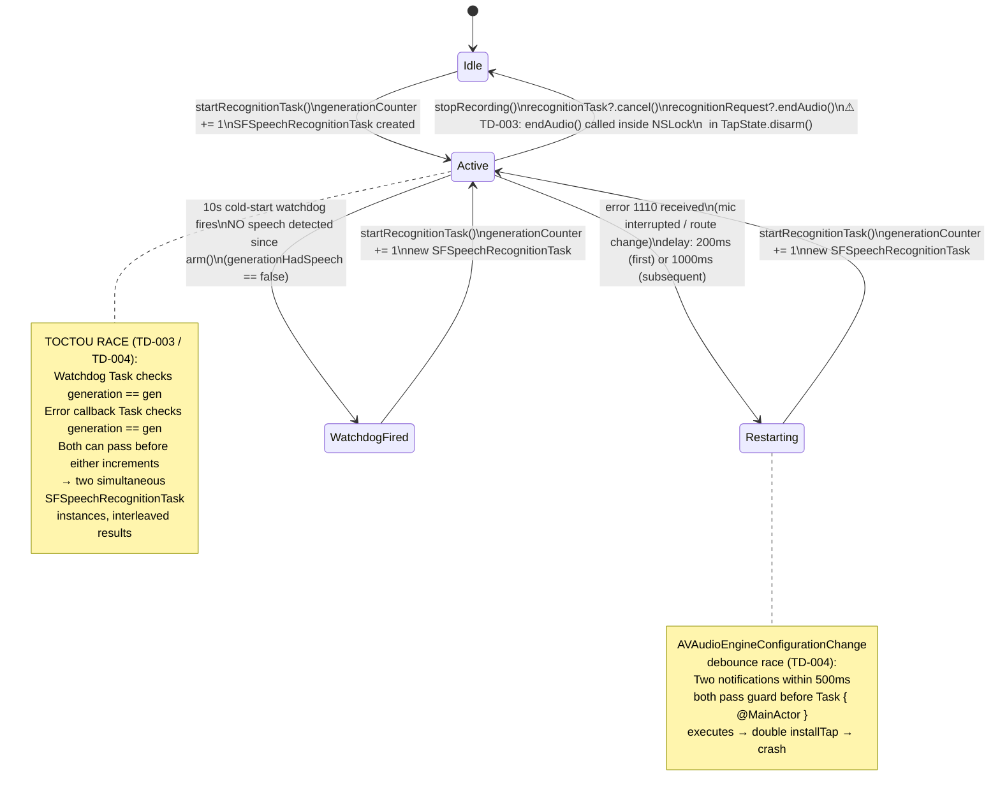
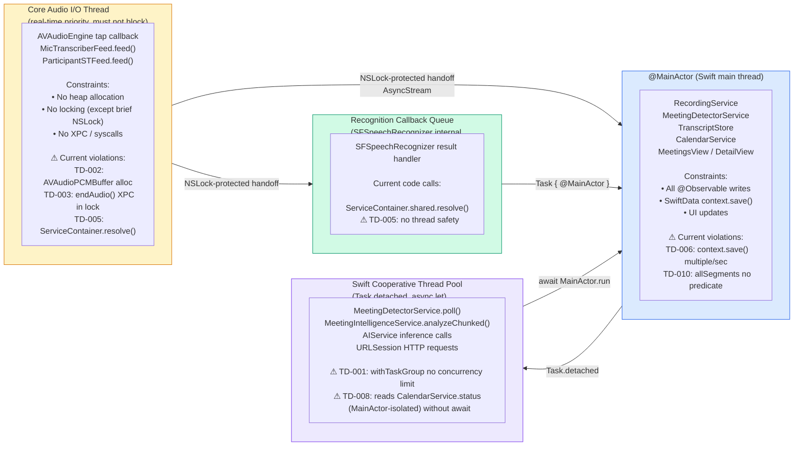

# Audio Pipeline Diagrams

## 1. Complete Mic Audio Pipeline

```mermaid
flowchart TD
    subgraph CoreAudio["Core Audio I/O Thread (real-time, ~46 callbacks/sec)"]
        AE["AVAudioEngine\n(inputNode tap installed)"]
        FEED["MicTranscriberFeed.feed()\n⚠ TD-002: allocates AVAudioPCMBuffer here\n⚠ TD-006: holds NSLock during allocation"]
    end

    subgraph TapStateBlock["TapState (NSLock-protected value type)"]
        TS["TapState\n• armed: Bool\n• recognitionRequest: SFSpeechAudioBufferRecognitionRequest?\n• generationCounter: Int\n⚠ TD-003: disarm() calls endAudio() while holding NSLock"]
    end

    subgraph SpeechLayer["Speech Recognition Layer"]
        direction TB
        MTFEED["MicTranscriberFeed\n(bridges real-time → async)"]
        ST["SpeechAnalyzer\n(SpeechTranscriber — Phase 2A)\nor\nSFSpeechRecognizer\n(legacy — still default)"]
    end

    subgraph TranscriptLayer["Transcript Layer (@MainActor)"]
        direction TB
        TS2["TranscriptStore\n• persistChunkIfNeeded()\n⚠ TD-006: context.save() every 10-char growth\n  = multiple SQLite writes/sec"]
        TC["TranscriptChunk\n(SwiftData @Model)"]
        SEG["TranscriptSegment\n(SwiftData @Model)"]
    end

    UI["MeetingsView / MeetingDetailView\n(@MainActor, @Query)"]

    AE -->|"inputNode installTap callback"| FEED
    FEED -->|"append(buffer:)"| TS
    TS -->|"NSLock.lock() → buffer written → NSLock.unlock()"| MTFEED
    MTFEED -->|"AsyncStream<AVAudioPCMBuffer>"| ST
    ST -->|"SFSpeechRecognitionResult / Transcription"| TS2
    TS2 -->|"insert(chunk)"| TC
    TS2 -->|"insert(segment)"| SEG
    TC -->|"@Query (no predicate — TD-010)"| UI
    SEG -->|"@Query (no predicate — TD-010)"| UI

    style CoreAudio fill:#fef3c7,stroke:#d97706
    style TapStateBlock fill:#fee2e2,stroke:#dc2626
    style TranscriptLayer fill:#dbeafe,stroke:#2563eb
    style SpeechLayer fill:#d1fae5,stroke:#059669
```

---

## 2. Parallel System Audio Path (Participant Channel)

```mermaid
flowchart TD
    subgraph SCKitLayer["ScreenCaptureKit (system audio, asynchronous)"]
        SC["SCStream\n(SCStreamConfiguration.capturesAudio = true)"]
        SACS["SystemAudioCaptureService\n• SCStreamOutput delegate\n⚠ TD-002: allocates AVAudioPCMBuffer per callback\n⚠ TD-007: 400-line recognition mgmt duplicated\n  from RecordingService"]
    end

    subgraph ParticipantSpeech["Participant Speech Layer"]
        PST["ParticipantSTFeed\n(bridges SCStream → async)"]
        SFSR["SFSpeechRecognizer\n(locale: en-US hardcoded\n⚠ TD-012: ignores VocabularyProvider.speechLocale)"]
    end

    subgraph SharedTranscript["Shared TranscriptStore (@MainActor)"]
        TS["TranscriptStore\n(same instance as mic path)"]
    end

    FF["Feature Flag\nuseNewParticipantPipeline\n(gated — Phase 2B)"]

    SC -->|"stream(_:didOutputSampleBuffer:of:)"| SACS
    SACS -->|"append(buffer:)"| PST
    PST -->|"AsyncStream<AVAudioPCMBuffer>"| FF
    FF -->|"flag OFF (default)"| SFSR
    FF -->|"flag ON (Phase 2B)"| SpeechTranscriber["SpeechTranscriber\n(new path, not yet default)"]
    SFSR -->|"SFSpeechRecognitionResult"| TS
    SpeechTranscriber -->|"Transcription"| TS

    style SCKitLayer fill:#fef3c7,stroke:#d97706
    style ParticipantSpeech fill:#d1fae5,stroke:#059669
    style SharedTranscript fill:#dbeafe,stroke:#2563eb
    style FF fill:#ede9fe,stroke:#7c3aed
```

---

## 3. Generation Counter State Machine

```mermaid
stateDiagram-v2
    [*] --> Idle

    Idle --> Active : startRecognitionTask()\ngenerationCounter += 1\nSFSpeechRecognitionTask created

    Active --> Restarting : error 1110 received\n(mic interrupted / route change)\ndelay: 200ms (first) or 1000ms (subsequent)

    Active --> WatchdogFired : 10s cold-start watchdog fires\nNO speech detected since arm()\n(generationHadSpeech == false)

    Restarting --> Active : startRecognitionTask()\ngenerationCounter += 1\nnew SFSpeechRecognitionTask

    WatchdogFired --> Active : startRecognitionTask()\ngenerationCounter += 1\nnew SFSpeechRecognitionTask

    Active --> Idle : stopRecording()\nrecognitionTask?.cancel()\nrecognitionRequest?.endAudio()\n⚠ TD-003: endAudio() called inside NSLock\n  in TapState.disarm()

    note right of Active
        TOCTOU RACE (TD-003 / TD-004):
        Watchdog Task checks generation == gen
        Error callback Task checks generation == gen
        Both can pass before either increments
        → two simultaneous SFSpeechRecognitionTask
        instances, interleaved results
    end note

    note right of Restarting
        AVAudioEngineConfigurationChange
        debounce race (TD-004):
        Two notifications within 500ms
        both pass guard before Task { @MainActor }
        executes → double installTap → crash
    end note
```

---

## 4. Thread Model

```mermaid
flowchart LR
    subgraph RT["Core Audio I/O Thread\n(real-time priority, must not block)"]
        AECb["AVAudioEngine tap callback\nMicTranscriberFeed.feed()\nParticipantSTFeed.feed()\n\nConstraints:\n• No heap allocation\n• No locking (except brief NSLock)\n• No XPC / syscalls\n\n⚠ Current violations:\n  TD-002: AVAudioPCMBuffer alloc\n  TD-003: endAudio() XPC in lock\n  TD-005: ServiceContainer.resolve()"]
    end

    subgraph MA["@MainActor (Swift main thread)"]
        RS["RecordingService\nMeetingDetectorService\nTranscriptStore\nCalendarService\nMeetingsView / DetailView\n\nConstraints:\n• All @Observable writes\n• SwiftData context.save()\n• UI updates\n\n⚠ Current violations:\n  TD-006: context.save() multiple/sec\n  TD-010: allSegments no predicate"]
    end

    subgraph RCQ["Recognition Callback Queue\n(SFSpeechRecognizer internal,\nnot main, not real-time)"]
        SFCb["SFSpeechRecognizer result handler\n\nCurrent code calls:\n  ServiceContainer.shared.resolve()\n  ⚠ TD-005: no thread safety"]
    end

    subgraph CP["Swift Cooperative Thread Pool\n(Task.detached, async let)"]
        MDS["MeetingDetectorService.poll()\nMeetingIntelligenceService.analyzeChunked()\nAIService inference calls\nURLSession HTTP requests\n\n⚠ TD-001: withTaskGroup no concurrency limit\n⚠ TD-008: reads CalendarService.status\n  (MainActor-isolated) without await"]
    end

    RT -->|"NSLock-protected handoff\nAsyncStream<AVAudioPCMBuffer>"| MA
    RT -->|"NSLock-protected handoff"| RCQ
    RCQ -->|"Task { @MainActor }"| MA
    MA -->|"Task.detached"| CP
    CP -->|"await MainActor.run"| MA

    style RT fill:#fef3c7,stroke:#d97706
    style MA fill:#dbeafe,stroke:#2563eb
    style RCQ fill:#d1fae5,stroke:#059669
    style CP fill:#ede9fe,stroke:#7c3aed
```
