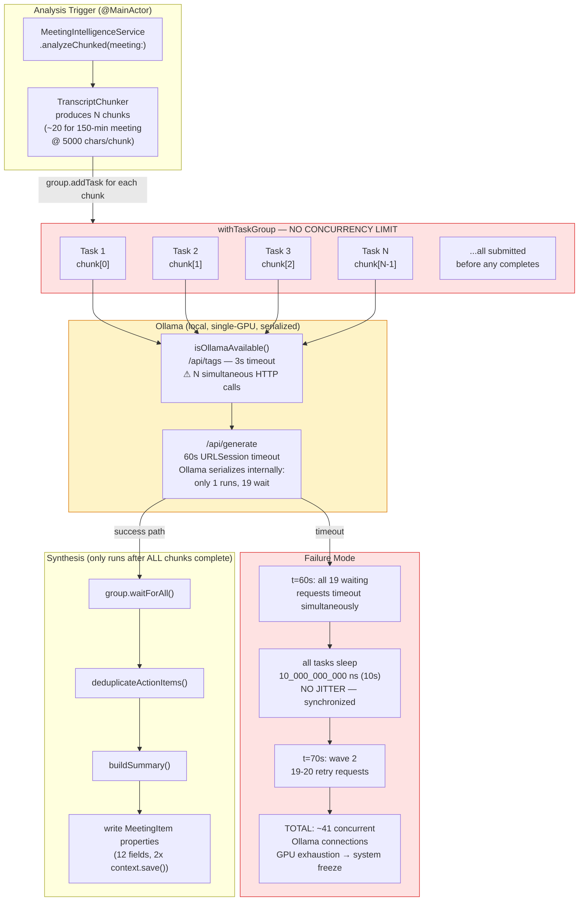
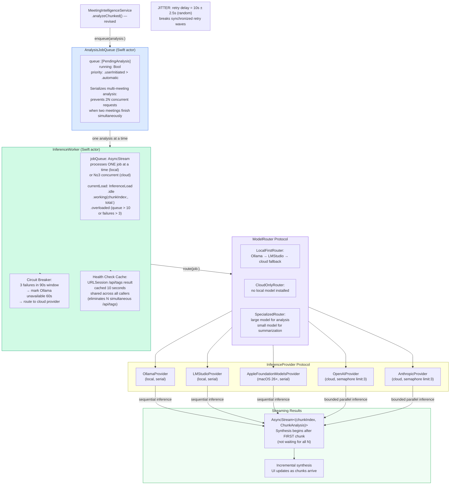
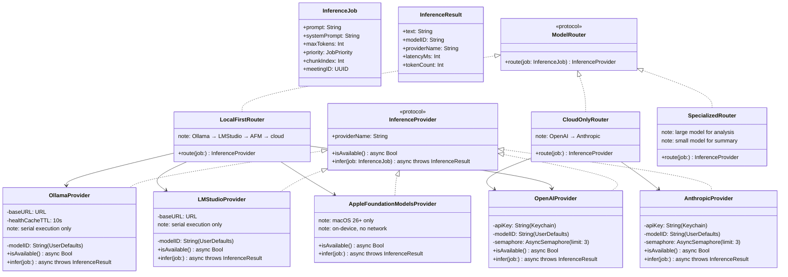
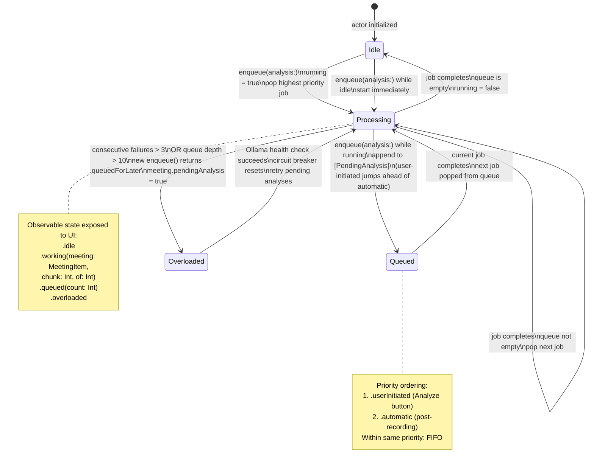

# AI Pipeline Diagrams

## 1. Current AI Pipeline (Thundering Herd — TD-001)

---

## 2. 41-Request Failure Mode Timeline

```mermaid
gantt
    title Thundering Herd: 41 Concurrent Ollama Requests (150-min meeting, 20 chunks)
    dateFormat  s
    axisFormat  t=%Ss

    section Wave 1 (20 requests)
    /api/tags ×20 simultaneous          :crit, hc1, 0, 3s
    chunk[0] inference (runs on GPU)    :active, c0, 3, 60s
    chunk[1-19] waiting in Ollama queue :crit, wait1, 3, 60s
    All 19 waiting → URLSession timeout :milestone, crit, to1, 63, 0s

    section Synchronized Sleep (no jitter)
    All 19 tasks sleep 10s (exact)      :sleep, 63, 10s

    section Wave 2 (19-20 retry requests)
    /api/tags ×19 simultaneous          :crit, hc2, 73, 3s
    chunk[1-19] retry inference         :crit, retry, 76, 60s
    Wave 2 timeout                      :milestone, crit, to2, 136, 0s

    section System Impact
    GPU saturated / OOM possible        :crit, gpu, 3, 133s
    System-wide frame drops             :crit, frames, 3, 133s
```

---

## 3. Proposed InferenceWorker Sequential Pipeline

---

## 4. InferenceProvider Protocol Hierarchy

---

## 5. AnalysisJobQueue State Machine

