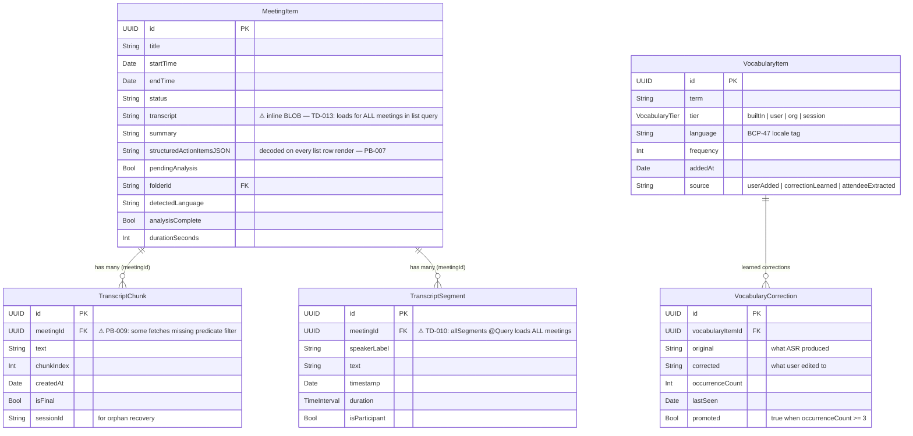
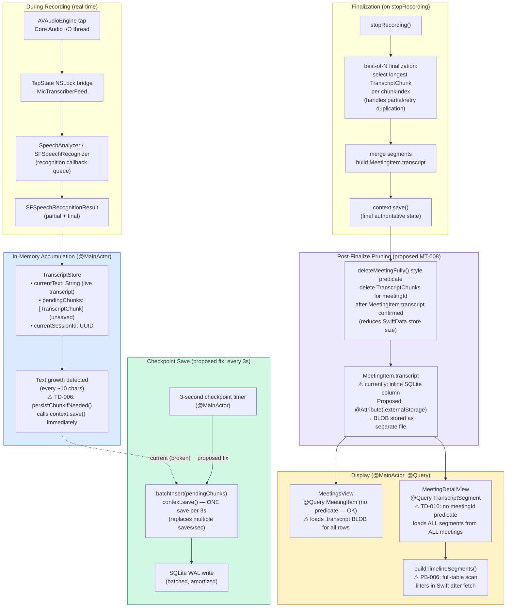
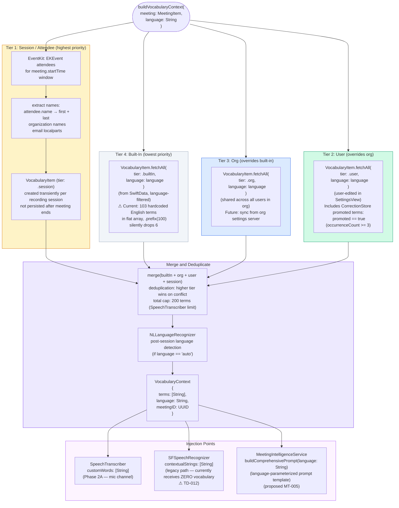

# Data Flow Diagrams

## 1. SwiftData Entity Relationships

```mermaid
erDiagram
    MeetingItem {
        UUID id PK
        String title
        Date startTime
        Date endTime
        String status
        String transcript "⚠ inline BLOB — TD-013: loads for ALL meetings in list query"
        String summary
        String structuredActionItemsJSON "decoded on every list row render — PB-007"
        Bool pendingAnalysis
        String folderId FK
        String detectedLanguage
        Bool analysisComplete
        Int durationSeconds
    }

    TranscriptChunk {
        UUID id PK
        UUID meetingId FK "⚠ PB-009: some fetches missing predicate filter"
        String text
        Int chunkIndex
        Date createdAt
        Bool isFinal
        String sessionId "for orphan recovery"
    }

    TranscriptSegment {
        UUID id PK
        UUID meetingId FK "⚠ TD-010: allSegments @Query loads ALL meetings"
        String speakerLabel
        String text
        Date timestamp
        TimeInterval duration
        Bool isParticipant
    }

    VocabularyItem {
        UUID id PK
        String term
        VocabularyTier tier "builtIn | user | org | session"
        String language "BCP-47 locale tag"
        Int frequency
        Date addedAt
        String source "userAdded | correctionLearned | attendeeExtracted"
    }

    VocabularyCorrection {
        UUID id PK
        UUID vocabularyItemId FK
        String original "what ASR produced"
        String corrected "what user edited to"
        Int occurrenceCount
        Date lastSeen
        Bool promoted "true when occurrenceCount >= 3"
    }

    MeetingItem ||--o{ TranscriptChunk : "has many (meetingId)"
    MeetingItem ||--o{ TranscriptSegment : "has many (meetingId)"
    VocabularyItem ||--o{ VocabularyCorrection : "learned corrections"
```

---

## 2. Data Lifecycle

```mermaid
flowchart TD
    subgraph Recording["During Recording (real-time)"]
        AUDIO["AVAudioEngine tap\nCore Audio I/O thread"]
        BRIDGE["TapState NSLock bridge\nMicTranscriberFeed"]
        ASR["SpeechAnalyzer / SFSpeechRecognizer\n(recognition callback queue)"]
        RESULT["SFSpeechRecognitionResult\n(partial + final)"]
    end

    subgraph InMemory["In-Memory Accumulation (@MainActor)"]
        TS["TranscriptStore\n• currentText: String (live transcript)\n• pendingChunks: [TranscriptChunk] (unsaved)\n• currentSessionId: UUID"]
        GROW["Text growth detected\n(every ~10 chars)\n⚠ TD-006: persistChunkIfNeeded()\ncalls context.save() immediately"]
    end

    subgraph CheckpointSave["Checkpoint Save (proposed fix: every 3s)"]
        TIMER["3-second checkpoint timer\n(@MainActor)"]
        BATCH["batchInsert(pendingChunks)\ncontext.save() — ONE save per 3s\n(replaces multiple saves/sec)"]
        WAL["SQLite WAL write\n(batched, amortized)"]
    end

    subgraph Finalize["Finalization (on stopRecording)"]
        STOP["stopRecording()"]
        BEST["best-of-N finalization:\nselect longest TranscriptChunk\nper chunkIndex\n(handles partial/retry duplication)"]
        MERGE["merge segments\nbuild MeetingItem.transcript"]
        SAVE2["context.save()\n(final authoritative state)"]
    end

    subgraph Prune["Post-Finalize Pruning (proposed MT-008)"]
        PRUNE["deleteMeetingFully() style predicate\ndelete TranscriptChunks for meetingId\nafter MeetingItem.transcript confirmed\n(reduces SwiftData store size)"]
        EXTERNAL["MeetingItem.transcript\n⚠ currently: inline SQLite column\nProposed: @Attribute(.externalStorage)\n→ BLOB stored as separate file"]
    end

    subgraph Display["Display (@MainActor, @Query)"]
        LIST["MeetingsView\n@Query MeetingItem (no predicate — OK)\n⚠ loads .transcript BLOB for all rows"]
        DETAIL["MeetingDetailView\n@Query TranscriptSegment\n⚠ TD-010: no meetingId predicate\nloads ALL segments from ALL meetings"]
        TIMELINE["buildTimelineSegments()\n⚠ PB-006: full-table scan\nfilters in Swift after fetch"]
    end

    AUDIO --> BRIDGE --> ASR --> RESULT --> TS
    TS --> GROW
    GROW -.->|"current (broken)"| BATCH
    TIMER -->|"proposed fix"| BATCH
    BATCH --> WAL

    STOP --> BEST --> MERGE --> SAVE2

    SAVE2 --> PRUNE --> EXTERNAL

    EXTERNAL --> LIST & DETAIL
    DETAIL --> TIMELINE

    style InMemory fill:#dbeafe,stroke:#2563eb
    style CheckpointSave fill:#d1fae5,stroke:#059669
    style Prune fill:#ede9fe,stroke:#7c3aed
    style Display fill:#fef3c7,stroke:#d97706
```

---

## 3. VocabularyContext Four-Tier Build Algorithm

```mermaid
flowchart TD
    START(["buildVocabularyContext(\n  meeting: MeetingItem,\n  language: String\n)"])

    subgraph T4["Tier 4: Built-In (lowest priority)"]
        BUILTIN["VocabularyItem.fetchAll(\n  tier: .builtIn,\n  language: language\n)\n(from SwiftData, language-filtered)\n⚠ Current: 103 hardcoded English terms\n  in flat array, .prefix(100) silently drops 6"]
    end

    subgraph T3["Tier 3: Org (overrides built-in)"]
        ORG["VocabularyItem.fetchAll(\n  tier: .org,\n  language: language\n)\n(shared across all users in org)\nFuture: sync from org settings server"]
    end

    subgraph T2["Tier 2: User (overrides org)"]
        USER["VocabularyItem.fetchAll(\n  tier: .user,\n  language: language\n)\n(user-edited in SettingsView)\nIncludes CorrectionStore promoted terms:\n  promoted == true (occurrenceCount >= 3)"]
    end

    subgraph T1["Tier 1: Session / Attendee (highest priority)"]
        EVENTKIT["EventKit: EKEvent attendees\nfor meeting.startTime window"]
        EXTRACT["extract names:\n  attendee.name → first + last\n  organization names\n  email localparts"]
        SESSION["VocabularyItem (tier: .session)\ncreated transiently per recording session\nnot persisted after meeting ends"]
    end

    subgraph Merge["Merge and Deduplicate"]
        MERGE_STEP["merge(builtIn + org + user + session)\ndeduplication: higher tier wins on conflict\ntotal cap: 200 terms (SpeechTranscriber limit)"]
        DETECT["NLLanguageRecognizer\npost-session language detection\n(if language == 'auto')"]
        FINAL["VocabularyContext\n{\n  terms: [String],\n  language: String,\n  meetingID: UUID\n}"]
    end

    subgraph Inject["Injection Points"]
        ST_INJ["SpeechTranscriber\ncustomWords: [String]\n(Phase 2A — mic channel)"]
        SFSR_INJ["SFSpeechRecognizer\ncontextualStrings: [String]\n(legacy path — currently receives ZERO vocabulary\n⚠ TD-012)"]
        PROMPT_INJ["MeetingIntelligenceService\nbuildComprehensivePrompt(language: String)\n(language-parameterized prompt template)\n(proposed MT-005)"]
    end

    START --> T4 & T3 & T2
    START --> EVENTKIT
    EVENTKIT --> EXTRACT --> SESSION

    T4 --> MERGE_STEP
    T3 --> MERGE_STEP
    T2 --> MERGE_STEP
    SESSION --> MERGE_STEP

    MERGE_STEP --> DETECT --> FINAL

    FINAL --> ST_INJ & SFSR_INJ & PROMPT_INJ

    style T4 fill:#f1f5f9,stroke:#94a3b8
    style T3 fill:#dbeafe,stroke:#2563eb
    style T2 fill:#d1fae5,stroke:#059669
    style T1 fill:#fef3c7,stroke:#d97706
    style Merge fill:#ede9fe,stroke:#7c3aed
    style Inject fill:#fdf4ff,stroke:#a855f7
```

---

## 4. Cross-Platform Data Flow

```mermaid
flowchart TD
    subgraph macOS["macOS (current — all platform-specific)"]
        direction TB
        AVAE["AVAudioEngine\n(mic capture)"]
        SCKIT["SCStream / ScreenCaptureKit\n(system audio capture)"]
        SFSR2["SFSpeechRecognizer\n(ASR — legacy)"]
        ST["SpeechTranscriber\n(ASR — Phase 2A/2B)"]
        SWIFTDATA["SwiftData\n(SQLite on macOS)"]
        EVENTKIT2["EventKit\n(calendar integration)"]
        OLLAMA["Ollama / LM Studio\nApple Foundation Models\n(local LLM inference)"]
    end

    subgraph OrinCore["OrinCore (proposed Swift package — Month 4-6)"]
        direction TB
        ASR_PROTO["ASRBackend protocol\n{\n  func startCapture()\n  func stopCapture()\n  var transcriptStream: AsyncStream\n}"]
        INFER_PROTO["InferenceProvider protocol\n{\n  func infer(job:) async throws\n}"]
        DB_PROTO["DatabaseBackend protocol\n{\n  func save(meeting:)\n  func fetch(predicate:)\n}"]
        CAL_PROTO["CalendarBackend protocol\n{\n  func fetchEvents(in:)\n}"]
        CORE_LOGIC["MeetingIntelligenceService\nTranscriptStore (logic only)\nVocabularyContext\nAnalysisJobQueue\nInferenceWorker\n\n(zero macOS-specific imports)"]
    end

    subgraph Adapters["Platform Adapters"]
        subgraph macOS_Adapter["macOS Adapter"]
            AVAE_A["AVAudioEngineASRBackend\nimplements ASRBackend"]
            SD_A["SwiftDataBackend\nimplements DatabaseBackend"]
            EK_A["EventKitCalendarBackend\nimplements CalendarBackend"]
            OL_A["OllamaInferenceProvider\nimplements InferenceProvider"]
        end

        subgraph Windows_Adapter["Windows Adapter (Month 7-9 POC)"]
            WASAPI["WASAPIASRBackend\nimplements ASRBackend"]
            GRDB["GRDBBackend\nimplements DatabaseBackend"]
            OUTLOOK["OutlookCalendarBackend\nimplements CalendarBackend"]
            LMSTUDIO2["LMStudioInferenceProvider\nimplements InferenceProvider"]
        end

        subgraph iOS_Adapter["iOS Adapter (Month 18+)"]
            IOS_AUDIO["AVAudioSessionASRBackend\nimplements ASRBackend"]
            IOS_SD["SwiftDataBackend (shared)\nimplements DatabaseBackend"]
            IOS_EK["EventKitCalendarBackend (shared)\nimplements CalendarBackend"]
            IOS_AFM["AppleFoundationModelsProvider\nimplements InferenceProvider"]
        end
    end

    subgraph Multilingual["Multilingual Roadmap"]
        EN["en-* variants\n(now — AVAudioEngine +\n SpeechTranscriber)"]
        ES_FR["es / fr / de\n(Month 3 — Apple ST\n supported locales)"]
        ZH_JA["zh / ja / ko\n(Month 6 — Apple ST\n Asian locales)"]
        AR["ar\n(Month 9 — Apple ST\n Arabic)"]
        HI["hi-IN\n(Month 12 — WhisperBackend\n Apple no hi-IN support)"]
    end

    AVAE & SCKIT --> AVAE_A
    SFSR2 & ST --> AVAE_A
    SWIFTDATA --> SD_A
    EVENTKIT2 --> EK_A
    OLLAMA --> OL_A

    AVAE_A --> ASR_PROTO
    SD_A --> DB_PROTO
    EK_A --> CAL_PROTO
    OL_A --> INFER_PROTO

    WASAPI --> ASR_PROTO
    GRDB --> DB_PROTO
    OUTLOOK --> CAL_PROTO
    LMSTUDIO2 --> INFER_PROTO

    IOS_AUDIO --> ASR_PROTO
    IOS_SD --> DB_PROTO
    IOS_EK --> CAL_PROTO
    IOS_AFM --> INFER_PROTO

    ASR_PROTO & INFER_PROTO & DB_PROTO & CAL_PROTO --> CORE_LOGIC

    EN --> ES_FR --> ZH_JA --> AR --> HI

    style macOS fill:#dbeafe,stroke:#2563eb
    style OrinCore fill:#d1fae5,stroke:#059669
    style Adapters fill:#fef3c7,stroke:#d97706
    style Multilingual fill:#ede9fe,stroke:#7c3aed
```
