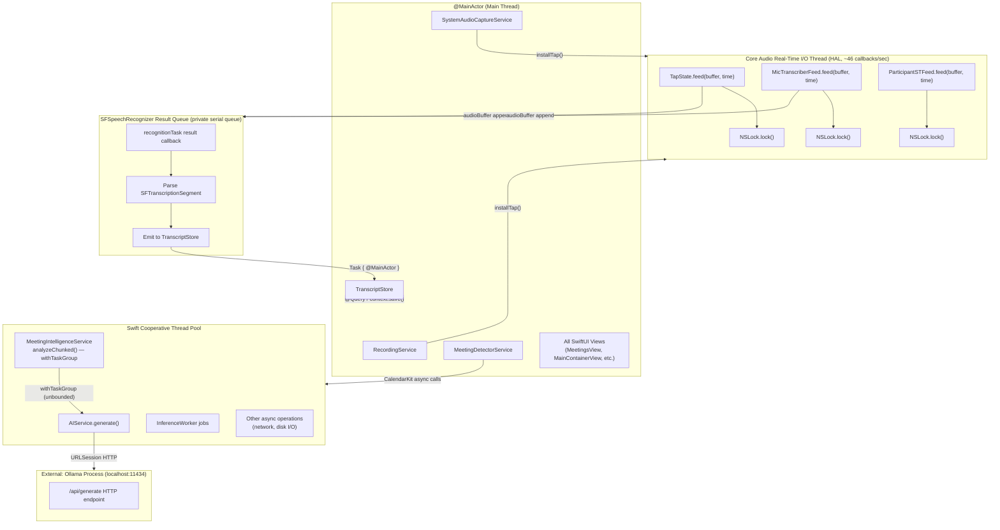
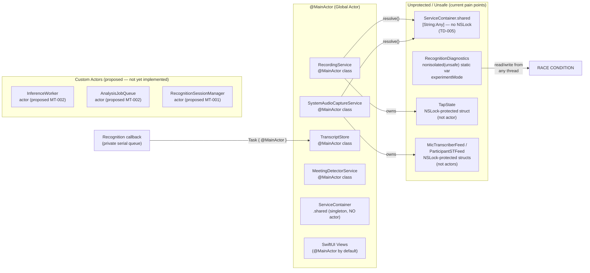
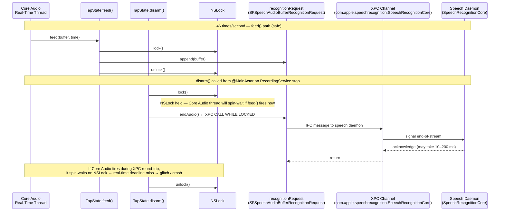
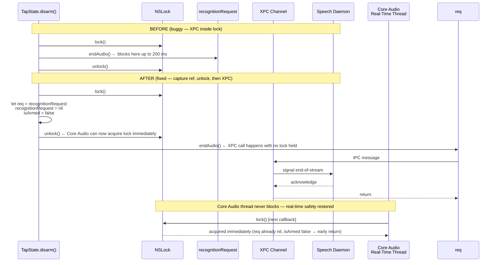

# Thread Model Diagrams

## 1. Complete Thread / Actor Map

## 2. Actor Isolation Map

## 3. XPC-in-Lock Problem: TapState.disarm()

## 4. Proposed Fix: endAudio() Outside NSLock

---

### Thread Safety Reference Table

| Component | Isolation | Thread-safe? | Notes |
|---|---|---|---|
| `RecordingService` | `@MainActor` | Yes | All mutations on main thread |
| `SystemAudioCaptureService` | `@MainActor` | Yes | All mutations on main thread |
| `TranscriptStore` | `@MainActor` | Yes | SwiftData context is main-thread |
| `MeetingDetectorService` | `@MainActor` | Yes | Fixed in commit 4f603ea |
| `TapState` | `NSLock` | Mostly | XPC-in-lock bug (TD-003) |
| `MicTranscriberFeed` | `NSLock` | Mostly | Heap alloc in callback (TD-002) |
| `ParticipantSTFeed` | `NSLock` | Mostly | Heap alloc in callback (TD-002) |
| `ServiceContainer` | None | **No** | No lock, fatalError on missing key (TD-005) |
| `RecognitionDiagnostics.experimentMode` | `nonisolated(unsafe)` | **No** | Static var, any-thread read/write |
| `AIService` | Unstructured `async` | Partial | No actor, no concurrency limit |
| `MeetingIntelligenceService` | Unstructured `async` | **No** | Unbounded `withTaskGroup` (TD-001) |
| Recognition result callback | Private serial queue | Yes | Dispatches to `@MainActor` via `Task {}` |
