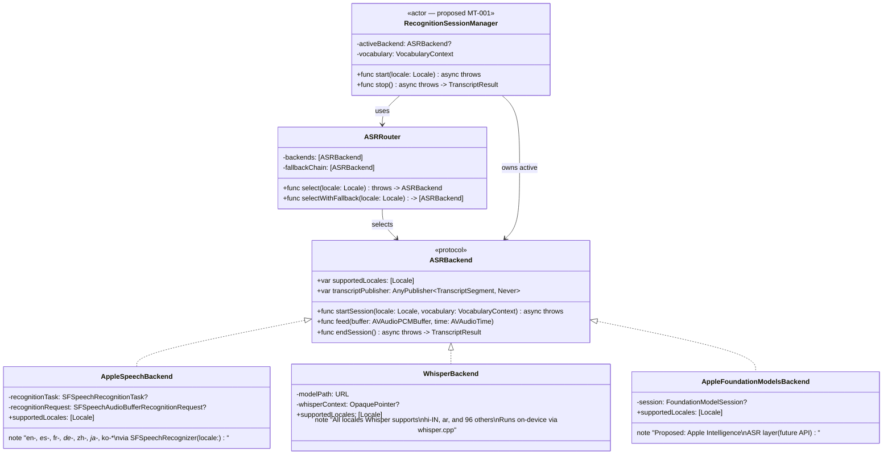
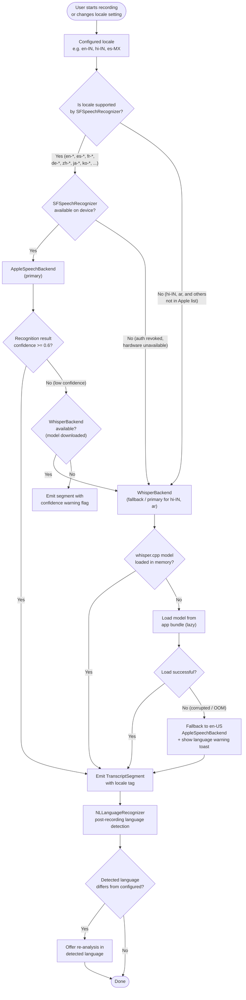
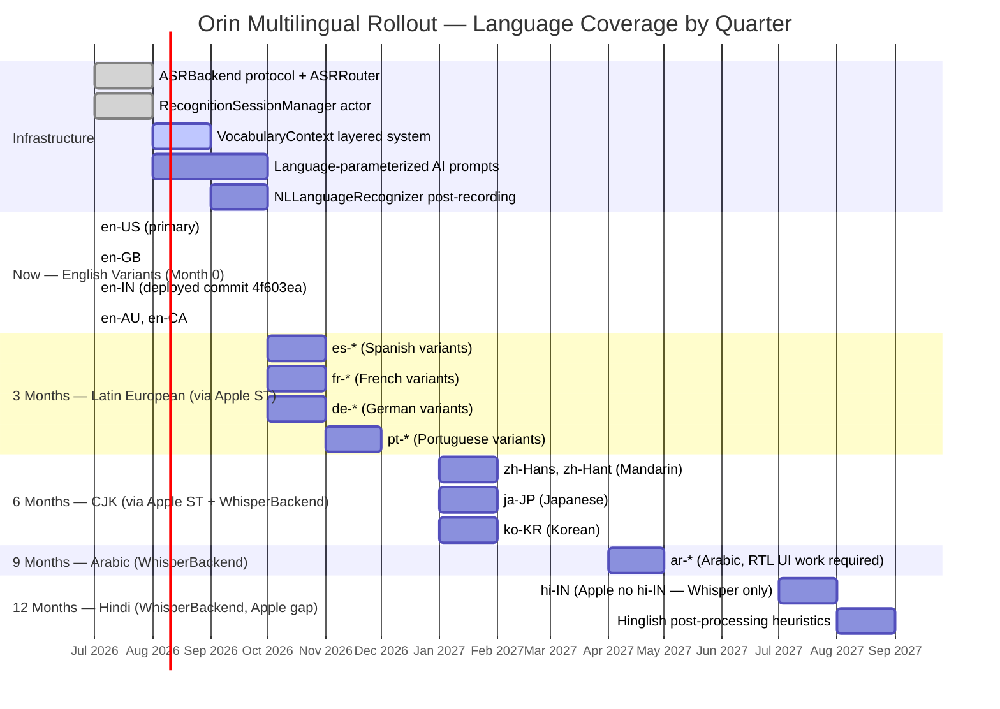
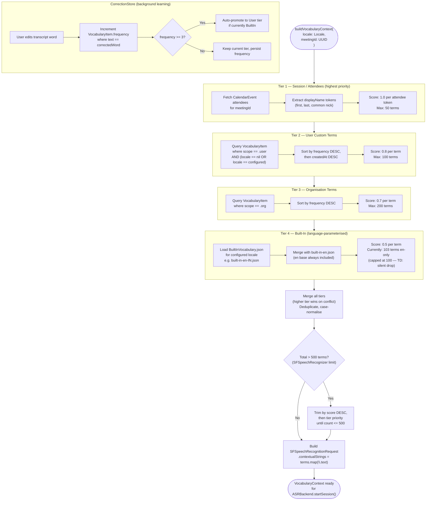
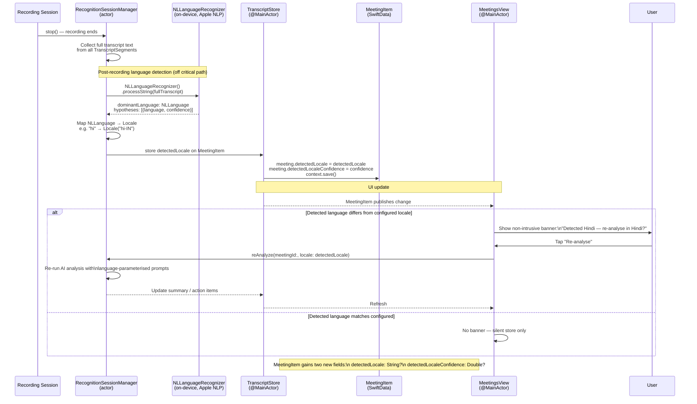

# Multilingual Architecture Diagrams

## 1. ASRBackend Protocol Hierarchy

## 2. Language Routing Decision Tree

## 3. Path to 10 Languages — Timeline

## 4. VocabularyContext Build Algorithm

## 5. Language Detection Pipeline

---

### Language Support Matrix

| Language | Locale | ASR Backend | Apple ST | Whisper | AI Prompts | Target |
|---|---|---|---|---|---|---|
| English (US/GB/AU/CA) | en-* | Apple primary | Yes | Fallback | en | Now |
| English (India) | en-IN | Apple primary | Yes | Fallback | en | Now (deployed) |
| Spanish | es-* | Apple primary | Yes | Fallback | es | Month 3 |
| French | fr-* | Apple primary | Yes | Fallback | fr | Month 3 |
| German | de-* | Apple primary | Yes | Fallback | de | Month 3 |
| Portuguese | pt-* | Apple primary | Yes | Fallback | pt | Month 3 |
| Mandarin | zh-Hans/Hant | Apple primary | Yes | Fallback | zh | Month 6 |
| Japanese | ja-JP | Apple primary | Yes | Fallback | ja | Month 6 |
| Korean | ko-KR | Apple primary | Yes | Fallback | ko | Month 6 |
| Arabic | ar-* | Whisper primary | No | Primary | ar | Month 9 |
| Hindi | hi-IN | Whisper primary | **No** | Primary | hi | Month 12 |
