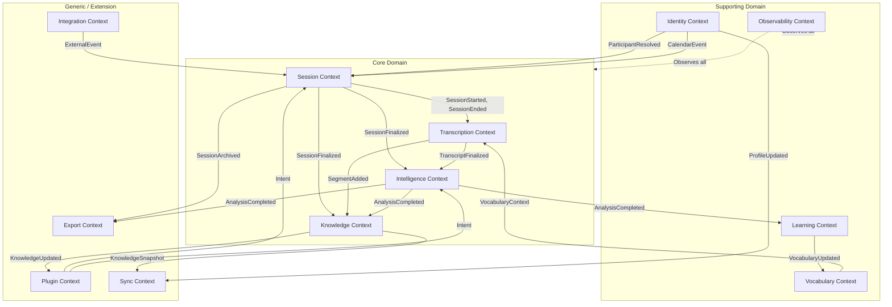
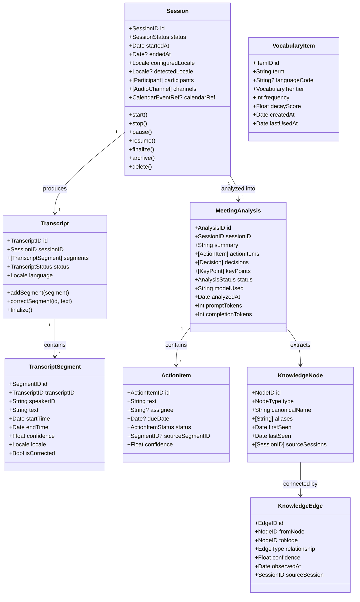
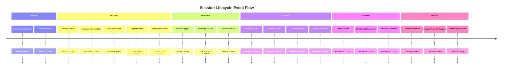
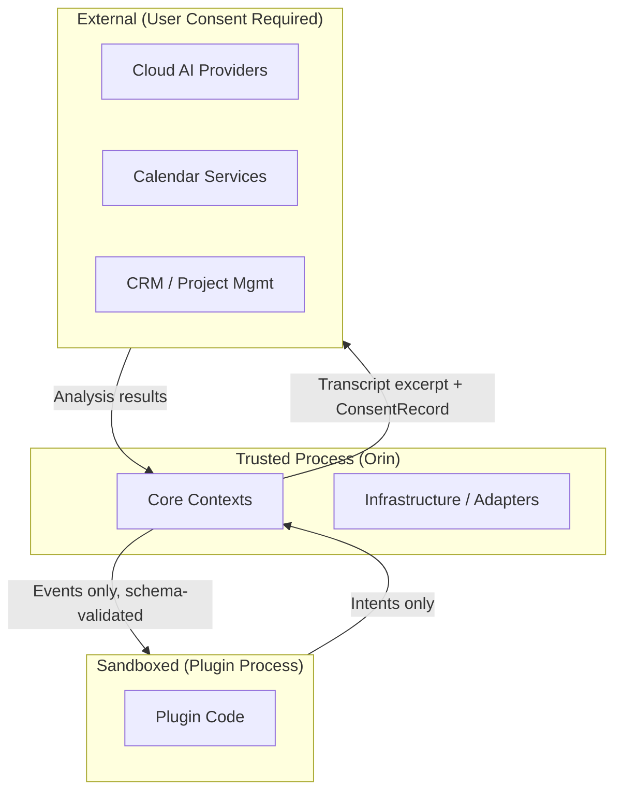

# 01 — Product Domain Architecture

**Status**: Proposed  
**Author**: Chief Software Architect  
**Date**: 2026-06-29  
**Review Required**: Yes — this document defines all domain boundaries. Every subsequent architecture document derives from the decisions made here.

---

## 1. Purpose and Scope

This document defines Orin's **product domain** using Domain-Driven Design (DDD) principles. It establishes:

- The bounded contexts that partition the system into cohesive ownership units
- The ubiquitous language shared across all documents and teams
- The core domain model: aggregates, entities, value objects, and domain events
- The context map: how bounded contexts communicate and which owns what
- The domain invariants that must never be violated
- The extension points that allow the system to evolve without breaking boundaries
- The migration path from the current monolithic implementation

This is not an implementation document. It is the **conceptual foundation** for every implementation decision made in documents 02 through 13. If a future architectural decision contradicts something defined here, that contradiction must be resolved at this level first.

---

## 2. Strategic Context

### 2.1 What Orin Is

Orin is a **local-first, privacy-first AI meeting intelligence platform**. It observes human conversations (meetings, calls, in-person discussions), produces structured knowledge from them (transcripts, summaries, action items, decisions), and continuously improves its accuracy through user interaction — all without sending user data to any external server unless the user explicitly and intentionally consents.

The product exists at the intersection of four technical domains:

1. **Real-time audio engineering** — capturing, routing, and processing audio streams with hard latency constraints
2. **Speech recognition** — converting audio to text with domain-specific vocabulary and multilingual capability
3. **AI reasoning** — extracting structured meaning from unstructured conversational text
4. **Knowledge management** — persisting, connecting, and surfacing insights across a growing corpus of meetings

### 2.2 Core Product Principles (Non-Negotiable)

These principles are **architectural invariants**, not preferences. Any design that violates them is rejected regardless of other benefits.

| Principle | Statement | Architectural Implication |
|-----------|-----------|--------------------------|
| **Local-first** | Every function works without network connectivity | No cloud dependency on the critical path. AI inference, ASR, and storage must work fully offline |
| **Privacy-first** | User data never leaves the device without explicit per-session consent | No telemetry, no transcripts, no vocabulary transmitted without active user decision |
| **Offline-first** | Feature degradation must be graceful, never blocking | Analysis queues when AI is unavailable. Sync resumes when connectivity returns. UI never blocks on network |
| **User owns their data** | All user data is portable, exportable, and deletable | No proprietary lock-in formats. Export to standard formats (Markdown, JSON, PDF). Complete deletion is guaranteed |
| **Audio thread is sacred** | The real-time audio pipeline has bounded latency | No allocations, no I/O, no IPC on the Core Audio thread. Ever. |

### 2.3 What Orin Is Not

Understanding the explicit non-goals is as important as the goals:

- **Not a cloud service** — Orin is a local application with optional cloud augmentation
- **Not a note-taking app** — Orin does not require user input during meetings
- **Not a transcription service** — transcription is a means, not the product
- **Not a CRM** — contact and relationship data is secondary to meeting intelligence
- **Not a video conferencing tool** — Orin observes conferencing tools, not replaces them

---

## 3. Ubiquitous Language

The following terms have precise, agreed meanings throughout all architecture documents. Using these terms consistently prevents the ambiguity that causes inter-team integration failures.

| Term | Definition | Notes |
|------|-----------|-------|
| **Session** | A bounded period of audio observation, from detection/start to stop. The central aggregate of the system. | A session may be a meeting, a call, or any other conversation |
| **Meeting** | A session with sufficient structure to extract knowledge (summary, action items, decisions). | Not every session becomes a meeting — short sessions may be discarded |
| **Participant** | A person whose voice or identity is associated with a session | May be identified (name known from calendar) or anonymous |
| **Transcript** | The ordered, time-stamped sequence of spoken text produced from a session | Contains segments, not raw audio |
| **Segment** | An immutable unit of transcribed speech: speaker, text, start time, end time, confidence | The atomic unit of the transcript |
| **Chunk** | A temporary, ordered window of segments used as input to a single AI inference call | Chunks exist only during analysis. They are not persisted long-term. |
| **Analysis** | The structured output of AI processing applied to a transcript: summary, action items, decisions, key points | An analysis belongs to exactly one session |
| **Action Item** | A commitment made during a session: who will do what by when | Extracted from transcript text, confirmed or rejected by user |
| **Decision** | A conclusion reached during a session with stakeholders and context | Distinguished from action items by being a resolution rather than a commitment |
| **Knowledge Node** | An entity extracted from sessions: person, company, project, product, concept | Lives in the Knowledge Graph |
| **Knowledge Edge** | A relationship between two Knowledge Nodes, timestamped and sourced to a session | Directional, typed relationship |
| **Vocabulary Profile** | The complete set of custom terms associated with a user, organization, or session | Partitioned into tiers: built-in, user, org, session |
| **Correction** | A user's explicit edit to a segment or analysis field | The primary input signal for the Learning Engine |
| **InferenceJob** | A unit of work for the AI pipeline: a prompt, context, and expected output schema | Provider-agnostic |
| **InferenceProvider** | An implementation that executes InferenceJobs against a specific AI backend (Ollama, LM Studio, Apple Foundation Models, OpenAI, etc.) | |
| **ASRBackend** | An implementation that converts an audio stream to TranscriptSegments for a given locale | |
| **Plugin** | A first-party or third-party extension that adds capability without modifying core | Runs sandboxed, communicates via events |
| **Intent** | A named action a user or automation can trigger (e.g. "summarize.now", "export.meeting") | The unit of Plugin API interaction |
| **Workspace** | An isolation boundary for multi-user or enterprise deployments | Contains users, sessions, vocabulary, and knowledge |

---

## 4. Bounded Contexts

A bounded context is a cohesive part of the system with its own model, its own team ownership, and its own explicit interface to the outside world. Choosing the right boundaries is the most consequential decision in this document.

### 4.1 Context Map Overview



### 4.2 Bounded Context Definitions

---

#### SESSION CONTEXT *(Core Domain — Highest Priority)*

**Responsibility**: Owns the complete lifecycle of a recording session, from detection to archival.

**Why this is core**: Every other domain derives from a session. Without the session aggregate, there is nothing to transcribe, analyse, or learn from. The session state machine is the coordination backbone of the entire product.

**Owns**:
- `Session` aggregate (the central entity of the system)
- `SessionState` state machine
- `Participant` entity (within a session)
- `AudioChannel` entity (mic, system audio, per-participant)
- `MeetingDetectionResult` value object

**Does NOT own**:
- Audio processing (Transcription Context)
- Analysis (Intelligence Context)
- User identity resolution (Identity Context owns that; Session Context consumes via event)

**Publishes**:
- `SessionDetected` — a potential meeting has been identified
- `SessionStarted` — recording is active
- `ParticipantJoined` — a participant has been identified
- `SessionPaused` / `SessionResumed`
- `SessionStopped` — recording has ended, transcript may be incomplete
- `SessionFinalized` — transcript is complete and analysis may begin
- `SessionArchived` — session has been moved to long-term storage
- `SessionDeleted` — all data for this session has been permanently removed

**Subscribes to**:
- `CalendarEventStarting` (from Identity Context) — potential auto-start trigger
- `ParticipantResolved` (from Identity Context) — enriches participant record
- `UserIntent[session.start]`, `UserIntent[session.stop]` (from Plugin Context)

**Extension points**:
- `MeetingDetector` protocol — pluggable detection strategy per platform
- `AudioCaptureProvider` protocol — pluggable audio source per platform
- Pre/post session hooks for plugins

**Failure modes**:
- Detection false positive (session started when no meeting) → user-dismissable, auto-stop on silence
- Audio capture failure mid-session → degrade gracefully to mic-only, emit `AudioChannelDegraded`
- Session state machine deadlock → watchdog timer forces transition to `SessionError`, user notified

---

#### TRANSCRIPTION CONTEXT *(Core Domain)*

**Responsibility**: Converts audio streams into structured transcript segments in real-time.

**Why this is core**: The transcript is the primary data product. Every downstream domain — intelligence, knowledge, learning — derives from transcript quality. This context must be designed to absorb ASR backend changes (Apple SpeechTranscriber today, Whisper tomorrow, Apple Foundation Models in future) without the rest of the system knowing.

**Owns**:
- `Transcript` aggregate
- `TranscriptSegment` entity (immutable once finalized)
- `TranscriptChunk` value object (ephemeral, analysis input only)
- `ASRSession` entity (the active recognition session)
- `LanguageDetectionResult` value object

**Does NOT own**:
- Audio routing (Session Context)
- Vocabulary construction (Vocabulary Context owns; Transcription Context consumes)
- AI analysis of text (Intelligence Context)

**Publishes**:
- `SegmentAdded` — a new transcript segment is available (emitted during live recording)
- `LanguageDetected` — the dominant language of the session has been identified
- `TranscriptUpdated` — one or more segments have been revised (correction flow)
- `TranscriptFinalized` — all segments are complete, transcript is ready for analysis
- `ASRBackendChanged` — the active ASR backend has switched (e.g., SpeechTranscriber → Whisper)

**Subscribes to**:
- `SessionStarted` — begin ASR session
- `SessionStopped` — flush final segments, finalize
- `VocabularyContextBuilt` (from Vocabulary Context) — inject vocabulary into active ASR session
- `CorrectionSubmitted` (from Learning Context) — apply segment correction

**Extension points**:
- `ASRBackend` protocol — fully pluggable speech recognition engine
- `LanguageDetector` protocol — pluggable language detection strategy
- `AudioPreprocessor` protocol — noise reduction, normalization, diarization hooks

**Failure modes**:
- ASR backend unavailable → retry with exponential backoff, fall back to lower-quality backend, emit `ASRBackendDegraded`
- Recognition error 1110 (service interruption) → restart with generation counter pattern, transparent to consumers
- Language detection failure → default to configured locale, flag segment confidence as low
- Finalization timeout → force finalize with partial transcript, emit `TranscriptPartial`

---

#### INTELLIGENCE CONTEXT *(Core Domain)*

**Responsibility**: Applies AI reasoning to transcripts to produce structured meeting intelligence.

**Why this is core**: This is the primary value proposition of Orin. The design must treat local inference (Ollama, LM Studio, Apple Foundation Models) as the default, not a fallback. Cloud inference is an opt-in augmentation, not the baseline.

**Owns**:
- `MeetingAnalysis` aggregate
- `AnalysisJob` entity (lifecycle of a single analysis request)
- `InferenceQueue` (the serialization layer for local inference)
- `ChunkAnalysis` value object
- `Prompt` value object (the constructed prompt for a given job)
- `HallucinationCheck` value object

**Does NOT own**:
- AI provider implementations (those are infrastructure/adapters)
- Transcript text (Transcription Context)
- Long-term knowledge storage (Knowledge Context)
- Action item confirmation (Identity/UI concerns)

**Publishes**:
- `AnalysisQueued` — a session has been accepted for analysis
- `AnalysisStarted` — the first inference job has begun
- `ChunkAnalyzed` — one chunk's analysis is complete (progressive results)
- `AnalysisCompleted` — full analysis is ready
- `AnalysisFailed` — analysis could not be completed (all providers unavailable)
- `InferenceProviderChanged` — the active backend has switched

**Subscribes to**:
- `SessionFinalized` — auto-trigger analysis
- `TranscriptFinalized` — transcript is ready as analysis input
- `UserIntent[analysis.start]`, `UserIntent[analysis.cancel]`
- `UserIntent[analysis.retry]`

**Extension points**:
- `InferenceProvider` protocol — any AI backend
- `ModelRouter` protocol — strategy for selecting provider per job
- `PromptStrategy` protocol — custom prompt construction per meeting type
- `PostProcessor` protocol — transforms raw LLM output into structured data
- Plugin hooks: pre-analysis, post-analysis, per-chunk

**Failure modes**:
- All local providers unavailable → queue job, emit `AnalysisDeferred`, retry when available
- Inference timeout → retry with jitter, circuit break after 3 consecutive failures per provider
- Hallucination detected → flag suspect content, do not auto-delete, present to user for review
- Provider OOM (Ollama crash) → catch connection refused, mark provider unavailable for 60s, route to next

**Critical design constraint**: Local inference is always serialized. One inference job executes at a time per local provider. This is not a performance optimization; it is a correctness requirement. Local LLMs are single-model, single-GPU processes. Parallel dispatch causes GPU OOM, system freezes, and synchronized timeout storms. The `InferenceQueue` enforces this.

---

#### KNOWLEDGE CONTEXT *(Core Domain)*

**Responsibility**: Extracts, stores, connects, and surfaces structured knowledge from the growing corpus of meetings.

**Why this is core**: The knowledge graph is what transforms Orin from a meeting recorder into a meeting intelligence platform. Without persistent, connected knowledge, each meeting is isolated. With it, Orin can answer "what did we decide about X last quarter?" and "who is working on Y?"

**Owns**:
- `KnowledgeGraph` aggregate
- `KnowledgeNode` entity (Person, Company, Project, Product, Concept, Decision, Commitment)
- `KnowledgeEdge` entity (directional, typed, timestamped relationship)
- `Fact` value object (a claim extracted from a session, with source and confidence)
- `EntityResolution` service (disambiguates references to the same real-world entity)

**Does NOT own**:
- Raw transcript text (Transcription Context)
- AI inference (Intelligence Context provides extracted entities; Knowledge Context stores them)
- User identity management (Identity Context)

**Publishes**:
- `EntityExtracted` — a new or known entity was identified in a session
- `RelationshipDiscovered` — a relationship between two entities was established
- `FactRecorded` — a fact about an entity was extracted
- `KnowledgeConflict` — a new fact contradicts a previously recorded fact
- `KnowledgeSnapshot` — a periodic export of the knowledge graph (for sync)

**Subscribes to**:
- `AnalysisCompleted` — extract entities and relationships from the analysis
- `TranscriptFinalized` — run entity recognition over the full transcript
- `SessionFinalized` — associate session with participants in the graph
- `CorrectionSubmitted` — update facts when user corrects extracted content

**Extension points**:
- `EntityExtractor` protocol — pluggable NER (Named Entity Recognition) strategy
- `EntityResolver` protocol — disambiguation strategy (is "Apple" the company or the fruit in this context?)
- `GraphQuery` protocol — query interface abstraction (local SQLite graph today, neo4j-compatible in future)
- Plugin API: graph query, entity subscription

**Failure modes**:
- Entity resolution conflict → store both candidates, flag for user disambiguation
- Graph write failure → queue write with retry, never lose extracted data
- Knowledge corruption → snapshot-based rollback, audit log of all graph mutations

---

#### LEARNING CONTEXT *(Supporting Domain)*

**Responsibility**: Observes user corrections and usage patterns, promotes corrections into vocabulary improvements, and feeds signals back to the Transcription and Intelligence Contexts.

**Why supporting, not core**: The Learning Context does not produce the primary data product (transcripts or analyses). It improves quality over time. Its absence degrades the user experience but does not break the system.

**Owns**:
- `CorrectionRecord` entity (original → corrected text, frequency, context)
- `VocabularyPromotion` entity (correction promoted to vocabulary term)
- `UsagePattern` value object (which terms appear frequently in which contexts)
- `FeedbackSignal` value object (structured signal sent to AI provider for fine-tuning, future)

**Does NOT own**:
- The vocabulary store itself (Vocabulary Context)
- The ASR engine (Transcription Context)
- User profile (Identity Context)

**Publishes**:
- `CorrectionRecorded` — a user has corrected a segment or analysis field
- `VocabularyPromotionSuggested` — a correction has reached the promotion threshold (frequency ≥ 3)
- `VocabularyPromoted` — user has accepted a promotion (term added to their vocabulary)
- `UsagePatternUpdated` — statistical model of term usage has been updated

**Subscribes to**:
- `SegmentCorrected` — user edited a transcript segment
- `ActionItemCorrected` — user edited an extracted action item
- `AnalysisFeedback` — user rated analysis quality

**Extension points**:
- `PromotionStrategy` protocol — configurable threshold and confidence logic
- `FeedbackExporter` protocol — export signals to external fine-tuning pipelines (future, opt-in)

---

#### VOCABULARY CONTEXT *(Supporting Domain)*

**Responsibility**: Constructs the per-session vocabulary that is injected into the ASR backend to improve recognition accuracy.

**Why a separate context**: Vocabulary construction is complex enough to warrant its own bounded context. It involves four tiers of data, language-aware selection, budget allocation, and runtime injection into the ASR session. Embedding this in the Transcription Context would violate single responsibility.

**Owns**:
- `VocabularyProfile` aggregate (the complete vocabulary for a user/org)
- `VocabularyItem` entity (term, language, source tier, frequency, decay score)
- `VocabularyTier` value object (Session > User > Org > BuiltIn)
- `VocabularyContext` value object (the computed 100-term list for a specific session)
- `LanguagePack` entity (built-in terms for a specific language code)

**Does NOT own**:
- The ASR session (Transcription Context injects the vocabulary)
- User identity (Identity Context provides attendee names for Tier 1 injection)
- Corrections (Learning Context owns; Vocabulary Context subscribes to promotions)

**Publishes**:
- `VocabularyContextBuilt` — the session vocabulary has been computed (consumed by Transcription)
- `LanguagePackLoaded` — a new language pack has been installed
- `VocabularyBudgetExceeded` — more terms than the 100-term budget exist; truncation occurred (always logged)

**Subscribes to**:
- `SessionStarted` — trigger vocabulary construction for the session
- `LanguageDetected` — update vocabulary context if detected language differs from configured
- `VocabularyPromoted` (from Learning Context) — add term to user tier
- `ParticipantResolved` (from Identity Context) — inject attendee names as Tier 1 terms

---

#### IDENTITY CONTEXT *(Supporting Domain)*

**Responsibility**: Manages users, organizations, contacts, and calendar integration.

**Owns**:
- `User` aggregate
- `Organization` aggregate (for enterprise/workspace deployment)
- `Contact` entity (resolved person from address book or calendar)
- `CalendarEvent` entity (meeting context from EventKit/Exchange/Google)

**Publishes**:
- `CalendarEventStarting` — a meeting on the calendar is about to begin
- `ParticipantResolved` — a participant has been matched to a known contact
- `UserPreferenceChanged` — a user preference that affects other contexts

**Extension points**:
- `CalendarProvider` protocol — EventKit (macOS/iOS), Exchange (Windows), Google Calendar, etc.
- `ContactResolver` protocol — resolve participant identity from audio/metadata

---

#### PLUGIN CONTEXT *(Generic Domain)*

**Responsibility**: Manages the lifecycle, sandboxing, capability grants, and communication of plugins and extensions.

**Why generic, not core**: Plugins extend the system but are not part of the core value proposition. The system is fully functional without any plugins.

**Owns**:
- `Plugin` aggregate (metadata, capability manifest, lifecycle state)
- `PluginPermission` value object (what the plugin is allowed to do)
- `Intent` value object (a named action that plugins can trigger or respond to)
- `EventSubscription` entity (which domain events a plugin has subscribed to)

**Publishes**:
- `PluginInstalled`, `PluginActivated`, `PluginDeactivated`, `PluginRemoved`
- `UserIntent[*]` — intents requested by plugins or UI automation

**Extension points**:
- The entire Plugin Context IS an extension point. See Document 09 (Plugin & Extension SDK).

---

#### INTEGRATION CONTEXT *(Generic Domain)*

**Responsibility**: Manages outbound connections to external systems (project management, CRM, communication tools).

**Owns**:
- `Integration` aggregate (connection to a specific external service)
- `Webhook` entity (outbound delivery configuration)
- `ExternalMapping` value object (how Orin concepts map to external system concepts)

**Extension points**: Every integration is itself a plugin with elevated system capabilities.

---

#### OBSERVABILITY CONTEXT *(Supporting Domain)*

**Responsibility**: Collects telemetry, performance metrics, audit logs, and health signals from all other contexts.

**Critical design note**: The Observability Context is a **passive observer**. It subscribes to domain events but never emits events that other contexts depend on. It must never be on any critical path.

**Owns**:
- `MetricSeries` entity
- `AuditLog` entity (especially for privacy-sensitive operations: what data was sent where)
- `HealthStatus` value object
- `PerformanceTrace` value object

All telemetry is **local-only by default**. Nothing is transmitted externally unless the user explicitly enables optional analytics.

---

## 5. Domain Model

### 5.1 Core Aggregates



### 5.2 Value Objects

Value objects have no identity — they are defined entirely by their attributes. They are immutable.

| Value Object | Attributes | Used By |
|-------------|-----------|---------|
| `InferenceJob` | prompt, systemPrompt, maxTokens, temperature, language, priority | Intelligence Context |
| `InferenceResult` | text, tokensUsed, latencyMs, modelID, providerID | Intelligence Context |
| `VocabularyContext` | terms[100], languageCode, tierBreakdown, sessionID | Vocabulary → Transcription |
| `AudioBuffer` | pcmData, format, timestamp, channelID | Session → Transcription |
| `TranscriptChunk` | segments[], startTime, endTime, chunkIndex, totalChunks | Transcription → Intelligence |
| `MeetingDetectionResult` | confidence, signalSources[], meetingType, estimatedDuration | Session Context |
| `PromotionSuggestion` | originalText, suggestedTerm, frequency, exampleSegments[] | Learning → Vocabulary |
| `HealthStatus` | component, status, latencyMs, errorRate, timestamp | Observability |
| `PerformanceBudget` | component, cpuBudget%, ramBudgetMB, latencyBudgetMs | Observability |

### 5.3 Domain Events

Domain events are the primary communication mechanism between bounded contexts. They are immutable facts about something that has happened.



**Event Schema Standard**: All domain events must conform to:

```
{
  eventID:    UUID          // globally unique
  eventType:  String        // e.g. "session.started"
  version:    Int           // schema version, starts at 1
  occurredAt: ISO8601       // when the fact occurred
  sessionID:  UUID?         // the session this event relates to (if applicable)
  workspaceID: UUID?        // the workspace (for enterprise)
  payload:    Object        // event-specific data
  causationID: UUID?        // the event that caused this one (for tracing)
  correlationID: UUID?      // the original trigger event (for chain tracing)
}
```

---

## 6. Context Communication Patterns

### 6.1 Communication Rules

| Pattern | When to Use | When NOT to Use |
|---------|------------|----------------|
| **Domain Event (async)** | Cross-context notification where the publisher does not need a response | When the publisher needs the result synchronously |
| **Direct call (sync)** | Within a bounded context only | Across bounded context boundaries |
| **Query (request/response)** | When one context needs data owned by another, and cannot get it from events | On any real-time audio path |
| **Shared value object** | Read-only data passed between contexts as a value | Mutable shared state (forbidden) |

### 6.2 Anti-Patterns (Explicitly Forbidden)

- **Shared mutable state between contexts**: each context owns its data exclusively
- **Synchronous cross-context calls on the audio path**: the Transcription Context cannot call into any other context synchronously while processing audio
- **Database-level sharing**: each context has its own storage schema. No cross-schema SQL joins.
- **Event sourcing for audio buffers**: audio buffers are not domain events; they are high-frequency data streams handled by the audio pipeline, not the event bus

---

## 7. Domain Invariants

These rules must never be violated. Any code path that could violate them is a defect.

| Invariant | Context | Description |
|-----------|---------|-------------|
| INV-001 | Session | A Session can only transition through valid states as defined by the Session State Machine (Document 04) |
| INV-002 | Session | A Session in `Finalized` state cannot be modified, only read or deleted |
| INV-003 | Transcription | TranscriptSegments are immutable once finalized. Corrections create new segments; they do not mutate existing ones |
| INV-004 | Transcription | Segments within a Transcript are non-overlapping and ordered by timestamp |
| INV-005 | Intelligence | Exactly one InferenceJob executes at a time per local InferenceProvider |
| INV-006 | Intelligence | A MeetingAnalysis belongs to exactly one Session |
| INV-007 | Vocabulary | The VocabularyContext built for a session contains at most 100 terms |
| INV-008 | Vocabulary | Terms from a higher-priority tier are never displaced by lower-priority terms during VocabularyContext construction |
| INV-009 | Knowledge | Every KnowledgeEdge must reference two existing KnowledgeNodes |
| INV-010 | Privacy | No payload containing transcript text may be transmitted to any external service without an explicit `ConsentRecord` with `sessionID`, `providerID`, and `userID` |
| INV-011 | Audio | No heap allocation may occur on the Core Audio real-time I/O thread |
| INV-012 | Audio | No IPC (XPC, network, file I/O) may be initiated while holding the audio thread's NSLock |
| INV-013 | Plugin | A plugin may not access another plugin's data or the Core Audio thread |
| INV-014 | Plugin | A plugin's capabilities are limited to what is declared in its manifest and granted by the user |

---

## 8. Extension Points Summary

| Extension Point | Protocol / Interface | Context | Purpose |
|----------------|---------------------|---------|---------|
| Meeting detection strategy | `MeetingDetector` | Session | Platform-specific meeting detection (SCKit, WinRT, CallKit) |
| Audio capture source | `AudioCaptureProvider` | Session | Platform-specific audio capture |
| Speech recognition backend | `ASRBackend` | Transcription | Swappable ASR (SpeechTranscriber, SFSpeech, Whisper, etc.) |
| Language detection | `LanguageDetector` | Transcription | NLLanguageRecognizer, custom, or remote |
| AI inference backend | `InferenceProvider` | Intelligence | Ollama, LM Studio, Apple Foundation Models, cloud, etc. |
| Provider selection strategy | `ModelRouter` | Intelligence | Which provider for which job |
| Prompt construction | `PromptStrategy` | Intelligence | Custom prompts per meeting type or user |
| Output post-processing | `PostProcessor` | Intelligence | Parse LLM output into structured data |
| Entity extraction | `EntityExtractor` | Knowledge | NER strategy for entity extraction |
| Entity disambiguation | `EntityResolver` | Knowledge | Same-entity detection across sessions |
| Calendar integration | `CalendarProvider` | Identity | EventKit, Exchange, Google Calendar |
| Contact resolution | `ContactResolver` | Identity | Resolve participant names from audio/metadata |
| Vocabulary promotion strategy | `PromotionStrategy` | Learning | When to promote a correction to vocabulary |
| Storage backend | `PersistenceStore` | All | SwiftData (Apple), GRDB (Windows), Room (Android) |
| Sync backend | `SyncProvider` | Sync | iCloud, OneDrive, self-hosted |
| Plugin capability | `PluginCapability` | Plugin | Any user-facing extension |

---

## 9. Data Ownership Map

| Data | Owner Context | Other Contexts That Read It |
|------|-------------|---------------------------|
| Session state and lifecycle | Session | Transcription, Intelligence, Knowledge, Plugin |
| Audio buffers | Session (lifetime); Transcription (processing) | None — never persisted |
| Transcript segments | Transcription | Intelligence (read-only), Knowledge (read-only), UI (read-only) |
| Meeting analysis | Intelligence | Knowledge, Export, Plugin (read-only) |
| Knowledge graph | Knowledge | Plugin, Integration, UI (read-only) |
| Vocabulary items | Vocabulary | Transcription (receives VocabularyContext) |
| Correction records | Learning | Vocabulary (receives promotions) |
| User/org profile | Identity | Session, Vocabulary, Sync |
| Plugin state | Plugin | None — plugins own their own state |
| Observability data | Observability | None — passive sink |

---

## 10. Security Implications

### 10.1 Trust Boundaries



### 10.2 Data Classification

| Data Class | Examples | Handling |
|-----------|---------|----------|
| **Restricted** | Transcript text, audio recordings, action items | Never transmitted without explicit per-session consent. Encrypted at rest. |
| **Sensitive** | Participant names, meeting titles, calendar events | Stored locally. Transmitted only to user-controlled sync (iCloud private zone). |
| **Internal** | Session IDs, analysis metadata, performance metrics | Local-only by default. Optional anonymous aggregation if user opts in. |
| **Public** | App version, locale configuration, plugin manifest | May be used for support and diagnostics. |

### 10.3 Consent Model

Every external transmission of Restricted data requires a `ConsentRecord`:

```
ConsentRecord {
  consentID:     UUID
  sessionID:     UUID
  providerID:    String      // e.g. "com.anthropic.claude"
  dataClass:     "transcript" | "analysis" | "vocabulary"
  grantedAt:     ISO8601
  grantedBy:     UserID
  expiresAt:     ISO8601?    // nil = one-time consent
  auditLogID:    UUID        // pointer to the Observability Context's log entry
}
```

---

## 11. Performance Budget Allocations (Domain Level)

These are domain-level budgets. Component-level budgets are in Document 11 (Performance & Resource Budget).

| Domain Operation | Latency Budget | CPU Budget | Notes |
|----------------|---------------|-----------|-------|
| Session start | < 500ms | < 5% (burst) | User-perceived responsiveness |
| First transcript segment | < 2s from session start | — | Critical UX moment |
| Segment-to-UI latency | < 200ms | — | Live transcript feel |
| Vocabulary context build | < 100ms | < 2% | At session start, non-blocking |
| Analysis queue entry | < 50ms | — | Must not block session stop |
| Per-chunk inference (local) | < 120s | GPU: 100% (serialized) | One at a time, full GPU for duration |
| Knowledge graph write | < 500ms | < 3% | Post-session, background |
| Plugin event delivery | < 50ms | < 1% | Plugins must not slow the core |

---

## 12. Observability Requirements

Every bounded context must emit structured logs (OSLog on Apple, structured log on other platforms) for these categories:

| Category | Required Events |
|---------|----------------|
| **Lifecycle** | Every state transition, every aggregate creation and deletion |
| **Performance** | Operation latency at p50/p95/p99, budget violations |
| **Errors** | Every error with context, error code, and recovery action taken |
| **Privacy** | Every external data transmission with ConsentRecord reference |
| **Inference** | Provider used, tokens consumed, latency, success/failure |
| **Audio** | Buffer underruns, ASR restarts, format changes |

No personally identifiable information (names, transcript text, meeting titles) may appear in observability logs unless the user has enabled diagnostic mode.

---

## 13. Migration Path from Current Implementation

The current Orin codebase is a single-module Swift application. Migrating to this bounded context architecture is a multi-phase operation. Each phase is independently deployable.

### Phase 1 (Documents 03–05 stabilization): Introduce protocols without restructuring

Introduce `ASRBackend`, `InferenceProvider`, and `AudioCaptureProvider` as protocols wrapping existing concrete implementations. No behaviour change. The bounded context boundaries exist as conceptual lines, not physical module boundaries.

**Exit criteria**: All existing implementations conform to their protocol. All tests pass against the protocol, not the concrete type.

### Phase 2 (Medium-term): Extract service boundaries within the module

Split the single Swift module into logical groups matching the bounded contexts. Each group has its own namespace (Swift module or at minimum a directory with explicit public API declarations). Cross-context communication is exclusively through the domain event bus (Document 02) or published protocols.

**Exit criteria**: No cross-boundary direct calls. Each context's internal types are unexported.

### Phase 3 (Long-term): Physical module extraction

Extract each bounded context into a Swift Package. `OrinCore` package contains Session, Transcription, Intelligence, Knowledge, and Learning contexts with zero platform-specific imports. Platform-specific packages implement the extension point protocols.

**Exit criteria**: `OrinCore` builds on Linux with `swift build`. Windows and iOS implementations compile against `OrinCore` without modification to the package.

---

## 14. Open Questions for Review

The following decisions require stakeholder input before Document 02 (Event-Driven Architecture) can be finalized:

1. **Event bus implementation**: Should the event bus be in-process (actor-based async streams) or support inter-process delivery (for plugin sandboxing)? Inter-process adds significant complexity but is required for true plugin isolation.

2. **Knowledge graph storage**: Start with SQLite-based adjacency list (pragmatic, sufficient for years of meetings) or invest in a proper graph database schema (more capable, more complex migration)? This affects Document 08.

3. **Workspace / multi-user model**: Is the initial target a single-user application or does enterprise multi-user need to be designed from the start? The `Workspace` concept in the Identity Context has significant implications for sync, permissions, and knowledge graph partitioning.

4. **Transcript correction model**: Immutable segments with correction overlay (correct approach for audit trail and knowledge accuracy) vs. mutable segment text (simpler implementation)? This document proposes immutable; confirm this is acceptable given the UI implications.

5. **Plugin sandboxing mechanism**: XPC (macOS, high isolation, high complexity) vs. in-process with capability checks (simpler, less isolation)? The answer affects the Plugin Context design significantly.

---

*Document 01 of 13 complete. Awaiting review before proceeding to Document 02: Event-Driven Architecture.*
