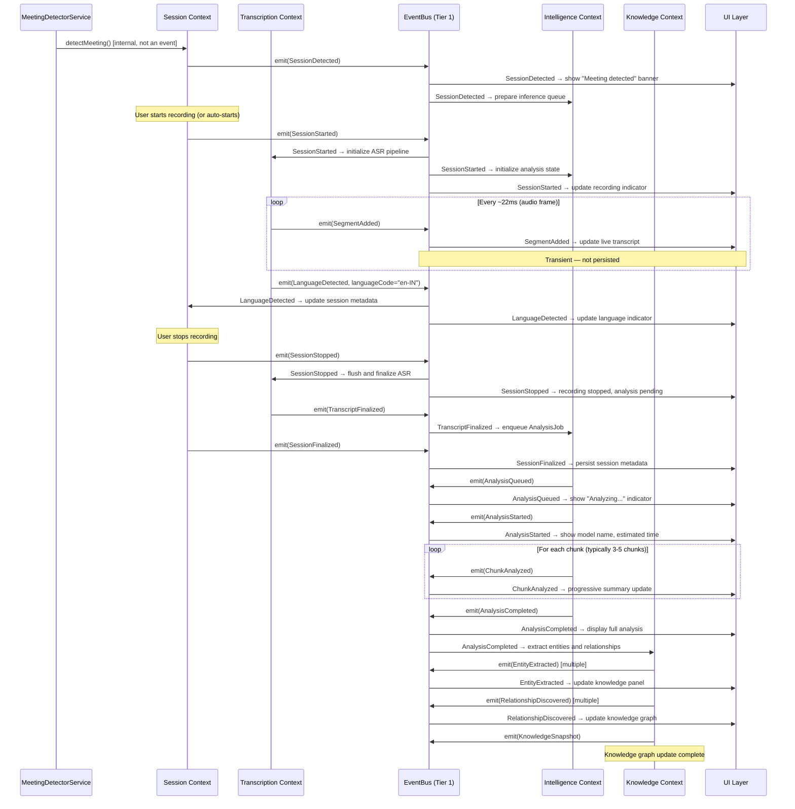
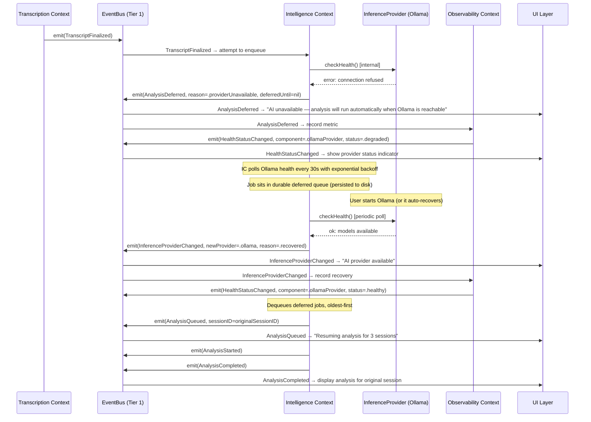
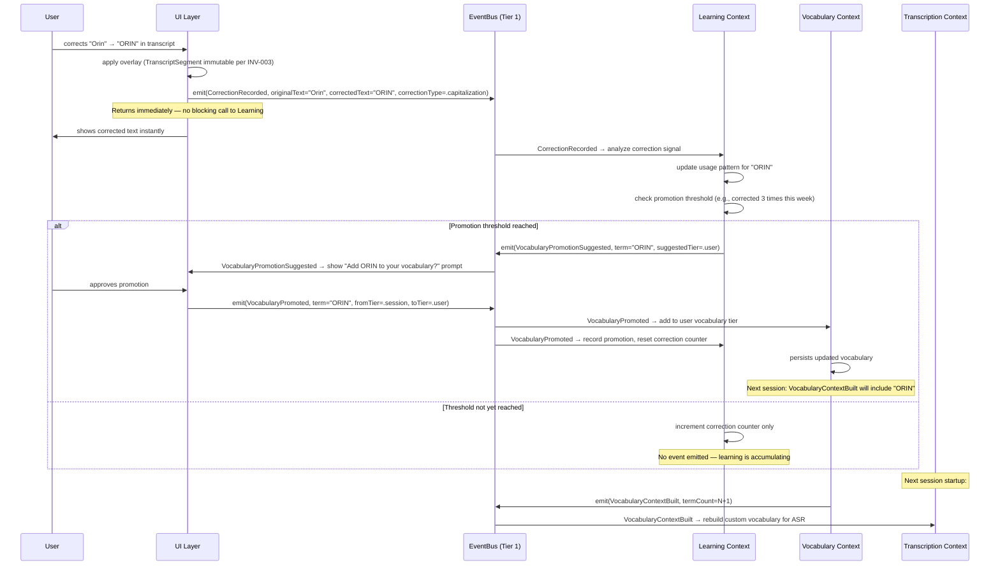
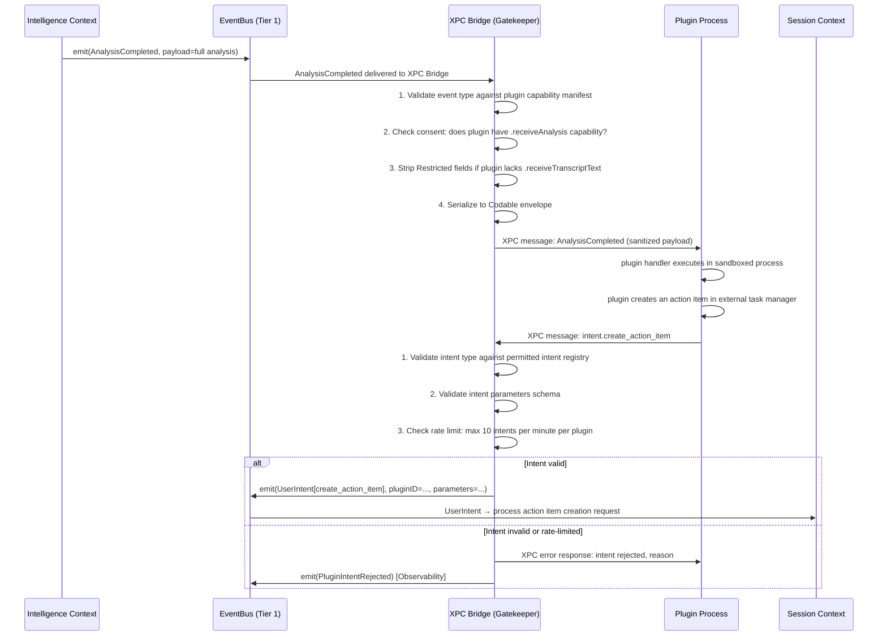

# 02 — Event-Driven Architecture

**Status**: Proposed  
**Author**: Chief Software Architect  
**Date**: 2026-06-29  
**Depends On**: 01-Product-Domain-Architecture.md  
**Review Required**: Yes — this document defines the communication backbone. Every service boundary, every cross-context interaction, and every plugin integration depends on the contracts defined here.

---

## 1. Why Event-Driven Architecture

### 1.1 The Problem with Direct Calls

The current codebase communicates through direct service references via `ServiceContainer`. When `MeetingIntelligenceService` wants to analyze a transcript, it calls `AIService` directly. When the UI wants to display a summary, it queries `MeetingIntelligenceService` directly. This works at small scale, but it creates a structural problem: **every context is entangled with every other context**.

The consequences are already visible in the codebase:

- `MeetingIntelligenceService` fires 41 concurrent analysis requests (the thundering herd defect). This is a symptom of direct call coupling — nothing can serialize and rate-limit intelligence requests because every caller goes straight to the provider.
- `ServiceContainer` has no thread safety. Under concurrent access, the container itself becomes a failure point.
- If `AIService` throws a fatal error, the error propagates up the call stack directly into the calling context. A crash in analysis can bubble into the recording pipeline.
- Adding a new consumer (a plugin, a new UI panel, the Learning Context) requires modifying the producer to call the new consumer — violating the Open/Closed Principle and creating cascading coupling.

### 1.2 Why Events Solve These Problems for Orin Specifically

#### Fault isolation between life-critical and best-effort subsystems

Orin has a strict priority hierarchy:

1. **Real-time audio capture** — must never stall, must never crash. Data loss is permanent.
2. **Transcription** — must remain live during recording.
3. **Analysis, knowledge extraction, learning** — best-effort, can be deferred and retried.
4. **UI, plugins** — consumers only.

Events enforce this hierarchy structurally. The `Transcription Context` emits `TranscriptFinalized` and immediately returns. It does not wait for `Intelligence Context` to queue the analysis. If `Intelligence Context` crashes or is overwhelmed, the transcript is safe and the recording continues. The two contexts share no execution context.

Without events, a blocking call from Transcription into Intelligence means a stalled intelligence queue stalls transcription finalization.

#### Analysis must be async by design

The user must be able to stop recording at any time, instantly. The "Stop Recording" button must be responsive within one frame (~16ms). If stopping recording requires waiting for an in-flight analysis call to complete, that invariant is violated.

With events, `SessionStopped` is emitted and the UI responds immediately. The Intelligence Context receives the event asynchronously and completes or queues its work independently. The user never waits.

#### Plugins must be isolated from the critical path

Plugins observe system behavior — they do not participate in it. If a plugin is installed and its event handler deadlocks, crashes, or takes 3 seconds to run, that must have zero effect on audio capture, transcription, or analysis. This isolation is only achievable if plugin communication is asynchronous and the plugin runs in a separate process with no shared memory with the core contexts.

Events delivered over XPC to plugin processes provide this isolation by construction. A crashed plugin process cannot corrupt the core application heap.

#### Learning Context must decouple correction signals from the UI

When a user corrects a transcript segment, the UI must respond instantly (show the corrected text). The Learning Context's processing of that correction — updating usage patterns, suggesting vocabulary promotions, updating model weights — is background work that may take hundreds of milliseconds. Calling Learning Context synchronously from the UI correction handler would cause visible latency.

`CorrectionRecorded` is emitted synchronously (in-memory, no I/O), and the UI moves on. Learning Context picks it up asynchronously on its own actor.

#### Cross-platform portability

Orin's Phase 3 target is a Swift Package with platform-neutral core and thin platform adapters (macOS, iOS, Windows via Swift on Windows). Direct service calls that use Apple-specific mechanisms (`@MainActor`, `NotificationCenter`, `Combine`) cannot be ported to Windows. Events defined as plain Swift structs over a Swift concurrency actor require no Apple framework and will port cleanly.

### 1.3 What Event-Driven Architecture Does Not Solve

For clarity, document what events are not the right tool for:

- **Request/response queries** — if `UI` asks "what is the current session status", that is a synchronous read from a state store, not an event subscription. Events carry facts about things that happened; they are not a query API.
- **In-context data transfer** — passing a large audio buffer from the capture layer to the ASR backend is done via a shared memory ring buffer, not events. Events carry notifications; they do not carry bulk data.
- **Configuration** — reading user preferences is a synchronous read, not an event subscription.

---

## 2. Event Bus Architecture

### 2.1 Two-Tier Design

Orin uses a **two-tier event bus**. This is the core architectural recommendation of this document.

```
┌─────────────────────────────────────────────────────────────────────┐
│                         ORIN PROCESS                                │
│                                                                     │
│  ┌──────────────┐  ┌──────────────┐  ┌──────────────┐             │
│  │   Session    │  │Transcription │  │ Intelligence │             │
│  │   Context    │  │   Context    │  │   Context    │             │
│  └──────┬───────┘  └──────┬───────┘  └──────┬───────┘             │
│         │                 │                  │                      │
│         └─────────────────┴──────────────────┘                     │
│                           │                                         │
│               ┌───────────▼───────────┐                            │
│               │   TIER 1: InProcess   │                            │
│               │   EventBus (actor)    │◄── Knowledge, Learning,    │
│               │   < 1ms dispatch      │    Vocabulary, Identity,   │
│               └───────────┬───────────┘    Observability           │
│                           │                                         │
│               ┌───────────▼───────────┐                            │
│               │   XPC Bridge          │                            │
│               │   (schema validation, │                            │
│               │   sanitization,       │                            │
│               │   consent check)      │                            │
│               └───────────┬───────────┘                            │
└───────────────────────────┼─────────────────────────────────────────┘
                            │ XPC
            ┌───────────────┴───────────────┐
            │                               │
  ┌─────────▼──────────┐       ┌────────────▼────────────┐
  │  Plugin Process A   │       │   Plugin Process B      │
  │  TIER 2: XPC        │       │   TIER 2: XPC           │
  │  EventSubscriber    │       │   EventSubscriber        │
  └─────────────────────┘       └─────────────────────────┘
```

#### Tier 1: In-Process Swift Actor Event Bus

**Scope**: All core bounded contexts within the Orin process (Session, Transcription, Intelligence, Knowledge, Learning, Vocabulary, Identity, Observability).

**Mechanism**: A single Swift `actor` named `EventBus`. Publishers call `emit(_:)`. Subscribers register via `subscribe(to:handler:)`, receiving events via `AsyncStream`. No serialization. No network. No process boundary.

**Rationale for actor-based design**:
- Swift's structured concurrency model guarantees that actor-isolated state is accessed exclusively by one task at a time, eliminating data races without explicit locking.
- `AsyncStream` provides back-pressure-aware delivery with Swift's cooperative scheduler.
- Zero serialization cost — events are Swift value types passed in-process.
- Testable without XPC, process management, or entitlements.

**Dispatch latency target**: < 1ms for event delivery from emitter to first subscriber receiving the event. This is a hard performance budget (see Section 8).

#### Tier 2: XPC-Based Inter-Process Channel for Plugins

**Scope**: All Plugin Context communication. Plugins always run in a separate process.

**Mechanism**: The XPC Bridge listens on Tier 1 and, for each event that a plugin has declared interest in (via its capability manifest), serializes the event to a `Codable` envelope, applies schema validation and consent checks, and sends it over an XPC connection to the plugin process.

**Rationale for separate tier**:
- A plugin crash cannot corrupt the main process. XPC connections are process-isolated by the OS.
- Plugins cannot observe events they are not permitted to observe (enforced by the XPC Bridge gatekeeper, not by trust in plugin code).
- Serialization overhead (JSON or binary plist) is acceptable for plugins because plugins are not on any real-time path.
- Plugin processes can be sandboxed by the OS (App Sandbox entitlements) without constraining the main process.
- This matches Apple's design intent for XPC: isolate risky code in separate processes with minimal capabilities.

**Why not use a single bus for everything**: Making the core event bus support XPC delivery for every event would impose serialization requirements on all event payloads (all fields must be `Codable`, all types must support property list serialization). This constrains the core domain model. Keeping the tiers separate means Tier 1 events can carry rich Swift types (enums with associated values, structs with non-Codable fields) while only Tier 2 payloads must be serializable.

### 2.2 EventBus Interface

```swift
// The public interface of the Tier 1 in-process event bus.
// Implementation is a Swift actor — all methods are async.

public actor EventBus {

    public static let shared = EventBus()

    // Emit an event. Returns immediately after enqueuing.
    // Does NOT wait for subscribers to process the event.
    public func emit(_ event: any DomainEvent) async

    // Subscribe to all events of a given type.
    // Returns an AsyncStream that delivers matching events.
    // The caller is responsible for consuming the stream to avoid back-pressure.
    public func subscribe<E: DomainEvent>(
        to eventType: E.Type,
        bufferPolicy: EventBufferPolicy = .dropOldest(capacity: 256)
    ) -> AsyncStream<E>

    // Subscribe to multiple event types with a filter predicate.
    // Returns an AsyncStream of the base DomainEvent protocol.
    public func subscribeAny(
        to eventTypes: [any DomainEvent.Type],
        bufferPolicy: EventBufferPolicy = .dropOldest(capacity: 256)
    ) -> AsyncStream<any DomainEvent>

    // Unsubscribe a specific subscription token.
    // Subscriptions are also automatically cleaned up when the AsyncStream is deallocated.
    public func unsubscribe(_ token: SubscriptionToken) async

    // Observability: current throughput and subscriber health.
    public func metrics() async -> EventBusMetrics
}

public enum EventBufferPolicy {
    case dropOldest(capacity: Int)   // drop oldest events when buffer full (default for non-critical)
    case dropNewest(capacity: Int)   // drop newest events when buffer full (for ordered streams)
    case unbounded                   // no limit — only for trusted, fast subscribers
    case blocking                    // await space — only for safety-critical paths (not recommended)
}
```

### 2.3 Publishers: Emit Without Knowing Subscribers

Publishers call `EventBus.shared.emit(event)` and return. They declare no dependency on any subscriber. The compiler enforces this: publishers import the `EventBus` module, not any subscriber module.

```swift
// In TranscriptionContext — emits without knowledge of Intelligence or Learning
await EventBus.shared.emit(TranscriptFinalizedEvent(
    transcriptID: transcript.id,
    sessionID: session.id,
    segmentCount: segments.count,
    duration: transcript.duration
))
// Returns immediately. Intelligence Context picks this up on its own task.
```

### 2.4 Subscribers: Declare Interest by Topic

Subscribers express interest by event type. Subscriptions are established once at service startup and remain alive for the service lifetime.

```swift
// In IntelligenceContext — subscribes at initialization
final class IntelligenceService {
    private var analysisTask: Task<Void, Never>?

    func start() {
        analysisTask = Task {
            let stream = await EventBus.shared.subscribe(to: TranscriptFinalizedEvent.self)
            for await event in stream {
                await self.handleTranscriptFinalized(event)
            }
        }
    }

    private func handleTranscriptFinalized(_ event: TranscriptFinalizedEvent) async {
        await inferenceQueue.enqueue(AnalysisJob(transcriptID: event.transcriptID))
    }
}
```

No registration callback, no delegate protocol, no Combine publisher. The subscriber uses standard Swift structured concurrency and can be unit tested with a mock `AsyncStream`.

### 2.5 Back-Pressure Handling

Back-pressure occurs when a subscriber cannot process events as fast as they are emitted. This is the primary operational risk of any event bus. Orin's strategy depends on the event type:

| Event Frequency | Back-Pressure Policy | Rationale |
|----------------|----------------------|-----------|
| `SegmentAdded` (up to 46/sec) | `dropOldest(256)` | UI consumers only; missing a real-time segment update is acceptable |
| `TranscriptFinalized` (1 per session) | `unbounded` | Low frequency; must never be dropped |
| `AnalysisCompleted` (1 per session) | `unbounded` | Low frequency; must never be dropped |
| `EntityExtracted` (burst after analysis) | `dropOldest(512)` | Knowledge Context will catch up; order matters less than throughput |
| `CorrectionRecorded` (user-driven, low freq) | `unbounded` | Must never be dropped — corrections represent user intent |
| `PrivacyAuditEvent` | `unbounded` | Must never be dropped — audit completeness is a compliance requirement |
| `PerformanceBudgetViolation` | `dropOldest(32)` | Observability only; losing some metrics is acceptable |

**When `dropOldest` fires**: the event bus logs a `slow_subscriber` metric (eventType, subscriberID, droppedCount). This metric is surfaced in the Observability Context and triggers a `PerformanceBudgetViolation` event if the drop rate exceeds 1% over a 60-second window.

**Slow subscriber detection**: if a subscriber's buffer fill level exceeds 80% for more than 5 seconds, the bus logs a warning. At 100% fill (drop begins), the bus logs an error and emits a `HealthStatusChanged` event to the Observability Context.

### 2.6 Event Ordering Guarantees

The in-process event bus provides **FIFO ordering per publisher**. Two events emitted by the same publisher in sequence are delivered to each subscriber in that same sequence.

**Cross-publisher ordering is not guaranteed.** If the Session Context emits `SessionStopped` at the same time the Transcription Context emits `TranscriptFinalized`, the order in which subscribers receive these two events is not defined. Subscribers that need to correlate cross-publisher events must use the `correlationID` field and maintain their own state machine.

**When ordering matters and when it does not**:

| Scenario | Ordering Required? | Approach |
|----------|-------------------|----------|
| Transcript segments within a session | Yes — text must be in time order | Segments carry `sequenceNumber`; consumer sorts by sequence if out-of-order arrival detected |
| Session lifecycle events (Started → Stopped → Finalized) | Yes — state machine | Session Context serializes these on its actor; they are emitted in order by a single publisher |
| Analysis events from multiple chunks | Yes — chunks have order | `ChunkAnalyzed` carries `chunkIndex`; consumer accumulates and sorts |
| Entity extracted events | No | Knowledge Context processes each independently |
| Events across different sessions | No | Different `sessionID` values; no cross-session ordering dependency |

---

## 3. Event Schema and Versioning

### 3.1 Event Envelope

Every event, regardless of which context produces it, conforms to the `DomainEvent` protocol and carries this envelope:

```swift
public protocol DomainEvent: Sendable {
    var eventID: UUID { get }        // Globally unique. Never reused. Used for deduplication.
    var eventType: String { get }    // Namespaced type string: "context.noun.verb.vN"
    var version: Int { get }         // Schema version. Starts at 1. Incremented on breaking change.
    var occurredAt: Date { get }     // Wall-clock time at emission. Not adjusted retroactively.
    var sessionID: SessionID? { get } // Nil for events not scoped to a session (e.g., PluginInstalled)
    var workspaceID: WorkspaceID { get } // Always present. Supports future multi-workspace.
    var causationID: UUID? { get }   // ID of the event that caused this event. Nil for root events.
    var correlationID: UUID { get }  // Groups all events in a single logical operation (e.g., one analysis run)
    var payload: EventPayload { get } // Context-specific payload. See catalogue.
}
```

**Field semantics**:

- `eventID`: Assigned by the emitter at construction time using `UUID()`. Never mutated. The event bus uses this for deduplication (in case of retry delivery, which can occur after app restart recovery). Stored in the dead letter queue and durable event log.

- `eventType`: A dot-separated string following the pattern `context.noun.verb.vN`. Examples: `session.session.started.v1`, `transcription.segment.added.v1`, `intelligence.analysis.completed.v2`. The `vN` suffix is the schema version. Type strings are compile-time constants defined in each context's public interface — never constructed from strings at runtime.

- `version`: Integer mirror of the `vN` in `eventType`. Consumers check this to determine which decoder to use. Default is 1. Increment only on breaking schema changes.

- `occurredAt`: The wall clock time at the moment the emitter constructs the event object, before calling `emit`. Not the time the event is received by a subscriber. Monotonic ordering is not guaranteed across processes — use `sequenceNumber` within a context for strict ordering.

- `causationID`: The `eventID` of the event that directly caused this event to be emitted. Enables reconstruction of the causal chain. Example: `AnalysisQueued.causationID = TranscriptFinalized.eventID`.

- `correlationID`: Shared across all events in a single logical workflow. Example: all events produced by analyzing session S1 share the same `correlationID`. Assigned by the root event initiator and propagated through all causally-related events. This is the primary field for end-to-end tracing.

### 3.2 Schema Evolution Rules

Orin runs on the user's machine. Installed versions may persist for months without update. Events may be written to the durable event log by version N and read back by version N+1 or later. Schema compatibility is not optional.

**Rules that apply to all event schemas**:

**Safe changes (non-breaking)**:
- Adding a new optional field with a default value
- Widening a type (e.g., `Int32` → `Int64`)
- Adding a new enum case (consumers must handle unknown cases gracefully — see below)
- Renaming a field in a new version while keeping the old field for one version

**Breaking changes (require a new version)**:
- Removing a field
- Renaming a field without providing the old field
- Changing a field type in an incompatible way
- Changing the semantics of an existing field (even if the type is the same)

**When a breaking change is required**:
1. Define a new event type string with an incremented version suffix: `session.session.started.v2`
2. Keep publishing `v1` for one release cycle (for any consumers that have not yet migrated)
3. In the release after that, stop publishing `v1`
4. Document the migration in the Changelog under "Event Schema Changes"

**Consumer responsibility — unknown fields**:
All event consumers must be written defensively:
- Unknown fields in a payload must be ignored, not rejected.
- Unknown enum cases must be handled with a default case, not a `fatalError`.
- Missing optional fields must use the declared default value.
- A consumer that fails on an unknown field is a bug in the consumer, not the producer.

This rule is enforced in code review for every subscriber implementation.

### 3.3 Versioned Type String Registry

A compile-time registry prevents type string collisions and typos:

```swift
public enum EventTypes {
    public enum Session {
        public static let detected       = "session.session.detected.v1"
        public static let started        = "session.session.started.v1"
        public static let participantJoined = "session.participant.joined.v1"
        // ...
    }
    public enum Transcription {
        public static let segmentAdded   = "transcription.segment.added.v1"
        public static let finalized      = "transcription.transcript.finalized.v1"
        // ...
    }
    public enum Intelligence {
        public static let analysisQueued = "intelligence.analysis.queued.v1"
        // ...
    }
    // All contexts enumerated here.
}
```

No event type string is ever constructed dynamically. If a new event is added, it must be added to this registry. Code review enforces this.

---

## 4. Event Catalogue

The following catalogue is the authoritative definition of all domain events. Events not in this catalogue do not exist in the Orin event bus. Adding an event requires updating this document first.

**Key for table columns**:
- **Ordering**: `strict` = must be processed in emission order within its context; `best-effort` = processing order does not affect correctness
- **Persistence**: `durable` = written to local event log and survives app restart; `transient` = in-memory only, lost on restart; `session-durable` = written for the duration of a session, discarded after `SessionArchived`

---

### 4.1 Session Context Events

| Event Type | Publisher | Subscribers | Key Payload Fields | Ordering | Persistence |
|-----------|-----------|-------------|-------------------|----------|-------------|
| `session.session.detected.v1` | Session | Intelligence, UI | `detectionMethod`, `confidence`, `audioSourceID` | strict | durable |
| `session.session.started.v1` | Session | All contexts | `sessionID`, `startedAt`, `audioChannels[]`, `participantCount` | strict | durable |
| `session.participant.joined.v1` | Session | Transcription, Identity, UI | `participantID`, `displayName`, `audioChannelID`, `joinedAt` | strict | durable |
| `session.participant.left.v1` | Session | Transcription, Identity, UI | `participantID`, `leftAt`, `duration` | strict | durable |
| `session.session.paused.v1` | Session | Transcription, Intelligence, UI | `sessionID`, `pausedAt`, `reason` | strict | durable |
| `session.session.resumed.v1` | Session | Transcription, Intelligence, UI | `sessionID`, `resumedAt` | strict | durable |
| `session.session.stopped.v1` | Session | Transcription, Intelligence, UI | `sessionID`, `stoppedAt`, `recordingDuration` | strict | durable |
| `session.session.finalized.v1` | Session | Intelligence, Knowledge, UI | `sessionID`, `finalizedAt`, `transcriptID`, `analysisID?` | strict | durable |
| `session.session.archived.v1` | Session | Knowledge, UI | `sessionID`, `archivedAt`, `retentionPolicy` | strict | durable |
| `session.session.deleted.v1` | Session | Knowledge, Learning, Observability | `sessionID`, `deletedAt`, `reason` | strict | durable |
| `session.audio_channel.degraded.v1` | Session | Transcription, UI | `channelID`, `degradationReason`, `measuredQuality` | best-effort | transient |

**Payload detail for `session.session.started.v1`**:
```swift
struct SessionStartedPayload: Codable, Sendable {
    let sessionID: SessionID
    let startedAt: Date
    let detectionMethod: DetectionMethod  // .automatic, .manual
    let audioChannels: [AudioChannelDescriptor]
    let calendarEventID: String?          // nil if no calendar match
    let initialParticipants: [ParticipantDescriptor]
}
```

---

### 4.2 Transcription Context Events

| Event Type | Publisher | Subscribers | Key Payload Fields | Ordering | Persistence |
|-----------|-----------|-------------|-------------------|----------|-------------|
| `transcription.segment.added.v1` | Transcription | UI, Learning, Vocabulary | `segmentID`, `sessionID`, `speakerID`, `text`, `startTime`, `endTime`, `confidence`, `sequenceNumber` | strict | transient |
| `transcription.language.detected.v1` | Transcription | Vocabulary, Session, UI | `sessionID`, `languageCode`, `confidence`, `detectedAt` | best-effort | durable |
| `transcription.transcript.updated.v1` | Transcription | UI | `transcriptID`, `sessionID`, `updatedSegmentIDs[]` | best-effort | transient |
| `transcription.transcript.finalized.v1` | Transcription | Intelligence, Knowledge | `transcriptID`, `sessionID`, `segmentCount`, `totalDuration`, `languages[]` | strict | durable |
| `transcription.asr_backend.changed.v1` | Transcription | UI, Observability | `sessionID`, `previousBackend`, `newBackend`, `reason` | strict | durable |
| `transcription.asr_backend.degraded.v1` | Transcription | UI, Observability, Session | `sessionID`, `backend`, `errorCode`, `degradationLevel` | best-effort | durable |

**Important note on `segment.added` persistence**: This event is emitted at up to 46 events per second during an active session. Persisting each event individually would write approximately 2.7 MB of event records per minute. These events are **transient** — the transcript itself (the aggregate) is persisted by `TranscriptStore`, not via the event log. The event serves only for real-time UI updates and short-lived subscribers.

---

### 4.3 Intelligence Context Events

| Event Type | Publisher | Subscribers | Key Payload Fields | Ordering | Persistence |
|-----------|-----------|-------------|-------------------|----------|-------------|
| `intelligence.analysis.queued.v1` | Intelligence | UI, Observability | `analysisID`, `sessionID`, `transcriptID`, `priority`, `queueDepth` | best-effort | durable |
| `intelligence.analysis.started.v1` | Intelligence | UI, Observability | `analysisID`, `sessionID`, `modelID`, `chunkCount`, `estimatedDuration` | strict | durable |
| `intelligence.chunk.analyzed.v1` | Intelligence | UI | `analysisID`, `chunkIndex`, `chunkCount`, `partialSummary?` | strict | transient |
| `intelligence.analysis.completed.v1` | Intelligence | Knowledge, Learning, UI, Plugin | `analysisID`, `sessionID`, `modelID`, `summary`, `actionItems[]`, `decisions[]`, `keyPoints[]`, `processingDuration` | strict | durable |
| `intelligence.analysis.failed.v1` | Intelligence | UI, Observability | `analysisID`, `sessionID`, `errorCode`, `errorMessage`, `retryCount` | strict | durable |
| `intelligence.analysis.deferred.v1` | Intelligence | UI, Observability | `analysisID`, `sessionID`, `deferredUntil?`, `reason` | strict | durable |
| `intelligence.inference_provider.changed.v1` | Intelligence | UI, Observability | `previousProvider`, `newProvider`, `reason`, `capabilities` | best-effort | durable |

**Important note on `analysis.completed` payload**: The full `summary`, `actionItems[]`, and `decisions[]` are included in the payload. This is the single source of truth event. Consumers (Knowledge Context, UI, plugins) derive their state from this event. The payload must be self-contained — no consumer should need to call back into Intelligence Context to get more data.

---

### 4.4 Knowledge Context Events

| Event Type | Publisher | Subscribers | Key Payload Fields | Ordering | Persistence |
|-----------|-----------|-------------|-------------------|----------|-------------|
| `knowledge.entity.extracted.v1` | Knowledge | UI, Plugin | `entityID`, `entityType`, `displayName`, `sessionID`, `confidence`, `sourceSegmentIDs[]` | best-effort | durable |
| `knowledge.relationship.discovered.v1` | Knowledge | UI, Plugin | `edgeID`, `sourceEntityID`, `targetEntityID`, `relationshipType`, `sessionID` | best-effort | durable |
| `knowledge.fact.recorded.v1` | Knowledge | UI | `factID`, `entityID`, `factType`, `value`, `sessionID`, `confidence` | best-effort | durable |
| `knowledge.conflict.detected.v1` | Knowledge | UI, Observability | `conflictID`, `entityID`, `existingFact`, `newFact`, `resolution` | best-effort | durable |
| `knowledge.graph.snapshot.v1` | Knowledge | Plugin | `snapshotID`, `sessionID`, `entityCount`, `edgeCount`, `generatedAt` | best-effort | durable |

---

### 4.5 Learning Context Events

| Event Type | Publisher | Subscribers | Key Payload Fields | Ordering | Persistence |
|-----------|-----------|-------------|-------------------|----------|-------------|
| `learning.correction.recorded.v1` | Learning | Vocabulary, Observability | `correctionID`, `sessionID`, `segmentID`, `originalText`, `correctedText`, `correctionType` | strict | durable |
| `learning.vocabulary_promotion.suggested.v1` | Learning | UI | `suggestionID`, `term`, `languageCode`, `suggestedTier`, `evidenceCount`, `sampleSegmentIDs[]` | best-effort | durable |
| `learning.vocabulary.promoted.v1` | Learning | Vocabulary | `term`, `languageCode`, `fromTier`, `toTier`, `promotedAt`, `promotedBy` | strict | durable |
| `learning.usage_pattern.updated.v1` | Learning | Vocabulary, Intelligence | `patternType`, `updatedFields[]`, `sessionID` | best-effort | transient |

---

### 4.6 Vocabulary Context Events

| Event Type | Publisher | Subscribers | Key Payload Fields | Ordering | Persistence |
|-----------|-----------|-------------|-------------------|----------|-------------|
| `vocabulary.context.built.v1` | Vocabulary | Transcription | `sessionID`, `termCount`, `languages[]`, `tiers[]`, `buildDurationMs` | strict | session-durable |
| `vocabulary.language_pack.loaded.v1` | Vocabulary | Transcription, UI | `languageCode`, `packVersion`, `termCount`, `loadedAt` | best-effort | durable |
| `vocabulary.budget.exceeded.v1` | Vocabulary | UI, Observability | `sessionID`, `currentCount`, `budgetLimit`, `droppedTerms[]` | best-effort | durable |

**Note on `vocabulary.budget.exceeded`**: INV-007 states at most 100 terms per session vocabulary. When the budget is exceeded, the lowest-priority terms (session-tier, lowest frequency) are dropped and this event documents which terms were dropped. The UI surfaces a warning.

---

### 4.7 Identity Context Events

| Event Type | Publisher | Subscribers | Key Payload Fields | Ordering | Persistence |
|-----------|-----------|-------------|-------------------|----------|-------------|
| `identity.calendar_event.starting.v1` | Identity | Session | `calendarEventID`, `title`, `startTime`, `endTime`, `attendees[]`, `meetingURL?` | strict | durable |
| `identity.participant.resolved.v1` | Identity | Session, Knowledge | `participantID`, `sessionID`, `displayName`, `organizationID?`, `calendarContactID?` | best-effort | durable |
| `identity.user_preference.changed.v1` | Identity | Vocabulary, Intelligence, UI | `preferenceKey`, `oldValue`, `newValue`, `changedAt` | strict | durable |

---

### 4.8 Plugin Context Events

| Event Type | Publisher | Subscribers | Key Payload Fields | Ordering | Persistence |
|-----------|-----------|-------------|-------------------|----------|-------------|
| `plugin.plugin.installed.v1` | Plugin | UI, Observability | `pluginID`, `pluginName`, `version`, `capabilities[]`, `installedAt` | strict | durable |
| `plugin.plugin.activated.v1` | Plugin | UI, Observability | `pluginID`, `sessionID?`, `activatedAt` | strict | durable |
| `plugin.plugin.deactivated.v1` | Plugin | UI, Observability | `pluginID`, `deactivatedAt`, `reason` | strict | durable |
| `plugin.plugin.removed.v1` | Plugin | UI, Observability | `pluginID`, `removedAt`, `dataRetained` | strict | durable |
| `plugin.intent.submitted.v1` | Plugin | Session, Intelligence, UI | `intentType`, `pluginID`, `sessionID?`, `parameters`, `requestID` | best-effort | durable |

**On `plugin.intent.submitted`**: Plugins communicate intent back to the system via this event. The `intentType` field is validated against a registry of permitted intents defined in the Plugin Context. Unknown intent types are rejected by the XPC Bridge before the event enters Tier 1. Example intent types: `intent.create_action_item`, `intent.flag_segment`, `intent.open_url`.

---

### 4.9 Observability Context Events

| Event Type | Publisher | Subscribers | Key Payload Fields | Ordering | Persistence |
|-----------|-----------|-------------|-------------------|----------|-------------|
| `observability.health.status_changed.v1` | Observability | UI | `component`, `previousStatus`, `newStatus`, `changedAt`, `details` | strict | durable |
| `observability.performance.budget_violated.v1` | Observability | UI | `budget`, `component`, `measuredValue`, `budgetLimit`, `violatedAt` | best-effort | durable |
| `observability.privacy.audit_event.v1` | Observability | (persisted only) | `eventType`, `dataClass`, `action`, `consentRecordID?`, `sessionID?` | strict | durable |

**Privacy audit events are never delivered to plugins under any circumstances.** They are emitted to the bus solely for the Observability Context to persist them to the audit log. No plugin subscription to this event type is permitted, and the XPC Bridge enforces this at the schema validation layer.

---

## 5. Event Flow Diagrams

### 5.1 Happy Path: Meeting Detection → Recording → Analysis → Knowledge Extraction



### 5.2 Degraded Path: Ollama Unavailable → Analysis Deferred → Recovery



### 5.3 Correction Flow: User Corrects Segment → Vocabulary Promotion



### 5.4 Plugin Event Flow: AnalysisCompleted → Plugin → Intent → System



---

## 6. Dead Letter Queue

### 6.1 What Constitutes a Dead Letter

An event becomes a "dead letter" when it has been emitted but cannot be processed by a required subscriber after exhausting all retry attempts. Not all events require delivery guarantees — only `durable` events can become dead letters. `transient` events are by definition fire-and-forget.

Dead letters arise from two failure modes:

1. **Processing failure**: the subscriber's handler threw an unrecoverable error (e.g., SwiftData write failed with disk full, JSON decoding of an old schema version failed with no migration).
2. **Subscriber unavailable**: a required subscriber was not running when the event was emitted (e.g., app was force-quit during analysis, subscriber crashed).

### 6.2 Retry Policy

All `durable` events that fail to process enter a retry queue managed by the `EventBus` persistence layer.

| Parameter | Value | Rationale |
|-----------|-------|-----------|
| Initial retry delay | 1 second | Fast first retry catches transient failures |
| Backoff factor | 2.0× | Exponential backoff prevents thundering herd on recovery |
| Jitter | ±20% of computed delay | Prevents synchronized retry storms across multiple failed events |
| Maximum retry delay | 300 seconds (5 min) | Cap prevents indefinite back-off |
| Maximum retry count | 5 | After 5 failures, treat as permanently undeliverable |
| Retry persistence | yes — retry state written to disk | Retries survive app restart |

Computed delay sequence (approximate): 1s, 2s, 4s, 8s, 16s → dead letter after 5th failure.

### 6.3 Dead Letter Storage

Permanently failed events are written to a local SQLite database at:

```
~/Library/Application Support/Orin/dead-letters.db
```

Schema:
```sql
CREATE TABLE dead_letters (
    id            TEXT PRIMARY KEY,   -- eventID (UUID string)
    event_type    TEXT NOT NULL,
    occurred_at   TEXT NOT NULL,      -- ISO8601
    session_id    TEXT,
    payload_json  TEXT NOT NULL,      -- full event payload, JSON
    failure_reason TEXT NOT NULL,     -- last error message
    retry_count   INTEGER NOT NULL,
    last_attempted TEXT NOT NULL,     -- ISO8601
    created_at    TEXT NOT NULL       -- ISO8601
);
```

The dead letter database is **not** part of the main app database. It is a separate file to isolate corruption risk.

**Retention**: dead letters are retained for 30 days and then purged. The user can view them in Settings > Diagnostics > Dead Letters.

**Recovery**: the user can trigger manual re-delivery of a dead letter from the Settings UI (if the underlying failure condition has been resolved — e.g., disk was full, now has space). Re-delivery attempts follow the same retry policy.

### 6.4 User Notification

When an event reaches dead letter status, the Observability Context emits `HealthStatusChanged` with `component = .eventBus` and includes the event type and a human-readable failure reason.

The UI surfaces this as a non-intrusive notification in the Orin status bar menu: "Some meeting analysis could not be saved — tap to review." The notification links to Settings > Diagnostics.

**Dead letters for `PrivacyAuditEvent`**: if a privacy audit event fails to persist, the failure is logged to `os_log` with `fault` level and an OS alert is raised. Privacy audit completeness is a compliance requirement; its failure is never silent.

---

## 7. Event Persistence

### 7.1 Classification and Rationale

| Classification | Description | Events |
|---------------|-------------|--------|
| **Durable** | Written to the local event log before delivery is attempted. Survives app restart. Subject to retry on failure. | `SessionStarted`, `SessionFinalized`, `TranscriptFinalized`, `AnalysisCompleted`, `CorrectionRecorded`, `VocabularyPromoted`, `PrivacyAuditEvent`, `EntityExtracted`, `RelationshipDiscovered`, all lifecycle events |
| **Transient** | In-memory only. Lost on restart. No retry. | `SegmentAdded`, `ChunkAnalyzed`, `TranscriptUpdated`, `PerformanceBudgetViolation`, `UsagePatternUpdated` |
| **Session-durable** | Written only for the duration of a session. Purged after `SessionArchived`. | `VocabularyContextBuilt` |

### 7.2 Durable Event Storage

Durable events are written to a local SQLite database:

```
~/Library/Application Support/Orin/event-log.db
```

The write path is:
1. Emitter calls `EventBus.shared.emit(event)`.
2. EventBus actor writes event to `event-log.db` (synchronous SQLite insert, ~< 2ms on SSD).
3. EventBus dispatches event to in-memory subscribers.
4. If the app crashes before step 3, the event is recovered from the log on next startup and re-dispatched.

**Write performance**: The event log uses WAL mode (Write-Ahead Logging) to allow concurrent reads while writing. Batch inserts are used for burst scenarios (e.g., `EntityExtracted` burst after analysis). Target: < 5ms per event write, < 20ms per burst batch.

**Event log size management**: The event log is not an unlimited audit trail. Events older than the corresponding session's retention period are purged. The default retention is 90 days. `PrivacyAuditEvent` follows a separate retention policy defined in the Privacy Architecture document.

### 7.3 Transient Events: The `SegmentAdded` Problem

`SegmentAdded` is emitted at up to ~46 events per second during active recording. Persisting each of these would write approximately:

- 200 bytes per event × 46/sec × 3600 sec/hour = **~33 MB/hour**

This is not persisted as events. The **transcript aggregate** is persisted by `TranscriptStore` as a structured record. The event serves only for real-time delivery to in-memory subscribers (UI, Learning Context real-time tracking).

This is the correct separation: events communicate change; aggregates persist state. Do not conflate the two.

### 7.4 Recovery on App Restart

On startup, `EventBus` performs the following:

1. Reads all durable events from `event-log.db` where `status = 'pending'` (emitted but not yet fully processed on last run).
2. For each pending event, checks if the corresponding aggregate already reflects this event (idempotency check using `eventID`).
3. If the aggregate does not reflect the event, re-dispatches it.
4. If the aggregate already reflects the event (meaning it was processed before the crash), marks the event as `delivered` without re-dispatching.

This idempotency check is the subscriber's responsibility. Every subscriber that processes durable events must implement idempotent handlers — processing the same event twice must produce the same result as processing it once. This is enforced in code review.

---

## 8. Observability of the Event Bus

### 8.1 Performance Budget

The event bus must not become a latency bottleneck. The following budgets are hard limits:

| Metric | Budget | Measurement Point |
|--------|--------|-------------------|
| In-process dispatch latency (emit → first subscriber receives) | < 1ms (p99) | Measured via `os_signpost` in development builds |
| Durable event write latency (emit → persisted to SQLite) | < 5ms (p99) | Measured via `os_signpost` |
| XPC event delivery latency (emit → plugin process receives) | < 50ms (p95) | Acceptable for plugin use case; measured via XPC response timing |
| EventBus actor task queue depth | < 100 pending tasks | Measured via `EventBusMetrics.pendingTaskCount` |

A `PerformanceBudgetViolation` event is emitted whenever any of these budgets is exceeded. Three consecutive violations of the same budget trigger a `HealthStatusChanged` event with `status = .degraded`.

### 8.2 Throughput Monitoring

`EventBus.metrics()` returns a snapshot:

```swift
struct EventBusMetrics: Sendable {
    let eventsEmittedPerSecond: Double
    let eventsDeliveredPerSecond: Double
    let averageDispatchLatencyMs: Double
    let p99DispatchLatencyMs: Double
    let subscriberHealthMap: [SubscriberID: SubscriberHealth]
    let deadLetterCount: Int
    let pendingRetryCount: Int
    let eventLogSizeBytes: Int64
}

struct SubscriberHealth: Sendable {
    let subscriberID: SubscriberID
    let bufferFillPercent: Double    // 0-100
    let droppedEventCount: Int
    let lastDeliveredAt: Date
    let status: SubscriberStatus     // .healthy, .slow, .stalled, .disconnected
}
```

Metrics are sampled every 10 seconds and written to the Observability Context. They are also available on demand for the Diagnostics UI.

### 8.3 Detecting a Stuck Subscriber

A subscriber is considered **slow** when its buffer fill level exceeds 80% for more than 5 seconds.

A subscriber is considered **stalled** when:
- Its buffer is at 100% (drops are occurring), AND
- It has not consumed an event in the last 30 seconds.

A stalled subscriber for a non-critical path (e.g., a plugin or UI component) is tolerated — the bus drops events per the buffer policy and logs the drops. A stalled subscriber for a critical path (Intelligence Context receiving `TranscriptFinalized`) triggers:
1. `HealthStatusChanged(component: .intelligenceContext, status: .stalled)` emitted.
2. User notification: "Meeting analysis is delayed — tap to investigate."
3. After 60 seconds of stall, the bus cancels the subscriber's stream and attempts to restart the subscriber via a registered recovery handler.

Each context that subscribes to critical events must register a recovery handler with the event bus:

```swift
await EventBus.shared.registerRecoveryHandler(for: IntelligenceContext.self) {
    await IntelligenceContext.shared.restart()
}
```

### 8.4 End-to-End Event Tracing

Every event carries `causationID` (the event that caused it) and `correlationID` (shared across all events in a logical operation). These fields enable reconstruction of the complete causal chain.

Example trace for an analysis run:

```
correlationID: A1B2C3D4

SessionStarted        causationID: nil            correlationID: A1B2C3D4
SegmentAdded × N      causationID: SessionStarted correlationID: A1B2C3D4
SessionStopped        causationID: nil            correlationID: A1B2C3D4
TranscriptFinalized   causationID: SessionStopped correlationID: A1B2C3D4
AnalysisQueued        causationID: TranscriptFinalized correlationID: A1B2C3D4
AnalysisStarted       causationID: AnalysisQueued correlationID: A1B2C3D4
ChunkAnalyzed × 4     causationID: AnalysisStarted correlationID: A1B2C3D4
AnalysisCompleted     causationID: AnalysisStarted correlationID: A1B2C3D4
EntityExtracted × 12  causationID: AnalysisCompleted correlationID: A1B2C3D4
```

The Diagnostics UI can display this chain as a timeline for any given `correlationID`. This is the primary tool for debugging "why did my analysis not complete?" issues in production.

**Tracing implementation**: `correlationID` is propagated via Swift's structured concurrency task-local values:

```swift
@TaskLocal
public static var currentCorrelationID: UUID = UUID()
```

All event constructors read this task-local value for their `correlationID` field. Emitters that start a new logical operation explicitly set a new `correlationID`:

```swift
await EventBus.$currentCorrelationID.withValue(UUID()) {
    await EventBus.shared.emit(SessionStartedEvent(...))
    // All events emitted within this scope share the new correlationID
}
```

---

## 9. Security

### 9.1 Data Classification

Orin handles two classes of data relevant to event security:

| Class | Definition | Examples |
|-------|-----------|----------|
| **Restricted** | User data that is private and must not leave the user's control without consent | Transcript text, speaker identification, action item content, calendar event titles |
| **Operational** | Non-personal metadata about system operation | Event types, timestamps, session IDs, segment counts, model identifiers, performance metrics |

`Restricted` data is never included in events delivered to plugins unless the plugin holds explicit consent for that data class and the user has granted that permission.

### 9.2 XPC Bridge Gatekeeper

Every event that crosses the plugin boundary passes through the XPC Bridge, which applies the following checks in order. Any check failure results in the event being dropped (not delivered to the plugin) and a `PluginEventRejected` record written to the Observability Context.

```
1. Event type allowed?
   Does the plugin's capability manifest declare interest in this event type?
   If NO → drop and log.

2. Consent check (Restricted payload)?
   Does the event payload contain Restricted data?
   If YES → does the plugin hold an active user-granted consent for this data class?
   If NO consent → strip Restricted fields from payload before delivery.
   If STILL contains Restricted after stripping (impossible by design) → drop.

3. Schema validation?
   Does the serialized event conform to the declared schema for this event type?
   If NO → drop and log (malformed event must not reach plugins).

4. Rate limit?
   Has this plugin received more than its allowed event rate (configurable per plugin, default 100/min)?
   If YES → drop with rate-limit code logged.

5. Serialize?
   Convert to Codable envelope (JSON) and send via XPC connection.
```

### 9.3 Privacy Audit Events Never Reach Plugins

The `observability.privacy.audit_event.v1` event type is on a hardcoded deny-list in the XPC Bridge. No plugin capability manifest can override this. The bridge code that enforces this is a simple string comparison:

```swift
let neverDeliverToPlugins: Set<String> = [
    EventTypes.Observability.privacyAuditEvent
]
if neverDeliverToPlugins.contains(event.eventType) {
    return // never reaches the plugin
}
```

This is deliberately simple — a complex permission system could have bugs. A hardcoded deny-list cannot.

### 9.4 Plugin Intent Validation

Plugins emit `UserIntent` events back into Tier 1 via the XPC Bridge. The bridge validates:

1. **Intent type is in the permitted registry**: only declared intent types are accepted. New intent types require a code change, not just configuration.
2. **Parameters match the schema** for the declared intent type (JSON Schema validation).
3. **Plugin is authorized** to submit this intent type (matches capability manifest).
4. **Rate limit**: maximum 10 intents per minute per plugin. Prevents a malfunctioning plugin from flooding the system with intents.

Plugins cannot emit arbitrary domain events. They can only submit intents from the permitted registry. The system handles intent fulfillment internally.

---

## 10. Migration Path

### 10.1 The Migration Problem

The current codebase uses `ServiceContainer` as a service locator. Services call each other directly via references obtained from the container. This works, but:

- All callers of a service must be updated when the service interface changes.
- There is no natural interception point for new consumers.
- `ServiceContainer` itself has no thread safety — a known defect.
- The thundering herd defect in `MeetingIntelligenceService` (41 concurrent requests) cannot be fixed without introducing serialization, which requires either a queue (tactical fix) or the event bus (structural fix).

The migration must not be a big-bang rewrite. Orin is a working product. The migration is incremental, each step leaves the system in a working state, and each step is independently shippable.

### 10.2 Step-by-Step Migration

#### Step 1: Introduce EventBus as a Thread-Safe Singleton (Week 1-2)

Add `EventBus` as a new Swift actor to the codebase. Register it in `ServiceContainer`. Add `EventBusMetrics` and the `HealthStatusChanged` event. No existing code uses it yet.

This step is purely additive. Zero behavior change.

```swift
// ServiceContainer addition
container.register(EventBus.self) { _ in EventBus.shared }
```

Write unit tests for `EventBus` in isolation: emit, subscribe, buffer policy, back-pressure.

**Acceptance criteria**: `EventBus` exists, is thread-safe (actor), passes all unit tests, zero production code uses it.

#### Step 2: Existing Services Emit Events as Side Effects (Weeks 3-6)

For each existing service, add `EventBus.shared.emit(...)` calls at the points where significant state changes occur. These are side effects — the existing direct call graph is unchanged. Both paths run in parallel.

Start with the highest-value events: `SessionStarted`, `SessionStopped`, `TranscriptFinalized`, `AnalysisCompleted`.

Example:

```swift
// Before (existing code unchanged):
func finalizeTranscript(_ transcript: Transcript) async {
    await transcriptStore.save(transcript)
    delegate?.transcriptFinalized(transcript) // existing direct call
}

// After (side effect added):
func finalizeTranscript(_ transcript: Transcript) async {
    await transcriptStore.save(transcript)
    delegate?.transcriptFinalized(transcript) // existing direct call — unchanged
    await EventBus.shared.emit(TranscriptFinalizedEvent(  // NEW side effect
        transcriptID: transcript.id,
        sessionID: transcript.sessionID,
        segmentCount: transcript.segments.count,
        duration: transcript.duration
    ))
}
```

**Acceptance criteria**: all major state changes emit events. New code can observe these events. No existing behavior changed.

#### Step 3: New Features Are Built as Event Subscribers (Weeks 6-10)

When adding any new feature (new UI panel, new Learning Context behavior, any plugin integration), build it as an event subscriber, not as a direct service caller.

This is the step that proves the event bus is production-ready without requiring migration of existing code. New features run entirely on the event model.

**Acceptance criteria**: at least two production features shipped that are pure event subscribers with zero direct service calls.

#### Step 4: Progressively Replace Direct Calls with Event Subscriptions (Weeks 10-18)

For each existing service-to-service direct call:
1. Identify the event that already covers this transition (added in Step 2).
2. Migrate the consumer to subscribe to that event.
3. Remove the delegate method or direct call.
4. Write a test proving the subscriber behaves identically to the direct call.

Priority order for replacement:
1. `MeetingIntelligenceService` thundering herd — fix first. Replace the 41 direct analysis calls with a single `TranscriptFinalized` subscriber and a serialized inference queue.
2. `ServiceContainer` service-to-service calls in the Intelligence → Transcription direction.
3. `ServiceContainer` calls in the UI → Service direction (these are actually fine as reads; the migration concerns write/event paths).

**Acceptance criteria**: the thundering herd defect is resolved. Each migrated path has a test.

#### Step 5: Remove Direct Calls Once All Consumers Have Migrated (Weeks 18+)

After all consumers of a given service method have migrated to event subscriptions, remove the original method. The compiler will catch any remaining callers.

Remove the delegate pattern. Remove the `ServiceContainer` registrations for services that are now purely event-driven. The `ServiceContainer` shrinks toward holding only truly shared singletons (persistence stores, platform adapters).

**Acceptance criteria**: `ServiceContainer` no longer holds references to any context-level services. All cross-context communication flows through `EventBus`. `ServiceContainer` retains only infrastructure singletons (database, event bus, platform adapters).

### 10.3 The Thundering Herd Fix (Priority 1)

The most critical defect to fix during migration is the 41-request thundering herd in `MeetingIntelligenceService`. This is addressed directly in Step 4, but the fix mechanism is worth describing explicitly here because it demonstrates the event bus value:

**Current behavior**: `MeetingIntelligenceService` fires 41 concurrent `URLSession` requests to Ollama when analysis starts. This saturates the Ollama server and produces unpredictable results.

**Event-driven fix**:
1. `TranscriptFinalized` is emitted once per session.
2. A single `InferenceQueueActor` subscribes to `TranscriptFinalized`.
3. `InferenceQueueActor` enqueues one `AnalysisJob` per event.
4. `InferenceQueueActor` processes jobs one at a time (INV-005: exactly one InferenceJob at a time per provider).
5. Each job emits `ChunkAnalyzed` for each chunk (sequentially, not concurrently).
6. When all chunks are done, `AnalysisCompleted` is emitted.

The serialization is enforced by the actor's sequential execution model — no additional locking required.

### 10.4 Migration Risk Mitigation

**Risk: dual-path behavior divergence**. During Steps 2-4, both the direct call path and the event path are active. A bug could cause the direct call to succeed while the event fails (or vice versa).

Mitigation: during Step 2, the event path is read-only for new consumers. No existing behavior depends on event delivery. If an event is dropped or delayed, only new features (Step 3) are affected, not existing functionality.

**Risk: performance regression from event overhead**. Adding `EventBus.shared.emit()` to hot paths adds latency.

Mitigation: `SegmentAdded` (the highest-frequency event) is the primary risk. Measure: emit latency for `SegmentAdded` must be < 0.5ms (well within the 1ms budget). This is validated with a performance test before Step 2 is merged. If the budget is violated, the implementation is optimized before proceeding.

**Risk: missed events during app restart recovery**. If the app crashes between emitting an event and writing it to the durable log, the event is lost.

Mitigation: the durable write happens before delivery to subscribers (write-ahead semantics). The event is in the log before any subscriber sees it. If a crash occurs before the write, the event is also not in any subscriber's state — no inconsistency. If the crash occurs after the write but before subscriber delivery, the recovery path (Section 7.4) re-delivers on next startup.

---

## Appendix A: EventBus Implementation Checklist

For any engineer implementing the `EventBus` actor, the following properties must be verified by tests:

- [ ] `emit` returns before any subscriber processes the event (fire-and-forget semantics)
- [ ] Two events emitted by the same publisher are delivered to each subscriber in emission order
- [ ] A subscriber with `dropOldest(N)` policy drops the oldest event when the buffer is full, not the newest
- [ ] A crashed subscriber does not affect delivery to other subscribers
- [ ] `unsubscribe` stops delivery to the unsubscribed stream; other streams are unaffected
- [ ] `metrics()` returns accurate buffer fill percentages
- [ ] Durable events are written to SQLite before delivery (write-ahead)
- [ ] Recovery re-delivers unprocessed durable events in emission order
- [ ] Re-delivered events with the same `eventID` are detected and not double-processed by idempotent subscribers
- [ ] `EventBus.shared` is accessible from any Swift concurrency context without data races

---

## Appendix B: Subscriber Implementation Checklist

For any engineer implementing an event subscriber:

- [ ] Subscription is established in the service's `start()` method, not in `init`
- [ ] The subscription `Task` is stored and cancelled in the service's `stop()` method
- [ ] The handler is idempotent — processing the same event twice produces the same result
- [ ] Unknown enum cases are handled with a default (not `fatalError`)
- [ ] Unknown payload fields are ignored (not causing decode failure)
- [ ] The handler does not block (no synchronous I/O, no `Thread.sleep`)
- [ ] Heavy work is delegated to a child `Task`, not performed inline in the subscriber loop
- [ ] `causationID` is set to the triggering event's `eventID` when emitting new events in response
- [ ] `correlationID` is propagated from the triggering event's `correlationID`

---

*End of Document 02 — Event-Driven Architecture*  
*Next: 03-Persistence-Architecture.md*
