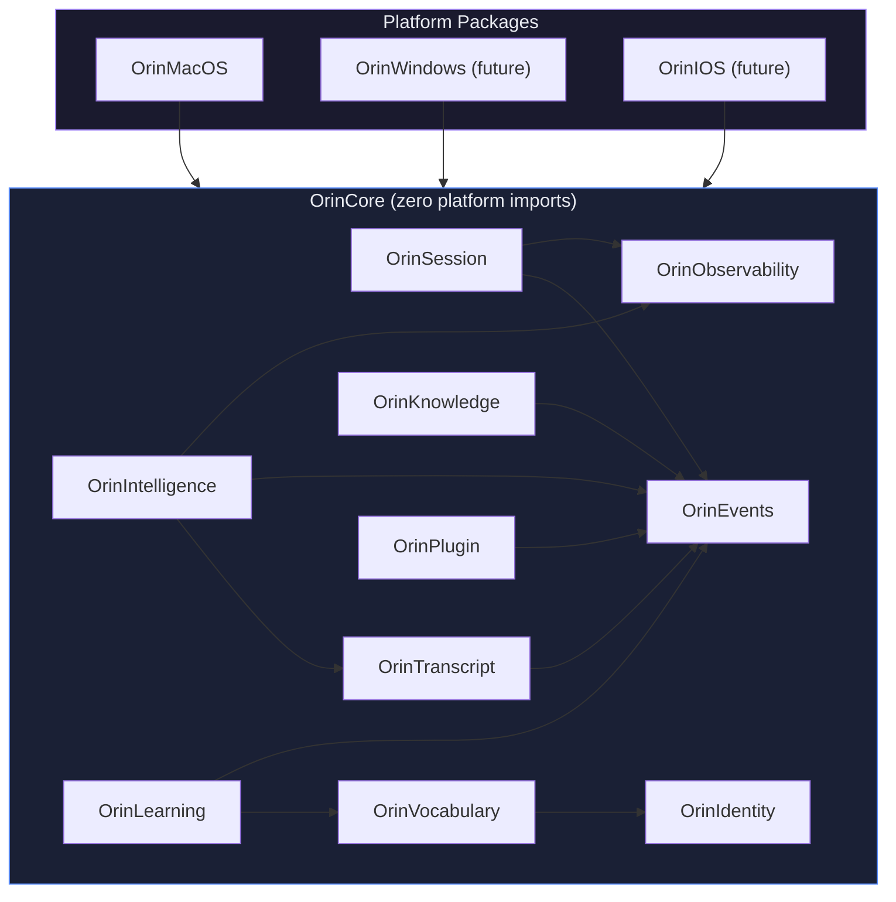
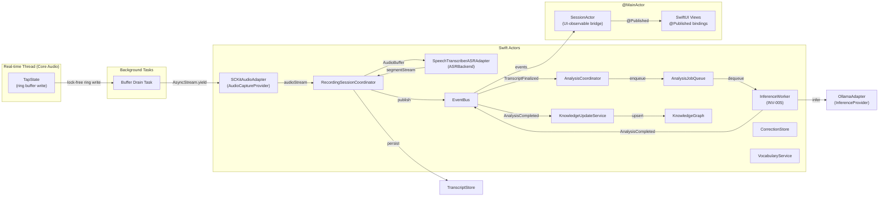
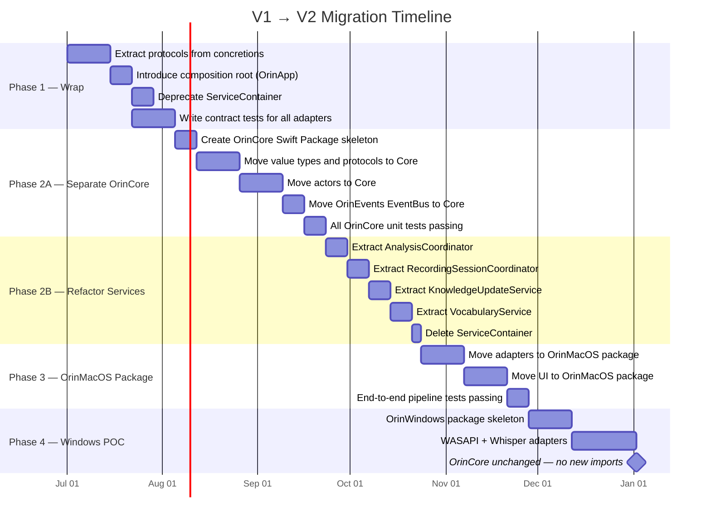

# 03 — Core Architecture V2

**Status**: Proposed  
**Author**: Chief Software Architect  
**Date**: 2026-06-29  
**Depends On**: 01-Product-Domain-Architecture.md  
**Review Required**: Yes — this document is the structural blueprint for V2. All subsequent implementation documents derive from the decisions made here.

---

## Purpose

This document defines the complete V2 architecture of the Orin system. It replaces the current monolithic `ServiceContainer`-based design with a hexagonal architecture organised into isolated Swift Packages. Every section is intended to be directly implementable by a senior engineer without further design clarification.

The document is intentionally prescriptive. Where a choice has been made, the choice is stated and defended. Where options remain open, they are explicitly marked `[OPEN]` with the decision criteria needed to resolve them.

---

## 1. Architecture Style

### 1.1 Chosen Style: Hexagonal Architecture (Ports and Adapters)

V2 adopts **Hexagonal Architecture** as defined by Alistair Cockburn (2005), with the following mapping to Orin's problem domain:

| Hexagonal Concept | Orin Equivalent |
|-------------------|-----------------|
| **Application core** | `OrinCore` Swift Package — pure domain logic |
| **Port (driving)** | UI protocols, CLI entry points, test harnesses |
| **Port (driven)** | `ASRBackend`, `InferenceProvider`, `AudioCaptureProvider`, `PersistenceStore`, `CalendarProvider`, `SyncProvider` |
| **Adapter (driving)** | `SwiftUI` layer, `XCTest` harnesses, future CLI |
| **Adapter (driven)** | `SCKitAudioAdapter`, `SpeechTranscriberASRAdapter`, `OllamaInferenceAdapter`, `SwiftDataPersistenceAdapter` |

### 1.2 Justification

The overriding constraint is **Document 01, Section 4 — Core Principles**: every function must work without network, and the system must be portable to Windows and iOS within 12–16 months (Phase 3/4).

That portability requirement alone disqualifies both the current monolithic design and a layered architecture:

- A **monolith** (current state) couples domain logic to platform APIs. Moving to Windows requires rewriting logic interleaved with `AVAudioEngine` and `SFSpeechRecognizer` calls.
- A **layered architecture** defines dependencies top-to-bottom but does not enforce that the domain layer is free of infrastructure. In practice, domain layers accumulate `import AVFoundation` lines.
- **Hexagonal architecture** enforces the constraint via Swift Package boundaries enforced by the compiler. `OrinCore` has zero platform-specific imports. The compiler will reject any attempt to introduce them. This is not a convention; it is a hard build-time rule.

Additional benefits:

1. **Testability without hardware**: `OrinCore` unit tests run on any machine with a Swift toolchain. No microphone, no GPU, no macOS-specific entitlements required.
2. **Adapter substitution**: swapping `SFSpeechASRAdapter` for `SpeechTranscriberASRAdapter` requires changing one line in the composition root. The domain never changes.
3. **Parallel platform development**: `OrinWindows` can develop its adapter suite independently of `OrinMacOS` while sharing the entire `OrinCore`.
4. **Explicit contracts**: every protocol (port) is a written, tested contract. Regressions surface at compile time or in contract test suites, not in production.

### 1.3 What Hexagonal Architecture Does Not Solve

Hexagonal architecture does not automatically solve:

- **Performance** — the audio pipeline performance constraints are addressed in the Concurrency Model (Section 6) and the Data Flow (Section 7).
- **Distributed consistency** — the sync architecture is addressed in a separate document (07-Sync-Architecture).
- **Security** — the entitlement and sandbox model is addressed in document 08.

### 1.4 Ports Defined

The following protocols, defined fully in Document 01, constitute the **driven ports** of `OrinCore`:

```swift
// Audio capture — driven port
protocol AudioCaptureProvider: Actor {
    var audioStream: AsyncStream<AudioBuffer> { get }
    func startCapture(configuration: AudioCaptureConfiguration) async throws
    func stopCapture() async
}

// ASR — driven port
protocol ASRBackend: Actor {
    func startSession(vocabulary: VocabularyContext) async throws
    func process(_ buffer: AudioBuffer) async
    var segmentStream: AsyncStream<TranscriptSegment> { get }
    func stopSession() async
}

// Inference — driven port
protocol InferenceProvider: Actor {
    var modelID: ModelID { get }
    var isAvailable: Bool { get async }
    func infer(prompt: String, parameters: InferenceParameters) async throws -> String
}

// Persistence — driven port
protocol PersistenceStore: Actor {
    func save<T: PersistableAggregate>(_ aggregate: T) async throws
    func fetch<T: PersistableAggregate>(_ id: AggregateID) async throws -> T?
    func fetchAll<T: PersistableAggregate>(_ type: T.Type, predicate: Predicate<T>?) async throws -> [T]
    func delete<T: PersistableAggregate>(_ id: AggregateID, type: T.Type) async throws
}

// Calendar — driven port
protocol CalendarProvider {
    func upcomingMeetings(within: TimeInterval) async throws -> [CalendarEvent]
    func meeting(for date: Date) async throws -> CalendarEvent?
}

// Sync — driven port (future)
protocol SyncProvider: Actor {
    func push(_ envelope: SyncEnvelope) async throws
    func pull(since: Date) async throws -> [SyncEnvelope]
}
```

The **driving ports** (entry points into the core from outside) are the public methods of the service layer coordinators defined in Section 4.

---

## 2. Module Structure

The system is organised into four Swift Packages. The package boundary is the enforcement mechanism for the hexagonal rule: `OrinCore` lists no platform targets in its `Package.swift`. The Swift compiler will reject any `import` that crosses this boundary.

### 2.1 `OrinCore` — Zero Platform Imports

`OrinCore` is the application core. It contains all domain logic, all port protocols, all domain events, and all value types. It has no knowledge of how audio is captured, how speech is recognised, or how data is persisted.

**Allowed imports**: `Foundation` (for `UUID`, `Date`, `Codable`), `Combine` (for `Publisher` in domain event streams), `os.log` (for structured logging abstracted behind `OrinObservability`).

**Prohibited imports**: `AVFoundation`, `CoreML`, `SwiftData`, `AppKit`, `UIKit`, `EventKit`, `ScreenCaptureKit`, `Speech`, `UserNotifications`, anything with a platform availability annotation.

```
OrinCore/
  Sources/
    OrinSession/
      Session.swift                  # Session aggregate, root entity
      SessionState.swift             # State machine enum + valid transitions
      SessionManager.swift           # Aggregate factory and lifecycle orchestration
      Participant.swift              # Participant value object
      AudioChannel.swift             # AudioChannel value object
      SessionID.swift                # Typed identifier

    OrinTranscript/
      Transcript.swift               # Transcript aggregate
      TranscriptSegment.swift        # Immutable value object (INV-003)
      TranscriptStore.swift          # Port — repository interface for Transcript
      SegmentOverlay.swift           # Correction overlay (never mutates base segment)
      TranscriptID.swift

    OrinIntelligence/
      MeetingIntelligenceService.swift   # Orchestrates chunking → inference → merge
      InferenceWorker.swift              # Swift actor — owns single inference slot (INV-005)
      AnalysisJobQueue.swift             # Swift actor — serialises cross-meeting analysis
      TranscriptChunker.swift            # Pure function: segments → chunks
      AnalysisJob.swift                  # Value type: job descriptor
      MeetingAnalysis.swift              # Output aggregate: summary, actionItems, decisions
      ActionItem.swift                   # Value object
      Decision.swift                     # Value object
      ModelRouter.swift                  # Port — selects InferenceProvider for a job
      PromptStrategy.swift               # Port — builds prompts from chunks
      InferenceProvider.swift            # Port — driven port protocol
      InferenceParameters.swift
      ModelID.swift

    OrinKnowledge/
      KnowledgeGraph.swift           # Swift actor — owns graph mutation
      KnowledgeNode.swift            # Entity: Person, Company, Project, Product, Concept, Decision
      KnowledgeEdge.swift            # Directional, typed, timestamped relationship
      EntityExtractor.swift          # Port — driven port protocol
      RelationshipBuilder.swift      # Domain service: edges from entity pairs + session context
      NodeID.swift

    OrinLearning/
      CorrectionStore.swift          # Swift actor — owns correction data
      Correction.swift               # Value object: original segment + correction text
      PromotionEngine.swift          # Domain service: corrections → VocabularyPromotion events
      VocabularyLearner.swift        # Listens for PromotionSuggested, coordinates with VocabularyContext

    OrinVocabulary/
      VocabularyProfile.swift        # Aggregate: all tiers for a user+org pair
      VocabularyItem.swift           # Value object (INV-007: max 100 per session)
      VocabularyContext.swift        # Built context delivered to ASRBackend
      VocabularyContextBuilder.swift # Domain service: merges tiers into context
      LanguagePack.swift             # Built-in tier for a language code
      VocabularyTier.swift           # Enum: Session > User > Org > BuiltIn

    OrinIdentity/
      User.swift                     # Aggregate
      Organization.swift             # Aggregate
      Contact.swift                  # Entity
      CalendarEvent.swift            # Value object
      CalendarProvider.swift         # Port — driven port protocol
      ConsentRecord.swift            # Value object (INV-010: required before transmission)

    OrinEvents/
      EventBus.swift                 # Swift actor — dispatches domain events
      EventEnvelope.swift            # Typed wrapper: eventID, occurredAt, payload
      DomainEvent.swift              # Protocol all events conform to
      SessionEvents.swift            # SessionDetected, SessionStarted, SessionStopped, etc.
      TranscriptEvents.swift         # SegmentAdded, LanguageDetected, TranscriptFinalized
      IntelligenceEvents.swift       # AnalysisQueued, AnalysisStarted, ChunkAnalyzed, AnalysisCompleted
      KnowledgeEvents.swift          # EntityExtracted, RelationshipDiscovered, KnowledgeUpdated
      LearningEvents.swift           # CorrectionRecorded, VocabularyPromotionSuggested, VocabularyPromoted
      VocabularyEvents.swift         # VocabularyContextBuilt
      PluginEvents.swift             # PluginInstalled, UserIntent[*]
      DegradationEvents.swift        # AudioChannelDegraded, AnalysisFailed, ASRUnavailable

    OrinObservability/
      Logger.swift                   # Abstraction over os.log — OrinCore-safe
      MetricCollector.swift          # Port — driven port: collects timing/count metrics
      AuditLog.swift                 # Port — driven port: writes audit entries
      PerformanceBudget.swift        # Constants: latency budgets per operation

    OrinPlugin/
      Plugin.swift                   # Aggregate: metadata, capability manifest, lifecycle state
      PluginRegistry.swift           # Swift actor — owns plugin registration
      CapabilityGrant.swift          # Value object: what a plugin is permitted to do
      IntentRouter.swift             # Routes UserIntent events to registered plugins
```

### 2.2 `OrinMacOS` — macOS Platform Package

`OrinMacOS` imports `OrinCore` and provides concrete adapters for every port. It also contains the SwiftUI layer.

```
OrinMacOS/
  Sources/
    Audio/
      SCKitAudioAdapter.swift          # AudioCaptureProvider — ScreenCaptureKit system audio
      AVAudioEngineAdapter.swift       # AudioCaptureProvider — AVAudioEngine microphone
      TapState.swift                   # Real-time tap bookkeeping (no allocations on audio thread)
      MicTranscriberFeed.swift         # Routes mic audio to active ASRBackend
      AudioBuffer+Extensions.swift

    ASR/
      SpeechTranscriberASRAdapter.swift  # ASRBackend — SpeechTranscriber (Phase 2A, gated)
      SFSpeechASRAdapter.swift           # ASRBackend — SFSpeechRecognizer (legacy, Phase 1)
      WhisperASRAdapter.swift            # ASRBackend — Whisper.cpp via C interop (future)
      ASRAdapterFactory.swift            # Reads FeatureFlags, returns correct adapter

    Inference/
      OllamaInferenceAdapter.swift         # InferenceProvider — Ollama HTTP API
      LMStudioInferenceAdapter.swift       # InferenceProvider — LM Studio HTTP API
      AppleFoundationModelsAdapter.swift   # InferenceProvider — Apple Foundation Models (gated)

    Detection/
      macOSMeetingDetectorAdapter.swift    # MeetingDetector — SCKit + AppleScript + EventKit + Accessibility
      MeetingDetectorService.swift         # @MainActor coordinator — owned by OrinMacOS, not OrinCore

    Persistence/
      SwiftDataPersistenceAdapter.swift    # PersistenceStore — SwiftData backend
      SwiftDataMeetingStore.swift          # Typed convenience layer over SwiftDataPersistenceAdapter
      SwiftDataSchema.swift                # @Model definitions — isolated to this file

    Calendar/
      EventKitCalendarAdapter.swift        # CalendarProvider — EventKit

    Observability/
      OSLogMetricCollector.swift           # MetricCollector — os.signpost + OSLog
      OSLogAuditLog.swift                  # AuditLog — structured OSLog

    Composition/
      OrinApp.swift                        # Composition root — wires all adapters (see Section 5)
      FeatureFlags.swift                   # Typed struct (see Section 8)
      ServiceWiring.swift                  # Adapter selection logic

    UI/
      MainContainerView.swift
      MeetingsView.swift
      MeetingDetailView.swift
      TranscriptView.swift
      AnalysisView.swift
      KnowledgeGraphView.swift
      SettingsView.swift
      Components/                          # Reusable SwiftUI components
```

### 2.3 `OrinWindows` — Windows Platform Package (Future, Phase 3)

```
OrinWindows/
  Sources/
    Audio/
      WASAPIAudioAdapter.swift             # AudioCaptureProvider — Windows Audio Session API
    ASR/
      WindowsSTTASRAdapter.swift           # ASRBackend — Windows.Media.SpeechRecognition
      WhisperASRAdapter.swift              # ASRBackend — Whisper.cpp (shared with macOS)
    Inference/
      OllamaInferenceAdapter.swift         # InferenceProvider — same HTTP API, different binary
      LMStudioInferenceAdapter.swift
      WindowsMLAdapter.swift               # InferenceProvider — Windows ML (DirectML)
    Detection/
      WindowsMeetingDetectorAdapter.swift  # MeetingDetector — COM automation + Win32 hooks
    Persistence/
      GRDBPersistenceAdapter.swift         # PersistenceStore — GRDB (SQLite, cross-platform)
    Composition/
      OrinWindowsApp.swift                 # Composition root for Windows
      FeatureFlags+Windows.swift
```

### 2.4 `OrinIOS` — iOS Platform Package (Future, Phase 4)

```
OrinIOS/
  Sources/
    Audio/
      AVAudioSessionMicAdapter.swift       # AudioCaptureProvider — mic only (no system audio on iOS)
    ASR/
      SpeechTranscriberASRAdapter.swift    # Shared with macOS via OrinCore protocol
      WhisperASRAdapter.swift
    Inference/
      CoreMLInferenceAdapter.swift         # InferenceProvider — CoreML on-device
      AppleFoundationModelsAdapter.swift   # InferenceProvider — Apple Foundation Models
    Detection/
      CallKitMeetingDetectorAdapter.swift  # MeetingDetector — CallKit
    Persistence/
      SwiftDataPersistenceAdapter.swift    # Shared schema with macOS
    Composition/
      OrinIOSApp.swift
      FeatureFlags+iOS.swift
```

---

## 3. Dependency Graph

The strict rule: **`OrinCore` never imports `OrinMacOS`, `OrinWindows`, or `OrinIOS`**. This is enforced by Swift Package Manager — `OrinCore/Package.swift` lists no dependencies on platform packages. The compiler will reject any violation.



### 3.1 Internal `OrinCore` Dependency Rules

Within `OrinCore`, modules may import each other with the following constraints:

| Module | May Import | Must Not Import |
|--------|-----------|-----------------|
| `OrinSession` | `OrinEvents`, `OrinObservability` | Everything else |
| `OrinTranscript` | `OrinSession`, `OrinEvents`, `OrinObservability` | `OrinIntelligence` |
| `OrinIntelligence` | `OrinTranscript`, `OrinSession`, `OrinEvents`, `OrinObservability` | `OrinKnowledge` (events only) |
| `OrinKnowledge` | `OrinEvents`, `OrinObservability` | `OrinIntelligence` |
| `OrinLearning` | `OrinVocabulary`, `OrinTranscript`, `OrinEvents` | `OrinIntelligence`, `OrinKnowledge` |
| `OrinVocabulary` | `OrinIdentity`, `OrinEvents` | All others |
| `OrinIdentity` | `OrinEvents` | All domain modules |
| `OrinEvents` | `Foundation` only | All domain modules (prevents circular) |
| `OrinObservability` | `Foundation`, `os.log` | All domain modules |
| `OrinPlugin` | `OrinEvents` | All domain modules directly |

Cross-context communication routes through `OrinEvents.EventBus`, not direct imports. This enforces the bounded context boundaries defined in Document 01.

---

## 4. Service Layer

The service layer contains orchestration coordinators. These live in `OrinMacOS` (or the equivalent platform package), not in `OrinCore`. They hold no domain logic — they translate between the outside world and domain objects, and they react to domain events.

Each coordinator is a Swift actor. Each subscribes to specific event types from `EventBus`. Each delegates to domain services for all business decisions.

### 4.1 `RecordingSessionCoordinator`

**Responsibility**: start and stop the audio capture and ASR pipeline for a session.

```swift
actor RecordingSessionCoordinator {
    private let sessionManager: SessionManager           // OrinCore
    private let audioCapture: any AudioCaptureProvider  // adapter — injected
    private let asrBackend: any ASRBackend               // adapter — injected
    private let transcriptStore: any TranscriptStore     // adapter — injected
    private let eventBus: EventBus                       // OrinCore
    private let vocabularyService: VocabularyService     // peer service — injected

    // Entry point from UI or MeetingDetectorAdapter
    func beginRecording(for session: Session) async throws {
        let context = await vocabularyService.buildContext(for: session)
        try await asrBackend.startSession(vocabulary: context)
        try await audioCapture.startCapture(configuration: session.audioConfiguration)
        await eventBus.publish(SessionStarted(sessionID: session.id))
        await pipeAudioToASR()
    }

    func endRecording(for sessionID: SessionID) async {
        await audioCapture.stopCapture()
        await asrBackend.stopSession()
        let transcript = await transcriptStore.finalize(sessionID: sessionID)
        await eventBus.publish(TranscriptFinalized(sessionID: sessionID, transcriptID: transcript.id))
        await eventBus.publish(SessionStopped(sessionID: sessionID))
    }

    // Segment routing — called on audio thread bridge, must be non-blocking
    private func pipeAudioToASR() async { ... }
}
```

**Invariants enforced**:
- `INV-011`: audio callbacks route through `TapState` before crossing to the actor. No allocation on the Core Audio thread.
- `INV-012`: no NSLock held while performing IPC.
- `INV-010`: `ConsentRecord` is checked before `TranscriptStore.finalize()` persists text.

### 4.2 `AnalysisCoordinator`

**Responsibility**: listen for `TranscriptFinalized` events, enqueue analysis jobs, monitor progress, and write results to persistence.

```swift
actor AnalysisCoordinator {
    private let jobQueue: AnalysisJobQueue               // OrinCore
    private let intelligenceService: MeetingIntelligenceService  // OrinCore
    private let persistenceStore: any PersistenceStore   // adapter — injected
    private let eventBus: EventBus                       // OrinCore
    private var subscriptions: [EventSubscription] = []

    func start() async {
        subscriptions.append(
            await eventBus.subscribe(TranscriptFinalized.self) { [weak self] event in
                await self?.handleTranscriptFinalized(event)
            }
        )
    }

    private func handleTranscriptFinalized(_ event: TranscriptFinalized) async {
        let job = AnalysisJob(transcriptID: event.transcriptID, sessionID: event.sessionID)
        await jobQueue.enqueue(job)
        await eventBus.publish(AnalysisQueued(jobID: job.id, sessionID: event.sessionID))
    }
}
```

**Key design decision**: `AnalysisCoordinator` does not call `MeetingIntelligenceService` directly. It enqueues a job in `AnalysisJobQueue`. The queue serialises execution and enforces `INV-005` (one inference job at a time). This eliminates the thundering-herd defect present in the current `MeetingIntelligenceService` (41-request burst).

### 4.3 `KnowledgeUpdateService`

**Responsibility**: listen for `AnalysisCompleted` events, run entity extraction, and write to `KnowledgeGraph`.

```swift
actor KnowledgeUpdateService {
    private let graph: KnowledgeGraph                    // OrinCore
    private let extractor: any EntityExtractor           // adapter — injected
    private let relationshipBuilder: RelationshipBuilder // OrinCore
    private let eventBus: EventBus                       // OrinCore

    func start() async {
        await eventBus.subscribe(AnalysisCompleted.self) { [weak self] event in
            // Runs asynchronously — does not block AnalysisCoordinator
            await self?.process(event.analysis, sessionID: event.sessionID)
        }
    }

    private func process(_ analysis: MeetingAnalysis, sessionID: SessionID) async {
        let entities = await extractor.extract(from: analysis)
        for entity in entities {
            await graph.upsertNode(entity)
        }
        let edges = relationshipBuilder.buildEdges(entities: entities, sessionID: sessionID)
        for edge in edges {
            await graph.addEdge(edge)
        }
        await eventBus.publish(KnowledgeUpdated(sessionID: sessionID, nodeCount: entities.count))
    }
}
```

### 4.4 `VocabularyService`

**Responsibility**: listen for `SessionStarted` events, build `VocabularyContext`, and deliver it to the active `ASRBackend`.

```swift
actor VocabularyService {
    private let contextBuilder: VocabularyContextBuilder  // OrinCore
    private let profileStore: any PersistenceStore        // adapter — injected
    private let eventBus: EventBus                        // OrinCore
    private var cachedContext: VocabularyContext?

    func buildContext(for session: Session) async -> VocabularyContext {
        let profile = await loadProfile(for: session)
        let context = contextBuilder.build(profile: profile, session: session)
        cachedContext = context
        await eventBus.publish(VocabularyContextBuilt(sessionID: session.id, termCount: context.terms.count))
        return context
    }

    // INV-007: VocabularyContextBuilder enforces the 100-term limit
    private func loadProfile(for session: Session) async -> VocabularyProfile { ... }
}
```

---

## 5. Dependency Injection

### 5.1 Composition Root

The composition root is `OrinApp.init()` — the single place where adapter selection occurs and all dependencies are wired. No other location in the codebase creates adapter instances.

```swift
@main
struct OrinApp: App {
    // All adapters selected at compile time based on FeatureFlags
    private let flags = FeatureFlags.current
    private let eventBus = EventBus()

    // Adapters
    private let audioCapture: any AudioCaptureProvider
    private let asrBackend: any ASRBackend
    private let inferenceProviders: [any InferenceProvider]
    private let persistenceStore: any PersistenceStore
    private let calendarProvider: any CalendarProvider
    private let entityExtractor: any EntityExtractor

    init() {
        // Audio capture: always SCKit for system audio on macOS
        self.audioCapture = SCKitAudioAdapter()

        // ASR: gated by Phase 2A feature flag
        self.asrBackend = flags.useNewASRPipeline
            ? SpeechTranscriberASRAdapter()
            : SFSpeechASRAdapter()

        // Inference: all available providers are registered; ModelRouter selects at runtime
        self.inferenceProviders = [
            OllamaInferenceAdapter(endpoint: flags.ollamaEndpoint),
            LMStudioInferenceAdapter(endpoint: flags.lmStudioEndpoint),
        ] + (flags.useAppleFoundationModels ? [AppleFoundationModelsAdapter()] : [])

        self.persistenceStore = SwiftDataPersistenceAdapter()
        self.calendarProvider = EventKitCalendarAdapter()
        self.entityExtractor = RegexEntityExtractor()   // default; ML-based adapter is a future flag

        // Wire core services
        let sessionManager = SessionManager(eventBus: eventBus)
        let transcriptStore = SwiftDataTranscriptStore(persistence: persistenceStore)
        let knowledgeGraph = KnowledgeGraph(eventBus: eventBus)
        let jobQueue = AnalysisJobQueue()
        let inferenceWorker = InferenceWorker(providers: inferenceProviders)
        let vocabularyContextBuilder = VocabularyContextBuilder()

        // Wire coordinators
        let vocabularyService = VocabularyService(
            contextBuilder: vocabularyContextBuilder,
            profileStore: persistenceStore,
            eventBus: eventBus
        )
        let recordingCoordinator = RecordingSessionCoordinator(
            sessionManager: sessionManager,
            audioCapture: audioCapture,
            asrBackend: asrBackend,
            transcriptStore: transcriptStore,
            eventBus: eventBus,
            vocabularyService: vocabularyService
        )
        let analysisCoordinator = AnalysisCoordinator(
            jobQueue: jobQueue,
            intelligenceService: MeetingIntelligenceService(worker: inferenceWorker),
            persistenceStore: persistenceStore,
            eventBus: eventBus
        )
        let knowledgeUpdateService = KnowledgeUpdateService(
            graph: knowledgeGraph,
            extractor: entityExtractor,
            relationshipBuilder: RelationshipBuilder(),
            eventBus: eventBus
        )

        // Start all coordinators — they self-subscribe to EventBus
        Task {
            await analysisCoordinator.start()
            await knowledgeUpdateService.start()
        }
    }
}
```

### 5.2 Protocol-Typed Properties

All service dependencies are declared as protocol types, never as concrete types:

```swift
// Correct — protocol type
private let asrBackend: any ASRBackend

// Incorrect — concrete type (never do this outside the composition root)
private let asrBackend: SpeechTranscriberASRAdapter
```

The only location where a concrete type name appears outside of the type's own file is `OrinApp.init()`.

### 5.3 ServiceContainer Deprecation

`ServiceContainer` is deprecated as of V2. The migration strategy is:

1. Introduce `OrinApp`-level composition root (Phase 1 milestone).
2. For each service currently registered in `ServiceContainer`, replace its retrieval with an injected dependency.
3. Once all retrieval sites are converted, delete `ServiceContainer`.
4. The process is tracked per-service in the Phase 1 migration tickets.

### 5.4 Testing Without a Service Locator

Test doubles are injected at the composition root in tests. There is no `ServiceContainer.shared` to replace:

```swift
// XCTest — inject in-memory doubles directly
func testAnalysisCompletionWritesToPersistence() async throws {
    let mockPersistence = InMemoryPersistenceStore()
    let mockInference = StubInferenceProvider(returns: "## Summary\nTest summary")
    let eventBus = EventBus()
    let coordinator = AnalysisCoordinator(
        jobQueue: AnalysisJobQueue(),
        intelligenceService: MeetingIntelligenceService(
            worker: InferenceWorker(providers: [mockInference])
        ),
        persistenceStore: mockPersistence,
        eventBus: eventBus
    )
    await coordinator.start()
    await eventBus.publish(TranscriptFinalized(sessionID: .test, transcriptID: .test))
    // Assert persistence received a MeetingAnalysis
    let analysis = try await mockPersistence.fetch(MeetingAnalysis.self, id: .test)
    XCTAssertNotNil(analysis)
}
```

---

## 6. Concurrency Model

### 6.1 Actor Topology

V2 uses Swift's structured concurrency throughout. The following actors form the backbone of the concurrent system:

| Actor | Isolation | Owns | Notes |
|-------|-----------|------|-------|
| `SessionActor` | custom actor | Session state machine | Observed by UI via `@Published` bridge on `@MainActor` |
| `InferenceWorker` | Swift actor | Single active inference slot | Enforces INV-005 |
| `AnalysisJobQueue` | Swift actor | Job queue, priority ordering | Serialises multi-meeting analysis |
| `EventBus` | Swift actor | Event subscription list, dispatch | All publish/subscribe is actor-isolated |
| `KnowledgeGraph` | Swift actor | Graph nodes and edges | Writer serialisation; readers may hold snapshots |
| `CorrectionStore` | Swift actor | Correction data | Single writer, multiple readers via copy |
| `RecordingSessionCoordinator` | Swift actor | Audio pipeline coordination | Does not touch audio thread directly |
| `AnalysisCoordinator` | Swift actor | Job enqueue and result persistence | |
| `KnowledgeUpdateService` | Swift actor | Entity extraction pipeline | Runs independently of analysis path |
| `VocabularyService` | Swift actor | Context building and caching | |
| All SwiftUI views | `@MainActor` | UI rendering | All `@Published` properties observed here |

### 6.2 Audio Thread Boundary

The real-time Core Audio thread is not an actor. It executes the `AVAudioEngine` tap callback on a real-time thread with hard latency constraints. The following rules are absolute and correspond to `INV-011` and `INV-012`:

- **No allocation** on the audio thread. All buffers are pre-allocated in `TapState.init()`.
- **No actor crossing** from the audio thread. The tap writes into a lock-free ring buffer (`AudioRingBuffer`).
- **No NSLock held** while performing IPC or sending data across process boundaries.
- **One NSLock** guards the ring buffer write. It is held for the minimum possible duration.
- A background task drains the ring buffer and delivers `AudioBuffer` values into `audioCapture.audioStream`.

```swift
// TapState — lives on the audio thread side of the boundary
final class TapState: @unchecked Sendable {
    private let ringBuffer: AudioRingBuffer   // pre-allocated, fixed capacity
    private let lock = NSLock()

    // Called on Core Audio real-time thread — no allocation, no actor crossings
    func writeSamples(_ buffer: AVAudioPCMBuffer) {
        lock.withLock {
            ringBuffer.write(buffer)   // memcpy only
        }
    }

    // Called on background task — delivers to AsyncStream
    func drain(into continuation: AsyncStream<AudioBuffer>.Continuation) {
        lock.withLock {
            while let buffer = ringBuffer.read() {
                continuation.yield(buffer)
            }
        }
    }
}
```

### 6.3 Actor Topology Diagram



### 6.4 Structured Concurrency Rules

1. **Task hierarchy**: long-lived background tasks are children of `OrinApp`'s implicit task tree. Detached tasks (`Task.detached`) are prohibited except in the audio drain loop.
2. **Cancellation**: every async operation checks for `Task.isCancelled` at its outermost loop boundary.
3. **Timeouts**: inference calls carry a per-provider timeout defined in `InferenceParameters`. A timed-out job posts `AnalysisFailed` — it does not retry automatically.
4. **No `@unchecked Sendable` on mutable types**: `TapState` is `@unchecked Sendable` precisely because it manually manages its own locking. All other types either conform to `Sendable` through value semantics or actor isolation.

---

## 7. Data Flow

The complete path from microphone audio to UI-displayed analysis result, covering every transformation step.

```mermaid
flowchart TD
    MIC["Microphone / System Audio\n(hardware)"]
    SCK["ScreenCaptureKit SCStream\nor AVAudioEngine tap"]
    TAP["TapState.writeSamples()\nCore Audio real-time thread\nINV-011: no allocation"]
    RING["AudioRingBuffer\nlock-free ring buffer"]
    DRAIN["Drain Task\nbackground task"]
    STREAM["audioCapture.audioStream\nAsyncStream of AudioBuffer"]
    RSC["RecordingSessionCoordinator\nroutes buffers to ASRBackend"]
    ASR["ASRBackend\nSpeechTranscriberASRAdapter\nor SFSpeechASRAdapter"]
    SEG["TranscriptSegment\nimmutable value: speaker, text, startTime, endTime, confidence"]
    TRANS["TranscriptStore\nappends segment (INV-003: no mutation)"]
    FINALIZE["TranscriptFinalized event\npublished to EventBus"]
    AC["AnalysisCoordinator\nlistens for TranscriptFinalized"]
    JOB["AnalysisJob\nenqueued in AnalysisJobQueue"]
    CHUNK["TranscriptChunker\nsegments → ordered chunks\n(overlap-aware windowing)"]
    PROMPT["PromptStrategy\nchunk → structured prompt"]
    IW["InferenceWorker\nINV-005: one job at a time"]
    OLLAMA["OllamaInferenceAdapter\nHTTP POST /api/generate"]
    RESP["Raw LLM response string"]
    PARSE["ResponseParser\ntext → MeetingAnalysis\n(summary, actionItems, decisions)"]
    PERSIST["SwiftDataPersistenceAdapter\npersist MeetingAnalysis"]
    EVT["AnalysisCompleted event"]
    KUS["KnowledgeUpdateService\nextract entities + relationships"]
    KG["KnowledgeGraph\nupsert nodes and edges"]
    SA["SessionActor\nupdate observable state"]
    UI["SwiftUI MeetingDetailView\nDisplay analysis to user"]

    MIC --> SCK
    SCK --> TAP
    TAP -->|"memcpy only"| RING
    RING -->|"lock-guarded drain"| DRAIN
    DRAIN -->|"AsyncStream.yield"| STREAM
    STREAM --> RSC
    RSC --> ASR
    ASR -->|"segmentStream"| SEG
    SEG --> TRANS
    TRANS -->|"on stopRecording"| FINALIZE
    FINALIZE --> AC
    AC --> JOB
    JOB --> CHUNK
    CHUNK --> PROMPT
    PROMPT --> IW
    IW --> OLLAMA
    OLLAMA --> RESP
    RESP --> PARSE
    PARSE --> PERSIST
    PERSIST --> EVT
    EVT --> KUS
    KUS --> KG
    EVT --> SA
    SA -->|"@Published"| UI
```



### 7.1 Data Flow Notes

**Chunking strategy**: `TranscriptChunker` divides the full transcript into overlapping windows. Default window: 2,000 tokens. Overlap: 200 tokens. Overlap is required to preserve context across chunk boundaries for action items that span multiple segments. The chunker is a pure function with no side effects.

**Prompt strategy**: `PromptStrategy` is a protocol with implementations per model family. `Phi3PromptStrategy` produces section-header-based prompts that the current parser handles. `MistralPromptStrategy` produces instruction-tuned prompts. The strategy is selected by `ModelRouter` based on the active provider's model family.

**Response parsing**: the parser is a pure function from `String` to `MeetingAnalysis`. It handles both JSON-structured output (preferred) and plain-text fallback with section headers. Parsing failure emits `AnalysisFailed` — it does not throw.

**Persistence timing**: `MeetingAnalysis` is written once, on `AnalysisCompleted`. It is not written incrementally per chunk. The full merged analysis is the unit of persistence.

---

## 8. Configuration and Feature Flags

### 8.1 Typed Feature Flag Struct

Feature flags are not `UserDefaults` string keys. They are properties on a typed `FeatureFlags` struct. `UserDefaults` is the backing store, but the struct is the only access point.

```swift
// OrinMacOS/Sources/Composition/FeatureFlags.swift
struct FeatureFlags {
    // ASR pipeline
    let useNewASRPipeline: Bool           // Phase 2A: SpeechTranscriber on-device ASR
    let useNewParticipantPipeline: Bool   // Phase 2B: per-participant transcribers (gated)

    // Inference
    let ollamaEndpoint: URL
    let lmStudioEndpoint: URL
    let useAppleFoundationModels: Bool    // Gated on macOS 26+ availability

    // Analysis
    let enableChunkOverlap: Bool          // Chunking overlap (default: true)
    let maxChunkTokens: Int               // Default: 2000
    let inferenceTimeoutSeconds: Double   // Default: 120.0

    // Knowledge graph
    let enableKnowledgeGraph: Bool        // Phase 2 feature — off by default in V1 bridge

    // Debug
    let enablePerformanceLogging: Bool
    let enableAuditLog: Bool

    static var current: FeatureFlags {
        FeatureFlags(from: UserDefaults.standard)
    }

    init(from defaults: UserDefaults) {
        useNewASRPipeline = defaults.bool(forKey: "ff.useNewASRPipeline")
        useNewParticipantPipeline = defaults.bool(forKey: "ff.useNewParticipantPipeline")
        ollamaEndpoint = defaults.url(forKey: "ff.ollamaEndpoint")
            ?? URL(string: "http://localhost:11434")!
        lmStudioEndpoint = defaults.url(forKey: "ff.lmStudioEndpoint")
            ?? URL(string: "http://localhost:1234")!
        useAppleFoundationModels = defaults.bool(forKey: "ff.useAppleFoundationModels")
        enableChunkOverlap = defaults.object(forKey: "ff.enableChunkOverlap") as? Bool ?? true
        maxChunkTokens = defaults.integer(forKey: "ff.maxChunkTokens").nonZero ?? 2000
        inferenceTimeoutSeconds = defaults.double(forKey: "ff.inferenceTimeoutSeconds").nonZero ?? 120.0
        enableKnowledgeGraph = defaults.bool(forKey: "ff.enableKnowledgeGraph")
        enablePerformanceLogging = defaults.bool(forKey: "ff.enablePerformanceLogging")
        enableAuditLog = defaults.bool(forKey: "ff.enableAuditLog")
    }
}
```

### 8.2 Feature Flags Never Appear in `OrinCore`

Feature flags are read once at the composition root (`OrinApp.init()`). The correct adapter is selected and injected. Domain code never reads a feature flag. If a domain service needs different behaviour based on a flag, that behaviour difference is expressed as a protocol with two implementations — not as an `if flags.useNewASRPipeline` branch inside domain logic.

```swift
// Wrong — flag in domain code
class MeetingIntelligenceService {
    func analyse() async {
        if FeatureFlags.current.enableChunkOverlap {  // NEVER
            ...
        }
    }
}

// Right — behaviour injected as protocol
class MeetingIntelligenceService {
    private let chunker: TranscriptChunker  // injected; implementation encodes the flag's effect
    ...
}
```

### 8.3 Remote Configuration (Future)

A future `RemoteConfigProvider` protocol will allow downloadable flag overrides for A/B testing or emergency rollbacks:

```swift
// Future — not in V2 initial scope
protocol RemoteConfigProvider {
    func fetchOverrides() async throws -> [String: Any]
}
```

When implemented, the composition root will merge remote overrides into `FeatureFlags` after local `UserDefaults` values. Remote overrides never affect security-sensitive flags (consent, entitlements). Those remain local-only.

---

## 9. Error Handling Strategy

### 9.1 Error Classification

V2 defines three error classes. Errors do not propagate across bounded context boundaries — they are converted to domain events at the boundary.

| Class | Examples | Handling |
|-------|---------|---------|
| **Domain errors** | Invalid state transition, invariant violation, malformed aggregate | Logged and converted to degradation domain events. Never propagated to UI as raw errors. |
| **Infrastructure errors** | Ollama unreachable, disk full, permission denied, NSError from OS API | Logged with full context, converted to degradation events, surfaced to UI as actionable messages. |
| **User-facing errors** | "Microphone access denied", "Analysis failed — disk is full" | Strings defined in `Localizable.strings`. Always actionable. Never contain internal type names or codes. |

### 9.2 Cross-Boundary Error Conversion

Errors do not cross bounded context boundaries. Instead, they become domain events:

```swift
// Infrastructure error in OllamaInferenceAdapter
do {
    let response = try await session.data(for: request)
    return try parseResponse(response)
} catch URLError.cannotConnectToHost {
    // Convert to domain event — do not throw out of the adapter
    await eventBus.publish(AnalysisFailed(
        jobID: job.id,
        sessionID: job.sessionID,
        reason: .inferenceProviderUnavailable
    ))
    return nil
}
```

This means `AnalysisCoordinator` never sees `URLError`. It sees `AnalysisFailed`. The UI sees the user-facing string for `AnalysisFailed.inferenceProviderUnavailable`. The chain is explicit and fully tested.

### 9.3 `fatalError` Policy

`fatalError` is permitted only where an invariant violation is **genuinely unrecoverable and the alternative is silent data corruption**.

Permitted:
```swift
// INV-005: InferenceWorker must never have two concurrent jobs
// If this invariant is violated, the queue is corrupt. Crashing is correct.
guard activeJob == nil else {
    fatalError("INV-005 violated: InferenceWorker attempted to start a second job while \(activeJob!.id) is active")
}
```

Not permitted:
```swift
// An Ollama connection failure is recoverable. Do not fatalError.
guard let response = try? await ollama.infer(...) else {
    fatalError("Inference failed")  // WRONG
}
```

The test: if a senior engineer reading the `fatalError` would say "yes, crashing here is correct because the alternative is worse", it is permitted. If the reaction is "we should handle that gracefully", it is not permitted.

### 9.4 User-Facing Error Messages

User-facing errors are defined in a dedicated enum with associated `LocalizedStringKey` values:

```swift
enum UserFacingError {
    case microphoneAccessDenied
    case screenRecordingAccessDenied
    case analysisFailed(reason: AnalysisFailureReason)
    case diskFull
    case inferenceProviderUnavailable(providerName: String)

    var title: LocalizedStringKey { ... }
    var message: LocalizedStringKey { ... }
    var recoveryAction: RecoveryAction? { ... }
}

enum RecoveryAction {
    case openSystemSettings(pane: SettingsPane)
    case retryAnalysis(sessionID: SessionID)
    case freeUpDiskSpace
    case checkOllamaRunning
}
```

Every user-facing error has a `recoveryAction`. "An error occurred" with no recovery path is never an acceptable user-facing error.

---

## 10. Testing Strategy

### 10.1 Test Categories and Scope

| Category | Location | Runs On | Uses Real Hardware | Speed |
|----------|----------|---------|-------------------|-------|
| **Unit** | `OrinCore` tests | Any Swift toolchain | No | Fast (<1s per test) |
| **Contract** | `OrinMacOS` tests | macOS | No | Fast |
| **Integration** | `OrinMacOS` tests | macOS with real entitlements | Yes (mic, screen) | Slow (minutes) |
| **End-to-end** | `OrinMacOSE2E` target | macOS with full entitlements | Yes | Slow (minutes) |
| **Performance** | `OrinPerf` target | macOS with instruments | Yes | Very slow |

### 10.2 Unit Tests — `OrinCore` with No Adapters

Because `OrinCore` has no platform imports, its unit tests run on any machine with a Swift toolchain — Linux CI, macOS CI, developer machines without microphones.

```swift
// Tests domain logic in isolation
class TranscriptChunkerTests: XCTestCase {
    func testChunkerProducesCorrectOverlap() {
        let segments = (0..<100).map { i in
            TranscriptSegment(
                speaker: "Speaker A",
                text: "Word \(i)",
                startTime: TimeInterval(i),
                endTime: TimeInterval(i) + 0.5,
                confidence: 0.95
            )
        }
        let chunker = TranscriptChunker(maxTokens: 50, overlapTokens: 10)
        let chunks = chunker.chunk(segments: segments)
        XCTAssertTrue(chunks.count > 1)
        // Verify overlap: last 10 tokens of chunk N == first 10 tokens of chunk N+1
        for i in 0..<chunks.count - 1 {
            let tailOfCurrent = chunks[i].segments.suffix(10).map(\.text)
            let headOfNext = chunks[i + 1].segments.prefix(10).map(\.text)
            XCTAssertEqual(tailOfCurrent, headOfNext)
        }
    }
}
```

### 10.3 Contract Tests — Adapter Conformance

Contract tests verify that each adapter correctly implements its protocol. They use a shared `ASRBackendContractTests` base class:

```swift
// Shared contract — any ASRBackend adapter must pass these
class ASRBackendContractTests: XCTestCase {
    var backend: (any ASRBackend)!   // set by subclass

    func testStartSessionDoesNotThrowWithValidVocabulary() async throws {
        let context = VocabularyContext.empty
        try await backend.startSession(vocabulary: context)
    }

    func testStopSessionAfterStartDoesNotThrow() async throws {
        try await backend.startSession(vocabulary: .empty)
        await backend.stopSession()
    }

    func testSegmentStreamProducesNonEmptySegmentForKnownAudio() async throws {
        // Subclass provides a 3-second WAV of known speech
        // This test verifies the adapter produces at least one segment
    }
}

// Concrete — runs against SFSpeechASRAdapter
class SFSpeechASRAdapterContractTests: ASRBackendContractTests {
    override func setUp() {
        backend = SFSpeechASRAdapter()
    }
}

// Concrete — runs against SpeechTranscriberASRAdapter
class SpeechTranscriberASRAdapterContractTests: ASRBackendContractTests {
    override func setUp() {
        backend = SpeechTranscriberASRAdapter()
    }
}
```

### 10.4 End-to-End Tests

E2E tests replay a known audio file through the full pipeline and assert that the output matches an expected fixture.

```swift
class MeetingPipelineE2ETests: XCTestCase {
    func testKnownAudioProducesExpectedTranscriptAndSummary() async throws {
        // 1. Load fixture audio (90-second WAV, known transcript)
        let audioURL = Bundle.module.url(forResource: "fixture-meeting-90s", withExtension: "wav")!

        // 2. Wire a real pipeline with StubInferenceProvider (deterministic output)
        let pipeline = E2EPipelineBuilder()
            .withAudio(url: audioURL)
            .withASR(SpeechTranscriberASRAdapter())
            .withInference(StubInferenceProvider(fixture: "fixture-analysis.json"))
            .build()

        // 3. Run
        let result = try await pipeline.run()

        // 4. Assert transcript matches expected
        let expectedTranscript = try loadFixture("fixture-transcript.json")
        XCTAssertEqual(result.transcript.segments.count, expectedTranscript.segments.count)

        // 5. Assert analysis structure is correct
        XCTAssertFalse(result.analysis.actionItems.isEmpty)
        XCTAssertFalse(result.analysis.summary.isEmpty)
    }
}
```

### 10.5 Performance Tests

Each performance-critical operation has a defined budget from `OrinObservability.PerformanceBudget`:

```swift
enum PerformanceBudget {
    static let segmentProcessingLatencyMs: Double = 200     // segment appears in UI within 200ms of utterance end
    static let chunkInferenceTimeoutSeconds: Double = 120   // single chunk inference must complete within 2 minutes
    static let vocabularyContextBuildMs: Double = 50        // context built before recording starts
    static let knowledgeGraphUpsertMs: Double = 100         // entity upsert within 100ms
    static let audioThreadCallbackBudgetMicroseconds: Double = 500  // hard real-time budget
}
```

Performance tests are run in CI on a dedicated performance runner and results are written to a metrics store for trend tracking.

---

## 11. Migration Path from V1

The migration from the current monolithic `ServiceContainer`-based architecture to V2 hexagonal architecture follows a strict rule: **no big-bang rewrite**. Every step is independently testable, independently shippable, and independently reversible.

The migration is structured in five phases, each ending in a stable, shippable state.



### 11.1 Phase 1 — Wrap (Weeks 1–6)

**Goal**: introduce protocols that wrap every existing concretion. No behaviour change. No file moves.

Steps:

1. **Define all port protocols** in a new `Protocols/` directory within the existing `Orin` target. Each protocol wraps one existing concrete class.
2. **Make each existing class conform** to its protocol. Add the protocol to the class declaration — no changes to the body.
3. **Replace concrete types at injection sites** with protocol types. Start with `ServiceContainer` retrieval sites.
4. **Introduce `OrinApp` composition root**. Move all `ServiceContainer.register()` calls into `OrinApp.init()`. Keep `ServiceContainer` alive but empty it of logic.
5. **Write contract tests** for every adapter (Section 10.3). All must pass before Phase 2 begins.
6. **Milestone gate**: all existing tests pass. No regression. `ServiceContainer` exists but is not the source of truth.

### 11.2 Phase 2A — Separate `OrinCore` (Weeks 7–12)

**Goal**: create `OrinCore` Swift Package and move value types, protocols, and domain services into it.

Steps:

1. **Create `OrinCore/Package.swift`** with no platform-specific dependencies. Verify the Swift Package builds cleanly on Linux.
2. **Move value types first**: `TranscriptSegment`, `MeetingAnalysis`, `ActionItem`, `Decision`, `VocabularyItem`, `VocabularyContext`, `CalendarEvent`, `ConsentRecord`. These have no dependencies — they move cleanly.
3. **Move port protocols**: `ASRBackend`, `InferenceProvider`, `AudioCaptureProvider`, `PersistenceStore`, `CalendarProvider`. Adapters remain in `OrinMacOS` but their import is now `import OrinCore`.
4. **Move domain services**: `TranscriptChunker`, `VocabularyContextBuilder`, `RelationshipBuilder`, `ResponseParser`. These are pure functions — they move cleanly.
5. **Move `EventBus` and all event types** to `OrinEvents` module within `OrinCore`.
6. **Run `OrinCore` unit tests on Linux CI** to verify zero platform contamination.
7. **Milestone gate**: `OrinCore` builds on Linux. All contract tests pass. All existing macOS tests pass.

### 11.3 Phase 2B — Refactor Services (Weeks 13–18)

**Goal**: extract the four coordinators, eliminate `ServiceContainer`, and introduce the actor-based service topology.

Steps:

1. **Extract `AnalysisCoordinator`** from `MeetingIntelligenceService`. This directly fixes the thundering-herd defect — `AnalysisJobQueue` serialises the 41-concurrent-request burst.
2. **Extract `RecordingSessionCoordinator`** from `RecordingService`. Introduce `TapState` ring buffer bridge.
3. **Extract `KnowledgeUpdateService`** (currently embedded in `AIService`).
4. **Extract `VocabularyService`** from scattered vocabulary construction sites.
5. **Delete `ServiceContainer`**. All retrieval sites should already be using injected protocol types from Phase 1.
6. **Milestone gate**: `ServiceContainer.swift` is deleted. All tests pass. No regression.

### 11.4 Phase 3 — `OrinMacOS` Package (Weeks 19–26)

**Goal**: move all macOS-specific code into `OrinMacOS` Swift Package. `Orin.app` becomes a thin host.

Steps:

1. **Create `OrinMacOS/Package.swift`**. This package imports `OrinCore` and platform frameworks.
2. **Move adapter implementations**: `SCKitAudioAdapter`, `SpeechTranscriberASRAdapter`, `SFSpeechASRAdapter`, `OllamaInferenceAdapter`, `SwiftDataPersistenceAdapter`, `EventKitCalendarAdapter`.
3. **Move `MeetingDetectorService`** (already `@MainActor` from TICKET-003).
4. **Move SwiftUI layer** into `OrinMacOS`. `OrinApp.swift` moves to `OrinMacOS`.
5. **The `Orin.app` target** now contains only `main.swift` with `OrinApp.main()`.
6. **Milestone gate**: `OrinCore` and `OrinMacOS` build independently. App functions identically to pre-migration.

### 11.5 Phase 4 — Windows POC (Weeks 27–40, parallel optional track)

**Goal**: validate that `OrinCore` is genuinely portable by building a minimal Windows recording pipeline that shares `OrinCore` unchanged.

Steps:

1. **Create `OrinWindows/Package.swift`** importing `OrinCore`.
2. **Implement `WASAPIAudioAdapter`** conforming to `AudioCaptureProvider`.
3. **Implement `WhisperASRAdapter`** (Whisper.cpp via C interop — same implementation as macOS).
4. **Implement `OllamaInferenceAdapter`** (same implementation as macOS — HTTP API, no platform code).
5. **Implement `GRDBPersistenceAdapter`** conforming to `PersistenceStore`.
6. **Wire in `OrinWindowsApp.init()`**.
7. **`OrinCore` must have zero new imports** as a result of this work. If any new platform-specific import appears in `OrinCore`, it is a Phase 4 blocker.
8. **Milestone gate**: a Windows build captures microphone audio, produces a transcript, and runs analysis — using unmodified `OrinCore`.

### 11.6 Migration Risk Register

| Risk | Likelihood | Impact | Mitigation |
|------|-----------|--------|-----------|
| `AVAudioEngine` tap behaviour changes when wrapped in protocol | Medium | High | Contract tests on real hardware in CI from Phase 1 |
| SwiftData schema migration required when moving models | Medium | Medium | Isolate schema to `SwiftDataSchema.swift`; write migration tests before moving |
| `SFSpeechRecognizer` cannot be wrapped without subclassing | Low | High | `SFSpeechASRAdapter` wraps it in composition, not inheritance — confirmed viable in prototype |
| Phase 2B coordinator extraction breaks existing session lifecycle | High | High | Feature-flag the new coordinators; run old and new paths in parallel for two weeks before deleting old path |
| `OrinCore` Linux build fails due to `Foundation` API gaps | Low | Medium | Use only APIs available in swift-corelibs-foundation; maintain Linux CI from Day 1 of Phase 2A |

---

## Appendix A — Invariant Enforcement Points

| Invariant | Defined In | Enforced By |
|-----------|-----------|-------------|
| INV-001: Session state machine transitions only through valid states | `SessionState.swift` | `Session.transition()` throws for invalid transitions |
| INV-003: TranscriptSegments are immutable once finalized | `TranscriptSegment.swift` | `let` properties only; `SegmentOverlay` for corrections |
| INV-005: One InferenceJob at a time per local InferenceProvider | `InferenceWorker.swift` | Guard with `fatalError` if violated |
| INV-007: At most 100 terms per session in VocabularyContext | `VocabularyContextBuilder.swift` | Precondition before context is delivered |
| INV-010: No transcript transmitted without ConsentRecord | `RecordingSessionCoordinator.swift` | Check before `TranscriptStore.finalize()` |
| INV-011: No heap allocation on Core Audio real-time I/O thread | `TapState.swift` | Pre-allocated buffers; code review gate |
| INV-012: No IPC while holding audio thread NSLock | `TapState.swift` | NSLock scope limited to ring buffer write only |

---

## Appendix B — Open Decisions

| ID | Decision | Decision Criteria |
|----|---------|------------------|
| `[OPEN-001]` | Whether `WhisperASRAdapter` uses `whisper.cpp` via C interop or a Swift wrapper library | Evaluate `swift-transformers` and `whisper.cpp` direct interop. Criterion: context switch overhead under 5ms on M1 |
| `[OPEN-002]` | Whether `KnowledgeGraph` uses an in-memory graph or SQLite-backed adjacency list | Criterion: graph query performance on 10,000 nodes must be under 100ms. Test in Phase 2B. |
| `[OPEN-003]` | `GRDBPersistenceAdapter` vs `SwiftDataPersistenceAdapter` for cross-platform persistence | GRDB is cross-platform; SwiftData is macOS/iOS only. Decision blocks Phase 3. |
| `[OPEN-004]` | Whether `AppleFoundationModelsAdapter` participates in `ModelRouter` or is always a separate fallback | Depends on Foundation Models API stability at macOS 26 GM. Revisit in Phase 2B. |

---

*Document 03 of the Orin V2 Architecture Series. Subsequent documents: 04-Session-Lifecycle, 05-Audio-Pipeline, 06-Inference-Pipeline, 07-Sync-Architecture, 08-Security-Entitlements.*
