# 04 — State Machine Architecture

**Status**: Proposed  
**Author**: Chief Software Architect  
**Date**: 2026-06-29  
**Review Required**: Yes — this document defines all lifecycle state machines for Orin. Every service that owns a stateful object must implement the machine defined here, not invent its own. Deviations require a written architectural decision record (ADR).

---

## Table of Contents

1. [Why Explicit State Machines](#1-why-explicit-state-machines)
2. [Session State Machine](#2-session-state-machine)
3. [Analysis State Machine](#3-analysis-state-machine)
4. [InferenceWorker State Machine](#4-inferenceworker-state-machine)
5. [ASR Session State Machine](#5-asr-session-state-machine)
6. [Plugin Lifecycle State Machine](#6-plugin-lifecycle-state-machine)
7. [Vocabulary Session State Machine](#7-vocabulary-session-state-machine)
8. [State Persistence](#8-state-persistence)
9. [Concurrency Safety](#9-concurrency-safety)
10. [Testing State Machines](#10-testing-state-machines)
11. [Migration from Boolean Flags](#11-migration-from-boolean-flags)
12. [Appendices](#appendices)

---

## 1. Why Explicit State Machines

### 1.1 The Problem with Boolean Flags

The current Orin codebase manages lifecycle state through a collection of independent boolean flags scattered across `RecordingService`, `SystemAudioCaptureService`, and `MeetingDetectorService`:

```swift
// Current implementation — DO NOT FOLLOW THIS PATTERN
var isRecording: Bool = false
var isCapturing: Bool = false
var isAnalyzing: Bool = false
var isTranscribing: Bool = false
var isFinalizing: Bool = false
```

This approach has a fundamental and irreparable defect: **it makes illegal states representable**. The system can arrive at `isRecording = true` while `isCapturing = false`, which is physically incoherent — you cannot be recording without capturing audio. No compiler checks this. No runtime assertion enforces it. The only enforcement is the discipline of every developer touching every flag in the correct order under concurrent access.

That discipline has already failed, producing four documented production-class bugs:

1. **Double-tap crash**: a second tap on the recording button arrives while the first tap is mid-transition through `isRecording = true`. Both see a consistent state, both proceed. Two audio engines start. The second one crashes the process.

2. **Session teardown race**: `finalize()` is called while `stopCapture()` is still in flight. Both mutate overlapping flag sets. The transcript assembly begins on a partially drained buffer.

3. **Stale recognition tasks**: the generation counter — a separate integer that approximates the role of a state machine — is read and compared by code running on a different actor from the code that writes it. TOCTOU race: the counter is incremented between the read and the guard check.

4. **@MainActor Task.sleep deadlock**: `finalize()` runs a 1.5-second `Task.sleep` on `@MainActor` to wait for audio drain. This blocks the main actor for 1.5 seconds per session stop — freezing the UI — and is the wrong mechanism anyway, because it ties timing to wall clock rather than to a drain-complete signal.

Boolean flags also make **transition guards invisible**. There is no single place to look and know: what must be true for recording to start? What is forbidden while finalizing? The answer is scattered across `if` statements throughout the call graph, duplicated inconsistently, and silently lost during refactoring.

### 1.2 What Explicit State Machines Provide

An explicit state machine replaces a collection of flags with a **single enum value** that represents the authoritative, current state of the object. Every other piece of information about state — what operations are legal, what transitions are possible, what the UI should show — is derived from that one value.

**Illegal states become unrepresentable.** If `SessionStatus` has no `Recording` case with a corresponding `notCapturing` sub-state, that combination cannot exist. The Swift type system enforces what boolean flags leave to convention.

**Transitions are explicit and guarded.** Every state change goes through a `transition(event:)` function that pattern-matches the current state against the incoming event. If the combination is not in the machine's definition, the transition is rejected — logged, not silently swallowed.

**The diagram is the specification.** The Mermaid diagrams in this document are not illustrations of code that exists elsewhere. They are the normative contract. Code that does not match these diagrams is wrong by definition.

**Testing becomes mechanical.** Given a state machine, every valid transition can be tested, every invalid transition can be tested, and property-based tests can generate random valid event sequences and verify invariants hold throughout.

**The @MainActor sleep is eliminated.** The state machine's `Stopping → Finalizing` transition fires when `AllChannelsDrained` is received as an event, not when a wall-clock timer expires. The main actor is never blocked waiting.

### 1.3 Swift Enums Make This Ergonomic

Swift's `enum` with associated values is purpose-built for this pattern. States that carry data make the associated data available only in the states where it logically exists:

```swift
enum SessionStatus: Equatable {
    case idle
    case detecting
    case confirming(since: Date, threshold: MeetingDetectionResult)
    case starting(requestedAt: Date)
    case active(startedAt: Date, channels: [AudioChannel])
    case paused(since: Date, activeSession: SessionID)
    case stopping(sessionID: SessionID)
    case finalizing(sessionID: SessionID, segmentCount: Int)
    case finalised(sessionID: SessionID, transcriptID: TranscriptID)
    case archiving(sessionID: SessionID)
    case archived(sessionID: SessionID)
    case error(SessionError, recoverable: Bool)
    case deleted
}
```

A function that needs the `startedAt` timestamp can only access it when the session is in the `.active` state. Accessing it in `.idle` is a compile error. **Associated values make illegal data access unrepresentable at compile time**, not just at runtime.

The Codable-friendly version for persistence uses a string-rawValue parallel enum:

```swift
enum SessionStatusCode: String, Codable {
    case idle, detecting, confirming, starting, active, paused
    case stopping, finalizing, finalised, archiving, archived
    case error, deleted
}
```

The rich enum and the Codable enum are kept synchronized: the persistence layer converts between them, carrying associated values as separate persisted properties.

### 1.4 The Migration Commitment

All state machines in this document replace existing boolean flag implementations. The migration path for each machine is defined in Section 11. The general rule: introduce the enum first, keep the boolean flags temporarily as computed properties that derive from the enum, then remove the flags once all call sites have been updated. This allows incremental migration without a big-bang rewrite.

No new feature work is merged to main that introduces a new boolean lifecycle flag. All new lifecycle state must be expressed as a state machine case from day one.

---

## 2. Session State Machine

The Session State Machine is the most important in the system. It is the coordination backbone that all other contexts observe. Every other state machine in this document is either subordinate to the session state machine or operates independently of it.

### 2.1 State Definitions

| State | What Is True In This State | Entry Condition |
|-------|---------------------------|-----------------|
| `Idle` | No session active. All resources released. `MeetingDetectorService` may be running passively. | Initial state; after `Archived`; after `Deleted`; after `Error(recoverable: true)` user dismissal |
| `Detecting` | `MeetingDetectorService` is accumulating signal confidence. No audio capture. No user notification. | `SessionDetected` event — any detection signal received |
| `Confirming` | Confidence threshold crossed. A confirmation prompt is visible to the user (or auto-confirm countdown is running). No audio capture yet. | Accumulated confidence ≥ `MeetingDetector.minimumConfidence` |
| `Starting` | Audio capture initializing. ASR backend starting. Session record created in `PersistenceStore`. | User confirmed, or auto-confirm timeout elapsed |
| `Active` | Audio is being captured. Segments are being produced and persisted incrementally. Transcript is building. | All configured audio channels initialized; ASR backend emitted ready signal |
| `Paused` | Audio capture suspended. Session clock frozen. No segments produced. All channels are flushed and idle. | User-initiated pause |
| `Stopping` | Tear-down signalled. Audio capture stopping. Channels draining buffered audio. No new audio accepted. | User stopped; or `MeetingEndSignal` received from `MeetingDetectorService` |
| `Finalizing` | All audio drained. Transcript being assembled. Final segments being written. No further audio. | All audio channels confirmed their buffers empty via `ChannelDrained` events |
| `Finalised` | Transcript is complete and immutable. Analysis job has been created. | All segments finalized; transcript written to `PersistenceStore` |
| `Archiving` | Session data being moved to long-term storage. Analysis is complete or explicitly waived. | `ArchivalRequested` emitted by Intelligence Context after analysis, or user-initiated |
| `Archived` | In long-term storage. Primary-store copy may be removed. | Long-term store write confirmed and integrity-checked |
| `Error` | Unrecoverable (or pending-recovery) error. Contains a `recoverable` flag distinguishing the two. | Any state: critical failure |
| `Deleted` | All associated data permanently removed. Terminal state. No further transitions. | User-initiated explicit deletion with confirmation |

### 2.2 Complete State Diagram

```mermaid
stateDiagram-v2
    direction LR

    [*] --> Idle

    Idle --> Detecting : SessionDetected\n[any detection signal received;\ndetection enabled in preferences]

    Detecting --> Idle : DetectionAborted\n[signal below threshold for abandonTimeout;\nor detection disabled]
    Detecting --> Confirming : ThresholdCrossed\n[confidence ≥ minimumConfidence]

    Confirming --> Idle : UserDismissed\n[user explicitly rejected prompt]
    Confirming --> Starting : UserConfirmed\n[user accepted]
    Confirming --> Starting : AutoConfirmElapsed\n[auto-confirm enabled; countdown elapsed]

    Starting --> Active : AudioReady\n[all channels init'd; ASR ready signal received]
    Starting --> Error : StartFailed\n[audio or ASR init failed;\nor permission denied;\nor timeout > 10s]

    Active --> Paused : UserPaused
    Active --> Stopping : UserStopped | MeetingEndSignal

    Paused --> Active : UserResumed
    Paused --> Stopping : UserStopped

    Stopping --> Finalizing : AllChannelsDrained\n[all ChannelDrained events received;\ndrain watchdog not yet fired]
    Stopping --> Error : DrainTimeout\n[drain watchdog fires after 5s;\nsegments still in flight]

    Finalizing --> Finalised : TranscriptWritten\n[all segments written;\ntranscript marked immutable]
    Finalizing --> Error : FinalizationFailed\n[write error after 3 retries;\nor segment-loss detected]

    Finalised --> Archiving : ArchivalRequested\n[analysis complete;\nor user-initiated]
    Finalised --> Deleted : UserDeletedSession\n[explicit deletion with confirmation]

    Archiving --> Archived : ArchivalComplete\n[long-term store confirmed + integrity check passed]
    Archiving --> Error : ArchivalFailed\n[write failure after retries]

    Archived --> Deleted : UserDeletedSession\n[explicit deletion with confirmation]

    Error --> Idle : UserDismissedError\n[recoverable: true only]
    Error --> Finalizing : CrashRecoveryAccepted\n[user chose to save recovered segments]
    Error --> Deleted : UserDeletedSession\n[from any error state]

    Deleted --> [*]
```

### 2.3 Complete Transition Table

Each transition is specified with: trigger event, guard conditions, entry action, and failure mode.

---

**`Idle → Detecting`**

| Field | Value |
|-------|-------|
| **Trigger** | `SessionDetected` event published by `MeetingDetectorService` |
| **Guard** | Current state is `Idle`; detection feature enabled in user preferences |
| **Action** | Begin signal accumulation in `MeetingDetectorService`; start abandonment timer (`detection.abandonTimeout`, default 30s) |
| **Failure mode** | Not applicable — no I/O on this transition |

---

**`Detecting → Idle`**

| Field | Value |
|-------|-------|
| **Trigger** | `DetectionAborted` — signal remained below threshold for the abandonment timeout period |
| **Guard** | State is `Detecting` |
| **Action** | Cancel abandonment timer; emit `SessionDetectionAbandoned`; reset signal accumulator |
| **Failure mode** | Not applicable |

---

**`Detecting → Confirming`**

| Field | Value |
|-------|-------|
| **Trigger** | Detection confidence crosses configured minimum threshold |
| **Guard** | Accumulated confidence ≥ `MeetingDetector.minimumConfidence`; state is `Detecting` |
| **Action** | Emit `SessionConfirmationRequired`; display confirmation UI; if `autoConfirm.enabled`, start auto-confirm countdown (`autoConfirm.delay`, default 5s) |
| **Failure mode** | If UI cannot display (app backgrounded, accessibility restrictions): apply auto-confirm behavior immediately with zero delay |

---

**`Confirming → Idle`**

| Field | Value |
|-------|-------|
| **Trigger** | `UserDismissed` — user explicitly tapped "Not a meeting" or dismissed the prompt |
| **Guard** | State is `Confirming` |
| **Action** | Cancel auto-confirm countdown; emit `SessionDetectionDismissed`; reset signal accumulator |
| **Failure mode** | Not applicable |

---

**`Confirming → Starting`**

| Field | Value |
|-------|-------|
| **Trigger** | `UserConfirmed` (explicit acceptance), or `AutoConfirmElapsed` (auto-confirm timeout with no user action) |
| **Guard** | State is `Confirming`; microphone/screen recording permissions granted; at least one `InferenceProvider` registered |
| **Action** | Create `Session` record in `PersistenceStore` with status `Starting`; initialize audio channels; start `RecognitionSessionManager`; emit `SessionStarting` |
| **Failure mode** | If audio permission denied → transition to `Error(SessionError.permissionDenied, recoverable: true)` immediately. If provider unavailable → proceed to `Starting` (analysis deferral handles this, not the session). If `PersistenceStore` write fails → transition to `Error(SessionError.persistenceFailed, recoverable: false)` |

---

**`Starting → Active`**

| Field | Value |
|-------|-------|
| **Trigger** | `AudioReady` — all configured audio channels have completed initialization and `RecognitionSessionManager` emits its `Ready` signal |
| **Guard** | State is `Starting`; all channels have reported initialization success within the startup timeout window (10s) |
| **Action** | Begin segment production; start session clock; emit `SessionStarted`; update `PersistenceStore` session record to `Active` |
| **Failure mode** | If not all channels ready within 10s → `StartTimeout` → transition to `Error(SessionError.startTimeout, recoverable: true)` |

---

**`Starting → Error`**

| Field | Value |
|-------|-------|
| **Trigger** | Audio capture initialization failure, permission denial, or startup timeout |
| **Guard** | State is `Starting` |
| **Action** | Release any partially-initialized resources (audio engine, recognition request); emit `SessionStartFailed` with reason; transition to `Error`. `recoverable: true` if audio permission can be re-requested; `false` if hardware unavailable |
| **Failure mode** | The `Error` state entry action is best-effort cleanup — log but do not throw from cleanup failures |

---

**`Active → Paused`**

| Field | Value |
|-------|-------|
| **Trigger** | User-initiated pause action |
| **Guard** | State is `Active` |
| **Action** | Signal `SystemAudioCaptureService` to suspend tap; flush current audio buffer; pause `RecognitionSessionManager`; freeze session clock; emit `SessionPaused` |
| **Failure mode** | If audio engine cannot suspend cleanly: log warning `"audio-suspend-failed"`, mark channel as `suspended-with-possible-loss`. Do not block the transition — the user commanded a pause and must not see a hung UI |

---

**`Paused → Active`**

| Field | Value |
|-------|-------|
| **Trigger** | User-initiated resume action |
| **Guard** | State is `Paused` |
| **Action** | Resume audio capture; if `RecognitionSessionManager` generation has expired, restart ASR session (new generation); resume session clock; emit `SessionResumed` |
| **Failure mode** | If ASR cannot restart (e.g. error 1110 persists) → transition to `Error(SessionError.asrRestartFailed, recoverable: true)` |

---

**`Active → Stopping`** / **`Paused → Stopping`**

| Field | Value |
|-------|-------|
| **Trigger** | `UserStopped` action, or `MeetingEndSignal` from `MeetingDetectorService` |
| **Guard** | State is `Active` or `Paused` |
| **Action** | Signal all audio channels to stop accepting new audio; call `recognitionManager.endAudio()` (outside any lock — see Section 5.4); emit `SessionStopping`; start drain watchdog timer (5s). Do NOT sleep on @MainActor. |
| **Failure mode** | Drain watchdog fires → see `Stopping → Error` transition |

---

**`Stopping → Finalizing`**

| Field | Value |
|-------|-------|
| **Trigger** | `AllChannelsDrained` — every registered audio channel has emitted a `ChannelDrained` event |
| **Guard** | State is `Stopping`; drain watchdog has not yet fired |
| **Action** | Cancel drain watchdog; begin transcript assembly; finalize all pending segments; emit `SessionFinalizing` |
| **Failure mode** | If transcript assembly fails immediately → transition to `Error(recoverable: false)` |

---

**`Stopping → Error`**

| Field | Value |
|-------|-------|
| **Trigger** | Drain watchdog fires (5s elapsed, segments still in flight) |
| **Guard** | State is `Stopping` |
| **Action** | Force-stop all channels; mark transcript as `incomplete`; emit `SessionDrainTimeout`; proceed to `Finalizing` with available segments — never leave a session stranded in `Stopping` |
| **Failure mode** | Force-stop is a best-effort operation; log all stop failures for diagnostics |

---

**`Finalizing → Finalised`**

| Field | Value |
|-------|-------|
| **Trigger** | All segments finalized and transcript persisted to `PersistenceStore`; `TranscriptWriter` confirms write |
| **Guard** | State is `Finalizing`; zero segments remain in `pending` state |
| **Action** | Mark transcript as immutable in `PersistenceStore`; create `AnalysisJob` record; emit `TranscriptFinalized`; emit `SessionFinalized` |
| **Failure mode** | Persistence write failure → retry 3× with exponential backoff (1s, 2s, 4s). On exhaustion → `Error(SessionError.persistenceFailed, recoverable: false)`. Do NOT emit `SessionFinalized` until write is confirmed. |

---

**`Finalizing → Error`**

| Field | Value |
|-------|-------|
| **Trigger** | `FinalizationFailed` — write error after all retries, or segment loss detected |
| **Guard** | State is `Finalizing` |
| **Action** | Emit `SessionFinalizationFailed`; transition to `Error(recoverable: false)`. Partial data is preserved in `PersistenceStore` as-is — do not delete it |
| **Failure mode** | This is a terminal failure path — error state has no further failure modes |

---

**`Finalised → Archiving`**

| Field | Value |
|-------|-------|
| **Trigger** | `ArchivalRequested` — emitted by Intelligence Context when analysis completes, or by explicit user trigger |
| **Guard** | State is `Finalised` |
| **Action** | Copy session data to long-term store; verify integrity; emit `SessionArchiving`. Do NOT delete from primary store yet. |
| **Failure mode** | Archival failure → retry with exponential backoff; surface error to user if retries exhausted; session remains `Finalised` (not `Error`) to preserve data |

---

**`Archiving → Archived`**

| Field | Value |
|-------|-------|
| **Trigger** | Long-term store confirms write; integrity check passes |
| **Guard** | State is `Archiving` |
| **Action** | Remove session data from primary store; emit `SessionArchived` |
| **Failure mode** | If integrity check fails → retry archival; do NOT proceed to `Archived` and do NOT delete primary copy until verification passes |

---

**`* → Deleted`**

| Field | Value |
|-------|-------|
| **Trigger** | User-initiated explicit deletion |
| **Guard** | State is `Finalised`, `Archived`, or `Error`; explicit user confirmation received (second-tap or confirmation dialog — never a single action) |
| **Action** | Delete all associated data atomically: transcript, segments, audio file (if retained), analysis output, knowledge nodes sourced exclusively from this session; emit `SessionDeleted` |
| **Failure mode** | Partial deletion is unacceptable. Use a deletion transaction. If any delete fails, session remains in its current state. Surface error to user. Never leave data in a half-deleted state. |

---

**`Error → Idle`**

| Field | Value |
|-------|-------|
| **Trigger** | `UserDismissedError` |
| **Guard** | State is `Error`; `recoverable == true` |
| **Action** | Emit `SessionErrorDismissed`; release any remaining resources |
| **Failure mode** | Not applicable |

---

**`Error → Finalizing`**

| Field | Value |
|-------|-------|
| **Trigger** | `CrashRecoveryAccepted` — user chose to save recovered segments after crash-recovery dialog |
| **Guard** | State is `Error(reason: .crashDuringRecording, recoverable: true)`; at least one segment exists in `PersistenceStore` for this session |
| **Action** | Resume finalization using recovered segments; mark transcript as `recoveredFromCrash: true`; proceed to `Finalised` normally |
| **Failure mode** | If finalization of recovered segments fails → `Error(recoverable: false)` |

### 2.4 Swift Implementation

```swift
// MARK: - SessionStatus

/// Authoritative session lifecycle state.
/// Every property of a session that could previously be expressed as a boolean
/// is derivable from this single value.
enum SessionStatus: Equatable {
    case idle
    case detecting
    case confirming(since: Date, threshold: MeetingDetectionResult)
    case starting(requestedAt: Date)
    case active(startedAt: Date, channels: [AudioChannel])
    case paused(since: Date, sessionID: SessionID)
    case stopping(sessionID: SessionID, drainDeadline: Date)
    case finalizing(sessionID: SessionID, segmentCount: Int)
    case finalised(sessionID: SessionID, transcriptID: TranscriptID)
    case archiving(sessionID: SessionID)
    case archived(sessionID: SessionID)
    case error(SessionError, recoverable: Bool)
    case deleted

    // MARK: - Derived properties (replaces boolean flags)

    var isActive: Bool {
        if case .active = self { return true }
        return false
    }

    var isCapturing: Bool {
        switch self {
        case .active, .stopping: return true
        default: return false
        }
    }

    var sessionID: SessionID? {
        switch self {
        case .active(_, _): return nil  // sessionID stored in persistence by this point
        case .stopping(let id, _),
             .finalizing(let id, _),
             .finalised(let id, _),
             .archiving(let id),
             .archived(let id): return id
        default: return nil
        }
    }
}

// MARK: - SessionEvent

enum SessionEvent {
    case sessionDetected(confidence: Double)
    case detectionAborted
    case thresholdCrossed(result: MeetingDetectionResult)
    case userDismissed
    case userConfirmed
    case autoConfirmElapsed
    case audioReady(channels: [AudioChannel])
    case startFailed(SessionError)
    case userPaused
    case userResumed
    case userStopped
    case meetingEndSignal
    case allChannelsDrained
    case drainTimeout
    case transcriptWritten(sessionID: SessionID, transcriptID: TranscriptID)
    case finalizationFailed(SessionError)
    case archivalRequested(sessionID: SessionID)
    case archivalComplete(sessionID: SessionID)
    case archivalFailed(SessionError)
    case userDeletedSession
    case userDismissedError
    case crashRecoveryAccepted
}

// MARK: - SessionStateMachine

actor SessionStateMachine {
    private(set) var state: SessionStatus = .idle
    private let eventBus: DomainEventBus
    private let persistence: PersistenceStore

    init(eventBus: DomainEventBus, persistence: PersistenceStore) {
        self.eventBus = eventBus
        self.persistence = persistence
    }

    func transition(event: SessionEvent) async throws {
        let next = try Self.nextState(current: state, event: event)
        let sideEffects = try await executeSideEffects(from: state, to: next, event: event)
        state = next
        for effect in sideEffects {
            await eventBus.emit(effect)
        }
    }

    // MARK: - Pure transition function (stateless, fully testable)

    static func nextState(
        current: SessionStatus,
        event: SessionEvent
    ) throws -> SessionStatus {
        switch (current, event) {

        // Idle transitions
        case (.idle, .sessionDetected):
            return .detecting

        // Detecting transitions
        case (.detecting, .detectionAborted):
            return .idle
        case (.detecting, .thresholdCrossed(let result)):
            return .confirming(since: Date(), threshold: result)

        // Confirming transitions
        case (.confirming, .userDismissed):
            return .idle
        case (.confirming, .userConfirmed), (.confirming, .autoConfirmElapsed):
            return .starting(requestedAt: Date())

        // Starting transitions
        case (.starting, .audioReady(let channels)):
            return .active(startedAt: Date(), channels: channels)
        case (.starting, .startFailed(let err)):
            return .error(err, recoverable: err.isRecoverable)

        // Active transitions
        case (.active, .userPaused):
            if case .active(_, let channels) = current {
                return .paused(since: Date(), sessionID: /* derived */ SessionID())
            }
            throw SessionError.internalInconsistency

        case (.active(_, _), .userStopped), (.active(_, _), .meetingEndSignal):
            let deadline = Date().addingTimeInterval(5.0)
            return .stopping(sessionID: SessionID(), drainDeadline: deadline)

        // Paused transitions
        case (.paused, .userResumed):
            return .active(startedAt: Date(), channels: [])  // channels restored from SessionRecord
        case (.paused, .userStopped):
            let deadline = Date().addingTimeInterval(5.0)
            return .stopping(sessionID: SessionID(), drainDeadline: deadline)

        // Stopping transitions
        case (.stopping, .allChannelsDrained):
            if case .stopping(let id, _) = current {
                return .finalizing(sessionID: id, segmentCount: 0)  // segmentCount loaded from store
            }
            throw SessionError.internalInconsistency
        case (.stopping, .drainTimeout):
            if case .stopping(let id, _) = current {
                return .finalizing(sessionID: id, segmentCount: 0)  // best-effort
            }
            throw SessionError.internalInconsistency

        // Finalizing transitions
        case (.finalizing, .transcriptWritten(let sid, let tid)):
            return .finalised(sessionID: sid, transcriptID: tid)
        case (.finalizing, .finalizationFailed(let err)):
            return .error(err, recoverable: false)

        // Finalised transitions
        case (.finalised, .archivalRequested):
            if case .finalised(let id, _) = current {
                return .archiving(sessionID: id)
            }
            throw SessionError.internalInconsistency
        case (.finalised, .userDeletedSession):
            return .deleted

        // Archiving transitions
        case (.archiving, .archivalComplete):
            if case .archiving(let id) = current {
                return .archived(sessionID: id)
            }
            throw SessionError.internalInconsistency
        case (.archiving, .archivalFailed(let err)):
            return .error(err, recoverable: true)

        // Archived transitions
        case (.archived, .userDeletedSession):
            return .deleted

        // Error transitions
        case (.error(_, let recoverable), .userDismissedError) where recoverable:
            return .idle
        case (.error(let err, let r), .crashRecoveryAccepted)
            where err == .crashDuringRecording && r:
            return .finalizing(sessionID: SessionID(), segmentCount: 0)
        case (.error, .userDeletedSession):
            return .deleted

        // Any unhandled (state, event) pair is an invalid transition
        default:
            throw SessionError.invalidTransition(from: current, event: event)
        }
    }

    // MARK: - Validation

    static func isValidTransition(from: SessionStatus, event: SessionEvent) -> Bool {
        (try? nextState(current: from, event: event)) != nil
    }
}
```

---

## 3. Analysis State Machine

The Analysis State Machine tracks the lifecycle of AI processing applied to a finalized transcript. It is owned by `AnalysisJobQueue` within the Intelligence Context. It is subordinate to the Session State Machine: an `AnalysisJob` is created when the session reaches `Finalised`.

### 3.1 State Definitions

| State | Description |
|-------|-------------|
| `Pending` | Session finalized. `AnalysisJob` record created in `PersistenceStore`. Not yet accepted by queue. |
| `Queued` | Accepted by `AnalysisJobQueue`. Waiting for `InferenceWorker` to become available. |
| `Running` | `InferenceWorker` is processing transcript chunks sequentially. Per-chunk progress is tracked. |
| `Synthesizing` | All individual chunks have produced output. A synthesis call is in progress, merging chunk outputs into a final, coherent analysis. |
| `Completed` | Final analysis persisted. `AnalysisCompleted` emitted. No further processing. |
| `Failed` | All retry attempts exhausted. Analysis cannot complete. User must take explicit action. |
| `Deferred` | No `InferenceProvider` is available. The system will automatically retry when one becomes available. No user action required. |
| `Cancelled` | User explicitly cancelled this analysis. No further processing. |

### 3.2 State Diagram

```mermaid
stateDiagram-v2
    direction TB

    [*] --> Pending : SessionFinalized\n[AnalysisJob record created]

    Pending --> Queued : Enqueued\n[AnalysisJobQueue accepts job]
    Pending --> Deferred : NoProviderAvailable\n[no InferenceProvider ready at enqueue time]

    Queued --> Running : WorkerAvailable\n[InferenceWorker.process(job) called]
    Queued --> Cancelled : UserCancelled

    Running --> Synthesizing : AllChunksComplete\n[every chunk produced output]
    Running --> Queued : ChunkFailed_RetryAvailable\n[chunk failed; retries remaining;\nre-queued at head of queue]
    Running --> Failed : AllRetriesExhausted\n[chunk failed; no retries remaining]
    Running --> Cancelled : UserCancelled

    Synthesizing --> Completed : SynthesisSucceeded\n[merged analysis persisted]
    Synthesizing --> Failed : SynthesisFailed\n[synthesis call failed after retries]
    Synthesizing --> Cancelled : UserCancelled

    Deferred --> Queued : ProviderBecameAvailable\n[any InferenceProvider registered or came online]
    Deferred --> Cancelled : UserCancelled

    Failed --> Queued : UserRetried\n[user-initiated retry]
    Failed --> Cancelled : UserCancelled

    Completed --> [*]
    Cancelled --> [*]
```

### 3.3 Chunk-Level Progress Tracking

Within the `Running` state, the `AnalysisJob` carries per-chunk progress. This enables two things: UI progress indication, and crash recovery without restarting from zero.

```swift
enum AnalysisStatus: Equatable {
    case pending
    case queued(priority: JobPriority)
    case running(
        totalChunks: Int,
        completedChunks: Int,       // written to PersistenceStore after every chunk
        currentChunkIndex: Int,
        chunkStatuses: [ChunkStatus],
        startedAt: Date
    )
    case synthesizing(
        totalChunks: Int,
        startedAt: Date
    )
    case completed(completedAt: Date)
    case failed(AnalysisError, failedAt: Date, retriesAttempted: Int)
    case deferred(reason: DeferralReason, deferredAt: Date)
    case cancelled(cancelledAt: Date)
}

enum ChunkStatus: String, Codable {
    case pending    // not yet submitted to InferenceWorker
    case running    // submitted, awaiting result
    case completed  // result received and persisted
    case failed     // result was an error
}
```

**Why `completedChunks` is persisted after every chunk**: If the app terminates while `Running`, the next launch reads `completedChunks` and re-queues the job from chunk `completedChunks + 1`. Chunk outputs are keyed by `(sessionID, chunkIndex)` and are idempotent — re-running a completed chunk produces the same output and safely overwrites the same key.

**Why chunk count is a separate field and not derived from `chunkStatuses.count`**: The total chunk count is determined by the transcript structure at job creation time, before any chunks have been processed. It must be available in `Queued` state for UI display. `chunkStatuses` is populated lazily as the job runs.

### 3.4 Deferred vs. Failed: Intentional Distinction

| | `Deferred` | `Failed` |
|--|--|--|
| **What it means** | System will retry automatically | Human must take action |
| **Recovery** | Automatic on `ProviderBecameAvailable` | User must press Retry |
| **UI signal** | Waiting indicator with reason | Error indicator with Retry button |
| **When to use** | No provider available; circuit open | Max retries exhausted |

The `Deferred → Queued` transition fires when `AnalysisJobQueue` receives an `InferenceProviderAvailable` event. The queue holds a subscription to this event for exactly this purpose. No polling.

### 3.5 Analysis Retry Policy

| Scenario | Retries | Backoff | On Exhaustion |
|----------|---------|---------|---------------|
| Chunk failure (InferenceError.transient) | 3 | 5s, 15s, 45s | `Failed` |
| Chunk failure (InferenceError.circuitOpen) | 0 (deferred) | — | `Deferred` |
| Synthesis failure | 2 | 10s, 30s | `Failed` |
| Provider unavailable at enqueue | 0 (deferred) | — | `Deferred` |

---

## 4. InferenceWorker State Machine

The `InferenceWorker` executes `InferenceJob` instances one at a time (enforcing INV-005: exactly one inference job executes at any given time). It owns a circuit breaker that protects against cascading failures when an `InferenceProvider` enters an unstable state.

### 4.1 State Definitions

| State | Description |
|-------|-------------|
| `Idle` | No job executing. Queue may have pending jobs. Worker is available immediately. |
| `Processing` | Exactly one `InferenceJob` is executing. No other jobs may start. |
| `CircuitOpen` | Too many consecutive failures within the measurement window. All new job submissions are rejected immediately. One probe attempt allowed after circuit timeout. |
| `Draining` | Shutdown requested. No new jobs accepted. Current job (if any) is allowed to complete. Queue is drained or transferred. |
| `Shutdown` | Worker has stopped. Permanent terminal state for this instance. |

### 4.2 State Diagram

```mermaid
stateDiagram-v2
    direction LR

    [*] --> Idle

    Idle --> Processing : JobDequeued\n[next job taken from queue]

    Processing --> Idle : JobSucceeded\n[result persisted; consecutive failure count reset;\nno next job in queue]
    Processing --> Processing : JobSucceeded_QueueNotEmpty\n[result persisted; next job starts immediately]
    Processing --> Idle : JobFailed_BelowThreshold\n[failure count < threshold;\njob re-queued with retry policy applied]
    Processing --> CircuitOpen : ConsecutiveFailuresExceeded\n[≥3 failures within 90s rolling window]

    CircuitOpen --> Processing : ProbeJobAllowed\n[60s circuit timeout elapsed;\nnext job in queue used as probe]
    Processing --> Idle : ProbeSucceeded\n[probe succeeded; failure count reset;\ncircuit considered closed]
    Processing --> CircuitOpen : ProbeFailed\n[probe failed; 60s timer reset;\nmax: 5 minutes total open time]

    Idle --> Draining : ShutdownRequested
    Processing --> Draining : ShutdownRequested\n[current job allowed to complete first]
    CircuitOpen --> Shutdown : ShutdownRequested\n[immediate: no in-flight jobs]

    Draining --> Shutdown : QueueDrained\n[all remaining jobs processed or transferred to another worker]

    Shutdown --> [*]
```

### 4.3 Circuit Breaker — Full Specification

**Why a circuit breaker here?** Without one, a provider that is crashing on every call (corrupted model file, OOM, process exit) will fill the system with failed attempts and keep the `AnalysisJobQueue` in a rapid failure/retry cycle. Each retry wakes threads, allocates context, and hammers the provider with calls it cannot service. The circuit breaker stops this cascading waste.

**Threshold**: 3 consecutive `InferenceJob` failures within a rolling 90-second window.

**Counting rule**: Consecutive means uninterrupted by a success. If job 1 fails, job 2 fails, job 3 succeeds, job 4 fails — the count resets to 1 after job 3. Only failures from the same provider count. If the `InferenceWorker` has multiple configured providers, circuit tracking is per-provider, not per-worker.

**Open duration (first opening)**: 60 seconds. During this period, all incoming `InferenceJob` submissions are rejected synchronously with `InferenceError.circuitOpen`. The rejected job's owning `AnalysisJob` transitions to `Deferred`.

**Probe**: After 60 seconds, the circuit is in the `HalfOpen` state. The next job dequeued is the probe. The probe is a regular job — no special probe-job construct. There is no "pre-probe health check call" to the provider. If the probe succeeds → circuit closes (`CircuitOpen → Idle`, failure count reset). If the probe fails → the 60s timer resets.

**Maximum open time**: 5 minutes total. After 5 minutes of `CircuitOpen` (regardless of how many probes have failed), the worker transitions to `Draining` and then `Shutdown`. The `InferenceWorkerActor` emits `InferenceWorkerExhausted` and the `InferenceWorkerPool` spawns a replacement worker.

**Observability**: Each circuit state change emits an `InferenceCircuitEvent`:
- `circuitOpened(provider: ProviderID, consecutiveFailures: Int, reopensAt: Date)`
- `probeAttempted(provider: ProviderID)`
- `circuitClosed(provider: ProviderID)`
- `circuitExhausted(provider: ProviderID)`

The system status surface shows a prominent indicator when any circuit is open, with human-readable text: *"AI analysis is paused — provider restarting. Retrying at [time]."*

**Configurable values**: The threshold (3), window (90s), and open duration (60s) are starting values, not empirically tuned ones. They must be placed behind `InferenceConfiguration` before Phase 3 so they can be adjusted without a code change.

```swift
actor InferenceWorkerActor {
    private(set) var state: InferenceWorkerStatus = .idle
    private var consecutiveFailures: Int = 0
    private var windowStartTime: Date = Date()
    private var circuitOpenTime: Date?
    private var totalCircuitOpenDuration: TimeInterval = 0

    private let failureThreshold: Int = 3
    private let windowDuration: TimeInterval = 90
    private let circuitOpenDuration: TimeInterval = 60
    private let maxCircuitOpenDuration: TimeInterval = 300  // 5 minutes

    func process(_ job: InferenceJob) async throws -> InferenceResult {
        guard case .idle = state else {
            throw InferenceError.workerBusy
        }
        state = .processing(job: job)
        do {
            let result = try await job.execute()
            consecutiveFailures = 0
            state = .idle
            return result
        } catch {
            return try await handleJobFailure(job: job, error: error)
        }
    }

    private func handleJobFailure(job: InferenceJob, error: Error) async throws -> InferenceResult {
        let now = Date()
        // Reset window if outside measurement period
        if now.timeIntervalSince(windowStartTime) > windowDuration {
            windowStartTime = now
            consecutiveFailures = 0
        }
        consecutiveFailures += 1

        if consecutiveFailures >= failureThreshold {
            await openCircuit()
            throw InferenceError.circuitOpen
        } else {
            state = .idle
            throw error
        }
    }
}
```

---

## 5. ASR Session State Machine

The ASR Session State Machine tracks the lifecycle of a single speech recognition session — the connection between an audio stream and an `ASRBackend`. It is owned by `RecognitionSessionManager`, the actor introduced to replace the scattered generation-counter pattern.

This state machine formally replaces **three bugs** in the current implementation:

1. **TOCTOU race on the generation counter**: the counter was a shared mutable integer read and written by multiple actors. The state machine makes the counter an associated value of `Restarting`/`Initializing` states, accessible only from within `RecognitionSessionManager`'s actor context.

2. **NSLock held while calling XPC**: `TapState` held an `NSLock` while calling `recognitionRequest?.endAudio()` — an XPC call. Holding a lock across an XPC call can deadlock if the XPC server calls back into the same process. The state machine makes this impossible: the `Finalizing` state's entry action captures the `recognitionRequest` reference under actor isolation (no lock), then calls `endAudio()` outside any lock, because actor isolation replaces the lock entirely.

3. **@MainActor Task.sleep(1.5s) in finalize()**: The current `finalize()` sleeps for 1.5 seconds on `@MainActor` to wait for the audio drain. This blocks the main thread and is the wrong mechanism. The state machine replaces this with an event-driven transition: `Stopping → Finalizing` fires when `AllChannelsDrained` is received, not when 1.5 seconds have elapsed.

### 5.1 State Definitions

| State | Description |
|-------|-------------|
| `Uninitialized` | `RecognitionSessionManager` constructed but not started. No recognition request exists. |
| `Initializing` | `ASRBackend.start()` called with a specific generation number. Awaiting backend ready signal. Watchdog timer is running. |
| `Ready` | ASR is processing audio. Segments are being produced. Audio is being appended to the recognition request. |
| `Restarting` | Error 1110 or equivalent recoverable error received. Generation counter has been incremented. Previous recognition request is being torn down. New request not yet started. |
| `Finalizing` | `endAudio()` called on the current generation's recognition request. Draining final results. |
| `Completed` | All results received. `SFSpeechAudioBufferRecognitionRequest` has completed cleanly. |
| `Failed` | Unrecoverable ASR error, or max restart count exceeded. Session-level intervention required. |

### 5.2 Complete State Diagram

```mermaid
stateDiagram-v2
    direction LR

    [*] --> Uninitialized

    Uninitialized --> Initializing : Start(locale, vocabulary)\n[ASRBackend.start() called;\ngeneration = 0;\nwatchdog timer started]

    Initializing --> Ready : BackendReady\n[ASR backend emits ready signal;\nwatchdog timer cancelled]
    Initializing --> Restarting : WatchdogFired\n[> watchdogTimeout (default 10s) in\nInitializing with no speech detected]
    Initializing --> Failed : BackendFailed\n[unrecoverable error during init]

    Ready --> Restarting : Error1110\n[SFSpeechRecognizer error 1110;\nrecoverable session error]
    Ready --> Restarting : TransientError\n[any backend error marked recoverable]
    Ready --> Finalizing : EndAudio\n[Session Stopping transition triggers this;\nendAudio() called OUTSIDE any lock]

    Restarting --> Initializing : RestartIssued\n[generation incremented;\nold request torn down;\nASRBackend.start() called again;\nnew watchdog timer started]
    Restarting --> Failed : MaxRestartsExceeded\n[restart count ≥ maxRestarts (default 3)]

    Finalizing --> Completed : AllResultsReceived\n[backend signals no more results pending]
    Finalizing --> Failed : FinalizeTimeout\n[> 5s in Finalizing with results still pending]

    Completed --> [*]
    Failed --> [*]
```



### 5.3 The Generation Counter — Formal Definition

The generation counter exists to prevent stale recognition result callbacks from being applied to the current session. This class of bug occurs when:

1. Recognition session N is torn down (restarted or finalized).
2. A callback from session N was already dispatched but not yet delivered.
3. Session N+1 has started.
4. The callback from session N arrives and is incorrectly applied to session N+1's transcript.

The generation counter is the discriminator. Every recognition result callback is tagged with the generation value that was current when the `SFSpeechAudioBufferRecognitionRequest` was created. On receipt, the callback checks whether its generation still matches the current generation.

**Before (buggy implementation):**

```swift
// RecordingService — BAD: multiple actors can race on this integer
var recognitionGeneration: Int = 0  // mutable, shared, unprotected by actor isolation

// In stopASRSession() — called from one actor
recognitionGeneration += 1

// In recognition result handler — called by SFSpeechRecognizer on its queue
guard myGeneration == recognitionGeneration else { return }  // TOCTOU: race between read and guard
```

**After (state-machine implementation):**

```swift
actor RecognitionSessionManager {
    private var status: ASRSessionStatus = .uninitialized

    // Generation is ONLY accessible from within this actor's context.
    // Swift's actor isolation is the enforcement mechanism — not an NSLock, not discipline.

    func receiveResult(_ result: SFSpeechRecognitionResult, forGeneration gen: Int) {
        guard let currentGeneration = status.generation, currentGeneration == gen else {
            // Stale callback — silently discard
            return
        }
        // Process result
    }

    // endAudio() is called from SessionActor during the Stopping → Finalizing transition.
    // There is no NSLock here. Actor isolation serializes this call.
    func endAudio() async {
        guard case .ready(let gen) = status else { return }
        // Capture reference under actor isolation — no lock needed
        let request = currentRequest
        // Transition state BEFORE the XPC call
        status = .finalizing(generation: gen)
        // XPC call happens AFTER state transition and AFTER we've exited actor-isolation-sensitive code
        request?.endAudio()  // This is the XPC call. No lock is held.
    }
}
```

**The generation number lives in the state:**

```swift
enum ASRSessionStatus: Equatable {
    case uninitialized
    case initializing(generation: Int, startedAt: Date, watchdogTask: Task<Void, Never>?)
    case ready(generation: Int)
    case restarting(previousGeneration: Int, reason: ASRRestartReason, restartCount: Int)
    case finalizing(generation: Int)
    case completed(generation: Int)
    case failed(ASRError, generation: Int)

    var generation: Int? {
        switch self {
        case .initializing(let g, _, _): return g
        case .ready(let g): return g
        case .restarting(let g, _, _): return g  // previousGeneration; new is g+1
        case .finalizing(let g): return g
        case .completed(let g): return g
        case .failed(_, let g): return g
        case .uninitialized: return nil
        }
    }
}
```

The generation number can ONLY be read by code running in `RecognitionSessionManager`'s actor context. There is no public getter. The recognition result callback routes through `RecognitionSessionManager.receiveResult(_:forGeneration:)`, which is the actor's boundary. All generation comparison happens inside the actor.

### 5.4 Watchdog Timer — Architecture and Implementation

**Why a watchdog is needed:** The `SFSpeechRecognizer` backend on Apple Silicon may report initialization success (the ready signal fires) but silently enter a state where it will never produce recognition results. This failure mode is silent — no error is emitted, no timeout fires in the system framework. The symptom is that the session appears active but the transcript never receives any text.

**Watchdog timeout**: 10 seconds (`ASRConfiguration.watchdogTimeout`). This is conservative and justified: legitimate ASR initialization on supported hardware completes in under 2 seconds on a cold start, and under 200ms on a warm start. Ten seconds provides generous margin for cold starts without being long enough for the user to notice a silent transcript.

**Implementation — structured concurrency, not `@MainActor` sleep:**

```swift
actor RecognitionSessionManager {
    private var watchdogTask: Task<Void, Never>?

    func startWatchdog(for generation: Int, timeout: TimeInterval) {
        watchdogTask?.cancel()
        watchdogTask = Task {
            do {
                try await Task.sleep(nanoseconds: UInt64(timeout * 1_000_000_000))
                // Watchdog fired — but only apply it if we're still in Initializing for this generation
                await self.handleWatchdogFired(generation: generation)
            } catch {
                // Task was cancelled (BackendReady arrived in time) — do nothing
            }
        }
    }

    func cancelWatchdog() {
        watchdogTask?.cancel()
        watchdogTask = nil
    }

    private func handleWatchdogFired(generation: Int) async {
        guard case .initializing(let currentGen, _, _) = status,
              currentGen == generation else {
            // Generation has changed — stale watchdog, discard
            return
        }
        // Force transition to Restarting
        let newGen = generation + 1
        status = .restarting(
            previousGeneration: generation,
            reason: .watchdogTimeout,
            restartCount: restartCount(for: generation) + 1
        )
        await issueRestart(newGeneration: newGen)
    }
}
```

**Why this is NOT `@MainActor`:** The watchdog runs on a detached `Task` inside the actor. `Task.sleep` in a structured concurrency context suspends the task, not the actor — the actor remains available to process other messages (including `BackendReady`) while the watchdog is sleeping. This is categorically different from `await Task.sleep` called on `@MainActor`, which blocks the main actor for the sleep duration.

### 5.5 Error 1110 Handling

ASR error 1110 (`kAFAssistantErrorDomain` code 1110) indicates that the recognition session was interrupted — typically by the system. It is always recoverable but must be handled promptly.

**Protocol:**
1. `Ready → Restarting`: transition fires immediately on receipt of error 1110.
2. The current recognition request's `endAudio()` is called (outside any lock, per the actor pattern above).
3. Restart count incremented. If count ≥ `maxRestarts` (default 3) → `Restarting → Failed`.
4. A new generation is assigned. A new `SFSpeechAudioBufferRecognitionRequest` is created.
5. `Restarting → Initializing`: new watchdog timer starts.

Audio captured during the restart gap (from error 1110 until the new session reaches `Ready`) is held in a small pre-roll buffer and prepended to the new session's audio stream. This minimizes transcript gaps during restarts. The pre-roll buffer holds a maximum of 5 seconds of audio.

---

## 6. Plugin Lifecycle State Machine

The Plugin Lifecycle State Machine governs how a plugin moves from installation through active operation, suspension, and removal. It is owned by `PluginRegistry` within the Plugin Context.

### 6.1 State Definitions

| State | Description |
|-------|-------------|
| `Uninstalled` | Plugin is not present in the system. Initial and terminal state. |
| `Installed` | Plugin package is present; manifest has been validated; plugin is not loaded into memory. |
| `Loading` | Plugin sandbox is initializing; capability grants are being evaluated against the manifest. |
| `CapabilityCheck` | Capability negotiation is in progress. Required capabilities are being verified against user-approved grants. Optional capabilities are being trimmed to approved set. |
| `CapabilityDenied` | One or more required capabilities were denied by the user or system. Plugin cannot activate. |
| `Active` | Plugin is running in its sandbox and may receive `Intent` events. |
| `Suspended` | Plugin is loaded in its sandbox but is not receiving events. Can resume without reload. |
| `Uninstalling` | Plugin removal in progress. Sandbox is being torn down. Cleanup handlers are running. |

### 6.2 Complete State Diagram

```mermaid
stateDiagram-v2
    direction TB

    [*] --> Uninstalled

    Uninstalled --> Installed : PluginInstalled\n[package signature verified;\nmanifest schema valid]

    Installed --> Loading : SystemStarted\n[startup: plugin was Active or Suspended\nat previous shutdown]
    Installed --> Loading : UserEnabled\n[user toggled plugin on in settings]

    Loading --> CapabilityCheck : SandboxInitialized\n[plugin process started;\ncapability negotiation begins]
    Loading --> Installed : LoadFailed\n[sandbox error; process failed to start;\nplugin remains installed but inactive]

    CapabilityCheck --> Active : CapabilitiesGranted\n[all required capabilities approved;\nplugin entry point called successfully]
    CapabilityCheck --> CapabilityDenied : RequiredCapabilityDenied\n[user or system denied a required capability]
    CapabilityCheck --> Active : OptionalCapabilityDenied\n[only optional capabilities denied;\nplugin activates with reduced capability set]

    CapabilityDenied --> Loading : UserGrantedCapability\n[user approved the previously-denied capability in Settings]
    CapabilityDenied --> Installed : UserAcknowledgedDenial\n[user chose not to grant; plugin stays installed but inactive]

    Active --> Suspended : UserSuspended\n[user toggled plugin off temporarily]
    Active --> Suspended : SystemSuspended\n[system resource pressure; auto-suspend policy]
    Active --> Suspended : PluginCrashed\n[crash detected; auto-restart eligible]
    Active --> Uninstalling : UserUninstalled

    Suspended --> Loading : AutoRestart\n[PluginCrashed path; exponential backoff;\nmax 3 restarts/hour]
    Suspended --> Active : UserResumed
    Suspended --> Active : SystemResumed\n[resource pressure relieved]
    Suspended --> Uninstalling : UserUninstalled

    Installed --> Uninstalling : UserUninstalled

    Uninstalling --> Uninstalled : SandboxTornDown\n[all plugin resources released;\ncleanup handlers completed]
```

### 6.3 Capability Grants — Full Specification

During `CapabilityCheck`, the Plugin Context evaluates each capability in the plugin's manifest:

**Required capabilities**: listed under `manifest.requiredCapabilities`. If any required capability lacks an approved grant, the transition `CapabilityCheck → CapabilityDenied` fires. The plugin never enters `Active`. The user is shown a dialog explaining which capabilities are needed and why.

**Optional capabilities**: listed under `manifest.optionalCapabilities`. If an optional capability lacks an approved grant, it is silently removed from the plugin's effective capability set. The plugin proceeds to `Active` with a reduced set.

**Re-evaluation policy**: Capability grants are evaluated only during `Loading → CapabilityCheck`, not on `Suspended → Active` transitions. A plugin that loses a required capability while `Active` (because the user revokes it in System Settings) transitions `Active → Suspended` via `SystemSuspended`. It does NOT re-enter `Loading`. On the next `Loading` cycle (auto-restart or manual enable), the missing grant will be caught in `CapabilityCheck` again.

### 6.4 Auto-Restart Policy (Crash Recovery)

When a plugin crashes while `Active`, the Plugin Context applies an exponential-backoff auto-restart policy:

| Restart Attempt | Delay Before Restart |
|----------------|---------------------|
| 1st | 2 seconds |
| 2nd | 8 seconds |
| 3rd | 32 seconds |
| 4th+ | No further restart (plugin enters `Installed` state) |

**Rate limit**: a maximum of 3 restarts per hour per plugin. If the plugin crashes 3 times within 60 minutes, it is moved to `Installed` (not `Suspended`) and a persistent notification is shown: *"[Plugin name] has been disabled after multiple crashes. Enable it again in Settings."*

**Why exponential backoff**: A plugin crashing immediately on activation likely has a bug that a simple retry won't fix. The increasing delays prevent a bad plugin from monopolizing the restart machinery and give the crash reporter time to capture the failure before the next attempt overwrites it.

**Implementation note**: The delay is tracked in the `Suspended` state's associated value:

```swift
enum PluginLifecycleStatus: Equatable {
    case uninstalled
    case installed(version: PluginVersion)
    case loading(startedAt: Date)
    case capabilityCheck(pendingCapabilities: [CapabilityID])
    case capabilityDenied(deniedCapabilities: [CapabilityID], requiredMissing: Bool)
    case active(capabilities: Set<CapabilityID>, activatedAt: Date)
    case suspended(
        capabilities: Set<CapabilityID>,
        reason: SuspensionReason,
        crashCount: Int,          // crashes within current hour window
        nextRestartEligible: Date? // nil if manual suspend, non-nil if crash
    )
    case uninstalling
}
```

---

## 7. Vocabulary Session State Machine

The Vocabulary Session State Machine tracks the state of the `VocabularyContext` delivered to an `ASRBackend` for a given recording session. It is owned by `VocabularyContextActor` within the Vocabulary Context.

### 7.1 State Definitions

| State | Description |
|-------|-------------|
| `Building` | `VocabularyContext` is being assembled from user, org, and built-in term tiers. Term limit (100) is being enforced. |
| `Ready` | `VocabularyContext` has been delivered to the `ASRBackend` and is active for this session. |
| `Stale` | A `LanguageDetected` event was received after delivery, indicating the active language differs from the context's configured locale. The context needs to be rebuilt. |
| `Rebuilt` | A new `VocabularyContext` for a different locale has been delivered mid-session, replacing the stale context. |

### 7.2 State Diagram

```mermaid
stateDiagram-v2
    direction LR

    [*] --> Building : SessionStarting\n[triggered by Session state machine\nentering Starting state]

    Building --> Ready : ContextDelivered\n[VocabularyContext handed to ASRBackend;\nterm count ≤ 100 verified]

    Ready --> Stale : LanguageDetected\n[detected locale ≠ context's configured locale;\nconfidence ≥ languageDetection.minimumConfidence]

    Stale --> Building : RebuildTriggered\n[automatic; fires immediately on Stale entry;\nno user action required]

    Building --> Rebuilt : ContextDelivered\n[second or subsequent delivery]

    Rebuilt --> Stale : LanguageDetected\n[language changed again;\nsame detection rule applies]

    Ready --> [*] : SessionStopped\n[session state machine entered Stopping]
    Rebuilt --> [*] : SessionStopped
    Stale --> [*] : SessionStopped\n[stop mid-rebuild; partial rebuild discarded]
    Building --> [*] : SessionStopped\n[stop before first delivery; discard context]
```



### 7.3 Vocabulary Limit Enforcement

INV-007: VocabularyContext contains at most 100 terms per session. This invariant is enforced during the `Building` state, before `ContextDelivered` fires.

**Term tier priority (descending):**

| Priority | Tier | Max Terms | Selection Rule |
|----------|------|-----------|----------------|
| 1 (highest) | Session tier | 20 | Terms added during this session's active phase |
| 2 | User tier | 40 | User's custom terms, sorted by all-time usage frequency |
| 3 | Org tier | 30 | Organisation terms, sorted by all-time usage frequency |
| 4 (lowest) | Built-in | Fill to 100 | Domain terms for detected meeting type (technical, sales, medical) |

If the total across all tiers exceeds 100, lower-priority tiers are trimmed first. Within a tier, the lowest-frequency terms are trimmed first.

**Locale crossover on rebuild**: When a `LanguageDetected` event fires for a different locale, the rebuild selects terms for the new locale. Session-tier terms marked `localeIndependent: true` (proper nouns, product names) are retained. All other session-tier terms are discarded. The user-tier and org-tier queries are re-run against the new locale.

**Delivery is atomic**: `ContextDelivered` fires only after the entire new context has been accepted by the `ASRBackend`. Partial delivery does not fire the event.

### 7.4 Hinglish Gap Note

As of 2026-06-29, Apple's `SFSpeechRecognizer` does not offer a Hindi (`hi-IN`) locale. The `en-IN` locale is used as the primary locale for Indian English sessions. The 48-term Hindi vocabulary currently in the built-in tier uses transliteration into Latin script and is therefore compatible with `en-IN` recognition. A `LanguageDetected` event for `hi-IN` will not trigger a rebuild (because the recognized locale would still be `en-IN`). This gap is tracked in the Recognition Engine memory note. When Apple introduces `hi-IN` support, the `LanguageDetected → Stale` transition path is how the system would dynamically switch.

---

## 8. State Persistence

State persistence answers a precise question: *if the app crashes or is force-quit at any point in any state machine's lifecycle, what state is restored on next launch, and how does the system recover?*

### 8.1 Persistence Decision Matrix

| State Machine | Persisted | Scope | Store | Recovery Behavior on Crash |
|--------------|-----------|-------|-------|---------------------------|
| Session | **Yes** | Per session | `PersistenceStore` (SwiftData) | Sessions in `Active`, `Starting`, `Stopping` → moved to `Error(reason: .crashDuringRecording, recoverable: true)` on next launch. Sessions in `Finalizing` → attempt to resume from last written segment. `Finalised`, `Archiving`, `Archived` → resume normally. |
| Analysis | **Yes** | Per job, per chunk | `PersistenceStore` (SwiftData) | Jobs in `Running` → re-queued from `completedChunks + 1`. Jobs in `Synthesizing` → re-queued at synthesis step (synthesis is idempotent). `Queued`, `Deferred`, `Failed` → retain their state. |
| InferenceWorker | **No** | — | — | Always starts `Idle` on launch. In-progress jobs are re-queued via `AnalysisJob` recovery. |
| ASR Session | **No** | — | — | Always starts `Uninitialized`. Audio from a crashed session is unrecoverable — only persisted segments survive. |
| Plugin | **Yes** | Per plugin | `PersistenceStore` (SwiftData) | Plugins that were `Active` or `Suspended` are re-loaded in registration order on launch. Load failures return them to `Installed`. |
| Vocabulary Session | **No** | — | — | Rebuilt fresh in < 50ms. Persistence cost exceeds recovery benefit. |

### 8.2 How Persistence Works

**SwiftData `@Model` stores the state code:**

```swift
@Model
final class SessionRecord {
    var id: SessionID
    var statusCode: String  // SessionStatusCode.rawValue
    // ... associated value fields stored as separate columns
    var startedAt: Date?
    var stoppedAt: Date?
    var transcriptID: String?
    var errorCode: String?
    var isRecoverable: Bool = false
    var isIncomplete: Bool = false
}
```

The rich `SessionStatus` enum is reconstructed from `statusCode` + associated fields at read time. Writes happen inside `SessionStateMachine.transition()` after the state variable is updated, before side-effect events are emitted.

**Write ordering guarantee**: State is written to `PersistenceStore` before `DomainEventBus.emit()` is called. If the app crashes after the write but before the event fires, the next launch reads the persisted state and produces a fresh event from it. If the app crashes before the write, the previous state is still in `PersistenceStore` and the transition is retried. In no case is the persisted state ahead of the in-memory state.

### 8.3 Session Crash Recovery — Full Protocol

1. On `ApplicationWillBecomeActive`, query `PersistenceStore` for sessions with status `Starting`, `Active`, `Stopping`, or `Paused`.
2. For each such session, do NOT attempt to resume audio (there is no audio stream to resume). Transition to `Error(reason: .crashDuringRecording, recoverable: true)`.
3. Attempt to read persisted transcript segments for the session. Report count to the user.
4. Show crash recovery dialog: *"Orin stopped unexpectedly during a meeting. We recovered N segments of transcript. Would you like to save what was captured?"*
5. If user accepts → fire `CrashRecoveryAccepted` → session moves to `Finalizing` using recovered segments. Mark transcript `recoveredFromCrash: true`.
6. If user declines → fire `UserDeletedSession` → session moves to `Deleted` and all data is purged.

**Key enabler**: segments are written to `PersistenceStore` immediately upon completion, not buffered in memory. This is enforced by the `Finalising → Finalised` transition's guard: it does not fire until all segments are confirmed written. Crash recovery only works because incremental writes happen throughout the `Active` state.

### 8.4 Analysis Crash Recovery

```
On launch:
  For each AnalysisJob in PersistenceStore where statusCode == "running":
    Read completedChunks, totalChunks
    Transition to Queued with startChunkIndex = completedChunks
    AnalysisJobQueue re-picks up the job from that chunk

  For each AnalysisJob in PersistenceStore where statusCode == "synthesizing":
    Re-queue at synthesis step
    Synthesis is idempotent: same inputs produce same output
    Previous synthesis output is overwritten safely
```

### 8.5 Plugin Persistence

Plugin state is persisted as `pluginID → PluginStatusCode` in a separate `PluginRecord` table. On launch:

1. Load all `PluginRecord` entries with status `active` or `suspended`.
2. For each, transition to `Loading` → `CapabilityCheck` → `Active` (or `Suspended` if auto-start is disabled).
3. Plugin ordering matters: plugins with declared dependencies load after their dependencies are `Active`.
4. A plugin that fails to load on startup transitions to `Installed` and emits a notification. It does not block other plugins from loading.

---

## 9. Concurrency Safety

### 9.1 Actor Ownership — The Fundamental Rule

Every state machine defined in this document is owned by exactly one Swift `actor`. The owning actor is the **only** place the machine's state may be mutated.

| State Machine | Owning Actor | Module |
|---------------|-------------|--------|
| Session | `SessionActor` | `SessionContext` |
| Analysis | `AnalysisJobQueue` | `IntelligenceContext` |
| InferenceWorker | `InferenceWorkerActor` | `IntelligenceContext` |
| ASR Session | `RecognitionSessionManager` | `RecordingContext` |
| Plugin lifecycle | `PluginRegistry` | `PluginContext` |
| Vocabulary Session | `VocabularyContextActor` | `RecordingContext` |

### 9.2 Transition Atomicity

State transitions are implemented as `async` actor methods. Swift's actor isolation guarantee ensures that no two transitions can execute concurrently on the same actor instance. The `NSLock`-based patterns currently in `RecordingService` and `SystemAudioCaptureService` are entirely removed. There are no locks on the hot path.

```swift
actor SessionActor {
    private var status: SessionStatus = .idle

    func transition(event: SessionEvent) async throws {
        // Swift guarantees: no other transition() call can execute while this one is running.
        // No explicit lock needed. The actor IS the lock.
        let next = try Self.nextState(current: status, event: event)
        try await persistTransition(to: next)     // write BEFORE emitting events
        status = next                              // mutation happens here
        await emitSideEffects(for: next)          // emit AFTER mutation
    }
}
```

**Why this eliminates the NSLock-over-XPC bug**: The `NSLock` was needed because `RecordingService` is not an actor and its state is accessible from multiple threads. `TapState` acquired the lock to read state, then called `recognitionRequest?.endAudio()` (XPC) while still holding the lock — a deadlock waiting to happen. With actor isolation, there is no lock. The actor call serializes access. `endAudio()` is called after the actor's state transition completes, not while any serialization primitive is held.

### 9.3 No Cross-Actor State Mutation

No actor may directly mutate another actor's state machine. All cross-actor coordination flows through the `DomainEventBus`. This is not a performance constraint — it is a correctness constraint.

**Permitted pattern:**
```
SessionActor emits SessionFinalized
  → AnalysisJobQueue.handleEvent(.sessionFinalized) — enqueues a new job (own state mutation)
  → RecognitionSessionManager.handleEvent(.sessionFinalized) — transitions to Finalizing (own state mutation)
```

**Forbidden pattern:**
```swift
// SessionActor reaching into AnalysisJobQueue to force a state
await analysisQueue.forceStatus(.queued)  // FORBIDDEN: cross-actor mutation
```

### 9.4 The Generation Counter Is Now Actor-Internal State

Before: `RecordingService.recognitionGeneration` — a bare `Int` property, mutable from any actor context that had a reference to `RecordingService`.

After: `RecognitionSessionManager.status.generation` — an `Int` embedded as an associated value of `ASRSessionStatus`. It exists only in the actor's private state. Reading it requires being on the actor's executor. Writing it (by transitioning to a new state) also requires being on the actor's executor. Swift's compiler enforces both.

The generation counter "goes away" as a concept for callers. There is no `recognitionGeneration` property to read. There is no increment function to call. The only interface is:

```swift
actor RecognitionSessionManager {
    func start(locale: Locale, vocabulary: VocabularyContext) async throws
    func appendAudio(_ buffer: AVAudioPCMBuffer) async
    func endAudio() async
    func receiveResult(_ result: SFSpeechRecognitionResult, forGeneration: Int) async
    func handleError(_ error: Error) async
}
```

Callers interact with these intent-level methods. The generation counter bookkeeping is invisible and unraceable.

### 9.5 Audio Thread Safety

INV-011 requires that no heap allocation occur on the Core Audio real-time I/O thread. INV-012 requires that no IPC occur while the audio thread holds a lock.

State machines enforce both:

- **INV-011**: The `Ready` state's audio-processing path (`appendAudio()`) is the only path that touches the real-time thread. State transitions — which may allocate — happen on the `RecognitionSessionManager` actor, which runs on a cooperative thread pool, never on the audio I/O thread. Audio data is passed from the real-time thread to the actor via a lock-free ring buffer (existing implementation, unchanged by this migration).

- **INV-012**: The NSLock that was previously held while calling `endAudio()` (XPC) is eliminated. The actor isolation replaces it. There is nothing to hold across an XPC call.

---

## 10. Testing State Machines

### 10.1 Unit Tests: Valid Transitions

Every valid transition in every state machine has a dedicated unit test. Because the `nextState` function is a pure static function, these tests are synchronous and require no actor infrastructure:

```swift
// Example: SessionStateMachine
class SessionStateMachineTests: XCTestCase {

    func test_idle_sessionDetected_transitionsTo_detecting() throws {
        let next = try SessionStateMachine.nextState(
            current: .idle,
            event: .sessionDetected(confidence: 0.7)
        )
        XCTAssertEqual(next, .detecting)
    }

    func test_confirming_userConfirmed_transitionsTo_starting() throws {
        let current = SessionStatus.confirming(
            since: Date(),
            threshold: .mock
        )
        let next = try SessionStateMachine.nextState(current: current, event: .userConfirmed)
        guard case .starting = next else {
            XCTFail("Expected .starting, got \(next)")
            return
        }
    }

    func test_stopping_allChannelsDrained_transitionsTo_finalizing() throws {
        let current = SessionStatus.stopping(
            sessionID: SessionID(),
            drainDeadline: Date().addingTimeInterval(5)
        )
        let next = try SessionStateMachine.nextState(current: current, event: .allChannelsDrained)
        guard case .finalizing = next else {
            XCTFail("Expected .finalizing, got \(next)")
            return
        }
    }
}
```

**Coverage target**: 100% of defined valid transitions have a test. The transition table in Section 2.3 is the test checklist.

### 10.2 Unit Tests: Invalid Transitions

Every machine has tests verifying that invalid transitions throw the correct error, not silently mutate state or no-op:

```swift
func test_active_sessionDetected_isInvalid() {
    let current = SessionStatus.active(startedAt: Date(), channels: [])
    XCTAssertThrowsError(
        try SessionStateMachine.nextState(current: current, event: .sessionDetected(confidence: 0.9))
    ) { error in
        guard case SessionError.invalidTransition = error else {
            XCTFail("Expected invalidTransition, got \(error)")
            return
        }
    }
}

func test_finalised_userPaused_isInvalid() {
    let current = SessionStatus.finalised(sessionID: SessionID(), transcriptID: TranscriptID())
    XCTAssertThrowsError(
        try SessionStateMachine.nextState(current: current, event: .userPaused)
    )
}

func test_deleted_anyEvent_isInvalid() {
    // Deleted is terminal. ALL events from Deleted must throw.
    let eventsToTest: [SessionEvent] = [
        .sessionDetected(confidence: 0.5),
        .userConfirmed,
        .userStopped,
        .archivalRequested(sessionID: SessionID())
    ]
    for event in eventsToTest {
        XCTAssertThrowsError(
            try SessionStateMachine.nextState(current: .deleted, event: event),
            "Event \(event) from .deleted must throw"
        )
    }
}
```

### 10.3 Property-Based Tests: Invariant Verification

Property-based tests generate random valid event sequences and verify that domain invariants hold throughout. Library: `swift-check`.

```swift
// Invariant: the machine never reaches Finalised without passing through Finalizing
func test_invariant_finalisedRequiresFinalizing() {
    let generator = ValidEventSequenceGenerator(machine: SessionStateMachine.self)
    forAll(generator) { sequence in
        var history: [SessionStatus] = []
        var state = SessionStatus.idle
        for event in sequence {
            guard let next = try? SessionStateMachine.nextState(current: state, event: event) else {
                break
            }
            history.append(next)
            state = next
        }
        if history.contains(.finalised) {
            // Finalising must have appeared before Finalised
            let finalizingIdx = history.firstIndex(where: { if case .finalizing = $0 { return true }; return false })
            let finalisedIdx = history.firstIndex(where: { if case .finalised = $0 { return true }; return false })
            XCTAssertNotNil(finalizingIdx)
            XCTAssertLessThan(finalizingIdx!, finalisedIdx!)
        }
    }
}

// Invariant: Deleted is always terminal
func test_invariant_deletedIsTerminal() {
    let allEvents = SessionEvent.allCases  // assuming CaseIterable
    for event in allEvents {
        XCTAssertThrowsError(
            try SessionStateMachine.nextState(current: .deleted, event: event)
        )
    }
}

// Invariant: Error(recoverable: false) can only move to Deleted
func test_invariant_unrecoverableErrorOnlyToDeleted() {
    let irrecoverableError = SessionStatus.error(.persistenceFailed, recoverable: false)
    let allowedSuccessors: Set<String> = ["deleted"]
    let allEvents = SessionEvent.allCases
    for event in allEvents {
        if let next = try? SessionStateMachine.nextState(current: irrecoverableError, event: event) {
            XCTAssertTrue(allowedSuccessors.contains(next.statusCode))
        }
    }
}
```

**`ValidEventSequenceGenerator`** knows the state machine's transition graph and generates only valid sequences. Invalid event sequences would terminate early (an invalid transition throws), which is fine — the invariant holds vacuously for sequences that terminate before reaching the target state.

### 10.4 Concurrency Tests: Actor Isolation

These tests verify that concurrent calls to `transition()` on an actor correctly serialize — only one succeeds, others throw `invalidTransition` or wait, never producing an inconsistent state.

```swift
func test_concurrentTransitions_onlyOneSucceeds() async throws {
    let actor = SessionActor(eventBus: .testDouble, persistence: .inMemory)

    // Race two different transitions from Idle simultaneously
    async let t1: Void = try actor.transition(event: .sessionDetected(confidence: 0.7))
    async let t2: Void = try actor.transition(event: .sessionDetected(confidence: 0.8))

    // Exactly one must succeed; the other may throw
    var succeeded = 0
    do { try await t1; succeeded += 1 } catch { }
    do { try await t2; succeeded += 1 } catch { }

    // At least one succeeded (both are valid from Idle, but only one can happen atomically)
    XCTAssertGreaterThanOrEqual(succeeded, 1)

    // The resulting state is well-defined — Detecting
    let finalState = await actor.status
    XCTAssertEqual(finalState, .detecting)
}
```

**Why "at least one"**: With actors, both calls may succeed if they serialize — the first transitions `Idle → Detecting`, then the second arrives at `Detecting` and may throw (because `SessionDetected` from `Detecting` is not a valid transition). The invariant is that the final state is coherent and reachable.

### 10.5 Integration Tests: Side Effects

Integration tests verify that the correct domain events are emitted and the correct persistence writes occur on each transition.

```swift
func test_stoppingToFinalizing_emitsSessionFinalizing() async throws {
    let eventBus = TestEventBus()
    let store = InMemoryPersistenceStore()
    let actor = SessionActor(eventBus: eventBus, persistence: store)

    // Drive to Stopping
    try await actor.driveToState(.stopping(sessionID: SessionID(), drainDeadline: Date()))

    // Trigger the transition
    try await actor.transition(event: .allChannelsDrained)

    // Verify domain event emitted
    XCTAssertTrue(eventBus.received(.sessionFinalizing))
    // Verify persistence write
    let record = await store.sessionRecord(id: actor.currentSessionID!)
    XCTAssertEqual(record?.statusCode, "finalizing")
}
```

### 10.6 Regression Tests for Known Bugs

Each documented bug from the v1 investigation report gets a named regression test that verifies the bug cannot recur:

```swift
// Regression: double-tap crash
// Bug: two rapid taps on record button both saw isRecording = false and both started audio engines
func test_regression_doubleTapCrash() async throws {
    let actor = SessionActor(...)
    // Both taps arrive "simultaneously" while Idle
    async let tap1 = try actor.transition(event: .userConfirmed)
    async let tap2 = try actor.transition(event: .userConfirmed)
    // Only one may succeed — the state machine prevents the second from re-entering Starting
    var successCount = 0
    do { try await tap1; successCount += 1 } catch { }
    do { try await tap2; successCount += 1 } catch { }
    XCTAssertEqual(successCount, 1, "Double tap must only start one session")
}

// Regression: stale recognition task (TOCTOU on generation counter)
func test_regression_staleRecognitionTask() async throws {
    let manager = RecognitionSessionManager(...)
    // Start, trigger restart (increments generation from 0 to 1)
    try await manager.start(locale: .en_US, vocabulary: .empty)
    await manager.handleError(ASRError.error1110)
    // Now send a result tagged with old generation 0
    await manager.receiveResult(.mock, forGeneration: 0)
    // It must be silently discarded — not applied to the current session
    let segments = await manager.collectedSegments
    XCTAssertTrue(segments.isEmpty, "Stale result from generation 0 must be discarded after restart")
}

// Regression: @MainActor sleep blocking UI
// Verify that finalize() does not block @MainActor for any duration
func test_regression_finalize_doesNotBlockMainActor() async throws {
    let actor = SessionActor(...)
    try await actor.driveToState(.stopping(...))
    // Verify that AllChannelsDrained → Finalizing is event-driven, not timer-driven
    // This test verifies by inspection that no Task.sleep appears in the transition path.
    // Additionally, verify transition completes in < 100ms (no sleep blocking it)
    let start = Date()
    try await actor.transition(event: .allChannelsDrained)
    XCTAssertLessThan(Date().timeIntervalSince(start), 0.1)
}
```

---

## 11. Migration from Boolean Flags

### 11.1 Migration Philosophy

The migration does not remove all boolean flags in a single commit. It introduces the state machine enum as the authoritative source of truth while keeping the flags temporarily as computed properties. Call sites migrate incrementally. CI stays green throughout. Each step is a shippable commit.

**Non-negotiable constraint**: the migration for each state machine is complete before any new feature work touches the subsystem being migrated. Parallel flag-and-state-machine operation is a temporary bridge, not a permanent architecture.

### 11.2 Session State Machine — Migration Steps

**Step 1 — Introduce enum, no wiring.** Add `SessionStatus` and `SessionEvent` enums to the codebase. Add `SessionStateMachine` actor with `nextState` pure function. Write all transition tests. Ship.

**Step 2 — Add actor, keep flags.** Instantiate `SessionActor` in `RecordingService`. Keep all existing boolean flags. After each flag mutation, call `await sessionActor.sync(from: flags)` to keep the actor up to date. Ship.

**Step 3 — Invert authority.** Replace direct flag mutations in `RecordingService` with `await sessionActor.transition(event:)`. Add computed properties:

```swift
// Bridge: boolean flags now derive from state machine
var isRecording: Bool { sessionActor.status.isActive }
var isCapturing: Bool { sessionActor.status.isCapturing }
var isFinalizing: Bool {
    if case .finalizing = sessionActor.status { return true }
    return false
}
```

Ship.

**Step 4 — Migrate `SystemAudioCaptureService`.** Replace its internal flag mutations with event-subscription: it subscribes to `SessionStarting`, `SessionStopping`, `SessionPaused`, `SessionResumed` events rather than being called directly. Ship.

**Step 5 — Migrate `MeetingDetectorService`.** Replace `isDetecting` flag with `sessionActor.status == .detecting` or `.confirming`. Ship.

**Step 6 — Remove stored flag properties.** All call sites now read computed properties. Remove the stored `Bool` backings. Ship.

**Step 7 — Remove computed property shims.** All call sites have been updated to use `sessionActor.status` directly or via dedicated query methods. Remove the computed properties. Ship.

### 11.3 ASR Session State Machine — Migration Steps (MT-001)

**Step 1 — Introduce `RecognitionSessionManager` actor.** Empty actor shell. No existing code changes. Ship.

**Step 2 — Move generation counter.** Introduce `ASRSessionStatus` enum. Move `RecordingService.recognitionGeneration` into `RecognitionSessionManager.status.generation`. The counter is now inaccessible from outside the actor. Ship.

**Step 3 — Move start/stop logic.** Migrate `RecordingService.startASRSession()` into `RecognitionSessionManager.start()`. Migrate `RecordingService.stopASRSession()` into `RecognitionSessionManager.endAudio()`. The XPC call (`recognitionRequest?.endAudio()`) now happens inside the actor method — no NSLock needed. Ship.

**Step 4 — Move watchdog timer.** Move watchdog implementation from `RecordingService` into `RecognitionSessionManager`. Delete the old watchdog. Ship.

**Step 5 — Route recognition result callbacks.** Change recognition result callback to call `await recognitionManager.receiveResult(_:forGeneration:)`. The raw generation comparison moves inside the actor. Ship.

**Step 6 — Delete old infrastructure.** Remove `RecordingService.recognitionGeneration`, the NSLock used to protect it, and all related synchronization code. Ship.

**Step 7 — Regression tests.** Run the `test_regression_staleRecognitionTask` and `test_regression_doubleTapCrash` tests. Both must pass. Ship.

### 11.4 The @MainActor Sleep — Elimination

The current `finalize()` implementation contains:

```swift
// CURRENT — TO BE DELETED
@MainActor
func finalize() async {
    stopCapture()
    // ❌ Blocks @MainActor for 1.5 seconds, freezing the UI
    await Task.sleep(nanoseconds: 1_500_000_000)
    assembleTranscript()
}
```

After migration, the equivalent is:

```swift
// REPLACEMENT — event-driven, no sleep
actor SessionActor {
    func transition(event: SessionEvent) async throws {
        // ...
        case (.stopping(let id, _), .allChannelsDrained):
            // Fires when the last ChannelDrained event arrives — not after 1.5s
            let next = SessionStatus.finalizing(sessionID: id, segmentCount: loadSegmentCount(for: id))
            // ... proceed to finalization
    }
}
```

`SystemAudioCaptureService` emits `ChannelDrained` when its audio tap's buffer is genuinely empty. `SessionActor` counts `ChannelDrained` events across all registered channels. When the count matches the expected channel count, the `AllChannelsDrained` event fires automatically. No sleep. No polling. The UI is never blocked.

### 11.5 Migration Validation Criteria

A state machine migration is complete when all of the following are true:

1. All pre-migration tests pass without modification.
2. All new state machine tests pass (valid transitions, invalid transitions, property-based).
3. No stored `Bool` property directly controls lifecycle behavior for the migrated subsystem.
4. No raw generation integer exists outside the owning actor.
5. The `@MainActor` sleep is removed (for the Session/ASR migration).
6. All named regression tests pass (double-tap crash, stale recognition task, drain timeout).
7. A code review confirms: no NSLock is held across any `await` point in the migrated subsystem.

---

## Appendices

### Appendix A: State Machine Quick Reference

| Machine | Owning Actor | State Count | Persisted | Phase |
|---------|-------------|-------------|-----------|-------|
| Session | `SessionActor` | 13 | Yes | Phase 1 |
| Analysis | `AnalysisJobQueue` | 8 | Yes | Phase 1 |
| InferenceWorker | `InferenceWorkerActor` | 5 | No | Phase 1 |
| ASR Session | `RecognitionSessionManager` | 7 | No | Phase 1 (MT-001) |
| Plugin lifecycle | `PluginRegistry` | 8 | Yes | Phase 2 |
| Vocabulary Session | `VocabularyContextActor` | 4 | No | Phase 1 |

### Appendix B: Invalid Transition Response Policy

When a state machine receives an event that has no valid transition from the current state:

1. **Log** the invalid transition at `error` level: current state, incoming event, call site (file + line via `#fileID`, `#line`).
2. **Throw** `InvalidTransitionError(from: currentState, event: event)` to the caller.
3. **Do not** silently ignore the event.
4. **Do not** modify state — the machine remains in its current state.
5. **Do not** crash in production — invalid transitions are a recoverable programming error in `RELEASE` builds.

In `DEBUG` builds only: additionally trigger `assertionFailure()` with the full transition description to make the bug impossible to miss during development and CI.

```swift
enum SessionError: Error, Equatable {
    case invalidTransition(from: SessionStatus, event: SessionEvent)
    case permissionDenied
    case startTimeout
    case persistenceFailed
    case asrRestartFailed
    case crashDuringRecording
    case internalInconsistency

    var isRecoverable: Bool {
        switch self {
        case .invalidTransition, .internalInconsistency: return false
        case .permissionDenied, .startTimeout, .asrRestartFailed, .crashDuringRecording: return true
        case .persistenceFailed: return false
        }
    }
}
```

### Appendix C: Relationship to Domain Invariants (Document 01)

| Invariant ID | Invariant Summary | Enforcing Machine | Enforcement Mechanism |
|-------------|-------------------|------------------|----------------------|
| INV-001 | Session state transitions only through valid states | Session | `nextState` throws `invalidTransition` on any undefined (state, event) pair |
| INV-003 | TranscriptSegments are immutable once finalized | Session | `Finalised` entry action sets immutability flag in `PersistenceStore`; no mutation events defined from `Finalised` affect segments |
| INV-005 | Exactly one InferenceJob executes at a time | InferenceWorker | `Processing` state carries the single active job; `Idle` must be reached before next job starts; actor serializes access |
| INV-007 | VocabularyContext ≤ 100 terms per session | Vocabulary Session | Term limit enforced in `Building` state before `ContextDelivered` fires |
| INV-010 | No transcript text transmitted without ConsentRecord | Session | Transmission is only possible from `Finalised` or `Archived`; those states' entry actions verify `ConsentRecord` exists |
| INV-011 | No heap allocation on Core Audio real-time I/O thread | ASR Session | `Ready` state audio path is allocation-free; all state transitions (allocation-bearing) occur on `RecognitionSessionManager` actor — never on the audio thread |
| INV-012 | No IPC while holding audio thread NSLock | ASR Session | Actor isolation replaces `NSLock` entirely; `endAudio()` (XPC) is called inside the actor after state transition — no lock is held |

### Appendix D: Known Bugs Addressed by This Document

| Bug | Root Cause (pre-migration) | Architectural Fix |
|----|---------------------------|-------------------|
| Double-tap crash | Two threads saw `isRecording = false` simultaneously and both proceeded through session start | `SessionActor.transition(event:)` is serialized by actor isolation; the second tap sees `Detecting` or `Starting` and throws `invalidTransition` |
| Session teardown race | `finalize()` and `stopCapture()` ran concurrently, mutating overlapping flag sets | `Stopping → Finalizing` is a single atomic transition; `Finalizing` can only be entered from `Stopping`; `stopCapture()` is a side effect of the `Stopping` entry action, not an independent call |
| Stale recognition tasks | TOCTOU race: generation counter incremented between read and guard check by different actors | Generation counter embedded in `ASRSessionStatus` as associated value; only readable/writable within `RecognitionSessionManager` actor context |
| @MainActor 1.5s sleep | `finalize()` used wall-clock sleep to wait for audio drain | `Stopping → Finalizing` is event-driven on `AllChannelsDrained`; `@MainActor` is never blocked for drain |
| TapState NSLock held during XPC | `endAudio()` XPC called while `NSLock` was held in `TapState` | NSLock removed; actor isolation serializes the state transition; `endAudio()` called after state transition inside actor method — no lock context |
| ASR error 1110 session crash | Error 1110 not handled; crashed the recognition session without recovery | `Ready → Restarting` transition defined for error 1110; `Restarting → Initializing` with new generation; max-restart guard prevents infinite loop |
