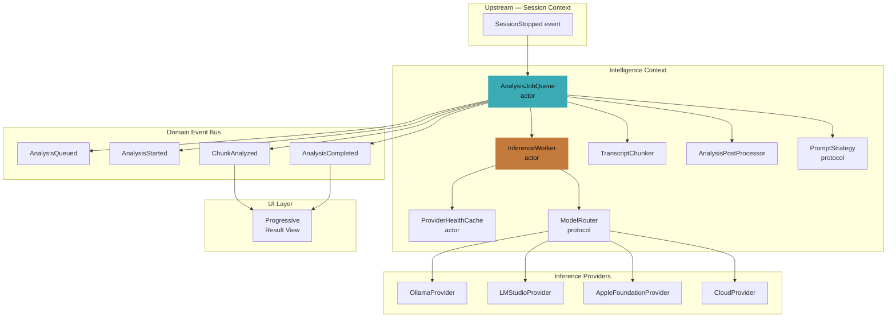

# 05 — AI Orchestration Architecture

**Status**: Proposed  
**Author**: Chief Software Architect  
**Date**: 2026-06-29  
**Review Required**: Yes — this document defines the serialization contract for all local inference. Any concurrent access to an InferenceProvider that bypasses InferenceWorker is an architectural violation.

**Depends On**: 01-Product-Domain-Architecture.md  
**Implements**: Intelligence Context (Core), INV-005 (Exactly one InferenceJob at a time per local InferenceProvider)

---

## 1. Design Philosophy: Local-First Inference

### 1.1 The Fundamental Mistake

The most dangerous assumption an engineer can make about this system is:

> "Ollama exposes an HTTP API, therefore I can call it like a REST service."

This assumption produced the current defect: `MeetingIntelligenceService` sending 41 simultaneous HTTP requests to `localhost:11434`. The system froze. This section explains why, precisely, so the mistake cannot be made again.

### 1.2 Cloud LLMs vs Local LLMs — A Physical Difference

Cloud providers (OpenAI, Anthropic, Gemini) operate **horizontally scaled inference fleets**. When your application sends 20 parallel requests, each request routes to a different physical GPU server. Genuine parallelism occurs. Throughput scales with request count up to your rate limit.

Local LLMs (Ollama, LM Studio, llama.cpp, Apple Foundation Models) are **single-process, single-model, serialized GPU workloads**. The model weights occupy VRAM — typically 4–8 GB for a quantized 7B model on an M2. There is one model instance. There is one GPU inference pipeline.

When your application sends 20 parallel requests to Ollama:

1. Ollama's HTTP server accepts all 20 connections (it is async at the network layer)
2. The inference scheduler attempts to serve them concurrently
3. VRAM is immediately exhausted attempting to hold multiple KV-caches in flight
4. The kernel begins swapping inference state to unified memory
5. Latency per request climbs from 20s to 90s+
6. Requests begin timing out
7. The caller retries — now there are 40 pending requests
8. System-wide memory pressure triggers macOS to SIGKILL background processes
9. Ollama process may be killed, causing all 40 requests to fail simultaneously

**The correct mental model**: a local LLM is a single-threaded worker with a bounded job queue. It is not a REST API. Throughput does not increase with parallelism — it decreases.

### 1.3 The Thundering Herd Failure Mode

The specific failure mode observed in Orin:

```
t=0s    Meeting ends. MeetingIntelligenceService creates 20 analysis tasks.
t=0s    All 20 tasks call Ollama simultaneously (no coordination).
t=60s   All 20 requests hit their timeout. All 20 are retried.
t=60s   MeetingIntelligenceService creates 21 retry tasks (some duplicated).
t=60s   41 simultaneous requests hit Ollama.
t=60s   Ollama process killed by macOS memory pressure.
t=61s   41 requests receive connection refused.
t=61s   All 41 callers retry with no jitter.
t=61s   System freeze.
```

This is a thundering herd: a coordinated failure that produces a coordinated retry storm worse than the original load. It is not a bug in Ollama. It is a missing architectural layer.

### 1.4 The Correct Architecture

**Local inference must be serialized through a single actor that owns the job queue.**

This is not a performance optimisation. It is a correctness requirement. The invariant is already captured in the domain model as INV-005:

> Exactly one InferenceJob executes at a time per local InferenceProvider.

The architecture implements this invariant through `InferenceWorker`, a Swift actor that is the sole entry point for all inference requests. No code anywhere in the system calls an `InferenceProvider` directly. All inference is enqueued through `InferenceWorker`.

Cloud providers may use bounded parallelism (semaphore, limit=3) because their providers are genuinely concurrent. But local providers enforce serial execution — one job, then the next.

### 1.5 Why This Constraint Is Permanent

The constraint cannot be lifted when hardware improves. An M4 Max with 128 GB unified memory can hold larger models but still holds one model instance per process. Multi-instance serving (like vLLM in production cloud deployments) does not exist for consumer-grade Ollama. If a future provider genuinely supports concurrent inference, that provider's `InferenceCapabilities.maxConcurrentJobs` will reflect it, and `InferenceWorker` will respect it. The queue remains — its parallelism limit becomes configurable per provider.

---

## 2. InferenceWorker Actor

### 2.1 Role

`InferenceWorker` is the **central orchestration actor** for the Intelligence Context. It owns:

- The job queue for all inference requests
- The circuit breaker state per provider
- The provider health cache
- The active job reference

Nothing outside this actor may hold a reference to an `InferenceProvider` directly.

### 2.2 Complete API

```swift
// MARK: - State Types

enum InferenceWorkerState: Sendable {
    case idle
    case processing(jobID: JobID, provider: String, startedAt: Date)
    case circuitOpen(provider: String, openedAt: Date, reopensAt: Date)
}

struct InferenceLoad: Sendable {
    let state: InferenceWorkerState
    let queueDepth: Int
    let consecutiveFailures: Int
    let estimatedWaitSeconds: Double?
}

// MARK: - InferenceWorker

actor InferenceWorker {

    // MARK: Private State

    private var jobQueue: [InferenceJob] = []
    private var state: InferenceWorkerState = .idle
    private var activeProvider: (any InferenceProvider)?
    private var consecutiveFailures: Int = 0
    private var lastFailureTime: Date?
    private var healthCache: ProviderHealthCache
    private let router: any ModelRouter
    private let providers: [any InferenceProvider]

    // Circuit breaker configuration
    private let failureThreshold: Int = 3
    private let circuitOpenDuration: TimeInterval = 30.0

    // Continuation storage for callers awaiting results
    private var pendingContinuations: [JobID: AsyncStream<InferenceResult>.Continuation] = [:]

    // MARK: Initialisation

    init(
        providers: [any InferenceProvider],
        router: any ModelRouter,
        healthCache: ProviderHealthCache
    ) {
        self.providers = providers
        self.router = router
        self.healthCache = healthCache
    }

    // MARK: Public Interface

    /// Enqueue an inference job. Returns an AsyncStream that emits progressive results.
    /// The stream closes when the job completes or fails.
    func enqueue(_ job: InferenceJob) async -> AsyncStream<InferenceResult> {
        let (stream, continuation) = AsyncStream<InferenceResult>.makeStream()
        pendingContinuations[job.jobID] = continuation
        jobQueue.append(job)
        jobQueue.sort { $0.priority.rawValue > $1.priority.rawValue }

        if case .idle = state {
            Task { await processNext() }
        }

        return stream
    }

    /// Cancel a pending or active job. Active jobs are signalled to stop; pending jobs
    /// are removed from the queue. The AsyncStream for the cancelled job closes cleanly.
    func cancel(_ jobID: JobID) async {
        if let index = jobQueue.firstIndex(where: { $0.jobID == jobID }) {
            jobQueue.remove(at: index)
            pendingContinuations[jobID]?.finish()
            pendingContinuations.removeValue(forKey: jobID)
        }
        // Active job cancellation is handled via structured concurrency task cancellation.
        // InferenceProvider implementations must honour Task.isCancelled.
    }

    /// Current queue depth and worker state. Non-blocking for UI polling.
    func currentLoad() -> InferenceLoad {
        InferenceLoad(
            state: state,
            queueDepth: jobQueue.count,
            consecutiveFailures: consecutiveFailures,
            estimatedWaitSeconds: estimatedWait()
        )
    }

    // MARK: Private — Core Processing Loop

    private func processNext() async {
        guard !jobQueue.isEmpty else {
            state = .idle
            return
        }

        guard checkCircuitBreaker() else {
            // Circuit is open. Schedule a retry after the open duration.
            let retryDelay = circuitOpenDuration
            try? await Task.sleep(for: .seconds(retryDelay))
            await processNext()
            return
        }

        let job = jobQueue.removeFirst()
        let availableProviders = await healthyProviders()

        guard let provider = router.route(job: job, available: availableProviders) else {
            // No provider available. Emit failure and process next.
            pendingContinuations[job.jobID]?.yield(.failure(
                job: job,
                error: .noProviderAvailable
            ))
            pendingContinuations[job.jobID]?.finish()
            pendingContinuations.removeValue(forKey: job.jobID)
            await processNext()
            return
        }

        state = .processing(
            jobID: job.jobID,
            provider: provider.providerID,
            startedAt: Date()
        )
        activeProvider = provider

        do {
            let tokenStream = try await provider.infer(job: job)
            var tokenBuffer = ""

            for await token in tokenStream {
                switch token {
                case .text(let text):
                    tokenBuffer += text
                    pendingContinuations[job.jobID]?.yield(
                        .partial(job: job, accumulatedText: tokenBuffer)
                    )
                case .complete(let metrics):
                    pendingContinuations[job.jobID]?.yield(
                        .success(job: job, text: tokenBuffer, metrics: metrics)
                    )
                    consecutiveFailures = 0
                case .error(let inferenceError):
                    throw inferenceError
                }
            }
        } catch {
            consecutiveFailures += 1
            lastFailureTime = Date()
            pendingContinuations[job.jobID]?.yield(.failure(job: job, error: error))
        }

        pendingContinuations[job.jobID]?.finish()
        pendingContinuations.removeValue(forKey: job.jobID)
        activeProvider = nil

        await processNext()
    }

    private func checkCircuitBreaker() -> Bool {
        guard consecutiveFailures >= failureThreshold,
              let lastFailure = lastFailureTime else { return true }

        if Date().timeIntervalSince(lastFailure) > circuitOpenDuration {
            consecutiveFailures = 0
            return true
        }
        return false
    }

    private func healthyProviders() async -> [any InferenceProvider] {
        await withTaskGroup(of: (any InferenceProvider)?.self) { group in
            for provider in providers {
                group.addTask {
                    await provider.isAvailable() ? provider : nil
                }
            }
            var healthy: [any InferenceProvider] = []
            for await result in group {
                if let p = result { healthy.append(p) }
            }
            return healthy
        }
    }

    private func estimatedWait() -> Double? {
        guard case .processing = state else { return nil }
        // Rough estimate: assume 30s average per job at current provider
        return Double(jobQueue.count + 1) * 30.0
    }
}
```

### 2.3 Design Decisions

**Why an actor, not a class with a lock?**

Swift actors provide compile-time concurrency safety — the compiler rejects code that accesses actor-isolated state without `await`. A class with `NSLock` or `DispatchSemaphore` provides runtime enforcement with no compile-time guarantee. Given that bypassing the serialization constraint is the primary failure mode we are defending against, compile-time enforcement is not optional.

**Why `AsyncStream` return type?**

Analysis of an 8-chunk meeting takes 3–6 minutes. The caller should not `await` for 6 minutes with no feedback. `AsyncStream<InferenceResult>` allows the worker to emit partial results (`.partial`) as tokens arrive, and a final `.success` or `.failure` when the job completes. The UI can progressively render content without any polling mechanism.

**Why an internal job queue rather than Swift's `withTaskGroup`?**

`withTaskGroup` is designed for structured concurrency where all tasks run concurrently. The opposite is needed here: strict serialization. An explicit `[InferenceJob]` queue, sorted by priority, gives full control over ordering and cancellation semantics. Priority promotion (upgrading a `BackgroundRetry` to `UserInitiated` if the user taps "Analyse Now") can be implemented as a queue mutation without restructuring the concurrency model.

**Why a circuit breaker?**

Without a circuit breaker, a crashed Ollama process produces this cycle: job fails → next job runs immediately → fails immediately → next job → fails immediately → 50 rapid failures in 10 seconds → log file exhausted, CPU spike from error handling overhead. The circuit breaker detects N consecutive failures, opens for 30 seconds, then attempts a single probe. This converts a failure storm into a calm retry schedule.

---

## 3. AnalysisJobQueue Actor

### 3.1 Role

`AnalysisJobQueue` sits above `InferenceWorker`. Where `InferenceWorker` serializes individual inference requests, `AnalysisJobQueue` serializes complete meeting analysis workflows.

A meeting analysis consists of:
1. Transcript chunking (CPU, fast)
2. N × chunk inference calls through `InferenceWorker`
3. One synthesis inference call through `InferenceWorker`
4. Output post-processing (CPU, fast)

Without `AnalysisJobQueue`, two meetings ending 30 seconds apart would both begin analysis immediately. Their chunk jobs would interleave in `InferenceWorker`'s queue: chunk 1 of meeting A, chunk 1 of meeting B, chunk 2 of meeting A, chunk 2 of meeting B. The total inference time is identical, but the user sees neither meeting complete for 6+ minutes. With `AnalysisJobQueue`, meeting A completes fully in ~4 minutes, meeting B begins. The user sees a complete result sooner.

### 3.2 Complete API

```swift
// MARK: - Priority Ordering

enum AnalysisPriority: Int, Comparable, Sendable {
    case backgroundRetry      = 0
    case automaticPostRecording = 1
    case userInitiated        = 2

    static func < (lhs: AnalysisPriority, rhs: AnalysisPriority) -> Bool {
        lhs.rawValue < rhs.rawValue
    }
}

// MARK: - Pending Analysis

struct PendingAnalysis: Sendable {
    let sessionID: SessionID
    let transcript: Transcript
    let priority: AnalysisPriority
    let requestedAt: Date
}

// MARK: - AnalysisJobQueue

actor AnalysisJobQueue {

    private var queue: [PendingAnalysis] = []
    private var isProcessing: Bool = false
    private let inferenceWorker: InferenceWorker
    private let chunker: TranscriptChunker
    private let postProcessor: AnalysisPostProcessor
    private let eventBus: DomainEventBus

    init(
        inferenceWorker: InferenceWorker,
        chunker: TranscriptChunker,
        postProcessor: AnalysisPostProcessor,
        eventBus: DomainEventBus
    ) {
        self.inferenceWorker = inferenceWorker
        self.chunker = chunker
        self.postProcessor = postProcessor
        self.eventBus = eventBus
    }

    // MARK: Public Interface

    func enqueue(_ analysis: PendingAnalysis) async {
        // If same session already queued, upgrade priority if higher.
        if let existing = queue.firstIndex(where: { $0.sessionID == analysis.sessionID }) {
            if analysis.priority > queue[existing].priority {
                queue[existing] = analysis
                queue.sort { $0.priority > $1.priority }
            }
            return
        }

        queue.append(analysis)
        queue.sort { $0.priority > $1.priority }

        await eventBus.publish(AnalysisQueued(sessionID: analysis.sessionID))

        if !isProcessing {
            Task { await processNext() }
        }
    }

    func cancel(_ sessionID: SessionID) async {
        queue.removeAll { $0.sessionID == sessionID }
        await inferenceWorker.cancel(JobID(sessionID: sessionID))
    }

    func currentDepth() -> Int {
        queue.count + (isProcessing ? 1 : 0)
    }

    // MARK: Private Processing

    private func processNext() async {
        guard !queue.isEmpty else {
            isProcessing = false
            return
        }

        isProcessing = true
        let analysis = queue.removeFirst()

        await eventBus.publish(AnalysisStarted(sessionID: analysis.sessionID))

        let chunks = chunker.chunk(transcript: analysis.transcript)
        var chunkResults: [ChunkAnalysis] = []

        for (index, chunk) in chunks.enumerated() {
            let job = InferenceJob(
                jobID: JobID(),
                sessionID: analysis.sessionID,
                systemPrompt: PromptStrategy.system(for: analysis),
                userPrompt: PromptStrategy.user(chunk: chunk, index: index, total: chunks.count),
                maxOutputTokens: 1024,
                temperature: 0.1,
                responseLanguage: analysis.transcript.detectedLanguage ?? "en",
                priority: analysis.priority.asJobPriority,
                timeoutSeconds: 120
            )

            let resultStream = await inferenceWorker.enqueue(job)

            for await result in resultStream {
                if case .success(_, let text, let metrics) = result {
                    let parsed = postProcessor.parse(text, chunk: chunk)
                    chunkResults.append(ChunkAnalysis(
                        chunkIndex: index,
                        timeRange: chunk.timeRange,
                        result: parsed,
                        metrics: metrics
                    ))
                    await eventBus.publish(ChunkAnalyzed(
                        sessionID: analysis.sessionID,
                        chunkIndex: index,
                        totalChunks: chunks.count,
                        partialAnalysis: parsed
                    ))
                }
            }
        }

        // Synthesis pass
        let synthesisJob = InferenceJob.synthesis(
            sessionID: analysis.sessionID,
            chunkResults: chunkResults,
            language: analysis.transcript.detectedLanguage ?? "en",
            priority: analysis.priority.asJobPriority
        )
        let synthesisStream = await inferenceWorker.enqueue(synthesisJob)

        for await result in synthesisStream {
            if case .success(_, let text, let metrics) = result {
                let finalAnalysis = postProcessor.synthesise(
                    text,
                    chunks: chunkResults,
                    metrics: metrics
                )
                await eventBus.publish(AnalysisCompleted(
                    sessionID: analysis.sessionID,
                    analysis: finalAnalysis
                ))
            }
        }

        await processNext()
    }
}
```

### 3.3 Priority Semantics

| Priority | Trigger | Behaviour |
|----------|---------|-----------|
| `userInitiated` | User taps "Analyse Now" | Bumps to front of queue. Ongoing lower-priority analysis is NOT interrupted — `InferenceWorker` completes the active chunk before starting the next job. |
| `automaticPostRecording` | Meeting ends naturally | Standard queue position. |
| `backgroundRetry` | Previous analysis failed, system retrying after delay | Sits at back. User-initiated always wins. |

**Priority promotion**: if a `backgroundRetry` job is in the queue and the user taps "Analyse Now" for the same session, `enqueue` detects the existing entry and upgrades its priority in place. The queue is re-sorted. This prevents duplicate analysis of the same session.

---

## 4. InferenceProvider Protocol

### 4.1 Protocol Definition

```swift
// MARK: - Core Protocol

protocol InferenceProvider: Sendable {
    var providerID: String { get }
    var capabilities: InferenceCapabilities { get }

    func isAvailable() async -> Bool
    func infer(job: InferenceJob) async throws -> AsyncStream<InferenceToken>
}

// MARK: - Capabilities

struct InferenceCapabilities: Sendable {
    let maxContextTokens: Int
    let supportsStreaming: Bool
    let supportedLanguages: [String]   // BCP-47 codes; empty = unrestricted
    let isLocal: Bool
    let requiresConsent: Bool          // true for cloud providers (INV-010)
    let costModel: CostModel
    let maxConcurrentJobs: Int         // 1 for local, 3–10 for cloud
    let modelID: String
}

enum CostModel: Sendable {
    case free
    case perToken(inputCostPer1K: Decimal, outputCostPer1K: Decimal, currency: String)
    case subscription(monthlyUSD: Decimal)
}

// MARK: - Inference Job

struct InferenceJob: Sendable, Identifiable {
    let id: JobID
    var jobID: JobID { id }
    let sessionID: SessionID
    let systemPrompt: String
    let userPrompt: String
    let maxOutputTokens: Int
    let temperature: Float
    let responseLanguage: String       // BCP-47: "en", "en-IN", "hi", "ja"
    let priority: JobPriority
    let timeoutSeconds: Int
    let isSynthesis: Bool              // true for the final synthesis call

    enum JobPriority: Int, Sendable, Comparable {
        case background   = 0
        case standard     = 1
        case userInitiated = 2

        static func < (lhs: JobPriority, rhs: JobPriority) -> Bool {
            lhs.rawValue < rhs.rawValue
        }
    }
}

// MARK: - Streaming Token

enum InferenceToken: Sendable {
    case text(String)
    case complete(InferenceMetrics)
    case error(InferenceError)
}

struct InferenceMetrics: Sendable {
    let tokensGenerated: Int
    let tokensInContext: Int
    let wallClockSeconds: Double
    let tokensPerSecond: Double
    let modelID: String
    let providerID: String
}

// MARK: - Result (higher-level, emitted by InferenceWorker)

enum InferenceResult: Sendable {
    case partial(job: InferenceJob, accumulatedText: String)
    case success(job: InferenceJob, text: String, metrics: InferenceMetrics)
    case failure(job: InferenceJob, error: any Error)
}

// MARK: - Error Types

enum InferenceError: Error, Sendable {
    case providerUnavailable(providerID: String)
    case contextExceeded(limit: Int, actual: Int)
    case timeout(seconds: Int)
    case oomKill                        // provider process was killed (connection refused after running)
    case noProviderAvailable
    case consentRequired(providerID: String)
    case modelNotLoaded(modelID: String)
    case rateLimited(retryAfterSeconds: Int?)
}
```

### 4.2 Concrete Provider: OllamaProvider

```swift
actor OllamaProvider: InferenceProvider {

    let providerID = "ollama-local"
    let capabilities: InferenceCapabilities

    private let baseURL: URL
    private let session: URLSession
    private var loadedModelID: String?

    init(baseURL: URL = URL(string: "http://localhost:11434")!, modelID: String) {
        self.baseURL = baseURL
        self.capabilities = InferenceCapabilities(
            maxContextTokens: 8192,
            supportsStreaming: true,
            supportedLanguages: [],    // Ollama models are multilingual
            isLocal: true,
            requiresConsent: false,
            costModel: .free,
            maxConcurrentJobs: 1,      // INVARIANT: never more than 1
            modelID: modelID
        )
        self.session = URLSession(configuration: .ephemeral)
    }

    func isAvailable() async -> Bool {
        guard let url = URL(string: "\(baseURL)/api/tags") else { return false }
        do {
            let (_, response) = try await session.data(from: url)
            return (response as? HTTPURLResponse)?.statusCode == 200
        } catch {
            return false
        }
    }

    func infer(job: InferenceJob) async throws -> AsyncStream<InferenceToken> {
        let request = OllamaGenerateRequest(
            model: capabilities.modelID,
            system: job.systemPrompt,
            prompt: job.userPrompt,
            stream: true,
            options: OllamaOptions(
                temperature: job.temperature,
                numPredict: job.maxOutputTokens
            )
        )

        let (stream, continuation) = AsyncStream<InferenceToken>.makeStream()

        Task {
            do {
                let urlRequest = try buildRequest(request)
                let (bytes, _) = try await session.bytes(for: urlRequest)
                var tokenBuffer = ""
                let start = Date()

                for try await line in bytes.lines {
                    guard !Task.isCancelled else {
                        continuation.finish()
                        return
                    }
                    guard let data = line.data(using: .utf8),
                          let response = try? JSONDecoder().decode(OllamaStreamResponse.self, from: data)
                    else { continue }

                    tokenBuffer += response.response
                    continuation.yield(.text(response.response))

                    if response.done {
                        let elapsed = Date().timeIntervalSince(start)
                        let tokens = response.evalCount ?? 0
                        continuation.yield(.complete(InferenceMetrics(
                            tokensGenerated: tokens,
                            tokensInContext: response.promptEvalCount ?? 0,
                            wallClockSeconds: elapsed,
                            tokensPerSecond: elapsed > 0 ? Double(tokens) / elapsed : 0,
                            modelID: capabilities.modelID,
                            providerID: providerID
                        )))
                    }
                }
            } catch {
                // Distinguish OOM kill (connection refused) from timeout
                let inferenceError: InferenceError = isConnectionRefused(error)
                    ? .oomKill
                    : .timeout(seconds: job.timeoutSeconds)
                continuation.yield(.error(inferenceError))
            }
            continuation.finish()
        }

        return stream
    }

    private func isConnectionRefused(_ error: any Error) -> Bool {
        (error as? URLError)?.code == .cannotConnectToHost
    }
}
```

---

## 5. ModelRouter Protocol

### 5.1 Protocol Definition

```swift
protocol ModelRouter: Sendable {
    func route(job: InferenceJob, available: [any InferenceProvider]) -> (any InferenceProvider)?
}
```

### 5.2 Concrete Routers

```swift
// MARK: - LocalFirstRouter (default for all Orin users)

struct LocalFirstRouter: ModelRouter {

    func route(job: InferenceJob, available: [any InferenceProvider]) -> (any InferenceProvider)? {
        // Priority: Ollama > LM Studio > Apple Foundation Models > Cloud (if consented)
        let ordered = available.sorted { a, b in
            providerRank(a) < providerRank(b)
        }

        for provider in ordered {
            // Never route to a cloud provider without explicit consent record
            if provider.capabilities.requiresConsent && !hasConsent(for: provider, job: job) {
                continue
            }
            // Skip providers that cannot handle the context size
            if job.systemPrompt.estimatedTokenCount + job.userPrompt.estimatedTokenCount
               > provider.capabilities.maxContextTokens {
                continue
            }
            return provider
        }
        return nil
    }

    private func providerRank(_ provider: any InferenceProvider) -> Int {
        switch provider.providerID {
        case "ollama-local":              return 0
        case "lmstudio-local":            return 1
        case "apple-foundation-models":   return 2
        default:                          return provider.capabilities.isLocal ? 3 : 10
        }
    }

    private func hasConsent(for provider: any InferenceProvider, job: InferenceJob) -> Bool {
        // ConsentStore lookup — injected in production, always returns false for local providers
        ConsentStore.shared.hasActiveConsent(
            sessionID: job.sessionID,
            providerID: provider.providerID
        )
    }
}

// MARK: - CloudOnlyRouter (for users who prefer cloud quality)

struct CloudOnlyRouter: ModelRouter {

    func route(job: InferenceJob, available: [any InferenceProvider]) -> (any InferenceProvider)? {
        available
            .filter { !$0.capabilities.isLocal }
            .filter { ConsentStore.shared.hasActiveConsent(sessionID: job.sessionID, providerID: $0.providerID) }
            .sorted { $0.providerID < $1.providerID }
            .first
    }
}

// MARK: - SpecializedRouter (different models for different task types)

struct SpecializedRouter: ModelRouter {

    private let largeModelProviderID: String   // e.g. Ollama with mistral-7b
    private let smallModelProviderID: String   // e.g. Ollama with phi3-mini

    func route(job: InferenceJob, available: [any InferenceProvider]) -> (any InferenceProvider)? {
        let preferredID = job.isSynthesis ? largeModelProviderID : smallModelProviderID
        return available.first { $0.providerID == preferredID }
            ?? available.first { $0.capabilities.isLocal }
    }
}

// MARK: - CostAwareRouter

struct CostAwareRouter: ModelRouter {

    func route(job: InferenceJob, available: [any InferenceProvider]) -> (any InferenceProvider)? {
        // Prefer free local providers. Fall back to cloud only if no local provider available.
        let freeProviders = available.filter {
            if case .free = $0.capabilities.costModel { return true }
            return false
        }
        if let local = freeProviders.first(where: { $0.capabilities.isLocal }) {
            return local
        }
        return freeProviders.first ?? available.first
    }
}
```

### 5.3 Routing Decision Flowchart

```
┌─────────────────────────────────────────────────────────────────┐
│                    ModelRouter.route(job:available:)            │
└─────────────────────────────────────────────────────────────────┘
                              │
                              ▼
              ┌───────────────────────────┐
              │  Filter: context fits?    │◄── Drop providers where
              │  (tokens ≤ maxContext)    │    job tokens > maxContextTokens
              └───────────────────────────┘
                              │
                              ▼
              ┌───────────────────────────┐
              │  Filter: consent exists?  │◄── Drop cloud providers
              │  (if requiresConsent)     │    without ConsentRecord
              └───────────────────────────┘
                              │
                              ▼
              ┌───────────────────────────┐
              │  Sort by strategy         │◄── LocalFirst: local rank
              │                           │    CostAware: cost rank
              └───────────────────────────┘
                              │
                              ▼
              ┌───────────────────────────┐
              │  Return first candidate   │
              │  (or nil → no provider)   │
              └───────────────────────────┘
```

---

## 6. Health Check and Caching

### 6.1 ProviderHealthCache

Health checks must not be performed on every inference call. A provider that responds to a `/api/tags` request once in the last 10 seconds does not need to be checked again before the next job. Conversely, a provider's health cannot be assumed indefinitely — Ollama can be quit by the user mid-session.

```swift
actor ProviderHealthCache {

    struct CachedResult: Sendable {
        let isAvailable: Bool
        let checkedAt: Date
        let responseTimeMs: Double
    }

    private var cache: [String: CachedResult] = [:]
    private let ttlSeconds: TimeInterval = 10.0

    func isAvailable(provider: any InferenceProvider) async -> Bool {
        let providerID = provider.providerID

        if let cached = cache[providerID],
           Date().timeIntervalSince(cached.checkedAt) < ttlSeconds {
            return cached.isAvailable   // < 1ms — no I/O
        }

        // Cache miss or expired — perform actual check
        let start = Date()
        let available = await provider.isAvailable()
        let elapsed = Date().timeIntervalSince(start) * 1000

        cache[providerID] = CachedResult(
            isAvailable: available,
            checkedAt: Date(),
            responseTimeMs: elapsed
        )
        return available
    }

    func prefetchAll(providers: [any InferenceProvider]) async {
        await withTaskGroup(of: Void.self) { group in
            for provider in providers {
                group.addTask { _ = await self.isAvailable(provider: provider) }
            }
        }
    }

    func invalidate(providerID: String) {
        cache.removeValue(forKey: providerID)
    }
}
```

### 6.2 Session Start Prefetch

At session start, `InferenceWorker` calls `healthCache.prefetchAll(providers:)` concurrently. By the time a meeting ends and analysis begins, all provider statuses are warm in the cache. The first routing decision costs < 1ms, not 3s.

```
Session starts     ──────────────────────────────────► Meeting ends
     │                                                      │
     ▼                                                      ▼
prefetchAll()                                          route(job:available:)
(all providers checked                                 (cache hit, < 1ms)
 in parallel, ~2s)
```

---

## 7. Chunking Strategy

### 7.1 Token Budgets

All sizes are in tokens, not characters. Characters-to-tokens ratios vary by language and tokenizer: English averages ~0.75 tokens/character; Hindi in Devanagari averages ~0.5 tokens/character (shorter token sequences). The `TranscriptChunker` must use a tokenizer appropriate to the model in use.

| Parameter | Value | Rationale |
|-----------|-------|-----------|
| Target chunk size | 3,000–5,000 tokens | Fits comfortably in 8k context with system prompt overhead |
| Overlap | 200 tokens | Prevents context loss at chunk boundaries |
| Maximum chunks per meeting | 30 | Beyond 30, rolling summary is applied first |
| Minimum chunk size | 200 tokens | Sub-200 token chunks waste inference overhead |
| System prompt budget | ~600 tokens | Reserved from context window |
| Output budget | 1,024 tokens | Reserved for model response |

### 7.2 Chunk Boundary Rules

Boundaries are chosen in this priority order:

1. **Speaker turn boundary** — a change in speaker label is always preferred as a chunk boundary
2. **Sentence boundary** — a period/question mark/exclamation followed by whitespace
3. **Clause boundary** — a comma or semicolon if no sentence boundary available within 100 tokens
4. **Hard token limit** — only if no natural boundary found (should be rare)

Never split a sentence that contains an action item signal phrase ("will", "should", "going to", "I'll", "by [date]"). These phrases are identified by a lightweight heuristic scan before chunking.

### 7.3 Rolling Summary for Long Meetings

```swift
struct TranscriptChunker {

    let targetTokens: Int = 4000
    let overlapTokens: Int = 200
    let maxChunks: Int = 30
    let minChunkTokens: Int = 200

    func chunk(transcript: Transcript) -> [TranscriptChunk] {
        let rawChunks = splitIntoChunks(transcript)

        if rawChunks.count <= maxChunks {
            return rawChunks
        }

        // Rolling summary: summarise first half before proceeding
        // This is handled at the AnalysisJobQueue level — the chunker signals overflow.
        return applyRollingSummaryBoundary(rawChunks)
    }

    private func applyRollingSummaryBoundary(_ chunks: [TranscriptChunk]) -> [TranscriptChunk] {
        // Split at the 15-chunk mark. First 15 chunks get a summary pass.
        // The summary text becomes a synthetic "chunk 0" prepended to the second half.
        // This is a synthesis placeholder — actual rolling summary is executed by AnalysisJobQueue.
        let boundary = 15
        var result = Array(chunks.prefix(boundary))
        result.append(.rollingSummaryPlaceholder(upToChunkIndex: boundary - 1))
        result.append(contentsOf: chunks.dropFirst(boundary))
        return result
    }
}
```

### 7.4 Duration-Based Chunk Strategy Decision Tree

```
Meeting duration
      │
      ├── < 5 min
      │   └── Single chunk (no chunking needed)
      │       Estimated tokens: < 1,500
      │
      ├── 5–30 min
      │   └── Standard chunking (2–8 chunks)
      │       Target 4k tokens/chunk
      │
      ├── 30–90 min
      │   └── Standard chunking (8–22 chunks)
      │       Monitor chunk count; warn if approaching 30
      │
      └── > 90 min
          └── Rolling summary strategy
              ├── Chunk first 45 min → summarise
              ├── Chunk remaining → standard
              └── Final synthesis takes rolling summary + late chunks
```

---

## 8. Prompt Architecture

### 8.1 Layered Prompt System

```
┌─────────────────────────────────────────────────────────────────┐
│                        SYSTEM PROMPT                            │
│  Role + output format + language instruction + section markers  │
├─────────────────────────────────────────────────────────────────┤
│                         USER PROMPT                             │
│  Meeting metadata + speaker labels + timestamped transcript     │
└─────────────────────────────────────────────────────────────────┘
```

**Language instruction** (included in every system prompt):

```
Respond entirely in [detectedLanguage]. 
Use these exact section markers regardless of the response language:
[SUMMARY]...[/SUMMARY]
[ACTION_ITEMS]...[/ACTION_ITEMS]
[DECISIONS]...[/DECISIONS]
[KEY_POINTS]...[/KEY_POINTS]

Do not translate or localise the markers themselves.
```

Language-neutral ASCII markers enable language-agnostic parsing. The parser does not need to know the response language — it scans for the same byte sequences in every language.

### 8.2 PromptStrategy Protocol

```swift
protocol PromptStrategy: Sendable {
    func systemPrompt(language: String, chunkIndex: Int, totalChunks: Int) -> String
    func userPrompt(chunk: TranscriptChunk, metadata: SessionMetadata) -> String
    func synthesisSystemPrompt(language: String, chunkCount: Int) -> String
}

struct DefaultPromptStrategy: PromptStrategy {

    func systemPrompt(language: String, chunkIndex: Int, totalChunks: Int) -> String {
        """
        You are a meeting intelligence assistant. Analyse the transcript excerpt below \
        (chunk \(chunkIndex + 1) of \(totalChunks)) and extract structured information.

        Respond entirely in \(languageName(language)). \
        Use these markers exactly as written, regardless of language:
        [SUMMARY]...[/SUMMARY]
        [ACTION_ITEMS]...[/ACTION_ITEMS]
        [DECISIONS]...[/DECISIONS]
        [KEY_POINTS]...[/KEY_POINTS]

        For each action item, include: owner (if named), commitment, and deadline (if stated).
        Format: "- [Owner]: [commitment] (by [deadline])"
        If owner or deadline is not explicit, omit that field.

        Be factual. Only extract information directly supported by the transcript. \
        Do not infer, assume, or extrapolate.
        """
    }

    func userPrompt(chunk: TranscriptChunk, metadata: SessionMetadata) -> String {
        """
        Meeting type: \(metadata.meetingType.rawValue)
        Duration so far: \(metadata.elapsedMinutes) minutes
        Participants: \(metadata.participantNames.joined(separator: ", "))

        Transcript:
        \(chunk.formattedWithSpeakerLabels)
        """
    }

    func synthesisSystemPrompt(language: String, chunkCount: Int) -> String {
        """
        You are a meeting intelligence assistant. Below are summaries from \(chunkCount) \
        chunks of a single meeting. Synthesise them into a coherent, deduplicated meeting record.

        Respond entirely in \(languageName(language)).
        Use these markers exactly:
        [SUMMARY]...[/SUMMARY]
        [ACTION_ITEMS]...[/ACTION_ITEMS]
        [DECISIONS]...[/DECISIONS]
        [KEY_POINTS]...[/KEY_POINTS]

        Deduplicate action items that refer to the same commitment.
        Order key points chronologically by when they appeared in the meeting.
        The summary should be a coherent narrative, not a list.
        """
    }
}

struct StandupPromptStrategy: PromptStrategy { /* emphasis on blockers, yesterday/today */ }
struct BrainstormingPromptStrategy: PromptStrategy { /* emphasis on ideas, minimal filtering */ }
struct ClientMeetingPromptStrategy: PromptStrategy { /* emphasis on commitments, follow-ups */ }
```

---

## 9. Output Post-Processing

### 9.1 Section Marker Parsing

```swift
struct AnalysisPostProcessor: Sendable {

    func parse(_ rawOutput: String, chunk: TranscriptChunk) -> ParsedChunkAnalysis {
        ParsedChunkAnalysis(
            summary: extractSection("SUMMARY", from: rawOutput),
            actionItems: extractActionItems(from: rawOutput, chunk: chunk),
            decisions: extractDecisions(from: rawOutput),
            keyPoints: extractKeyPoints(from: rawOutput),
            hallucinationFlags: detectHallucinations(output: rawOutput, chunk: chunk),
            confidenceScore: calculateConfidence(output: rawOutput, chunk: chunk)
        )
    }

    private func extractSection(_ marker: String, from text: String) -> String? {
        let pattern = #"\[\#(marker)\](.*?)\[/\#(marker)\]"#
        guard let regex = try? NSRegularExpression(pattern: pattern, options: [.dotMatchesLineSeparators]),
              let match = regex.firstMatch(in: text, range: NSRange(text.startIndex..., in: text)),
              let range = Range(match.range(at: 1), in: text)
        else { return nil }
        return String(text[range]).trimmingCharacters(in: .whitespacesAndNewlines)
    }
```

### 9.2 Hallucination Detection

```swift
    // IMPORTANT: This MUST run off @MainActor — O(N×M) string comparison.
    // Current bug: MeetingIntelligenceService calls this on main thread.
    // Fix: this method is nonisolated and called from a background Task in AnalysisJobQueue.

    nonisolated func detectHallucinations(
        output: String,
        chunk: TranscriptChunk
    ) -> [HallucinationFlag] {
        let outputTerms = extractNounPhrases(from: output)
        let transcriptTerms = Set(extractNounPhrases(from: chunk.text))

        return outputTerms.compactMap { term in
            guard !transcriptTerms.contains(term),
                  !isCommonWord(term) else { return nil }
            return HallucinationFlag(
                term: term,
                context: extractSurroundingContext(term, in: output),
                severity: .review    // Not .reject — hallucination detection is heuristic
            )
        }
    }

    // Confidence: proportion of analysis terms that appear verbatim in the transcript.
    nonisolated func calculateConfidence(output: String, chunk: TranscriptChunk) -> Float {
        let outputTerms = extractNounPhrases(from: output)
        guard !outputTerms.isEmpty else { return 0.0 }
        let transcriptText = chunk.text.lowercased()
        let matched = outputTerms.filter { transcriptText.contains($0.lowercased()) }
        return Float(matched.count) / Float(outputTerms.count)
    }
}
```

**Why hallucination detection is heuristic, not deterministic**: LLMs can paraphrase accurately without using verbatim terms. A confidence score of 0.6 does not mean 40% hallucination — it means 40% of extracted noun phrases did not appear verbatim. Low confidence triggers a human review flag, not automatic rejection.

---

## 10. Synthesis

### 10.1 Synthesis Pass Design

After all chunks are analysed, a single synthesis inference call takes all chunk results and produces the final meeting record. This call is enqueued through `InferenceWorker` like any other job — it obeys the same serialization constraints.

```
Chunk 1 result ─┐
Chunk 2 result ─┤
Chunk 3 result ─┤──► Synthesis Input Prompt ──► InferenceWorker ──► MeetingAnalysis
...             │
Chunk N result ─┘
```

### 10.2 Deduplication Algorithm

Action items are deduplicated before synthesis:

1. **Exact match**: identical text after normalisation → keep one
2. **Semantic overlap**: same owner + similar commitment text (Levenshtein distance < 20% of longer string) → keep the one with more context (longer text wins)
3. **Temporal conflict**: same commitment with different deadlines → keep both, flag as conflict

This runs as a CPU-only pre-processing step before the synthesis inference call.

### 10.3 Temporal Ordering

Key points are ordered by `chunkIndex` (already reflects meeting order), then by position within the chunk's parsed output. No LLM is involved in ordering — it is a structural property of the chunk indices.

---

## 11. Progressive Result Delivery

### 11.1 Event Flow

```
AnalysisJobQueue begins processing
         │
         ▼
publish AnalysisStarted ──────────────────────────► UI: "Analysing your meeting..."
         │
         ▼
Chunk 1 completes
publish ChunkAnalyzed(index:0, total:8) ──────────► UI: "Extracted 3 action items..."
         │                                              (action items appear immediately)
         ▼
Chunk 2 completes
publish ChunkAnalyzed(index:1, total:8) ──────────► UI: "Analysing chunk 2 of 8..."
         │                                              (more content appears)
         ▼
...
         │
         ▼
Chunk 8 completes
         │
         ▼
Synthesis begins
         │
         ▼
publish AnalysisCompleted ────────────────────────► UI: Final summary replaces
                                                       progressive content.
                                                       Action items deduplicated.
```

### 11.2 UI Contract

The `ChunkAnalyzed` event carries a `partialAnalysis` that the UI may display immediately. The UI must make clear that content is partial:

- Label: "Extracted so far — updating as analysis continues"
- Action items shown with a pending indicator until synthesis completes
- Summary shown as a truncated preview ("Tap to see full summary when complete")

After `AnalysisCompleted`, all partial state is replaced by the final synthesis result. The UI transition is a smooth content swap, not a screen flash.

---

## 12. Failure Modes and Recovery

### 12.1 Failure Mode Matrix

| Failure Mode | Detection | Response | User Communication |
|-------------|-----------|----------|-------------------|
| Provider unavailable at analysis start | `healthCache` returns false for all providers | Move analysis to `AnalysisDeferred` state; schedule retry in 5 min | "AI not available. Orin will retry when your model provider is running." |
| Chunk timeout (> 120s) | `Task.sleep` deadline exceeded | Retry chunk once with 5s jitter; if retry fails, emit `.failure` for that chunk | Progress indicator stalls; UI shows "Analysis taking longer than expected" |
| Provider OOM kill (connection refused after `oomKill`) | `InferenceError.oomKill` | Circuit breaker opens for 30s; route to next available provider | "Switched to [next provider]. Analysis continues." |
| Synthesis failure | Synthesis `InferenceJob` fails | Present partial chunk results with a banner: "Summary incomplete — here are the raw findings" | "Could not generate full summary. Action items and key points are available." |
| All providers fail | `InferenceError.noProviderAvailable` from router | Mark session analysis as `.failed`; surface retry affordance | "Analysis failed. Tap to retry when your AI model is available." |

### 12.2 Circuit Breaker State Machine

```
               3 consecutive failures
CLOSED ─────────────────────────────────► OPEN
  │                                         │
  │                              30s timeout│
  │                                         ▼
  │                             HALF-OPEN (probe)
  │                                         │
  │◄────────────── probe succeeds ──────────┘
  │
  └─ (normal operation)          probe fails
                                      │
                                      ▼
                                    OPEN (reset timer)
```

The circuit breaker state is per-provider, stored in `InferenceWorker`. When the circuit opens for Ollama, `ModelRouter` routes subsequent jobs to the next available provider (LM Studio, Apple Foundation Models). When Ollama's circuit re-closes, the router returns to preferring it per the `LocalFirstRouter` ordering.

### 12.3 Retry Jitter

All retries use exponential backoff with jitter:

```swift
func retryDelay(attempt: Int) -> TimeInterval {
    let base = 5.0               // 5 seconds base
    let exp = pow(2.0, Double(attempt))
    let jitter = Double.random(in: 0.0...1.0) * base
    return min(base * exp + jitter, 120.0)  // cap at 2 minutes
}
```

No retry occurs without jitter. The thundering herd failure mode requires coordinated simultaneous retries — jitter prevents coordination.

---

## 13. Multi-Provider Consent Flow

### 13.1 Consent Architecture

```swift
struct ConsentRecord: Sendable {
    let sessionID: SessionID
    let providerID: String
    let providerURL: URL
    let grantedAt: Date
    let scope: ConsentScope
    let isRemembered: Bool     // user opted "always allow for [provider]"
}

enum ConsentScope: Sendable {
    case thisSessionOnly
    case untilRevoked       // only written when user checks "remember for [provider]"
}
```

Domain invariant INV-010: No transcript text is transmitted without a `ConsentRecord` for the session and provider. `LocalFirstRouter` enforces this by checking `ConsentStore` before routing to any provider where `capabilities.requiresConsent == true`.

### 13.2 Consent UI Contract

The consent sheet presents exactly:

> **Send transcript to [Provider Name]?**
>
> To analyse this meeting using [Provider Name], Orin will send your transcript to:  
> `[provider URL]`
>
> Your transcript will be processed according to [Provider Name]'s privacy policy.
>
> [ ] Remember this choice for [Provider Name]
>
> [Cancel] [Allow for This Meeting]

"Allow for This Meeting" writes a `ConsentRecord` with `scope: .thisSessionOnly`. If the checkbox is selected, a separate `ConsentRecord` with `scope: .untilRevoked` is written to the persistent store.

### 13.3 Consent Audit Trail

Every `ConsentRecord` is published to the Observability Context as a `ConsentGranted` or `ConsentRevoked` domain event. These events are written to the audit log and never deleted. They are not transmitted anywhere.

---

## 14. MCP Integration (Phase 4)

### 14.1 MCPInferenceProvider

In Phase 4, an `MCPInferenceProvider` wraps an external MCP server, implementing `InferenceProvider`. The MCP server may be a cloud agent or a locally-hosted tool server. The wrapping allows it to participate in the same routing and serialization infrastructure.

```swift
struct MCPInferenceProvider: InferenceProvider {
    let providerID: String          // e.g. "mcp://my-agent"
    let capabilities: InferenceCapabilities
    private let mcpClient: MCPClient

    func isAvailable() async -> Bool { await mcpClient.ping() }

    func infer(job: InferenceJob) async throws -> AsyncStream<InferenceToken> {
        // Translates InferenceJob → MCP ToolCall request
        // Returns InferenceToken stream from MCP response
        try await mcpClient.complete(job: job)
    }
}
```

### 14.2 OrinCore as MCP Tool Provider

OrinCore exposes MCP tools that external agents can call back into:

| Tool Name | Description | Capability Gate |
|-----------|-------------|----------------|
| `orin.searchTranscript` | Full-text search across session transcripts | `transcriptRead` |
| `orin.queryKnowledgeGraph` | Find entities and relationships | `knowledgeRead` |
| `orin.listActionItems` | Get action items for a session | `analysisRead` |
| `orin.getParticipants` | Get participant list for a session | `sessionRead` |

All MCP tools are gated by the Plugin capability system. A plugin or external agent must hold the corresponding capability grant to call these tools. Capability grants are defined at plugin install time and cannot be expanded at runtime.

---

## 15. Performance Budget

| Operation | Budget | Typical (M2 Mac) | Failure Threshold |
|-----------|--------|-----------------|-------------------|
| Single chunk inference (4k tokens in, 1k out) | 60s timeout | 20–40s | > 90s → timeout |
| Full analysis (8 chunks, sequential) | 6 minutes | 3–4 minutes | > 10 min → user notified |
| First chunk result to UI | < 45s | ~30s | > 60s → stall indicator |
| Synthesis call | 60s timeout | 25–45s | > 90s → partial result presented |
| `AnalysisJobQueue.enqueue` | < 50ms | < 1ms | > 100ms → log warning |
| Health check (cached, TTL < 10s) | < 1ms | < 0.1ms | > 5ms → log warning |
| Health check (uncached / first call) | < 3s timeout | ~200ms | > 3s → mark unavailable |
| Hallucination detection (O(N×M)) | < 100ms | < 20ms | > 200ms → async offload to background Task |
| `InferenceWorker` actor enqueue | < 1ms | < 0.1ms | > 5ms → log warning |

### 15.1 Performance Monitoring

All inference calls emit timing metrics through the Observability Context:

```swift
struct InferencePerformanceEvent: DomainEvent {
    let jobID: JobID
    let sessionID: SessionID
    let providerID: String
    let modelID: String
    let tokensIn: Int
    let tokensOut: Int
    let wallClockSeconds: Double
    let tokensPerSecond: Double
    let chunkIndex: Int?
    let isSynthesis: Bool
}
```

These events are consumed by the performance dashboard and used to tune timeout budgets over time. No user data is contained in these events — only numeric metrics.

---

## 16. Architecture Diagram



---

## 17. Known Defects and Migration

| Defect | Current State | Target State | Priority |
|--------|--------------|--------------|----------|
| 41 simultaneous Ollama requests | `MeetingIntelligenceService` calls Ollama directly | All inference through `InferenceWorker` | P0 — system freeze |
| Hallucination detection on main thread | `O(N×M)` comparison runs on `@MainActor` | `nonisolated` method called from background Task | P1 — UI jank |
| No circuit breaker | Retry storms on Ollama crash | Circuit breaker in `InferenceWorker` | P0 — system freeze |
| No analysis job serialization | Two meetings analysed simultaneously | `AnalysisJobQueue` serializes per-meeting | P1 — resource exhaustion |
| Hardcoded model IDs in AIService | `AIService` contains literal model strings | `InferenceProvider.capabilities.modelID` | P2 — extensibility |
| No progressive result delivery | UI blank until full analysis complete | `ChunkAnalyzed` events drive progressive UI | P2 — user experience |

### Migration Path

**Phase 1 (current sprint)**:
1. Introduce `InferenceProvider` protocol wrapping existing `AIService`
2. Introduce `InferenceWorker` actor — all existing calls route through it
3. Add `AnalysisJobQueue` with depth=1 (no queue, just serialization)
4. Move hallucination detection off `@MainActor`

**Phase 2 (8 weeks)**:
1. Implement `OllamaProvider`, `ProviderHealthCache`, `LocalFirstRouter`
2. Implement full `AnalysisJobQueue` with priority ordering
3. Add circuit breaker to `InferenceWorker`
4. Wire `ChunkAnalyzed` events to progressive UI

**Phase 3 (12 weeks)**:
1. `InferenceWorker` moves into `OrinCore` Swift Package
2. Apple Foundation Models provider added
3. MCP provider stub added

---

*End of Document 05 — AI Orchestration Architecture*
