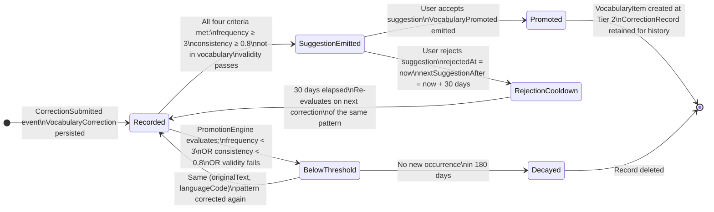
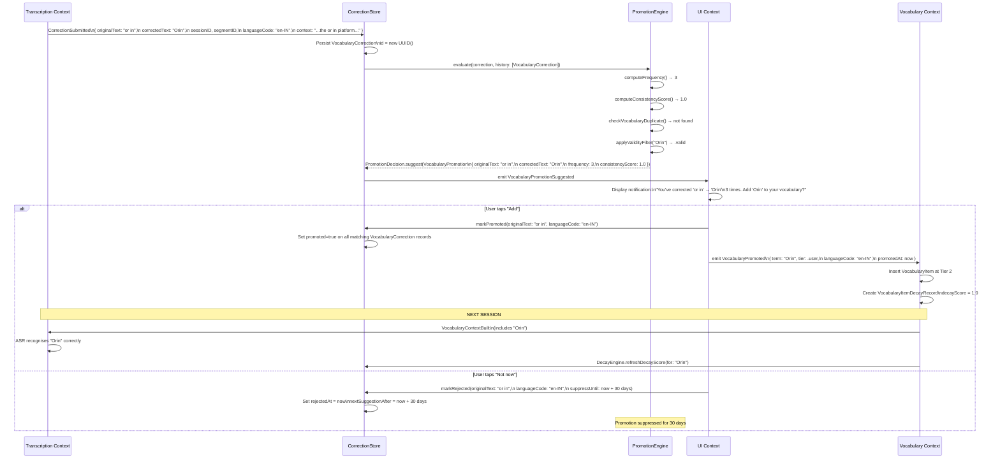
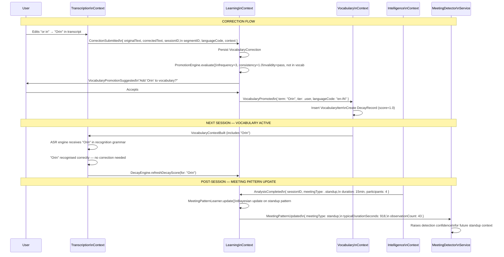
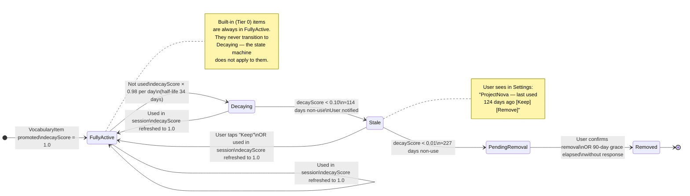

# 06 — Learning Engine Architecture

**Status**: Proposed  
**Author**: Chief Software Architect  
**Date**: 2026-06-29  
**Review Required**: Yes — this document defines the Learning Context in full. Any change to the CorrectionStore schema, promotion algorithm, decay parameters, or privacy classification must be reviewed here first.

---

## Table of Contents

1. [Purpose and Scope](#1-purpose-and-scope)
2. [Learning Philosophy](#2-learning-philosophy)
3. [Four Learning Domains](#3-four-learning-domains)
4. [CorrectionStore Design](#4-correctionstore-design)
5. [PromotionEngine](#5-promotionengine)
6. [Decay Strategy](#6-decay-strategy)
7. [Learning from Analysis Feedback](#7-learning-from-analysis-feedback)
8. [Meeting Pattern Learning](#8-meeting-pattern-learning)
9. [Privacy Architecture](#9-privacy-architecture)
10. [Learning Data Export and Import](#10-learning-data-export-and-import)
11. [Observability Metrics](#11-observability-metrics)
12. [Future: On-Device Fine-Tuning](#12-future-on-device-fine-tuning)
13. [Migration from V1](#13-migration-from-v1)
14. [Architecture Diagrams](#14-architecture-diagrams)
15. [Key Design Decisions and Justifications](#15-key-design-decisions-and-justifications)
16. [Open Questions](#16-open-questions)

---

## 1. Purpose and Scope

This document defines the **Learning Engine**: Orin's mechanism for continuous improvement of transcription accuracy, meeting intelligence, and personalisation based on user behaviour — without requiring any deliberate user configuration effort, without transmitting data off-device, and without accumulating errors that degrade quality over time.

The Learning Engine spans the **Learning Context** (bounded context defined in Document 01) and its interactions with the Vocabulary Context, Intelligence Context, and Transcription Context. It defines:

- The philosophy governing what the system learns and what it refuses to learn
- The four learning domains and their data models
- The CorrectionStore: schema, lifecycle, and invariants
- The PromotionEngine: algorithm, thresholds, and event flow
- The DecayEngine: algorithm, parameters, and removal rules
- Analysis feedback signals and their effect on future inference
- Meeting pattern learning via Bayesian updating
- Privacy classification and data handling obligations
- Export, import, and cross-device sync design
- Observability requirements
- Forward compatibility for on-device model fine-tuning
- Migration from V1

This document does not define the Vocabulary Context's internal model (covered in Document 05) or the Intelligence Context's inference pipeline (covered in Document 04). It defines the *signals and outputs* the Learning Engine sends to those contexts, not their internals.

### 1.1 Current State (V1)

Before this architecture is implemented, the following is the state of learning capabilities in V1:

- **No correction tracking exists.** When a user edits a transcript, the edit is saved to the transcript but no record is made of what was changed.
- **VocabularyProvider has 103 terms with a `.prefix(100)` silent truncation** — 6 terms are silently dropped. This is a known defect that the Vocabulary Context migration (Document 05) will fix; however, it means V1 custom vocabulary is unreliable.
- **Custom vocabulary is stored in UserDefaults** as `[String]`, with no frequency tracking, no decay, and no per-language classification.
- **CorrectionStore does not exist.** It is defined for the first time in this document.
- **The Learning Engine is entirely new.** No existing V1 code contributes to it.

---

## 2. Learning Philosophy

The four principles below are the design axioms for every decision in this document. Where two design options conflict, these principles resolve the tie in priority order.

### 2.1 Passive — The System Must Improve Without User Effort

The user should never be required to actively configure the system to improve. Corrections made naturally during transcript review are the primary input signal. Accepting or rejecting an action item is a sufficient signal. Editing a summary is a sufficient signal. The system extracts learning from these interactions without requiring the user to perform any additional deliberate step.

**WHY this principle exists**: Research on user adoption of AI tools consistently shows that explicit training interfaces — "correct the AI here", "rate this output" — generate initial engagement but rapidly fall off as users habituate to the product. A system that improves passively competes with none of the user's attention budget. Every interaction that would have happened anyway becomes a training signal for free.

**Implication**: Learning is a side effect of normal product usage, not a separate "training" workflow. The UI never asks the user to "train" Orin. It presents correction suggestions as outcomes, not as training requests.

### 2.2 Transparent — Users Can See What Was Learned and Undo It

The user must be able to inspect everything the system has learned: their custom vocabulary, their meeting patterns, the corrections that triggered promotions. The system must be able to explain any promotion decision in plain English: "You corrected 'or in' to 'Orin' 4 times. We added 'Orin' to your vocabulary." The user must be able to undo any learning outcome — individually or in bulk.

**WHY this principle exists**: Privacy-conscious users — Orin's primary target market — will abandon a product that makes invisible changes to its own behaviour. Transparency is a prerequisite for trust. It also serves as a quality mechanism: when users can see what was learned, they catch and correct false promotions before they compound.

**Implication**: Every learned artefact (`VocabularyItem`, `MeetingPattern`, `AnalysisFeedbackRecord`) is visible in Settings and deletable individually or in bulk. The promotion suggestion UI always explains the reason for the suggestion.

### 2.3 Private — All Learning Happens On-Device

All learning data is stored exclusively in SwiftData on the local device. No correction record, vocabulary item, meeting pattern, or analysis feedback record is transmitted to any external server without explicit, informed, opt-in user consent (the only exception is optional iCloud sync — §10.4 — which is encrypted end-to-end and user-initiated). Fine-tuning signals (§12) never leave the device.

**WHY this principle exists**: Vocabulary corrections and meeting patterns are derived from meeting transcripts. Meeting transcripts are among the most sensitive data a professional generates. Any system that transmits these signals — even in anonymised or aggregated form — creates a privacy liability that violates Orin's first-principles product contract with its users. Local learning is not a constraint to be worked around; it is a product differentiator.

**Implication**: The Learning Context has no network dependency on any critical path. It cannot degrade due to network unavailability. The absence of a network call in the learning data path is an architectural invariant, not an implementation detail.

### 2.4 Bounded — Consistency Scoring Prevents Learning From Repeated Mistakes

The system must not mistake repetition for correctness. If a user consistently applies a context-dependent correction that is wrong in some contexts, the system must not promote it. If the user repeatedly makes a typographical error in their transcript corrections, the system must not learn the typo. Promotion requires both frequency **and** consistency relative to a validity check — not frequency alone.

**WHY this principle exists**: An unbounded learning system that learns from every repeated action will eventually learn the user's mistakes as well as their intentions. The canonical failure case: a user who always corrects "read" → "red" when they mean the past tense, but sometimes uses "read" correctly in other contexts. A frequency-only system would promote "read" → "red" as a vocabulary rule and break correct recognitions. The consistency score (§5.3) detects this pattern and blocks the promotion.

**Implication**: The PromotionEngine applies a validity filter and a consistency threshold before any promotion. Frequency is necessary but never sufficient. The system is designed to be conservative: a false positive (promoting a wrong correction) is always worse than a false negative (missing a legitimate promotion).

---

## 3. Four Learning Domains

The Learning Engine operates across four distinct learning domains. Each domain has its own input signal, data model, output artefact, and feedback loop. They are independent: a bug in Meeting Pattern Learning cannot corrupt Vocabulary Learning.

```
┌─────────────────────────────────────────────────────────────────────────┐
│                          LEARNING ENGINE                                │
│                                                                         │
│  ┌──────────────────────┐   ┌───────────────────────────────────────┐   │
│  │ (a) Vocabulary       │   │ (b) Meeting Structure                 │   │
│  │     Learning         │   │     Learning                          │   │
│  │                      │   │                                       │   │
│  │ Input:               │   │ Input:                                │   │
│  │  CorrectionSubmitted │   │  SessionArchived (metadata)           │   │
│  │  (user transcript    │   │  AnalysisCompleted (meeting type)     │   │
│  │   edits)             │   │                                       │   │
│  │                      │   │ Output:                               │   │
│  │ Output:              │   │  MeetingPattern records               │   │
│  │  VocabularyItems     │   │  → MeetingDetectorService             │   │
│  │  at Tier 2           │   │  → PromptStrategy                     │   │
│  │                      │   │  → VocabularyContextBuilder           │   │
│  └──────────────────────┘   └───────────────────────────────────────┘   │
│                                                                         │
│  ┌──────────────────────┐   ┌───────────────────────────────────────┐   │
│  │ (c) Action Item      │   │ (d) Participant Recognition           │   │
│  │     Pattern Learning │   │     Learning                          │   │
│  │                      │   │                                       │   │
│  │ Input:               │   │ Input:                                │   │
│  │  ActionItemConfirmed │   │  Speaker attribution corrections      │   │
│  │  ActionItemRejected  │   │  (Phase 3 — diarisation required)     │   │
│  │  ActionItemAdded     │   │                                       │   │
│  │                      │   │ Status:                               │   │
│  │ Output:              │   │  Designed here, NOT built             │   │
│  │  PromptStrategy      │   │  Output: VoiceProfile records         │   │
│  │  confidence tuning   │   │  Gated on Apple diarisation support   │   │
│  └──────────────────────┘   └───────────────────────────────────────┘   │
│                                                                         │
└─────────────────────────────────────────────────────────────────────────┘
```

### 3.1 Vocabulary Learning

**What it learns**: Which words the ASR engine systematically misrecognises for this user's speech patterns and meeting vocabulary, and what the correct term is.

**Input signal**: `CorrectionSubmitted` — the user edits a transcript segment, changing a word or phrase from what ASR produced to what was actually said.

**Output artefact**: `VocabularyItem` at Tier 2 (User vocabulary), emitted via `VocabularyPromoted`.

**WHY this is the highest-priority learning domain**: ASR accuracy is the foundation of every downstream function. A summary generated from a transcript that contains "or in" instead of "Orin" five times is qualitatively worse than one generated from a clean transcript. The intelligence layer cannot compensate for transcription errors — it can only surface them more prominently. Vocabulary learning has immediate, measurable, session-over-session impact. Every other learning domain depends on the transcript quality that vocabulary learning improves.

**Example**: User: Abhishek Joshi works at Rconcept. Their ASR frequently produces "our concept" and "or in" for company-specific terms. After three corrections per term, both "Rconcept" and "Orin" are promoted to Tier 2 vocabulary. On the next session, the ASR engine recognises both correctly.

### 3.2 Meeting Structure Learning

**What it learns**: The user's recurring meeting types, their typical duration, their typical attendee composition, and the vocabulary themes that appear in each type.

**Input signal**: Completed session metadata (duration, participant IDs, detected meeting type) combined with `AnalysisCompleted` (meeting type confirmation from the intelligence layer).

**Output artefact**: `MeetingPattern` records — one per detected meeting type, updated after each session of that type.

**WHY this matters**: Meeting detection today relies on heuristics (keywords, duration thresholds, participant patterns). Meeting Pattern Learning progressively personalises these heuristics to the user's actual meeting habits. A user whose standups run 20 minutes instead of 15 will have a `MeetingPattern` that reflects this, leading to more accurate auto-detection rather than false-detection as a "one-on-one".

### 3.3 Action Item Pattern Learning

**What it learns**: How this user phrases commitments and assignments — the verb patterns, time-reference patterns, and assignment-language patterns most common in their specific meeting context.

**Input signal**: User accepts an action item (positive signal), user rejects an action item (negative signal), user manually adds an action item Orin missed (missed-detection signal).

**Output artefact**: Confidence threshold adjustments in the `ActionItemSignalAggregator`, consumed by `PromptStrategy` when constructing analysis prompts.

**WHY this is separate from general analysis feedback**: Action item extraction is the analysis output users interact with most directly and react to most immediately. Separating the signal ensures that tuning action item extraction does not inadvertently affect summary quality or key point extraction. Each signal type has a distinct effect; conflating them would make the tuning less precise.

### 3.4 Participant Recognition Learning

**Status**: **Designed here. Not implemented until Phase 3. Diarisation support required.**

**What it will learn**: Which voice profiles correspond to which participant identities, allowing automatic speaker attribution across sessions without the user manually assigning speakers each time.

**Input signal**: User corrects a speaker attribution ("This utterance was Alex, not Unknown Speaker 2").

**Output artefact**: `VoiceProfile` — a compact voice embedding associated with a `ContactID`, persisted for future session attribution.

**WHY it is gated**: Apple's Speech framework (as of iOS 18 / macOS 15) does not provide speaker diarisation through the `SpeechTranscriber` API. The `useNewParticipantPipeline` feature flag gates any diarisation-dependent code (see Document 03 Phase 2B gating rules). No `VoiceProfile` records will be created until diarisation is active. The schema is defined now to ensure future implementation does not require a disruptive data model change.

---

## 4. CorrectionStore Design

The CorrectionStore is a SwiftData container that persists every transcript correction the user makes. It is the primary input data source for the PromotionEngine.

### 4.1 VocabularyCorrection Model

```swift
import SwiftData
import Foundation

/// A single user correction applied to a transcript segment.
///
/// Immutable once created — corrections are never edited in place.
/// To logically reverse a correction, the UI creates a new correction
/// with swapped originalText/correctedText. This preserves a complete
/// audit trail and allows the PromotionEngine to observe reversal patterns.
@Model
final class VocabularyCorrection {

    // MARK: — Identity

    @Attribute(.unique)
    var id: UUID

    /// The session during which this correction was made.
    /// Foreign key for cascading deletion when a session is deleted.
    var sessionID: UUID

    /// The specific segment that was corrected.
    /// Allows reconstruction of what was on screen when the correction was made.
    var segmentID: UUID

    // MARK: — Correction Content

    /// Exactly what the ASR engine produced. Stored verbatim, not normalised.
    /// Normalisation is applied at query time by CorrectionNormaliser.
    var originalText: String

    /// What the user changed the original to.
    /// This becomes the term of the resulting VocabularyItem if promoted.
    var correctedText: String

    /// The language tag of the ASR session during which this correction occurred.
    /// BCP 47 format: "en-US", "en-IN", "hi-IN".
    ///
    /// WHY this is stored: A correction made during an English session ("centre"→"center")
    /// must not influence Hindi vocabulary, and vice versa. Without languageCode, the
    /// PromotionEngine cannot distinguish between a correction that is valid in English
    /// and one that is linguistically invalid in a different language context. This is
    /// particularly critical for Hinglish sessions where the same token may appear in
    /// both English and transliterated Hindi contexts.
    var languageCode: String

    /// Up to 60 characters of surrounding transcript text (≈30 chars either side of the
    /// corrected token), captured at correction time.
    ///
    /// WHY this is stored: The same ASR misrecognition may be a correct word in one
    /// context and an error in another. Example: "read" vs "red" — homophones whose
    /// correct form is determined entirely by context. Storing context allows the
    /// PromotionEngine to compute a consistency score that accounts for whether the
    /// same correction appears in similar linguistic contexts, reducing false promotions
    /// from context-sensitive homophones.
    ///
    /// 60 characters is chosen as the minimum that provides meaningful disambiguation
    /// without constituting a quotable excerpt of the meeting transcript, keeping
    /// the privacy classification manageable.
    var context: String

    // MARK: — Timestamps

    var timestamp: Date

    // MARK: — Promotion Lifecycle

    /// Whether this correction's pattern has been promoted to a VocabularyItem.
    /// Once true, this record is read-only with respect to promotion state.
    var promoted: Bool

    /// When the resulting VocabularyItem was created from this correction.
    var promotedAt: Date?

    /// The VocabularyItem ID created from this correction's pattern, if promoted.
    /// Used to decrement frequency counts when this session is deleted.
    var promotedItemID: UUID?

    // MARK: — Rejection State

    /// Whether the user explicitly rejected the promotion suggestion for this pattern.
    /// Set on the canonical (first-recorded) correction for the same originalText key.
    var decayed: Bool

    /// When the rejection suppression expires.
    /// User explicitly rejected promotion → set to now + 30 days.
    /// After this date, the PromotionEngine may suggest again if criteria are still met.
    var rejectedAt: Date?

    /// The date after which the promotion suggestion can be re-issued to the user.
    /// nil means no active suppression.
    var nextSuggestionAfter: Date?

    // MARK: — Initialiser

    init(
        id: UUID = UUID(),
        sessionID: UUID,
        segmentID: UUID,
        originalText: String,
        correctedText: String,
        languageCode: String,
        context: String,
        timestamp: Date = Date()
    ) {
        self.id = id
        self.sessionID = sessionID
        self.segmentID = segmentID
        self.originalText = originalText
        self.correctedText = correctedText
        self.languageCode = languageCode
        self.context = context
        self.timestamp = timestamp
        self.promoted = false
        self.promotedAt = nil
        self.promotedItemID = nil
        self.decayed = false
        self.rejectedAt = nil
        self.nextSuggestionAfter = nil
    }
}
```

### 4.2 AnalysisFeedbackRecord Model

```swift
/// Records a single user feedback action on an analysis output.
///
/// These records serve two purposes:
/// 1. Immediate: they feed the ActionItemSignalAggregator to tune PromptStrategy.
/// 2. Future: they accumulate as (input, ideal_output) training pairs for
///    on-device fine-tuning when that capability becomes available (§12).
@Model
final class AnalysisFeedbackRecord {

    @Attribute(.unique)
    var id: UUID

    var sessionID: UUID
    var timestamp: Date

    /// The type of feedback signal.
    var feedbackType: FeedbackType

    /// For summaryEdited: a compact delta representation of what changed.
    /// For actionItemRejected: the full text of the rejected item.
    /// For actionItemAdded: the full text of the user-added item.
    /// nil for markedGood (no payload needed).
    var deltaText: String?

    /// The action item text — present for actionItemRejected and actionItemAdded.
    var actionItemText: String?

    /// Whether this record has been consumed by a fine-tuning process.
    /// Prevents double-submission when fine-tuning is eventually added.
    var consumedByFineTuning: Bool = false
}

/// The category of user feedback on an analysis output.
///
/// WHY each case exists:
/// - summaryEdited: the summary did not accurately represent the meeting. Delta text
///   captures the nature of the edit for future quality analysis.
/// - actionItemRejected: the model extracted an item the user disagrees with.
///   Repeated rejections of a particular verb pattern decrease extraction sensitivity.
/// - actionItemAdded: the model missed an action item the user considers real.
///   Repeated additions of a particular pattern increase extraction sensitivity.
/// - markedGood: explicit positive signal. Stored for future use; currently
///   produces no PromptStrategy effect because a single "good" mark is weak evidence.
enum FeedbackType: String, Codable {
    case summaryEdited
    case actionItemRejected
    case actionItemAdded
    case markedGood
}
```

### 4.3 Context Capture Algorithm

The `context` field in `VocabularyCorrection` is captured by the transcript editor at the moment of correction. The capture algorithm extracts a symmetric window around the corrected token:

```swift
/// Captures ≈60 characters of surrounding context for a correction.
///
/// The 15-second window gathers neighbouring segments to provide sentence-level
/// context rather than just the single segment being edited.
func captureContext(
    segment: TranscriptSegment,
    allSegments: [TranscriptSegment],
    maxLength: Int = 60
) -> String {
    // Gather segments within ±15 seconds for richer context
    let nearbyText = allSegments
        .filter { abs($0.startTime - segment.startTime) < 15.0 }
        .map(\.text)
        .joined(separator: " ")

    guard let range = nearbyText.range(of: segment.text) else {
        return String(nearbyText.prefix(maxLength))
    }

    let prefixDistance = nearbyText.distance(
        from: nearbyText.startIndex,
        to: range.lowerBound
    )
    let suffixDistance = nearbyText.distance(
        from: range.upperBound,
        to: nearbyText.endIndex
    )

    let startOffset = min(maxLength / 2, prefixDistance)
    let endOffset = min(maxLength / 2, suffixDistance)

    let start = nearbyText.index(range.lowerBound, offsetBy: -startOffset)
    let end = nearbyText.index(range.upperBound, offsetBy: endOffset)

    return String(nearbyText[start..<end])
}
```

### 4.4 Correction Normalisation

Before frequency matching, the `CorrectionNormaliser` computes a comparison key from `originalText`:

1. Trim leading/trailing whitespace
2. Lowercase
3. Collapse internal whitespace ("or  in" → "or in")
4. Strip trailing punctuation ("Orin." → "Orin" for key purposes)

The normalised key is **never stored** — only the verbatim `originalText` and `correctedText` are persisted. The key is recomputed at query time. This preserves correct capitalisation for the resulting `VocabularyItem` while allowing case-insensitive frequency matching.

### 4.5 Correction Lifecycle State Machine



### 4.6 Cascading Deletion

When `SessionDeleted` is received, the CorrectionStore must remove all learning records associated with that session:

```swift
func deleteCorrectionsForSession(_ sessionID: UUID, context: ModelContext) throws {
    let descriptor = FetchDescriptor<VocabularyCorrection>(
        predicate: #Predicate { $0.sessionID == sessionID }
    )
    let corrections = try context.fetch(descriptor)

    for correction in corrections {
        // If this correction contributed to a promoted VocabularyItem,
        // notify the PromotionEngine so it can re-evaluate frequency.
        if correction.promoted, let itemID = correction.promotedItemID {
            Task { await promotionEngine.notifySourceSessionDeleted(itemID: itemID) }
        }
        context.delete(correction)
    }

    // Delete all AnalysisFeedbackRecords for this session too
    let feedbackDescriptor = FetchDescriptor<AnalysisFeedbackRecord>(
        predicate: #Predicate { $0.sessionID == sessionID }
    )
    let feedbacks = try context.fetch(feedbackDescriptor)
    feedbacks.forEach { context.delete($0) }

    try context.save()
}
```

This preserves the invariant: **deleting a session deletes all learning data derived from that session's content.**

---

## 5. PromotionEngine

The PromotionEngine decides when a correction pattern has been observed reliably enough to trust as ground truth for this user. It is the gatekeeper between raw corrections and promoted vocabulary.

### 5.1 Promotion Criteria

All four criteria must be satisfied simultaneously. Partial satisfaction results in `notReady`:

| Criterion | Threshold | WHY this threshold |
|-----------|-----------|-------------------|
| **Frequency** | ≥ 3 occurrences | One correction may be a one-time decision. Two could be coincidence. Three independent occurrences across different sessions establish a pattern without requiring an impractically long observation window. |
| **Consistency score** | ≥ 0.80 | In at least 80% of occurrences, the user applied the same correction. This filters context-sensitive corrections where the same original text is sometimes correct and sometimes wrong. |
| **Not already in vocabulary** | At any tier | Promoting a term already present wastes ASR recognition budget and may create conflicting entries. |
| **Validity filter** | All checks pass | Prevents promotion of stop words, pure numbers, punctuation artefacts, or sentence fragments. |

### 5.2 Promotion Actor Interface

```swift
/// The PromotionEngine evaluates correction patterns against promotion criteria.
///
/// Declared as an actor to serialise concurrent evaluation requests.
/// Multiple CorrectionSubmitted events for different patterns may arrive
/// nearly simultaneously (e.g., user edits a long transcript in bulk).
/// Actor serialisation prevents consistency-score races on shared correction history.
actor PromotionEngine {

    /// Evaluate whether a correction pattern is ready for promotion.
    ///
    /// Called after every CorrectionSubmitted event for the same
    /// (originalText, languageCode) pair. Event-driven, not batched.
    func evaluate(
        _ correction: VocabularyCorrection,
        history: [VocabularyCorrection]
    ) async -> PromotionDecision
}

/// The outcome of evaluating a correction pattern against promotion criteria.
enum PromotionDecision {

    /// All criteria satisfied. Emit VocabularyPromotionSuggested.
    case suggest(VocabularyPromotion)

    /// Frequency or consistency not yet met. Include diagnostic context.
    case notReady(reason: String, currentFrequency: Int, requiredFrequency: Int)

    /// This pattern was already promoted. No action needed.
    case alreadyPromoted

    /// The correctedText fails the validity filter. Describe the failure.
    case validityFailure(reason: String)

    /// The suggestion is in the rejection cooldown period.
    /// Include when suppression expires so the caller can schedule a re-check.
    case suppressedUntil(Date)
}

/// The payload emitted with VocabularyPromotionSuggested.
struct VocabularyPromotion {
    var originalText: String
    var correctedText: String
    var languageCode: String
    var frequency: Int
    var consistencyScore: Double
    var contributingSessionIDs: [UUID]
    var suggestedAt: Date
}
```

### 5.3 Validity Filter

```swift
struct CorrectionValidityFilter {

    /// Common English and Hindi function words that should not be promoted
    /// as custom vocabulary items regardless of correction frequency.
    private static let stopWords: Set<String> = [
        // English
        "the", "a", "an", "and", "or", "but", "in", "on", "at", "to",
        "for", "of", "with", "by", "from", "as", "is", "was", "are",
        "were", "be", "been", "being", "have", "has", "had", "do", "does",
        "did", "will", "would", "could", "should", "may", "might", "shall",
        "that", "this", "these", "those", "it", "its", "my", "your", "our",
        // Common Hindi transliterations
        "aur", "hai", "hain", "mein", "karo", "karna", "kiya", "toh",
        "bhi", "nahi", "nahin", "tha", "thi", "the"
    ]

    /// Returns true if the term is a valid candidate for vocabulary promotion.
    func isValid(_ term: String) -> ValidationResult {
        let trimmed = term.trimmingCharacters(in: .whitespacesAndNewlines)

        // Must be at least 2 characters
        guard trimmed.count >= 2 else {
            return .invalid("Term is too short (minimum 2 characters)")
        }

        // Must not be a stop word
        guard !Self.stopWords.contains(trimmed.lowercased()) else {
            return .invalid("'\(trimmed)' is a common function word and cannot be promoted")
        }

        // Must not be purely numeric
        guard Double(trimmed) == nil && Int(trimmed) == nil else {
            return .invalid("Pure numbers are not promoted as vocabulary terms")
        }

        // Must contain at least one letter character
        guard trimmed.rangeOfCharacter(from: .letters) != nil else {
            return .invalid("Term contains no letter characters")
        }

        // Must not be longer than 60 characters (guards against sentence fragments)
        guard trimmed.count <= 60 else {
            return .invalid("Term is too long — may be a sentence fragment (maximum 60 characters)")
        }

        return .valid
    }

    enum ValidationResult {
        case valid
        case invalid(String)
    }
}
```

### 5.4 Consistency Score Calculation

The consistency score measures how reliably the user applied the **same** correction when the **same** original text appeared. A score of 1.0 means the user always corrected this `originalText` to the same `correctedText`. A score of 0.5 means the same `originalText` was corrected to two different terms equally often — a strong signal of context-dependence.

```swift
extension PromotionEngine {

    func consistencyScore(
        originalText: String,
        languageCode: String,
        in history: [VocabularyCorrection]
    ) -> Double {
        let key = originalText
            .lowercased()
            .trimmingCharacters(in: .whitespacesAndNewlines)

        let matching = history.filter {
            $0.languageCode == languageCode &&
            !$0.decayed &&
            $0.originalText.lowercased().trimmingCharacters(in: .whitespacesAndNewlines) == key
        }

        guard !matching.isEmpty else { return 0.0 }

        // Group by the corrected term and find the most frequently applied correction
        let correctedCounts = Dictionary(grouping: matching, by: { term in
            term.correctedText.trimmingCharacters(in: .whitespacesAndNewlines)
        }).mapValues(\.count)

        let maxCount = correctedCounts.values.max() ?? 0
        return Double(maxCount) / Double(matching.count)
    }
}
```

### 5.5 Promotion Flow

```mermaid
flowchart TD
    A([CorrectionSubmitted]) --> B[CorrectionStore persists\nVocabularyCorrection]
    B --> C[PromotionEngine.evaluate called\nwith correction + history]
    C --> D{Is pattern already\npromoted?}
    D -->|Yes| E([Return .alreadyPromoted\nNo action])
    D -->|No| F{Is suggestion in\ncooldown period?\nnextSuggestionAfter > now}
    F -->|Yes| G([Return .suppressedUntil\nNo UI action])
    F -->|No| H{Apply validity filter\nto correctedText}
    H -->|Fails| I([Return .validityFailure reason\nNo UI action])
    H -->|Passes| J{frequency ≥ 3?}
    J -->|No| K([Return .notReady\ncurrentFrequency, requiredFrequency])
    J -->|Yes| L{consistencyScore ≥ 0.80?}
    L -->|No| M([Return .notReady\n"Inconsistent correction pattern"])
    L -->|Yes| N{Term already in\nvocabulary at any tier?}
    N -->|Yes| O([Return .alreadyPromoted])
    N -->|No| P[Emit VocabularyPromotionSuggested\nVocabularyPromotion payload]
    P --> Q[UI shows notification:\n"You've corrected 'or in' → 'Orin'\n4 times. Add 'Orin' to vocabulary?"]
    Q --> R{User responds}
    R -->|Accepts| S[markPromoted on correction records\nEmit VocabularyPromoted\nCreate VocabularyItem at Tier 2]
    R -->|Rejects| T[Set rejectedAt = now\nSet nextSuggestionAfter = now + 30 days\nEmit VocabularyPromotionRejected]
    S --> U([VocabularyItem active in\nnext VocabularyContextBuilt])
    T --> V([Suggestion suppressed\nfor 30 days])
```

### 5.6 Re-evaluation Trigger

The PromotionEngine evaluates **after every `CorrectionSubmitted` event** for the same `(originalText, languageCode)` pair. It does not run a scheduled batch job. This ensures:

- The user sees a promotion suggestion promptly after the threshold is crossed — ideally during the same review session where they made the qualifying correction
- No background polling or scheduling logic is required
- The evaluation is idempotent: running it again on the same history produces the same result

---

## 6. Decay Strategy

### 6.1 WHY Decay Exists

Vocabularies change. An abbreviation common at a previous employer, a project codename from a concluded engagement, a colleague who has left — all of these generate `VocabularyItem` records that become noise once the context that produced them is gone. Without decay, the vocabulary grows monotonically, eventually harming recognition quality as the ASR engine tries to match against an increasingly long list of low-relevance terms. The `.prefix(100)` truncation bug in V1 is a symptom of this problem: even 103 terms exceeded a practical limit.

Decay is modelled as continuous exponential decay applied in discrete daily steps. This model was chosen over a binary "not used in N days → delete" TTL because:

1. Exponential decay has no cliff edge — a term used 89 days ago is not treated catastrophically differently from one used 91 days ago
2. It can be described to users in plain language: "freshness score" that reduces by 2% per day of non-use
3. It rewards recent use proportionally: a term used yesterday has full score; a term unused for 6 months has minimal score
4. It converges smoothly to zero, giving the user time to notice stale items and keep them intentionally

**Built-in terms (Tier 0) never decay.** They are version-controlled, not user-learned. Decay applies only to user-promoted Tier 2 items.

### 6.2 DecayEngine Actor

```swift
/// The DecayEngine applies exponential decay to VocabularyItem decay scores.
///
/// Runs on a daily cadence, triggered by the AppLifecycleCoordinator.
/// Built-in (Tier 0) vocabulary items are never decayed — they are
/// version-controlled artefacts, not learned data.
actor DecayEngine {

    /// Per-day decay multiplier.
    /// Derivation: 0.98^34 ≈ 0.506 → half-life of approximately 34 days.
    /// 34 days was chosen to align with quarterly project cycles:
    ///   - Weekly meeting vocabulary stays above stale threshold (~114 days)
    ///   - Project vocabulary from a 3-month engagement decays gracefully after project ends
    ///   - Vocabulary from a departed colleague fully expires in ~9 months without interruption
    private let decayRatePerDay: Double = 0.98

    static let stalenessThreshold: Double = 0.1   // ≈ 114 days of non-use
    static let removalThreshold: Double = 0.01    // ≈ 227 days of non-use

    /// Apply daily decay to all user-tier vocabulary items.
    func applyDailyDecay(to items: [VocabularyItem]) async -> [DecayResult]

    /// Called when a VocabularyItem is matched in a session vocabulary build.
    /// Refreshes the decay score to 1.0 (fully active).
    func refreshDecayScore(for itemID: UUID) async
}

/// The outcome of evaluating a single VocabularyItem during a decay pass.
enum DecayResult {

    /// Term was matched in a recent session. Score refreshed to 1.0.
    case refreshed(VocabularyItem)

    /// Term was not recently used. Score reduced; item remains active.
    case decaying(VocabularyItem, newScore: Double)

    /// Score < 0.1. User notified via VocabularyItemStale event.
    case stale(VocabularyItem)

    /// Score < 0.01. Auto-removed after user confirmation for user-tier items.
    /// Built-in items are never in this state.
    case expired(VocabularyItem)
}
```

### 6.3 Decay Algorithm Implementation

```swift
extension DecayEngine {

    func applyDailyDecay(to items: [VocabularyItem]) async -> [DecayResult] {
        let today = Date()
        var results: [DecayResult] = []

        for item in items {
            // Tier 0 (built-in) items are never decayed
            guard item.tier != .builtIn else { continue }

            let record = await fetchOrCreateDecayRecord(for: item)

            let daysSinceLastEvaluation = Calendar.current.dateComponents(
                [.day],
                from: record.lastEvaluatedAt,
                to: today
            ).day ?? 0

            // Short-circuit if evaluated today already
            guard daysSinceLastEvaluation >= 1 else {
                results.append(.decaying(item, newScore: record.decayScore))
                continue
            }

            // Compound decay for all elapsed days
            let newScore = record.decayScore * pow(decayRatePerDay, Double(daysSinceLastEvaluation))
            record.decayScore = newScore
            record.lastEvaluatedAt = today

            switch newScore {
            case Self.removalThreshold...:
                if newScore < Self.stalenessThreshold {
                    if !record.stalenessNotified {
                        record.stalenessNotified = true
                        results.append(.stale(item))
                    } else {
                        results.append(.decaying(item, newScore: newScore))
                    }
                } else {
                    results.append(.decaying(item, newScore: newScore))
                }

            default:
                // Below removal threshold
                results.append(.expired(item))
            }
        }

        return results
    }

    func refreshDecayScore(for itemID: UUID) async {
        guard var record = await fetchDecayRecord(for: itemID) else { return }
        record.decayScore = 1.0
        record.lastUsedAt = Date()
        record.stalenessNotified = false   // Item is active again — reset notification flag
    }
}
```

### 6.4 Decay Score Refresh on Session Use

When `VocabularyContextBuilder` assembles the vocabulary for a new session, it calls `DecayEngine.refreshDecayScore(for:)` for every `VocabularyItem` it includes in the context. This ensures items actively being used do not decay regardless of calendar time between sessions.

**Practical implication**: A user who meets daily will have all their vocabulary items at or near 1.0 indefinitely. A user who takes a 3-week holiday returns to find their vocabulary at `0.98^21 ≈ 0.65` — well above the staleness threshold. This is by design.

### 6.5 Decay Parameters Summary

| Parameter | Value | Non-use Period Equivalent |
|-----------|-------|---------------------------|
| `decayRatePerDay` | 0.98 | Half-life ≈ 34 days |
| Staleness threshold | 0.10 | ≈ 114 days of non-use |
| Removal threshold | 0.01 | ≈ 227 days of non-use |
| User-tier removal grace (no confirmation received) | +90 days | ≈ 317 days total |

These parameters are **not user-configurable in V1**. They may be exposed as Settings controls in a future release after user research on whether users find the half-life too aggressive or too permissive.

---

## 7. Learning from Analysis Feedback

### 7.1 Feedback Signals and Their Effects

When a user interacts with an analysis output, those interactions generate learning signals. The table below maps each signal to its immediate data action and its downstream effect on future analyses:

| User Action | FeedbackType | Immediate Data Action | Downstream Effect |
|-------------|-------------|----------------------|-------------------|
| Edits the summary | `summaryEdited` | Compute and store delta text | Stored as potential fine-tuning signal; no immediate PromptStrategy change |
| Rejects an action item | `actionItemRejected` | Store rejected item text | Decrease confidence threshold for that verb pattern (-0.05 per rejection) |
| Adds a missed action item | `actionItemAdded` | Store added item text | Increase sensitivity for that assignment pattern (+0.10 per addition) |
| Confirms an action item | (implicit) | Not stored separately | No effect — acceptance is the default state |
| Marks analysis as "good" | `markedGood` | Store positive signal | No immediate PromptStrategy effect; stored for aggregate analysis |

The asymmetry between the `actionItemAdded` (+0.10) and `actionItemRejected` (-0.05) deltas is intentional: missing an action item is typically more damaging than suggesting one the user doesn't want. A missed commitment costs work; an unnecessary suggestion costs a tap to dismiss.

### 7.2 AnalysisFeedbackProcessor

```swift
/// Processes incoming feedback records and applies their effects.
actor AnalysisFeedbackProcessor {

    private let aggregator: ActionItemSignalAggregator
    private let modelContext: ModelContext

    /// Process a single feedback record.
    ///
    /// - Parameters:
    ///   - feedback: The feedback record to process.
    ///   - context: Meeting context at the time of the analysis.
    func process(_ feedback: AnalysisFeedbackRecord, context: MeetingContext) async {
        // Persist the record
        modelContext.insert(feedback)
        try? modelContext.save()

        // Apply effect to ActionItemSignalAggregator
        switch feedback.feedbackType {
        case .actionItemRejected:
            await aggregator.apply(record: feedback)
        case .actionItemAdded:
            await aggregator.apply(record: feedback)
        case .summaryEdited:
            // Stored for future fine-tuning; no immediate PromptStrategy effect
            break
        case .markedGood:
            // Positive signal stored; no immediate effect
            break
        }
    }

    /// Export all unconsumed feedback records as training signals.
    /// Used when on-device fine-tuning becomes available (§12).
    func exportTrainingSignals() async -> [TrainingSignal] {
        let descriptor = FetchDescriptor<AnalysisFeedbackRecord>(
            predicate: #Predicate { !$0.consumedByFineTuning }
        )
        guard let records = try? modelContext.fetch(descriptor) else { return [] }
        return records.compactMap { TrainingSignal(from: $0) }
    }
}
```

### 7.3 ActionItemSignalAggregator

The `ActionItemSignalAggregator` maintains a running confidence map keyed on action item pattern signatures. A pattern signature encodes the linguistic structure of an action item as `{verb_lemma}:{has_named_assignee}:{has_explicit_deadline}`.

Examples:
- "Send the report by Friday" → signature `"send:false:true"`
- "Alex will review the proposal" → signature `"review:true:false"`
- "We need to schedule a follow-up" → signature `"schedule:false:false"`

```swift
actor ActionItemSignalAggregator {

    /// Per-pattern confidence scores, clamped to [0.10, 0.95].
    /// 0.5 = neutral (model default). >0.5 = more sensitive. <0.5 = less sensitive.
    private var confidenceMap: [String: Double] = [:]

    /// The bounds within which confidence scores are clamped.
    /// Lower bound 0.10 prevents the system from completely suppressing a pattern.
    /// Upper bound 0.95 prevents false certainty.
    private let confidenceBounds: ClosedRange<Double> = 0.10...0.95

    func apply(record: AnalysisFeedbackRecord) {
        guard let text = record.actionItemText ?? record.deltaText,
              let signature = ActionItemPatternExtractor.signature(for: text) else { return }

        let current = confidenceMap[signature] ?? 0.5
        let delta: Double
        switch record.feedbackType {
        case .actionItemRejected: delta = -0.05
        case .actionItemAdded:    delta = +0.10
        default:                  return
        }

        confidenceMap[signature] = (current + delta).clamped(to: confidenceBounds)
    }

    func confidenceThreshold(for signature: String) -> Double {
        return confidenceMap[signature] ?? 0.5
    }
}
```

### 7.4 Effect on PromptStrategy

The PromptStrategy queries `ActionItemSignalAggregator.confidenceThreshold(for:)` during prompt construction and injects a natural-language sensitivity instruction:

- Confidence > 0.75: `"Extract action items liberally — err on the side of inclusion"`
- Confidence 0.4–0.75: `"Extract action items with standard confidence"`  
- Confidence < 0.4: `"Extract only clear, explicit commitments with unambiguous assignees or deadlines"`

This is a personalisation of the prompt template, not a modification of the model weights. It is fully reversible by resetting learning data.

---

## 8. Meeting Pattern Learning

### 8.1 MeetingPattern Model

```swift
/// A learned profile of a recurring meeting type for this user.
///
/// Updated after every session of the corresponding meeting type via Bayesian updating.
/// Consumed by MeetingDetectorService, PromptStrategy, and VocabularyContextBuilder.
struct MeetingPattern: Codable {

    var meetingType: MeetingType

    /// Bayesian running estimate of typical session duration (seconds).
    ///
    /// Bayesian formula: new_mean = (α × prior_mean + observation) / (α + 1)
    /// where α = observationCount. This means:
    ///   - After 1 session: estimate = that session's duration (no prior)
    ///   - After 5 sessions: a new observation shifts the mean by ≈17%
    ///   - After 20 sessions: a new observation shifts the mean by ≈5%
    var typicalDurationSeconds: Double

    /// Bayesian running estimate of typical participant count.
    var typicalParticipantCount: Double

    /// ContactIDs that have appeared in ≥50% of sessions of this type,
    /// sorted by appearance frequency (most frequent first).
    var commonParticipants: [UUID]

    /// Weekday/hour pairs weighted by session frequency.
    /// Used to raise detection confidence when the current time matches a known slot.
    var commonTimeSlots: [WeekdayHour]

    /// The 20 terms appearing most frequently in sessions of this type
    /// (TF-IDF weighted against all session types).
    /// Used by VocabularyContextBuilder to pre-load domain vocabulary.
    var vocabularyThemes: [String]

    /// How many sessions have contributed to this pattern.
    /// Determines the weight given to the prior in Bayesian updates.
    var observationCount: Int
}

struct WeekdayHour: Codable, Hashable {
    var weekday: Int   // 1 (Sunday) through 7 (Saturday), per Calendar convention
    var hour: Int      // 0–23
    var weight: Double // Proportion of sessions of this type at this slot (0–1)
}
```

### 8.2 Bayesian Updating

The Bayesian update formula for `typicalDurationSeconds` is:

```
new_estimate = (α × prior + observation) / (α + 1)
```

where `α` = `observationCount` (the weight given to the prior). This is an online mean update equivalent to Welford's algorithm for incremental mean computation.

**WHY Bayesian over simple average**: A simple average reacts equally to every observation, meaning a single outlier meeting (e.g., a standup that ran 60 minutes because of an incident) permanently shifts the estimate. With Bayesian updating, a mature pattern (high `α`) treats the outlier as a small perturbation. The pattern self-corrects over subsequent normal sessions without requiring any explicit outlier handling.

```swift
actor MeetingPatternLearner {

    func update(
        pattern: inout MeetingPattern,
        with session: CompletedSessionSummary
    ) {
        let alpha = Double(pattern.observationCount)

        // Bayesian update: duration
        pattern.typicalDurationSeconds =
            (alpha * pattern.typicalDurationSeconds + session.actualDuration) / (alpha + 1)

        // Bayesian update: participant count
        pattern.typicalParticipantCount =
            (alpha * pattern.typicalParticipantCount + Double(session.participantCount)) / (alpha + 1)

        // Common participants: add if appearing in ≥50% of sessions
        updateCommonParticipants(
            &pattern,
            newParticipants: session.participantIDs,
            totalSessions: pattern.observationCount + 1
        )

        // Time slot weights: renormalise after adding this session's slot
        updateTimeSlots(&pattern, session: session)

        // Vocabulary themes: TF-IDF update if transcript available
        if let transcript = session.transcriptSummary {
            updateVocabularyThemes(&pattern, transcript: transcript)
        }

        pattern.observationCount += 1
    }
}
```

### 8.3 Pattern Consumers

| Consumer | Field Read | How It Is Used |
|----------|-----------|----------------|
| `MeetingDetectorService` | `typicalDurationSeconds`, `commonTimeSlots`, `commonParticipants`, `observationCount` | Raises detection confidence when current context matches a known pattern |
| `PromptStrategy` | `meetingType` (confirmed by pattern match) | Selects the prompt template for the meeting type |
| `VocabularyContextBuilder` | `vocabularyThemes` | Pre-loads domain-relevant terms into session vocabulary before recording starts |
| `SessionUI` | `typicalDurationSeconds` | Displays estimated session duration in the recording UI pre-start |

---

## 9. Privacy Architecture

### 9.1 Data Classification

| Data Type | Classification | WHY |
|-----------|---------------|-----|
| `VocabularyCorrection` | **Restricted** | Contains verbatim transcript fragments and user editing behaviour patterns |
| `AnalysisFeedbackRecord` | **Restricted** | Contains analysis text fragments derived directly from meeting content |
| `MeetingPattern` | **Sensitive** | Reveals recurring meeting habits, participant relationships, scheduling patterns |
| `VoiceProfile` *(Phase 3)* | **Restricted** | Biometric-adjacent data — acoustic fingerprint derived from voice |
| `VocabularyItem` (Tier 2, user) | **Sensitive** | Domain vocabulary that may reveal business context, project names, people |
| `VocabularyItem` (Tier 0, built-in) | **Internal** | Version-controlled application data, not user data |

**Restricted** data follows the same handling rules as transcript text (Document 01): encrypted at rest via the macOS Data Protection APIs, excluded from crash reports, not accessible to plugins without explicit capability grant.

### 9.2 Storage Location

All learning data is stored in a **dedicated SwiftData container** at:

```
~/Library/Application Support/com.rconcept.orin/learning/
```

This is separate from the session/transcript container. Separation allows:
- Selective deletion of learning data without affecting session history
- Separate backup and restore workflows
- Opt-in iCloud sync of learning data without exposing session content
- Simplified data export scoping (learning vs. sessions are independent)

### 9.3 Network Isolation

The Learning Context has **no network access**. It publishes events to the Vocabulary Context, Intelligence Context, and UI Context — none of which have network access on the learning data path. The only network-adjacent code in the learning data path is the opt-in iCloud sync (§10.4), which requires explicit user consent before any data leaves the device.

This isolation is an **architectural invariant**, enforced by:
1. The Learning Context having no `URLSession` or network capability
2. App Transport Security (ATS) not including any learning-related domains
3. The SwiftData learning container having no CloudKit configuration unless sync is explicitly enabled

### 9.4 Plugin Isolation

Plugins have no access to learning data. The Learning Context does not expose any capability in the Plugin API surface. If a future vocabulary-access plugin capability is designed, it must satisfy all of:

1. Read-only access (no writes to correction history or feedback records)
2. Limited to Tier 2 `VocabularyItem.term` strings — not correction records, context strings, or feedback payloads
3. Explicit per-plugin user consent granted through the standard plugin capability consent flow
4. Audit log entry created on every plugin vocabulary read

### 9.5 Reset All Learning

The "Reset all learning" option in Settings runs atomically:

```swift
func resetAllLearning(context: ModelContext) throws {
    // Delete all learning records in order of dependency
    try context.delete(model: VocabularyCorrection.self,
                       where: #Predicate { _ in true })
    try context.delete(model: AnalysisFeedbackRecord.self,
                       where: #Predicate { _ in true })
    try context.delete(model: MeetingPattern.self,
                       where: #Predicate { _ in true })
    try context.delete(model: VocabularyItemDecayRecord.self,
                       where: #Predicate { _ in true })

    // Delete user-tier vocabulary items; preserve built-in tier
    try context.delete(model: VocabularyItem.self,
                       where: #Predicate { $0.tier != VocabularyTier.builtIn })

    try context.save()

    // Notify downstream contexts to flush cached state derived from learning data
    await eventBus.publish(LearningDataReset(resetAt: Date()))
}
```

The reset is written to the audit log (Observability Context) with a timestamp. The log entry contains no learning data — only the fact and timestamp of the reset.

### 9.6 Session Deletion Propagation

When a session is deleted, **all learning data derived from that session is deleted with it**:

- All `VocabularyCorrection` records with that `sessionID`
- All `AnalysisFeedbackRecord` records with that `sessionID`
- `MeetingPattern` observation counts are decremented (patterns with 0 observations are not deleted — they represent prior knowledge from other sessions)

---

## 10. Learning Data Export and Import

### 10.1 Export Inclusion

Learning data is included in the standard Orin data export alongside session and transcript data. The user controls the learning export level:

| Export Level | Includes |
|-------------|---------|
| **Summary** (default) | VocabularyItem terms, MeetingPattern statistics, correction/feedback counts |
| **Full** | All of Summary + raw VocabularyCorrection records + AnalysisFeedbackRecord payloads |

The default is Summary because VocabularyCorrection records contain transcript context strings — a user sharing their export with a support contact should not inadvertently expose meeting content.

### 10.2 Export Format

```json
{
  "learningDataVersion": 1,
  "exportedAt": "2026-06-29T12:00:00Z",
  "exportLevel": "summary",
  "vocabulary": {
    "userItems": [
      {
        "id": "9f3a4b2c-...",
        "term": "Orin",
        "languageCode": "en-IN",
        "tier": "user",
        "decayScore": 0.94,
        "promotedAt": "2026-01-15T09:00:00Z",
        "lastUsedAt": "2026-06-28T10:30:00Z"
      }
    ],
    "totalActiveCount": 23,
    "plainTextWordList": "Orin\nRconcept\nSpeechTranscriber\n..."
  },
  "meetingPatterns": [
    {
      "meetingType": "standup",
      "observationCount": 42,
      "typicalDurationSeconds": 918,
      "typicalParticipantCount": 4.2,
      "patternConfidence": 1.0
    }
  ],
  "corrections": {
    "totalRecorded": 87,
    "promoted": 14,
    "pendingEvaluation": 12,
    "decayed": 6
  }
}
```

### 10.3 Plain Text Vocabulary Export

Users can export their custom vocabulary as a plain text word list (one term per line) for use in other tools:

```swift
func exportVocabularyWordList(context: ModelContext) throws -> String {
    let descriptor = FetchDescriptor<VocabularyItem>(
        predicate: #Predicate { $0.tier == VocabularyTier.user },
        sortBy: [SortDescriptor(\.term)]
    )
    let items = try context.fetch(descriptor)
    return items.map(\.term).joined(separator: "\n")
}
```

This export is intentionally simple — no metadata, just terms — so it is readable by any word processor and importable by any application that accepts custom vocabulary files.

### 10.4 iCloud Sync (Opt-In)

When the user enables iCloud sync in Settings, the following data syncs via CloudKit private database:

**What syncs**:
- `VocabularyItem` records at Tier 2 (user-promoted custom terms)
- `MeetingPattern` records (meeting type profiles)

**What does not sync**:
- `VocabularyCorrection` records — too sensitive (transcript fragments), too large
- `AnalysisFeedbackRecord` records — session-specific, device-specific context

**Conflict resolution**:
- `VocabularyItem.decayScore`: take the higher value (prefer the device that used the term more recently)
- `VocabularyItem` deletion on one device: propagate deletion (explicit delete wins over presence)
- `MeetingPattern`: merge by taking a weighted average of means using observation counts as weights

**Privacy**: CloudKit private database is encrypted end-to-end. Apple cannot read it. Anthropic (or any Orin operator) has no access to CloudKit private data.

**Revocation**: Disabling iCloud sync triggers immediate deletion of all `CKRecord` instances from CloudKit. Local data is not affected.

---

## 11. Observability Metrics

All learning metrics are local — written to the on-device metrics store and **never transmitted**.

### 11.1 Metric Definitions

| Metric Name | Type | Update Trigger | Target |
|-------------|------|---------------|--------|
| `learning.corrections.recorded_total` | Counter | Each `CorrectionSubmitted` | — |
| `learning.corrections.per_session` | Gauge (session) | Session end | — |
| `learning.promotions.suggested` | Counter | Each `VocabularyPromotionSuggested` | — |
| `learning.promotions.accepted` | Counter | Each `VocabularyPromoted` | — |
| `learning.promotions.rejected` | Counter | Each `VocabularyPromotionRejected` | — |
| `learning.promotions.acceptance_rate` | Gauge | Computed: accepted / suggested | **> 40%** |
| `learning.vocabulary.active_count_user` | Gauge | Daily | — |
| `learning.vocabulary.mean_decay_score_user` | Gauge | Daily | — |
| `learning.vocabulary.active_last_30d` | Gauge | Daily | — |
| `learning.analysis_feedback.recorded_total` | Counter | Each `AnalysisFeedbackRecord` | — |
| `learning.meeting_patterns.count` | Gauge | Each `MeetingPatternUpdated` | — |
| `learning.decay.items_stale` | Gauge | Daily decay run | — |
| `learning.decay.items_removed` | Counter | Each `VocabularyItemDecayed` | — |

**Target: acceptance rate > 40%**. If fewer than 40% of promotion suggestions are accepted by the user, the promotion criteria are too aggressive and require recalibration. The acceptance rate is the primary quality metric for the PromotionEngine.

### 11.2 Vocabulary Health Display

The Settings → Learning pane shows a real-time vocabulary health summary:

```
Your Vocabulary
─────────────────────────────────────────────────────────
  Custom terms:          23 active
  Average freshness:     87%         ← mean decayScore × 100
  Active last 30 days:  19 of 23    ← 82% active vocabulary

  Corrections: 87 total, 14 promoted, 12 approaching threshold

  3 terms are stale and may be removed soon:
  · "XP-7700" — last used 107 days ago         [Keep]  [Remove]
  · "Alisha" — last used 118 days ago          [Keep]  [Remove]
  · "ProjectNova" — last used 124 days ago     [Keep]  [Remove]
─────────────────────────────────────────────────────────
```

### 11.3 Promotion Suggestion Sequence Diagram



---

## 12. Future: On-Device Fine-Tuning

### 12.1 Architectural Position

On-device model fine-tuning is **not built in V1 or V2**. This section exists to ensure the data model and event architecture do not obstruct the capability when it becomes technically feasible. Two enabling conditions are required before implementation:

1. Apple or Ollama exposes a stable API for on-device LoRA/adapter fine-tuning on Apple Silicon
2. Sufficient `AnalysisFeedbackRecord` volume has accumulated to make fine-tuning meaningfully better than prompt tuning alone

### 12.2 Design Requirements for Fine-Tuning Compatibility

The current architecture satisfies all four design requirements established in §2:

1. **Passive accumulation**: `AnalysisFeedbackRecord` records accumulate continuously without requiring user awareness that they are training data
2. **Opt-in execution**: The fine-tuning job runs only when the user explicitly enables it in Settings. Signal capture and fine-tuning are decoupled
3. **Always reversible**: A fine-tuned model adapter is stored separately from base model weights. "Reset model to default" deletes the adapter; base model is never modified in place
4. **Never transmitted**: Training pairs are constructed on-device, fine-tuning runs on-device, resulting adapter weights stay on-device

### 12.3 Training Signal Structure

`AnalysisFeedbackRecord` records represent implicit `(input, ideal_output)` training pairs. The original analysis is the model's output; the user's edit is the ideal output.

```swift
// Future: TrainingSignal wraps AnalysisFeedbackRecord for fine-tuning submission
struct TrainingSignal: Codable {
    var prompt: String         // The prompt sent to produce the original analysis
    var modelOutput: String    // What the model produced
    var idealOutput: String    // What the user corrected it to
    var signalType: FeedbackType
    var weight: Double         // Higher for stronger signals (edits > additions > rejections)
}

extension AnalysisFeedbackRecord {

    func asTrainingSignal(
        originalPrompt: String,
        modelOutput: String
    ) -> TrainingSignal? {
        guard feedbackType != .markedGood else {
            return nil  // Positive signals without corrections cannot form training pairs
        }
        return TrainingSignal(
            prompt: originalPrompt,
            modelOutput: modelOutput,
            idealOutput: deltaText ?? actionItemText ?? "",
            signalType: feedbackType,
            weight: abs(feedbackType.defaultConfidenceDelta) * 10
        )
    }
}
```

### 12.4 Fine-Tuning Schedule and Constraints

When the capability is built, the fine-tuning job will operate under these constraints:

- **Triggers only on device idle**: detected via `ProcessInfo.processInfo.isLowPowerModeEnabled == false` and thermal state `.nominal`
- **Minimum data threshold**: at least 50 `AnalysisFeedbackRecord` records with non-`.markedGood` types before the first fine-tuning run
- **Incremental**: each run processes records not yet marked `consumedByFineTuning`, then sets the flag
- **Duration limit**: maximum 10 minutes per run on-device; pauses if device leaves idle state
- **User notification**: shown when fine-tuning completes: "Orin updated its analysis model based on your feedback"

---

## 13. Migration from V1

### 13.1 CorrectionStore

V1 has no correction tracking. There is no data to migrate. The `CorrectionStore` SwiftData container is created fresh on first launch of V2.

**First-launch initialisation**: No correction records exist. The PromotionEngine begins evaluating after the first `CorrectionSubmitted` event. Users will reach the first promotion threshold naturally after their third correction of the same pattern.

### 13.2 Custom Vocabulary Migration

V1 stores custom vocabulary terms in `UserDefaults` under the key `customVocabulary` as a `[String]`. Additionally, V1's `VocabularyProvider` has a `.prefix(100)` truncation bug that silently drops up to 6 terms if the array exceeds 100 items. The migration reads **all** terms — including the 6 that were being silently dropped — and creates `VocabularyItem` records for each valid term.

```swift
final class V1VocabularyMigrator {

    static let migrationCompletedKey = "v2.learning.vocabularyMigrationCompleted"
    static let v1VocabularyKey = "customVocabulary"

    func migrate(using context: ModelContext) {
        guard !UserDefaults.standard.bool(forKey: Self.migrationCompletedKey) else { return }
        defer {
            UserDefaults.standard.set(true, forKey: Self.migrationCompletedKey)
        }

        guard let v1Terms = UserDefaults.standard.stringArray(forKey: Self.v1VocabularyKey),
              !v1Terms.isEmpty else { return }

        let filter = CorrectionValidityFilter()
        var migratedCount = 0
        var skippedCount = 0

        for term in v1Terms {
            let validation = filter.isValid(term)
            guard case .valid = validation else {
                skippedCount += 1
                continue
            }

            // Create VocabularyItem at Tier 2 — same tier as a user-promoted correction.
            // Source: .migratedFromV1 so the migration can be identified and,
            // if needed, rolled back independently.
            let item = VocabularyItem(
                term: term,
                languageCode: AppConfiguration.primaryLanguageCode,
                tier: .user,
                source: .migratedFromV1,
                frequency: 1  // Conservative: no historical frequency data in V1
            )
            context.insert(item)

            // Start decay at full score — V1 items were in active use at migration time
            let decay = VocabularyItemDecayRecord(
                vocabularyItemID: item.id,
                decayScore: 1.0,
                lastEvaluatedAt: Date(),
                lastUsedAt: nil  // Unknown — V1 did not track last-use dates
            )
            context.insert(decay)
            migratedCount += 1
        }

        try? context.save()

        // Audit log: record migration outcome
        logger.info("V1 vocabulary migrated: \(migratedCount) terms created, \(skippedCount) skipped")
    }
}
```

**V1 UserDefaults data is preserved after migration** — it is not deleted until the user explicitly clears it or resets learning. This allows rollback during the V2 beta period if migration issues are discovered.

**The `.prefix(100)` bug is fixed**: The V2 `VocabularyProvider` (Document 05) removes this truncation. Migration reads all terms from UserDefaults without any prefix limit, so previously-silently-dropped terms are correctly migrated.

### 13.3 Meeting Pattern Migration

V1 has no explicit meeting pattern tracking, but V1 has a complete archived session history in its SwiftData container. The `MeetingPatternBootstrapper` runs as a **background task** on first V2 launch, constructing initial meeting patterns from session history:

```swift
actor MeetingPatternBootstrapper {

    static let migrationCompletedKey = "v2.learning.meetingPatternBootstrapCompleted"

    func bootstrapFromSessionHistory(
        sessionContext: ModelContext,
        learningContext: ModelContext
    ) async {
        guard !UserDefaults.standard.bool(forKey: Self.migrationCompletedKey) else { return }
        defer {
            UserDefaults.standard.set(true, forKey: Self.migrationCompletedKey)
        }

        let descriptor = FetchDescriptor<Session>(
            predicate: #Predicate { $0.status == SessionStatus.archived },
            sortBy: [SortDescriptor(\.startedAt, order: .forward)]
        )

        guard let sessions = try? sessionContext.fetch(descriptor) else { return }

        var processedCount = 0
        let learner = MeetingPatternLearner()

        for session in sessions {
            // Only process sessions with a confirmed meeting type from analysis
            guard let analysis = session.analysis,
                  let meetingType = analysis.meetingType else { continue }

            // Yield to avoid blocking other work
            if processedCount % 20 == 0 {
                await Task.yield()
            }

            let summary = CompletedSessionSummary(
                sessionID: session.id,
                actualDuration: session.duration,
                participantCount: session.participants.count,
                participantIDs: session.participants.compactMap(\.contactID),
                startedAt: session.startedAt,
                meetingType: meetingType,
                transcriptSummary: nil  // Vocabulary themes not bootstrapped from V1
            )

            var pattern = findOrCreatePattern(
                for: meetingType,
                context: learningContext
            )
            await learner.update(pattern: &pattern, with: summary)
            processedCount += 1
        }

        try? learningContext.save()
        logger.info("Meeting patterns bootstrapped from \(processedCount) V1 sessions")
    }
}
```

This process:
- Runs at background priority (`.background` QoS) to avoid competing with foreground activity
- Is **idempotent**: if interrupted partway through, restarting it produces the same final state (patterns accumulate observations, so partial runs are safe)
- **Does not use `Task.sleep`** — it yields on every 20th iteration via `Task.yield()` to cooperate with other concurrent tasks
- Skips sessions without a confirmed `meetingType` (sessions where analysis did not identify a meeting type add noise rather than signal)

---

## 14. Architecture Diagrams

### 14.1 Learning Context Internal Architecture

```mermaid
graph TB
    subgraph External["External Events (inbound)"]
        E1[CorrectionSubmitted]
        E2[AnalysisCompleted]
        E3[ActionItemConfirmed]
        E4[ActionItemRejected]
        E5[ActionItemAdded]
        E6[SummaryEdited]
        E7[SessionDeleted]
        E8[SessionArchived]
    end

    subgraph Learning["Learning Context (internal)"]
        CS[CorrectionStore\nSwiftData]
        PE[PromotionEngine\nactor]
        DE[DecayEngine\nactor — daily cadence]
        MPL[MeetingPatternLearner\nactor]
        AFA[ActionItemSignalAggregator\nactor]
        AFP[AnalysisFeedbackProcessor\nactor]
        AFR[AnalysisFeedbackStore\nSwiftData]
        EXP[LearningExporter]
    end

    subgraph Outputs["Published Events / Outputs (outbound)"]
        O1[VocabularyPromotionSuggested\n→ UI Context]
        O2[VocabularyPromoted\n→ Vocabulary Context]
        O3[MeetingPatternUpdated\n→ MeetingDetectorService\n→ PromptStrategy]
        O4[VocabularyItemDecayed\n→ Vocabulary Context]
        O5[VocabularyItemStale\n→ UI Context]
        O6[LearningDataReset\n→ Vocabulary Context]
    end

    E1 --> CS
    CS --> PE
    PE --> O1
    PE --> O2

    E2 --> MPL
    MPL --> O3

    E3 --> AFP
    E4 --> AFP
    E5 --> AFP
    E6 --> AFP
    AFP --> AFA
    AFP --> AFR

    E7 --> CS
    E7 --> AFR

    E8 --> DE
    DE --> O4
    DE --> O5

    EXP -.->|reads| CS
    EXP -.->|reads| AFR
    EXP -.->|reads| MPL

    O6 -.->|Settings: Reset All| CS
    O6 -.->|Settings: Reset All| AFR
    O6 -.->|Settings: Reset All| MPL
```



### 14.2 Cross-Context Data Flow



### 14.3 Decay Lifecycle



---

## 15. Key Design Decisions and Justifications

| Decision | Alternative Considered | WHY this decision was made |
|----------|----------------------|---------------------------|
| **Event-driven promotion, not batched** | Nightly batch job | Users should see promotion suggestions promptly after reaching the threshold, ideally while the correction is still in mind. A nightly batch can delay the suggestion by up to 24 hours. Event-driven evaluation also avoids a separate scheduled process and its failure modes. |
| **Exponential decay, not TTL expiry** | "Not used in N days → delete" | TTL has a cliff edge: a term used 89 days ago and one used 91 days ago get radically different treatment. Exponential decay is proportional, communicable to users as a "freshness score," and gives a natural grace period before final removal. |
| **Separate SwiftData container for learning data** | Single shared container | Allows selective deletion of learning data without touching session history. Enables independent backup, restore, and iCloud sync scoping. Simplifies privacy classification because the learning container can be treated uniformly as Restricted. |
| **Consistency score ≥ 0.80 required** | Frequency alone | Frequency alone would promote context-sensitive corrections that are correct in some contexts and incorrect in others. The 0.80 threshold correctly blocks these while permitting promotions where the user overwhelmingly applies the same correction. |
| **Bayesian updating for meeting patterns** | Rolling window average | A rolling window discards all history older than the window — making estimates unstable when the window is short. A simple average over all history is distorted by early outliers. Bayesian updating retains all history in the sufficient statistics while naturally reducing the weight of any single observation as the observation count grows. |
| **Context string: 60 characters** | No context / full segment text | No context fails to detect homophone ambiguity (critical for en-IN where "red"/"read" ambiguity is common). Full segment text stores too much transcript content in learning records, complicating privacy. 60 characters is the minimum that provides meaningful linguistic disambiguation without constituting a quotable meeting excerpt. |
| **34-day decay half-life** | 7 days (aggressive) or 90 days (conservative) | 7 days is too aggressive: a term used in weekly meetings would approach staleness between sessions. 90 days is too conservative: stale terms from a completed 3-month project persist for over a year. 34 days aligns with the natural rhythm of quarterly project cycles and monthly team changes. |
| **AnalysisFeedbackRecord stored per-session** | Aggregated signal only | Per-session records can always be aggregated; an aggregate cannot be disaggregated. Per-session records are the more general structure, enabling future fine-tuning (one training pair per session) while serving the immediate purpose of tuning the confidence map. |
| **Reject cooldown: 30 days** | No cooldown / permanent rejection | No cooldown means the system suggests again the next session — annoying. Permanent rejection means a user who accidentally dismissed a valid suggestion can never get it again without manual action. 30 days is long enough to not feel spammy while short enough to naturally retry when the user's opinion may have changed. |
| **Validity filter includes stop word list** | Length check only | Length alone would allow function words like "is" or "to" to be promoted, which would corrupt the ASR grammar. Stop words are stable, well-defined, and easy to reason about. The Hindi stop word list is kept short and conservative to avoid blocking legitimate single-word Hindi terms. |

---

## 16. Open Questions

| # | Question | Impact | Owner |
|---|----------|--------|-------|
| OQ-06-01 | Should the 30-day rejection cooldown be configurable in Settings? A power user may want to set it to 7 days; a casual user may prefer 60. | UX | Product |
| OQ-06-02 | Should vocabulary terms from different `languageCode` values be displayed in separate sections in Settings, or interleaved with a language tag badge? | UX | Design |
| OQ-06-03 | Is frequency = 3 the right minimum for promotion, or should it scale with term length? A 15-character technical term may need fewer confirmations than a 2-character abbreviation. | Algorithm | Engineering |
| OQ-06-04 | Should `AnalysisFeedbackRecord` store the full original analysis prompt for fine-tuning? If yes, the privacy classification may need to change from Restricted to a higher level. | Privacy + ML | Privacy + Engineering |
| OQ-06-05 | Should `MeetingPatternBootstrapper` be time-bounded? For users with 1,000+ archived sessions, the bootstrap could take several minutes. Should it process the most recent N sessions first, then backfill older sessions? | Performance | Engineering |
| OQ-06-06 | When iCloud sync is enabled and a `VocabularyItem` is deleted locally on device A, should the deletion propagate to device B (delete-wins), or should device B's decay score take precedence (score-wins)? | Sync semantics | Engineering |
| OQ-06-07 | Should the `DecayEngine`'s half-life (currently 34 days) be surfaced in Settings as an advanced option? This would allow power users to fine-tune retention behaviour but adds cognitive load to the Settings surface. | UX + Algorithm | Product |

---

*Document 06 of the Orin V2 Architecture Series.*  
*Previous: Document 05 — AI Orchestration Architecture.*  
*Next: Document 07 — Multilingual Architecture.*
