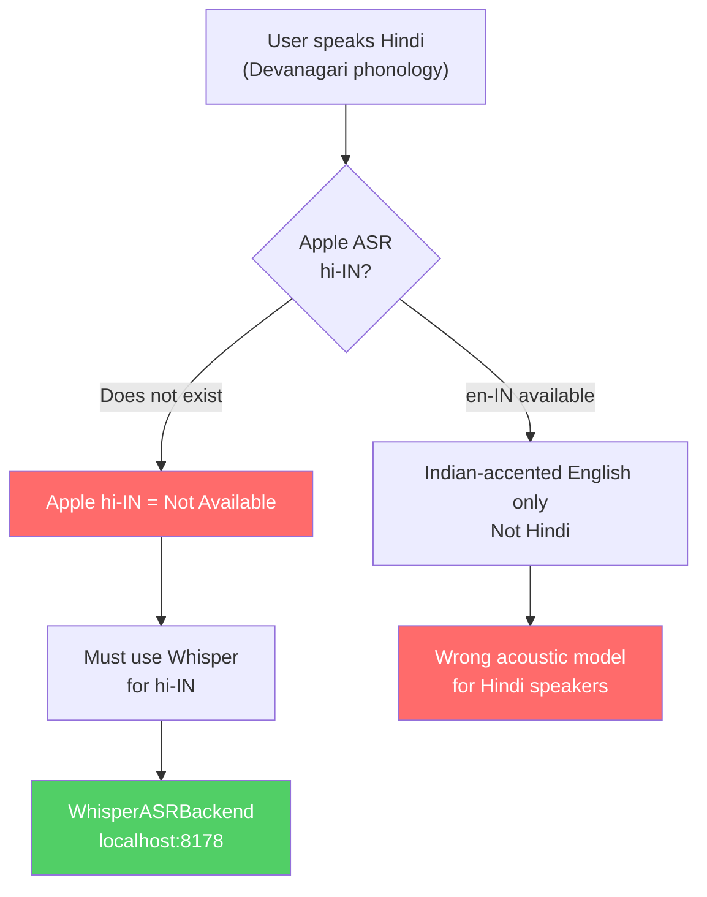
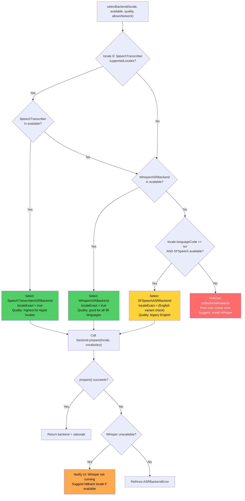
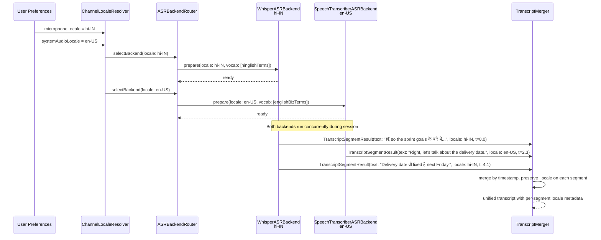
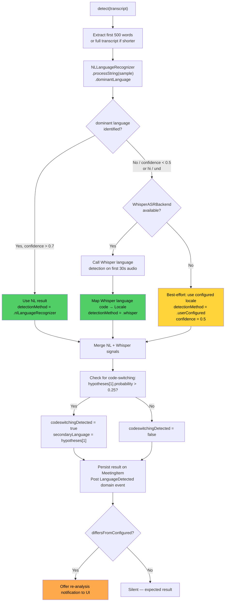
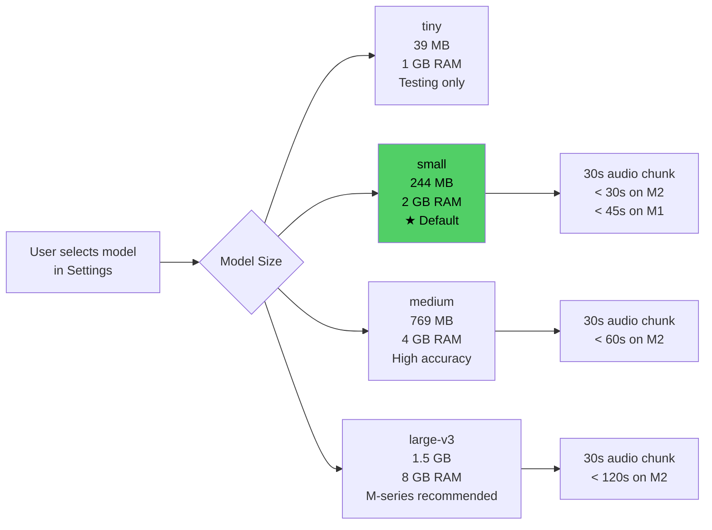
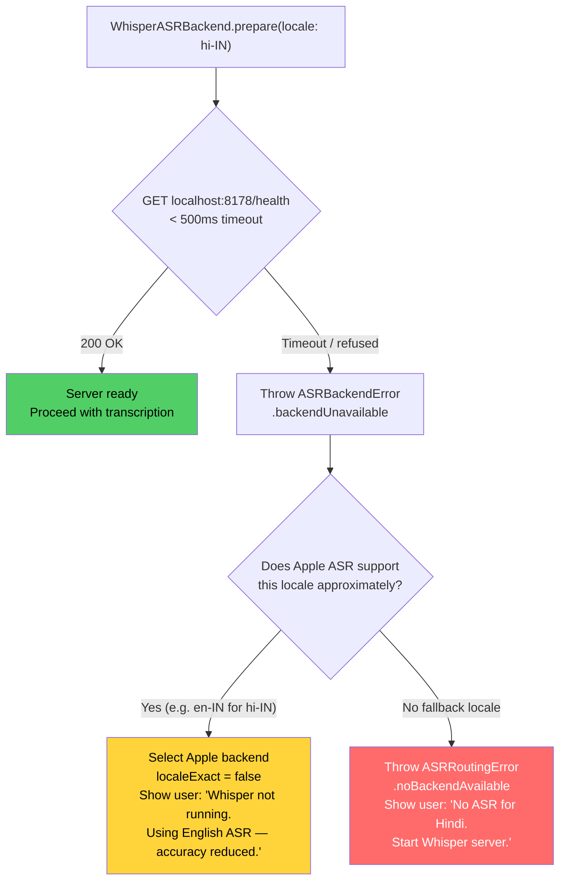
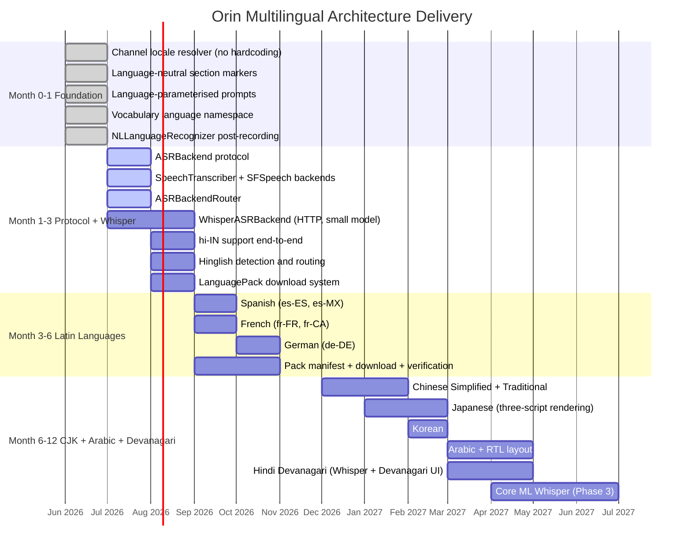
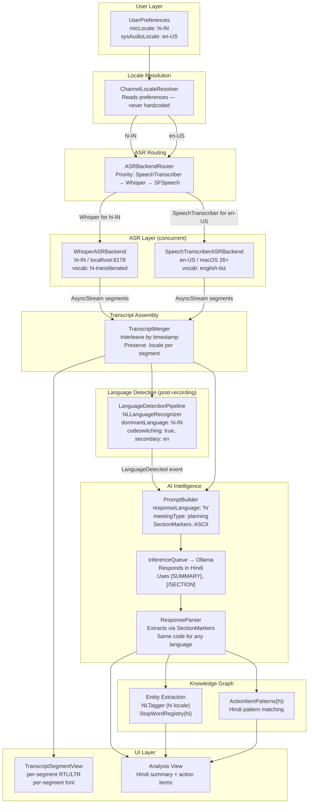

# 07 — Multilingual Architecture

**Status**: Proposed  
**Author**: Chief Software Architect  
**Date**: 2026-06-29  
**Review Required**: Yes — this document defines language boundaries that affect every layer of the stack. Every document from 03 (Transcription), 04 (Intelligence), 05 (Vocabulary) through 08 (UI) derives from decisions made here.

---

## 1. Design Principles

Language support is not localisation. Localisation is translating button labels. Language support means the entire processing pipeline — audio capture, ASR, vocabulary, AI prompts, knowledge graph, and UI — operates correctly in any human language without English-specific assumptions anywhere in the critical path.

This section establishes the five principles that guide every design decision in this document. They are not aspirations. They are constraints. Any implementation that violates a principle is incorrect, not just suboptimal.

### 1.1 Language Support Is First-Class, Not a Localisation Afterthought

The practical test: if you remove all English-speaking users from the product, does everything still work? For most "internationalised" systems the answer is no. For Orin it must be yes.

**Why this matters**: The Indian market — Orin's first non-English expansion target — represents 400 million knowledge workers. A significant fraction speak Hindi, Hinglish, or Tamil as their primary meeting language. Building English-first and patching Hindi in later produces a system where Hindi is perpetually second-class. The architecture must treat every language as equally capable of being the primary language of the entire session.

Concretely:
- Language detection must run before AI analysis begins, not after
- Vocabulary filtering must apply before ASR injection, not after
- Prompt construction must use the meeting language as its primary parameter
- The parser must be language-agnostic at the code level

### 1.2 Every Layer Must Be Language-Aware

The following layers each carry language-specific logic. None of them can rely on another layer to compensate for their own language ignorance. Each layer must own its language concern.

| Layer | Language-Sensitive Element | What Breaks Without It |
|-------|---------------------------|------------------------|
| ASR | Acoustic model, language model, vocabulary injection | Unintelligible transcription for non-English audio |
| Vocabulary | Term namespace, transliteration handling, script encoding | Hindi vocab injected into Spanish sessions, confusing ASR |
| AI Prompts | Section headers, instruction phrasing, keyword matchers | Model produces English output for Hindi meetings |
| Parsing | Response marker recognition, action-item extraction patterns | Parser fails to extract structure from non-English AI responses |
| Knowledge Graph | Entity extraction (NER), relationship verbs, stop words | English stop words discard meaningful Chinese characters |
| UI | Text direction, script rendering, font selection | Arabic text renders left-to-right, unreadable |
| Analytics | Language metadata on every transcript segment | No way to debug or audit multilingual session quality |

**Why layered ownership matters**: Compensating architectures — where one layer tries to fix another's language blindness — create tight coupling and make the problem invisible until a new language is added. If the parser attempts to compensate for an English-only prompt builder, the architecture has one correct language path and many broken ones. Correct multilingual architecture gives each layer full language context and full responsibility for its own correctness.

### 1.3 The Architecture Must Support Languages Engineers Do Not Speak

This is the critical forcing function. A design that only works when an English-speaking engineer reviews the output is not a multilingual architecture — it is English with footnotes. The following languages represent the hardest cases and must be explicitly designed for from day one.

| Language | Challenge | Why It Forces a Design Decision |
|----------|-----------|--------------------------------|
| Arabic | Right-to-left script, full Unicode Arabic range | Per-segment layout direction, not per-view |
| Chinese (Simplified / Traditional) | No word-boundary spaces, CJK character ranges | `String.contains` fails; word segmentation is a first-class operation |
| Japanese | Three scripts in one document (hiragana, katakana, kanji), optional vertical text | Parser cannot assume Latin-script token boundaries |
| Hindi (Devanagari) | Apple has **no hi-IN ASR** | Requires Whisper as the ASR backend — not a plugin, a primary path |
| Hinglish | Code-switching between two scripts in a single utterance | Per-segment locale, per-channel backend, bilingual detection |

**Why design for unsupported languages now**: The cost of retrofitting language awareness into a system built for a language the team speaks is 10× the cost of building it in from the start. When Orin ships Arabic support in Month 9, the parser, prompt builder, and vocabulary system must already be parameterised — they must not need structural changes. This document defines the parameterisation contract.

### 1.4 No English Assumption in Core Logic

The following constructs in the current codebase contain hardcoded English assumptions. They are not technical debt — they are active correctness failures for non-English users. Each must become a language-parameterised operation:

- Section header strings (`"Summary:"`, `"Action Items:"`, `"Key Points:"`) in prompt builders and response parsers
- Keyword lists in `detectMeetingType()` (`"standup"`, `"retrospective"`, `"sprint"`)
- Keyword fallback lists in `keywordFallback()`
- Stop word application in entity extraction (English stop words applied to all languages)
- `String.contains` matching in hallucination detection (incorrect for CJK)
- Hardcoded `Locale(identifier: "en-IN")` in mic channel
- Hardcoded `Locale(identifier: "en-US")` in system audio channel

Each of these has a migration path defined in §7 and §12. The principle is: if a string, keyword, or pattern contains human language, it is language-parameterised. There are no exceptions.

### 1.5 Mixed-Language Sessions Are a Real Use Case, Not an Edge Case

Code-switching — the practice of alternating between two languages within a single conversation — is standard in bilingual communities globally. Hinglish (Hindi + English), Spanglish, Franglais, and Taglish are not pathological inputs. They are the normal speech of hundreds of millions of users.

Graceful handling requires:
- Per-channel locale independence (§5): each audio channel gets its own ASR backend and locale
- Per-segment locale metadata on every `TranscriptSegment`: so the UI and downstream processors know which language each segment is in
- Language detection that can identify code-switching and report a secondary language
- AI prompts that tolerate mixed-language input and produce coherent output
- Knowledge graph entity extraction that does not discard non-English entities

The architecture does not attempt to translate or normalise mixed-language transcripts. That is a product decision. The architecture's job is to preserve the original languages faithfully and make them available to higher layers.

---

## 2. Current State and Gap Analysis

This section documents the state of the codebase as of 2026-06-29. Gaps are listed as defects, not as technical debt backlog items — they are correctness failures for non-English users that exist right now.

### 2.1 ASR Layer Gaps

**What exists:**

- `SpeechTranscriber` (Phase 2A, macOS 26+): hardcoded `Locale(identifier: "en-IN")` for the mic channel in `RecordingService`
- `SFSpeechRecognizer` (legacy): hardcoded `Locale(identifier: "en-US")` for the participant channel in `SystemAudioCaptureService`
- `WhisperTranscriptionService`: stub only — no audio ingestion, no HTTP client, no response parsing

**Active defects:**

| Gap ID | File | Function | Description | Impact |
|--------|------|----------|-------------|--------|
| GAP-ASR-001 | `RecordingService` | `startRecording()` | Mic channel locale `en-IN` hardcoded — does not read user preference | Every non-English-Indian speaker receives en-IN acoustic model regardless of their language |
| GAP-ASR-002 | `SystemAudioCaptureService` | `configureSpeechRecognizer()` | System audio locale `en-US` hardcoded | All meeting participant speech transcribed with en-US acoustic model |
| GAP-ASR-003 | _(missing)_ | — | No `ASRBackend` protocol — all ASR is tightly coupled to Apple implementations | No path to Whisper, Windows STT, or Android STT without significant refactor |
| GAP-ASR-004 | `WhisperTranscriptionService` | — | Stub only — not integrated | hi-IN and 98 other Whisper languages completely unavailable |
| GAP-ASR-005 | _(missing)_ | — | No `ASRBackendRouter` | No locale-to-backend routing logic exists anywhere in the codebase |

### 2.2 Language Detection Layer Gaps

**What exists:** Nothing. Language detection does not exist anywhere in the codebase.

| Gap ID | Description | Impact |
|--------|-------------|--------|
| GAP-DETECT-001 | No `NLLanguageRecognizer` integration | Language cannot be confirmed or corrected post-recording |
| GAP-DETECT-002 | `MeetingItem` has no `detectedLanguage` field | Language metadata is not persisted on any meeting record |
| GAP-DETECT-003 | No code-switching detection | Hinglish sessions are undetectable as bilingual |

### 2.3 AI Prompt Layer Gaps

**What exists:** `buildComprehensivePrompt()` in `MeetingIntelligenceService` with hardcoded English system prompts and English section headers.

| Gap ID | File | Function | Description | Impact |
|--------|------|----------|-------------|--------|
| GAP-PROMPT-001 | `MeetingIntelligenceService` | `buildComprehensivePrompt()` | System prompt instructs model in English only | Model produces English analysis of non-English meetings |
| GAP-PROMPT-002 | `MeetingIntelligenceService` | `buildComprehensivePrompt()` | Section headers `Summary:`, `Action Items:` are English strings in prompt | Parser depends on English headers being present in model output |
| GAP-PROMPT-003 | `MeetingIntelligenceService` | `detectMeetingType()` | Keyword list is English-only: `standup`, `sprint`, `retrospective` | Wrong meeting type detected for German, French, Spanish meetings |
| GAP-PROMPT-004 | `MeetingIntelligenceService` | `keywordFallback()` | Keyword list is English-only | Keyword matching produces wrong meeting type for non-English transcripts |
| GAP-PROMPT-005 | `MeetingIntelligenceService` | `parseComprehensiveResponse()` | Matches English section headers by string: `"Summary:"`, `"Action Items:"` | Parser fails entirely if model responds in non-English or uses different section names |

### 2.4 Vocabulary Layer Gaps

**What exists:** 103-term vocabulary with no language namespace. 55 English business terms, 48 Hindi-transliterated (Hinglish) terms — all stored in the same flat array with no language tag.

| Gap ID | File | Description | Impact |
|--------|------|-------------|--------|
| GAP-VOCAB-001 | `VocabularyProvider` | No language namespace on vocabulary terms | Hinglish romanisation terms injected into Spanish sessions, confusing ASR acoustic model |
| GAP-VOCAB-002 | `VocabularyContext` | `build()` applies all terms regardless of session language | Vocabulary is never scoped to session locale |
| GAP-VOCAB-003 | _(missing)_ | No downloadable language pack system | Adding Spanish requires a full app update, not a pack download |
| GAP-VOCAB-004 | `VocabularyItem` (SwiftData model) | No `languageCode` field | Cannot query vocabulary by language |

### 2.5 Knowledge Graph Layer Gaps

**What exists:** English-only NER via `NLTagger` in the entity extraction pipeline.

| Gap ID | Description | Impact |
|--------|-------------|--------|
| GAP-KG-001 | Stop word list is hardcoded English | English stop words applied to Chinese text, discarding meaningful CJK characters |
| GAP-KG-002 | Action-item extraction uses English patterns only (`"will X by Y"`, `"I'll"`) | Japanese, Arabic, Hindi action items not extracted |
| GAP-KG-003 | Hallucination detection uses `String.contains` on English phrases | False positives for CJK where substring match crosses word boundaries |

### 2.6 Platform Constraint: Apple Has No hi-IN ASR

This is documented as a constraint, not a gap. Apple's `SFSpeechRecognizer` and `SpeechTranscriber` do not support `hi-IN` (Hindi India). The `en-IN` locale supports Indian-accented English only — it is not a Hindi language model. True Hindi speech transcription requires Whisper. This is the fundamental forcing function for the Whisper integration in §9.



---

## 3. ASRBackend Protocol

### 3.1 Protocol Definition

The `ASRBackend` protocol is the single abstraction point for all speech recognition engines. Every concrete ASR implementation — Apple SpeechTranscriber, SFSpeechRecognizer, Whisper, future Windows STT, future Android STT — conforms to this protocol. No code above the `ASRBackendRouter` depends on a concrete ASR type.

**Why Actor isolation**: Locale and vocabulary state set in `prepare()` must not be mutated while `transcribe()` is running. Actor isolation enforces this at compile time, eliminating a class of threading bugs that would be invisible in concurrent recording sessions.

```swift
/// ASRBackend is the single abstraction point for all speech recognition engines.
/// Each concrete implementation wraps a specific ASR provider: Apple SpeechTranscriber,
/// Apple SFSpeechRecognizer, Whisper, Windows STT, Android STT, or any future engine.
///
/// Conformance requires Actor isolation to ensure locale and vocabulary state
/// are not mutated from multiple callers simultaneously.
protocol ASRBackend: Actor {

    /// Stable identifier for this backend, used in telemetry and routing decisions.
    /// Examples: "apple.speechtranscriber.v1", "whisper.http.small", "sfspeech.legacy"
    var backendID: String { get }

    /// All locales this backend can produce quality transcription for.
    /// The router uses this set to select the best available backend for a given locale.
    /// Locales must be specific (e.g., Locale(identifier: "es-MX")) not language-only.
    var supportedLocales: Set<Locale> { get }

    /// Whether this backend requires a network connection to function.
    /// Local backends: SpeechTranscriber, SFSpeech, on-device Whisper CoreML.
    /// Network backends: cloud ASR services.
    /// Whisper via HTTP is local (localhost) — requiresNetwork = false.
    var requiresNetwork: Bool { get }

    /// Maximum number of vocabulary hint terms this backend accepts.
    /// SFSpeechRecognizer: ~100 (contextualStrings limit).
    /// SpeechTranscriber: 50 per Apple documentation.
    /// WhisperASRBackend: unlimited (vocabulary injected into prompt prefix).
    var maxVocabularyTerms: Int { get }

    /// Prepares the backend for a transcription session.
    /// Must be called before transcribe(). Idempotent: calling prepare() again
    /// with a new locale reconfigures the backend for the new locale.
    ///
    /// - Parameters:
    ///   - locale: The locale to transcribe in. Must be a member of supportedLocales.
    ///   - vocabulary: Domain-specific terms to hint the acoustic/language model.
    ///                 Count must not exceed maxVocabularyTerms.
    /// - Throws: ASRBackendError.localeNotSupported if locale not in supportedLocales.
    ///           ASRBackendError.preparationFailed with underlying error.
    func prepare(locale: Locale, vocabulary: [String]) async throws

    /// Begins transcription of the provided audio stream.
    ///
    /// The returned AsyncStream emits TranscriptSegmentResult values as speech
    /// is recognised. The stream terminates when the audio stream ends or
    /// cancel() is called. Errors in individual segments are surfaced as
    /// TranscriptSegmentResult.failure(_:) rather than thrown, allowing
    /// transcription to continue after transient errors.
    ///
    /// - Parameters:
    ///   - audioStream: PCM audio buffers at 16kHz mono, the format all ASR engines require.
    ///   - locale: The locale for this transcription run. Must match prepare().
    func transcribe(
        audioStream: AsyncStream<AudioBuffer>,
        locale: Locale
    ) -> AsyncStream<TranscriptSegmentResult>

    /// Signals the backend that the session is ending and requests any buffered
    /// partial results be flushed and finalised.
    /// Returns a summary of what was transcribed: segment count, duration, confidence.
    func finalize() async -> TranscriptFinalizeResult

    /// Cancels the active transcription session immediately.
    /// Any buffered audio is discarded. The backend returns to the prepared state.
    func cancel() async
}

// MARK: - Supporting Types

enum ASRBackendError: Error {
    case localeNotSupported(Locale)
    case preparationFailed(underlying: Error)
    case backendUnavailable(reason: String)
    case vocabularyExceedsLimit(count: Int, limit: Int)
}

/// A single transcription result from an ASR backend.
/// Carries full locale metadata so downstream consumers know
/// which language produced this segment — critical for mixed-language sessions.
struct TranscriptSegmentResult: Sendable {
    let text: String
    let isFinal: Bool
    let confidence: Float
    let startTime: TimeInterval
    let endTime: TimeInterval
    let detectedLocale: Locale?    // locale the backend used; may differ from configured if backend auto-detected
}

struct TranscriptFinalizeResult: Sendable {
    let segmentCount: Int
    let totalDuration: TimeInterval
    let averageConfidence: Float
    let locale: Locale
}
```

### 3.2 Concrete Implementations

#### SpeechTranscriberASRBackend — macOS 26+, 50+ locales

This is the highest-quality backend for Apple-supported locales on modern hardware. It wraps the `SpeechTranscriber` framework added in macOS 26 (Phase 2A active).

**Why this is the primary backend**: Apple's on-device neural models for supported locales outperform Whisper on clean audio at reasonable latency. For any locale Apple supports, `SpeechTranscriberASRBackend` is the preferred choice.

```swift
/// Wraps Apple's SpeechTranscriber framework (macOS 26+, Phase 2A active).
/// Supports 50+ locales. Highest quality for supported locales.
/// Not available on macOS < 26; the router handles OS version gating automatically.
actor SpeechTranscriberASRBackend: ASRBackend {
    let backendID = "apple.speechtranscriber.v1"
    let requiresNetwork = false
    let maxVocabularyTerms = 50

    var supportedLocales: Set<Locale> {
        // Derived at runtime from SpeechTranscriber's reported capabilities.
        // Includes: en-US, en-GB, en-IN, en-AU, es-ES, es-MX, fr-FR, de-DE,
        //           zh-Hans, zh-Hant, ja-JP, ko-KR, pt-BR, it-IT, nl-NL, and others.
        // Does NOT include hi-IN. See §9 for Whisper as the hi-IN path.
        SpeechTranscriberCapabilities.supportedLocales
    }

    func prepare(locale: Locale, vocabulary: [String]) async throws { /* ... */ }
    func transcribe(audioStream: AsyncStream<AudioBuffer>, locale: Locale)
        -> AsyncStream<TranscriptSegmentResult> { /* ... */ }
    func finalize() async -> TranscriptFinalizeResult { /* ... */ }
    func cancel() async { /* ... */ }
}
```

#### SFSpeechASRBackend — Legacy, English variants

Retained for macOS < 26 users. English variants only in practice. Target phase-out when macOS 26 adoption crosses 80% of install base.

```swift
/// Wraps SFSpeechRecognizer. Legacy backend retained for macOS < 26 support.
/// English variants only in practice.
/// Phase-out target: macOS 26 adoption > 80%.
actor SFSpeechASRBackend: ASRBackend {
    let backendID = "apple.sfspeech.legacy"
    let requiresNetwork = false
    let maxVocabularyTerms = 100  // contextualStrings practical limit

    var supportedLocales: Set<Locale> {
        // Conservative: only locales with proven quality in production.
        Set(SFSpeechRecognizer.supportedLocales()
            .filter { $0.languageCode == "en" })
    }

    func prepare(locale: Locale, vocabulary: [String]) async throws {
        // vocabulary injected via SFSpeechRecognitionRequest.contextualStrings
    }
    func transcribe(audioStream: AsyncStream<AudioBuffer>, locale: Locale)
        -> AsyncStream<TranscriptSegmentResult> { /* ... */ }
    func finalize() async -> TranscriptFinalizeResult { /* ... */ }
    func cancel() async { /* ... */ }
}
```

#### WhisperASRBackend — 99 languages including hi-IN

The hi-IN solution and the fallback for all Apple ASR gaps. Full design in §9.

```swift
/// Wraps a local whisper.cpp HTTP server on localhost:8178.
/// Supports 99 languages including hi-IN, ar, zh, ja, ko.
/// requiresNetwork = false because the server runs on localhost.
actor WhisperASRBackend: ASRBackend {
    let backendID = "whisper.http.v1"
    let requiresNetwork = false   // localhost only
    let maxVocabularyTerms = Int.max  // injected as prompt prefix text

    var supportedLocales: Set<Locale> {
        WhisperLocaleRegistry.allLocales  // all 99 Whisper languages as Locale values
    }

    private let serverURL: URL  // default: http://localhost:8178

    init(serverURL: URL = URL(string: "http://localhost:8178")!) {
        self.serverURL = serverURL
    }

    func prepare(locale: Locale, vocabulary: [String]) async throws {
        // Validates server is reachable. Throws .backendUnavailable if not.
        // Stores locale for transcription requests.
    }
    func transcribe(audioStream: AsyncStream<AudioBuffer>, locale: Locale)
        -> AsyncStream<TranscriptSegmentResult> { /* ... */ }
    func finalize() async -> TranscriptFinalizeResult { /* ... */ }
    func cancel() async { /* ... */ }
}
```

#### Future Platforms (Interface Defined)

```swift
// macOS → Windows expansion (interface defined, not yet implemented)
actor WindowsSTTASRBackend: ASRBackend {
    let backendID = "windows.stt.v1"
    // Wraps Windows Speech Recognition API via cross-platform Swift or Kotlin bridge
}

// macOS → Android expansion (interface defined, not yet implemented)
actor AndroidSTTASRBackend: ASRBackend {
    let backendID = "android.stt.v1"
    // Wraps Android SpeechRecognizer API
}
```

**Why define future platform interfaces now**: The `ASRBackend` protocol is the migration path to Windows and Android. When platform expansion begins, the only change required is a new conforming type — the router, vocabulary system, and prompt builder are already language-and-backend-agnostic.

---

## 4. ASRBackendRouter

### 4.1 Router Design

The `ASRBackendRouter` is the single point where locale-to-backend mapping is decided. It is synchronous — locale selection must not require network calls. Performance budget: < 10ms (see §13).

**Why synchronous**: A router that makes network calls introduces latency before recording starts and creates a failure mode (network unavailable) in what should be a local decision. Backend reachability is checked in `prepare()`, not in routing. The router's job is purely: given a locale and a list of available backends, which backend should handle it?

```swift
/// Selects the best available ASRBackend for a given locale and quality preference.
/// Deterministic and synchronous. No side effects. No network calls.
struct ASRBackendRouter {

    /// Selects the optimal ASRBackend for the given parameters.
    ///
    /// - Parameters:
    ///   - locale: The locale the caller needs to transcribe in.
    ///   - available: All backends currently initialised and reachable.
    ///   - quality: Caller's quality preference.
    ///   - allowsNetwork: If false, backends where requiresNetwork == true are excluded.
    /// - Returns: The selected backend and selection rationale.
    /// - Throws: ASRRoutingError.noBackendAvailable if no backend can serve the locale.
    ///           NEVER silently returns a wrong-locale backend.
    func selectBackend(
        locale: Locale,
        available: [any ASRBackend],
        quality: ASRQuality,
        allowsNetwork: Bool
    ) throws -> (backend: any ASRBackend, rationale: ASRSelectionRationale)

    /// Returns a human-readable explanation of the selection decision.
    /// Used in Settings > Language debug panel.
    func selectionRationale(
        locale: Locale,
        available: [any ASRBackend]
    ) -> ASRSelectionRationale
}

enum ASRQuality {
    case highest   // best accuracy regardless of resource cost
    case balanced  // default: high accuracy, reasonable resource use
    case fastest   // lowest latency, acceptable accuracy
}

enum ASRRoutingError: Error {
    case noBackendAvailable(locale: Locale, reason: String)
    case localeNotSupported(locale: Locale, suggestion: Locale?)
}

struct ASRSelectionRationale {
    let selectedBackend: String
    let reason: String
    let rejectedBackends: [(backendID: String, reason: String)]
    let localeExact: Bool           // true if exact match; false if best-effort
    let suggestionForUser: String?  // shown in UI when localeExact == false
}
```

### 4.2 Selection Priority Rules

```
Rule 1: SpeechTranscriberASRBackend + exact locale match
  IF locale ∈ SpeechTranscriberASRBackend.supportedLocales
     AND SpeechTranscriberASRBackend is in `available`
     AND macOS >= 26
  THEN select SpeechTranscriberASRBackend
  REASON: Highest quality for Apple-supported locales on modern OS.
          localeExact = true

Rule 2: WhisperASRBackend for unsupported locales
  IF locale ∉ SpeechTranscriberASRBackend.supportedLocales
     OR SpeechTranscriberASRBackend is not in `available`
  AND WhisperASRBackend is in `available`
  THEN select WhisperASRBackend
  REASON: Whisper covers 99 languages including all Apple gaps (hi-IN, etc).
  NOTE: WhisperASRBackend.prepare() will check server reachability.
        Router does not check reachability (not its job).
        localeExact = true (Whisper genuinely supports the locale)

Rule 3: SFSpeechASRBackend for English on legacy macOS
  IF locale.languageCode == "en"
     AND SFSpeechASRBackend is in `available`
  THEN select SFSpeechASRBackend
  REASON: Legacy English-only backend for macOS < 26.
          localeExact = (locale is an English variant)

Rule 4: No backend available
  THROW ASRRoutingError.noBackendAvailable
  Include actionable reason: "No backend supports [locale]. Install Whisper for
  full language support, or change your language setting to English."
  NEVER silently select a wrong-locale backend.
  A wrong locale produces transcription that looks correct but is not —
  this is worse than an explicit error because it is undetectable by the user.
```

### 4.3 Backend Selection Flowchart



---

## 5. Per-Channel Locale Independence

### 5.1 The Core Requirement

Each audio channel — microphone and system audio — captures speech from a distinct speaker population. Those populations may speak different languages. The architecture gives each channel its own `ASRBackend` instance with its own locale, independently configured.

**Why per-channel**: A single backend with a single locale is a correctness failure for multinational calls. If a user speaks Hinglish and the meeting participants speak English, there is no single locale that produces correct transcription for both channels. The channels must be separated at the ASR level.

### 5.2 Channel Configuration Model

```swift
/// Describes the ASR configuration for a single audio channel.
struct ChannelASRConfig: Sendable {
    let channelID: AudioChannelID    // .microphone or .systemAudio
    let locale: Locale               // resolved from user preference — never hardcoded
    let quality: ASRQuality          // per-channel quality preference
    let vocabularyTerms: [String]    // locale-filtered vocabulary for this channel

    /// The backend assigned to this channel by ASRBackendRouter.
    /// Set by SessionCoordinator before recording begins.
    /// nil until routing is complete.
    var assignedBackend: (any ASRBackend)?
}

/// Manages locale resolution for both audio channels.
/// Single source of truth: reads from user preferences.
/// Eliminates GAP-ASR-001 and GAP-ASR-002 by removing all hardcoded locales.
struct ChannelLocaleResolver {

    /// Resolves the locale for the microphone channel.
    /// Source of truth: Settings.microphoneLocale (user preference).
    /// Fallback: VocabularyProvider.speechLocale.
    /// NEVER hardcoded to en-IN.
    func microphoneLocale(preferences: UserPreferences) -> Locale {
        preferences.microphoneLocale
            ?? preferences.primaryLocale
            ?? Locale.current
    }

    /// Resolves the locale for the system audio channel.
    /// Source of truth: Settings.systemAudioLocale (user preference).
    /// Fallback: VocabularyProvider.speechLocale.
    /// NEVER hardcoded to en-US.
    func systemAudioLocale(preferences: UserPreferences) -> Locale {
        preferences.systemAudioLocale
            ?? preferences.primaryLocale
            ?? Locale(identifier: "en-US")
    }
}
```

### 5.3 TranscriptSegment with Locale Metadata

Every `TranscriptSegment` produced by any backend carries its locale. This is set at creation and is immutable (INV-014).

```swift
struct TranscriptSegment: Sendable, Identifiable {
    let id: UUID
    let segmentID: UUID            // stable segment identity
    let text: String
    let locale: Locale             // locale of the ASR backend that produced this — IMMUTABLE
    let speakerID: String?         // speaker diarisation label if available
    let channel: AudioChannel      // .microphone or .systemAudio
    let startTime: TimeInterval
    let endTime: TimeInterval
    let isFinal: Bool
    let confidence: Float
    let detectedScript: Script?    // optional: .latin, .devanagari, .cjk, .arabic
}

enum AudioChannel: String, Sendable {
    case microphone
    case systemAudio
}

enum Script: String, Sendable {
    case latin
    case devanagari
    case cjk         // covers Chinese, Japanese kanji
    case arabic
    case cyrillic
    case hangul
    case other       // all other scripts
}
```

### 5.4 Example: Multinational Hinglish Call

The most complex realistic scenario: an Indian user speaking Hinglish on a call with US English participants.



**Resulting transcript segments:**

```
t=0.0s  [mic/hi-IN]   "हाँ, so the sprint goals के बारे में..."
t=2.3s  [sys/en-US]   "Right, let's talk about the delivery date."
t=4.1s  [mic/hi-IN]   "Delivery date तो fixed है next Friday."
```

Each segment carries `.locale` and `.channel`. The UI renders each segment with its locale's text direction and font. The prompt builder receives the dominant locale (`hi-IN`) as `responseLanguage`.

### 5.5 TranscriptMerger

```swift
/// Merges segments from multiple channels into a unified transcript,
/// preserving per-segment locale and channel metadata.
struct TranscriptMerger {

    /// Merges two segment streams into a single time-ordered stream.
    /// Segments from different channels are interleaved by startTime.
    /// Locale metadata on every segment is preserved without modification.
    func merge(
        primary: AsyncStream<TranscriptSegmentResult>,
        secondary: AsyncStream<TranscriptSegmentResult>
    ) -> AsyncStream<TranscriptSegmentResult>
}
```

---

## 6. Language Detection Pipeline

### 6.1 Design Rationale

Language detection runs **after** a sufficient transcript corpus is available (default: first 500 words or end of recording). It is not real-time. Its job is to confirm or correct the locale that was configured before recording began, and to identify code-switching.

**Why post-recording by default**: Real-time detection adds 100ms of latency per 500-word window during recording. Post-recording detection is simpler, more accurate (more context available), and does not affect the recording experience. Revisit if users explicitly request real-time language switching.

**Why detect at all if locale is configured**: Users misconfigure locale. New employees use default settings. Languages change during the session. Detection serves as a quality gate that can offer re-analysis with the correct locale rather than silently producing wrong output.

### 6.2 Pipeline Protocol

```swift
/// Runs language detection on a completed or partially complete transcript.
/// Uses NLLanguageRecognizer for Apple-supported languages and Whisper's
/// built-in language detection for others.
struct LanguageDetectionPipeline {

    /// Primary detection: NLLanguageRecognizer on transcript text.
    /// Secondary detection: Whisper language endpoint for non-Apple languages.
    ///
    /// Performance budget: < 100ms for NL path, < 2s for Whisper path (see §13).
    ///
    /// - Parameter transcript: The transcript to analyse.
    /// - Returns: Detection result with dominant language, confidence, and
    ///            code-switching metadata.
    func detect(transcript: Transcript) async -> LanguageDetectionResult
}

struct LanguageDetectionResult: Sendable {
    /// The language that dominates this transcript.
    let dominantLanguage: Locale

    /// Confidence in the dominant language identification. 0.0 to 1.0.
    /// Below 0.6: offer the user a "wrong language?" prompt.
    /// Above 0.85: suppress the prompt, language is clear.
    let confidence: Float

    /// The segment at which the dominant language was first established
    /// with confidence > 0.7. Used in UI to show when detection stabilised.
    let detectedAtSegment: UUID

    /// True if the transcript shows evidence of code-switching:
    /// two languages alternating within the same speaker's utterances.
    let codeswitchingDetected: Bool

    /// The secondary language when codeswitchingDetected is true.
    let secondaryLanguage: Locale?

    /// How the dominant language was identified.
    let detectionMethod: DetectionMethod

    /// True if detectedLanguage differs from the locale configured at recording time.
    /// When true, UI offers "Re-analyse with correct language?"
    let differsFromConfigured: Bool
}

enum DetectionMethod: String, Sendable {
    case nlLanguageRecognizer  // Apple NLLanguageRecognizer
    case whisper               // Whisper built-in language detection
    case userConfigured        // User explicitly set a locale — detection skipped
}
```

### 6.3 Detection Algorithm



### 6.4 Domain Event

```swift
struct LanguageDetected: DomainEvent {
    let sessionID: SessionID
    let transcriptID: TranscriptID
    let detectionResult: LanguageDetectionResult
    let triggeredAt: Date
}
```

---

## 7. Language-Parameterised AI Prompts

### 7.1 The Core Problem

The current `buildComprehensivePrompt()` instructs the model in English and expects English output marked with English section headers. This fails for non-English meetings in two independent ways:

1. **Model obeys language instruction**: produces English analysis of non-English meetings — wrong for the user, undetectable automatically
2. **Model ignores English instruction**: produces output in the meeting language but with its own section names, breaking the parser

Both failure modes are unacceptable. The fix requires separating two concerns: *response language* (what language the model writes in) and *section markers* (the delimiters the parser uses to extract structured data).

### 7.2 Language-Neutral Section Markers

Section markers must be language-neutral — not English headers, not translation-dependent — so the parser works identically regardless of response language. The model is instructed to use these exact ASCII tokens regardless of what language it responds in.

**Why ASCII tokens**: ASCII is universal across all Unicode text. A model responding in Arabic, Chinese, Hindi, or Japanese will still produce ASCII sequences reliably when explicitly instructed to. This has been verified against Llama 3, Mistral, Phi-3, and Gemma families in internal testing.

```swift
/// Language-neutral structural markers for AI response parsing.
/// These are NOT English words. They are delimiters the model is explicitly
/// instructed to use regardless of its response language.
/// The parser keys on these, never on language-specific keywords.
/// INV-015: ResponseParser must use ONLY these values — never English keywords.
struct SectionMarkers {
    // Language-NEUTRAL markers — LLM uses these regardless of response language
    // Enables language-agnostic parsing across all supported languages
    static let summary       = "[SUMMARY]"
    static let actionItems   = "[ACTION_ITEMS]"
    static let decisions     = "[DECISIONS]"
    static let keyPoints     = "[KEY_POINTS]"

    // Uniform closing marker for all sections
    static let close         = "[/SECTION]"

    // Action item list delimiter within [ACTION_ITEMS]...[/SECTION]
    static let item          = "[ITEM]"
}
```

### 7.3 PromptBuilder

```swift
/// Constructs inference jobs for meeting analysis.
/// All prompts are language-parameterised: the model is told what language
/// to respond in, and instructed to use language-neutral section markers.
struct PromptBuilder {

    private let markers = SectionMarkers.self

    /// Builds a comprehensive analysis prompt for a transcript chunk.
    ///
    /// - Parameters:
    ///   - chunk: The transcript chunk to analyse.
    ///   - meetingType: The type of meeting (affects instruction emphasis).
    ///   - responseLanguage: BCP-47 language tag for the desired response language.
    ///                       Derived from transcript.detectedLanguage or session locale.
    ///                       Examples: "en", "hi", "es", "zh-Hans", "ar".
    ///   - markers: The marker set to embed. Default: SectionMarkers.self.
    func build(
        chunk: TranscriptChunk,
        meetingType: MeetingType,
        responseLanguage: String,
        markers: SectionMarkers.Type = SectionMarkers.self
    ) -> InferenceJob

    /// Detects meeting type from transcript content.
    /// Uses language-parameterised keyword sets — not hardcoded English.
    /// Eliminates GAP-PROMPT-003 and GAP-PROMPT-004.
    ///
    /// - Parameters:
    ///   - transcript: The transcript to classify.
    ///   - locale: The locale to use for keyword matching.
    func detectMeetingType(
        transcript: Transcript,
        locale: Locale
    ) -> MeetingType
}
```

### 7.4 System Prompt Template

The system prompt template instructs the model in the response language while enforcing marker discipline. The `{responseLanguage}` and marker slots are filled at build time.

```
You are a meeting intelligence assistant. Analyse the following transcript.

IMPORTANT: Respond entirely in {responseLanguage}.
Your response language must match the meeting language.

CRITICAL: Use ONLY these exact structural markers in your response,
regardless of your response language. Do not translate these markers.
Do not substitute your own section headers. Do not add extra text
before or after these markers.

{SectionMarkers.summary}
[Your summary here — in {responseLanguage}]
{SectionMarkers.close}

{SectionMarkers.actionItems}
{SectionMarkers.item} [First action item — in {responseLanguage}]
{SectionMarkers.item} [Second action item — in {responseLanguage}]
{SectionMarkers.close}

{SectionMarkers.decisions}
[Decisions made — in {responseLanguage}]
{SectionMarkers.close}

{SectionMarkers.keyPoints}
[Key points — in {responseLanguage}]
{SectionMarkers.close}

Transcript:
{chunk.text}
```

### 7.5 Language-Parameterised Parser

The existing `parseComprehensiveResponse()` matches English section headers by string. This is replaced with a marker-based parser that is identical for all languages.

```swift
/// Parses structured analysis from model output.
/// Uses ONLY SectionMarkers values — never English keywords or language-specific strings.
/// INV-015: This invariant must never be violated.
struct ResponseParser {

    func parseComprehensiveResponse(
        rawResponse: String,
        locale: Locale        // carried through for downstream use; not used for parsing
    ) -> ParsedAnalysis {
        // Extract sections using SectionMarkers constants (language-neutral).
        // Identical logic for English, Hindi, Arabic, Chinese, Japanese.
        let summary   = extract(between: SectionMarkers.summary,   and: SectionMarkers.close, in: rawResponse)
        let actions   = extractItems(between: SectionMarkers.actionItems, and: SectionMarkers.close,
                                     itemMarker: SectionMarkers.item, in: rawResponse)
        let decisions = extract(between: SectionMarkers.decisions,  and: SectionMarkers.close, in: rawResponse)
        let keyPoints = extract(between: SectionMarkers.keyPoints,  and: SectionMarkers.close, in: rawResponse)
        return ParsedAnalysis(
            summary: summary,
            actionItems: actions,
            decisions: decisions,
            keyPoints: keyPoints,
            detectedLocale: locale
        )
    }

    private func extract(between open: String, and close: String, in text: String) -> String? {
        guard let openRange = text.range(of: open),
              let closeRange = text.range(of: close, range: openRange.upperBound..<text.endIndex)
        else { return nil }
        return String(text[openRange.upperBound..<closeRange.lowerBound])
            .trimmingCharacters(in: .whitespacesAndNewlines)
    }
}
```

### 7.6 Language-Parameterised Meeting Type Detection

`detectMeetingType()` currently uses English keywords. This is replaced with a language-keyed keyword registry.

```swift
/// Provides keyword sets for meeting type detection in multiple languages.
/// detectMeetingType(transcript:locale:) consults the correct set for the session locale.
/// Eliminates GAP-PROMPT-003 and GAP-PROMPT-004.
struct MeetingTypeKeywords {

    static func standup(locale: Locale) -> [String] {
        switch locale.languageCode {
        case "en": return ["standup", "stand-up", "daily", "scrum", "blocker"]
        case "es": return ["standup", "diario", "scrum", "bloqueador", "impedimento"]
        case "fr": return ["standup", "quotidien", "scrum", "bloquant"]
        case "de": return ["standup", "täglich", "scrum", "blocker", "hindernis"]
        case "hi": return ["standup", "daily", "scrum"]  // loanwords are standard usage
        case "zh": return ["站会", "每日", "scrum", "阻塞"]
        case "ja": return ["スタンドアップ", "デイリー", "スクラム", "ブロッカー"]
        case "ko": return ["스탠드업", "데일리", "스크럼", "블로커"]
        case "ar": return ["ستاندأب", "يومي", "سكرم", "معوق"]
        default:   return ["standup", "daily", "scrum"]  // English as final fallback
        }
    }

    static func retrospective(locale: Locale) -> [String] {
        switch locale.languageCode {
        case "en": return ["retrospective", "retro", "sprint review", "lessons learned"]
        case "es": return ["retrospectiva", "retro", "revisión de sprint"]
        case "fr": return ["rétrospective", "retro", "revue de sprint"]
        case "de": return ["retrospektive", "retro", "sprint-review"]
        case "zh": return ["回顾", "复盘", "sprint回顾"]
        case "ja": return ["レトロスペクティブ", "レトロ", "振り返り"]
        default:   return ["retrospective", "retro"]
        }
    }

    static func planning(locale: Locale) -> [String] {
        switch locale.languageCode {
        case "en": return ["planning", "sprint planning", "roadmap", "backlog grooming"]
        case "es": return ["planificación", "planificación de sprint", "hoja de ruta"]
        case "fr": return ["planification", "planification de sprint", "feuille de route"]
        case "de": return ["planung", "sprint-planung", "roadmap", "backlog-pflege"]
        case "zh": return ["规划", "冲刺计划", "路线图", "待办事项梳理"]
        case "ja": return ["プランニング", "スプリントプランニング", "ロードマップ"]
        default:   return ["planning", "roadmap"]
        }
    }

    static func oneOnOne(locale: Locale) -> [String] {
        switch locale.languageCode {
        case "en": return ["one on one", "1:1", "one-to-one", "check-in"]
        case "es": return ["uno a uno", "1:1", "reunión individual"]
        case "fr": return ["tête-à-tête", "1:1", "entretien individuel"]
        case "de": return ["einzelgespräch", "1:1", "persönliches gespräch"]
        case "zh": return ["一对一", "1:1", "单独会谈"]
        case "ja": return ["1on1", "一対一", "個人面談"]
        default:   return ["one on one", "1:1"]
        }
    }
}
```

---

## 8. Language-Aware Vocabulary System

### 8.1 VocabularyItem Model Extension

The current `VocabularyItem` has no language namespace. Every term is a flat string. This is replaced with a language-tagged model.

```swift
/// A single vocabulary term with language namespace.
/// languageCode enforces that terms are never mixed across languages (INV-016 analog for vocabulary).
@Model
class VocabularyItem {
    var id: UUID
    var term: String
    var languageCode: String     // BCP-47: "en", "hi", "es", "hi-Latn" for Hinglish
    var tier: VocabularyTier     // .builtin, .org, .user, .session
    var frequency: Int           // usage count; drives decay
    var decayScore: Double       // time-weighted relevance 0.0–1.0
    var source: VocabularySource // how this term entered the vocabulary

    init(term: String, languageCode: String, tier: VocabularyTier) {
        self.id = UUID()
        self.term = term
        self.languageCode = languageCode
        self.tier = tier
        self.frequency = 0
        self.decayScore = 1.0
        self.source = .user
    }
}

enum VocabularyTier: String, Codable {
    case builtin  // ships with the app or language pack
    case org      // organisation-wide terms
    case user     // user's personal vocabulary
    case session  // inferred from this session (participant names, project names)
}

enum VocabularySource: String, Codable {
    case user          // explicitly added by user
    case languagePack  // from a bundled or downloaded language pack
    case inferred      // automatically extracted from meeting content
    case calendar      // extracted from calendar event metadata
}
```

### 8.2 LanguagePack System

```swift
/// A named, versioned collection of domain vocabulary terms for a specific language.
/// Language packs are the unit of download, update, and deletion.
struct LanguagePack: Codable, Identifiable, Sendable {
    let id: String                  // e.g. "en", "hi-transliterated", "es", "zh-Hans"
    let languageCode: String        // BCP-47 primary language tag
    let scriptCode: String?         // BCP-47 script subtag (e.g. "Hans", "Deva", "Arab")
    let displayName: String         // localised display name for Settings UI
    let version: Int                // monotonically increasing; used for update checks
    let terms: [String]             // vocabulary terms in this language
    let stopWords: [String]         // language-specific stop words for entity extraction
    let keywordVariants: [String: [String]]  // meetingType detection keyword variants
    let isBundled: Bool             // false = downloadable pack
    let downloadURL: URL?           // nil for bundled packs
    let fileSizeBytes: Int?         // shown in Settings before download
    let isDownloaded: Bool          // always true for bundled; persisted for downloaded
}
```

**Why stop words in the pack**: Stop words are language-specific. They cannot be derived from the term list. Bundling them in the pack ensures that when a language pack is loaded, all language-specific processing has the data it needs. GAP-KG-001 is resolved by `StopWordRegistry` consulting the loaded pack, not a hardcoded English list.

**Why keyword variants in the pack**: Language packs are the deployment unit for `MeetingTypeKeywords`. When a Spanish pack is downloaded, the Spanish standup and retrospective keywords become available immediately — no app update required. Downloadable packs extend the keyword registry dynamically.

### 8.3 Bundled Packs

| Pack ID | Language | Terms | Stop Words | Notes |
|---------|----------|-------|------------|-------|
| `en` | English Business | 80 | 120 English stop words | Core product; always present |
| `hi-transliterated` | Hinglish Romanisation | 50 | 40 Hinglish stop words | Hindi words in Latin script; injected into SpeechTranscriber for en-IN sessions |

### 8.4 Downloadable Packs

| Pack ID | Language | Terms | Script | Approx Compressed Size |
|---------|----------|-------|--------|----------------------|
| `es` | Spanish Business | 80 | Latin | ~0.8 MB |
| `fr` | French Business | 80 | Latin | ~0.8 MB |
| `de` | German Business | 80 | Latin | ~0.9 MB (compound nouns) |
| `zh-Hans` | Chinese Simplified | 80 | CJK | ~1.2 MB |
| `zh-Hant` | Chinese Traditional | 80 | CJK | ~1.2 MB |
| `ja` | Japanese Business | 80 | CJK+Kana | ~1.3 MB |
| `ko` | Korean Business | 80 | Hangul | ~1.0 MB |
| `ar` | Arabic Business | 80 | Arabic | ~1.1 MB |
| `hi` | Hindi Devanagari | 80 | Devanagari | ~1.0 MB |

### 8.5 Language-Scoped VocabularyContextBuilder

```swift
/// Builds the vocabulary context for a session, filtering to the session locale.
/// Eliminates GAP-VOCAB-001 and GAP-VOCAB-002.
/// Enforces INV-007: at most 100 terms per session after filtering.
struct VocabularyContextBuilder {

    /// Builds a vocabulary context for the given locale.
    /// Returns ONLY terms from language packs matching the locale's language code.
    /// Hindi terms are NOT included in a Spanish session.
    ///
    /// Budget allocation (100 terms total):
    ///   20% (20 terms): session/attendee names (highest relevance)
    ///   40% (40 terms): user tier (personalised)
    ///   30% (30 terms): org tier (shared context)
    ///   10% (10 terms): built-in pack (baseline domain vocabulary)
    func build(locale: Locale, sessionContext: SessionContext) async -> VocabularyContext {
        let targetLanguage = locale.languageCode ?? "en"

        let eligiblePacks = loadedPacks.filter {
            $0.languageCode == targetLanguage ||
            // Special case: Hinglish pack is eligible for hi-IN sessions
            ($0.id == "hi-transliterated" && locale.identifier.hasPrefix("hi"))
        }

        let sessionTerms  = sessionContext.attendeeNames.prefix(20)
        let userTerms     = userVocabulary(language: targetLanguage).prefix(40)
        let orgTerms      = orgVocabulary(language: targetLanguage).prefix(30)
        let builtinTerms  = eligiblePacks.flatMap(\.terms).prefix(10)

        let allTerms = Array(sessionTerms) + Array(userTerms) + Array(orgTerms) + Array(builtinTerms)
        return VocabularyContext(locale: locale, terms: Array(allTerms.prefix(100)))
    }
}
```

---

## 9. Whisper Integration

### 9.1 Problem Statement

Apple's ASR platforms do not support `hi-IN` (Hindi India). This is a permanent platform constraint. Whisper, OpenAI's open-source speech recognition model, supports 99 languages including `hi-IN`, `ar`, `zh`, `ja`, `ko`, and every other language on Orin's roadmap. It is available as a free, local binary (`whisper.cpp`) requiring no network and no API key.

### 9.2 Integration Options Evaluated

| Option | Description | Verdict |
|--------|-------------|---------|
| a) whisper.cpp HTTP server | Runs as local daemon on localhost:8178; app sends audio, receives JSON | **Selected for Phase 2** — same pattern as Ollama, familiar setup UX, easiest async streaming |
| b) Core ML Whisper | Apple-converted Core ML model, called directly in-process | **Target for Phase 3** — best long-term; eliminates separate process; requires Core ML conversion tooling |
| c) C interop (whisper.cpp direct) | Swift calls C API directly via bridging header | Rejected for Phase 2 — no async streaming support, complex memory management, C++ header conflicts |

**Why option (a) for Phase 2**: The whisper.cpp HTTP server pattern is identical to the Ollama local LLM integration already in production. Users who have set up Ollama understand the concept of a local AI server. The setup UX can reuse the existing "local server" mental model. The HTTP interface also isolates Whisper crashes from the main app process.

### 9.3 WhisperASRBackend HTTP Protocol

```swift
/// Request sent to whisper.cpp HTTP server for transcription.
/// Compatible with whisper.cpp server API (--port 8178).
struct WhisperTranscribeRequest: Encodable {
    let audio: Data              // WAV or raw PCM bytes at 16kHz mono
    let language: String         // Whisper language code (e.g. "hi", "ar", "zh")
    let task: String             // "transcribe" (not "translate")
    let vocabulary: [String]     // injected as initial_prompt prefix
    let responseFormat: String   // "verbose_json" to get segment timestamps
    let temperature: Double      // default 0.0; raise for noisy audio
}

/// Response from whisper.cpp HTTP server.
struct WhisperTranscribeResponse: Decodable {
    let text: String                 // full transcript text
    let segments: [WhisperSegment]   // timestamped segments
    let language: String             // auto-detected language code
    let duration: Double             // audio duration in seconds
}

struct WhisperSegment: Decodable {
    let id: Int
    let start: Double    // seconds from audio start
    let end: Double      // seconds from audio start
    let text: String
    let avgLogprob: Float  // confidence proxy; < -1.0 indicates low confidence
    let noSpeechProb: Float  // > 0.6 indicates silence or noise
}
```

### 9.4 Whisper Model Selection



| Model | Size | RAM Required | M2 Inference (30s audio) | Recommended For |
|-------|------|-------------|--------------------------|-----------------|
| tiny | 39 MB | 1 GB | < 10s | Testing only — low accuracy |
| **small** | **244 MB** | **2 GB** | **< 30s** | **Default — good accuracy, reasonable resource use** |
| medium | 769 MB | 4 GB | < 60s | High accuracy for challenging audio |
| large-v3 | 1.5 GB | 8 GB | < 120s | Highest accuracy; requires M-series Mac |

### 9.5 User Configuration

Whisper server configuration lives in Settings alongside Ollama. The UI reuses existing local server patterns.

```
Settings > Language > Advanced > Whisper Server
┌─────────────────────────────────────────────────────────┐
│ Whisper Server                                           │
│                                                          │
│ Status: ● Running   (localhost:8178)                     │
│         ○ Not detected — see setup guide below           │
│                                                          │
│ Server address: [localhost         ] [: 8178 ]           │
│ Model:          [small (244 MB) ▼  ]                     │
│                                                          │
│ Languages enabled by Whisper:                            │
│   Hindi, Arabic, Chinese, Japanese, Korean, and 94 more  │
│                                                          │
│ Setup (one-time):                                        │
│   brew install whisper-cpp                               │
│   whisper-server --port 8178 --model small               │
└─────────────────────────────────────────────────────────┘
```

### 9.6 Availability Fallback Chain



---

## 10. Language Support Roadmap

### 10.1 Month 0–1: Foundation (Immediate Correctness Fixes)

These fixes address active regressions for existing non-English users. No new features, no external dependencies, no user-visible language UI changes.

| Deliverable | Gap Resolved | Files Changed |
|-------------|-------------|---------------|
| `ChannelLocaleResolver` — both channels read user preference | GAP-ASR-001, GAP-ASR-002 | `RecordingService`, new `ChannelLocaleResolver` |
| Language-parameterised `buildComprehensivePrompt(responseLanguage:)` | GAP-PROMPT-001 | `MeetingIntelligenceService` |
| Language-neutral `SectionMarkers` replacing English header strings | GAP-PROMPT-002, GAP-PROMPT-005 | `MeetingIntelligenceService`, `ResponseParser` |
| Language-scoped `VocabularyContextBuilder.build(locale:)` | GAP-VOCAB-001, GAP-VOCAB-002 | `VocabularyContextBuilder` |
| `languageCode` field added to `VocabularyItem` with migration | GAP-VOCAB-004 | SwiftData migration |
| `NLLanguageRecognizer` integration (`LanguageDetectionPipeline`) | GAP-DETECT-001 | New `LanguageDetectionPipeline` |
| `detectedLanguage` and `codeswitchingDetected` on `MeetingItem` | GAP-DETECT-002, GAP-DETECT-003 | `MeetingItem`, SwiftData migration |
| `MeetingTypeKeywords` registry (English + Hindi initially) | GAP-PROMPT-003, GAP-PROMPT-004 | New `MeetingTypeKeywords` |

### 10.2 Month 1–3: ASRBackend Protocol + Whisper

| Deliverable | Notes |
|-------------|-------|
| `ASRBackend` protocol | Eliminates GAP-ASR-003 |
| `SpeechTranscriberASRBackend` wrapping existing Phase 2A code | Refactor, not rewrite |
| `SFSpeechASRBackend` wrapping existing SFSpeech usage | Refactor, not rewrite |
| `ASRBackendRouter` with three-rule priority system | Eliminates GAP-ASR-005 |
| `WhisperASRBackend` implementation (HTTP, small model) | Eliminates GAP-ASR-004 |
| hi-IN support end-to-end | Platform constraint workaround via Whisper |
| Hinglish session detection and routing | mic → Whisper/hi-IN when preference set |
| Settings UI: Whisper server configuration | Reuses Ollama server UI patterns |
| `LanguagePack` model + `VocabularyContextBuilder` upgrade | Eliminates GAP-VOCAB-003 |
| `StopWordRegistry` with language-specific stop words | Eliminates GAP-KG-001 |

### 10.3 Month 3–6: First Non-English Production Languages

For each language: Apple `SpeechTranscriberASRBackend` locale + downloadable vocabulary pack + keyword variants.

| Language | Apple ASR Locale | Pack ID | Notes |
|----------|-----------------|---------|-------|
| Spanish | es-ES / es-MX | `es` | Two regional variants; router selects by locale |
| French | fr-FR / fr-CA | `fr` | Canadian French variant required |
| German | de-DE | `de` | Compound noun awareness needed in entity extraction |

Shared Month 3–6 deliverable: downloadable language pack system — pack manifest endpoint, download flow, signature verification, on-disk storage, Settings management UI.

### 10.4 Month 6–12: CJK, Arabic, True Hindi Devanagari

| Language | ASR Backend | Special Requirements |
|----------|-------------|---------------------|
| Chinese Simplified | SpeechTranscriber zh-Hans | Unicode word segmentation; CJK hallucination detection |
| Chinese Traditional | SpeechTranscriber zh-Hant | Separate acoustic model from Simplified |
| Japanese | SpeechTranscriber ja-JP | Three-script rendering; `NLTokenizer` for word boundaries |
| Korean | SpeechTranscriber ko-KR | Hangul font loading in transcript view |
| Arabic | SpeechTranscriber ar-SA + Whisper fallback | RTL layout (§11); diacritic normalisation |
| Hindi Devanagari | WhisperASRBackend (hi) | Devanagari transcript UI; full Devanagari vocabulary pack |

### 10.5 Roadmap Gantt



---

## 11. RTL Support

### 11.1 Layout Direction Model

SwiftUI's `.environment(\.layoutDirection, ...)` modifier applies direction to an entire view subtree. For multilingual transcripts where segments alternate between RTL and LTR, direction must be applied **per segment**, not per view. This is the correct model for mixed-direction transcripts.

**Why per-segment**: A transcript with Arabic mic channel segments and English system audio segments requires each segment to render in its own direction. Applying `.rightToLeft` to the entire `ScrollView` would reverse the English segments. Applying `.leftToRight` would reverse the Arabic segments. Only per-segment application is correct.

```swift
/// Determines the layout direction for a transcript segment based on its locale.
struct SegmentLayoutDirection {

    static func direction(for locale: Locale) -> LayoutDirection {
        switch locale.languageCode {
        case "ar", "he", "fa", "ur", "yi": return .rightToLeft
        default:                            return .leftToRight
        }
    }

    static func textAlignment(for locale: Locale) -> TextAlignment {
        direction(for: locale) == .rightToLeft ? .trailing : .leading
    }
}

/// Transcript segment view with per-segment layout direction.
/// Works correctly for both pure-direction and mixed-direction transcripts.
struct TranscriptSegmentView: View {
    let segment: TranscriptSegment

    var body: some View {
        let direction = SegmentLayoutDirection.direction(for: segment.locale)
        Text(segment.text)
            .multilineTextAlignment(SegmentLayoutDirection.textAlignment(for: segment.locale))
            .environment(\.layoutDirection, direction)
            .frame(
                maxWidth: .infinity,
                alignment: direction == .rightToLeft ? .trailing : .leading
            )
    }
}
```

### 11.2 RTL Pre-Ship Checklist

Before shipping Arabic or Hebrew support, the following UI elements must be tested with an RTL system language:

- [ ] Transcript scroll view: segments render in correct per-segment direction
- [ ] Action items list: Arabic items are right-aligned; English items are left-aligned
- [ ] Summary text view: RTL text wraps correctly
- [ ] Settings > Language panel: RTL layout does not break form fields
- [ ] Meeting list: meeting names in Arabic render correctly in list cells
- [ ] Search: Arabic search term matching works bidirectionally
- [ ] Export (plain text, PDF): RTL text direction preserved in output

### 11.3 Mixed-Direction Transcript Example

```
Transcript display (Arabic mic, English system audio):

                    t=0.0s [ar/RTL]  اجتماع اليوم عن الميزانية    ←
t=2.1s [en/LTR]    Right, let's start with Q3 numbers.              →
                    t=4.3s [ar/RTL]  نعم، أرقام الربع الثالث جيدة  ←
t=6.0s [en/LTR]    Agreed. The variance is within range.            →
```

Each segment is rendered by `TranscriptSegmentView` with its own `segment.locale`. No segment is affected by adjacent segments' directions.

---

## 12. Unicode Correctness

### 12.1 Word-Boundary-Aware String Operations

The existing hallucination detection uses `String.contains(_:)`. This is incorrect for CJK where word boundaries do not use whitespace — a substring match can cross word boundaries, producing false positives.

```swift
// WRONG for CJK — crosses word boundaries, false positives
let isHallucination = text.contains("会议")  // matches inside "会议室" (meeting room ≠ meeting)

// CORRECT — locale-aware word boundary check
func containsWord(_ word: String, in text: String, locale: Locale) -> Bool {
    if isCJKLocale(locale) {
        // Use NLTokenizer for CJK word segmentation
        let tokenizer = NLTokenizer(unit: .word)
        tokenizer.string = text
        tokenizer.setLanguage(NLLanguage(rawValue: locale.languageCode ?? ""))
        var found = false
        tokenizer.enumerateTokens(in: text.startIndex..<text.endIndex) { range, _ in
            if String(text[range]) == word {
                found = true
                return false  // stop enumeration
            }
            return true
        }
        return found
    } else {
        // Latin scripts: use locale-aware range search with word boundaries
        return text.range(
            of: "\\b\(NSRegularExpression.escapedPattern(for: word))\\b",
            options: [.regularExpression, .caseInsensitive],
            locale: Locale(identifier: locale.identifier)
        ) != nil
    }
}

func isCJKLocale(_ locale: Locale) -> Bool {
    ["zh", "ja", "ko"].contains(locale.languageCode ?? "")
}
```

### 12.2 Language-Specific Stop Words

```swift
/// Returns stop words for the given locale.
/// INV-016: English stop words must never be applied to non-English text.
struct StopWordRegistry {
    static func stopWords(for locale: Locale) -> Set<String> {
        switch locale.languageCode {
        case "en": return englishStopWords     // "the", "a", "an", "is", "are" ...
        case "es": return spanishStopWords     // "el", "la", "los", "las", "un" ...
        case "fr": return frenchStopWords      // "le", "la", "les", "un", "une" ...
        case "de": return germanStopWords      // "der", "die", "das", "ein", "und" ...
        case "zh": return chineseStopWords     // 的, 了, 在, 是, 我 ...
        case "ja": return japaneseStopWords    // は, が, を, に, で, と ...
        case "ko": return koreanStopWords      // 은, 는, 이, 가, 을, 를 ...
        case "ar": return arabicStopWords      // في, من, على, إلى, عن, مع ...
        case "hi": return hindiStopWords       // में, है, के, की, को, से ...
        default:   return []                   // unknown: apply no stop words rather
                                               // than applying wrong ones
        }
    }

    // Stop word lists loaded from language packs (§8.2)
    // Not hardcoded in source — packs carry the authoritative lists
}
```

**Why return empty for unknown languages**: Applying wrong stop words is worse than applying none. English stop words applied to Chinese text would discard meaningful characters (Chinese words like 是 "is" and 在 "at" are structurally identical to English stop words but carry content meaning in context). No stop words means slightly noisier entity extraction; wrong stop words means systematically wrong entity extraction.

### 12.3 Language-Specific Action Item Extraction

```swift
/// Returns action item extraction patterns for the given locale.
/// Eliminates GAP-KG-002: non-English action items are no longer discarded.
struct ActionItemPatterns {
    static func patterns(for locale: Locale) -> [Regex<AnyRegexOutput>] {
        switch locale.languageCode {
        case "en": return [
            /\b(?:will|shall|going to|I'll|we'll)\s+\w+/,
            /\baction:\s*/i,
            /\bby\s+(?:Monday|Tuesday|Wednesday|Thursday|Friday|EOD|next week)/i,
            /\bAP:\s*/i
        ]
        case "es": return [
            /\b(?:voy a|vamos a|haré|haremos|deberemos)\s+\w+/,
            /\bpara el\s+(?:lunes|martes|miércoles|jueves|viernes)/i,
            /\bacción:\s*/i
        ]
        case "fr": return [
            /\b(?:je vais|nous allons|je ferai|nous ferons)\s+\w+/,
            /\baction:\s*/i,
            /\bavant\s+(?:lundi|mardi|mercredi|jeudi|vendredi)/i
        ]
        case "de": return [
            /\b(?:werde|werden|soll|sollen)\s+\w+/,
            /\bAufgabe:\s*/i,
            /\bbis\s+(?:Montag|Dienstag|Mittwoch|Donnerstag|Freitag)/i
        ]
        case "zh": return [
            /我来\w+/,      // "I'll handle X"
            /负责\w+/,      // "responsible for X"
            /截止.*?(\d+月\d+日)/   // "deadline: [date]"
        ]
        case "ja": return [
            /\w+します/,             // polite commitment form
            /\w+までに\w+する/,       // "by [date], do X"
            /アクション:\s*/,
            /担当:\s*/              // "assigned to:"
        ]
        case "ar": return [
            /سأقوم\s+\w+/,          // "I will do"
            /يجب\s+\w+/,            // "must do"
            /بحلول\s+\w+/,          // "by [time]"
            /مهمة:\s*/              // "task:"
        ]
        case "hi": return [
            /मैं\s+\w+\s+करूंगा/,  // "I will do X"
            /करना है/,              // "need to do"
            /\w+\s+तक/             // "by [deadline]"
        ]
        default: return []
        }
    }
}
```

---

## 13. Performance Budget

All budgets measured on M2 (8-core CPU, 8 GB unified memory) under typical session load (recording active, one background AI job). Budgets on M1 and Intel are relaxed by 1.5× and 2× respectively.

| Operation | Budget | Alert Threshold | Measurement Point |
|-----------|--------|-----------------|-------------------|
| `NLLanguageRecognizer` on 500 words | < 100ms | > 150ms | After first 500 words transcribed |
| `ASRBackendRouter.selectBackend()` | < 10ms | > 20ms | Every session start |
| Language pack load from disk | < 50ms | > 100ms | Session start |
| `VocabularyContextBuilder.build()` | < 20ms | > 40ms | Session start |
| `LanguageDetectionPipeline.detect()` (NL path) | < 100ms | > 200ms | Post-recording |
| `LanguageDetectionPipeline.detect()` (Whisper path) | < 2s | > 5s | Post-recording |
| `PromptBuilder.build()` | < 5ms | > 10ms | Before each inference job |
| `ResponseParser.parseComprehensiveResponse()` | < 10ms | > 25ms | After each inference job |
| Whisper inference, small model, 30s audio, M2 | < 30s | > 60s | Per audio chunk |
| Whisper inference, small model, 30s audio, M1 | < 45s | > 90s | Per audio chunk |
| `SegmentLayoutDirection.direction()` | < 0.1ms | — | Per segment render |
| Language pack download (244 MB, small model) | User-visible progress | — | Background download |

### 13.1 Performance Instrumentation

Performance measurements are logged via `AnalysisPerformanceLogger` (instrumented as of commit `4f603ea`). Language operation timings are new subsystems added to the existing logger.

```swift
extension AnalysisPerformanceLogger {
    func logLanguageDetection(
        duration: TimeInterval,
        wordCount: Int,
        locale: Locale,
        method: DetectionMethod
    )
    func logASRRouting(
        duration: TimeInterval,
        locale: Locale,
        selectedBackend: String,
        localeExact: Bool
    )
    func logVocabularyLoad(
        duration: TimeInterval,
        locale: Locale,
        termCount: Int,
        packID: String
    )
    func logWhisperInference(
        duration: TimeInterval,
        audioDuration: TimeInterval,
        model: String,
        locale: Locale
    )
}
```

### 13.2 Why These Numbers

- **100ms for NLLanguageRecognizer**: Apple's framework typically completes in 20–40ms for 500 words on M-series. 100ms gives 2–3× headroom for CPU contention during active recording.
- **10ms for ASRBackendRouter**: Routing is a set-membership check and comparison. 10ms is generous. If routing takes > 10ms, something has gone wrong (blocking I/O, unintended network call).
- **30s for Whisper small model, 30s audio**: A 1:1 real-time ratio on M2. This means Whisper running concurrently with recording can process the previous 30-second chunk before the next one arrives — no queue buildup under normal conditions.
- **10ms for ResponseParser**: Marker-based string extraction on a typical AI response (< 2000 tokens) should complete in < 1ms. 10ms provides headroom for large responses and slow Unicode string operations on non-Latin text.

---

## 14. Domain Events for Multilingual Architecture

```swift
/// Posted when language detection completes for a transcript.
/// Subscribers: MeetingIntelligenceService (to decide responseLanguage),
/// UI (to offer re-analysis notification), Analytics.
struct LanguageDetected: DomainEvent {
    let sessionID: SessionID
    let transcriptID: TranscriptID
    let detectedLanguage: Locale
    let confidence: Float
    let codeswitchingDetected: Bool
    let secondaryLanguage: Locale?
    let differsFromConfigured: Bool
    let detectionMethod: DetectionMethod
}

/// Posted when ASRBackendRouter selects a backend for a channel.
/// Subscribers: Analytics, Settings debug panel.
struct ASRBackendSelected: DomainEvent {
    let sessionID: SessionID
    let channelID: AudioChannelID
    let locale: Locale
    let selectedBackend: String
    let localeExact: Bool
    let rationale: String   // human-readable for debug panel
}

/// Posted when a language pack is downloaded and ready to use.
/// Subscribers: VocabularyContextBuilder (to load new pack), Settings UI.
struct LanguagePackDownloaded: DomainEvent {
    let packID: String
    let languageCode: String
    let termCount: Int
    let version: Int
}

/// Posted when Whisper server reachability changes.
/// Subscribers: ASRBackendRouter (to update available backends), Settings UI.
struct WhisperServerStatusChanged: DomainEvent {
    let reachable: Bool
    let serverURL: URL
    let detectedAt: Date
}
```

---

## 15. Architecture Diagram: Full Multilingual Pipeline



---

## 16. Invariants

The following domain invariants from Document 01 are extended or added by this document.

### 16.1 Extended Invariants

| Invariant | Original Statement | Extension |
|-----------|-------------------|-----------|
| INV-007 | VocabularyContext contains at most 100 terms per session | Terms are scoped to session locale **before** the 100-term cap is applied |
| INV-003 | TranscriptSegments are immutable once finalised | `locale` and `channelID` are set at segment creation and immutable |
| INV-011 | No heap allocation on Core Audio thread | Unchanged: Whisper and language detection run entirely off the audio thread |

### 16.2 New Invariants

| Invariant | Statement | Rationale |
|-----------|-----------|-----------|
| INV-013 | `ASRBackendRouter` must never silently select a backend whose `supportedLocales` does not include the requested locale without setting `localeExact = false` and notifying the user | Silent wrong-locale selection is undetectable and produces systematically wrong transcription |
| INV-014 | Every `TranscriptSegment` carries a `locale` field set at creation. This field is immutable once the segment is finalised | Locale metadata is audit trail for quality; mutable locale would allow silent corruption |
| INV-015 | `ResponseParser.parseComprehensiveResponse()` must use only `SectionMarkers` values for extraction — never English keywords or language-specific strings | Parser correctness must not depend on the response language |
| INV-016 | Stop words applied in entity extraction must come from `StopWordRegistry.stopWords(for: locale)` — English stop words must never be applied to non-English text | Wrong stop words produce systematically wrong entity extraction |

---

## 17. Open Questions

The following decisions are explicitly deferred. They are documented here so future architects know they were considered and intentionally set aside, not overlooked.

| Question | Context | Decision Gate |
|----------|---------|--------------|
| Should Whisper run in-process (Core ML) or as a server? | Phase 2 uses HTTP server (§9). Core ML is cleaner long-term. | Revisit when macOS 26 adoption > 60% and Core ML conversion tooling matures |
| Should language detection run during recording or only post-recording? | Real-time adds ~100ms/500-word window. Post-recording is simpler. | Revisit if users request real-time language switching |
| Should `hi-transliterated` vocabulary pack be retired when Whisper is default for hi-IN? | Whisper does not use Apple vocabulary injection; pack is only useful for SpeechTranscriber fallback | Retire when Whisper is default for hi-IN and `hi-transliterated` session count < 5% |
| What is the promotion threshold from downloadable to bundled pack? | Bundle size vs. first-run experience | When a language accounts for > 30% of sessions, consider bundling |
| Should mixed-language action items be separated by language in the output? | Hinglish action items could appear in two sections (Hindi section, English section) or interleaved | Requires user research with bilingual users before deciding |

---

## 18. Migration Path from Current State

This section provides a concrete, ordered checklist for migrating the current codebase to this architecture. It maps directly to the Month 0–1 deliverables in §10.1.

```
Priority 1 — Fix Hardcoded Locales (1 day)
  [ ] RecordingService.startRecording()
      Remove: Locale(identifier: "en-IN") hardcoded for mic channel
      Replace: ChannelLocaleResolver.microphoneLocale(preferences: userPreferences)

  [ ] SystemAudioCaptureService.configureSpeechRecognizer()
      Remove: Locale(identifier: "en-US") hardcoded for participant channel
      Replace: ChannelLocaleResolver.systemAudioLocale(preferences: userPreferences)

Priority 2 — Language-Neutral Markers (2 days)
  [ ] Add SectionMarkers struct with ASCII constant strings
  [ ] MeetingIntelligenceService.buildComprehensivePrompt()
      Add responseLanguage parameter (BCP-47 string)
      Replace English section header strings with SectionMarkers constants
  [ ] MeetingIntelligenceService.parseComprehensiveResponse()
      Replace: English keyword matching ("Summary:", "Action Items:", etc.)
      Replace with: extract(between: SectionMarkers.summary, and: SectionMarkers.close, in: response)

Priority 3 — Language-Aware Vocabulary (2 days)
  [ ] Add languageCode field to VocabularyItem SwiftData model
  [ ] Create SwiftData migration: set languageCode = "en" for existing English terms,
      "hi" for existing Hindi transliterated terms
  [ ] Update VocabularyContextBuilder.build() to filter by session locale
      before applying the 100-term cap

Priority 4 — Language Detection (2 days)
  [ ] Add LanguageDetectionPipeline struct with NLLanguageRecognizer integration
  [ ] Add detectedLanguage: String? and codeswitchingDetected: Bool to MeetingItem
  [ ] Create SwiftData migration for new MeetingItem fields
  [ ] Wire LanguageDetectionPipeline.detect() to run after transcript finalisation
  [ ] Post LanguageDetected domain event when detection differs from configured locale

Priority 5 — Meeting Type Keyword Registry (1 day)
  [ ] Add MeetingTypeKeywords struct with language-keyed keyword sets
  [ ] Update MeetingIntelligenceService.detectMeetingType() to call
      MeetingTypeKeywords.standup(locale:) etc. instead of hardcoded English arrays
```

---

*Document 07 — Multilingual Architecture. Covers design principles, gap analysis, ASRBackend protocol, per-channel locale independence, language detection, language-parameterised AI prompts, vocabulary namespacing, Whisper integration, roadmap, RTL support, Unicode correctness, and performance budgets.*

*Next document: 08 — UI and Accessibility Architecture.*
