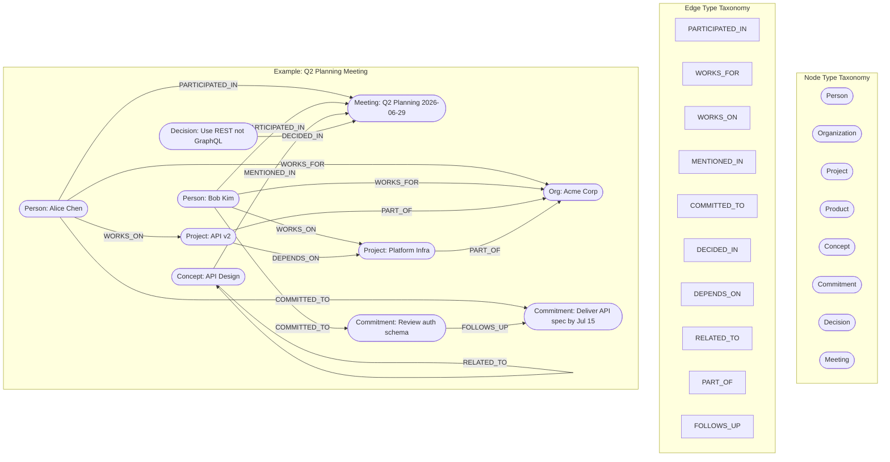

# 08 — Knowledge Graph Architecture

**Status**: Proposed  
**Author**: Chief Software Architect  
**Date**: 2026-06-29  
**Review Required**: Yes — this document defines the persistent knowledge layer. Every feature that touches entity relationships, cross-session memory, or professional intelligence derives its contract from here.

---

## 1. Why a Knowledge Graph

### 1.1 The Limitation of a Flat Model

A flat relational model of meeting data answers questions about individual meetings:

- "What was discussed on January 15th?"
- "Who attended the Q2 review?"
- "What action items were assigned to Alice?"

These are useful queries. They are also the ceiling. A flat model stores facts in rows; relationships between facts must be reconstructed at query time by joining tables. The more complex the relationship — spanning entities, time windows, sessions, and participants simultaneously — the more expensive and fragile that reconstruction becomes.

Consider a concrete question a flat model cannot answer efficiently:

> "Show me every commitment Alice has made this quarter, whether she delivered on each one, who was in the room when she committed, and whether those commitments relate to the same project."

This query requires joining sessions, participants, action items, completion status, co-participants, and project references across an unbounded time range. In SQL, this is five or more joins. In practice, application developers simplify the query until it is answerable, which means they stop asking the question the product actually needs to answer.

### 1.2 What a Graph Model Provides

A graph model treats relationships as first-class citizens alongside entities. The same commitment query above becomes a graph traversal: start at the Person node for Alice, walk all `COMMITTED_TO` edges, inspect the Commitment nodes, walk back to the Meeting nodes those commitments were `DECIDED_IN`, walk `PARTICIPATED_IN` edges to find co-participants, walk `MENTIONED_IN` edges to find the Project node.

The traversal reads like the question. The schema reflects the domain. New relationship types add edges, not tables.

This is what transforms Orin from a meeting recorder into a professional intelligence platform. A recorder stores what happened. A platform knows what it means across time.

### 1.3 Specific Capabilities the Graph Enables

**Commitment tracking with history.** A graph that stores `COMMITTED_TO` edges with timestamps, source sessions, and completion status can answer: "Has Alice committed to this before? Did she deliver?" The flat model stores the latest action item. The graph stores the pattern.

**Entity disambiguation across sessions.** "Apple" appears in three meetings this week. In one, it is Apple Inc. In two, it is the customer named Apple Hospitality. The graph stores both as distinct nodes with alias sets, and resolves future mentions by session context and co-occurring entities.

**Relationship discovery.** "Who connects Alice to the Infrastructure project?" The graph finds the shortest path through `WORKS_ON`, `PARTICIPATED_IN`, and `MENTIONED_IN` edges. A flat model has no concept of path.

**Temporal fact evolution.** John's role changes from Engineer to Engineering Manager between Q1 and Q2. The graph stores both facts with timestamps, preserving history while marking the newer fact authoritative. A flat model overwrites.

**Network analysis.** "Who are the most connected people across this organisation's meetings?" Graph degree centrality answers this directly.

### 1.4 The Counter-Argument and Why It Loses Here

Graph databases add operational complexity. For simple deployments, the adjacency list pattern in SQLite gives approximately 80% of the query power with near-zero operational overhead. The recommendation in this document is exactly that: SQLite adjacency list now, graph-native store only when query complexity demands it.

The graph is not the storage format. The graph is the data model. That model can be stored in SQLite, PostgreSQL, Neo4j, or anything with rows and indexes. The choice of storage engine is a Phase 3 question. The data model is a Phase 1 decision.

---

## 2. Graph Data Model

### 2.1 Node Types

Every entity in Orin's professional world is a `KnowledgeNode`. The `type` discriminates:

| Type | Description | Key Attributes |
|------|-------------|----------------|
| `Person` | A participant or referenced individual | name, email, organizationID |
| `Organization` | A company, team, or department | name, domain, parentOrgID |
| `Project` | A named initiative or workstream | name, status, ownerPersonID |
| `Product` | A specific product, service, or system | name, version, organizationID |
| `Concept` | An abstract topic that recurs across meetings | name, domain |
| `Commitment` | An action item (links to ActionItem in MeetingAnalysis) | text, dueDate, status, assigneePersonID |
| `Decision` | A choice made (links to MeetingAnalysis.decisions) | text, rationale, sessionID |
| `Meeting` | The session itself (links to Session aggregate) | sessionID, startedAt, endedAt, title |

`KnowledgeNode` properties that every type shares:

```swift
struct KnowledgeNode: Identifiable, Codable {
    let nodeID: NodeID            // UUID, stable across sync
    let type: NodeType
    var canonicalName: String     // primary display name
    var aliases: [String]         // alternative names for matching
    let firstSeenAt: Date         // date of first observation
    var lastSeenAt: Date          // date of most recent observation
    var metadata: [String: String] // type-specific extended attributes
    var confidence: Float          // 0.0–1.0, extractor confidence
}
```

### 2.2 Edge Types

Edges are directed and typed. Every edge carries the session that first produced it, enabling source tracing and session-scoped deletion.

| Relationship | From → To | Meaning |
|-------------|-----------|---------|
| `PARTICIPATED_IN` | Person → Meeting | Person was present in this meeting |
| `WORKS_FOR` | Person → Organization | Employment or affiliation relationship |
| `WORKS_ON` | Person → Project | Active involvement in a project |
| `MENTIONED_IN` | any → Meeting | Entity was referenced in this meeting |
| `COMMITTED_TO` | Person → Commitment | Person made this commitment |
| `DECIDED_IN` | Decision → Meeting | Decision was made in this meeting |
| `DEPENDS_ON` | Project → Project | Project has a dependency on another project |
| `RELATED_TO` | Concept → Concept | Semantic relationship between topics |
| `PART_OF` | Project → Organization | Project belongs to this organisation |
| `FOLLOWS_UP` | Commitment → Commitment | One commitment spawned from another |

```swift
struct KnowledgeEdge: Identifiable, Codable {
    let edgeID: EdgeID             // UUID, stable across sync
    let fromNodeID: NodeID
    let toNodeID: NodeID
    let relationship: EdgeRelationship
    var confidence: Float           // 0.0–1.0
    let observedAt: Date
    let sourceSessionID: SessionID  // enables session-scoped deletion
    var metadata: [String: String]
}
```

### 2.3 Graph Model Diagram

The diagram below shows the complete node type taxonomy, edge type set, and an example subgraph for a real meeting scenario: Alice commits to a deliverable in a planning meeting, the project depends on an infrastructure project, and the concept of "API design" threads through both.



### 2.4 Invariants

**INV-KG-001**: Every edge references two nodes that exist. Edges without valid `fromNodeID` or `toNodeID` are rejected at write time, not silently stored.

**INV-KG-002**: `canonicalName` is non-empty for all nodes. Entities extracted with empty or whitespace-only names are classified as `irrelevant` and not stored.

**INV-KG-003**: `sourceSessionID` is non-null for all edges. Edges without a source session cannot be created by the system (they may only be imported from the JSON-LD sync format with an explicit `imported` provenance flag).

**INV-KG-004**: Confidence values are in [0.0, 1.0]. Any extractor returning values outside this range causes a precondition failure in debug builds and is clamped in release.

---

## 3. Storage Architecture

### 3.1 Option A: SQLite Adjacency List (Recommended for Phase 1 and 2)

An adjacency list stores graph nodes and edges as relational rows. Graph traversal is expressed as SQL, including recursive CTEs for multi-hop path queries.

**Schema:**

```sql
-- Nodes table
CREATE TABLE knowledge_nodes (
    node_id     TEXT PRIMARY KEY,           -- UUID string
    type        TEXT NOT NULL,              -- 'Person', 'Organization', etc.
    canonical_name TEXT NOT NULL,
    aliases     TEXT NOT NULL DEFAULT '[]', -- JSON array of strings
    first_seen  TEXT NOT NULL,              -- ISO 8601 timestamp
    last_seen   TEXT NOT NULL,
    confidence  REAL NOT NULL DEFAULT 1.0,
    metadata    TEXT NOT NULL DEFAULT '{}'  -- JSON object
);

-- Edges table
CREATE TABLE knowledge_edges (
    edge_id         TEXT PRIMARY KEY,       -- UUID string
    from_node_id    TEXT NOT NULL REFERENCES knowledge_nodes(node_id),
    to_node_id      TEXT NOT NULL REFERENCES knowledge_nodes(node_id),
    relationship    TEXT NOT NULL,          -- 'PARTICIPATED_IN', etc.
    confidence      REAL NOT NULL DEFAULT 1.0,
    observed_at     TEXT NOT NULL,          -- ISO 8601 timestamp
    source_session  TEXT NOT NULL,          -- SessionID
    metadata        TEXT NOT NULL DEFAULT '{}'
);

-- Facts table — atomic claims about nodes
CREATE TABLE knowledge_facts (
    fact_id         TEXT PRIMARY KEY,
    node_id         TEXT NOT NULL REFERENCES knowledge_nodes(node_id),
    fact_key        TEXT NOT NULL,          -- e.g. 'role', 'email', 'location'
    fact_value      TEXT NOT NULL,
    confidence      REAL NOT NULL DEFAULT 1.0,
    source_session  TEXT NOT NULL,
    observed_at     TEXT NOT NULL,
    is_contradicted INTEGER NOT NULL DEFAULT 0  -- boolean: newer fact supersedes
);

-- Indexes for graph traversal performance
CREATE INDEX idx_nodes_type ON knowledge_nodes(type);
CREATE INDEX idx_nodes_canonical ON knowledge_nodes(canonical_name);
CREATE INDEX idx_edges_from ON knowledge_edges(from_node_id);
CREATE INDEX idx_edges_to ON knowledge_edges(to_node_id);
CREATE INDEX idx_edges_relationship ON knowledge_edges(relationship);
CREATE INDEX idx_edges_session ON knowledge_edges(source_session);
CREATE INDEX idx_facts_node ON knowledge_facts(node_id);
CREATE INDEX idx_facts_key ON knowledge_facts(node_id, fact_key);

-- Full-text search over node names and aliases
CREATE VIRTUAL TABLE knowledge_nodes_fts USING fts5(
    node_id UNINDEXED,
    canonical_name,
    aliases,
    content='knowledge_nodes',
    content_rowid='rowid'
);
```

**Multi-hop traversal with recursive CTE:**

```sql
-- Find shortest path between two nodes (up to 5 hops)
WITH RECURSIVE path(from_id, to_id, depth, route) AS (
    SELECT from_node_id, to_node_id, 1, json_array(from_node_id, to_node_id)
    FROM knowledge_edges
    WHERE from_node_id = :start_node_id

    UNION ALL

    SELECT p.from_id, e.to_node_id, p.depth + 1,
           json_insert(p.route, '$[#]', e.to_node_id)
    FROM path p
    JOIN knowledge_edges e ON e.from_node_id = p.to_id
    WHERE p.depth < 5
      AND p.to_id != :end_node_id
)
SELECT route FROM path WHERE to_id = :end_node_id
ORDER BY depth LIMIT 1;
```

**Capacity estimate:**

A daily heavy user (8 meetings/day, 10 participants each, 50 entities extracted per meeting) generates approximately:
- Nodes: 50 new/day → 18,250/year → ~91,000 over 5 years (with deduplication, far fewer unique nodes)
- Edges: 200/day → 73,000/year → ~365,000 over 5 years
- Facts: 100/day → 182,500/year

At this scale, SQLite with proper indexes handles every query in the performance budget. The total database size is well under 100MB. SQLite is the right choice.

### 3.2 Option B: Neo4j-Compatible Graph Database (Phase 3+)

If the user base scales to the point where graph queries become complex enough that SQL recursive CTEs are inadequate — deep multi-hop traversals, pattern matching, centrality analysis across millions of nodes — a native graph database becomes appropriate.

The migration path:
1. Export SQLite nodes and edges to JSON-LD (the snapshot format defined in Section 10)
2. Transform JSON-LD to Cypher `MERGE` statements
3. Import into Neo4j or a compatible engine (FalkorDB, MemGraph)

The schema above is designed with this migration in mind. `node_id` and `edge_id` are UUIDs that survive migration. Relationship names in `knowledge_edges.relationship` match Cypher convention (ALL_CAPS). `metadata` JSON columns map to Neo4j property maps.

**Do not implement Option B for Phase 1 or 2.** Operational complexity is the enemy of a small team. The schema above handles five years of heavy usage without stress.

### 3.3 Trade-off Summary

| Dimension | SQLite Adjacency List | Native Graph DB |
|-----------|----------------------|-----------------|
| Operational complexity | Near zero | Significant |
| Query language | SQL + recursive CTE | Cypher (more expressive) |
| Performance at 100k nodes | Excellent | Excellent |
| Performance at 10M nodes | Adequate (indexed) | Superior |
| Multi-hop path queries | Verbose but correct | Natural |
| macOS embedded deployment | First-class | Requires bundled server |
| Migration to graph DB | Designed-in | N/A |
| **Recommendation** | **Phase 1–2** | **Phase 3+ only** |

---

## 4. EntityExtractor Protocol

### 4.1 Protocol Definition

```swift
/// Extracts entity candidates from a transcript chunk.
/// Implementations differ in speed, accuracy, and language coverage.
/// Multiple implementations compose via HybridEntityExtractor.
protocol EntityExtractor: Sendable {
    func extract(
        from chunk: TranscriptChunk,
        existingNodes: [KnowledgeNode],
        language: Locale
    ) async throws -> [ExtractedEntity]
}

struct ExtractedEntity: Sendable {
    let text: String                // raw extracted text
    let type: NodeType              // classification
    let confidence: Float           // 0.0–1.0
    let sourceSegmentID: SegmentID  // which transcript segment sourced this
    let context: String             // surrounding ~200 characters for resolver
}
```

### 4.2 Implementations

**NLTaggerEntityExtractor** — fast, synchronous-friendly, Apple on-device:

```swift
actor NLTaggerEntityExtractor: EntityExtractor {
    private let tagger = NLTagger(tagSchemes: [.nameType])

    func extract(
        from chunk: TranscriptChunk,
        existingNodes: [KnowledgeNode],
        language: Locale
    ) async throws -> [ExtractedEntity] {
        tagger.string = chunk.text
        tagger.setLanguage(.init(language.identifier), range: chunk.text.startIndex..<chunk.text.endIndex)

        var entities: [ExtractedEntity] = []

        tagger.enumerateTags(
            in: chunk.text.startIndex..<chunk.text.endIndex,
            unit: .word,
            scheme: .nameType,
            options: [.omitWhitespace, .joinNames]
        ) { tag, tokenRange in
            guard let tag else { return true }
            let nodeType: NodeType? = switch tag {
            case .personalName:      .person
            case .organizationName:  .organization
            case .placeName:         nil  // Places not currently modelled
            default:                 nil
            }
            guard let nodeType else { return true }

            let text = String(chunk.text[tokenRange])
            let context = chunk.context(around: tokenRange, windowSize: 200)
            entities.append(ExtractedEntity(
                text: text,
                type: nodeType,
                confidence: 0.75,  // NLTagger does not expose confidence — fixed estimate
                sourceSegmentID: chunk.sourceSegmentID,
                context: context
            ))
            return true
        }
        return entities
    }
}
```

**LLMEntityExtractor** — high accuracy, uses InferenceWorker queue, slower:

```swift
actor LLMEntityExtractor: EntityExtractor {
    private let inferenceWorker: InferenceWorker
    private let promptStrategy: EntityExtractionPromptStrategy

    func extract(
        from chunk: TranscriptChunk,
        existingNodes: [KnowledgeNode],
        language: Locale
    ) async throws -> [ExtractedEntity] {
        let prompt = promptStrategy.entityExtractionPrompt(
            transcript: chunk.text,
            knownEntities: existingNodes.map(\.canonicalName),
            language: language
        )
        let response = try await inferenceWorker.complete(prompt: prompt)
        return try JSONDecoder().decode([ExtractedEntity].self, from: response.jsonData)
    }
}
```

**HybridEntityExtractor** — the production default:

```swift
actor HybridEntityExtractor: EntityExtractor {
    private let fast: NLTaggerEntityExtractor
    private let accurate: LLMEntityExtractor
    private let confidenceThreshold: Float = 0.6

    func extract(
        from chunk: TranscriptChunk,
        existingNodes: [KnowledgeNode],
        language: Locale
    ) async throws -> [ExtractedEntity] {
        // Fast pass always runs
        let fastResults = try await fast.extract(
            from: chunk, existingNodes: existingNodes, language: language)

        // LLM pass only for low-confidence items or chunks with no fast results
        let needsAccuratePass = fastResults.isEmpty
            || fastResults.contains { $0.confidence < confidenceThreshold }

        guard needsAccuratePass else { return fastResults }

        let accurateResults = try await accurate.extract(
            from: chunk, existingNodes: existingNodes, language: language)

        // Merge: accurate results win for overlapping text spans
        return merge(fast: fastResults, accurate: accurateResults)
    }
}
```

### 4.3 Performance Constraint

Entity extraction must not block the analysis pipeline. Both extractor types operate in a background task. The NLTagger pass is expected to complete in under 500ms. The LLM pass shares the `InferenceWorker` queue and is bounded by INV-005 (one inference job at a time per provider). It is non-blocking to the rest of the system while queued.

---

## 5. EntityResolver — Disambiguation

### 5.1 The Disambiguation Problem

Raw extraction produces candidates: the string "Apple" with type `Organization`. The resolver must decide whether this refers to Apple Inc., Apple Hospitality (a customer), or whether it is a passing reference not worth storing ("let me give you an apple" — irrelevant).

This is the hardest problem in the knowledge graph pipeline. The consequences of getting it wrong are durable: a misresolved entity creates incorrect relationship edges that persist until manually corrected.

### 5.2 Protocol Definition

```swift
protocol EntityResolver: Sendable {
    func resolve(
        candidate: ExtractedEntity,
        existingNodes: [KnowledgeNode],
        sessionContext: SessionContext
    ) async -> EntityResolution
}

enum EntityResolution: Sendable {
    case existing(KnowledgeNode)               // matched to a known entity
    case new(KnowledgeNode)                    // novel entity, create it
    case ambiguous([KnowledgeNode], String)    // multiple candidates, reason string
    case irrelevant                            // low signal, do not store
}
```

`SessionContext` provides the resolver with:

```swift
struct SessionContext: Sendable {
    let sessionID: SessionID
    let participants: [KnowledgeNode]          // confirmed participant nodes
    let calendarEvent: CalendarEvent?          // if meeting was calendar-detected
    let previousMentions: [String: KnowledgeNode] // text → node within this session
    let language: Locale
}
```

### 5.3 Resolution Strategy

The resolver applies a priority-ordered rule set:

**Rule 1 — Exact canonical name match:**
If `existingNodes` contains a node whose `canonicalName` exactly equals `candidate.text` (case-insensitive), return `.existing` with high confidence.

**Rule 2 — Alias match:**
If any node's `aliases` set contains `candidate.text`, return `.existing` with medium confidence (0.80).

**Rule 3 — Calendar participant match:**
If `sessionContext.calendarEvent.participants` contains an entry matching `candidate.text` (fuzzy name match), return `.existing` for that participant node with high confidence. Calendar-confirmed identity is strong signal.

**Rule 4 — Session co-occurrence:**
If this text was previously resolved in the same session (`previousMentions`), return the same node. Consistency within a session is a strong prior.

**Rule 5 — Context similarity:**
Apply lightweight NLP similarity between `candidate.context` and each candidate node's known facts. If one candidate is significantly more contextually similar (cosine similarity > 0.7), return `.existing` for that candidate.

**Rule 6 — Single-word common noun check:**
If `candidate.text` is a single word that appears in a common English dictionary and has no proper-noun capitalisation in context, classify as `.irrelevant`.

**Rule 7 — Ambiguity:**
If none of the above rules produce a confident match and multiple existing nodes are plausible, return `.ambiguous` with the candidate list and a reason string explaining the conflict.

**Rule 8 — New entity:**
If no existing nodes match and the candidate passes the relevance threshold (confidence > 0.5, not a common noun), return `.new` with a freshly constructed `KnowledgeNode`.

```swift
actor DefaultEntityResolver: EntityResolver {
    private let nodeStore: KnowledgeNodeStore
    private let nlSimilarity: NLEmbedding?

    func resolve(
        candidate: ExtractedEntity,
        existingNodes: [KnowledgeNode],
        sessionContext: SessionContext
    ) async -> EntityResolution {
        // Rule 4: session cache hit
        if let cached = sessionContext.previousMentions[candidate.text.lowercased()] {
            return .existing(cached)
        }

        // Rule 1: exact canonical match
        if let exact = existingNodes.first(where: {
            $0.canonicalName.lowercased() == candidate.text.lowercased()
        }) {
            return .existing(exact)
        }

        // Rule 2: alias match
        if let aliasMatch = existingNodes.first(where: { node in
            node.aliases.contains { $0.lowercased() == candidate.text.lowercased() }
        }) {
            return .existing(aliasMatch)
        }

        // Rule 3: calendar participant
        if let calendarParticipant = sessionContext.calendarEvent?.participants.first(where: {
            fuzzyMatch($0.name, candidate.text)
        }), let participantNode = existingNodes.first(where: {
            $0.type == .person && fuzzyMatch($0.canonicalName, calendarParticipant.name)
        }) {
            return .existing(participantNode)
        }

        // Rule 5: context similarity (if NL embedding available)
        let contextMatches = await contextSimilarityMatches(
            candidate: candidate, nodes: existingNodes)
        if contextMatches.count == 1 {
            return .existing(contextMatches[0])
        } else if contextMatches.count > 1 {
            return .ambiguous(contextMatches, "Multiple context-similar nodes found")
        }

        // Rule 6: common noun irrelevance
        if isCommonNoun(candidate.text, language: sessionContext.language) {
            return .irrelevant
        }

        // Rule 7: ambiguity from name fragments
        let fragmentMatches = existingNodes.filter { node in
            node.canonicalName.lowercased().contains(candidate.text.lowercased())
            || candidate.text.lowercased().contains(node.canonicalName.lowercased())
        }
        if fragmentMatches.count > 1 {
            return .ambiguous(fragmentMatches,
                "Name '\(candidate.text)' partially matches \(fragmentMatches.count) known entities")
        }

        // Rule 8: new entity
        guard candidate.confidence > 0.5 else { return .irrelevant }
        let newNode = KnowledgeNode(
            nodeID: NodeID(),
            type: candidate.type,
            canonicalName: candidate.text,
            aliases: [],
            firstSeenAt: Date(),
            lastSeenAt: Date(),
            metadata: [:],
            confidence: candidate.confidence
        )
        return .new(newNode)
    }
}
```

### 5.4 Conflict Escalation

When `.ambiguous` is returned, the `KnowledgeContext` emits a `KnowledgeConflict` domain event:

```swift
struct KnowledgeConflict: DomainEvent {
    let conflictID: UUID
    let candidates: [KnowledgeNode]
    let reason: String
    let sourceSessionID: SessionID
    let extractedText: String
    let suggestedResolution: KnowledgeNode?  // highest-confidence candidate
}
```

The UI may surface these conflicts in a dedicated review interface. Until resolved, both candidate nodes are linked to the session with reduced confidence edges. The system does not block on conflict resolution.

---

## 6. Fact Storage

### 6.1 Facts as Atomic Claims

A `Fact` is a single, atomic claim about an entity at a point in time. Facts are separate from node metadata because they evolve: roles change, contact information updates, project statuses shift.

```swift
struct Fact: Identifiable, Codable, Sendable {
    let factID: UUID
    let nodeID: NodeID
    let key: String           // standardised key: "role", "email", "location",
                              // "phone", "team", "status", "reportingTo"
    let value: String         // the claim
    let confidence: Float
    let sourceSessionID: SessionID
    let observedAt: Date
    var isContradicted: Bool  // true when a newer fact with same key exists
}
```

### 6.2 Fact Evolution

When a new fact is recorded for a node with the same `key`, the fact writer:

1. Marks all existing facts with that `key` as `isContradicted = true`
2. Inserts the new fact with `isContradicted = false`
3. Does not delete the older facts — history is preserved

This enables the timeline query (`KnowledgeQueryService.timeline`) to reconstruct the full evolution of any attribute.

**Example: role change over time**

```
Fact 1: nodeID = alice, key = "role", value = "Engineer",        observedAt = 2026-01-10, isContradicted = true
Fact 2: nodeID = alice, key = "role", value = "Tech Lead",       observedAt = 2026-04-05, isContradicted = true
Fact 3: nodeID = alice, key = "role", value = "Eng Manager",     observedAt = 2026-06-29, isContradicted = false
```

The current authoritative role is always the non-contradicted fact. All older facts are retrievable for audit.

### 6.3 Standardised Fact Keys

To prevent key proliferation (storing "email", "e-mail", "emailAddress" as three separate keys), the `KnowledgeContext` defines a canonical key vocabulary:

| Key | Type | Description |
|-----|------|-------------|
| `role` | String | Job title or role |
| `email` | String | Primary email address |
| `phone` | String | Primary phone number |
| `location` | String | Office or city |
| `team` | String | Team or department name |
| `status` | String | Project or commitment status |
| `reportingTo` | NodeID | Manager's node ID |
| `url` | String | Web presence |
| `timezone` | String | IANA timezone identifier |

Custom fact keys are permitted (prefixed with `x_`) but are not indexed for search.

---

## 7. Knowledge Query Service

### 7.1 Protocol Definition

```swift
/// The read interface for the KnowledgeContext.
/// All queries are read-only. Writes go through KnowledgeWriter.
/// Implementations must be safe to call from any actor context.
protocol KnowledgeQueryService: Sendable {

    /// All sessions involving a specific person, optionally bounded by date.
    func meetings(
        involving personID: NodeID,
        since: Date?
    ) async throws -> [SessionID]

    /// All commitments assigned to a person that are not marked complete.
    func openCommitments(
        for personID: NodeID
    ) async throws -> [KnowledgeNode]

    /// Shortest-path relationship between two entities (up to maxHops).
    func relationship(
        from: NodeID,
        to: NodeID,
        maxHops: Int
    ) async throws -> [KnowledgeEdge]

    /// All entities mentioned or participating in a specific session.
    func entities(
        in sessionID: SessionID,
        types: [NodeType]?
    ) async throws -> [KnowledgeNode]

    /// Full-text search across canonical names, aliases, and fact values.
    func search(
        _ query: String,
        types: [NodeType]?,
        limit: Int
    ) async throws -> [KnowledgeNode]

    /// Temporal fact history for a node.
    func timeline(
        for nodeID: NodeID,
        since: Date
    ) async throws -> [Fact]

    /// Degree: how many edges connect to this node (network importance).
    func degree(of nodeID: NodeID) async throws -> Int

    /// Co-occurrence: nodes most frequently appearing in the same meetings
    /// as the given node.
    func frequentCoOccurrences(
        of nodeID: NodeID,
        limit: Int
    ) async throws -> [(KnowledgeNode, Int)]
}
```

### 7.2 SQLite Implementation Notes

**`meetings(involving:since:)` — one join:**

```sql
SELECT DISTINCT e.source_session
FROM knowledge_edges e
WHERE e.from_node_id = :personID
  AND e.relationship = 'PARTICIPATED_IN'
  AND (:since IS NULL OR e.observed_at >= :since)
ORDER BY e.observed_at DESC;
```

**`openCommitments(for:)` — type filter + fact filter:**

```sql
SELECT n.*
FROM knowledge_nodes n
JOIN knowledge_edges e ON e.to_node_id = n.node_id
  AND e.relationship = 'COMMITTED_TO'
  AND e.from_node_id = :personID
WHERE n.type = 'Commitment'
  AND NOT EXISTS (
      SELECT 1 FROM knowledge_facts f
      WHERE f.node_id = n.node_id
        AND f.fact_key = 'status'
        AND f.fact_value = 'completed'
        AND f.is_contradicted = 0
  );
```

**`search(_:types:limit:)` — FTS5:**

```sql
SELECT n.*
FROM knowledge_nodes n
JOIN knowledge_nodes_fts fts ON fts.node_id = n.node_id
WHERE knowledge_nodes_fts MATCH :query
  AND (:types IS NULL OR n.type IN (:types))
ORDER BY rank
LIMIT :limit;
```

---

## 8. Knowledge Graph and Privacy

### 8.1 Classification

All knowledge graph data is classified **Restricted** — the same classification as raw transcript text. The rationale: the graph is a structural distillation of transcript content. Even without the literal words, a person's professional relationships, commitment history, and fact attributes are personally sensitive.

Restricted data implications:
- Stored in the same encrypted container as transcripts (SwiftData/GRDB with SQLCipher or equivalent)
- Never transmitted without an active, session-scoped `ConsentRecord`
- Never written to a non-encrypted location (no temp files, no debug logs containing node content)
- User-facing data controls treat graph data identically to meeting recordings

### 8.2 Session-Scoped Deletion

Every edge carries a `sourceSessionID`. When a session is deleted:

1. Delete all edges where `source_session = :sessionID`
2. Identify nodes that now have zero edges (orphaned nodes)
3. For orphaned nodes: flag as `orphaned` in metadata — do not auto-delete
4. Emit `SessionKnowledgeRemoved` event with orphaned node IDs for UI review

**Why not auto-delete orphaned nodes?**

A node may have been referenced in a meeting the user does not want to delete, then again in a meeting they do. Deleting the session should not silently delete the entity — the user may have intentionally retained that entity in their knowledge base. The orphan review interface (a future UI feature) presents these nodes for user decision.

### 8.3 Full Knowledge Wipe

The `KnowledgeWriter` exposes:

```swift
func deleteAllKnowledge() async throws
```

This truncates `knowledge_nodes`, `knowledge_edges`, and `knowledge_facts`. It does not touch the `sessions` or `transcripts` tables. The underlying meetings remain intact; only the derived graph is erased.

This operation emits `KnowledgeWiped` as a domain event. Any context that caches knowledge graph data (UI, plugins) must invalidate on receipt.

### 8.4 Audit Trail

Fact insertions and deletions are appended to the `ObservabilityContext` audit log. The audit log stores the `nodeID`, `factKey`, `operation` (insert/mark-contradicted), and `sourceSessionID`. Audit log entries do not contain `factValue` — the value itself is Restricted and does not go into the audit log.

---

## 9. Knowledge Graph for Plugins

### 9.1 Access Model

Plugins access the knowledge graph through a scoped proxy, not directly through `KnowledgeQueryService`. The proxy enforces:

**Read access — permitted:**
- Node metadata (type, canonicalName, aliases, firstSeenAt, lastSeenAt)
- Edge structure (relationship type, confidence, observedAt)
- Fact keys and values for keys in the standardised vocabulary
- The full `KnowledgeQueryService` query surface

**Read access — forbidden:**
- Raw transcript segments that sourced an entity
- Facts with keys prefixed `x_` (custom/private)
- The internal `SessionID` values for edges (plugins see an opaque `meetingReference` instead)

**Write access — plugins do not write directly.** A plugin that discovers a new entity or relationship emits a `PluginEntitySuggestion`:

```swift
struct PluginEntitySuggestion: DomainEvent {
    let pluginID: PluginID
    let suggestedNode: KnowledgeNode
    let suggestedEdges: [KnowledgeEdge]
    let rationale: String
}
```

The `KnowledgeContext` queues these suggestions for user confirmation. Accepted suggestions are written with `source = "plugin:\(pluginID)"` provenance. Rejected suggestions are discarded and logged.

### 9.2 Capability Manifest

A plugin must declare knowledge graph capabilities in its manifest:

```json
{
  "capabilities": {
    "knowledge_graph": {
      "read": true,
      "suggest_entities": true,
      "node_types": ["Person", "Project", "Organization"]
    }
  }
}
```

A plugin without `"knowledge_graph": { "read": true }` receives an empty result set from any `KnowledgeQueryService` call. The capability check occurs at the proxy layer, not in the plugin.

---

## 10. Knowledge Snapshot for Sync

### 10.1 Snapshot Format

The `KnowledgeContext` emits `KnowledgeSnapshot` events for cross-device sync. Snapshots use **JSON-LD** — the W3C Linked Data standard — because:
- It is self-describing: node types and relationship names carry their semantic meaning
- It is compatible with future Cypher migration (JSON-LD maps cleanly to property graphs)
- It is a stable, standards-based format that survives Orin-internal schema changes

```json
{
  "@context": {
    "@vocab": "https://orin.local/kg/",
    "schema": "https://schema.org/"
  },
  "@graph": [
    {
      "@id": "orin:node/550e8400-e29b-41d4-a716-446655440000",
      "@type": "Person",
      "canonicalName": "Alice Chen",
      "aliases": ["Alice", "A. Chen"],
      "firstSeenAt": "2026-01-10T09:00:00Z",
      "lastSeenAt": "2026-06-29T14:30:00Z",
      "confidence": 0.95
    },
    {
      "@id": "orin:edge/7c9e6679-7425-40de-944b-e07fc1f90ae7",
      "@type": "COMMITTED_TO",
      "fromNode": "orin:node/550e8400-e29b-41d4-a716-446655440000",
      "toNode": "orin:node/f47ac10b-58cc-4372-a567-0e02b2c3d479",
      "confidence": 0.92,
      "observedAt": "2026-06-29T14:30:00Z"
    }
  ],
  "snapshotID": "diff-2026-06-29T14:30:00Z",
  "since": "2026-06-28T14:30:00Z",
  "deviceID": "mac-abhishek-primary"
}
```

Note: `sourceSessionID` is excluded from snapshots. Session IDs are device-local. Cross-device session reconciliation is handled by `SyncProvider`, not by the knowledge snapshot.

### 10.2 Encryption

Before transmission, the snapshot JSON is encrypted using the user's iCloud-held key. The `KnowledgeContext` does not manage encryption directly — it hands the serialised JSON to the `SyncProvider`, which applies encryption before any network write.

### 10.3 Differential Snapshots

Full snapshots are not produced on every sync cycle. The snapshot mechanism:

1. Record the timestamp of the last acknowledged snapshot per device (`lastSyncedAt`)
2. Query nodes where `last_seen >= lastSyncedAt` OR new edges where `observed_at >= lastSyncedAt`
3. Include only those nodes and edges in the differential snapshot
4. On the receiving device, merge: new nodes are inserted, existing nodes have their `lastSeenAt` and aliases merged (union), edges are inserted if they do not already exist by `edgeID`

### 10.4 Conflict Resolution

**Facts:** Last-write-wins by `observedAt` timestamp. The receiving device applies the fact with the later `observedAt`, marks earlier facts `isContradicted = true`.

**Edges:** Union. If both devices created an edge between the same two nodes with the same relationship type, both edges are retained (they represent two independent observations of the same relationship — this is additive, not conflicting).

**Nodes:** Canonical names merge by last-write-wins. Aliases are unioned. Confidence is the max of both devices' values.

---

## 11. Future: Knowledge Graph as MCP Tool

When MCP (Model Context Protocol) integration is built in Phase 3, the knowledge graph becomes a first-class MCP tool. This enables external AI agents — and Orin's own analysis pipeline — to query the user's professional history during inference.

### 11.1 Tool Definition

```json
{
  "name": "search_knowledge_graph",
  "description": "Search Orin's knowledge graph for entities in the user's professional world. Returns people, projects, organisations, commitments, and decisions extracted from the user's meeting history.",
  "inputSchema": {
    "type": "object",
    "properties": {
      "query": {
        "type": "string",
        "description": "Natural language or name search query"
      },
      "types": {
        "type": "array",
        "items": { "enum": ["Person", "Organization", "Project", "Product", "Concept", "Commitment", "Decision", "Meeting"] },
        "description": "Filter to specific node types. Omit for all types."
      },
      "since": {
        "type": "string",
        "format": "date-time",
        "description": "ISO 8601 timestamp. Return only entities observed since this date."
      },
      "limit": {
        "type": "integer",
        "default": 10,
        "maximum": 50
      }
    },
    "required": ["query"]
  }
}
```

```json
{
  "name": "get_entity_timeline",
  "description": "Retrieve the full fact history for an entity — how their role, status, or attributes have changed over time.",
  "inputSchema": {
    "type": "object",
    "properties": {
      "nodeID": { "type": "string" },
      "since": { "type": "string", "format": "date-time" }
    },
    "required": ["nodeID"]
  }
}
```

### 11.2 Contextual Analysis

Once MCP tools are available to the analysis pipeline, the `IntelligenceContext` can provide history-aware analysis:

> **System prompt context (injected at analysis time):**
> "You have access to the tool `search_knowledge_graph`. Before summarising commitments or action items, use the tool to check whether any of the participants has previous commitments to the same topic. If they do, note the pattern in the summary."

This enables the core product differentiator: analysis that is aware of the user's professional history, not just the current meeting.

### 11.3 Privacy Boundary

MCP tool calls are subject to the same consent and privacy rules as direct knowledge graph queries. If the user's active session does not have a `ConsentRecord` permitting external knowledge transmission, MCP tool results are returned locally only — the response is visible to the local analysis pipeline but not transmitted to any external model provider.

---

## 12. Performance Budget

All operations are measured from caller invocation to result delivery, excluding network latency (which is always zero for local operations).

| Operation | Budget | Implementation Guidance |
|-----------|--------|------------------------|
| NLTagger entity extraction per chunk | < 500ms | Synchronous on background thread; NLTagger is CPU-bound |
| LLM entity extraction per chunk | < 30s | Shares InferenceWorker queue; non-blocking to rest of system |
| Graph write (node + edges for one session) | < 500ms | Single SQLite transaction with WAL mode |
| `meetings(involving:since:)` | < 100ms | Single indexed join; must hold at 100k edges |
| `openCommitments(for:)` | < 200ms | Two joins + fact subquery |
| `search(_:types:limit:)` with FTS5 | < 500ms | FTS5 virtual table; must hold at 50k nodes |
| `relationship(from:to:maxHops:)` | < 300ms | Recursive CTE, max 5 hops, indexed |
| `timeline(for:since:)` | < 100ms | Single indexed table scan |
| Knowledge snapshot generation (differential) | < 5s | Background task, never on critical path |
| Full knowledge wipe | < 2s | Truncate three tables in transaction |

### 12.1 Monitoring

The `ObservabilityContext` records a `KnowledgeOperationTiming` metric for every query:

```swift
struct KnowledgeOperationTiming: Metric {
    let operation: String
    let durationMs: Double
    let resultCount: Int
    let budgetMs: Double
    var exceededBudget: Bool { durationMs > budgetMs }
}
```

Any operation exceeding budget emits a `PerformanceBudgetExceeded` event. In Phase 2, this feeds into the index health monitor.

---

## 13. Integration with Other Bounded Contexts

| Context | Interaction | Direction |
|---------|-------------|-----------|
| **Session Context** | Provides `SessionID` and participant list at session start | Session → Knowledge |
| **Transcription Context** | Provides `TranscriptChunk` for entity extraction | Transcription → Knowledge |
| **Intelligence Context** | Reads knowledge graph for contextual analysis; receives extraction results | Bidirectional |
| **Identity Context** | Provides calendar participant list for resolver Rule 3 | Identity → Knowledge |
| **Observability Context** | Receives timing metrics and audit log entries | Knowledge → Observability |
| **Plugin Context** | Reads via scoped proxy; suggests entities via events | Bidirectional (gated) |
| **Integration Context** | Triggers sync snapshots; receives remote snapshots | Bidirectional |

Knowledge is a **consumer** of Session and Transcription output. It is a **producer** of enriched context for Intelligence. It does not depend on Intelligence for its own writes.

---

## 14. Migration Plan

### Phase 1 (Current Sprint)

- Introduce `KnowledgeNode`, `KnowledgeEdge`, `Fact` types
- Create SQLite schema (adjacency list) alongside existing SwiftData store
- Implement `NLTaggerEntityExtractor` (fast path only)
- Implement `DefaultEntityResolver`
- Wire extraction after `AnalysisCompleted` event
- No UI exposure in Phase 1 — internal plumbing only

### Phase 2 (8–10 Weeks)

- Implement `LLMEntityExtractor` and `HybridEntityExtractor`
- Implement full `KnowledgeQueryService` with all queries
- Expose knowledge graph in UI: entity cards on transcript view, person relationship panel
- Implement conflict resolution UI (`KnowledgeConflict` event handler)
- Implement session-scoped deletion and orphan review

### Phase 3 (12–16 Weeks)

- Implement `KnowledgeSnapshot` with JSON-LD format
- Integrate with `SyncProvider` for cross-device sync
- Implement plugin knowledge graph proxy and capability checks
- Evaluate native graph DB if query complexity warrants it
- Implement MCP tool definitions for `search_knowledge_graph`

### Phase 4 (6–12 Months)

- Cross-platform knowledge graph (iOS, Android share the same schema)
- Shared knowledge across devices with real-time conflict resolution
- Knowledge graph as the intelligence backbone for all analysis
