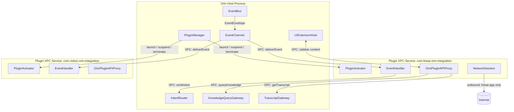
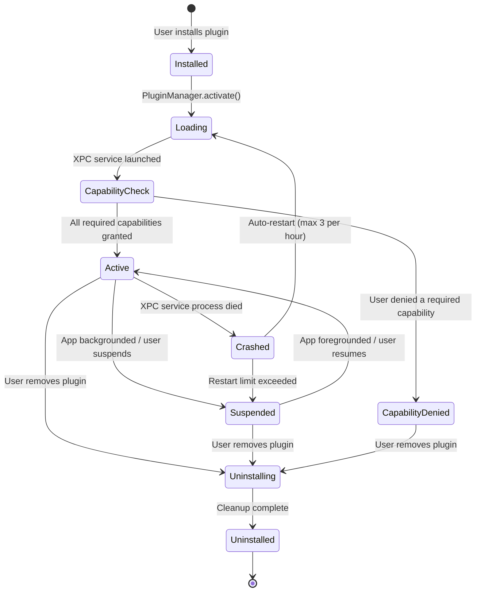

# 09 — Plugin and Extension SDK

**Status**: Proposed  
**Author**: Chief Software Architect  
**Date**: 2026-06-29  
**Review Required**: Yes — this document defines the security and isolation boundary between Orin's core and all third-party code. Any extension mechanism that bypasses the XPC boundary described here is an architectural violation.

**Depends On**: 01-Product-Domain-Architecture.md, 02-Event-Driven-Architecture.md  
**Implements**: Plugin Context (Generic), Integration Context (Generic)

---

## 1. Why Plugins, and Why the Design Is Hard

### 1.1 The Value Proposition

No meeting intelligence product can own every workflow it touches. A development team routes action items to Linear. A sales team routes them to Salesforce. A design team posts meeting summaries to Notion. An executive assistant wants a Slack message with three bullet points within five minutes of every meeting ending.

Orin can ship none of these integrations without a plugin system. More importantly, Orin cannot predict which integrations matter to which users. A plugin system lets Orin's value compound: every integration a third party builds becomes a reason for a new user segment to adopt the product.

### 1.2 Why the Design Is Hard

The difficulty is not technical — it is the intersection of two constraints that pull against each other:

**Constraint 1: Plugins must be capable enough to be worth building.**  
A plugin that only reads meeting summaries but cannot act on them is useless. Integrations need to read transcript data, query the knowledge graph, emit actions back into Orin, and make network requests to external services.

**Constraint 2: Plugins must never threaten the core product guarantees.**  
Orin's non-negotiable value is that it reliably captures meetings and never loses a recording. A plugin crash must not crash Orin. A plugin that leaks transcript data to an undeclared host must be impossible, not merely prohibited. A slow plugin must not delay the analysis pipeline.

These two constraints together define the architecture. Every design decision in this document traces back to resolving this tension.

### 1.3 What Plugins Can and Cannot Do

**Plugins CAN:**
- Subscribe to domain events (session lifecycle, analysis completion, knowledge updates)
- Query the knowledge graph for entities, relationships, and commitments
- Read meeting analysis summaries and structured action items
- Read transcript text (with explicit user consent per session)
- Emit intents that trigger Orin workflows (export, analysis retry, vocabulary addition)
- Add UI extensions (sidebar panel, toolbar action)
- Make network requests to declared external hosts
- Persist isolated data in a sandboxed plugin storage area

**Plugins CANNOT:**
- Access the Core Audio thread — physically impossible from XPC
- Access another plugin's storage
- Access the InferenceWorker directly — only via the Intent system
- Modify domain events in transit — events are immutable value types
- Contact undeclared network hosts — enforced by App Sandbox entitlements on the XPC service
- Block any core pipeline operation — event delivery is asynchronous and capped at 5 seconds
- Read another session's transcript without a fresh consent check for that session

---

## 2. Sandboxing Model: XPC Out-of-Process

### 2.1 The Decision

Every plugin runs in its own XPC service — a separate process with its own memory space, sandboxed by the operating system.

This was not the only option considered.

### 2.2 Option A: In-Process Plugins

Plugins are Swift modules (`.dylib` or dynamically-loaded bundles) loaded into the host process. A capability system controls which internal APIs each plugin can call.

**Pros:** Simple to develop. Near-zero IPC overhead. Straightforward debugging.

**Cons:**
- A crashing plugin kills the host. Losing a meeting because a Linear integration plugin dereferenced a nil pointer is not acceptable.
- A malicious or buggy plugin can read all memory in the process, including in-flight transcript text and user credentials stored in the Keychain.
- No operating system boundary exists. Capability checks are advisory, not enforced.
- Not compatible with Mac App Store review requirements for plugins that access protected resources.

### 2.3 Option B: XPC Out-of-Process

Each plugin binary runs as an XPC service — a macOS-standard mechanism for privileged separation. Communication uses serialized message passing over a Mach port. The XPC service has its own App Sandbox entitlements that declare exactly which resources it can access.

**Pros:**
- Crash isolation: a plugin process crashing leaves the host application completely unaffected. The host detects the crash, logs it to Observability, and attempts auto-restart.
- True security boundary: the operating system enforces memory isolation. A plugin cannot read the host's heap regardless of what Swift or Objective-C code it executes.
- Network isolation: the XPC service's entitlements declare permitted outbound network destinations. Attempts to contact undeclared hosts fail at the kernel level, not at the application level.
- This is the standard macOS pattern for extensions that access protected resources (App Extensions, XPC Services).

**Cons:**
- More complex to develop than in-process.
- Latency per IPC call: 1–5 ms round-trip vs. <0.1 ms for in-process calls.

### 2.4 Justification for XPC

The latency overhead is the only legitimate technical objection. It is acceptable because:

1. **Plugins are never on the real-time audio path.** They receive events after audio capture, transcription, and analysis have completed. A 5 ms IPC call against a pipeline that already took 30 seconds for analysis is not a performance consideration.

2. **The alternative failure mode is catastrophic.** In-process plugins that crash during a meeting cause data loss. XPC plugin crashes are invisible to the user and cause zero data loss.

3. **Security cannot be advisory.** Orin handles sensitive meeting data. A capability system enforced in software can be bypassed by a plugin that uses private APIs, Objective-C runtime introspection, or unsafe Swift. An XPC boundary enforced by the OS kernel cannot.

**Decision: XPC for all plugins. No exceptions.**

---

## 3. Plugin Architecture Overview



### 3.1 Key Components in the Host

**PluginManager** — owns the plugin registry, lifecycle state machine, capability validation, and XPC connection pool. There is one `PluginManager` instance in the host.

**EventChannel** — mediates event delivery to plugin processes. It receives events from the internal `EventBus`, applies payload filtering (strips restricted fields from events delivered to plugins without the relevant capability), and dispatches to each subscribed plugin's XPC service asynchronously. It never blocks on plugin acknowledgment.

**IntentRouter** — receives intents emitted by plugins via XPC, validates the emitting plugin's declared emit capabilities, and routes valid intents to registered handlers in OrinCore. Invalid intents (not in the plugin's declared capabilities) are rejected and logged.

**KnowledgeQueryGateway** — serializes knowledge queries from plugins into safe, read-only `KnowledgeQuery` value types before passing them to the Knowledge Context. Plugins cannot obtain a direct reference to any aggregate.

**TranscriptGateway** — enforces consent checks before returning any transcript data. For every call to `getTranscript(for:)`, this gateway verifies that a `ConsentRecord` exists for that `SessionID` and that its scope includes the calling plugin's ID.

**UIExtensionHost** — manages the sidebar and toolbar extension surfaces. Plugin UI content is rendered in a separate WKWebView with a restricted content policy, or in a separate SwiftUI view hosted via an NSViewControllerRepresentable backed by the plugin's XPC service.

---

## 4. Plugin Manifest

Every plugin declares its full capability requirements in a signed manifest. The manifest is evaluated at install time and at each activation. A plugin cannot acquire capabilities not declared in its manifest.

### 4.1 Manifest Schema

```json
{
  "pluginID": "com.linear.orin-integration",
  "displayName": "Linear Integration",
  "version": "1.0.0",
  "minOrinVersion": "2.0",
  "capabilities": [
    "events.subscribe.analysis.completed",
    "events.subscribe.session.finalized",
    "knowledge.read.entities",
    "knowledge.read.commitments",
    "intents.emit.export.actionitems",
    "network.access.linear.app"
  ],
  "privacyPolicy": "https://linear.app/privacy",
  "dataRetentionDays": 0,
  "transmitsTranscript": false,
  "backgroundExecution": false
}
```

### 4.2 Capability Categories

| Prefix | Meaning |
|--------|---------|
| `events.subscribe.*` | Which domain events the plugin receives. Wildcard events are not permitted — each event type must be declared individually. |
| `events.emit.*` | Which intents the plugin can trigger. Each intent type must be declared. |
| `knowledge.read.*` | Which knowledge graph query types the plugin can execute. Sub-categories: `entities`, `relationships`, `commitments`, `decisions`. |
| `analysis.read.*` | Access to meeting analysis output. Sub-categories: `summary`, `actionitems`, `keypoints`. |
| `transcript.read.*` | Access to raw transcript text. Requires explicit user grant per session, checked at runtime by TranscriptGateway regardless of capability declaration. |
| `network.access.<hostname>` | Declared outbound network destinations. One entry per apex domain. Wildcard subdomains of a declared apex are permitted (e.g., `network.access.linear.app` permits `api.linear.app`). |
| `ui.sidebar` | Permission to register a sidebar panel in the Orin UI. |
| `ui.toolbar` | Permission to register a toolbar action in the Orin UI. |
| `storage.isolated` | Permission to use the plugin persistence API. Always granted if the plugin XPC service is active — listed in manifest for transparency. |

### 4.3 Required vs. Optional Capabilities

Capabilities are classified in the manifest as `required` or `optional`. If a user denies a `required` capability, the plugin enters `CapabilityDenied` state and cannot activate. If a user denies an `optional` capability, the plugin activates with reduced functionality; it is the plugin's responsibility to degrade gracefully.

```json
{
  "capabilities": [
    {
      "id": "events.subscribe.analysis.completed",
      "required": true,
      "reason": "Linear integration cannot create issues without knowing when analysis completes."
    },
    {
      "id": "transcript.read.full",
      "required": false,
      "reason": "Used to add meeting context to Linear issue descriptions. Integration works without this."
    }
  ]
}
```

### 4.4 Privacy Declarations

The manifest includes privacy declarations that Orin surfaces to the user at install time:

- `transmitsTranscript`: boolean. If `true`, the user is shown an explicit warning before installation.
- `dataRetentionDays`: integer. `0` means the plugin declares it does not retain meeting data. Orin does not enforce this — it is a declaration for user transparency.
- `privacyPolicy`: URL. Orin links to this from the plugin's settings page.

These declarations do not substitute for the capability enforcement system — they are transparency metadata for the user.

---

## 5. Plugin Lifecycle

### 5.1 State Machine



### 5.2 Activation Sequence

The activation sequence is a handshake between `PluginManager` and the plugin's XPC service. It must complete within 10 seconds or the plugin enters `Suspended` state.

```
PluginManager                           Plugin XPC Service
     |                                         |
     |-- launchXPCService() ------------------>|
     |                                         |-- init()
     |<-- xpcServiceReady() -------------------|
     |                                         |
     |-- sendGrantedCapabilities([...]) ------->|
     |                                         |-- store capabilities
     |<-- declareEventSubscriptions([...]) ----|
     |                                         |
     |  (validate: subscriptions ⊆ granted     |
     |   events.subscribe.* capabilities)      |
     |                                         |
     |-- activationComplete() --------------->|
     |                                         |-- enter Active state
     |                                         |
     |  (EventChannel begins delivering events)|
```

If the plugin declares subscriptions to event types not in its granted capabilities, `PluginManager` rejects the subscription list and logs the violation. The plugin may re-declare a corrected list within 5 seconds or activation fails.

### 5.3 Suspension and Auto-Restart

A plugin is automatically suspended when:
- The host application enters the background (unless the plugin has `backgroundExecution: true` in its manifest, which requires additional review)
- The plugin's XPC service process crashes
- The user suspends the plugin from Settings
- The plugin exceeds the event delivery timeout threshold (more than 20% of events dropped in a 5-minute window)

When a plugin crashes, `PluginManager` applies exponential backoff before restart: 5s, 30s, 5m. After three crashes in one hour, the plugin enters `Suspended` state and the user is notified. Auto-restart does not resume until the user manually re-enables the plugin or the plugin is updated.

### 5.4 Uninstall Cleanup

On uninstall:
1. Plugin XPC service is terminated
2. All plugin-isolated storage is purged (filesystem and Core Data)
3. All event subscriptions are de-registered
4. All UI extensions (sidebar, toolbar) are removed
5. Any intents in flight from this plugin are cancelled and removed from the IntentRouter
6. The plugin's entry is removed from the registry
7. The plugin's XPC entitlement is revoked

Uninstall is irreversible. There is no soft-delete or recycle bin for plugin data.

---

## 6. Plugin API (The Orin SDK)

The Orin SDK is a Swift package (`OrinPluginSDK`) that plugin authors import. It provides typed wrappers around the underlying XPC calls. Plugin authors never interact with XPC directly.

### 6.1 Protocol Definition

```swift
/// The complete API surface available to an Orin plugin.
/// All methods are async — they make XPC calls under the hood.
/// All methods throw OrinPluginError if the call fails or the
/// plugin lacks the required capability.
public protocol OrinPluginAPI: Sendable {

    // MARK: — Knowledge Queries (requires knowledge.read.* capability)

    /// Execute a structured query against the Knowledge Context.
    /// Returns only the entity and relationship types the plugin
    /// is permitted to read per its granted capabilities.
    func queryKnowledge(_ query: KnowledgeQuery) async throws -> KnowledgeQueryResult

    // MARK: — Meeting Analysis (requires analysis.read.* capability)

    /// Retrieve the analysis summary for a finalized session.
    /// Returns MeetingAnalysisSummary — a read-only value type.
    /// Does not return raw transcript text.
    func getAnalysis(for sessionID: SessionID) async throws -> MeetingAnalysisSummary

    // MARK: — Transcript Access
    // Requires: transcript.read.* capability AND active ConsentRecord
    // for this sessionID that names this pluginID.
    // TranscriptGateway performs the consent check. If consent is absent,
    // this call throws OrinPluginError.consentRequired regardless of
    // the plugin's declared capability.

    /// Retrieve a transcript excerpt.
    /// The excerpt is bounded — plugins cannot request the full transcript
    /// in a single call. Maximum excerpt: 10,000 tokens per call.
    func getTranscript(
        for sessionID: SessionID,
        range: TranscriptRange
    ) async throws -> TranscriptExcerpt

    // MARK: — Intent Emission (requires events.emit.* capability)

    /// Emit an intent into the Orin intent routing system.
    /// The intent type must be within the plugin's declared emit capabilities.
    /// Invalid intent types are rejected by IntentRouter before routing.
    func emitIntent(_ intent: UserIntent) async throws

    // MARK: — UI Extensions (requires ui.sidebar or ui.toolbar capability)

    /// Register a sidebar panel. The panel's content is rendered in a
    /// restricted WKWebView. Content must be static HTML/CSS/JS —
    /// no external resource loading is permitted from the sidebar.
    func registerSidebarProvider(_ provider: SidebarContentDescriptor) throws

    /// Register a toolbar action. The action appears in Orin's main toolbar.
    func registerToolbarAction(_ action: ToolbarActionDescriptor) throws

    // MARK: — Plugin Storage (always available if plugin is active)

    /// Store arbitrary data under a string key.
    /// Storage is isolated per plugin — no plugin can access another plugin's data.
    /// Total storage limit: 50 MB per plugin. Exceeding this throws
    /// OrinPluginError.storageLimitExceeded.
    func store(_ data: Data, forKey key: String) async throws

    /// Retrieve previously stored data.
    func retrieve(forKey key: String) async throws -> Data?

    /// Delete stored data.
    func delete(forKey key: String) async throws
}
```

### 6.2 Value Types Crossing the XPC Boundary

All types that cross the XPC boundary must be:
- `Codable` (serialized to property list or JSON)
- Value types (structs, not classes or actors)
- Free of closures, function types, or unserializable references

```swift
public struct KnowledgeQuery: Codable, Sendable {
    public let entityTypes: [EntityType]
    public let relationshipTypes: [RelationshipType]
    public let sessionScope: SessionScope      // .current, .all, .specific(SessionID)
    public let maxResults: Int                 // max 100
    public let filters: [QueryFilter]
}

public struct MeetingAnalysisSummary: Codable, Sendable {
    public let sessionID: SessionID
    public let summary: String
    public let actionItems: [ActionItemSummary]
    public let decisions: [DecisionSummary]
    public let keyPoints: [String]
    public let modelUsed: String
    public let analyzedAt: Date
    // NOTE: transcript text is NOT included in this type.
    // Use getTranscript() with consent.
}

public struct TranscriptExcerpt: Codable, Sendable {
    public let sessionID: SessionID
    public let segments: [TranscriptSegmentSummary]
    public let totalSegmentCount: Int
    public let requestedRange: TranscriptRange
    public let consentedPluginID: String
}

public struct UserIntent: Codable, Sendable {
    public let intentType: String
    public let parameters: [String: IntentParameterValue]
    public let sourcePluginID: String
    public let sessionID: SessionID?
    public let requestID: UUID          // for deduplication
}
```

### 6.3 OrinPluginError

```swift
public enum OrinPluginError: Error, Sendable {
    case capabilityDenied(required: String)
    case consentRequired(sessionID: SessionID)
    case sessionNotFound(SessionID)
    case intentTypeNotPermitted(String)
    case storageLimitExceeded(current: Int, limit: Int)
    case xpcConnectionInterrupted
    case xpcServiceUnavailable
    case invalidQuery(String)
    case rateLimitExceeded(retryAfter: TimeInterval)
}
```

### 6.4 Plugin Entry Point

Plugin authors implement the `OrinPlugin` protocol:

```swift
public protocol OrinPlugin: AnyObject {

    /// Unique identifier — must match pluginID in manifest.
    static var pluginID: String { get }

    /// Called after activation completes and granted capabilities are known.
    /// Plugin declares which events it wants to receive.
    func activate(with api: OrinPluginAPI, capabilities: GrantedCapabilities) async throws

    /// Called when an event is delivered to this plugin.
    /// Must return within 5 seconds or the event is dropped and logged.
    func handleEvent(_ event: PluginEvent) async

    /// Called before deactivation — plugin should cancel any in-flight operations.
    func willDeactivate() async

    /// Called on uninstall — plugin should clean up any external state
    /// (e.g., webhooks registered with Linear).
    func willUninstall() async
}
```

---

## 7. Event Delivery to Plugins

Events that cross the plugin boundary are governed by a strict contract. The contract protects two things simultaneously: the plugin's ability to act on events, and the core pipeline's freedom from any dependency on plugin behavior.

### 7.1 Event Envelope

```swift
struct PluginEventEnvelope: Codable, Sendable {
    let eventID: UUID
    let eventType: String               // e.g. "analysis.completed"
    let occurredAt: Date
    let sessionID: SessionID
    let payload: PluginEventPayload     // filtered to granted capabilities
    let schemaVersion: Int              // for forward compatibility
}
```

### 7.2 Payload Filtering

Before an event is delivered to a plugin, `EventChannel` applies payload filtering:

1. Strip all fields not declared in the event's public schema for the plugin API (internal fields never leave the host process).
2. Strip `transcriptText` from any payload unless the plugin has `transcript.read.*` AND `TranscriptGateway` has verified a current `ConsentRecord` for this session naming this plugin.
3. Validate the resulting payload against the published schema. If validation fails, the event is dropped and the failure is logged to Observability with the full payload (for debugging), not delivered to the plugin.

### 7.3 Delivery Guarantees

| Property | Guarantee |
|----------|-----------|
| **Ordering** | Best-effort within a single session. No cross-session ordering guarantee. |
| **Delivery** | At-most-once. Events are not retried if delivery fails. Plugins that need replay must query via `getAnalysis()` or `queryKnowledge()`. |
| **Timeout** | 5 seconds. If the plugin's XPC service does not respond within 5 seconds, the event is considered dropped. The drop is recorded in Observability. |
| **Core blocking** | None. `EventChannel` dispatches to plugins via `Task { }` with no `await` on the plugin's acknowledgment. The core pipeline never blocks on plugin event delivery. |
| **Backpressure** | If a plugin's event queue depth exceeds 50 unacknowledged events, new events for that plugin are dropped until the queue drains. The plugin is notified of the drop count when it next acknowledges. |

### 7.4 Events Available to Plugins

Not every internal domain event is exposed to plugins. The following events are part of the Plugin API contract:

| Event Type | Payload | Required Capability |
|------------|---------|-------------------|
| `session.started` | sessionID, startedAt, participantCount | `events.subscribe.session.started` |
| `session.stopped` | sessionID, stoppedAt, duration | `events.subscribe.session.stopped` |
| `session.finalized` | sessionID, finalizedAt | `events.subscribe.session.finalized` |
| `analysis.completed` | sessionID, summaryPreview (first 200 chars), actionItemCount | `events.subscribe.analysis.completed` |
| `knowledge.updated` | sessionID, newEntityCount, newRelationshipCount | `events.subscribe.knowledge.updated` |
| `transcript.finalized` | sessionID, segmentCount, languageCode | `events.subscribe.transcript.finalized` |

Internal events (`SegmentAdded`, `ChunkAnalyzed`, `VocabularyPromotionSuggested`, etc.) are not exposed to plugins. They are implementation details of OrinCore, not contracts.

---

## 8. Intent System

Plugins drive behavior in Orin by emitting intents. An intent is a request, not a command. The IntentRouter decides whether and how to fulfill it.

### 8.1 Intent Value Type

```swift
public struct UserIntent: Codable, Sendable {
    public let intentType: String
    public let parameters: [String: IntentParameterValue]
    public let sourcePluginID: String
    public let sessionID: SessionID?
    public let requestID: UUID
}

public enum IntentParameterValue: Codable, Sendable {
    case string(String)
    case integer(Int)
    case bool(Bool)
    case sessionID(SessionID)
    case date(Date)
}
```

### 8.2 Registered Intent Handlers

These are the intent types that OrinCore handles. A plugin can only emit intents declared in its `events.emit.*` capabilities.

| Intent Type | Description | Required Capability |
|-------------|-------------|-------------------|
| `session.start` | Request Orin to begin a new session | `events.emit.session.start` |
| `session.stop` | Request Orin to stop the current session | `events.emit.session.stop` |
| `session.pause` | Pause audio capture | `events.emit.session.pause` |
| `session.resume` | Resume audio capture | `events.emit.session.resume` |
| `analysis.start` | Request analysis for a specific session | `events.emit.analysis.start` |
| `analysis.retry` | Retry failed analysis | `events.emit.analysis.retry` |
| `analysis.cancel` | Cancel in-progress analysis | `events.emit.analysis.cancel` |
| `export.meeting` | Export full meeting (format, destination) | `events.emit.export.meeting` |
| `export.actionitems` | Export action items (format, destination) | `events.emit.export.actionitems` |
| `knowledge.refresh` | Request a knowledge graph rebuild for a session | `events.emit.knowledge.refresh` |
| `vocabulary.add` | Add a term to the session vocabulary | `events.emit.vocabulary.add` |

### 8.3 Intent Validation

Before routing, IntentRouter validates:

1. `sourcePluginID` matches the sending plugin's ID as established in the XPC connection.
2. `intentType` is in the plugin's declared `events.emit.*` capabilities (checked against the registry, not the envelope).
3. Parameter types match the intent type's declared schema.
4. `sessionID`, if provided, refers to a session the calling plugin has received events for (plugins cannot target arbitrary sessions they have not been notified about).

Failed validation logs the violation to Observability and returns `OrinPluginError.intentTypeNotPermitted` to the plugin. It does not crash or throw a fatal error.

### 8.4 Intent Rate Limits

Plugins are subject to intent rate limits to prevent runaway automation:

| Window | Limit |
|--------|-------|
| Per second | 5 intents |
| Per minute | 60 intents |
| Per hour | 500 intents |

Exceeding a limit returns `OrinPluginError.rateLimitExceeded(retryAfter:)`. The plugin is expected to back off.

---

## 9. UI Extension Model

### 9.1 Sidebar Panels

A plugin with `ui.sidebar` capability can register a sidebar panel that appears in Orin's meeting view.

```swift
public struct SidebarContentDescriptor: Codable, Sendable {
    public let title: String                    // max 32 chars
    public let iconSystemName: String           // SF Symbol name
    public let minimumHeight: CGFloat           // min 200, max 600
    public let contentProvider: SidebarContentType
}

public enum SidebarContentType: Codable, Sendable {
    // Plugin provides HTML string; rendered in restricted WKWebView.
    // No external resources. No script eval(). No window.open().
    case staticHTML(String)

    // Plugin provides SwiftUI view encoded as ViewDescriptor.
    // Limited component set: Text, Image (from plugin bundle), List, Button.
    case swiftUIDescriptor(ViewDescriptor)
}
```

The sidebar WKWebView is configured with a Content Security Policy that blocks all external resource loading. Plugins cannot use the sidebar to make network requests or exfiltrate data via the web view.

### 9.2 Toolbar Actions

A plugin with `ui.toolbar` capability can add one action button to Orin's main toolbar.

```swift
public struct ToolbarActionDescriptor: Codable, Sendable {
    public let title: String
    public let iconSystemName: String
    public let intent: UserIntent               // emitted when the button is tapped
    public let availability: ActionAvailability // .always, .duringSession, .afterSession
}
```

A plugin can register at most one toolbar action.

---

## 10. Plugin Security Model

This section consolidates the security properties enforced by the architecture. Each property states whether it is enforced at the OS level, at the application level, or both.

| Property | Enforcement |
|----------|-------------|
| Plugin crashes cannot crash the host | OS — separate process, separate address space |
| Plugin cannot read host process memory | OS — XPC boundary; no shared memory |
| Plugin cannot access Core Audio thread | OS — Core Audio callbacks run in host process; XPC service has no access |
| Plugin cannot call InferenceWorker directly | Application — InferenceWorker is internal to OrinCore; not exposed via any XPC interface |
| Plugin cannot contact undeclared network hosts | OS — App Sandbox entitlements on the XPC service, declared per-domain |
| Plugin cannot read another plugin's storage | Application — storage keys are namespaced by `pluginID`; cross-plugin reads are rejected |
| Plugin cannot receive transcript text without consent | Application — TranscriptGateway checks ConsentRecord at every call; capability alone is insufficient |
| Plugin cannot modify in-flight events | Application — events are immutable value types; delivery is one-way |
| Plugin cannot impersonate another plugin | Application — XPC connection identity is bound to the signed bundle ID at connection establishment |
| Plugin cannot emit intents it did not declare | Application — IntentRouter validates against the plugin's registered capability set |
| Plugin cannot subscribe to events it did not declare | Application — EventChannel validates subscriptions against granted capabilities at activation |

### 10.1 Code Signing Requirements

Every plugin binary must be signed with:
- A Developer ID Application certificate (same requirement as macOS apps outside the App Store), or
- An Orin Developer Certificate (for marketplace-distributed plugins, issued by Clavrit)

Orin verifies the code signature before loading the XPC service at activation. If the signature is invalid or has been revoked, activation is refused.

### 10.2 Notarization for Marketplace Plugins

Plugins distributed via the Orin Plugin Marketplace must:
1. Pass automated static analysis (no use of private APIs)
2. Pass automated dynamic analysis (sandbox escape attempts, undeclared network access)
3. Have manifest capabilities reviewed by a human for `transcript.read.*` and `session.start/stop` capabilities
4. Be notarized by Clavrit's review pipeline before listing

Direct-install plugins (user downloads and installs a `.orinplugin` bundle from a third-party source) are permitted but the user sees an explicit warning: "This plugin was not reviewed by Clavrit and has not been verified for safety."

---

## 11. Plugin Distribution

### 11.1 .orinplugin Bundle Structure

```
com.linear.orin-integration.orinplugin/
├── manifest.json                   (signed, see Section 4.1)
├── Contents/
│   ├── MacOS/
│   │   └── LinearOrinIntegration   (XPC service binary)
│   ├── Resources/
│   │   ├── icon.png
│   │   └── *.lproj/               (localization)
│   └── Info.plist
└── _CodeSignature/
    └── CodeResources
```

### 11.2 Distribution Channels

| Channel | Signature Required | Notarization Required | User Warning |
|---------|------------------|--------------------|-------------|
| Orin Plugin Marketplace | Orin Developer Certificate | Yes | None |
| Direct install (signed) | Developer ID Application | No | "Not reviewed by Clavrit" |
| Direct install (unsigned) | None | No | Blocked — cannot activate |

### 11.3 First-Party Plugins (Roadmap)

First-party plugins are built by Clavrit, bundled with Orin, and enabled automatically when the user connects the corresponding service account.

| Plugin | Capability Requirements | Target Phase |
|--------|------------------------|-------------|
| Linear Integration | `analysis.read.actionitems`, `events.emit.export.actionitems`, `network.access.linear.app` | Phase 2 |
| Notion Integration | `analysis.read.*`, `transcript.read.*` (optional), `network.access.notion.so` | Phase 2 |
| Slack Integration | `analysis.read.summary`, `events.subscribe.session.finalized`, `network.access.slack.com` | Phase 2 |
| Google Calendar Integration | `events.subscribe.session.*`, `knowledge.read.entities`, `network.access.googleapis.com` | Phase 3 |
| GitHub Integration | `knowledge.read.decisions`, `analysis.read.actionitems`, `network.access.api.github.com` | Phase 3 |
| Zapier Integration | `events.subscribe.*`, `network.access.hooks.zapier.com` | Phase 3 |

First-party plugins are built against the same `OrinPluginSDK` as third-party plugins. They eat their own dog food.

---

## 12. Cross-Platform Plugin Model

The plugin architecture described in this document is macOS-specific. iOS and Android use platform-native extension mechanisms that expose the same logical API surface.

### 12.1 iOS

On iOS, plugins are Apple App Extensions:
- **Share Extension**: user manually shares a meeting summary to a third-party app
- **App Intents**: `AppIntent` implementations that expose Orin actions to Shortcuts and Siri
- **Widget Extension**: displays recent meeting summary or upcoming meeting in a widget

The `OrinPluginAPI` protocol is implemented via App Groups shared container and App Intents, not XPC. The capability and consent model is identical.

### 12.2 Android

On Android, plugins are implemented via:
- **Android Intent filters**: third-party apps declare intent filters to receive Orin broadcasts
- **Content Providers**: read-only, scoped access to meeting analysis data
- **Bound Services**: for richer integrations that require bidirectional communication

The `OrinPluginAPI` is exposed via AIDL interfaces. Capability enforcement uses Android permissions declared in the plugin's `AndroidManifest.xml`.

### 12.3 Abstraction Boundary

The `OrinPluginAPI` protocol defined in Section 6.1 is the abstraction boundary. Plugin authors write against this protocol. The underlying transport (XPC on macOS, App Groups on iOS, AIDL on Android) is an implementation detail of the SDK for that platform, invisible to the plugin.

---

## 13. Observability for Plugins

The Plugin Context emits structured observability events for every significant lifecycle and operational event. These feed the Observability Context (Document 08) and are surfaced to the user via a Plugin Health dashboard in Orin's Settings.

### 13.1 Metrics

| Metric | Description |
|--------|-------------|
| `plugin.event.delivered` | Count of events successfully delivered per plugin |
| `plugin.event.dropped` | Count of events dropped due to timeout or queue overflow |
| `plugin.event.latency_ms` | Histogram of event delivery round-trip latency |
| `plugin.intent.routed` | Count of intents routed per plugin per intent type |
| `plugin.intent.rejected` | Count of intents rejected due to capability violations |
| `plugin.crash.count` | Crash count per plugin per hour |
| `plugin.restart.count` | Auto-restart count per plugin |
| `plugin.network.request_count` | Outbound network requests per plugin (per host) |
| `plugin.storage.bytes_used` | Storage consumed per plugin |
| `plugin.transcript.access_count` | Transcript access calls per plugin per session |

### 13.2 Plugin Health Surface

The Settings > Plugins screen shows per-plugin:
- Active / Suspended / Crashed status
- Event delivery success rate (last 24 hours)
- Number of times the plugin has restarted
- Network domains contacted (with request counts)
- Storage consumed
- A log of the last 10 capability violations (if any)

This dashboard exists primarily for user trust. Users can see exactly what each plugin has done. An integration that contacts an unexpected domain, or that is accessing transcripts more than expected, is visible to the user before it becomes a privacy incident.

---

## 14. Migration Path

### 14.1 Phase 1 (Current): No External Plugins

V1 has no plugin system. However, the internal integration points (Calendar enrichment, Export, external service calls) are refactored in Phase 1 to go through the Intent system.

This means that even before external plugins exist, OrinCore's internal integrations are driven by the same `UserIntent` mechanism that third-party plugins will use. The intent routing table, the capability model, and the event delivery pipeline are built and tested against first-party use cases before any third-party code runs.

The benefit: the plugin architecture is battle-tested on real workflows before it is opened to external developers.

### 14.2 Phase 2 (8–10 Weeks): SDK Published, First-Party Plugins

The `OrinPluginSDK` Swift package is published (initially private). Clavrit builds the Linear, Notion, and Slack integrations as proper plugins against the SDK.

At this phase:
- The XPC service model is validated end-to-end
- The manifest capability system is exercised by real integrations
- The TranscriptGateway consent flow is user-tested with real plugins
- The plugin health observability surface is built and validated

### 14.3 Phase 3 (12–16 Weeks): Third-Party Developer Preview

The `OrinPluginSDK` is made public. Documentation, a plugin template project, and the Orin Plugin Marketplace alpha are released.

At this phase:
- The `.orinplugin` bundle format is final and stable
- The manifest schema is versioned (v1.0 is frozen)
- The automated review pipeline for marketplace submission is operational
- The revocation mechanism (for plugins found to violate policies) is implemented

### 14.4 Migration Invariants

Regardless of phase, the following invariants hold from Phase 1 onward:

- Internal services never call external service APIs directly. All external I/O goes through the Intent system or the Integration Context.
- No domain event is delivered to any consumer (internal or plugin) by blocking the producing context's execution.
- The EventBus is the sole mechanism by which Plugin Context learns of state changes in Core contexts. There are no direct references from Plugin Context to any Core aggregate.

---

## 15. Open Questions

| Question | Status | Blocking |
|----------|--------|---------|
| Should plugins be permitted to declare `session.start` intent capability? This gives a plugin the ability to start recording without the user pressing a button. Privacy implications need UX review. | Open | Phase 3 |
| What is the right maximum sidebar panel height? The current proposal (600px) may be too small for CRM-rich panels. | Open | Phase 2 |
| Should the Plugin Marketplace support paid plugins? Revenue sharing model not designed. | Open | Phase 3 |
| Can a plugin register as a custom `InferenceProvider`? This would allow a plugin to offer a specialized local model for specific analysis tasks. Significant security and performance review required before this capability is considered. | Open | Not scheduled |
| Should plugin observability data be visible to the plugin itself, or only to the user? Current proposal: user only. | Open | Phase 2 |

---

## Appendix A: Manifest Schema (JSON Schema)

```json
{
  "$schema": "http://json-schema.org/draft-07/schema#",
  "$id": "https://orin.app/schemas/plugin-manifest/v1",
  "title": "OrinPluginManifest",
  "type": "object",
  "required": ["pluginID", "displayName", "version", "minOrinVersion", "capabilities", "privacyPolicy"],
  "properties": {
    "pluginID": {
      "type": "string",
      "pattern": "^[a-z0-9][a-z0-9.\\-]{3,253}$",
      "description": "Reverse-domain identifier. Must be globally unique."
    },
    "displayName": {
      "type": "string",
      "maxLength": 64
    },
    "version": {
      "type": "string",
      "pattern": "^\\d+\\.\\d+(\\.\\d+)?$"
    },
    "minOrinVersion": {
      "type": "string",
      "pattern": "^\\d+\\.\\d+$"
    },
    "capabilities": {
      "type": "array",
      "items": {
        "oneOf": [
          { "type": "string" },
          {
            "type": "object",
            "required": ["id", "required", "reason"],
            "properties": {
              "id": { "type": "string" },
              "required": { "type": "boolean" },
              "reason": { "type": "string", "maxLength": 256 }
            }
          }
        ]
      }
    },
    "privacyPolicy": {
      "type": "string",
      "format": "uri"
    },
    "dataRetentionDays": {
      "type": "integer",
      "minimum": 0
    },
    "transmitsTranscript": {
      "type": "boolean"
    },
    "backgroundExecution": {
      "type": "boolean",
      "default": false
    }
  }
}
```

---

## Appendix B: XPC Interface Definition

The Objective-C protocol that defines the XPC interface between the host and the plugin service. This is the wire contract — changes to this protocol are breaking changes for all existing plugins.

```objc
// Version: 1.0
// Breaking changes require bumping to OrinPluginXPCProtocol_v2

@protocol OrinPluginXPCProtocol_v1 <NSObject>

// Host → Plugin
- (void)deliverEvent:(NSData *)eventEnvelopeJSON
              withReply:(void (^)(BOOL acknowledged))reply;

- (void)sendGrantedCapabilities:(NSData *)capabilitiesJSON
                      withReply:(void (^)(NSData *_Nullable subscriptionsJSON,
                                          NSError *_Nullable error))reply;

- (void)notifyActivationComplete:(void (^)(NSError *_Nullable error))reply;

- (void)notifyWillDeactivate:(void (^)(void))reply;

- (void)notifyWillUninstall:(void (^)(void))reply;

// Plugin → Host (via separate proxy connection)
- (void)queryKnowledge:(NSData *)queryJSON
             withReply:(void (^)(NSData *_Nullable resultJSON,
                                  NSError *_Nullable error))reply;

- (void)getAnalysis:(NSString *)sessionIDString
          withReply:(void (^)(NSData *_Nullable summaryJSON,
                               NSError *_Nullable error))reply;

- (void)getTranscript:(NSString *)sessionIDString
                range:(NSData *)rangeJSON
            withReply:(void (^)(NSData *_Nullable excerptJSON,
                                 NSError *_Nullable error))reply;

- (void)emitIntent:(NSData *)intentJSON
         withReply:(void (^)(NSError *_Nullable error))reply;

- (void)storeData:(NSData *)data
           forKey:(NSString *)key
        withReply:(void (^)(NSError *_Nullable error))reply;

- (void)retrieveDataForKey:(NSString *)key
                 withReply:(void (^)(NSData *_Nullable data,
                                      NSError *_Nullable error))reply;

- (void)deleteDataForKey:(NSString *)key
               withReply:(void (^)(NSError *_Nullable error))reply;

@end
```
