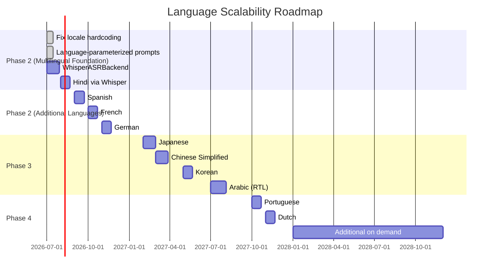
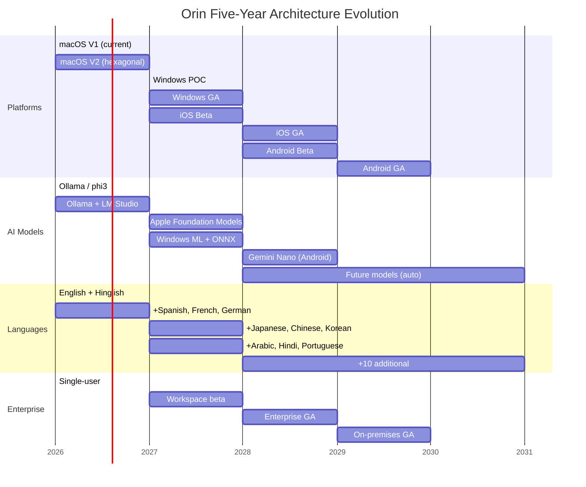

# Document 12: Scalability Roadmap

**Series**: Orin Long-Term Architecture Design  
**Document**: 12 of 13  
**Status**: Accepted  
**Date**: 2026-06-30  
**Author**: Chief Software Architect

---

## Overview

This document defines how Orin scales across five independent dimensions over the next five years: data volume, language coverage, platform coverage, AI model evolution, and user base growth. It provides concrete, measurable criteria for each scaling step, and identifies the architectural decisions that make each dimension scalable without a rewrite.

---

## 1. The Orin Scalability Insight

### Local-First Changes the Equation

A conventional SaaS application scales by adding servers. User count growth means more database load, more API capacity, more infrastructure cost. Orin is architecturally different:

**Each user's data is self-contained on their device. User count growth creates zero additional server load for core functionality.**

This is not a limitation — it is a design choice that makes Orin's scalability problems fundamentally different from, and generally easier than, those of a cloud-first application.

"Scalability" for Orin means **architectural adaptability**, not server capacity.

### Five Independent Scalability Dimensions

```
┌─────────────────────────────────────────────────────────────────────┐
│                    Orin Scalability Dimensions                       │
│                                                                       │
│  1. Data Volume   ─── 10 meetings → 10,000 meetings per user        │
│  2. Languages     ─── 2 languages → 10+ languages                   │
│  3. Platforms     ─── 1 (macOS)   → 4 (macOS, Windows, iOS, Android)│
│  4. AI Models     ─── phi3/Ollama → Future unspecified models        │
│  5. User Base     ─── 1 developer → 100,000+ users (each local)     │
└─────────────────────────────────────────────────────────────────────┘
```

Each dimension is independent. A single-user power user hits the data volume dimension. A global launch hits the language dimension. A Windows release hits the platform dimension. Each is designed for separately.

---

## 2. Data Volume Scalability

### Growth Projections

| User Type | Meetings/Day | Working Days/Year | Meetings/Year | 5-Year Total |
|-----------|-------------|------------------|---------------|-------------|
| Light | 1 | 250 | 250 | 1,250 |
| Regular | 3 | 250 | 750 | 3,750 |
| Heavy | 5 | 250 | 1,250 | 6,250 |
| Power | 8 | 250 | 2,000 | 10,000 |

**Design target: 10,000 meetings on a single device, all operations within performance budget.**

### SwiftData Performance at Scale

The primary risk as data grows is `@Query` performance. The current implementation has several queries that degrade with meeting count:

**Current defect — `allSegments @Query`:**
```swift
// WRONG: loads all transcript segments from all meetings
@Query var allSegments: [TranscriptSegment]

// RIGHT: scoped to current session, with external storage for blobs
@Query(filter: #Predicate<TranscriptSegment> { $0.sessionID == currentSessionID })
var currentSegments: [TranscriptSegment]
```

**Scale-safe SwiftData patterns:**

```swift
// @Attribute(.externalStorage) keeps blobs off the SQLite main database
// The @Query returns only metadata; the blob is fetched on demand
@Model class MeetingItem {
  @Attribute(.externalStorage) var rawTranscript: Data?
  
  // Indexed columns for fast @Query filtering
  @Attribute(.preserveValueOnDeletion) var startDate: Date
  @Attribute(.preserveValueOnDeletion) var sessionID: UUID
}
```

### Query Performance at 10,000 Meetings

| Query | Budget | Expected at 10k Meetings | Mitigation if Exceeded |
|-------|--------|-------------------------|----------------------|
| Recent meetings list (50 items) | < 100ms | ~20ms (indexed `startDate`) | Already indexed |
| Meeting by sessionID | < 10ms | ~1ms (primary key lookup) | Already indexed |
| Analysis for session | < 50ms | ~5ms (indexed sessionID) | Already indexed |
| Full-text search (all meetings) | < 500ms | ~200ms (SQLite FTS5) | FTS5 index needed |
| Knowledge graph: person's meetings | < 100ms | ~30ms (indexed edges) | Indexed in Document 08 |

### Data Retention Architecture

**Default: keep forever.** Users paid for Orin and their data belongs to them.

**Optional smart archive:**
```swift
struct RetentionPolicy: Codable {
  var archiveAfterDays: Int?            // nil = never archive
  var keepIfHasOpenActionItems: Bool    // override archive if commitments pending
  var keepRecentNMeetings: Int?         // always keep at minimum N meetings unarchived
}
```

Archived meetings:
- Transcript text compressed (zlib) and moved to `@Attribute(.externalStorage)` cold tier
- Analysis, action items, knowledge graph entries remain fully queryable
- Transcript expandable on demand (decompress on tap)
- This keeps the `@Query` result set small while preserving full history

### Scale Escalation Thresholds

Monitor these metrics and escalate architecture if thresholds are crossed:

| Metric | Warning Threshold | Action |
|--------|-----------------|--------|
| `@Query` P99 > 500ms | > 3,000 meetings | Add pagination (50 meetings per page, infinite scroll) |
| Knowledge graph query > 500ms | > 500,000 nodes | Switch specific query paths to GRDB with custom indexes |
| SwiftData save latency > 1s | > 2,000 meetings | Migrate large models to GRDB persistence adapter |
| Process RSS > 400MB | Any count | Apply `@Attribute(.externalStorage)` to all text blobs |

---

## 3. AI Model Scalability

### The Protocol Advantage

The `InferenceProvider` protocol is the AI model scalability mechanism. **Adding a new AI model = implementing one protocol.** The application does not change.

```swift
// Adding Apple Foundation Models support requires:
// 1. Implement InferenceProvider (one Swift file)
// 2. Register with ModelRouter
// That's it. No changes to InferenceWorker, AnalysisJobQueue, PromptBuilder, or any UI.

final class AppleFoundationModelsProvider: InferenceProvider {
  let providerID = "apple.foundation-models"
  var capabilities: InferenceCapabilities { ... }
  func isAvailable() async -> Bool { ... }
  func infer(job: InferenceJob) async throws -> AsyncStream<InferenceToken> { ... }
}
```

### AI Model Evolution Path

| Timeline | Provider | Model Examples | Context Window | Notes |
|----------|----------|---------------|---------------|-------|
| **Now** | Ollama | phi3, mistral, llama3.1:8b | 4k–8k | Primary local; requires Ollama |
| **Phase 2** | LM Studio | Any GGUF model | Varies | Secondary local; user-managed |
| **Phase 3** | Apple Foundation Models | Undisclosed | Unknown | macOS 26+; Apple silicon only |
| **Phase 3** | LM Studio | Larger models | Up to 128k | As hardware improves |
| **Phase 4** | Windows ML | ONNX models | Varies | Windows primary |
| **Phase 4** | Gemini Nano | On-device | ~4k | Android primary; ML Kit |
| **Phase 4** | ONNX Runtime | Any ONNX model | Varies | Universal fallback |
| **Optional** | OpenAI GPT-4o | Cloud | 128k | Consent required |
| **Optional** | Anthropic Claude | Cloud | 200k | Consent required |

### The Compounding Quality Benefit

As local models improve (Phi-4, Llama 3.2, Mistral Next), Orin users benefit automatically. The `ModelRouter` selects the best available provider for each job:

```swift
class LocalFirstRouter: ModelRouter {
  func route(job: InferenceJob, available: [any InferenceProvider]) -> (any InferenceProvider)? {
    // Always prefer highest quality local model available
    let localProviders = available.filter { $0.capabilities.isLocal }
    return localProviders
      .filter { $0.capabilities.maxContextTokens >= requiredContextFor(job) }
      .sorted { $0.capabilities.qualityScore > $1.capabilities.qualityScore }
      .first
  }
}
```

Users who upgrade their Ollama model from phi3 to llama3.1:70b get better analysis quality with zero application changes.

### Prompt Evolution Without Disruption

`PromptStrategy` protocol allows prompt iteration independently of model changes:

```swift
protocol PromptStrategy {
  var strategyID: String { get }
  var version: Int { get }
  func buildSystemPrompt(language: String, meetingType: MeetingType) -> String
  func buildUserPrompt(chunk: TranscriptChunk) -> String
}
```

`MeetingAnalysis` records which `strategyID` + `version` produced it. This enables:
- Prompt A/B testing (two strategies, random assignment per meeting)
- Quality comparison (which prompt version produced more accurate action items?)
- Rollback (if v3 prompts regress, flip ModelRouter back to v2 prompts)

---

## 4. Language Scalability

### Adding a Language: The Process

After the multilingual architecture (Document 07) is built, adding a new language is a data and testing task, not an engineering task.

**Apple-supported language (e.g., Spanish, French, German): 2–4 weeks total**

| Step | Effort | Description |
|------|--------|-------------|
| Create `LanguagePack` | 1 week | Vocabulary terms, stop words, meeting type keyword variants |
| Localize prompt keyword detection | 2 days | Add variants to `detectMeetingType()` per language |
| UI language testing | 1 week | Test with native-speaker meeting recordings |
| Ship in app update | 0 | No app store review for language packs (data, not binary) |

**Non-Apple language via Whisper (e.g., Hindi Devanagari, Thai): 3–6 weeks total**

| Step | Effort | Description |
|------|--------|-------------|
| Verify Whisper support | 1 day | Whisper supports 99 languages |
| Create `LanguagePack` | 1 week | |
| Add `ASRBackendRouter` rule | 1 day | Route this locale to `WhisperASRBackend` |
| RTL UI support (if needed) | 1 week | Arabic, Hebrew, Urdu, etc. |
| Test with native recordings | 2 weeks | Native-speaker QA required |

**No changes to `OrinCore` are ever required for language additions.** Language additions are pure adapter + data changes.

### Language Priority Queue

| Priority | Language | Market Rationale | ASR Path |
|----------|----------|-----------------|----------|
| 1 | Spanish | 500M speakers, LATAM enterprise | SpeechTranscriber |
| 2 | French | EU market, GDPR-sensitive (local-first advantage) | SpeechTranscriber |
| 3 | German | EU market, highest data privacy standards | SpeechTranscriber |
| 4 | Hindi (Devanagari) | 500M+ speakers, in progress via Whisper | Whisper |
| 5 | Japanese | Strong enterprise, unique script | SpeechTranscriber |
| 6 | Chinese (Simplified) | Huge market; cloud AI censorship constraint gives local-first advantage | SpeechTranscriber |
| 7 | Korean | Growing tech market | SpeechTranscriber |
| 8 | Arabic | Regional enterprise, RTL required | Whisper + SpeechTranscriber |
| 9 | Portuguese | Brazil + Portugal | SpeechTranscriber |
| 10 | Dutch | EU enterprise | SpeechTranscriber |

### Language Scalability Mermaid Timeline



---

## 5. Platform Scalability

### The Hexagonal Architecture Guarantee

Hexagonal Architecture (Document 03) guarantees that adding a new platform requires only:
1. Implementing the protocol adapters for that platform
2. Building the platform-specific UI

**OrinCore is unchanged for every new platform.**

### Platform Addition Effort Estimates

These estimates assume OrinCore Swift Package has been extracted (Phase 2 prerequisite):

| Platform | Effort | Prerequisites | Timeline |
|----------|--------|--------------|---------|
| Windows | 6 months | OrinCore Package, WASAPI adapter, WinUI 3 UI | Phase 3 |
| iOS | 4 months | OrinCore Package, CallKit adapter, BGProcessingTask | Phase 4 |
| Android | 8 months | OrinCore Kotlin Multiplatform port, Room, Gemini Nano | Phase 4+ |
| Linux (headless) | 3 months | OrinCore Package, ALSA adapter, no desktop UI | Future |

### Platform Expansion Gates

Clear, measurable criteria for when to begin each platform:

**Gate for Windows POC:**
- [ ] All 8 macOS protocol adapters implemented (AudioCaptureProvider, SystemAudioCaptureProvider, ASRBackend, InferenceProvider, PersistenceStore, CalendarProvider, MeetingDetector, SyncProvider)
- [ ] ServiceContainer replaced by composition root dependency injection
- [ ] OrinCore Swift Package builds cleanly with no platform-specific imports detected by CI
- [ ] `OrinCoreTests` passes with ≥ 80% coverage

**Gate for iOS Beta:**
- [ ] OrinCore Swift Package builds on iPhone Simulator without modification
- [ ] `SwiftDataPersistenceAdapter` passes contract tests on iOS
- [ ] Microphone recording via `AVAudioSession` produces valid transcript
- [ ] `BGProcessingTask` analysis completes for a 30-minute meeting
- [ ] iCloud private zone sync sends a meeting from macOS to iOS simulator

**Gate for Android:**
- [ ] OrinCore Kotlin Multiplatform port passes all shared unit tests
- [ ] `AudioRecord` adapter produces valid audio at 16kHz mono
- [ ] `RoomPersistenceAdapter` passes contract tests
- [ ] Gemini Nano produces valid analysis JSON matching the schema

---

## 6. Enterprise Scalability

### When Orin Grows to Teams

Enterprise capability must be designed now so that it doesn't require an architectural rewrite when the need arises.

**Workspace Model:**

```swift
@Model class Workspace {
  var workspaceID: UUID
  var displayName: String
  var type: WorkspaceType        // personal, team, enterprise
  var memberIDs: [UUID]
  var adminIDs: [UUID]
  var orgVocabularyConfig: OrgVocabularyConfig
  var syncProviderType: SyncProviderType
  var retentionPolicy: RetentionPolicy
}
```

A workspace is an isolation boundary. Users may belong to multiple workspaces (personal + team + client). Knowledge graphs are scoped per workspace.

**Shared Knowledge Graph:**
- Team members contribute to a shared workspace knowledge graph
- Same person appears in multiple members' meetings → merged to one node (with confidence scoring)
- Private meetings: user may exclude a session from the shared workspace graph
- Access control: Admin (read/write all), Member (read all, write own), Viewer (read only)

**Shared Vocabulary:**
- Org vocabulary tier (Tier 3) syncs across workspace members
- Admin manages org vocabulary in Workspace Settings
- Changes propagate to all members on next session start
- Member-promoted vocabulary (Tier 2) remains private to the member

### Enterprise Deployment Options

| Deployment | Sync Mechanism | Data Residency | Suitable For |
|-----------|----------------|---------------|-------------|
| Standard | iCloud private zone | User's iCloud account | SMBs, individuals |
| Enterprise Cloud | iCloud + org admin controls | iCloud (GDPR region selectable) | Regulated EU enterprises |
| On-Premises | OrinSync server (self-hosted) | On-premises | Air-gapped, highest security |
| Hybrid | iCloud for personal, OrinSync for team | Split | Large enterprises |

**OrinSync server** (on-premises):
- An open-source, self-hosted Swift server application
- Implements the `SyncProvider` protocol
- Identical data model to iCloud sync (PersistenceStore protocol)
- Operators never see plaintext data — encryption happens on client before transmission

---

## 7. Infrastructure Scalability for Orin, Inc.

### What Orin, Inc. Does NOT Handle

| Data | Reason Not Server-Handled |
|------|--------------------------|
| User transcripts | Local-first design; never transmitted |
| User analyses | Local-first design; never transmitted |
| Knowledge graphs | Local-first design; never transmitted |
| Vocabulary | Local-first design; never transmitted |

**Zero user content on Orin, Inc. servers.** This is the privacy guarantee and the scalability advantage.

### What Orin, Inc. Does Handle

| Service | Scales With | Technology | Cost Model |
|---------|------------|-----------|-----------|
| Plugin Marketplace | Plugin count (not user count) | CDN (static binaries) | Near-zero at 100k plugins |
| Language Pack CDN | Pack count × download events | CDN (S3 + CloudFront) | < $0.01 per user per year |
| Enterprise License Server | Active enterprise accounts | Stateless REST API | Scales to 10k enterprises |
| Anonymous Crash Reports | User count | Time-series aggregation | Aggregate only; no user data |
| Documentation site | Traffic | Static site CDN | Negligible |

**Infrastructure cost at 100,000 users: estimated < $5,000/month** (CDN costs only; no database servers, no AI inference servers, no storage for user data).

---

## 8. The Compounding Advantages of Local-First at Scale

As the user base grows, local-first becomes a stronger competitive moat, not a weaker one:

```
┌─────────────────────────────────────────────────────────────────────┐
│         Scale Stage    │ Cloud-AI Competitors    │ Orin Local-First  │
├─────────────────────────────────────────────────────────────────────┤
│ 100 users              │ Fast cloud AI           │ No infra cost     │
│ 10,000 users           │ Analytics available     │ Zero breach risk  │
│ 100,000 users          │ Scale savings           │ Privacy regs met  │
│ Enterprise             │ Centralised admin       │ Air-gap possible  │
│ Regulated industries   │ Compliance burden       │ Local = compliant │
└─────────────────────────────────────────────────────────────────────┘
```

**Privacy as a regulatory moat**: As the EU AI Act, US state AI laws, and sector-specific regulations (HIPAA, GDPR, FCA) tighten their requirements on AI processing of personal conversations, local-first compliance is achieved architecturally. Competitors pay compliance costs; Orin's architecture already satisfies them.

**Model quality compounding**: As local AI models improve — Phi-4 is better than phi3, Llama 3.2 is better than Llama 3.1 — Orin users get better analysis quality automatically, without infrastructure upgrades and without any action from Orin, Inc.

**Vocabulary compounding**: The longer a user uses Orin, the more personalized it becomes. Their learned vocabulary, meeting patterns, and knowledge graph compound over time. This creates genuine switching costs without lock-in — users can always export their vocabulary and data.

---

## 9. Five-Year Architecture Vision

### Year-by-Year Goals



### Year 1 (2026): Stable Foundation

- macOS V2: hexagonal architecture, all protocol adapters
- Event-driven communication between bounded contexts
- InferenceWorker actor (Ollama thundering herd fix)
- All critical audio thread defects resolved
- Spanish + French + German language support
- Plugin system beta (first-party plugins: Linear, Notion, Slack)
- Knowledge graph V1

### Year 2 (2027): Multi-Platform Expansion

- Windows POC → Windows GA
- iOS beta
- Apple Foundation Models integration (macOS 26+)
- 8 languages fully supported
- Plugin marketplace launched
- Enterprise workspace beta

### Year 3 (2028): Global Scale

- iOS GA, Android beta
- 10+ languages supported
- Enterprise GA
- Knowledge graph as a rich query surface (timeline view, relationship explorer)
- Agent workflows via MCP integration

### Year 4 (2029): Platform Parity

- Android GA
- 12+ languages
- All platform sync working (iCloud, OneDrive, Google Drive)
- On-premises enterprise option
- Multi-workspace for power users

### Year 5 (2030): Intelligence Platform

- Knowledge graph as the primary product surface (not meeting recordings)
- "What has my team committed to this quarter?" is a first-class query
- Orin becomes an ambient professional intelligence layer
- MCP agents can call Orin as a knowledge source
- Full voice of the user: any AI model, any platform, any language

---

## 10. Architecture Decision Gates for Scaling

Clear go/no-go criteria prevent premature scaling:

**Before Windows POC begins:**
- All macOS adapters behind protocols (measurable: ServiceContainer removed)
- OrinCore builds with `swift build --target OrinCore` on macOS with zero platform imports
- `OrinCoreTests` passes at ≥ 80% coverage

**Before iOS Beta begins:**
- OrinCore builds on `arm64-apple-ios` target without modification
- iCloud private zone sync tested with real meetings (not mocks)
- Background processing tested with `BGTaskSchedulerMock` in CI

**Before Android begins:**
- OrinCore Kotlin Multiplatform port passes all unit tests that Swift OrinCore passes
- `PersistenceStore` contract test suite passes on `RoomPersistenceAdapter`
- Cross-platform data format: one meeting exported from macOS imports correctly on Android

**Before Enterprise GA:**
- Workspace isolation tested: meeting from Workspace A not visible in Workspace B
- Admin vocabulary propagation tested: org vocab change appears in all members' next sessions
- On-premises OrinSync server tested in air-gapped network environment

---

## Summary

Orin's scalability is designed around a simple insight: because it is local-first, the hardest scalability problems (database load, AI inference cost, data breach risk) simply do not apply. The problems that remain — data volume per device, language coverage, platform adapters, AI model evolution — are all solved by the same architectural decisions:

1. **`PersistenceStore` protocol + `@Attribute(.externalStorage)`** solves data volume
2. **`ASRBackend` + `LanguagePack` + `PromptBuilder` with `responseLanguage`** solves language
3. **`OrinCore` Swift Package with zero platform imports** solves platform coverage
4. **`InferenceProvider` + `ModelRouter`** solves AI model evolution
5. **Local-first design** solves user base growth (no server capacity needed)

Each dimension scales independently. Adding language support does not affect the AI model architecture. Adding a new platform does not require changes to the learning engine. This independence is the payoff of the bounded context design in Document 01.
